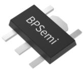
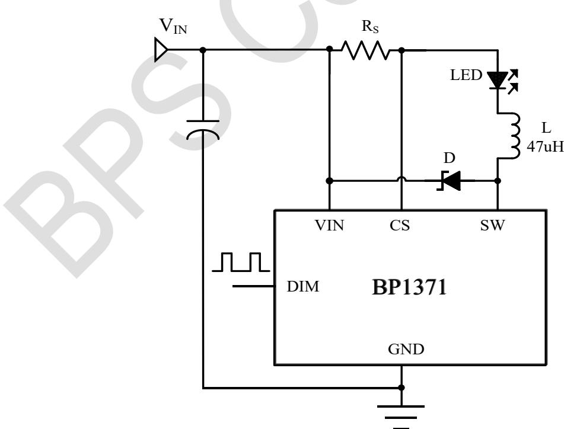
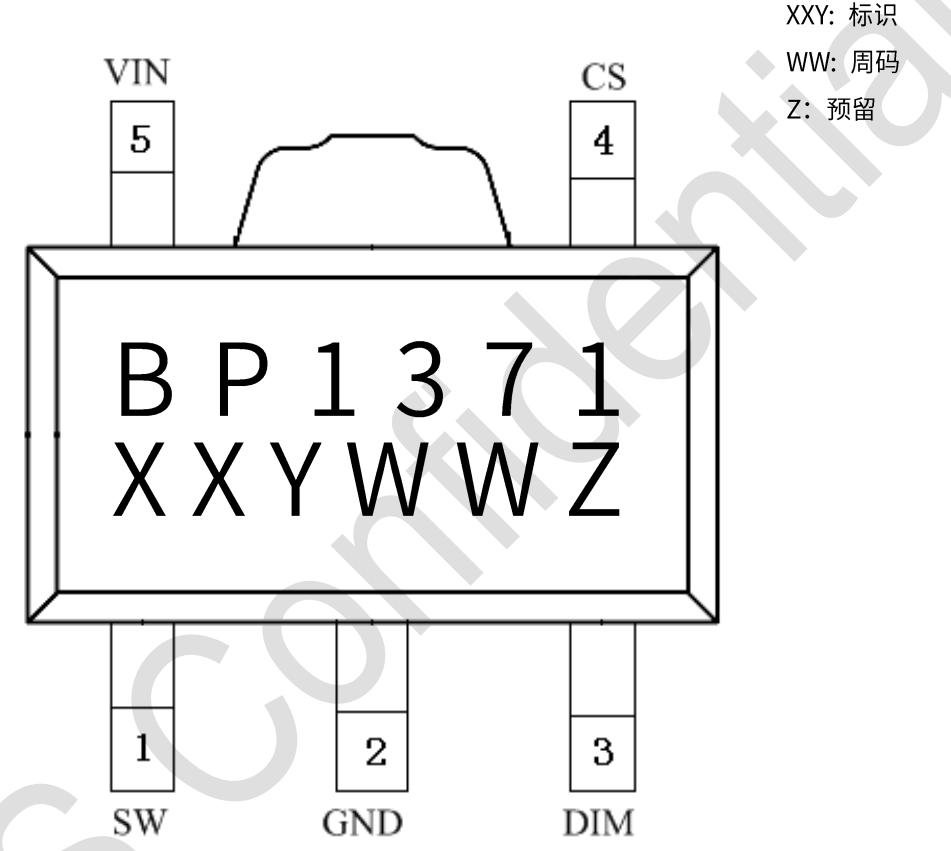
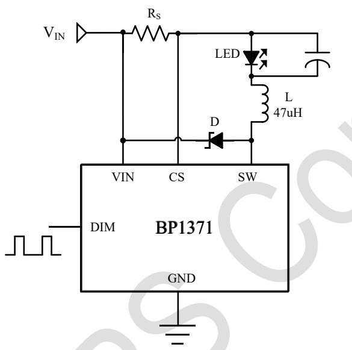
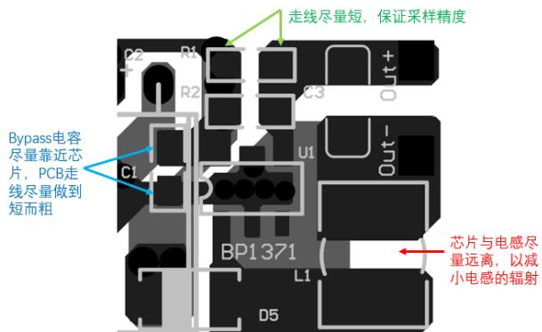
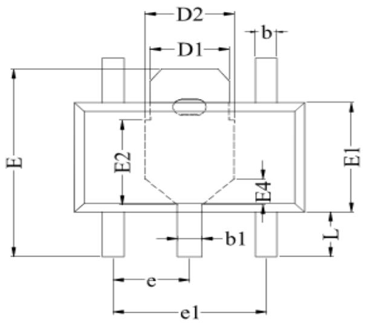
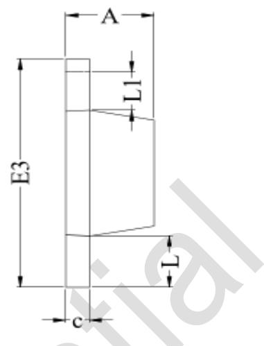
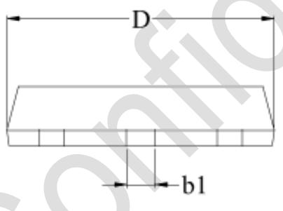

## BP1371 40V/1.2A 高调光比 LED 恒流驱动芯片

## 概述

BP1371 是一款驱动高亮度 LED 的降压恒流驱动芯片，BP1371 外部采用极少的元器件，为 MR16 LED 灯杯、LED 舞台灯、车载 LED 灯、太阳能 LED 灯和 LED 路灯提供一个极高性价比的解决方案。BP1371 输入电压范围从 5V 到 40V，输出电流通过采样电阻设定，单颗 LED 最大输出电流可达 1.2A。BP1371 采用先进技术的恒流控制方法获得较好的 LED 电流精度。BP1371 通过 DIM 引脚接受 0.5-2.5V 的模拟调光以及频率范围很宽的 PWM 调光。当 DIM 的电压低于 0.3V 时，功率开关关断，BP1371 进入极低工作电流的待机状态。

BP1371 内置功率开关，根据不同的输入电压，BP1371 可以驱动多颗 1W 或 3W 的 LED。BP1371 包含过温保护、LED 短路和开路保护功能。

BP1371 采用 SOT89-5 封装。

## 应用

◆ MR16/11 LED 射灯代替卤素灯

车载LED灯

◆ LED 舞台灯

◆ 太阳能 LED 灯

LED 信号灯

◆ LED 路灯

## 特点

◆ 极少的外部元器件

◆ 很宽的输入电压范围：从 5V 到 40V

◆ LED 开路保护

LED 短路保护

◆ 过温保护

◆ 最大输出 1.2A 的电流

◆ 复用 DIM 引脚进行 LED 模拟调光和 PWM 调光

◆ 高达 97% 的效率

◆ 输出可调的恒流控制方法

## 典型应用电路

  
图 1 BP1371 典型应用图

## 定购信息

<table><tr><td>定购型号</td><td>封装</td><td>包装形式</td><td>打印</td></tr><tr><td>BP1371</td><td>SOT89-5</td><td>编带4000颗/盘</td><td>BP1371XXYWWZ</td></tr></table>

## 芯片管脚

## 管脚描述

<table><tr><td>管脚号</td><td>管脚名称</td><td>描述</td></tr><tr><td>1</td><td>SW</td><td>功率开关管的漏端</td></tr><tr><td>2</td><td>GND</td><td>信号和功率地</td></tr><tr><td>3</td><td>DIM</td><td>开关使能、模拟和 PWM 调光端</td></tr><tr><td>4</td><td>CS</td><td>电流采样端,采样电阻接在 CS 和 VIN 端之间</td></tr><tr><td>5</td><td>VIN</td><td>电源输入端,必须就近接旁路电容</td></tr></table>

## 极限参数(注 1)

<table><tr><td>符号</td><td>参数</td><td>参数范围</td><td>单位</td></tr><tr><td>VIN</td><td>电源电压</td><td>-0.3~42</td><td>V</td></tr><tr><td>SW</td><td>功率开关的漏端</td><td>-0.3~42</td><td>V</td></tr><tr><td>CS</td><td>电流采样端(相对VIN)</td><td>+0.3~(-6.0)</td><td>V</td></tr><tr><td>DIM</td><td>开关使能、模拟和PWM调光端</td><td>-0.3~6</td><td>V</td></tr><tr><td>ISW</td><td>功率开关输出电流</td><td>1.8</td><td>A</td></tr><tr><td>PDMAX</td><td>功耗(注2)</td><td>0.6</td><td>W</td></tr><tr><td>PTR</td><td>热阻,SOT89-5 (θJA)</td><td>100</td><td>°C/W</td></tr><tr><td>TJ</td><td>工作结温范围</td><td>-40 to 150</td><td>°C</td></tr><tr><td>TSTG</td><td>储存温度范围</td><td>-55 to 150</td><td>°C</td></tr><tr><td></td><td>ESD(注3)</td><td>2</td><td>kV</td></tr></table>

注1：最大极限值是指超出该工作范围，芯片有可能损坏。推荐工作范围是指在该范围内，器件功能正常，但并不完全保证满足个别性能指标。电气参数定义了器件在工作范围内并且在保证特定性能指标的测试条件下的直流和交流电参数规范。对于未给定上下限值的参数，该规范不予保证其精度，但其典型值合理反映了器件性能。

注2：温度升高最大功耗一定会减小，这也是由TJMAX, $\theta_{\mathrm{JA}}$ 和环境温度TA所决定的。最大允许功耗为 $P_{DMAX} = (T_{JMAX} - T_A) / \theta_{\mathrm{JA}}$ 或是极限范围给出的数字中比较低的那个值。

注 3：人体模型，100pF 电容通过 1.5kΩ 电阻放电。

## 推荐工作范围

<table><tr><td>符号</td><td>参数</td><td>参数范围</td><td>单位</td></tr><tr><td> $V_{IN}$ </td><td>电源电压</td><td>0~40</td><td>V</td></tr><tr><td> $T_{OPT}$ </td><td>工作温度</td><td>-40 to +105</td><td>°C</td></tr></table>

电气参数(注 4, 5) （无特别说明 $V_{IN}=12V, T_{A}=25^{\circ}C$ )

<table><tr><td>符号</td><td>参数</td><td>测试条件</td><td>最小值</td><td>典型值</td><td>最大值</td><td>单位</td></tr><tr><td colspan="7">输入电压</td></tr><tr><td>VIN</td><td>输入电压</td><td></td><td>5</td><td></td><td>40</td><td>V</td></tr><tr><td>VUVLO</td><td>欠压保护</td><td>VIN下降</td><td></td><td>4.3</td><td></td><td>V</td></tr><tr><td>VUVLO,HYS</td><td>欠压保护迟滞</td><td>VIN上升</td><td></td><td>100</td><td></td><td>mV</td></tr><tr><td colspan="7">电流采样</td></tr><tr><td>VCS</td><td>平均采样电压</td><td>VIN-VCS</td><td></td><td>95</td><td></td><td>mV</td></tr><tr><td>VCS_hys</td><td>采样电压迟滞</td><td></td><td></td><td>±15</td><td></td><td>%</td></tr><tr><td>ICS</td><td>CS管脚输入电流</td><td>VIN-VCS=50mV</td><td></td><td>8</td><td></td><td>μA</td></tr><tr><td colspan="7">工作频率</td></tr><tr><td>FSW</td><td>最大工作频率</td><td></td><td></td><td></td><td>1</td><td>MHz</td></tr><tr><td colspan="7">关断电流</td></tr><tr><td>IOFF</td><td>关断电流</td><td>VDIM&lt;0.3V</td><td></td><td>100</td><td></td><td>μA</td></tr><tr><td colspan="7">DIM输入</td></tr><tr><td>VDIM</td><td>内部电路工作电压</td><td>DIM浮空</td><td></td><td>5</td><td></td><td>V</td></tr><tr><td>VDIM_H</td><td>DIM输入高电平</td><td></td><td>2.5</td><td></td><td></td><td>V</td></tr><tr><td>VDIM_L</td><td>DIM输入低电平</td><td></td><td></td><td></td><td>0.3</td><td>V</td></tr><tr><td>RDIM</td><td>DIM对内部工作电压上拉电阻</td><td></td><td></td><td>150</td><td></td><td>kΩ</td></tr><tr><td>IDIM_L</td><td>DIM接地漏电流</td><td>VDIM=0</td><td></td><td>33</td><td></td><td>μA</td></tr><tr><td colspan="7">DIM调光</td></tr><tr><td>VDIM_DC</td><td>模拟调光电压范围</td><td></td><td>0.5</td><td></td><td>2.5</td><td>V</td></tr><tr><td>fDIM</td><td>最大PWM调光频率</td><td>fosc=500kHz</td><td></td><td></td><td>50</td><td>kHz</td></tr><tr><td rowspan="2">DPWM_LF</td><td>低频PWM调光占空比范围</td><td>fdIM=100Hz</td><td>0.05%</td><td></td><td>1</td><td></td></tr><tr><td>低频PWM调光比</td><td></td><td></td><td>2000:1</td><td></td><td></td></tr><tr><td rowspan="2">DPWM_HF</td><td>高频PWM调光占空比范围</td><td>fdIM=20KHz</td><td>10%</td><td></td><td>1</td><td></td></tr><tr><td>高频PWM调光比</td><td></td><td></td><td>10:1</td><td></td><td></td></tr><tr><td colspan="7">功率开关</td></tr><tr><td>RSW</td><td>SW导通电阻</td><td></td><td></td><td>280</td><td></td><td>mΩ</td></tr><tr><td>ISWmean</td><td>SW连续电流</td><td></td><td></td><td></td><td>1.2</td><td>A</td></tr><tr><td>ILEAK</td><td>SW漏电流</td><td></td><td></td><td>0.5</td><td>5</td><td>μA</td></tr><tr><td colspan="7">过温保护</td></tr><tr><td>TSD</td><td>过热保护温度</td><td></td><td></td><td>150</td><td></td><td>°C</td></tr><tr><td>TSD-hys</td><td>过热保护迟滞</td><td></td><td></td><td>20</td><td></td><td>°C</td></tr></table>

注 4：典型参数值为 $25^{\circ}$ C 下测得的参数标准。  
注5：规格书的最小、最大规范范围由测试保证，典型值由设计、测试或统计分析保证。

## 工作原理描述

BP1371 和电感（L）、电流采样电阻（Rs）形成一个自振荡的连续电感电流模式的降压型恒流 LED 控制器。

$V_{IN}$ 上电时，电感（L）和电流采样电阻（Rs）的初始电流为零，LED 输出电流也为零。这时候，CS 比较器的输出为高，内部功率开关导通，SW 的电位为低。电流通过电感（L）、电流采样电阻（Rs）、LED 和内部功率开关从 $V_{IN}$ 流到地，电流上升的斜率由 $V_{IN}$ 、电感（L）和 LED 压降决定，在 RS 上产生一个压差 $V_{CS}$ ，当 $(V_{IN}-V_{CS})>110mV$ 时，CS 比较器的输出变低，内部功率开关关断，电流以另一个斜率流过电感（L）、电流采样电阻（Rs）、LED 和肖特基二极管（D），当 $(V_{IN}-V_{CS})<80mV$ 时，功率开关重新打开，这样使得在 LED 上的平均电流为

$$
I _ {O U T} = \frac {0 . 0 8 + 0 . 1 1}{2 \times R s} = 0. 0 9 5 / R s
$$

高端电流采样结构使得外部元器件数量很少，采用 1% 精度的采样电阻，LED 输出电流获得较高的精度。

BP1371 可以在 DIM 管脚加 PWM 信号进行调光，DIM 管脚电压低于 0.3V 关断 LED 电流，高于 2.5V 全部打开 LED 电流，PWM 调光的频率范围从 100Hz 到 20kHz 以上。当高电平在 0.5V 到 2.5V 之间，也可以调光，具体应用细节见后面应用说明。

DIM 管脚也可以通过外加直流电压 $(V_{DIM})$ 调小 LED 电流（模拟调光），最大 LED 电流由采样电阻 Rs 决定。直流电压 $(V_{DIM})$ 的有效的调光范围是 0.5V 到 2.5V。当直流电压 $(V_{DIM})$ 高于 2.5V，输出 LED 电流保持恒定，并由 $(0.095/Rs)$ 设定。LED 电流还可以通过 DIM 到地之间接一个电阻到进行调节，内部有一个上拉电阻（典型 150kΩ）接在内部稳压电压 5V 上，DIM 管脚的电压由内部和外部的电阻分压决定。

DIM 管脚在正常工作时可以浮空。当加在 DIM 上的电压低于 0.3V 时，内部功率开关关断，LED 电流也降为零。关断期间，内部稳压电路保持待机工作，静态电流仅为 $100\mu A$ 。

此外，为了保证可靠性，BP1371 内部包含过热保护功能（TSD）。BP1371 还可以通过 DIM 管脚外接热敏电阻（NTC）到 LED 附近，检测 LED 温度动态调节 LED 电流保护 LED，详见后面应用说明。

## 应用说明

通过外部电流采样电阻Rs设定LED平均电流

LED 的平均电流由连接在 $V_{IN}$ 和 CS 两端的电阻 Rs 决定：

$$
I _ {O U T} = \frac {0 . 0 9 5}{R s}
$$

上述等式成立的前提是 DIM 端浮空或外加 DIM 端电压高于 2.5V（但必须低于 5V）。实际上，Rs 是设定了 LED 的最大输出电流，通过 DIM 端，LED 实际输出电流能够调小到任意值。

## 通过直流电压实现模拟调光

DIM 端可以外加一个直流电压( $V_{DIM}$ )调小 LED 输出电流，最大 LED 输出电流由（0.095/Rs）设定，如图所示：

LED 平均输出电流计算公式:

$$
I _ {O U T} = \frac {0 . 0 9 5 \times (V _ {D I M} - 0 . 5)}{2 \times R s}
$$

$$
(0. 5 V \leq V _ {D I M} \leq 2. 5 V)
$$

VDIM在 $(2.5V\leq V_{DIM}\leq 5V)$ 范围内LED保持 $100\%$ 电

流等于 $I_{OUT}=\frac{0.095}{Rs}$

## 通过PWM信号实现调光

LED 的最大平均电流由连接在 $V_{IN}$ 和 CS 两端的电阻 $R_{s}$ 决定，通过在 DIM 管脚加入可变占空比的 PWM 信号可以调小输出电流以实现调光，计算方法如下所示：

$$
I _ {O U T} = \frac {0 . 0 9 5 \times D}{R s}
$$

$$
(0 \leq D \leq 100 \%, 2.5V <   V _ {p u l s e} <   5V)
$$

如果高电平小于 2.5V，则

$$
I _ {O U T} = \frac {(V _ {p u l s e} - 0 . 5) \times 0 . 0 9 5 \times D}{2 \times R s}
$$

$$
(0 \leq D \leq 100\%, 0.5V <   V _ {p u l s e} <   2.5V)
$$

通过 PWM 调光, LED 的输出电流可以从 0% 到 100% 变化。LED 的亮度是由 PWM 信号的占空比决定的。例如 PWM 信号 25% 占空比，LED 的平均电流为 (0.095/Rs) 的 25%。建议设置 PWM 调光频率在 120Hz 以上，以避免人的眼睛可以看到 LED 的闪烁。PWM 调光比模拟调光的优势在于不改变 LED 的色度。BP1371 调光频率最高可达到 20kHz.

## 关断模式

通过在 DIM 端接入 0.3V 以下的电压，实现系统关断，通常情况下，系统的静态电流为 $100\mu A$ 。

## 软启动模式：

通过在 DIM 接入一个外部电容，使得启动时 DIM 端电压缓慢上升，这样 LED 的电流也缓慢上升，从而实现软启动。通常情况下，软启动时间和外接电容的关系大约为 $150 \mu s/nF$ .

## LED开路、短路保护

BP1371 具有输出开路保护功能，负载一旦开路，芯片将被设置于安全的低功耗模式。LED 短路时，系统进入低频的限流保护的安全工作模式。

## 旁路电容

在电源输入必须就近接一个低等效串联电阻（ESR）的旁路电容，ESR 越大，效率损失会变大。该旁路电容要能承受较大的峰值电流，并能使电源的输入电流平均，减小对输入电源的冲击。直流输入时，该旁路电容的最小值为2.2μF，在交流输入或低电压输入，旁路电容需要220μF的钽电容或类似电容。该旁路电容尽可能靠近芯片的输入管脚。

为了保证在不同温度和工作电压下的稳定性，建议使用X5R/X7R的电容。

## 选取电感

BP1371 的输出电流在 0-1.2A 的范围内，推荐使用的电感参数范围为 47μH。电感的饱和电流必须要比输出电流高 30% 到 50%。

## 选取二极管

为了保证最大的效率以及性能，二极管（D）应选择快速恢复、低正向压降、低寄生电容、低漏电的肖特基二极管，电流能力以及耐压视具体的应用而定，但应保持30%的余量，有助于稳定可靠的工作。

另外值得注意的一点是应考虑温度高于 $85^{\circ}$ C 时肖特基的反向漏电流。过高的漏电会导致增加系统的功率耗散。

AC12V 整流二极管（D）一定要选用低压降的肖特基二极管，以降低自身功率耗散。

## 降低输出纹波

如果需要减少输出电流纹波，一个最有效的方法即在 LED 的两端并联一个电容。

1μF 的电容可以使输出纹波减少大约 1/3。适当的增大输出电容可以抑制更多的纹波。需要注意的是输出电容不会影响系统的工作频率和效率，但是会影响系统启动延时以及调光频率。

## 低输入电压下工作注意事项

系统在输入电压低于Vuvlo时IC内部的功率开关管处于关断状态，直到输入电压高于（Vuvlo+100mV）系统才会正常启动。但是有一种特殊情况即输入电压虽然高于（Vuvlo+100mV），但是过于接近输出电压，会导致系统长时间工作在高占空比的状态，如果输出电流比较大，功率耗散也会增大。长时间工作的情况下，有可能导致 IC 过热保护（过热保护详见后续说明）。在实际应用中，适当的保持输入输出电压的压差是非常必要的。在工作状态下，输入电压降至 VuvLO 以下时，内部开关管会关闭，系统停止输出。

## 散热注意事项

当系统工作的环境温度较高时，以及驱动大电流负载时，必须要注意避免系统达到功率极限。芯片管脚焊接处的敷铜面积大有利于散热。在实际应用中，要求达到每 $25 ~mm^{2}$ 的 PCB 大约需要 1oz 敷铜的电流密度以有利于散热。

需要注意的是选择了不恰当的电感，以及开关转换点存在过大的寄生电容会导致系统效率的降低。

## 负载电流的热补偿

高亮度 LED 有时需要提供温度补偿电流以保证可靠稳定的工作，BP1371 可以通过 DIM 管脚外接热敏电阻(NTC)或者二极管（负温度系数）到 LED 附近，检测 LED 温度动态调节 LED 电流以保护 LED。随着温度升高，DIM 端电压降低，从而降低 LED 输出电流，实现系统的温度补偿。

## IC过热保护(TSD)

BP1371 内部设置了过温保护功能（TSD），以保证系统稳定可靠的工作。当 IC 芯片温度超出 $150^{\circ}$ C，IC 即会进入 TSD 保护状态并停止电流输出，而当温度低于 $130^{\circ}$ C 时，IC 即会重新恢复至工作状态。

## PCB布板的注意事项

合理的 PCB 布局 对于最大程度保证系统稳定性以及低噪声来说很重要。使用多层 PCB 板是避免噪声干扰的一种很有效的办法。为了有效减小电流回路的噪声，输入旁路电容应当另行接地。

## SW端

SW 端处在快速开关的节点，所以 PCB 走线应当尽可能的短，另外芯片的 GND 端应保持尽量良好的接地。

## Bypass 电容、电感、电流采样电阻

布板中要注意的电感尽量远离芯片，以减小电感的辐射。如果PCB板允许，请尽量多铺铜，并接到电源的GND或

Vcc，以吸收电感产生的干扰。另外一个需要非常注意的事项是尽量减小Rs两端走线引起的寄生电感，以保证采样的精度。Bypass电容尽可能靠近芯片，并做到走线短而粗。如图：

## 封装信息

  
TOP VIEW

  
SIDE VIEW

SIDE VIEW

<table><tr><td>SYMBOL</td><td>MIN</td><td>NOM</td><td>MAX</td></tr><tr><td>A</td><td>1.40</td><td>-</td><td>1.60</td></tr><tr><td>b</td><td>0.34</td><td>-</td><td>0.47</td></tr><tr><td>b1</td><td>0.42</td><td>-</td><td>0.55</td></tr><tr><td>c</td><td>0.35</td><td>-</td><td>0.46</td></tr><tr><td>D</td><td>4.40</td><td>-</td><td>4.60</td></tr><tr><td>D1</td><td>1.45</td><td>-</td><td>1.80</td></tr><tr><td>D2</td><td colspan="3">1.75 REF</td></tr><tr><td>E</td><td>3.95</td><td>-</td><td>4.30</td></tr><tr><td>E1</td><td>2.30</td><td>-</td><td>2.60</td></tr><tr><td>E2</td><td>-</td><td>1.90</td><td>-</td></tr><tr><td>E3</td><td>4.10</td><td>-</td><td>4.60</td></tr><tr><td>E4</td><td colspan="3">0.55 REF</td></tr><tr><td>e</td><td>1.00</td><td>-</td><td>2.00</td></tr><tr><td>e1</td><td>2.90</td><td>-</td><td>3.10</td></tr><tr><td>L</td><td>0.90</td><td>-</td><td>1.10</td></tr><tr><td>L1</td><td>0.60</td><td>-</td><td>0.80</td></tr></table>

## 版本信息

<table><tr><td>版本</td><td>日期</td><td>记录</td></tr><tr><td>Rev. 1.0</td><td>2018/08</td><td>首次发行</td></tr><tr><td>Rev. 1.1</td><td>2019/08</td><td>去掉 page6 电流公式的备注</td></tr><tr><td>Rev. 1.2</td><td>2020/08</td><td>增加重要说明;去掉专利;更新丝印</td></tr><tr><td>Rev. 1.3</td><td>2024/12</td><td>格式更新;修改 layout 建议 PCB 图</td></tr><tr><td></td><td></td><td></td></tr><tr><td></td><td></td><td></td></tr></table>

## 免责声明

晶丰明源尽力确保本产品规格书内容的准确和可靠，但是保留在没有通知的情况下，修改规格书内容的权利。

本产品规格书未包含任何针对晶丰明源或第三方所有的知识产权的授权。针对本产品规格书所记载的信息，晶丰明源不做任何明示或暗示的保证，包括但不限于对规格书内容的准确性、商业上的适销性、特定目的的适用性或者不侵犯晶丰明源或任何第三人知识产权做任何明示或暗示保证，晶丰明源也不就因本规格书本身及其使用有关的偶然或必然损失承担任何责任。

## 电子器件报废说明

该产品在生命周期结束后，由客户按照一般电子产品的报废流程进行处理。