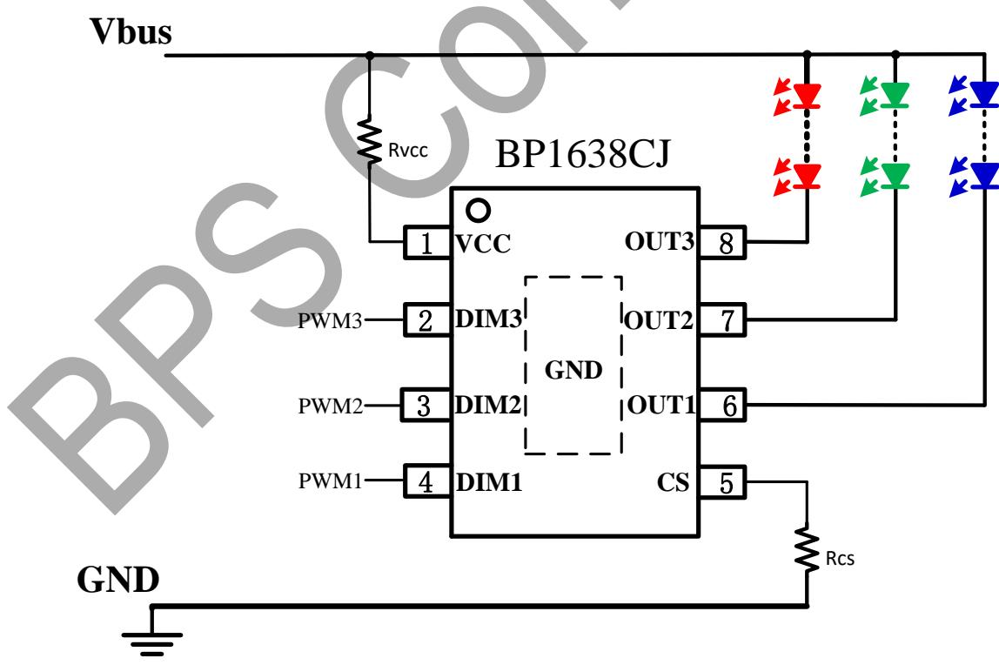
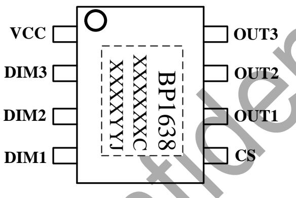
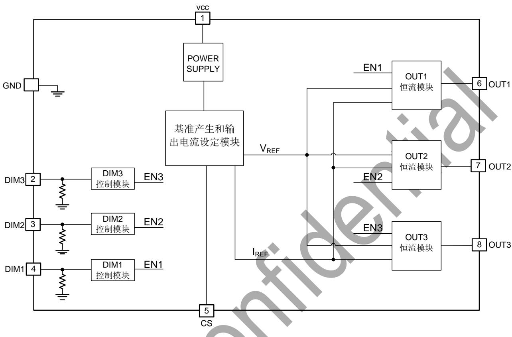
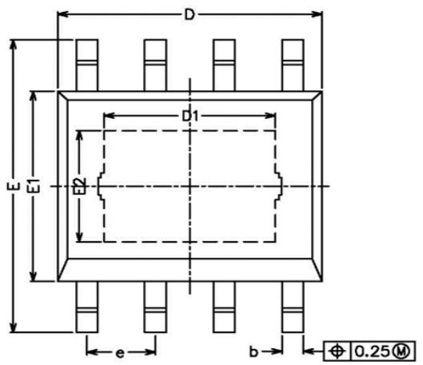
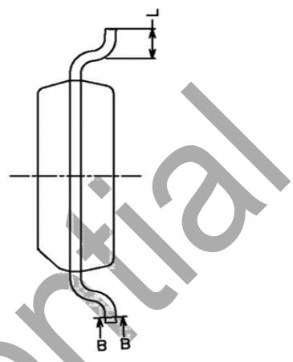
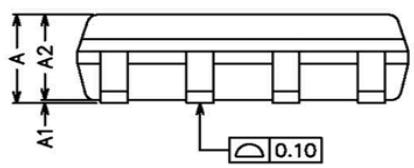

## 概述

BP1638CJ 是一款三通道可调光 LED 线性恒流驱动芯片，内置 40V/200mAMOSFET，通过调节输入的 3 路 PWM 信号占空比，来调整对应 LED 光源的电流，从而达到调光目的。

BP1638CJ 支持 PWM 调光信号，可以搭配常见的调光模块实现调光功能。

BP1638CJ 具有过温调节功能。当 LED 电流过大导致芯片温度过高时，将降低输出电流。

## 特点

■ 三路线性 PWM 调光

■ 内置三路 40V/200mA MOSFET

■ 兼容 10kHz 以下的 PWM 信号

■ 单个 Rcs 设定三路输出电流

■ 待机电流 $< 100\mathrm{uA}$

■ 芯片间输出电流偏差±4%

■ 芯片内三路之间输出电流偏差±3%

■ 采用 ESOP8 封装

## 应用

■ LED 调光调色智能灯泡

■ 其他 LED 智能照明

## 典型应用

  
图 1. BP1638CJ 典型应用图

## 定购信息

<table><tr><td>定购型号</td><td>封装</td><td>包装形式</td><td>打印</td></tr><tr><td>BP1638CJ</td><td>ESOP8</td><td>编带4000 颗/盘</td><td>BP1638XXXXXXCXXXXYYJ</td></tr></table>

## 管脚封装

  
图 2 管脚封装图

XXXXXXY: lot code

XXXX: Sign

YY: Week

## 管脚描述

<table><tr><td>管脚号</td><td>管脚名称</td><td>描述</td></tr><tr><td>1</td><td>VCC</td><td>芯片电源输入端口</td></tr><tr><td>2,3,4</td><td>DIM3/2/1</td><td>PWM信号输入端口,高电平有效(默认下拉)</td></tr><tr><td>5</td><td>CS</td><td>输出电流设置端口</td></tr><tr><td>6,7,8</td><td>OUT1/2/3</td><td>内部 MOSFET 漏极</td></tr><tr><td>衬底</td><td>GND</td><td>芯片地</td></tr></table>

## 极限参数(注 1)

<table><tr><td>符号</td><td>参数</td><td>参数范围</td><td>单位</td></tr><tr><td>VCC</td><td>芯片电源输入端口</td><td>-0.3~40</td><td>V</td></tr><tr><td>DIM1/2/3</td><td>DIM1/2/3 端口耐压</td><td>-0.3~20</td><td>V</td></tr><tr><td>CS</td><td>CS端口耐压</td><td>-0.3~6</td><td>V</td></tr><tr><td>OUT1/2/3</td><td>OUT1/2/3端口耐压</td><td>-0.3~40</td><td>V</td></tr><tr><td>IOUT_MAX</td><td>单通道内部功率管漏极最大电流</td><td>200</td><td>mA</td></tr><tr><td>PDMAX</td><td>功耗(注 2)</td><td>1.25</td><td>W</td></tr><tr><td> $\theta_{JA}$ </td><td>PN结到环境的热阻</td><td>100</td><td>°C/W</td></tr><tr><td>TJ</td><td>工作结温范围</td><td>-40 to 150</td><td>°C</td></tr><tr><td>TSTG</td><td>储存温度范围</td><td>-55 to 150</td><td>°C</td></tr></table>

注1：最大极限值是指超出该工作范围，芯片有可能损坏。推荐工作范围是指在该范围内，器件功能正常，但并不完全保证满足个别性能指标。电气参数定义了器件在工作范围内并且在保证特定性能指标的测试条件下的直流和交流电参数规范。对于未给定上下限值的参数，该规范不予保证其精度，但其典型值合理反映了器件性能。

注2：温度升高最大功耗一定会减小，这也是由 $T_{\mathrm{JMAX}}$ ， $\theta_{\mathrm{JA}}$ 和环境温度 $T_{\mathrm{A}}$ 所决定的。最大允许功耗为 $P_{\mathrm{DMAX}} = (T_{\mathrm{JMAX}} - T_{\mathrm{A}}) / \theta_{\mathrm{JA}}$ 或是极限范围给出的数字中比较低的那个值。

电气参数（注3,4)(无特别说明情况下, $V_{CC}=15V$ , $T_{A}=25^{\circ}C$ )

<table><tr><td>符号</td><td>描述</td><td>条件</td><td>最小值</td><td>典型值</td><td>最大值</td><td>单位</td></tr><tr><td colspan="7">电源电压(VCC)</td></tr><tr><td> $V_{CC\_ON}$ </td><td> $V_{CC}$ 开启电压</td><td></td><td>4</td><td>4.7</td><td>5.3</td><td>V</td></tr><tr><td> $V_{CC\_UVLO}$ </td><td> $V_{CC}$ 关断电压</td><td></td><td>3.8</td><td>4.4</td><td>4.9</td><td>V</td></tr><tr><td> $V_{CC\_HYS}$ </td><td> $V_{CC}$ 开启和关断电压迟滞</td><td></td><td></td><td>0.3</td><td></td><td>V</td></tr><tr><td> $I_{STY}$ </td><td>待机工作电流</td><td>PWM=0V</td><td></td><td>65</td><td>100</td><td>uA</td></tr><tr><td> $I_{QCC}$ </td><td>静态工作电流</td><td>PWM=3.3V</td><td></td><td>2.2</td><td></td><td>mA</td></tr><tr><td colspan="7">PWM (DIM1/2/3)</td></tr><tr><td>PWM_H</td><td>PWM 高电平</td><td></td><td>2.3</td><td></td><td></td><td>V</td></tr><tr><td>PWM_L</td><td>PWM 低电平</td><td></td><td></td><td></td><td>0.7</td><td>V</td></tr><tr><td> $R_{PWM}$ </td><td>PWM 下拉电阻</td><td></td><td></td><td>5.5</td><td></td><td>KΩ</td></tr><tr><td> $F_{PWM}$ </td><td>有效调光频率</td><td></td><td>0.5</td><td></td><td>10</td><td>KHz</td></tr><tr><td colspan="7">功率管(OUT1/2/3)</td></tr><tr><td> $R_{DS\_ON}$ </td><td>功率管导通阻抗</td><td> $I_{DS}=0.1A$ </td><td></td><td>6</td><td></td><td>Ω</td></tr><tr><td> $BV_{DSS}$ </td><td>功率管的击穿电压</td><td></td><td>40</td><td></td><td></td><td>V</td></tr><tr><td> $I_{LK}$ </td><td>OUT1/2/3 端口漏电流</td><td> $V_{DS}=40V$ </td><td></td><td></td><td>1</td><td>uA</td></tr><tr><td> $I_{OUT}$ </td><td>OUT1/2/3 输出电流</td><td></td><td>10</td><td></td><td>200</td><td>mA</td></tr><tr><td rowspan="2"> $D_{IOUT}$ </td><td>芯片内  $I_{OUT}$ 偏差</td><td> $I_{OUT}=50mA$ </td><td>-3</td><td></td><td>+3</td><td>%</td></tr><tr><td>芯片间  $I_{OUT}$ 偏差</td><td> $I_{OUT}=50mA$ </td><td>-4</td><td></td><td>+4</td><td>%</td></tr><tr><td colspan="7">输出电流设定(CS)</td></tr><tr><td> $V_{CS}$ </td><td>CS 端口电压</td><td> $R_{CS}=4 K\Omega$ </td><td></td><td>1.2</td><td></td><td>V</td></tr><tr><td colspan="7">过热调节</td></tr><tr><td> $T_{REG}$ </td><td>过热调节温度起点</td><td></td><td></td><td>150</td><td></td><td>°C</td></tr></table>

注3：典型参数值为 $25^{\circ} \mathrm{C}$ 下测得的参数标准。  
注4：规格书的最小、最大规范范围由测试保证，典型值由设计、测试或统计分析保证。

## 内部结构框图

## 图 3. BP1638CJ 内部框图

## 应用信息

BP1638CJ 是一款三通道可调光 LED 线性恒流驱动芯片，内置 40V/200mA MOSFET，通过调节输入的 3 路 PWM 信号占空比，来调整对应 LED 光源的电流，从而达到调光目的。

## 1 供电

在系统上电后，VCC 通过内部的 LDO 给芯片供电。BP1638CJ 供电需要加限流电阻 Rvcc 防止过冲电流，限流电阻取值如下：

$$
\frac {V _ {b u s}}{1 0} <   R _ {v c c} <   \frac {V _ {b u s} - 6}{0 . 2 + \frac {I _ {O U T}}{7 5}}
$$

$V_{bus}$ : LED 供电电压，单位 V

$I_{OUT}$ ：最大 LED 输出电流，单位 mA

$R_{vcc}$ ：Vcc 供电限流电阻，单位 kΩ

## 2 恒流控制，输出电流设置

BP1638CJ 可以通过单个外部电阻 Rcs 精确设定三路 LED 电流。LED 导通时，输出电流计算公式：

$$
I _ {O U T} (m A) = \frac {V _ {C S} (V)}{R _ {C S} (\varOmega)} \times 1 5 0 \times 1 0 0 0
$$

## 3 过温调节功能

BP1638CJ 具有过热调节功能，在驱动电源过热时逐渐减小输出电流，从而控制输出功率和温升，使电源温度保持在设定值，以提高系统的可靠性。

## 4 调光

BP1638CJ 可以兼容幅值为 3.3V/5V 的 PWM 信号。

PWM 调光信号直接控制 LED 输出电流。PWM 的高电平

幅值建议设置在 2.3V 以上,PWM 低电平需要小于 0.7V。

5 PCB 设计

在设计 BP1638CJ PCB 时，需要注意以下事项：

地线GND

## 三通道可调光 LED 线性恒流驱动芯片

芯片底部GND的散热铜片面积要尽可能大，以减小热阻，增强散热能力。

OUT1/2/3

OUT1/2/3 脚的铜箔面积要尽可能的大以提高散热性能。

PWM 信号线

从 MCU 的信号输出到 BP1638CJ 的 DIM 引脚走线尽量短。避免 PCB 上其他噪声信号对 PWM 信号的干扰。

## 封装信息

<table><tr><td>SYMBOL</td><td>MIN</td><td>NOM</td><td>MAX</td></tr><tr><td>A</td><td>1.35</td><td>-</td><td>1.75</td></tr><tr><td>A1</td><td>0.00</td><td>-</td><td>0.15</td></tr><tr><td>A2</td><td>1.25</td><td>1.40</td><td>1.65</td></tr><tr><td>b</td><td>0.30</td><td>-</td><td>0.50</td></tr><tr><td>c</td><td>0.10</td><td>-</td><td>0.25</td></tr><tr><td>D</td><td>4.70</td><td>4.90</td><td>5.10</td></tr><tr><td>D1</td><td>3.02</td><td>-</td><td>3.50</td></tr><tr><td>E</td><td>5.80</td><td>-</td><td>6.40</td></tr><tr><td>E1</td><td>3.70</td><td>3.90</td><td>4.10</td></tr><tr><td>E2</td><td>2.1</td><td>-</td><td>2.6</td></tr><tr><td>L</td><td>0.40</td><td>0.60</td><td>1.25</td></tr><tr><td>e</td><td>1.17</td><td>1.27</td><td>1.37</td></tr></table>

版本信息

<table><tr><td>版本</td><td>日期</td><td>记录</td></tr><tr><td>Rev. 1.0</td><td>2020/9</td><td>首次发行</td></tr><tr><td>Rev. 1.1</td><td>2021/11</td><td>增加供电限流电阻</td></tr><tr><td></td><td></td><td></td></tr><tr><td></td><td></td><td></td></tr><tr><td></td><td></td><td></td></tr><tr><td></td><td></td><td></td></tr></table>

## 免责声明

晶丰明源尽力确保本产品规格书内容的准确和可靠，但是保留在没有通知的情况下，修改规格书内容的权利。

本产品规格书未包含任何针对晶丰明源或第三方所有的知识产权的授权。针对本产品规格书所记载的信息，晶丰明源不做任何明示或暗示的保证，包括但不限于对规格书内容的准确性、商业上的适销性、特定目的的适用性或者不侵犯晶丰明源或任何第三人知识产权做任何明示或暗示保证，晶丰明源也不就因本规格书本身及其使用有关的偶然或必然损失承担任何责任。