## BP1808 系统应用指南

概述/特点

 典型应用

 应用实例

设计注意事项

## 概述：

BP1808是一款多工作模式、宽输入/输出范围的高亮度LED驱动芯片。BP1808可以工作于升压、降压、和升/降压模式，其输入/输出电压范围可达3V\~60V。

BP1808还拥有欠压保护、过流保护、过压保护、过温保护等一系列保护措施，使其使用更为安全。

## 主要应用：

1. 大功率LED灯

2. MR16 LED射灯

3. 车载LED灯

4. 太阳能LED灯

## BP1808优势特点：

1. 3V到60V输入/输出范围

2. 支持升压、降压、和升/降压模式

3. 支持模拟调光及PWM调光

4. 具有过流保护，Vdd欠压保护，输出过压保护，过温保护等；

5. 内置软启动；

6. 效率高达90%。

BP1808典型应用方案：

支持PWM调光和模拟调光

BOOST和BUCKBOOST应用中可以开路保护

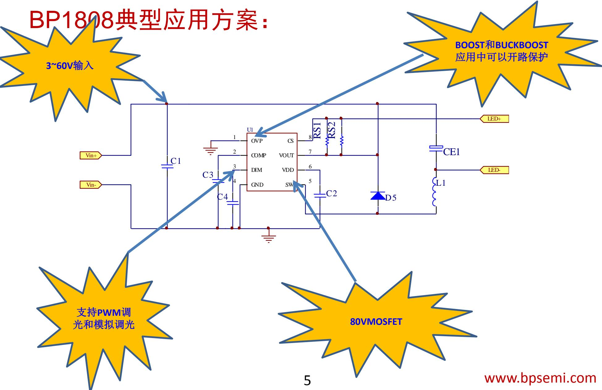

## BP1808基本原理

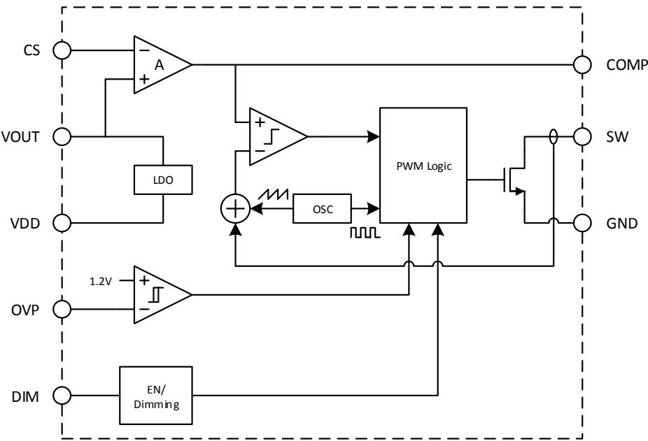

BP1808以固定频率400KHz模式工作。通过采集接在CS引脚和VOUT引脚之间采样电阻上的电压（V-），与内部基准0.2V（V+）比较，通过误差放大器（EA），控制Comp的电压（ V+ ），Comp电压与内部振荡产生的固定锯齿波（V-）比较，来决定导通时间。当输出电流减小时，采样电阻上的电压小于0.2V，通过EA把Comp电压拉高，导通时间增大，从而使采样电阻上的电压维持在0.2V，输出电流维持设定值，反之亦然。

## BP1808 Pin-Out & 应用场合

$$
\begin{array}{c c c} \text {OVP} & 1 & 8 \\ \text {COMP} & 2 & 7 \\ \text {DIM} & 3 & 6 \\ \text {GND} & 4 & 5 \end{array} \begin{array}{c c c} \text {XYYY:XXXY} & \text {BP1808} \\ \text {VOUT} & 6 \\ \text {VDD} & 5 \end{array}
$$

<table><tr><td>Part No.</td><td>MOS</td><td>Package</td><td>Io(max)</td><td>工作模式</td></tr><tr><td rowspan="3">BP1808</td><td rowspan="3">80V</td><td rowspan="3">SOP8-EP</td><td>500mA/50V@60V输入</td><td>BUCK</td></tr><tr><td>300mA/22V@15V输入</td><td>BUCKBOOST</td></tr><tr><td>300mA/22V@7V输入</td><td>BOOST</td></tr></table>

说明：建议在Buck应用中，输出电压最大值参考最大占空比限制。

## BUCK典型应用方案：

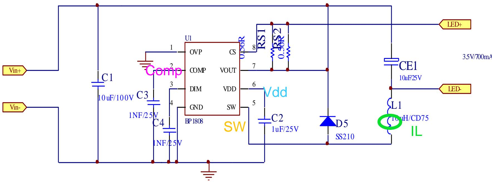

## BUCK典型应用实例波形

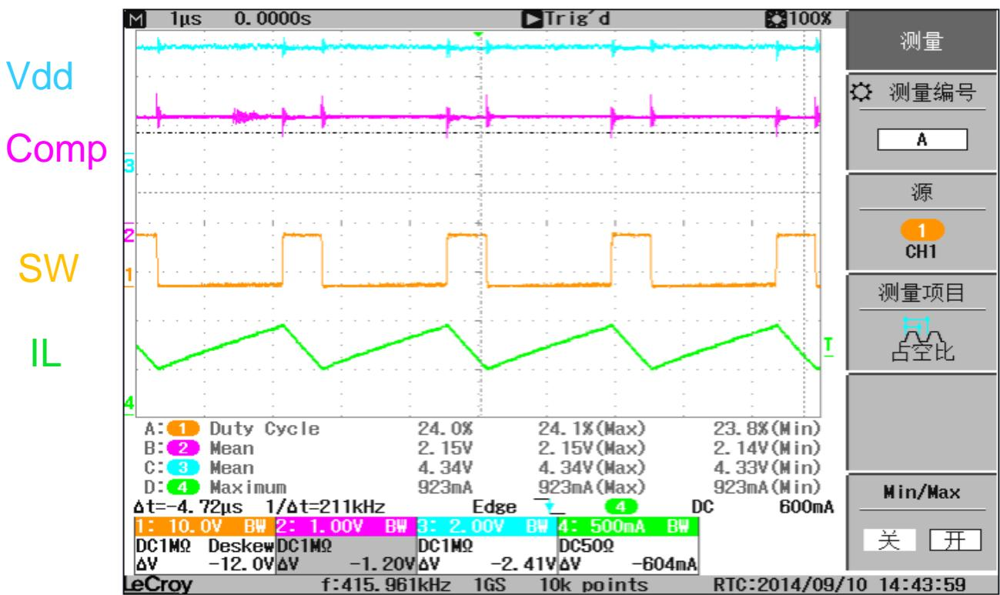

## BUCK应用实例基本数据图形

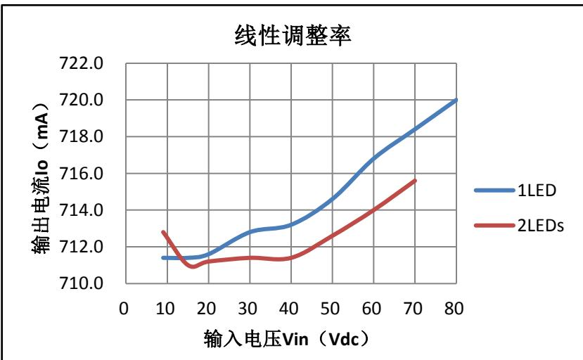

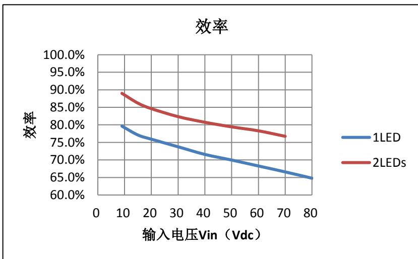

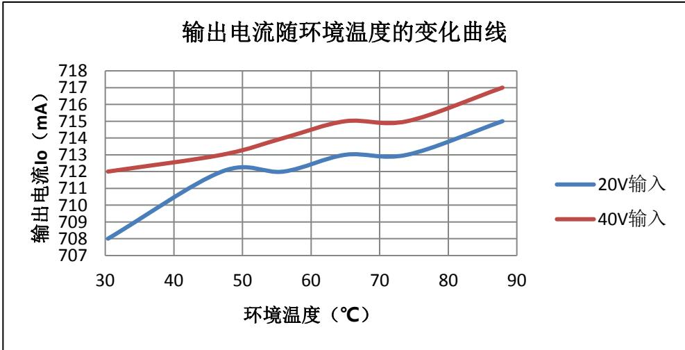

## BUCK应用实例温升

<table><tr><td colspan="9">环境温度28°C</td></tr><tr><td>Vin(Vdc)</td><td>Iin(mA)</td><td>Vo(V)</td><td>Io(mA)</td><td>二极管(°C)</td><td>电感(°C)</td><td>PCB铜箔(°C)</td><td>IC(°C)</td><td>IC温升</td></tr><tr><td>9</td><td>356</td><td>3.406</td><td>708</td><td>60.4</td><td>50.7</td><td>57.6</td><td>58.6</td><td>30.6</td></tr><tr><td>20</td><td>166</td><td>3.406</td><td>708</td><td>71.7</td><td>60.1</td><td>65.1</td><td>65.5</td><td>37.5</td></tr><tr><td>30</td><td>114</td><td>3.407</td><td>709</td><td>76.8</td><td>64.4</td><td>69.7</td><td>70.3</td><td>42.3</td></tr><tr><td>40</td><td>87</td><td>3.406</td><td>710</td><td>80.8</td><td>68.0</td><td>73.8</td><td>74.7</td><td>46.7</td></tr><tr><td>50</td><td>72</td><td>3.407</td><td>711</td><td>84.2</td><td>71.1</td><td>78.7</td><td>79.6</td><td>51.6</td></tr><tr><td>60</td><td>61</td><td>3.407</td><td>712</td><td>87.9</td><td>74.2</td><td>83.6</td><td>84.9</td><td>56.9</td></tr></table>

## BUCK Dim PWM调光

Dim frequent=200Hz

<table><tr><td>Dim Duty (%)</td><td>1</td><td>2</td><td>3</td><td>4</td><td>5</td><td>6</td><td>7</td><td>8</td><td>9</td><td>10</td></tr><tr><td>Io (mA)</td><td>1(不闪)</td><td>11</td><td>19</td><td>27</td><td>34</td><td>41</td><td>49</td><td>56</td><td>63</td><td>71</td></tr><tr><td>Dim Duty (%)</td><td>10</td><td>20</td><td>30</td><td>40</td><td>50</td><td>60</td><td>70</td><td>80</td><td>90</td><td>100</td></tr><tr><td>Io (mA)</td><td>71</td><td>143</td><td>216</td><td>288</td><td>359</td><td>430</td><td>500</td><td>571</td><td>640</td><td>710</td></tr></table>

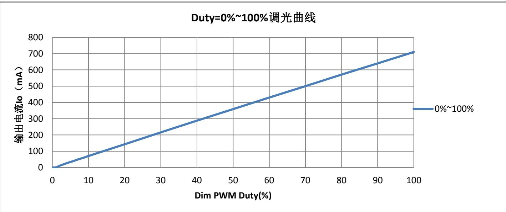

## BUCK Dim模拟调光

Vin=20V，Output：3.5V/700mA

<table><tr><td>Dim Valu (V)</td><td>&lt;0.55</td><td>&lt;0.6</td><td>0.6</td><td>0.7</td><td>0.8</td><td>0.9</td><td>1</td><td>1.1</td><td>1.2</td></tr><tr><td>Io (mA)</td><td>0</td><td>闪</td><td>29</td><td>90</td><td>150</td><td>209</td><td>270</td><td>330</td><td>390</td></tr><tr><td>Dim Value (V)</td><td>1.3</td><td>1.4</td><td>1.5</td><td>1.6</td><td>1.7</td><td>1.8</td><td>1.9</td><td>&gt;1.9</td><td>/</td></tr><tr><td>Io (mA)</td><td>449</td><td>509</td><td>569</td><td>629</td><td>686</td><td>715</td><td>716</td><td>716</td><td>/</td></tr></table>

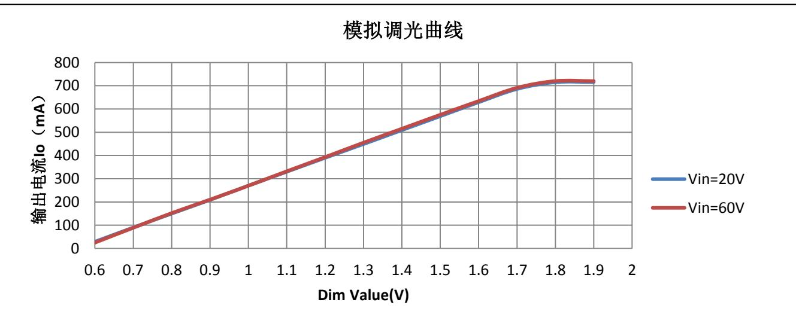

## 输出过压保护

在升压和升/降压型应用中，LED开路将触发过压保护。过压保护点可通过外部分压电阻设置，OVP比较器参考电压为1.2V，迟滞100mV。建议将升压型应用的过压保护电压设置为正常VOUT电压的1.3—1.5倍；对于宽范围输入的升/降压型应用，设置的开路保护电压一定要高于输入和输出电压之和。

$$
V _ {O V P} = \frac {1 . 2 ^ {*} (R _ {\text {上}} + R _ {\text {下}})}{R _ {\text {下}}}
$$

## Rcs电阻阻值选取

LED电流可通过连接在CS端和VOUT端之间外部采样电阻设置，该电阻值可通过下式计算：

$$
R c s = \frac {0 . 2}{I o}
$$

## 续流二极管的选取

续流二极管的选取，除了要满足最大电流、电压容忍值之外，由于BP1808工作频率很高，续流二极管还要满足反向恢复时间尽可能短，正向导通压降尽可能小的要求，最好使用肖特基二极管。

## BP1808Comp电容选取计算方法

BP1808内置软启动功能，在软启动阶段，COMP电压缓慢上升，当COMP电压上升至1V时，软启动结束，内置MOSFET开始开关。当COMP电容值小于8nF时，COMP电压以最大斜率1V/ms上升，直到COMP电压达到1V，软启动时间为1ms；若需要更长的软启动时间，可适当加大COMP端的电容，当COMP电容大于8nF时，软启动充电电流以最大值8uA给COMP电容充电，直到COMP电压上升至1V，此时的软启动时间为tss：

$$
t _ {s s} = \frac {1 V * C _ {C O M P}}{8 u A}
$$

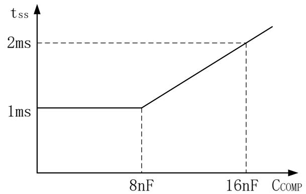  
软启动时间与COMP电容关系曲线

Comp电容建议选取范围在1\~10nF之间。

## BUCK应用电感选取计算方法

先计算系统工作在零界模式下的电感量：

$$
L = \frac {(V i n - V o) ^ {*} V o}{2 ^ {*} V i n ^ {*} I o ^ {*} f}
$$

一般选取以上计算得到的感量的 $2 ^ { \sim } 4$ 倍。电感选的太小，会使峰值电流变大，流过MOS和二极管的有效值变大，加大了导通损耗。但是电感太大，首先，在相同尺寸下感量越大，饱和电流会越小；其次，感量越大所需的铜线匝数增加，阻抗增加，损耗也增加；最后，加大电感量会使环路的响应时间变慢。

## BOOST应用电感选取计算方法

先计算系统工作在零界模式下的电感量：

$$
L = \frac {(V o - V i n) ^ {*} V i n ^ {2}}{2 ^ {*} V o ^ {2} * I o ^ {*} f}
$$

一般选取以上计算得到的感量的 $2 ^ { \sim } 4$ 倍。电感选的太小，会使峰值电流变大，流过MOS和二极管的有效值变大，加大了导通损耗。但是电感太大，首先，在相同尺寸下感量越大，饱和电流会越小；其次，感量越大所需的铜线匝数增加，阻抗增加，损耗也增加；最后，加大电感量会使环路的响应时间变慢。

## BUCKBOOST应用电感选取计算方法

先计算系统工作在零界模式下的电感量：

$$
L = \frac {V o * V i n ^ {2}}{2 * (V i n + V o) ^ {2} * I o * f}
$$

一般选取以上计算得到的感量的 $2 ^ { \sim } 4$ 倍。电感选的太小，会使峰值电流变大，流过MOS和二极管的有效值变大，加大了导通损耗。但是电感太大，首先，在相同尺寸下感量越大，饱和电流会越小；其次，感量越大所需的铜线匝数增加，阻抗增加，损耗也增加；最后，加大电感量会使环路的响应时间变慢。

以下是BUCK结构3.5V/700mA输出，Vin从10V到60V不同电压下，Mos管和二极管导通损耗随电感量变化的曲线

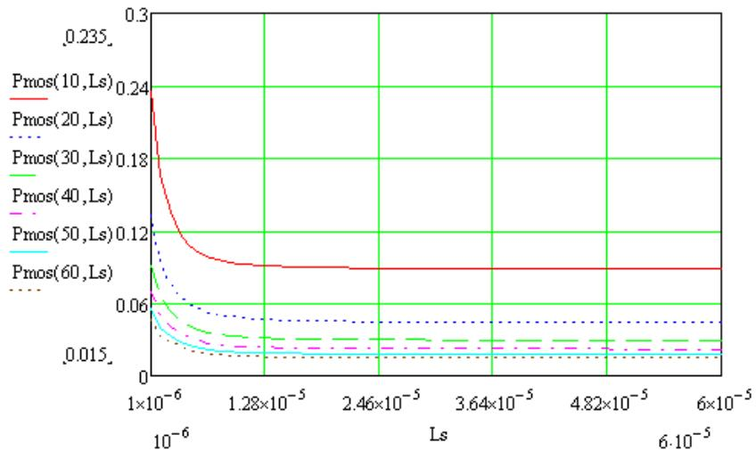  
Mos管导通损耗VS电感量

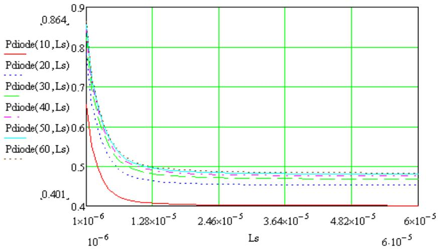  
二极管导通损耗VS电感量

从以上曲线可以看出，Mos管的导通损耗随着Vin的增加而减小，二极管导通损耗随着Vin的增加损耗增加，Mos管和二极管的导通损耗之和随电感量的增加而减小，到12.8mH后不再明显减小。

按照最大输入电压下，工作于BCM计算得到的电感量是5.9uH，如果取2\~4倍,就是11.8\~23.6uH之间。

## BP1808BUCK输入、输出电容选取

输入电容典型值为10μF，输出电容典型值为1μF，若需进一步减小输入/输出纹波，可选用更大的电容。在开关频率下，输入/输出电容的ESR需尽可能的小，建议使用X5R或X7R的陶瓷电容。

## 温度调节点

BP1808具有温度调节功能和过温保护功能。

## PCB设计注意事项

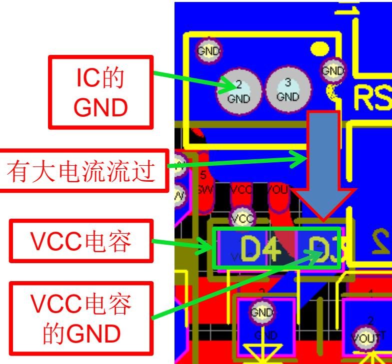

IC的GND和VCC电容的GND离得太远，并且两个GND之间有大电流流过，容易产生干扰。

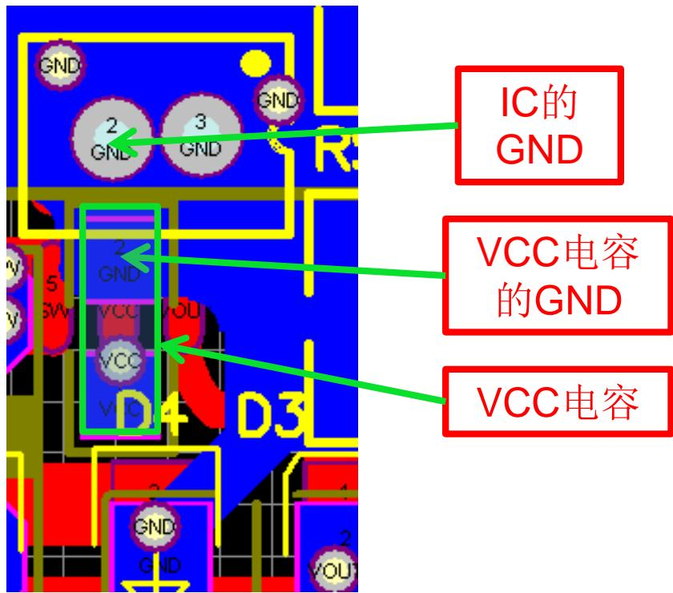  
IC的GND和VCC电容的GND离得较近，VCC不容易受到干扰。

## PCB设计注意事项

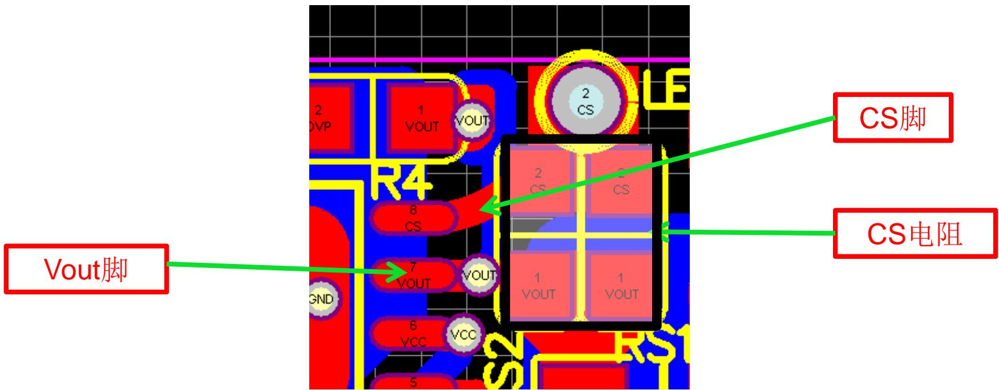

CS电阻和Vout脚和CS脚的距离尽可能短，否则会影响输出电流的精度和调整率。

## PCB设计注意事项

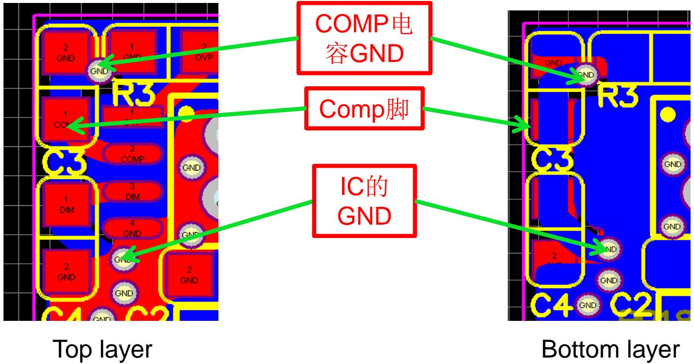

Comp电容尽量离IC近，Comp电容的GND和IC的GND之间尽量短，如果不能做到距离短，但必须保证不能让两个GND之间有大电流流过。

## PCB设计注意事项

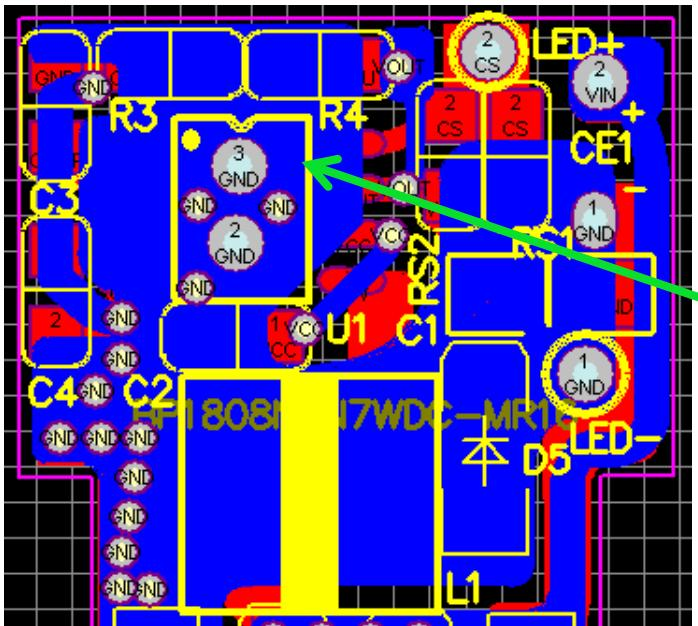

GND铜 箔

尽量多的铺铜箔，加大散热面积。

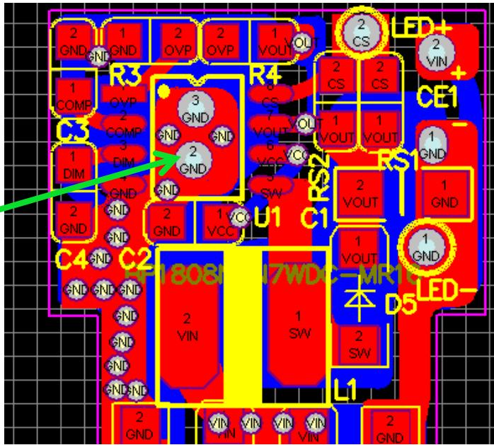

## PCB设计注意事项

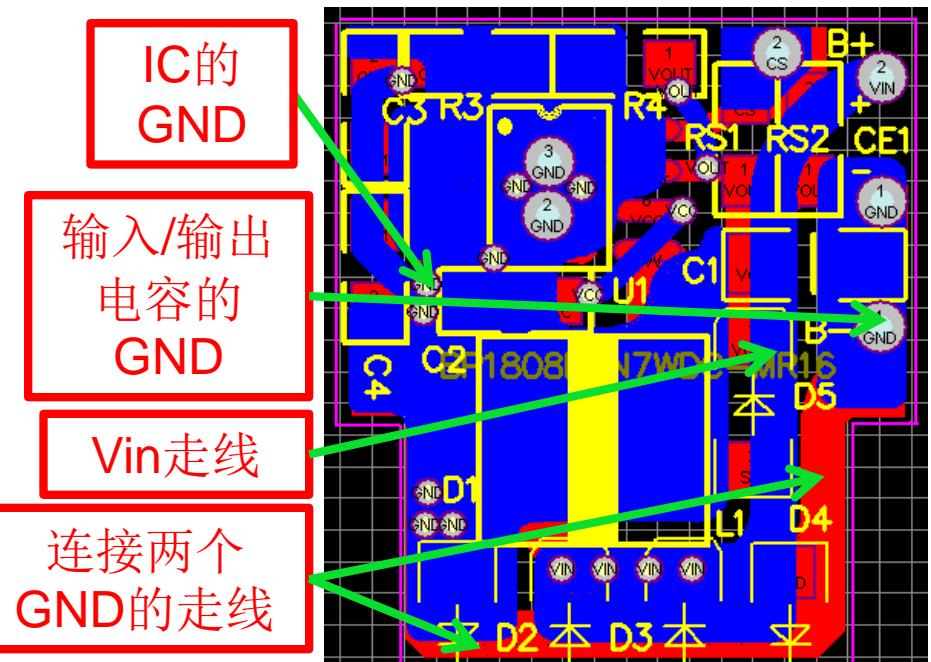

Vin走线将IC的GND和输入/输出电容的GND分割，连接两个GND之间的走线比较长，最终导致调整率变差。

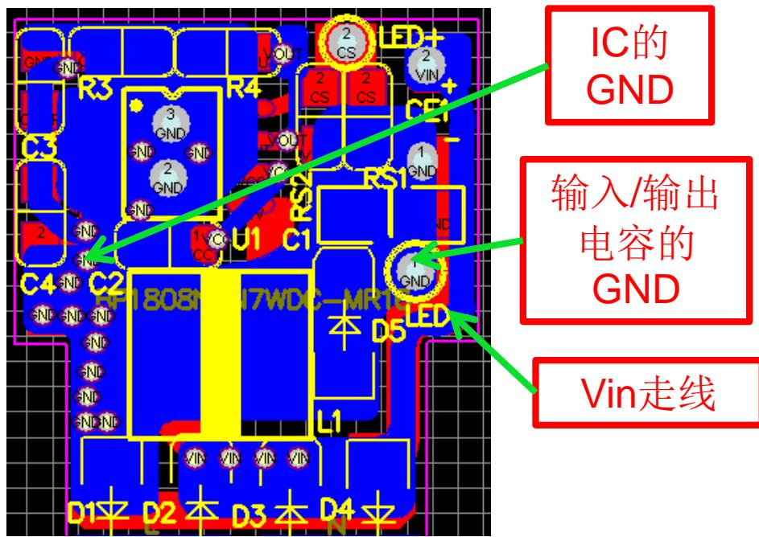

IC的GND和输入/输出电容的GND用 一快大的铺铜连接，调整率明显改 善。