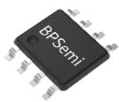
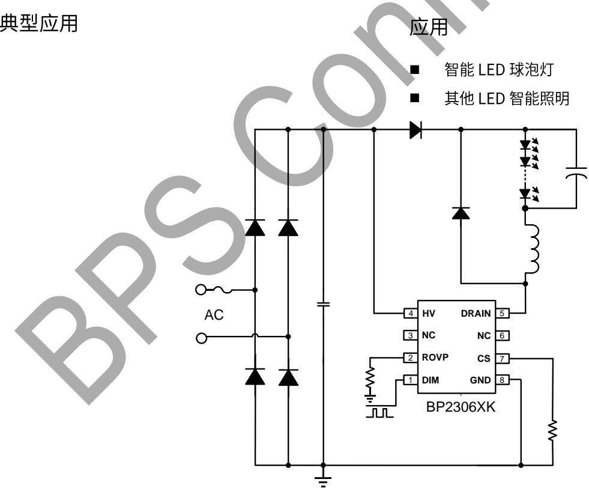
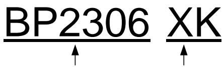
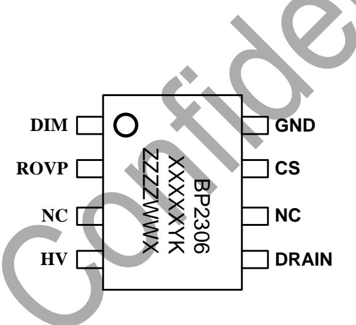
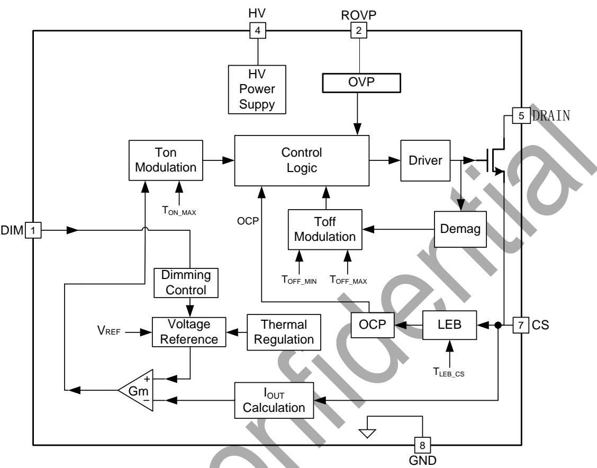
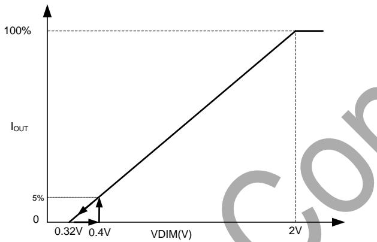
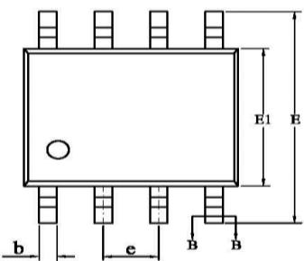
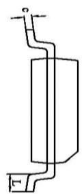
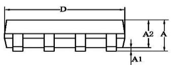
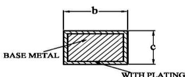

## 概述

BP2306XK是一款兼容PWM/模拟调光的高PFBUCKLED恒流控制芯片，适用于90Vac-265Vac全范围输入电压。

BP2306XK 采用高压启动，内置 COMP 补偿电容，降低成本。芯片采用输出恒流控制机制，无需 VCC 电容和辅助绕组，用极少的外部元件达到高精度的输出电流，实现了优异的线性调整率和负载调整率。

BP2306XK 提供多种保护功能，包含 LED 负载短路保护，LED 开路保护和温度调节功能，增强了系统可靠性。

BP2306XK 采用 SOP-8 封装。

## 特点

■ 兼容 PWM/模拟调光

■ PWM 调光范围 1%\~100%

■ 模拟调光范围 5%\~100%

■ 高 PF，低 THD

■ 超低待机功耗

■ 单绕组电感

内置COMP电容

■ 无需VCC电容

■ 高精度输出电流(+/-3%)

■ 优异的线性、负载调整率

逐周期限流

■ 快速启动功能

■ LED 开路保护

LED 短路保护

过温降电流

## 典型应用

SOP-8 封装

## 应用

智能LED球泡灯

图 1 BP2306XK 典型应用图

芯片名称

管脚描述  

产品系列名称

不同 MOS 型号

## 定购信息

<table><tr><td>定购型号</td><td>封装</td><td>温度范围</td><td>包装形式</td><td>打印</td></tr><tr><td>BP2306XK</td><td>SOP-8</td><td>-40 °C到105 °C</td><td>卷盘4000pcs/盘</td><td>BP2306XXXXYKZZZZWWX</td></tr></table>

## 管脚封装

  
XXXXX: Lot Number

ZZZZ: 标记

WW: 周号

图 2 管脚封装图

<table><tr><td>管脚号</td><td>管脚名称</td><td>描述</td></tr><tr><td>1</td><td>DIM</td><td>PWM/模拟调光信号输入端</td></tr><tr><td>2</td><td>ROVP</td><td>开路保护电压调节端,接电阻到地。电阻越大,OVP电压越高</td></tr><tr><td>3、6</td><td>NC</td><td>无连接</td></tr><tr><td>4</td><td>HV</td><td>高压供电</td></tr><tr><td>5</td><td>DRAIN</td><td>内部 MOSFET 漏极</td></tr><tr><td>7</td><td>CS</td><td>电流采样信号输入端,通过采样电阻接到 GND 来检测电流。</td></tr><tr><td>8</td><td>GND</td><td>芯片地</td></tr></table>

极限参数（注1）

<table><tr><td>符号</td><td>参数</td><td colspan="2">参数范围</td><td>单位</td></tr><tr><td rowspan="2"> $V_{DRAIN}$ </td><td rowspan="2">内部高压MOSFET漏极电压范围</td><td>CK</td><td>HK</td><td rowspan="2">V</td></tr><tr><td>-0.3~550</td><td>-0.3~600</td></tr><tr><td> $V_{HV}$ </td><td>芯片高压供电引脚电压范围</td><td colspan="2">-0.3~600</td><td>V</td></tr><tr><td> $R_{OVP}$ </td><td>芯片 Rovp 引脚电压范围</td><td colspan="2">-0.3~6</td><td>V</td></tr><tr><td> $V_{CS}$ </td><td>电流采样引脚电压范围</td><td colspan="2">-0.3~6</td><td>V</td></tr><tr><td> $V_{DIM}$ </td><td>PWM/模拟输入端引脚电压范围</td><td colspan="2">-0.3~24</td><td>V</td></tr><tr><td rowspan="2"> $I_{DMAX}$ </td><td rowspan="2">漏极最大电流@ $T_J$ =100°C</td><td>CK</td><td>HK</td><td rowspan="2">mA</td></tr><tr><td>900</td><td>1500</td></tr><tr><td> $P_{DMAX}$ </td><td>功耗(注 2)</td><td colspan="2">0.45</td><td>W</td></tr><tr><td> $\theta_{JA}$ </td><td>PN 结到环境的热阻</td><td colspan="2">150</td><td>°C/W</td></tr><tr><td> $T_J$ </td><td>工作结温范围</td><td colspan="2">-40 to 150</td><td>°C</td></tr><tr><td> $T_{STG}$ </td><td>储存温度范围</td><td colspan="2">-55 to 150</td><td>°C</td></tr></table>

注1：最大极限值是指超出该工作范围，芯片有可能损坏。推荐工作范围是指在该范围内，器件功能正常，但并不完全保证满足个别性能指标。电气参数定义了器件在工作范围内并且在保证特定性能指标的测试条件下的直流和交流电参数规范。对于未给定上下限值的参数，该规范不予保证其精度，但其典型值合理反映了器件性能。  
注2：温度升高最大功耗一定会减小，这也是由 $\mathrm{T}_{\mathrm{JMAX}},\theta_{\mathrm{JA}}$ 和环境温度 $\mathrm{T_A}$ 所决定的。最大允许功耗为 $P_{DMAX} = (T_{JMAX} - T_A) / \theta_{JA}$ 或是极限范围给出的数字中比较低的那个值。

## 极限工作范围

<table><tr><td>符号</td><td>参数</td><td colspan="2">参数范围</td><td>单位</td></tr><tr><td rowspan="2">ILED</td><td rowspan="2">输出LED电流@Vout=65V(输入电压108Vac-132Vac)</td><td>CK</td><td>HK</td><td rowspan="2">mA</td></tr><tr><td>150</td><td>250</td></tr><tr><td rowspan="2">ILED</td><td rowspan="2">输出LED电流@Vout=65V(输入电压176Vac-264Vac)</td><td>CK</td><td>HK</td><td rowspan="2">mA</td></tr><tr><td>200</td><td>300</td></tr><tr><td rowspan="2">ILED_MAX</td><td rowspan="2">最大输出电流</td><td>CK</td><td>HK</td><td rowspan="2">mA</td></tr><tr><td>250</td><td>350</td></tr><tr><td rowspan="4">VLED_MIN</td><td rowspan="2">最小负载LED电压(@120Vac)</td><td>CK</td><td>HK</td><td rowspan="4">V</td></tr><tr><td>&gt;20</td><td>&gt;40</td></tr><tr><td rowspan="2">最小负载LED电压(@230Vac)</td><td>CK</td><td>HK</td></tr><tr><td>&gt;30</td><td>&gt;50</td></tr></table>

规格参数(注3,4): (无特别说明情况下, $T_{A}=25^{\circ}C$ )

<table><tr><td colspan="2">符号</td><td>描述</td><td>条件</td><td>最小值</td><td>典型值</td><td>最大值</td><td>单位</td></tr><tr><td colspan="8">高压供电(HV)</td></tr><tr><td colspan="2"> $V_{HV\_BR}$ </td><td>芯片高压供电耐压</td><td></td><td>600</td><td></td><td></td><td>V</td></tr><tr><td colspan="2"> $I_{HV}$ </td><td>芯片工作电流</td><td> $F_{SW}=3KHz$ </td><td></td><td>0.55</td><td></td><td>mA</td></tr><tr><td colspan="2"> $I_{ST}$ </td><td>芯片待机电流</td><td>PWM=0</td><td></td><td>11</td><td>30</td><td>uA</td></tr><tr><td colspan="8">电流采样(CS)</td></tr><tr><td colspan="2"> $V_{REF}$ </td><td>内部参考电压</td><td></td><td>0.291</td><td>0.3</td><td>0.309</td><td>V</td></tr><tr><td colspan="2"> $V_{CS\_LIMIT}$ </td><td>逐周期限流阈值</td><td></td><td></td><td>1.8</td><td></td><td>V</td></tr><tr><td colspan="2"> $T_{LEB}$ </td><td>前沿消隐时间</td><td></td><td></td><td>300</td><td></td><td>ns</td></tr><tr><td colspan="2"> $T_{DELAY}$ </td><td>芯片关断延迟</td><td></td><td></td><td>200</td><td></td><td>ns</td></tr><tr><td colspan="8">OVP</td></tr><tr><td colspan="2"> $I_{ROVP}$ </td><td>Rovp 电流</td><td></td><td></td><td>33</td><td></td><td>uA</td></tr><tr><td colspan="8">模拟调光(DIM)</td></tr><tr><td colspan="2"> $V_{DIM\_ON}$ </td><td>调光使能阈值</td><td></td><td></td><td>0.4</td><td></td><td>V</td></tr><tr><td colspan="2"> $V_{DIM\_OFF}$ </td><td>调光关断阈值</td><td></td><td></td><td>0.3</td><td></td><td>V</td></tr><tr><td colspan="2"> $V_{DIM}$ </td><td>调光线性范围</td><td></td><td>0.4</td><td></td><td>2</td><td>V</td></tr><tr><td colspan="2"> $R_{PD\_DIM}$ </td><td>DIM 内部下拉电阻</td><td></td><td></td><td>160</td><td></td><td>kΩ</td></tr><tr><td colspan="8">PWM 调光(DIM)</td></tr><tr><td colspan="2"> $V_{PWM\_ON}$ </td><td>PWM 高电平有效</td><td>PWM 上升</td><td>2.2</td><td></td><td></td><td>V</td></tr><tr><td colspan="2"> $V_{PWM\_OFF}$ </td><td>PWM 低电平有效</td><td>PWM 下降</td><td></td><td></td><td>0.25</td><td>V</td></tr><tr><td colspan="2"> $F_{PWM}$ </td><td>PWM 频率范围</td><td></td><td>500</td><td></td><td>4000</td><td>Hz</td></tr><tr><td colspan="2">PWM_tonmin</td><td>PWM 最小高电平时间</td><td></td><td>1.8</td><td></td><td></td><td>us</td></tr><tr><td colspan="8">内部时间控制</td></tr><tr><td colspan="2"> $T_{ON\_MAX}$ </td><td>最大开通时间</td><td></td><td></td><td>23</td><td></td><td>us</td></tr><tr><td colspan="2"> $T_{OFF\_MIN}$ </td><td>最小关断时间</td><td></td><td></td><td>3.5</td><td></td><td>us</td></tr><tr><td colspan="2"> $T_{OFF\_MAX}$ </td><td>最大关断时间</td><td> $V_{CS}>0.5V$ </td><td></td><td>200</td><td></td><td>us</td></tr><tr><td colspan="8">功率 MOSFET</td></tr><tr><td rowspan="2"> $R_{DS\_ON}$ </td><td>CK</td><td rowspan="2">导通电阻</td><td rowspan="2"> $V_{GS}=10V/ I_{DS}=1A$ </td><td></td><td>5.2</td><td></td><td rowspan="2">Ω</td></tr><tr><td>HK</td><td></td><td>1.9</td><td></td></tr><tr><td rowspan="2"> $BV_{DSS}$ </td><td>CK</td><td rowspan="2">漏源极击穿电压</td><td rowspan="2"> $V_{GS}=0V/ I_{DS}=250μA$ </td><td>550</td><td></td><td></td><td rowspan="2">V</td></tr><tr><td>HK</td><td>600</td><td></td><td></td></tr><tr><td rowspan="2"> $I_{DSS}$ </td><td>CK</td><td rowspan="2">功率管漏电流</td><td rowspan="2"></td><td></td><td></td><td>10</td><td rowspan="2">uA</td></tr><tr><td>HK</td><td></td><td></td><td>1</td></tr><tr><td colspan="8">过热调节部分</td></tr><tr><td colspan="2"> $T_{REG}$ </td><td>过热调节温度</td><td></td><td></td><td>150</td><td></td><td>°C</td></tr></table>

注3：典型参数值为 $25^{\circ} \mathrm{C}$ 下测得的参数标准。  
注 4：规格书的最小、最大规范范围由测试保证，典型值有设计、测试、或统计分析保证。

内部结构框图

图 3 BP2306XK 内部框图

## 应用信息

BP2306XK是一款兼容PWM/模拟调光的高PFBUCKLED恒流控制芯片,适用于90Vac-265Vac全范围输入电压。

## 1 启动

系统上电以后，芯片默认处于待机状态，芯片耗电超低。当检测到 DIM 信号 VDIM>0.4V 为高后，芯片退出待机状态，母线电压通过 HV 引脚对芯片内部正常供电，当内部供电电压达到芯片开启阈值时，芯片内部控制电路开始工作。然后 BP2306XK 内置 MOSFET 工作，无论 DIM 信号的占空比为多少，电感电流都以 DIM 为 100% 时的状态给输出电容充电，使得输出电容上的电压快速上升，当输出电压达到 40% 左右 OVP 设置电压时，芯片以当前的 DIM 信号工作，这样既保证了输出快速上电，也保证了 LED 电流无过冲(以上过程为 ROVP 电阻上的电压>300mv 时)。

## 2 恒流控制，输出电流设置

BP2306XK采用电流检测机制，少的外部元件达到高精度的输出电流，优异的线性调整率和负载调整率。

最大亮度时 LED 输出电流计算方法：

$$
I _ {o u t} \approx \frac {V _ {R E F}}{R _ {c s}}
$$

其中，

VREF 是内部基准电压

## Rcs 是电流采样电阻的值

## 3 调光

BP2306XK 可以接受 PWM 信号或模拟信号进行调光。当 VDIM<0.3V，且持续时间达到 15ms\~30ms，则控制器关闭 MOSFET，芯片进入待机模式；当 VDIM>0.4V，芯片退出待机模式，系统开始正常工作。

PWM 调光信号频率范围 500Hz-4KHz，PWM 调光逻辑低电平需 <0.25V，逻辑高电平需 >2.2V。

模拟调光电压范围为 0.4V\~2V，可参考如下调光曲线所示。调光下行时，当 VDIM<0.32V，LED 输出电流为 0；调光上行时，当 VDIM<0.4V，系统处于待机模式；当 VDIM≥0.4V，开始输出 LED 电流，且以 5% 的满载电流输出并保持恒流。当 VDIM≥2V，LED 电流达到 100% 输出并保持恒流。

  
图 4 BP2306XK 模拟调光曲线

## 4 过压保护电阻设置

开路保护电压可以通过 ROVP 引脚电阻来设置,ROVP 引脚输出电流 33uA。

当 LED 开路时，输出电压逐渐上升，退磁时间变短,开路保护电压可由以下公式计算：

$$
V o v p \approx \frac {L * R o v p}{R c s} * K _ {o v p}
$$

其中，

Kovp 是 OVP 系数(Kovp≈4.2)

Rcs 是 CS 采样电阻(Ω)

Vovp 是需要设定的过压保护点(V)

## L 是功率电感感量(mH)

Rovp 是设置 OVP 电压的电阻(kΩ)，需设置 Rovp>15kΩ
建议设置 OVP 电压为正常输出电压的 1.5\~1.8 倍左右。

## 5 过温调节功能

BP2306XK 具有过热调节功能，在驱动电源过热时逐渐减小输出电流，从而控制输出功率和温升，使电源温度保持在设定值，以提高系统的可靠性。芯片内部设定过热调节温度点为 $150^{\circ}$ C。

## 6 保护功能

BP2306XK 内置多重保护功能，保证了系统可靠性。

当 LED 短路时，系统工作频率低于 6kHz。

当 LED 开路时，系统进入故障保护状态后，延时 350ms 左右系统将重启。同时系统不断的检测系统状态，如果故障解除，系统会重新开始正常工作。

当电感饱和时，CS峰值电压将会比较高。当CS电压上升到内部限制值（1.8V）时，开关周期马上停止。此逐周期限流功能可以保护功率MOSFET、电感和输出续流二极管。

## 7 PCB 设计

在设计 BP2306XK PCB 板时，需要注意以下事项：

## 地线

电流采样电阻的功率地线尽可能粗，且要离芯片的地尽量近，以保证电流采样的准确性，否则可能会影响输出电流精度。

## 功率环路的面积

减小大电流环路的面积，以减小 EMI 辐射。

## DRAIN 引脚

增加 DRAIN 脚的敷铜面积有利于散热,但大的铜面积可能引起 EMI 问题,二者需要平衡。

## 封装信息

## SOP-8 封装外形尺寸

  
WITH PLATING  
SECTION B-B

<table><tr><td rowspan="2">SYMBOL</td><td colspan="3">MILLIMETER</td></tr><tr><td>MIN</td><td>NOM</td><td>MAX</td></tr><tr><td>A</td><td>1.30</td><td>—</td><td>1.80</td></tr><tr><td>A1</td><td>0.05</td><td>—</td><td>0.25</td></tr><tr><td>A2</td><td>1.25</td><td>1.40</td><td>1.65</td></tr><tr><td>b</td><td>0.33</td><td>—</td><td>0.51</td></tr><tr><td>c</td><td>0.17</td><td>—</td><td>0.25</td></tr><tr><td>D</td><td>4.70</td><td>4.90</td><td>5.10</td></tr><tr><td>E</td><td>5.80</td><td>6.00</td><td>6.20</td></tr><tr><td>E1</td><td>3.70</td><td>3.90</td><td>4.10</td></tr><tr><td>e</td><td colspan="3">1.27BSC</td></tr><tr><td>L</td><td>0.40</td><td>—</td><td>1.00</td></tr></table>

## 版本信息

<table><tr><td>版本</td><td>日期</td><td>记录</td></tr><tr><td>Rev. 1.0</td><td>2021/04</td><td>首次发行</td></tr><tr><td>Rev. 1.1</td><td>2021/06</td><td>修改典型应用图,增加 HV 二极管</td></tr><tr><td></td><td></td><td></td></tr><tr><td></td><td></td><td></td></tr><tr><td></td><td></td><td></td></tr><tr><td></td><td></td><td></td></tr></table>

## 免责声明

晶丰明源尽力确保本产品规格书内容的准确和可靠，但是保留在没有通知的情况下，修改规格书内容的权利。

本产品规格书未包含任何针对晶丰明源或第三方所有的知识产权的授权。针对本产品规格书所记载的信息，晶丰明源不做任何明示或暗示的保证，包括但不限于对规格书内容的准确性、商业上的适销性、特定目的的适用性或者不侵犯晶丰明源或任何第三人知识产权做任何明示或暗示保证，晶丰明源也不就因本规格书本身及其使用有关的偶然或必然损失承担任何责任。