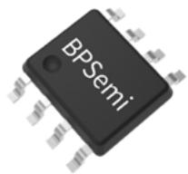
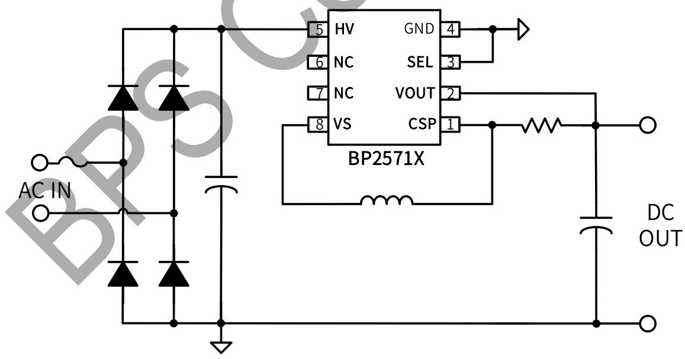
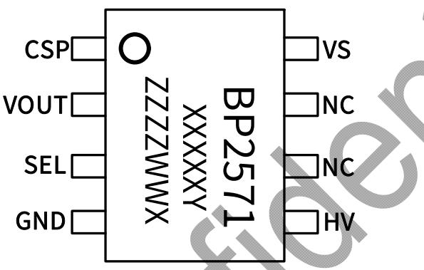
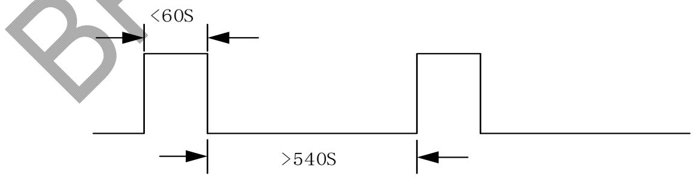
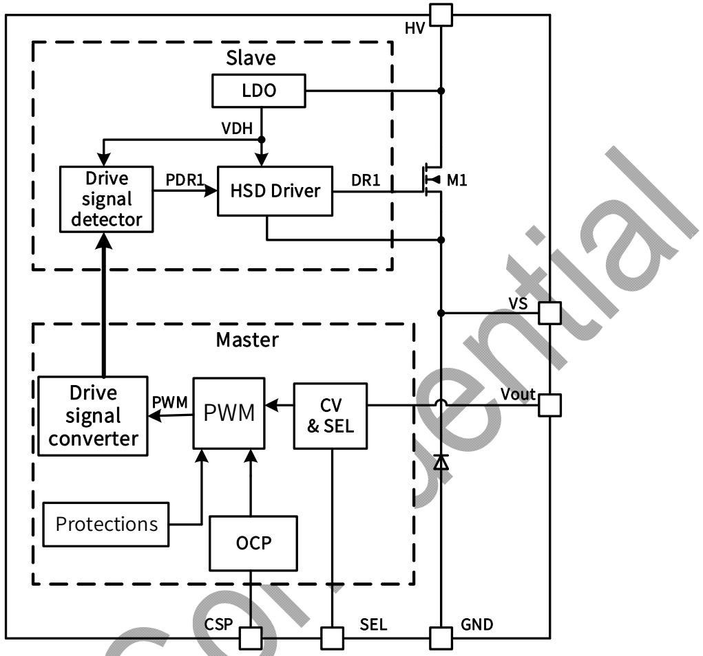
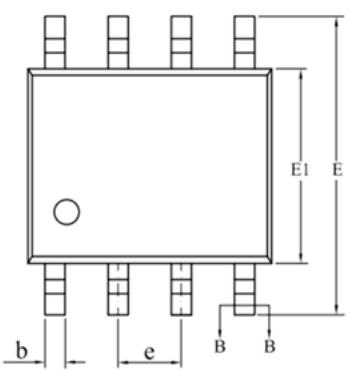
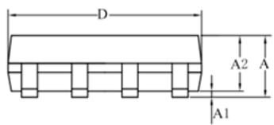
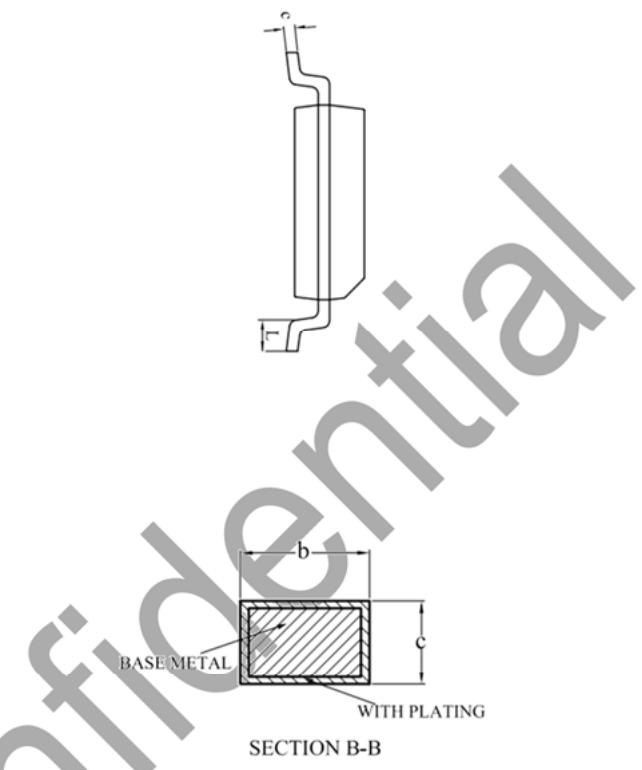

## 概述

BP2571X 是一款直接采样输出电压的高精度低待机功耗的非隔离降压型恒压芯片，输出电压的动态响应快，批量一致性好。适用于 85Vac\~265Vac 全电压输入的非隔离电源。

BP2571X 芯片内部集成功率 MOSFET，采用电压电流控制技术，不需要 VCC 电容和外部环路补偿电容，即可实现优异的恒压特性，极大的节约了系统成本和体积。

BP2571X 采用多模式控制技术，并减小系统工作在轻载时的噪声，并能够从输出电压给芯片供电，有效降低系统待机功耗，提高效率。

BP2571X 采用 SOP8 封装。

  
SOP8 封装

## 特点

■ 优异的动态响应

■ 输出电压批量一致性达到±5%以内

■ 无需 VCC 电容和供电二极管

■ 集成续流二极管

■ 低待机功耗:<20mW@Vo=3.3V; <30mW@Vo=5V

■ 3.3V 和 5V 输出电压可选

■ 集成高压启动和供电电路

■ 减小音频噪声的降幅调制技术

■ 改善 EMI 的抖频技术

内置软启动

■ 保护功能

过温保护

逐周期限流

## 应用

辅助电源

其他应用

## 典型应用

  
图 1 BP2571X 典型应用图

## 高精度低功耗非隔离降压型 AC/DC 恒压芯片

## 定购信息

<table><tr><td>定购型号</td><td>封装</td><td>温度范围</td><td>包装形式</td><td>打印</td></tr><tr><td>BP2571X</td><td>SOP-8</td><td>-40°C 到 105°C</td><td>编带4,000 颗/盘</td><td>BP2571XXXXYZZZZWWX</td></tr></table>

## 管脚封装

  
图 2 管脚封装图

XXXXXY: lot code

ZZZZ: 标识

WW: 周号

X: 电流档位

## 管脚描述

<table><tr><td>管脚号</td><td>管脚名称</td><td>描述</td></tr><tr><td>1</td><td>CSP</td><td>电流采样端,采样电阻接在 CSP 和 VOUT 端之间</td></tr><tr><td>2</td><td>VOUT</td><td>电源输出端</td></tr><tr><td>3</td><td>SEL</td><td>输出电压选择端。接 GND:输出 3.3V;接 VOUT:输出 5V</td></tr><tr><td>4</td><td>GND</td><td>芯片地</td></tr><tr><td>5</td><td>HV</td><td>芯片内部高压功率管的漏极</td></tr><tr><td>6,7</td><td>NC</td><td></td></tr><tr><td>8</td><td>VS</td><td>芯片内部高压功率管的源极,功率电感接在 VS 和 CSP 之间</td></tr></table>

## 极限参数(注1)

<table><tr><td>符号</td><td>参数</td><td>参数范围</td><td>单位</td></tr><tr><td> $V_{DS}$ (B、D)</td><td>内部高压功率管漏极到源极峰值电压</td><td>-0.3~500</td><td>V</td></tr><tr><td>SEL</td><td>输出电压选择端</td><td>-0.3~6</td><td>V</td></tr><tr><td>VOUT</td><td>电源输出端</td><td>-0.3~6</td><td>V</td></tr><tr><td>CSP</td><td>电流采样端</td><td>-0.3~6</td><td>V</td></tr><tr><td> $P_{DMAX}$ </td><td>功耗(注2)</td><td>0.45</td><td>W</td></tr><tr><td> $\theta_{JA}$ </td><td>PN结到环境的热阻</td><td>145</td><td>°C/W</td></tr><tr><td> $T_J$ </td><td>工作结温范围</td><td>-40 to 150</td><td>°C</td></tr><tr><td> $T_{STG}$ </td><td>储存温度范围</td><td>-55 to 150</td><td>°C</td></tr></table>

注1：最大极限值是指超出该工作范围，芯片有可能损坏。推荐工作范围是指在该范围内，器件功能正常，但并不完全保证满足个别性能指标。电气参数定义了器件在工作范围内并且在保证特定性能指标的测试条件下的直流和交流电参数规范。对于未给定上下限值的参数，该规范不予保证其精度，但其典型值合理反映了器件性能。

注 2：温度升高最大功耗一定会减小，这也是由 TJMAX, θJA, 和环境温度 TA 所决定的。最大允许功耗为 PDMAX = (TJMAX - TA)/ θJA 或是极限范围给出的数字中比较低的那个值。

## 极限输出功率表

测试条件：输入电压 85Vac-265Vac。

\*脉冲电流持续时间<60S，占空比<10%。

<table><tr><td>型号</td><td>持续电流Vout=3.3V</td><td>脉冲电流Vout=3.3V</td><td>持续电流Vout=5V</td><td>脉冲电流Vout=5V</td><td>内部 MOS 管限制最大电流</td><td>单位</td></tr><tr><td>BP2571B</td><td>200</td><td>300</td><td>200</td><td>300</td><td>500</td><td>mA</td></tr><tr><td>BP2571D</td><td>300</td><td>500</td><td>300</td><td>500</td><td>750</td><td>mA</td></tr></table>

  
图 3 瞬时脉冲示意图

## 高精度低功耗非隔离降压型 AC/DC 恒压芯片

电气参数(注 4,5) （无特别说明情况下，TA=25 ℃）

<table><tr><td>符号</td><td>参数描述</td><td>条件</td><td>最小值</td><td>典型值</td><td>最大值</td><td>单位</td></tr><tr><td colspan="7">电源电压</td></tr><tr><td> $V_{OUT}$ </td><td> $V_{OUT}$ 引脚稳态电压</td><td>SEL=GND</td><td>3.27</td><td>3.33</td><td>3.41</td><td>V</td></tr><tr><td> $V_{OUT}$ </td><td> $V_{OUT}$ 引脚稳态电压</td><td>SEL=VOUT</td><td>5.1</td><td>5.24</td><td>5.35</td><td>V</td></tr><tr><td> $V_{OUT\_CLAMP}$ </td><td> $V_{OUT}$ 引脚钳位电压</td><td> $I_{CLAMP}=2mA$ </td><td></td><td>6</td><td></td><td>V</td></tr><tr><td> $I_{OUT\_OP}$ </td><td> $V_{OUT}$ 工作电流</td><td> $V_{DRAIN}=60V$ </td><td></td><td>900</td><td>1100</td><td>uA</td></tr><tr><td> $I_{cc}$ </td><td> $V_{CC}$ 启动电流</td><td></td><td></td><td>2</td><td></td><td>mA</td></tr><tr><td> $I_{HV\_OP}$ </td><td>HV工作电流</td><td> $V_{OUT}=3.3V$ </td><td></td><td>30</td><td></td><td>uA</td></tr><tr><td colspan="7">振荡器</td></tr><tr><td> $F_{OSC\_MAX}$ </td><td>最大开关频率</td><td>频率中心值</td><td></td><td>55</td><td></td><td>kHz</td></tr><tr><td> $T_{ON\_MAX}$ </td><td>最大开通时间</td><td></td><td></td><td>2.5</td><td></td><td>us</td></tr><tr><td colspan="7">电流采样</td></tr><tr><td> $V_{cs\_th}$ </td><td>电流检测阈值</td><td></td><td></td><td>200</td><td></td><td>mV</td></tr><tr><td> $T_{LEB}$ </td><td>前沿消隐时间</td><td></td><td></td><td>280</td><td></td><td>ns</td></tr><tr><td> $T_{ILD}$ </td><td>电流限流延迟</td><td></td><td></td><td>150</td><td></td><td>ns</td></tr><tr><td colspan="7">功率管</td></tr><tr><td> $B\ R_{DS\_ON}$ </td><td rowspan="2">功率管导通阻抗</td><td rowspan="2"> $V_{out}=3.3V,I_{DS}=50mA$ </td><td></td><td></td><td>20</td><td>Ω</td></tr><tr><td> $D\ R_{DS\_ON}$ </td><td></td><td></td><td>12</td><td>Ω</td></tr><tr><td> $B\ BV_{DSS}$ </td><td rowspan="2">功率管的击穿电压</td><td rowspan="2"> $V_{GS}=0V/I_{DS}=250uA$ </td><td>500</td><td></td><td></td><td></td></tr><tr><td> $D\ BV_{DSS}$ </td><td>500</td><td></td><td></td><td></td></tr><tr><td colspan="7">过热保护</td></tr><tr><td> $T_{SD}$ </td><td>过热调节温度</td><td></td><td></td><td>145</td><td></td><td>°C</td></tr><tr><td> $T_{SD\_HYS}$ </td><td>过热保护温度迟滞</td><td></td><td></td><td>40</td><td></td><td>°C</td></tr></table>

注4：典型参数值为 $25^{\circ} \mathrm{C}$ 下测得的参数标准。  
注5：规格书的最小、最大规范范围由测试保证，典型值由设计、测试或统计分析保证。

## 内部结构框图

  
图4 内部框图

## 应用信息

## 启动

系统上电后，母线电压通过 Drain 端内部的高压 JFET 对芯片内部 VCC 电容充电，达到芯片开启阈值时，芯片内部控制电路开始工作。芯片正常工作时主要从输出直接供电，部分驱动模块需要由高压 JFET 供电。

## 软启动

芯片具有软启动功能，在软启动过程中，会分段增加原边峰值电流以减小开关应力，每一次重启都会经历软启动过程。在输出电压建立完成前，芯片检测电感退磁电流，在电感电流小于峰值电流的约 30% 才允许再次开通 MOSFET，以此防止启动过程中的电感电流积累。

## 多模式控制

BP2571X 芯片采用 PWM/PFM 多模式控制技术，能有效降低系统待机功耗，提高效率，并减小系统工作在轻载时的噪声。

## 输出电感

BP271X 可工作于 CCM、DCM 等多种工作模式，对于电感的选择包括感量、峰值电流以及平均电流。最终根据电感价格、电感尺寸以及系统效率来决定电感的大小。小感量电感可以减小尺寸、降低价格以及改善系统动态响应，但是，同时会增大电感的峰值电流和输出纹波并且降低系统效率。相反的，大感量电感可以提高效率，因为需要更多线圈数，物理体积也会更大，动态响应也会变的更慢。综合电感价格、尺寸、系统效率以及动态响应，推荐电感纹波电流系数 r 不小于 25%，工作在 CCM 模式下，然后，根据输入/输出电压、系统开关频率、满载输出电流以及推荐的电感纹波电流 $\Delta IL$ 估算电感感量、峰值电流

$$
\mathrm{L} = \frac {V _ {O U T} (V _ {I N} - V _ {O U T})}{V _ {I N} * F * \Delta I _ {L}}
$$

其中

$$
\Delta I _ {L} = I _ {o u t} * r
$$

## 峰值电流

当电流纹波系数 r 确定后，就可以计算出峰值电流大小

$$
I _ {L \_ P E A K} = I _ {O \_ M A X} + \frac {\Delta I _ {L}}{2}
$$

$$
I _ {L \_ V A L L Y} = I _ {O \_ M A X} - \frac {\Delta I _ {L}}{2}
$$

同样由芯片的 ILIMIT 参数可推算出最大的过载电流。

## CS 电阻的选择

芯片可以根据 MOSFET 档位合理的设置电感的限流峰值，实际 CS 电阻的选择需要综合考虑负载电流和电流纹波，并留一定余量。

## CS 电阻计算为:

$$
R _ {C S} = \frac {2 2 0 (m V)}{I _ {l i m i t} (m A)}
$$

注：内部峰值电流检测阈值电压为 200mV。考虑传输延时和关断延时，峰值电流检测阈值电压约为 220mV。

## 输入电容的选择

输入电容的用处在于输入电压以及 MOSFET 开关尖峰的滤波。由于降压转换器的输入电流是非连续的，需要电容对交流电流进行吸收，以保证平稳的输入电压。另外，输入电容需要能承受足够的电流波纹。输入纹波电流有效值估算如下：

$$
I _ {I N \_ R M S} = I _ {O \_ M A X} \times \sqrt {D \times (1 - D)}
$$

$$
D = \frac {V _ {O U T}}{V _ {I N}}
$$

# 高精度低功耗非隔离降压型 AC/DC 恒压芯片

为了减小噪声，建议输入电容选择电解电容。

## 输出电容的选择

输出电容的作用是输出电压的滤波以及输出动态电流的供应。当输出电流恒定时，输出纹波主要由输出电容的 ESR 以及容量决定。

$$
V _ {R I P P L E} = V _ {R I P P L E \_ E S R} + V _ {R I P P L E \_ C}
$$

$$
V _ {R I P P L E \_ E S R} = \varDelta I _ {L} \times E S R
$$

$$
V _ {R I P P L E \_ C} = \frac {\varDelta I _ {L}}{8 \times C _ {O U T} \times f _ {S W}}
$$

BP2571X 内置多种保护功能，包括过温保护，逐周期限流、VOUT 电压钳位等。

## 抖频

BP2571X 引入抖频技术来减少 EMI 噪声。芯片开关频率在当前频率的±3%范围周期性抖动，抖频周期为当前频率 1/128。

## 输出电压采样

BP2571X 直接采样输出电压，实现高精度高速的输出电压控制。

## 保护功能

## 高精度低功耗非隔离降压型 AC/DC 恒压芯片

## 封装信息

  
SECTION B-B

<table><tr><td rowspan="2">SYMBOL</td><td colspan="3">MULIMETER</td></tr><tr><td>MIN</td><td>NOM</td><td>MAX</td></tr><tr><td>A</td><td>1.30</td><td>—</td><td>1.80</td></tr><tr><td>A1</td><td>0.10</td><td>—</td><td>0.25</td></tr><tr><td>A2</td><td>1.25</td><td>1.40</td><td>1.65</td></tr><tr><td>b</td><td>0.33</td><td>—</td><td>0.51</td></tr><tr><td>c</td><td>0.17</td><td>—</td><td>0.25</td></tr><tr><td>D</td><td>4.70</td><td>4.90</td><td>5.10</td></tr><tr><td>E</td><td>5.80</td><td>6.00</td><td>6.20</td></tr><tr><td>E1</td><td>3.70</td><td>3.90</td><td>4.10</td></tr><tr><td>e</td><td colspan="3">1.27BSC</td></tr><tr><td>L</td><td>0.40</td><td>—</td><td>1.00</td></tr></table>

版本信息

<table><tr><td>版本</td><td>日期</td><td>记录</td></tr><tr><td>Rev.1.0</td><td>2022/05</td><td>首次发行</td></tr><tr><td></td><td></td><td></td></tr><tr><td></td><td></td><td></td></tr><tr><td></td><td></td><td></td></tr></table>

## 免责声明

晶丰明源尽力确保本产品规格书内容的准确和可靠，但是保留在没有通知的情况下，修改规格书内容的权利。

本产品规格书未包含任何针对晶丰明源或第三方所有的知识产权的授权。针对本产品规格书所记载的信息，晶丰明源不做任何明示或暗示的保证，包括但不限于对规格书内容的准确性、商业上的适销性、特定目的的适用性或者不侵犯晶丰明源或任何第三人知识产权做任何明示或暗示保证，晶丰明源也不就因本规格书本身及其使用有关的偶然或必然损失承担任何责任。