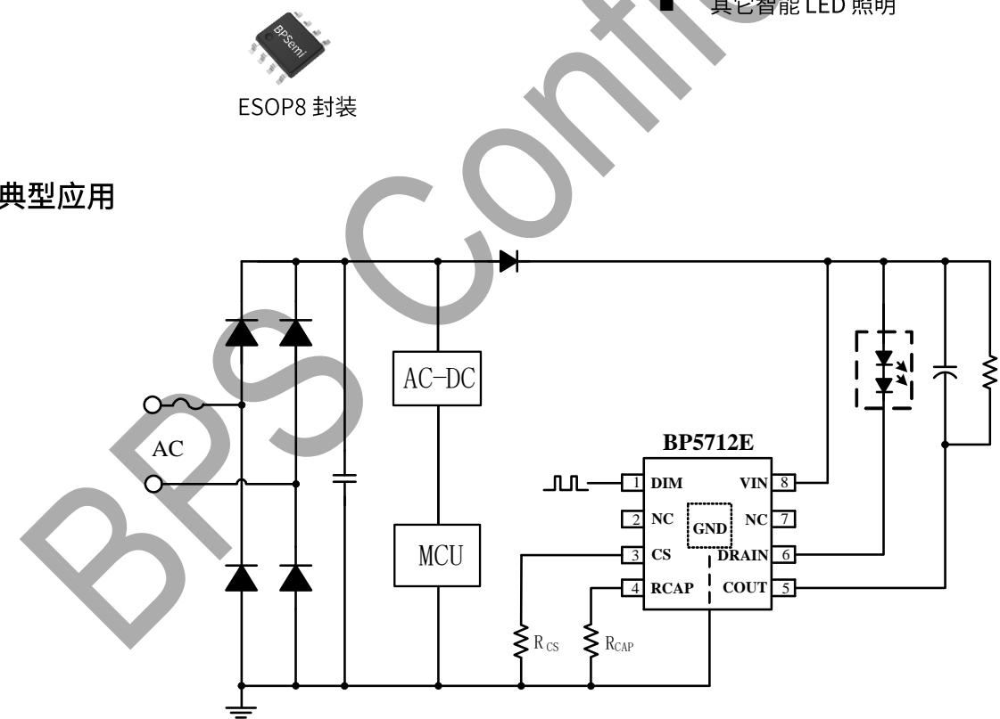
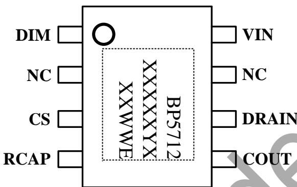
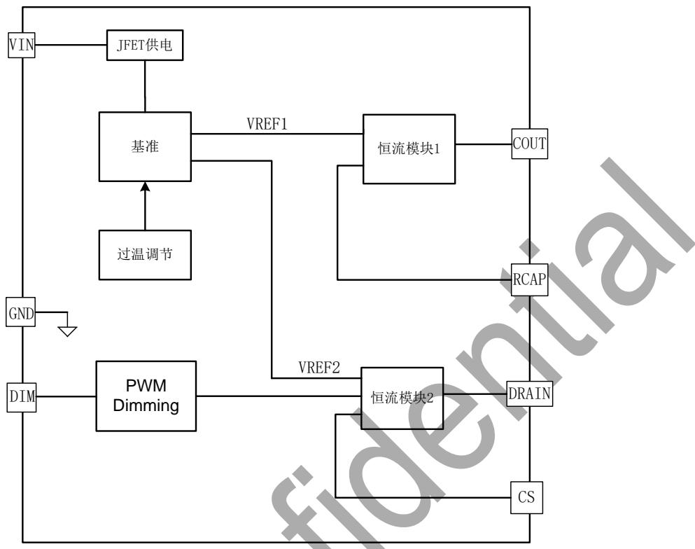
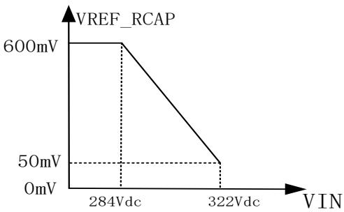
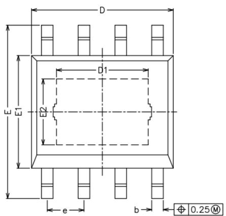
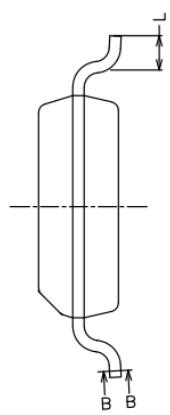
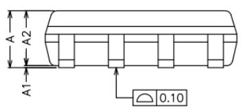
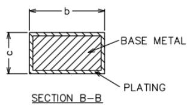

## 概述

BP5712E 是一款高度集成的单通道 PWM 调光 LED 恒流驱动芯片，主要用于市电输入的各类调光光源和灯具的驱动，能满足欧洲最新 ERP 和 IEC61000-3-2：2018 电流谐波标准，具有良好的线性调整率。基于线性恒流技术的 BP5712E，可以省去磁性元件，有助于 LED 驱动器实现小体积、低成本，并符合 EMI 标准。

BP5712E 支持 PWM 调光信号，可以搭配常见的智能控制模块实现调光功能，调光时输出连续电流。

BP5712E 且具有线电压补偿功能, 输入电压在一定范围内波动时, 输入功率基本不变。

BP5712E 具有过温调节功能。当输入电压过高或者 LED 电流过大导致芯片温度过高时，将降低输出电流。

BP5712E 采用 ESOP8 封装

## 特点

■ 满足 IEC61000-3-2:2018 电流谐波标准

■ 频闪低 Pst LM<1，SVM<0.4

DF>0.7

■ 单通道 PWM 调光

■ 1%--100%调光范围

■ 调光时输出连续电流

■ 内置 550V MOS 管调整电流谐波

输入线电压补偿功能

内置过温降电流功能

■ 采用 ESOP-8 封装

## 应用领域

■ 智能 LED 灯丝灯

智能LED球泡灯

其它智能LED照明

## 典型应用

  
图 1 BP5712E 典型应用图

## 定购信息

<table><tr><td>定购型号</td><td>封装</td><td>包装形式</td><td>打印</td></tr><tr><td>BP5712E</td><td>ESOP8</td><td>卷盘4,000/盘</td><td>BP5712XXXXXYXXWWE</td></tr></table>

## 管脚封装

COUT

BP5712: 产品型号

XXXXYYY: 批次号

XX: 标示

WW: 周号

图 2 管脚封装图

## 管脚描述

<table><tr><td>管脚号</td><td>管脚名称</td><td>描述</td></tr><tr><td>1</td><td>DIM</td><td>PWM 调光信号输入端</td></tr><tr><td>2</td><td>NC</td><td>无连接</td></tr><tr><td>3</td><td>CS</td><td>LED 灯串电流设定,通过电阻连接到地</td></tr><tr><td>4</td><td>RCAP</td><td>输入电解电容充电电流设定,通过电阻连接到地</td></tr><tr><td>5</td><td>COUT</td><td>电流谐波控制功率 MOS 管漏极</td></tr><tr><td>6</td><td>DRAIN</td><td>LED 灯恒流功率 MOS 管漏极</td></tr><tr><td>7</td><td>NC</td><td>无连接</td></tr><tr><td>8</td><td>VIN</td><td>高压供电输入端</td></tr><tr><td>衬底</td><td>GND</td><td>芯片地</td></tr></table>

## 极限参数(注1)

<table><tr><td>符号</td><td>参数</td><td>参数范围</td><td>单位</td></tr><tr><td>VIN</td><td>高压供电输入端电压</td><td>-0.3~550</td><td>V</td></tr><tr><td>COUT</td><td>电流谐波控制功率 MOSFET 漏极电压</td><td>-0.3~500</td><td>V</td></tr><tr><td> $I_{D\_COUT\_MAX}$ </td><td>COUT 引脚 MOSFET 饱和电流</td><td>250</td><td>mA</td></tr><tr><td>DRAIN</td><td>LED灯恒流功率MOSFET漏极电压</td><td>-0.3~500</td><td>V</td></tr><tr><td> $I_{DRAIN\_MAX}$ </td><td>LED MOSFET 饱和电流</td><td>80</td><td>mA</td></tr><tr><td>CS, RCAP</td><td>芯片低压接口</td><td>-0.3~6</td><td>V</td></tr><tr><td>DIM</td><td>PWM 调光信号输入端</td><td>-0.3~24</td><td>V</td></tr><tr><td> $P_{DMAX}$ </td><td>功耗(注 2)</td><td>1.25</td><td>W</td></tr><tr><td> $\theta_{JA}$ </td><td>PN 结到环境的热阻</td><td>100</td><td>°C/W</td></tr><tr><td> $T_J$ </td><td>工作结温范围</td><td>-40 to 150</td><td>°C</td></tr><tr><td> $T_{STG}$ </td><td>储存温度范围</td><td>-55 to 150</td><td>°C</td></tr></table>

注1：最大极限值是指超出该工作范围，芯片有可能损坏。推荐工作范围是指在该范围内，器件功能正常，但并不完全保证满足个别性能指标。电气参数定义了器件在工作范围内并且在保证特定性能指标的测试条件下的直流和交流电参数规范。对于未给定上下限值的参数，该规范不予保证其精度，但其典型值合理反映了器件性能。

注2：温度升高最大功耗一定会减小，这也是由TJMAX, $\theta$ JA,和环境温度TA所决定的。最大允许功耗为PDMAX = (TJMAX - TA)/ $\theta$ JA或是极限范围给出的数字中比较低的那个值。

电气参数(注 4,5) （无特别说明情况下，TA = 25 ℃）

<table><tr><td>符号</td><td>参数描述</td><td>条件</td><td>最小值</td><td>典型值</td><td>最大值</td><td>单位</td></tr><tr><td colspan="7">芯片供电(VIN管脚)</td></tr><tr><td> $I_{STBY}$ </td><td>VIN待机电流</td><td>DIM=0</td><td></td><td>175</td><td></td><td>uA</td></tr><tr><td> $BV_{DVIN}$ </td><td>VIN管脚击穿电压</td><td></td><td>550</td><td></td><td></td><td>V</td></tr><tr><td colspan="7">电流采样(CS管脚)</td></tr><tr><td>VREF_RCAP</td><td>电解电容充电电流设置基准</td><td></td><td></td><td>600</td><td></td><td>mV</td></tr><tr><td>VREF_CS</td><td>LED电流设置基准</td><td>VIN=30VRcs=20KΩ</td><td></td><td>1.2</td><td></td><td>V</td></tr><tr><td>IOUT_LED</td><td>LED输出最大电流设置</td><td>设置输出最大电流范围</td><td>10</td><td></td><td>80</td><td>mA</td></tr><tr><td> $D_{IOUT}$ </td><td>芯片间IOUT偏差</td><td>IOUT=30mA</td><td></td><td></td><td>±5</td><td>%</td></tr><tr><td colspan="7">调光信号输入端(DIM管脚)</td></tr><tr><td>VPWM_H</td><td>PWM信号高电平</td><td></td><td>2.45</td><td></td><td></td><td>V</td></tr><tr><td>VPWM_L</td><td>PWM信号低电平</td><td></td><td></td><td></td><td>0.55</td><td>V</td></tr><tr><td>FPWM</td><td>PWM信号工作频率</td><td></td><td>0.5</td><td></td><td>2</td><td>kHz</td></tr><tr><td>RPD</td><td>DIM脚内部下拉电阻</td><td></td><td></td><td>5.1</td><td></td><td>kΩ</td></tr><tr><td colspan="7">过热调节</td></tr><tr><td>TREG</td><td>过热调节温度起点</td><td></td><td></td><td>150</td><td></td><td>°C</td></tr></table>

注5：规格书的最小、最大规范范围由测试保证，典型值由设计、测试或统计分析保证。  
注 4：典型参数值为 $25^{\circ}$ C 下测得的参数标准。

## 内部结构框图

  
图 3 BP5712E 内部框图

## 功能描述

BP5712E 是一款单通道可调光 LED 线性恒流驱动芯片，支持 PWM 调光信号输入，输出模拟电流。主要用于市电输入的各类调光光源和灯具的驱动。

## 1 供电

在系统上电后，VIN 通过内部的高压 JFET 给芯片供电。

## 2 恒流控制，输出电流设置

BP5712E 可以通过外部电阻精确设定 LED 电流。

当输入电压大于电解电容两端电压时，COUT 引脚内部 MOS 导通，输出电流计算公式：

$$
I _ {C A P} = \frac {V _ {r e f \_ R C A P}}{R _ {R C A P}}
$$

当输入电压大于灯压时，D1 导通，输出电流计算公式：

$$
I _ {L E D} = \frac {V _ {r e f \_ C S}}{R _ {C S}} * 5 0 0
$$

其中 $V_{ref\_CS}$ 为 CS 引脚的基准电压。

由于散热能力的限制，在 220V 市电输入时，建议将 LED 电流设在 40mA 以下。

## 3 过温调节功能

BP5712E 具有过热调节功能，在驱动电源过热时逐渐减小输出电流，从而控制输出功率和温升，使电源温度保持在设定值，以提高系统的可靠性。

## 4 调光

BP5712E 支持 PWM 调光信号输入，PWM 调光信号经芯片内部滤波器滤波后去控制 LED 平均电流。PWM 的高电平幅值建议设置在 2.5V 以上。

## 5 线补偿调节功能

为了满足分次谐波的要求，BP5712E 根据 VIN 端的电压高低来调节输入电解电容的充电电流，

VIN 与 VREF\_RCAP 的关系曲线如下:  
  
图 4 VIN 与 VREF\_RCAP 关系曲线图

## 6 PCB 设计

在设计 BP5712E PCB 板时，需要注意以下事项：

地线

电流采样电阻 Rcs 和 Rcap 到地线尽可能短。

GND 和芯片底部的散热铜片面积要尽可能大，以减小热阻，增强散热能力。

VIN/COUT/DRAIN

高压走线引脚VIN/COUT/DRAIN需要尽量远离低压元器件,低压引脚和低压走线。

## 封装信息

<table><tr><td rowspan="2">SYMBOL</td><td colspan="3">MILLIMETER</td></tr><tr><td>MIN</td><td>NOM</td><td>MAX</td></tr><tr><td>A</td><td>1.35</td><td>-</td><td>1.75</td></tr><tr><td>A1</td><td>0.00</td><td>-</td><td>0.15</td></tr><tr><td>A2</td><td>1.25</td><td>1.40</td><td>1.65</td></tr><tr><td>b</td><td>0.30</td><td>-</td><td>0.50</td></tr><tr><td>c</td><td>0.10</td><td>-</td><td>0.25</td></tr><tr><td>D</td><td>4.70</td><td>4.90</td><td>5.10</td></tr><tr><td>D1</td><td>3.02</td><td>-</td><td>3.50</td></tr><tr><td>E</td><td>5.80</td><td>-</td><td>6.40</td></tr><tr><td>E1</td><td>3.70</td><td>3.90</td><td>4.10</td></tr><tr><td>E2</td><td>2.1</td><td>-</td><td>2.6</td></tr><tr><td>L</td><td>0.40</td><td>0.60</td><td>1.25</td></tr><tr><td>e</td><td>1.17</td><td>1.27</td><td>1.37</td></tr></table>

## 版本信息

<table><tr><td>版本</td><td>日期</td><td>记录</td></tr><tr><td>Rev. 0.1</td><td>2021/7</td><td>首次发行</td></tr><tr><td>Rev. 0.91</td><td>2021/8</td><td>升级 0.91</td></tr><tr><td>Rev. 1.0</td><td>2022/1</td><td>升级 1.0</td></tr><tr><td></td><td></td><td></td></tr><tr><td></td><td></td><td></td></tr><tr><td></td><td></td><td></td></tr></table>

## 免责声明

晶丰明源尽力确保本产品规格书内容的准确和可靠，但是保留在没有通知的情况下，修改规格书内容的权利。

本产品规格书未包含任何针对晶丰明源或第三方所有的知识产权的授权。针对本产品规格书所记载的信息，晶丰明源不做任何明示或暗示的保证，包括但不限于对规格书内容的准确性、商业上的适销性、特定目的的适用性或者不侵犯晶丰明源或任何第三人知识产权做任何明示或暗示保证，晶丰明源也不就因本规格书本身及其使用有关的偶然或必然损失承担任何责任。