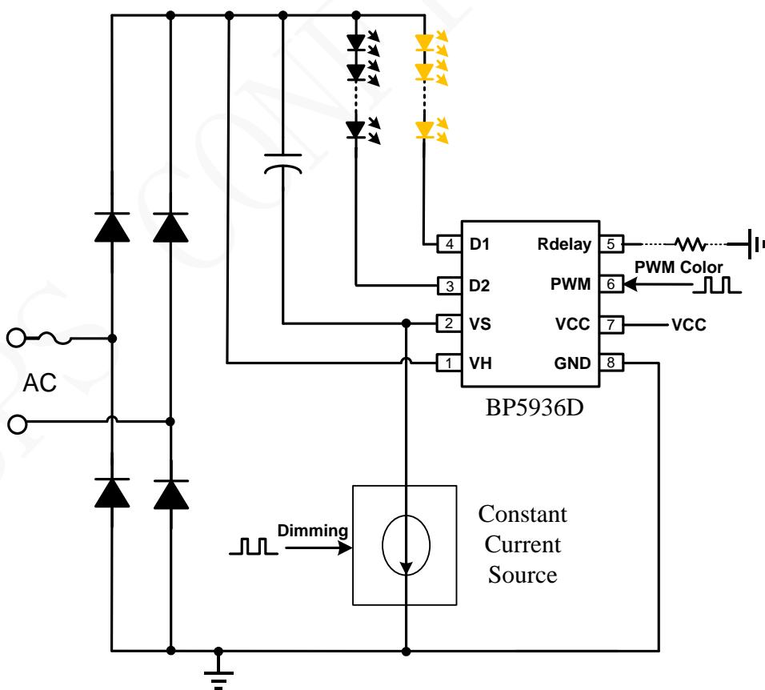
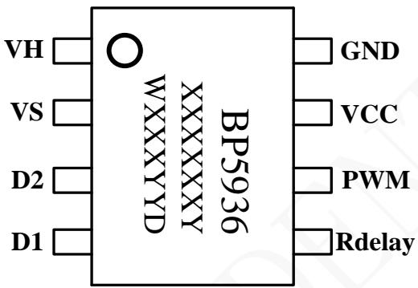
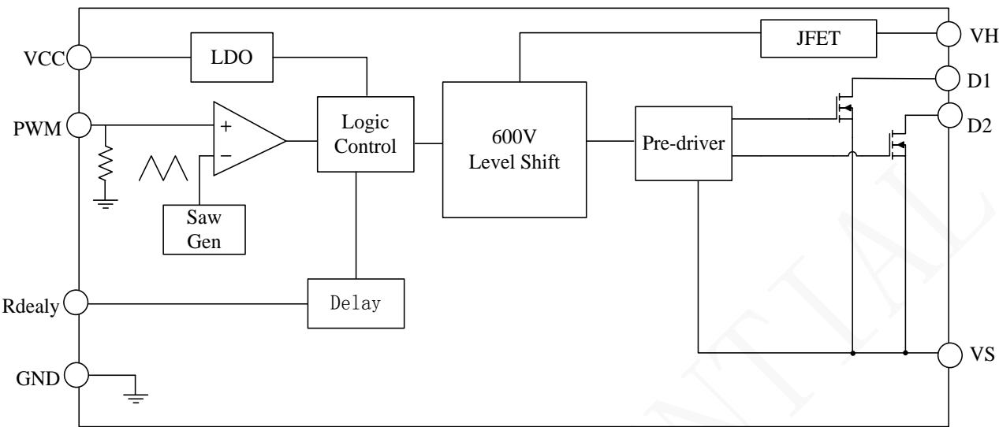
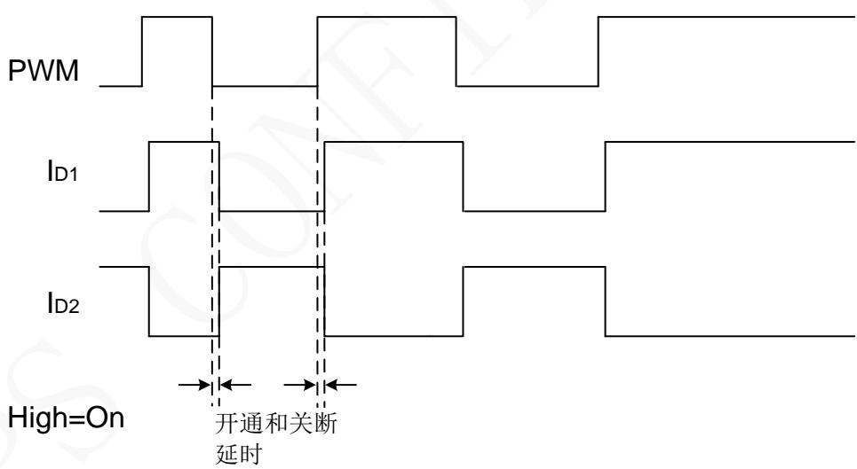
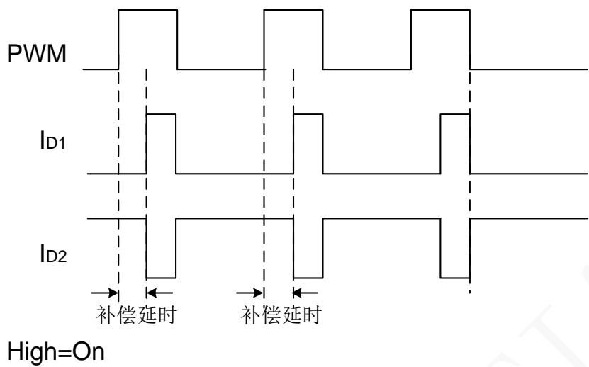
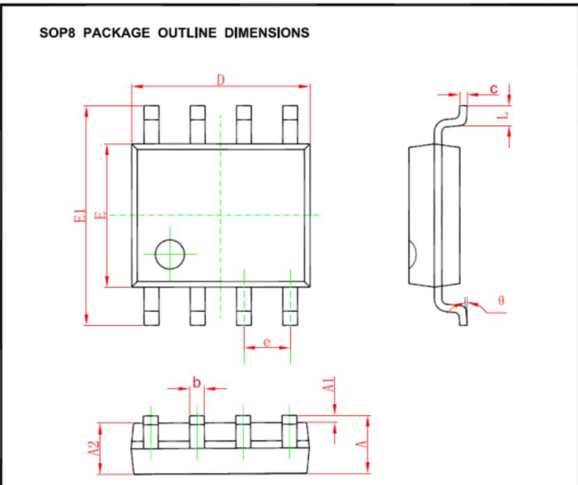

## 概述

BP5936D 是一款内置双路 250V MOSFET 的高性能 PWM/Analog 调色控制芯片，通过调节输入的PWM 信号占空比或模拟电平，来调整两路 LED光源的发光比例，从而达到调色目的。两路 LED输出电流互补，在调色过程中总电流不变，等于恒流源的电流。

BP5936D 外部元器件极少，VCC 可以由待机电源的 3.3V 来供电，并省去了 High Side 供电外部元器件。芯片可以兼容幅值为 3.3V/5V 的 PWM 信号和0.5V～1.8V 模拟信号。浮动的高压侧对GND耐压可以达到600V，能够广泛适应于各种LED恒流驱动电路。

BP5936D 特有的色温补偿功能，可以通过外部电阻来设置两路LED灯珠的色温偏差。

## 特点

◼ PWM/Analog 双路互补调色

◼ VCC宽电压范围，支持3.3V供电

◼ 内置双路 250V/6Ω MOSFET

◼ 兼容 3.3V/5V 输入 PWM 信号

◼ 兼容 10kHz 以下的 PWM 信号调色

◼ 兼容 0.4V～2.0V 模拟信号调色

◼ 外围电阻可调色温偏差

◼ 高压侧对 GND 耐压 600V

◼ 低待机功耗

◼ 采用 SOP8 封装

## 应用

◼ LED 调光调色智能灯泡

◼ 拨码开关调色LED照明

◼ 其他LED 智能照明

## 典型应用

  
图 1. BP5936D 典型应用图

## 定购信息

<table><tr><td>定购型号</td><td>封装</td><td>温度范围</td><td>包装形式</td><td>打印</td></tr><tr><td>BP5936D</td><td>SOP8</td><td>-40 °C to 105 °C</td><td>编带4000 颗/盘</td><td>BP5936XXXXXXYWXXXYYD</td></tr></table>

## 管脚封装

  
XXXXXXY: lot code WXXX: Sign YY：Week  
图2 管脚封装图

## 管脚描述

<table><tr><td>管脚号</td><td>管脚名称</td><td>描述</td></tr><tr><td>1</td><td>VH</td><td>高压侧供电端</td></tr><tr><td>2</td><td>VS</td><td>高压侧浮地</td></tr><tr><td>3</td><td>D2</td><td>MOSFET 2 漏极</td></tr><tr><td>4</td><td>D1</td><td>MOSFET 1 漏极</td></tr><tr><td>5</td><td>Rdelay</td><td>色温补偿设置电阻,不用时浮空。</td></tr><tr><td>6</td><td>PWM</td><td>PWM 信号输入端</td></tr><tr><td>7</td><td>VCC</td><td>低压供电端</td></tr><tr><td>8</td><td>GND</td><td>芯片地</td></tr></table>

极限参数(注 1)

<table><tr><td>符号</td><td>参数</td><td>参数范围</td><td>单位</td></tr><tr><td>VH - VS</td><td>芯片高压供电端耐压</td><td>-0.3~300</td><td>V</td></tr><tr><td>VS - GND</td><td>高压侧浮地对低压侧 GND 耐压</td><td>-0.3~600</td><td>V</td></tr><tr><td>D1, D2</td><td>内部功率管漏极到源极峰值电压</td><td>-0.3~250</td><td>V</td></tr><tr><td> $I_{DMAX}$ </td><td>D1,D2 内部功率管漏极最大电流</td><td>200</td><td>mA</td></tr><tr><td>VCC</td><td>芯片低压供电接口</td><td>-0.3~20</td><td>V</td></tr><tr><td>PWM</td><td>PWM 调光接口</td><td>-0.3~6</td><td>V</td></tr><tr><td>Rdelay</td><td>色温补偿接口</td><td>-0.3~6</td><td>V</td></tr><tr><td> $P_{DMAX}$ </td><td>功耗(注 2)</td><td>0.45</td><td>W</td></tr><tr><td> $\theta_{JA}$ </td><td>PN结到环境的热阻</td><td>145</td><td>°C/W</td></tr><tr><td> $T_J$ </td><td>工作结温范围</td><td>-40 to 150</td><td>°C</td></tr><tr><td> $T_{STG}$ </td><td>储存温度范围</td><td>-55 to 150</td><td>°C</td></tr></table>

注 1：最大极限值是指超出该工作范围，芯片有可能损坏。推荐工作范围是指在该范围内，器件功能正常，但并不完全保证满足个别性能指标。电气参数定义了器件在工作范围内并且在保证特定性能指标的测试条件下的直流和交流电参数规范。对于未给定上下限值的参数，该规范不予保证其精度，但其典型值合理反映了器件性能。

注 2：温度升高最大功耗一定会减小，这也是由 T , θ ,和环境温度 T 所决定的。最大允许功耗为 $\mathrm { { P _ { D M A X } } \ = \ \left( T _ { \mathrm { { J M A X } } } \ - \ \bar { \ T } _ { \mathrm { { A } } } \right) / }$ θ 或是极限范围给出的数字中比较低的那个值。

电气参数 ( 注 3, 4) (无特别说明情况下, VCC=3.3V, VHS=30V， TA=25℃)

<table><tr><td>符号</td><td>描述</td><td>条件</td><td>最小值</td><td>典型值</td><td>最大值</td><td>单位</td></tr><tr><td colspan="7">电源电压</td></tr><tr><td> $V_{CC\_OP}$ </td><td> $V_{CC}$ 工作电压范围</td><td></td><td>3.0</td><td></td><td>20</td><td>V</td></tr><tr><td> $I_{QCC}$ </td><td>低压侧芯片工作电流</td><td>PWM=0V</td><td>50</td><td>80</td><td>120</td><td>uA</td></tr><tr><td> $I_{QHS}$ </td><td>高压侧工作电流</td><td>PWM=3.3V</td><td></td><td>40</td><td>80</td><td>uA</td></tr><tr><td> $I_{LK}$ </td><td>高压侧对GND漏电流</td><td>VH=VS=600V</td><td></td><td></td><td>50</td><td>uA</td></tr><tr><td colspan="7">PWM</td></tr><tr><td>PWM_H</td><td>PWM高电平</td><td></td><td>2.2</td><td></td><td></td><td>V</td></tr><tr><td>PWM_L</td><td>PWM低电平</td><td></td><td></td><td></td><td>0.25</td><td>V</td></tr><tr><td> $R_{PWM}$ </td><td>PWM下拉电阻</td><td></td><td></td><td>200</td><td></td><td>kΩ</td></tr><tr><td> $V_{PWM}$ </td><td>输入模拟调色电压范围</td><td></td><td>0.5</td><td></td><td>1.8</td><td>V</td></tr><tr><td> $F_{CRY}$ </td><td>模拟调色输出载波频率</td><td></td><td>4</td><td>5</td><td>6</td><td>kHz</td></tr><tr><td colspan="7">Rdelay</td></tr><tr><td> $T_{delay}$ </td><td>色温补偿延时时间</td><td>Rdelay=20kΩ</td><td>54</td><td>60</td><td>66</td><td>us</td></tr><tr><td> $V_{delay}$ </td><td> $R_{delay}$ 脚内部电压</td><td></td><td></td><td>0.3</td><td></td><td>V</td></tr><tr><td> $R_{delay}$ </td><td>外接下拉电阻阻值范围</td><td></td><td>4</td><td></td><td>40</td><td>kΩ</td></tr><tr><td colspan="7">功率管(D1,D2)</td></tr><tr><td> $R_{DS\_ON}$ </td><td>功率管导通阻抗</td><td> $I_{DS}=100mA$ </td><td></td><td>5.5</td><td></td><td rowspan="2">ΩV</td></tr><tr><td> $BV_{DSS}$ </td><td>功率管的击穿电压</td><td></td><td>250</td><td></td><td></td></tr><tr><td colspan="7">内部时间控制</td></tr><tr><td> $t_{on}$ </td><td>开通延时</td><td> $V_S$ =0V</td><td></td><td>350</td><td></td><td>ns</td></tr><tr><td> $t_{off}$ </td><td>关断延时</td><td> $V_S$ =0V or 500V</td><td></td><td>350</td><td></td><td>ns</td></tr></table>

注 3：典型参数值为 25˚C 下测得的参数标准。  
注 4：规格书的最小、最大规范范围由测试保证，典型值由设计、测试或统计分析保证。

## 内部结构框图

  
Figure 3. BP5936D 内部框图

## PWM调色时序图

  
Figure 4. PWM 调色时序图

  
Figure 5. 色温补偿时序图

## 应用信息

BP5936D 是一款内置双路 250V MOSFET 的高性能 PWM/Analog 调色控制芯片，通过调节输入的PWM 信号占空比或模拟电平，来调整两路 LED光源的发光比例，从而达到调色目的。两路 LED输出电流互补，在调色过程中总电流不变。

## 启动

系统上电后，芯片低压侧由外部供电线路通过VCC 脚对芯片内部供电，当 VCC 脚电压低于芯片开启阈值时，默认MOS D1关闭，MOS D2开通。当 VCC 脚电压高于芯片开启阈值时，MOS D1和D2受外部的PWM信号控制。

芯片高压侧由LED电压直接供电，LED 电压通过内部 JFET 给芯片提供电压基准。为保证高侧电压稳定，推荐 LED 电压大于10V。

## PWM 调色原理

BP5936D由外部的PWM信号对双路LED进行色温的调整，当 V 高于 PWM\_H 时, MOS D1 开通, 连接 D1 的 LED 点亮, 同时 D2 关断；当 VPWM低于 PWM\_L 时, MOS D2 开通, 连接 D2 的 LED点亮, 同时D1关断。

BP5936D可以兼容幅值为3.3V/5V的PWM 信号。PWM高电平需要大于2.2V，PWM低电平需要小于 0.25V.

BP5936D可以兼容模拟电压信号。当PWM输入0.5V～1.8V的直流电压时，芯片将采用内部5kHz的固定载波来调节输出占空比。

当芯片采用模拟调光时，控制灭灯时的模信号电压要低于0.25V，控制100%亮度时模信号电压要高于2.2V，除此此外其他亮度的档位，模信号电压应控制在0.5V\~1.8V以内。

## 色温补偿

Rdelay脚通过外接电阻到地，可以补偿不同灯珠的固有色温偏差。补偿后D1的脉宽减小，占空比减小；相应D2的脉宽增大，占空比增大。补偿时间的计算公式如下：

$$
T _ {d e l a y} (u s) = (3. 4 5 9 * R (k \Omega) + 4. 2 6 7) * 0. 9
$$

电阻阻值范围为4kΩ～40kΩ，大于160kΩ或者悬空时，该功能无效，无补偿延时。PWM输入常为0或1时，该功能无效，无补偿延时。

## PCB 设计

在设计 BP5936D PCB时，需要遵循以下指南：

GND 引脚：

尽量减小GND的铜箔长度以减小各种寄生参数减低铜箔上的噪声。

VS引脚：

浮地脚VS的铜箔面积要尽可能的大以提高散热性能。

D1、D2脚和VH 引脚，尽量远离低压信号。

供电电容：

低压端的VCC电容要尽量靠近VCC脚。

PWM信号线：

从 MCU 的信号输出到 BP5936D 的 PWM 引脚走线尽量短。避免 PCB 上其他噪声信号对 PWM 信号的干扰。

## 封装信息

<table><tr><td rowspan="2">Symbol</td><td colspan="2">Dimensions In Millimeters</td><td colspan="2">Dimensions In Inches</td></tr><tr><td>Min</td><td>Max</td><td>Min</td><td>Max</td></tr><tr><td>A</td><td>1.350</td><td>1.750</td><td>0.053</td><td>0.069</td></tr><tr><td>A1</td><td>0.100</td><td>0.250</td><td>0.004</td><td>0.010</td></tr><tr><td>A2</td><td>1.350</td><td>1.550</td><td>0.053</td><td>0.061</td></tr><tr><td>b</td><td>0.330</td><td>0.510</td><td>0.013</td><td>0.020</td></tr><tr><td>c</td><td>0.170</td><td>0.250</td><td>0.006</td><td>0.010</td></tr><tr><td>D</td><td>4.700</td><td>5.100</td><td>0.185</td><td>0.200</td></tr><tr><td>E</td><td>3.800</td><td>4.000</td><td>0.150</td><td>0.157</td></tr><tr><td>E1</td><td>5.800</td><td>6.200</td><td>0.228</td><td>0.244</td></tr><tr><td>e</td><td colspan="2">1.270 (BSC)</td><td colspan="2">0.050 (BSC)</td></tr><tr><td>L</td><td>0.400</td><td>1.270</td><td>0.016</td><td>0.050</td></tr><tr><td>θ</td><td> $0^{\circ}$ </td><td> $8^{\circ}$ </td><td> $0^{\circ}$ </td><td> $8^{\circ}$ </td></tr></table>

## 重要声明

晶丰明源尽力确保本产品规格书内容的准确和可靠，但是保留在没有通知的情况下，修改规格书内容的权利。

本产品规格书未包含任何针对晶丰明源或第三方所有的知识产权的授权。针对本产品规格书所记载的信息，晶丰明源不做任何明示或暗示的保证，包括但不限于对规格书内容的准确性、商业上的适销性，特定目的的适用性或者不侵犯晶丰明源或任何第三人知识产权做任何明示或暗示保证，晶丰明源也不就因本规格书本身及其使用有关的偶然或必然损失承担任何责任。