## 概述

BP62110是一款高性能的同步整流控制芯片，支持CCM、DCM和QR工作模式，适用于高效率、高功率密度反激变换器应用。

BP62110 采用预关断工作模式，驱动电压根据功率MOSFET压降自适应调整，加上超短的关断延时和高达4A的驱动下拉电流，能够实现超快的关断速度，使得系统能可靠工作于CCM模式。

BP62110 芯片内部使用了振铃检测电路，避免了在 DCM模式下由于自由振荡引起误开通而导致的初次级共通问题。同时内置前沿消隐时间，可以防止寄生振荡误触发MOSFET提前关断，从而保证同步整流稳定工作。超短的开通延时可以增加 MOSFET 导通时间以获得尽可能高的效率。

BP62110采用 VD引脚自供电的方法，无需外部供电，可灵活地选择放置在输出正端或负端。放置于正端时，不需要额外的供电绕组，外围电路⾮常简洁。同时，由于自供电，可以实现宽输出电压范围，输出电压可以低至0V，⾮常适合充电器应用。

BP62110 采用 SOT23-6 封装。

## 特点

 支持 CCM/DCM/QR 工作模式

 自适应驱动电压，超快关断速度，防止CCM模式初次级共通

 内置振铃检测，防止DCM 误开通

 可用于正端和负端整流

 芯片自供电，正端整流无需辅助供电绕组

 支持宽输出电压范围，可低至0V输出

最大4A驱动下拉电流，超低驱动内阻可避免密勒效应引起误开通

超短开通延时，增加MOSFET导通时间，优化了效率

 低待机功耗，满足六级能效要求

 外围电路简洁

## 应用领域

 QC/USB-PD/可编程 AC-DC 充电器

 高效率电源适配器

 高效率、高功率密度反激变换器

## 典型应用

SOT23-6 封装  
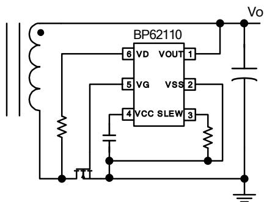  
图 1. BP62110 典型应用图

## 定购信息

<table><tr><td>定购型号</td><td>封装</td><td>包装形式</td><td>打印</td></tr><tr><td>BP62110</td><td>SOT23-6</td><td>卷盘3,000 颗/盘</td><td>62110</td></tr></table>

## 管脚封装

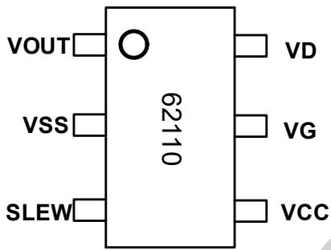  
SOT23-6

  
图2 管脚封装图

## 管脚描述

<table><tr><td>管脚号</td><td>管脚名称</td><td>描述</td></tr><tr><td>1</td><td>VOUT</td><td>输出电压检测端,同时也向芯片供电,可以连接到输出或者 VCC 脚</td></tr><tr><td>2</td><td>VSS</td><td>芯片地</td></tr><tr><td>3</td><td>SLEW</td><td>dv/dt timer 设定引脚</td></tr><tr><td>4</td><td>VCC</td><td>芯片供电脚</td></tr><tr><td>5</td><td>VG</td><td>驱动输出</td></tr><tr><td>6</td><td>VD</td><td>功率 MOSFET 漏极电压检测脚,同时也是自供电引脚</td></tr></table>

## 极限参数（注 1）

<table><tr><td>符号</td><td>参数</td><td>参数范围</td><td>单位</td></tr><tr><td>VCC</td><td> $V_{CC}$ 电压</td><td>-0.3~12</td><td>V</td></tr><tr><td> $V_D$ </td><td>VD引脚电压范围</td><td>-1~120</td><td>V</td></tr><tr><td>VG</td><td>VG引脚电压范围</td><td>-0.7~12</td><td>V</td></tr><tr><td> $V_{SLEW}$ </td><td>SLEW引脚电压范围</td><td>-0.7~7</td><td>V</td></tr><tr><td>VOUT</td><td>VOUT引脚电压范围</td><td>-0.7~30</td><td>V</td></tr><tr><td> $P_{DMAX}$ </td><td>功耗(注2)</td><td>0.97</td><td>W</td></tr><tr><td> $θ_{JA}$ </td><td>结到环境的热阻 SOT23-6(注3)</td><td>220</td><td>°C/W</td></tr><tr><td> $θ_{JC}$ </td><td>结到芯片表面的热阻(注3)</td><td>70</td><td>°C/W</td></tr><tr><td> $T_J$ </td><td>工作结温范围</td><td>-40~150</td><td>°C</td></tr><tr><td> $T_{STG}$ </td><td>储存温度范围</td><td>-55~150</td><td>°C</td></tr><tr><td>ESD</td><td>人体模型 ESD(注4)</td><td>2</td><td>kV</td></tr></table>

注 1：极限参数是指超出该工作范围，芯片有可能损坏。电气参数定义了器件在工作范围内并且在保证特定性能指标的测试条件下的直流和交流电参数规范。对于未给定上下限值的参数，该规范不予保证其精度，但其典型值合理反映了器件性能。  
注 2：温度升高最大功耗一定会减小，这也是由T , θ ,和环境温度T 所决定的。最大允许功耗为 $\mathsf { P } _ { \sf D M A X } = ( \mathsf { T } _ { \sf J M A X } - \mathsf { T } _ { \mathsf { A } } ) /$ θ 或是极限范围给出的数字中比较低的那个值。  
注 3：1平方英寸双层PCB板，按照JEDEC 标准测试。  
注 4：人体模型，100pF电容通过1.5kΩ电阻放电。

## 超快关断 CCM/DCM 同步整流驱动控制器

## 电气参数(注5)（无特别说明情况下， TA =25 ℃）

<table><tr><td>符号</td><td>描述</td><td>条件</td><td>最小值</td><td>典型值</td><td>最大值</td><td>单位</td></tr><tr><td colspan="7">VCC供电部分</td></tr><tr><td> $V_{CC\_ON}$ </td><td>VCC启动阈值电压</td><td>VCC上升至IC开启</td><td>4.2</td><td>4.6</td><td>5</td><td>V</td></tr><tr><td> $V_{CC\_UVLO}$ </td><td>VCC欠压保护开启电压</td><td>VCC下降至IC关闭</td><td>3.6</td><td>4</td><td>4.4</td><td>V</td></tr><tr><td rowspan="2"> $V_{CC\_REG}$ </td><td rowspan="2">VCC调整电压</td><td> $V_{VD}=14V$ </td><td>8.5</td><td>9.2</td><td>9.7</td><td>V</td></tr><tr><td>VOUT引脚连接到输出,当输出电压&gt;9V</td><td></td><td>10</td><td></td><td>V</td></tr><tr><td> $I_{CH}$ </td><td>VCC电容充电电流</td><td>VCC=7V, $V_{VD}=14V$ </td><td>37</td><td>55</td><td>71</td><td>mA</td></tr><tr><td> $I_Q$ </td><td>静态工作电流</td><td>VCC=9V</td><td>180</td><td>250</td><td>340</td><td>μA</td></tr><tr><td> $I_{CC}$ </td><td>工作电流</td><td>VCC=9V, $F_{sw}=100kHz$ </td><td></td><td>5</td><td></td><td>mA</td></tr><tr><td colspan="7">控制电路</td></tr><tr><td> $V_{DS\_REG}$ </td><td>VDS电压调整值</td><td> $T_J=25°C$ </td><td></td><td>-45</td><td></td><td>mV</td></tr><tr><td> $V_{ON\_TH}$ </td><td>驱动开通VDS阈值电压</td><td> $T_J=25°C$ </td><td></td><td>-180</td><td></td><td>mV</td></tr><tr><td> $V_{OFF\_TH}$ </td><td>驱动关断VDS阈值电压</td><td> $T_J=25°C$ </td><td></td><td>0</td><td></td><td>mV</td></tr><tr><td> $t_{Delay\_ON}$ </td><td>开通延时</td><td> $T_J=25°C$ </td><td></td><td>30</td><td></td><td>ns</td></tr><tr><td> $t_{Delay\_OFF}$ </td><td>关断延时</td><td> $T_J=25°C$ </td><td></td><td>10</td><td></td><td>ns</td></tr><tr><td> $t_{B\_ON}$ </td><td>开通消隐时间</td><td> $T_J=25°C$ </td><td></td><td>1</td><td></td><td>μs</td></tr><tr><td> $V_{B\_OFF}$ </td><td>消隐时间内VDS关断阈值</td><td> $T_J=25°C$ </td><td></td><td>2</td><td></td><td>V</td></tr><tr><td> $t_{OFF\_MIN}$ </td><td>最小关断时间</td><td> $T_J=25°C$ </td><td></td><td>300</td><td></td><td>ns</td></tr><tr><td> $t_{SLEW}$ </td><td>斜率检测时间</td><td>SLEW引脚接芯片地</td><td></td><td>18</td><td></td><td>ns</td></tr><tr><td> $V_{UVLO\_ON}$ </td><td>输出欠压保护阈值</td><td rowspan="2"> $T_J=25°C$ </td><td></td><td>2.5</td><td></td><td>V</td></tr><tr><td> $V_{UVLO\_HYS}$ </td><td>输出欠压保护迟滞</td><td></td><td>0.5</td><td></td><td>V</td></tr><tr><td colspan="7">驱动输出</td></tr><tr><td> $V_{GL}$ </td><td>输出低电平</td><td>VCC=9V, $I_{sink}=100mA$ </td><td></td><td></td><td>0.08</td><td>V</td></tr><tr><td> $V_{GH}$ </td><td>输出高电平</td><td>VCC=9V, $I_{source}=100mA$ </td><td>8.6</td><td></td><td></td><td>V</td></tr><tr><td> $I_{SOURCE}$ </td><td>最大驱动输出电流</td><td>VCC=9V</td><td></td><td>1</td><td></td><td>A</td></tr><tr><td> $I_{SINK}$ </td><td>最大下拉电流</td><td>VCC=9V</td><td></td><td>4</td><td></td><td>A</td></tr><tr><td> $R_L$ </td><td>下拉阻抗</td><td> $T_J=25°C$ </td><td></td><td>0.5</td><td></td><td>Ω</td></tr></table>

注 5：电气参数定义了器件在工作范围内并且在保证特定性能指标的测试条件下的直流和交流电参数规范。最小值和最大值由测试保证，典型值由设计、测试或统计分析保证。对于未给定上下限值的参数，该规范不予保证其精度，但其典型值合理反映了器件性能。

## 内部结构框图

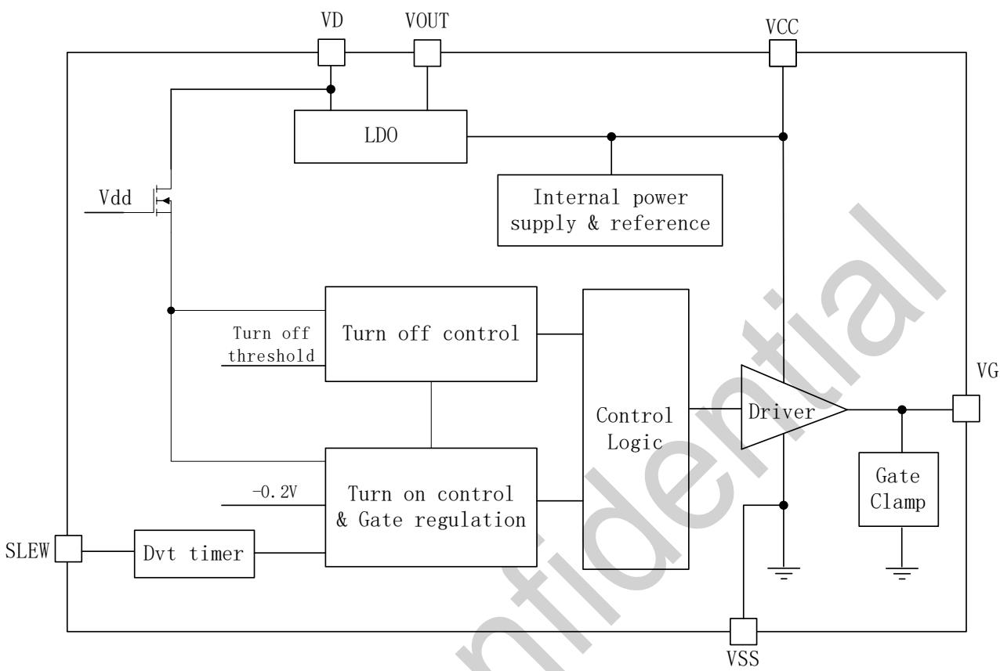  
图 3. BP62110 内部框图

## 功能描述

BP62110 是一款用于替代反激式变换器副边整流二极管的高性能同步整流控制芯片。BP62110 支持 CCM、DCM以及QR 工作模式， 采用预关断技术，驱动电压随MOSFET 漏极到源极的电压升高而降低。同时超短的关断延时和高 的驱动下拉电流，能够实现超快的关用了振 检测电路，避免了由于自由振荡引起误开通而导致的初次级共通问题，保证芯片也能在 DCM 模式下可靠工作。30 ns 超短开通延时减短了体二极管的导通时间，增加了MOSFET沟道的导通时间，极大地提高了效率。（注 6：以下描述到的参数均为电气参数列表中的典型值，除⾮特别说明是最大或最小值）

## 启动和VCC 欠压保护

系统启动时，BP62110通过VD引脚对VCC 电容充电，充电电流为ICH 。当VCC电压上升到启动阈值电压VCC\_ON时，芯片退出VCC欠压保护状态，内部控制电路开始工作，驱动同步整流MOSFET正常导通和关断。芯片工作时，所需的工作电流仍然会通过VD引脚提供，内部线性调整器将VCC 稳压到VCC\_REG 。当VCC电压下降到低于欠压保护阈值VCC\_UVLO时，控制器进入欠压保护状态，驱动保持低电平，同步整流MOSFET处于关断状态，直到VCC电压再次升高到VCC\_ON 。

当VCC引脚电压低于欠压保护电压 $( V _ { C C \_ U V L O } )$ 时控制器关断同步整流MOSFET，此时电流从体二极管流过。

## 输出欠压保护

BP62110放置在负端使用，当VOUT引脚接输出电压时，输出电压低于 $V _ { \mathsf { U V L O \_ O N } }$ 同步整流驱动关闭。这样可以避免开机或者输出短路时CCM过深，变压器去磁不够，原边电流累计过高而导致原副边 MOSFET 电压尖峰过高。放置在正端使用时，需将 VOUT 引脚短接至 VCC 引脚（如图4所示）。

## 漏极电压检测

BP62110 通过 VD 引脚检测同步 MOSFET 漏极电压达到检测电流的目的，从而驱动MOSFET导通和关闭实现同步整流。当原边开关管关断后，变压器次级续流，同步 MOSFET 的体二极管导通， $\mathsf { V } _ { \mathsf { D S } }$ 电压由正变为负，控制器驱动MOSFET开通。由于体二极管导通时有比较大的正向压降，导致 VD 引脚存在负电流，过大的负电流可能会导致控制电路的地不稳定使得驱动提前关断，降低效率。为了减小VD引脚负电流，建议在VD 引脚串接一个电阻，推荐典型阻值为 $3 0 0 ~ \Omega _ { \circ }$ 。电阻太大会影响VCC供电和漏极电压斜率检测，因此不建议使用超过500 Ω的电阻。

## 斜率检测与驱动开通

当 VD 引脚检测到 MOSFET 的 V 从 2 V 下降至驱动开通阈值电压 $V _ { \mathsf { O N \_ T H } }$ 的时间小于芯片设定的斜率检测时间t 时，控制器驱动同步MOSFET导通，开通延迟时间为 TDELAY\_ON 。如果下降到 $V _ { \mathsf { O N \_ T H } }$ 的时间超过tSLEW，那么驱动电路保持 MOSFET 关断，防止由于 DCM 模式下的自由振荡引起误开通导致的初次级共通问题。

在 DCM 模式 ，当反激变压器去磁完成，次级电流下降到零后，变压器励磁电感和寄生电容产生自由振荡。由于初次级芯片通过漏极供电或者钳位电路的漏电流导致变压器中存储了能量，自由振荡幅度被增大而使得同步整流管漏极电压可能振荡到低于 $0 \mathsf { V } _ { \circ }$ 。如果没有斜率检测电路，控制器会误开通MOSFET并维持导通状态，直到开通消隐时间 $\tan B L$ 结束。如果这段时间内原边功率开关开通，就会导致初次级共通。斜率检测电路能够有效地分辨自由振荡和初级开关关断现象，禁止控制器在自由振荡期间开通MOSFET，避免共通问题。

BP62110 可通过 SLEW 引脚设定斜率检测时间 $\tan$ SLEW引脚接 VS时， $\mathtt { t s } \mathtt { \Gamma } \mathtt { c } \mathtt { w }$ 为 18 nS; SLEW 引脚悬空时，芯片使用默认 $\mathtt { t s } \mathtt { \Gamma } \mathtt { L E W }$ 为 30 ns；当 SLEW 通过电阻 $\mathsf { R s L E W }$ 接到到VS时：

$$
t _ {S L E W} = 1 8 \mathrm{ns} + R _ {S L E W} \times 0. 2 2 \mathrm{nS/k} \Omega
$$

为了避免被判断为悬空状态， $\mathsf { R s L E W }$ 最大允许取值为150$\mathsf { k } \Omega _ { \circ }$

## 开通消隐时间

BP62110 驱动 MOSFET 开通后，控制器在开通消隐时间 $\tan B L$ 内维持 MOSF T 导通，以禁止由于变压器漏感和寄生电容产生的高频振荡触发到关断阈值电压 $V _ { \mathsf { O F F \_ T H } }$ 提前关断。但是如果在消隐时间内 $\mathsf { V } _ { \mathsf { D S } }$ 向上穿过消隐关断阈值 $V _ { O F F \_ B L } ,$ ，则控制器立即关断MOSFET。

## 自适应驱动电压

P62110 采用预关断技术，驱动电压随 MOSFET 漏极到源极的电压差自适应调整。在一个开关周期内，当次级电流下降， $\mathsf { V } _ { \mathsf { D S } }$ 电压高于调整值 $V _ { D S \_ R E G }$ 时，BP62110降低驱动电压，增加MOSFET的导通内阻，使 $\mathsf { V } _ { \mathsf { D S } }$ 电压维持到 $V _ { D S \_ R E G }$ 直到通过 MOSFET 的电流下降到零。这样做的好处是在MOSFET关断时，⻔极电压很低，可以实现较快的关断速度。在CCM模式下这个功能显得尤其重要，较快的关断速度可以减小次级的反向电流，从而降低同步整流管的电压尖峰。

## 驱动关断

在导通时间已经超过开通消隐时间 tON\_BL 的情况下，当$V _ { \sf D S }$ 电压上升到 $V _ { \mathsf { O F F \_ T H } }$ 时，控制器立即关断 MOSFET。其最大 4 A 下拉电流，可以快速拉低⻔极电压，同时超低驱动内阻可以消除密勒效应引起的误开通。

## 最小关断时间

控制器一旦关断驱动，在最小关断时间 $\mathsf { t o F F \_ M I N }$ 内（300ns）将锁定关断状态。

## 典型应用

BP62110搭配 MOSFET可以放置在输出正端或输出负端来取代肖特基二极管（如图4、图 5所示），且不需要额外的辅助绕组供电。VD 脚为控制器的漏极电压检测脚和内部自供电输入端，VD脚需要通过300R电阻与同步整流MOSFET漏极相连。

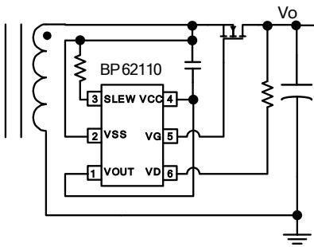  
图4. SR放置在正端典型应用电路图

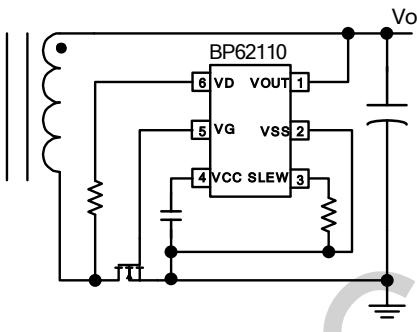  
图5.SR放置在负端典型应用电路图

## PCB Layout 指南

为保证系统可靠工作，在设计PCB 时， 需要遵循以下建议：

1) 在 VCC 和 S 引脚之间放置一个 1 μF 的 VCC 瓷片电容，并靠近芯片，以提升芯片的抗⼲扰能⼒。

2) BP62110 的 VD 引脚连接 300 Ω电阻到 MOSFET的漏极引脚， VD引脚为控制器的漏极电压检测引脚，检测回路（D、VD 与 S/VSS 引脚）需尽可能小，并与功率环路分开，避免不同回路互相⼲扰。该电阻应靠近 VD 引脚端。一般而言，电阻与MOSFET 的漏极引脚采用单点连接，连接位置为MOSFET 的漏极引脚的焊盘。以避免引入 PCB 走线上的寄生电感。引入PCB 寄生电感后，由于电流斜率为负，寄生电感上的电压降方向与MOSFET压降相反。VD 引脚实际检测到的电压是在 MOSFET的 $\mathsf { V } _ { \mathsf { D S } }$ 上叠加了一个正的直流偏置（如图 6）。因此，自适应驱动电压偏低，MOSFET损耗增加，降低了系统效率。

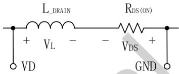  
图6.MOSFET导通时漏极PCB 寄生电感的电压

3) 但是引入适量的寄生电感，有利于 CCM 模式下快速关断，减小反向电流，从而降低同步整流管的电CCM 模式当原边功率管开通时，次级电流迅速减小，寄生电感上的感应电增加，VD 对地电压变为正电压，控制器将快速断MOSFET，使反向电流尽可能减小。因此，必要时可以尝试将 VD 电阻与漏极连接点放置在变压器引脚端，达到降低漏极电压尖峰的目的。

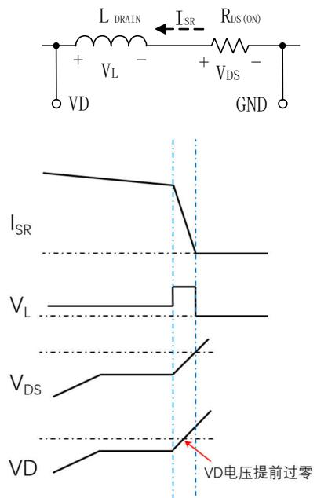  
图7.CCM模式下寄生电感帮助快速关断

## 封装信息

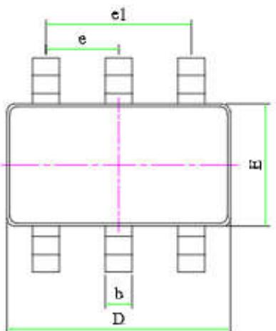  
SOT23-6 封装外形尺寸

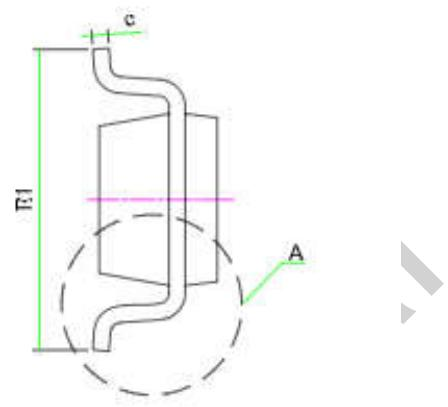

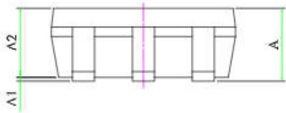

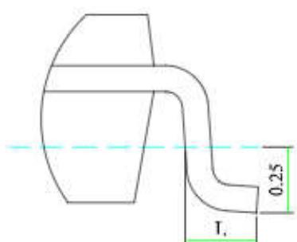  
DETAIL A

<table><tr><td rowspan="2">SYMBOL</td><td colspan="3">MILLIMETER</td></tr><tr><td>MIN</td><td>NOM</td><td>MAX</td></tr><tr><td>A</td><td>-</td><td>-</td><td>1.45</td></tr><tr><td>A1</td><td>-</td><td>-</td><td>0.15</td></tr><tr><td>A2</td><td>0.89</td><td>-</td><td>1.30</td></tr><tr><td>D</td><td>2.80</td><td>-</td><td>3.03</td></tr><tr><td>E</td><td>1.50</td><td>1.60</td><td>1.73</td></tr><tr><td>E1</td><td>2.60</td><td>2.80</td><td>3.00</td></tr><tr><td>L</td><td>0.30</td><td>0.45</td><td>0.60</td></tr><tr><td>b</td><td>0.30</td><td>0.40</td><td>0.50</td></tr><tr><td>c</td><td>0.09</td><td>0.15</td><td>0.20</td></tr><tr><td>e</td><td>0.85</td><td>-</td><td>1.05</td></tr><tr><td>e1</td><td>1.80</td><td>1.90</td><td>2.00</td></tr></table>

## 版本信息

<table><tr><td>版本</td><td>日期</td><td>记录</td></tr><tr><td>Rev. 1.0</td><td>2023/3</td><td>正式发行</td></tr><tr><td></td><td></td><td></td></tr><tr><td></td><td></td><td></td></tr></table>

## 免责声明

晶丰明源尽⼒确保本产品规格书内容的准确和可靠，但是保留在没有通知的情况下，修改规格书内容的权利。

本产品规格书未包含任何针对晶丰明源或第三方所有的知识产权的授权。针对本产品规格书所记载的信息，晶丰明源不做任何明示或暗示的保证，包括但不限于对规格书内容的准确性、商业上的适销性、特定目的的适用性或者不侵犯晶丰明源或任何第三人知识产权做任何明示或暗示保证，晶丰明源也不就因本规格书本⾝及其使用有关的偶然或必然损失承担任何责任。