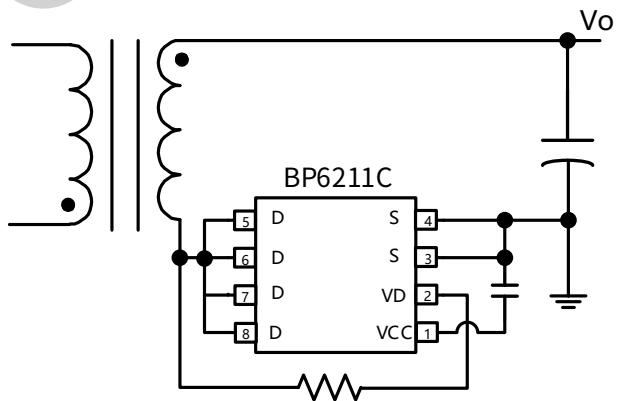
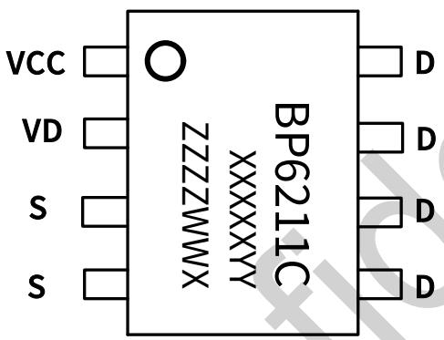
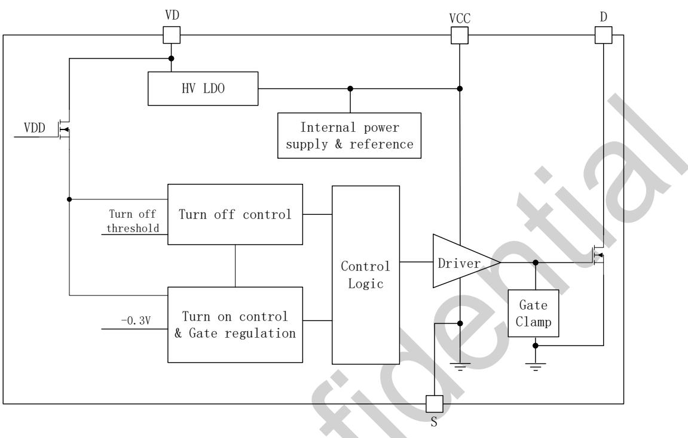
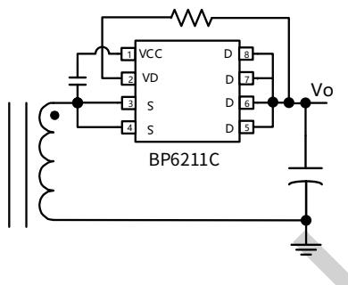
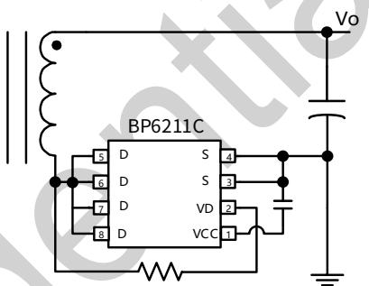
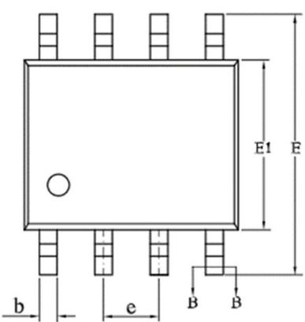
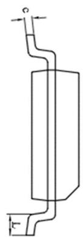
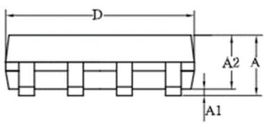
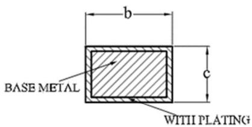

## Description

The BP6211C is a high-performance, high-integration, self-biased synchronous rectifier (SR) with a 60 V MOSFET integrated for flyback converters. It can replace the secondary diode rectifier for higher efficiency and power density.

The BP6211C supports discontinuous conduction mode (DCM), quasi-resonant (QR) and continuous conduction mode (CCM) operations. Robust operation in CCM is enabled with adaptive gate drive and faster turn-off speed with 4 A sink current and ultra-short turn-off delay.

The internal ringing detection circuitry prevents the IC from falsely turning on during DCM or QR operations. The internal turn-on blanking function prevents an accidental turn-off due to parasitic ringing. Ultra-short turn-on delay increases SR MOSFET conduction time to improve efficiency.

The BP6211C generates its own supply voltage without requiring auxiliary winding for low-side or high-side rectification. This feature makes it suitable for charger applications with a very low output voltage or wide output voltage range.

The BP6211C is available in an SOP-8 package.

## Features

■ Integrated 60 V MOSFET

■ Adaptive gate drive and faster turn-off speed

■ Supports DCM, QR and CCM operations

■ Ringing detection prevents false turn-on in DCM

■ Supports low-side and high-side rectification

■ Self-biased and no need for auxiliary winding for high-side rectification

■ Supports wide output voltage range down to 0 V

■ 4 A sink gate driver prevent false turn-on by the miller effect

■ Ultra-short turn-on delay, increase MOSFET conduction time, optimize efficiency

■ Low quiescent current

■ Compatible with energy efficiency regulations

## Applications

■ QC, USB-PD and PPS AC-DC Chargers

■ High Efficiency Adaptors

  
SOP-8 Package

■ High Efficiency and Power Density Flyback Converters

## Typical Application

  
Figure 1. BP6211C Typical Application

## Ordering Information

<table><tr><td>Part Number</td><td>Package</td><td>Packing</td><td>Marking</td></tr><tr><td>BP6211C</td><td>SOP-8</td><td>Tape &amp; Reel4,000 pcs/Reel</td><td>BP6211CXXXXYYZZZZWWX</td></tr></table>

## Pin Configuration and Marking Information

  
Figure 2. SOP-8 Pin Configuration

BP6211C: Part Number

XXXXYYY: Lot Code

ZZZZ: Internal Code

WW: Week Code

X: Reserved Code

## Pin Functions

<table><tr><td>Pin NO.</td><td>Pin Name</td><td>Description</td></tr><tr><td>1</td><td>VCC</td><td>Linear regulator output. VCC is the supply of the BP6211C.</td></tr><tr><td>2</td><td>VD</td><td>MOSFET drain voltage sensing. VD is also used as the linear regulator input.</td></tr><tr><td>3、4</td><td>S</td><td>MOSFET source. S is also used as a reference for VCC.</td></tr><tr><td>5/6/7/8</td><td>D</td><td>MOSFET drain.</td></tr></table>

Absolute Maximum Ratings (Note 1)

<table><tr><td>Symbol</td><td>Parameter</td><td>Value</td><td>Units</td></tr><tr><td>VCC</td><td>VCC pin voltage</td><td>-0.3~12</td><td>V</td></tr><tr><td> $V_{DRAIN}$ </td><td>D pin to S pin voltage</td><td>-0.7~60</td><td>V</td></tr><tr><td> $V_{VD}$ </td><td>VD pin voltage</td><td>-1~120</td><td>V</td></tr><tr><td> $P_{DMAX}$ </td><td>Continuous Power Dissipation (Note 2)</td><td>0.97</td><td>W</td></tr><tr><td> $\theta_{JA}$ </td><td>Junction-to-ambient thermal resistance (Note 3)</td><td>129</td><td>°C/W</td></tr><tr><td> $\theta_{JC}$ </td><td>Junction-to-case thermal resistance (Note 3)</td><td>70</td><td>°C/W</td></tr><tr><td> $T_J$ </td><td>Operating Junction Temperature</td><td>-40 to 150</td><td>°C</td></tr><tr><td> $T_{STG}$ </td><td>Storage Temperature</td><td>-55 to 150</td><td>°C</td></tr><tr><td>ESD</td><td>Human Body Mode (Note 4)</td><td>2</td><td>kV</td></tr></table>

Note 1: Stresses beyond those listed under Absolute Maximum Ratings may cause permanent damage to the device. The electrical characteristics table defines the operation range of the device, the electrical characteristics is assured on DC and AC voltage by test program. For the parameters without minimum and maximum value in the EC table, the typical value defines the operation range, the accuracy is not guaranteed by spec.  
Note 2 The maximum power dissipation decreases if temperature rise, it is decided by $T_{JMAX}$ , $\theta_{JA}$ , and environment temperature ( $T_{A}$ ). The maximum power dissipation is the lower one between $P_{DMAX} = (T_{JMAX} - T_{A}) / \theta_{JA}$ and the number listed in the maximum table.

Note 4: 1.5kΩ in series with 100pF.

Electrical Characteristics (Note 5) ( $T_{A}=25^{\circ}C$ , unless otherwise noted)

<table><tr><td>Symbol</td><td>Parameter</td><td>Test Conditions</td><td>Min</td><td>Typ</td><td>Max</td><td>Units</td></tr><tr><td colspan="7">VCC Supply</td></tr><tr><td> $V_{CC\_ON}$ </td><td>VCC turn-on threshold</td><td></td><td>4.2</td><td>4.6</td><td>5</td><td>V</td></tr><tr><td> $V_{CC\_UVLO}$ </td><td>VCC UVLO threshold</td><td></td><td>3.6</td><td>4</td><td>4.4</td><td>V</td></tr><tr><td> $V_{CC\_REG}$ </td><td>Internal regulation voltage</td><td>VD=14V</td><td>8.5</td><td>9.2</td><td>9.7</td><td>V</td></tr><tr><td> $I_{CH}$ </td><td>Charging current</td><td>VCC=7VVD=14V</td><td>37</td><td>55</td><td>71</td><td>mA</td></tr><tr><td> $I_Q$ </td><td>Quiescent current</td><td>VCC=9V</td><td>180</td><td>250</td><td>340</td><td>μA</td></tr><tr><td> $I_{CC}$ </td><td>Operation current</td><td>VCC=9VFsw=100kHz</td><td></td><td>5</td><td></td><td>mA</td></tr><tr><td colspan="7">Control Functions</td></tr><tr><td> $V_{D\_REG}$ </td><td>VD regulation voltage</td><td></td><td></td><td>-45</td><td></td><td>mV</td></tr><tr><td> $V_{ON\_TH}$ </td><td>Turn-on threshold</td><td></td><td></td><td>-180</td><td></td><td>mV</td></tr><tr><td> $t_{SLEW}$ </td><td>Dv/dt timer</td><td></td><td></td><td>30</td><td></td><td>nS</td></tr><tr><td> $V_{OFF\_TH}$ </td><td>Turn-off threshold</td><td></td><td></td><td>0</td><td></td><td>mV</td></tr><tr><td> $t_{Delay\_ON}$ </td><td>Turn-on delay</td><td></td><td></td><td>30</td><td></td><td>ns</td></tr><tr><td> $t_{Delay\_OFF}$ </td><td>Turn-off delay</td><td></td><td></td><td>10</td><td></td><td>ns</td></tr><tr><td> $t_{B\_ON}$ </td><td>Turn-on blanking time</td><td></td><td></td><td>1</td><td></td><td>μs</td></tr><tr><td> $V_{B\_OFF}$ </td><td>Turn-off threshold during turn-on blanking period</td><td></td><td></td><td>2</td><td></td><td>V</td></tr><tr><td> $t_{OFF\_MIN}$ </td><td>Minimum off time</td><td></td><td></td><td>300</td><td></td><td>ns</td></tr><tr><td colspan="7">Internal SR MOSFET</td></tr><tr><td> $R_{DS\_ON}$ </td><td>On state resistance</td><td> $V_{GS}=10V, I_D=30A$ </td><td></td><td>8.3</td><td>12</td><td>mΩ</td></tr><tr><td> $BV_{DSS}$ </td><td>Breakdown voltage</td><td> $V_{GS}=0V, I_D=250μA$ </td><td>60</td><td></td><td></td><td>V</td></tr><tr><td> $I_{DSS}$ </td><td>Leakage current</td><td> $V_{DS}=60V, V_{GS}=0V$ </td><td></td><td></td><td>1</td><td>μA</td></tr></table>

Note 5: The maximum and minimum parameters specified are guaranteed by test, the typical values are guaranteed by design, characterization and statistical analysis

Functional Block Diagram

  
Figure 3. BP6211C functional block diagram

## Functional Description

The BP6211C is a high-performance, high-integration, self-biased synchronous rectifier for flyback converters. It can replace the secondary diode rectifier with a low $R_{DS\_ON}$ MOSFET to improve the system efficiency. The BP6211C supports discontinuous conduction mode (DCM), quasi-resonant (QR) and continuous conduction mode (CCM) operations. Robust operation in CCM is enabled with adaptive gate drive and faster turn-off speed with 4 A sink current and ultra-short turn-off delay.

(Note 6: All of the parameter values used in these descriptions are typical values, unless they are specified as minimum or maximum.)

## Start-up and VCC Under Voltage Lockout

The BP6211C is supplied from VCC through the internal linear regulator between VD pin and VCC pin. During start up, the internal linear regulator operates in charging mode, in which a current source $I_{CH}$ from VD pin charges up the VCC capacitor. Once VCC voltage rises above $V_{CC\_ON}$ , the BP6211C exits under-voltage lockout (UVLO) and controls the switching of the SR MOSFET.

When VCC voltage is above $V_{CC\_REG}$ , the internal linear regulator operates in regulator mode. The VCC pin is well regulated at VCC\_REG. The voltage level is chosen to get a good compromise between SR conduction loss and gate drive loss.

The BP6211C continues to operate until the VCC voltage drops below UVLO turn off level $V_{CC\_UVLO}$ at which the switching is disabled.

## Turn-On Phase

When VD drops to 2 V, a turn-on timer begins. If VD reaches the $V_{ON\_TH}$ (turn-on threshold) from 2 V within the slew rate detection time $t_{SLEW}$ , the SR MOSFET is turned on after a turn-on delay $t_{Delay\_ON}$ .

To prevent false turn-on due to parasitic ringing during DCM or QR operations, SR MOSFET will not be turned on if the time of which VD reaches $V_{ON\_TH}$ from 2 V is longer than $t_{SLEW}$ .

## Turn-On Blanking

The control circuitry contains a turn-on blanking function. When SR MOSFET is turned on, the control circuitry ensures that the on state lasts for $t_{B\_ON}$ at least. $t_{B\_ON}$ is the turn-on blanking time to prevent an accidental turn-off due to the leakage inductance ringing. However, if VD voltage reaches $V_{B\_OFF}$ within the turn-on blanking time, $V_{GS}$ is pulled low immediately.

## Conduction Phase

During SR MOSFET conduction phase, the BP6211C lowers the gate voltage level to increase the on resistance of SR MOSFET if VD rises above $V_{D\_REG}$ . The $V_{DS}$ voltage is adjusted to be $V_{D\_REG}$ even when the current through the MOSFET is low. This function maintains the driver voltage at a very low level when the SR MOSFET is turned off. Thus boosts the turn-off speed which is important to CCM operation.

## Turn-Off Phase

When VD voltage rises above the turn-off threshold $V_{OFF\_TH}$ , the gate drive is pulled to low after a short turn-off delay of $t_{Delay\_OFF}$ .

## Turn-Off Blanking

After the gate driver pulls down, a turn-off blanking time is applied. During this process, the gate driver latches off until the VD voltage exceeds $V_{B\_OFF}$ .

## Application Information

The BP6211C can replace a diode rectifier without requiring auxiliary winding for low-side or high-side rectification, as shown in Figure 4 and Figure 5. VD pin is the input of internal linear regulator and SR MOSFET drain voltage sensing. It is recommended to place a resistor externally between VD and D pin. The recommended resistance is about 300Ω.

  
Figure 4. Typical application for high-side rectification

  
Figure 5. Typical application for low-side rectification

## PCB Layout Guidelines

Good PCB layout is critical for stable operation. For best results, follow the below guidelines.

1) Large drain copper area allows better heatsinking, but it causes more common mode EMI noise. Use the minimum copper area that is required to handle the thermal dissipation.

2) The VCC capacitor should be located as close as possible to the VCC and S pins. A ceramic capacitor of $1 \mu F$ is recommended.

3) A $300 \Omega$ resistance is recommended to located between VD and D pins.

4) To optimize radiated EMI, the loop between transformer secondary winding, output capacitor and BP6211C should be kept as small as possible.

Package Information

  
SOP-8 Package Outline

  
SECTION B-B

<table><tr><td rowspan="2">SYMBOL</td><td colspan="3">MILLIMETER</td></tr><tr><td>MIN</td><td>NOM</td><td>MAX</td></tr><tr><td>A</td><td>1.30</td><td>—</td><td>1.80</td></tr><tr><td>A1</td><td>0.10</td><td>—</td><td>0.25</td></tr><tr><td>A2</td><td>1.25</td><td>1.40</td><td>1.65</td></tr><tr><td>b</td><td>0.33</td><td>—</td><td>0.51</td></tr><tr><td>c</td><td>0.17</td><td>—</td><td>0.25</td></tr><tr><td>D</td><td>4.70</td><td>4.90</td><td>5.10</td></tr><tr><td>E</td><td>5.80</td><td>6.00</td><td>6.20</td></tr><tr><td>E1</td><td>3.70</td><td>3.90</td><td>4.10</td></tr><tr><td>e</td><td colspan="3">1.27BSC</td></tr><tr><td>L</td><td>0.40</td><td>—</td><td>1.00</td></tr></table>

## Version Information

<table><tr><td>Revision</td><td>Date</td><td>Notes</td></tr><tr><td>Rev. 1.0</td><td>2022/08</td><td>Initial release</td></tr><tr><td></td><td></td><td></td></tr><tr><td></td><td></td><td></td></tr></table>

## Disclaimer

The information provided in this datasheet is believed to be accurate and reliable. However, Bright Power Semiconductor (BPS) reserves the right to make changes at any time without prior notice.

No license, to any intellectual property right owned by BPS or any other third party, is granted under this document. BPS provides information in this datasheet “AS IS” and with all faults, and makes no warranty, express or implied, including but not limited to, the accuracy of the information provided in this datasheet, merchantability, fitness of a specific purpose, or non-infringement of intellectual property rights of BPS or any other third party. BPS disclaims any and all liabilities arising out of this datasheet or use of this datasheet, including without limitation consequential or incidental damages.