\- 副边的高精度恒压、恒流和恒功率控制
- 1.25V基准电压
- Adaptive COT控制，无需环路补偿
- 超快动态响应
- 磁耦通讯，待机功耗小
- 集成同步整流管的控制和驱动
- 输入电压检测
- 过温降功率
- 自带输出电容放电功能
- 保护功能
  - 输出过压保护
  - 输出欠压保护
  - VCCS欠压保护
  - FB短路保护
  - 过温保护

## BP62620E集成 SR、磁耦通讯副边控制芯片

## 概述

BP62620E是一款应用于AC/DC反激变换器中的副边控制器，结合磁耦隔离器和配对的原边控制芯片，实现副边主控，提供高性能的快充整体解决方案。

BP62620E 采用 Adaptive COT 控制方式，具有超快的动态响应速度，同时还有稳定性好，⽆需环路补偿的优点。使用磁耦通信静态工作电流小，可实现超低的待机功耗。BP62620E 提供1.25 V精准的电压基准，可满足快充3.3 V输出电压要求。

BP62620E 具有恒压、恒流、恒功率输出功能，满足快充对输出 V-I 曲线的要求。同时，芯片通过同步整流漏极采样输⼊电压，实现低压输⼊时降低输出功率。

BP62620E 提供全面的保护功能，包括输出过压保护、输出欠压保护、FB 短路保护和过温保护。⾃带的输出电容放电功能可以满足快充对输出电压时序的要求，使得系统设计更加简单。

BP62620E 采用 SSOP-10 封装，满足 MSL-3 潮敏等级。

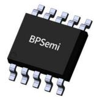  
SSOP-10 封装

## 特点

## 应用领域

 USB PD 、 QC 充电器

 可编程 AC / DC 充电器

## 典型应用

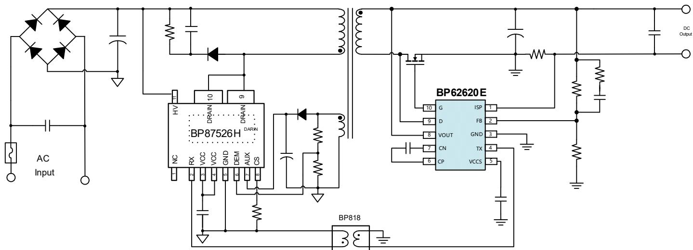  
图 1. BP62620E 典型应用电路

## 定购信息

<table><tr><td>定购型号</td><td>封装</td><td>包装形式</td><td>打印</td></tr><tr><td>BP62620E</td><td>SSOP-10</td><td>卷盘4000颗/盘</td><td>BP62620EXXXXXYYZZWWX</td></tr></table>

## 管脚封装

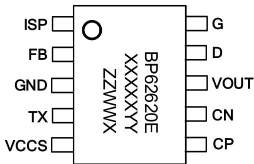  
图 2. SSOP-10 管脚封装图

BP62620E：产品型号

XXXXXYY: 批次号

ZZ: 内部标示

WW：周号

X：保留位

## 管脚描述

<table><tr><td>管脚号</td><td>管脚名称</td><td>描述</td></tr><tr><td>1</td><td>ISP</td><td>电流采样正端引脚</td></tr><tr><td>2</td><td>FB</td><td>电压反馈引脚,连接外部分压电阻以设置输出电压</td></tr><tr><td>3</td><td>GND</td><td>芯片地</td></tr><tr><td>4</td><td>TX</td><td>发射引脚,副边控制器产生的控制信号通过 TX 引脚发射到原边接收控制器</td></tr><tr><td>5</td><td>VCCS</td><td>供电引脚,给副边发射控制器提供工作电压;在 VCCS 和 GNDS 引脚之间需要放置旁路电容</td></tr><tr><td>6</td><td>CP</td><td>Flying 电容正端</td></tr><tr><td>7</td><td>CN</td><td>Flying 电容负端</td></tr><tr><td>8</td><td>VOUT</td><td>连接至输出电压给副边发射控制器提供工作电流;当输出过压时,具有放电功能</td></tr><tr><td>9</td><td>D</td><td>连接至同步整流 MOSFET 的漏极,采样同步整流 MOSFET 漏极电压</td></tr><tr><td>10</td><td>G</td><td>连接至外置同步整流 MOSFET 的门极,用于驱动外置同步整流 MOSFET</td></tr></table>

## 选型推荐

<table><tr><td>产品型号</td><td>输出 OVP 电压</td><td>描述</td></tr><tr><td>BP62620E</td><td>14.3 V</td><td>适应于 12V 输出</td></tr></table>

极限参数(注 1)

<table><tr><td>符号</td><td>参数</td><td>参数范围</td><td>单位</td></tr><tr><td> $V_D$ </td><td>D 引脚电压</td><td>-3~150</td><td>V</td></tr><tr><td> $V_{OUT}$ </td><td>OUT 引脚电压</td><td>-0.3~36</td><td>V</td></tr><tr><td> $V_G$ </td><td>G 引脚电压</td><td>-0.3~7</td><td>V</td></tr><tr><td> $V_{ISP}$ </td><td>ISP 引脚电压</td><td>-0.3-7</td><td>V</td></tr><tr><td> $V_{CCS}$ </td><td>VCCS 引脚电压</td><td>-0.3-7</td><td>V</td></tr><tr><td> $V_{FB}$ </td><td>FB 引脚电压</td><td>-0.3-7</td><td>V</td></tr><tr><td> $V_{CP}$ </td><td>CP 引脚电压</td><td>-0.3-7</td><td>V</td></tr><tr><td> $V_{CN}$ </td><td>CN 引脚电压</td><td>-0.3-7</td><td>V</td></tr><tr><td> $I_{VOUT}$ </td><td>OUT 引脚电流(注 2)</td><td>-10~400</td><td>mA</td></tr><tr><td> $I_{VCCS}$ </td><td>VCCS 引脚电流</td><td>-10~10</td><td>mA</td></tr><tr><td> $P_{DMAX}$ </td><td>功耗(注 3)</td><td>1.5</td><td>W</td></tr><tr><td> $T_J$ </td><td>工作结温范围</td><td>-40 to 150</td><td>°C</td></tr><tr><td> $T_{STG}$ </td><td>储存温度范围</td><td>-55 to 150</td><td>°C</td></tr><tr><td> $T_{LEAD}$ </td><td>最高焊接温度,10 sec</td><td>265</td><td>°C</td></tr><tr><td>ESD</td><td>(注 4)</td><td>2</td><td>kV</td></tr></table>

注 1：极限参数是指超出该范围，有可能导致器件永久性损坏。极限参数为器件应⼒的额定值，⻓期工作在极限参数条件可能会影响器件的可靠性。  
注 2：温度升高最大功耗一定会减小，这也是由 ${ \mathsf { T } } { \mathsf { I M A X } } ,$ θ ,和环境温度 $\mathsf { T } _ { \mathsf { A } }$ 所决定的。最大允许功耗为 $\mathsf { P } _ { \mathsf { D M A X } } = ( \mathsf { T } _ { \mathsf { J M A X } } - \mathsf { T } _ { \mathsf { A } } ) /$ θ 或是极限范围给出的数字中比较低的那个值。  
注 3：1平方英寸双层PCB板，按照JEDEC 标准测试。  
注 4：人体模型，100pF电容通过1.5kΩ电阻放电。

电气参数(注5)（⽆特别说明情况下， $\mathsf { V } _ { \mathsf { C C S } } = 6 \mathsf { V } , \mathsf { T } _ { \mathsf { A } } = 2 5 ^ { \circ } \mathsf { C } )$

<table><tr><td>符号</td><td>描述</td><td>条件</td><td>最小值</td><td>典型值</td><td>最大值</td><td>单位</td></tr><tr><td colspan="7">VCCS引脚</td></tr><tr><td rowspan="3"> $I_{\text{VCCS\_OP}}$ </td><td rowspan="3">工作电流</td><td>Fs=140 kHz</td><td></td><td>5.61</td><td></td><td>mA</td></tr><tr><td>Fs=100 kHz</td><td></td><td>4.22</td><td></td><td>mA</td></tr><tr><td>Fs=200 Hz</td><td>0.5</td><td>0.8</td><td>1.5</td><td>mA</td></tr><tr><td> $V_{\text{VCCS\_rate}}$ </td><td>VCCS引脚额定电压</td><td> $T_J$ =25°C</td><td>5.2</td><td>5.6</td><td>6</td><td>V</td></tr><tr><td> $V_{\text{VCCSUVP(+)}}$ </td><td>VCCS上升时欠压保护阈值</td><td>VCCS上升至IC开启</td><td>4.2</td><td>4.45</td><td>4.7</td><td>V</td></tr><tr><td> $V_{\text{VCCSUVP\_hy}}$ </td><td>VCCS UVLO迟滞电压</td><td></td><td></td><td>250</td><td></td><td>mV</td></tr><tr><td rowspan="4"> $V_{\text{VCCS}}$ </td><td rowspan="4">VCCS引脚电压</td><td>VOUT=2.8 V</td><td>4.8</td><td></td><td>6</td><td>V</td></tr><tr><td>VOUT=3 V</td><td>5</td><td></td><td>6</td><td>V</td></tr><tr><td>VOUT=5 V</td><td>5.2</td><td></td><td>6</td><td>V</td></tr><tr><td>VOUT=8 V</td><td>5.2</td><td></td><td>6</td><td>V</td></tr><tr><td> $V_{\text{VCCS\_CLAMP}}$ </td><td>VCCS引脚钳位电压</td><td>向VCCS注入5mA电流</td><td>6.2</td><td>6.7</td><td>7.2</td><td>V</td></tr><tr><td colspan="7">OUT引脚</td></tr><tr><td> $V_{\text{KP1}}$ </td><td>输出恒功率拐点电压</td><td></td><td>10.5</td><td>11.2</td><td>11.5</td><td>V</td></tr><tr><td> $V_{\text{KP2}}$ </td><td>过温后输出恒功率拐点电压</td><td></td><td></td><td>6.42</td><td></td><td>V</td></tr><tr><td> $T_{\text{OTP}}$ </td><td>降功率温度阈值</td><td></td><td></td><td>79</td><td></td><td>°C</td></tr><tr><td> $T_{\text{HYS}}$ </td><td>降功率温度迟滞</td><td></td><td></td><td>19</td><td></td><td>°C</td></tr><tr><td> $V_{\text{OUT\_OVP}}$ </td><td>输出过压保护阈值</td><td></td><td>13.3</td><td>14.3</td><td>15</td><td>V</td></tr><tr><td> $V_{\text{OUT\_UVP}}$ </td><td>输出欠压保护阈值</td><td></td><td>3.3</td><td>3.45</td><td>3.6</td><td>V</td></tr><tr><td> $t_{\text{UVP}}$ </td><td>输出欠压保护屏蔽时间</td><td></td><td></td><td>1024</td><td></td><td>Cycle</td></tr><tr><td> $I_{\text{bld\_str}}$ </td><td>强放电电流</td><td></td><td>50</td><td></td><td>150</td><td>mA</td></tr><tr><td> $t_{\text{bld\_str}}$ </td><td>强放电的最长放电时间</td><td></td><td></td><td>300</td><td></td><td>ms</td></tr><tr><td> $I_{\text{bld\_weak}}$ </td><td>弱放电电流</td><td> $V_{\text{FB}}>V_{\text{FB\_OVP}}$ </td><td>10</td><td>16</td><td>20</td><td>mA</td></tr><tr><td colspan="7">输入电压检测</td></tr><tr><td> $V_{\text{IN\_HV}}$ </td><td>输入高压阈值</td><td>VOUT=10 V</td><td>33</td><td>35</td><td>37</td><td>V</td></tr><tr><td> $V_{\text{IN\_LV}}$ </td><td>输入低压阈值</td><td>VOUT=10 V</td><td></td><td>33</td><td></td><td>V</td></tr><tr><td> $t_{\text{IN\_LV}}$ </td><td>输入低压检测时间</td><td></td><td></td><td>40</td><td></td><td>ms</td></tr><tr><td colspan="7">G引脚</td></tr><tr><td> $V_{\text{ON\_TH}}$ </td><td>驱动开通VDS阈值电压</td><td></td><td></td><td>-150</td><td></td><td>mV</td></tr><tr><td> $V_{\text{OFF\_TH}}$ </td><td>驱动关断VDS阈值电压</td><td></td><td></td><td>0</td><td></td><td>mV</td></tr><tr><td> $t_{\text{Delay\_ON}}$ </td><td>开通延时</td><td></td><td></td><td>25</td><td></td><td>ns</td></tr><tr><td> $t_{\text{B\_ON}}$ </td><td>开通消隐时间</td><td></td><td></td><td>1</td><td></td><td>μs</td></tr><tr><td> $V_{\text{B\_OFF}}$ </td><td>消隐时间内VDS关断阈值</td><td></td><td></td><td>2</td><td></td><td>V</td></tr><tr><td> $t_{\text{OFF\_MIN}}$ </td><td>最小关断时间</td><td></td><td></td><td>800</td><td></td><td>ns</td></tr><tr><td colspan="7">ISP 引脚</td></tr><tr><td> $V_{IS\_TH}$ </td><td>IS 阈值电压</td><td></td><td>32.2</td><td>33.5</td><td>34.4</td><td>mV</td></tr><tr><td> $K_{P1}$ </td><td>输出恒功率系数  $V_{IS\_TH} *V_{KP1}$ </td><td></td><td>360</td><td>380</td><td>396</td><td>W*mΩ</td></tr><tr><td> $K_{P2}$ </td><td>降低恒功率系数  $V_{IS\_TH} *V_{KP2}$ </td><td></td><td>200</td><td></td><td>220</td><td>W*mΩ</td></tr><tr><td> $V_{CDC}$ </td><td>输出线压降补偿</td><td></td><td></td><td>330</td><td></td><td>mV</td></tr><tr><td colspan="7">FB 引脚</td></tr><tr><td> $V_{REF}$ </td><td>FB 基准电压</td><td></td><td>1.23</td><td>1.25</td><td>1.27</td><td>V</td></tr><tr><td> $V_{FB\_OVP}$ </td><td>FB 过压阈值电压</td><td></td><td></td><td>1.406</td><td></td><td>V</td></tr><tr><td> $V_{FB\_SC+}$ </td><td>FB 短路保护阈值电压</td><td></td><td></td><td>80</td><td></td><td>mV</td></tr><tr><td> $V_{FB\_SC-}$ </td><td>FB 短路保护解除阈值电压</td><td></td><td></td><td>100</td><td></td><td>mV</td></tr><tr><td> $t_{FB\_SC}$ </td><td>FB 短路保护屏蔽时间</td><td></td><td></td><td>100</td><td></td><td>μs</td></tr></table>

注 5：电气参数定义了器件在工作范围内并且在保证特定性能指标的测试条件下的直流和交流电参数规范。最小值和最大值由测试保证，典型值由设计、测试或统计分析保证。对于未给定上下限值的参数，该规范不予保证其精度，但其典型值合理反映了器件性能。

## 内部结构框图

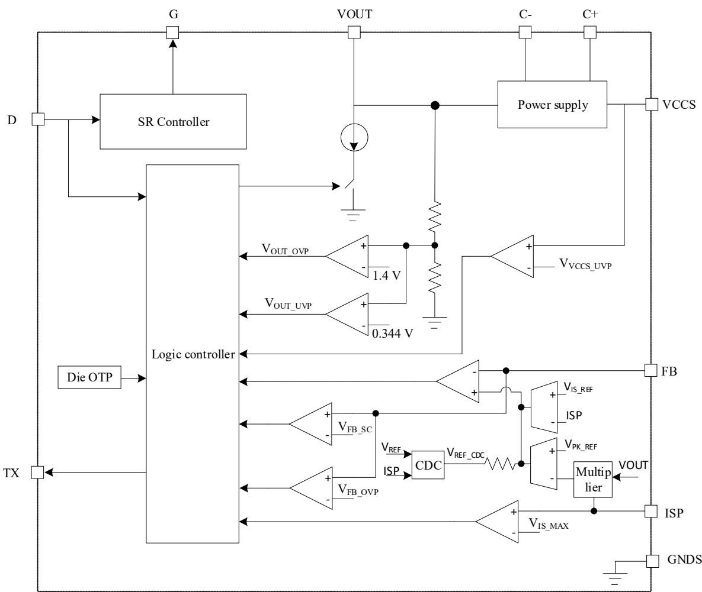  
图 3. BP62620E 内部框图

## 功能描述

BP62620E是一款应用于AC/DC反激电路中的副边控制器，可提供高性能、低 EMI、低待机功耗、优良动态响应、宽输出电压范围的电源解决方案，适用于 USB PD、QC 及 PPS等。BP62620E 内部集成同步整流管的控制和驱动，极大的简化了系统设计。

BP62620E采用⾃适应COT控制方式，具有超快的动态响应速度，配合磁耦通信，静态工作电流小，可实现超低的待机功耗。BP62620E 提供 1.25 V 精准的电压基准，可满足快充低至 3.3 V 输出电压的要求。BP62620E 集成了多种保护功能，包括输出过压保护、输出欠压保护、FB短路保护和过温保护。⾃带的输出电容放电功能可以满足快充对输出电压时序的要求。和配对的原边控制芯片，实现副边主控，提供高性能的快充整体解决方案。（注 6：以下描述到的参数均为电气参数列表中的典型值，除非特别说明是最大或最小值）

## 启动与VCCS欠压保护

系统启动时，当原边控制器开始开关操作，输出电压上升，BP62620EVOUT引脚通过内部供电电路给VCCS电容充电，当 VCCS 电压上升至欠压保护解除阈值 VVCCSUVP+时芯片启动，芯片 TX 引脚通过磁耦隔离器 BP818 向原边控制器发送脉冲信号，开始副边控制；启动后在 1024 周期内如果 VOUT 引脚电压低于欠压保护阈值 V ，则进出欠压保护状态，停止发送脉冲信号，输出电压下降，VCCS 电压下降过程中低于欠压保护阈值 VVCCSUVP + -VVCCSUVP h ，芯片停止工作，等待原边重启。

## 同步整流管控制

BP62620E 集成了同步整流管的控制和驱动，VCCS 引脚电压高于 VVCCSUVP(+)时启用驱动同步整流管；VCCS 引脚电压低于 $\mathsf { V } _ { \mathsf { V C C S U V P ( + ) } } . \mathsf { V } _ { \mathsf { V C C S U V P \_ h y } }$ 时禁用同步整流管驱动；当检测到VDS引脚在一定时间内下降穿越 -150 mV，G 引脚驱动同步整流管导通；检测到同步整流管 $V _ { \mathsf { D S } }$ 向上穿越0V，G引脚电压下拉关闭同步整流管。

## 恒压、恒流和恒功率曲线

BP62620E 控制器集成了恒压、恒流和恒功率功能，如图 4所示。

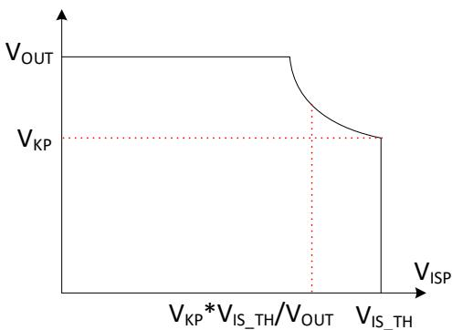  
图4.恒压、恒流和恒功率曲线

在图 4 中，当 $\mathsf { V o u r }$ 等于设置电压时，为恒压输出，输出电压由FB 引脚分压电阻设置，基准电压为 $V _ { R E F } ;$ ；当 $\mathsf { V o u r } < \mathsf { V } _ { \mathsf { K P } }$ 时，为恒流输出，此时 ${ \mathsf { I S P } }$ 引脚恒流阈值电压为 $\mathsf { V } _ { \mathsf { I S \_ T H } }$ ，因此恒流值为 $\mathsf { V } _ { \mathsf { I S \_ T H } } / \mathsf { R } _ { \mathsf { S E N S E } }$ ，其中R 为外部电流检测电阻。当 $\mathsf { V o u r } ^ { \mathrm { \Delta > } }$ $\mathsf { V } _ { \mathsf { K P } }$ 时，输出最大功率恒定，为 $\mathsf { V } _ { \mathsf { K P } } { } ^ { \star } \mathsf { V } _ { 1 \mathsf { S \_ T H } } / \mathsf { R } _ { \mathsf { S E N S E o } }$

## 输出线压降补偿（CDC）

BP62620E 通过检测 ISP 引脚电压来实现输出线压降补偿；当负载为0 V，线压降补偿为 0 mV；补偿值随负载电流增加而线性增加，当电流检测电阻电压等于 $V _ { 1 5 \_ T H }$ 时，补偿量为最大值330 mV。如图5所示：

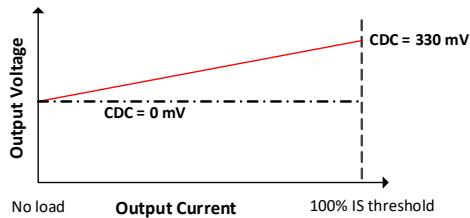  
图5：输出线压降补偿和负载电流关系

## 输出过欠压保护

BP62620E 通过 VOUT 引脚检测输出电压，当输出电压高于$\mathsf { V o u r \_ o v p }$ 时，停止向原边发送脉冲信号，并锁定该故障，同时通过VOUT引脚对输出电容放电，放电电流为 $\mathsf { I b l d \_ w e a k }$ ，直到 VCCS 引脚电压低于 VCCSUVLO 欠压保护后清零该故障，等待原边重新启动。

当输出电压低于 $\mathsf { V o u r \_ u v } \mathsf { p }$ 并持续超过t 时间，将触发芯片的输出欠压保护，BP62620E停止向原边发送脉冲信号，并锁定该故障。由于没有能量从原边传输到副边，输出电压会继续下降，直到VCCS 欠压保护，芯片复位，等待原边重新启动。

## FB 短路保护

当芯片检测到 FB 引脚电压低于 $V _ { F B \_ S C + }$ 并持续 $\tt t _ { F B \_ S C }$ 时间，则触发 FB 短路保护，BP62620E 停止发送 TX 信号；直到 FB引脚电压大于 $V _ { F B \_ S C } .$ 并维持 $\mathsf { t F B \_ S C }$ 时间，则解除 FB 短路保护。

## FB 过压放电

当FB 电压高于 $V _ { F B \_ O \vee P }$ 时，触发输出放电功能，BP62620E通过VOUT引脚对输出电容快速放电，放电电流为Ibld\_str，直到FB 电压低于参考电压 $V _ { \mathsf { R E F } }$ ，放电时间最⻓限制为tbld\_str。FB 过压放电功能可以减短输出电压从高电压转换到低电压的时间，特别是轻载或者空载的条件下，满足快充电源对输出电压转换时间的要求。

## 输入电压检测

在原边功率管导通期间，变压器副边绕组的电压与初级整流后的直流电压成比例，比例系数为变压器的匝比。

BP62620E通过检测输出电压和同步整流漏极电压，实现变压器副边绕组电压检测，从而间接检测输⼊电压。当副边绕组电压高于 $\mathsf { V } _ { \mathsf { I N \_ H V } }$ 时，恒功率拐点电压为 $\mathsf { V } _ { \mathsf { K P 1 } }$ ，输出较大功率。当副边绕组电压下降到 $V _ {  { \mathsf { N } } \_  { \mathsf { L } }  { \mathsf { V } } }$ 并持续 $\tan \angle V$ 时间时，恒功率拐点电压下降到V ，输出功率下降。默认拐点电压为$\mathsf { V } _ { \mathsf { K P 2 0 } }$

## 过温降功率

芯片内置温度检测电路，当芯片温度超过 ${ \mathsf { T } } _ { 0 { \mathsf { T } } { \mathsf { P } } }$ 时，恒功率拐点电压由 $\mathsf { V } _ { \mathsf { K P 1 } }$ 降低到 $\mathsf { V } _ { \mathsf { K P 2 } }$ ，因此恒功率值降低，恒功率系数由 $\mathsf { K } _ { \mathsf { P 1 } }$ 降低到 ${ \sf K } _ { \sf P 2 \mathrm { o } }$ 。当温度降低到 $T _ { 0 \mathsf { T P } } - T _ { \mathsf { H Y S } }$ 时，恒功率拐点电压恢复到 $\mathsf { V } _ { \mathsf { K P 1 } }$ ，输出恒功率值升高，恒功率系数由 $\mathsf { K } _ { \mathsf { P } 2 }$ 降升高到 $\mathsf { K } _ { \mathsf { P 1 } \circ }$

## PCB Layout 指南

在设计PCB 时，需要遵循以下建议：

1) G引脚⾛线尽量靠近同步整流MOSFET栅极。

2) 为提高 BP62620E 抗⼲扰能⼒和可靠工作，VCCS 电容尽可能靠近 VCCS 和 GNDS 引脚放置，通常建议使用470 nF 瓷片电容。

3) TX 引脚⾛线需使用宽度不小于 0.5 mm ⾛线连接BP818，尽量靠近磁耦（BP818）⾛线。

4) C+和 C-需使用 100 nF Flying 电容并靠近芯片引脚放置。

5) ISP 和GNDS 引脚与电流检测电阻采用开尔文⾛线连接。为提高抗⼲扰能⼒和电流检测精度，建议在靠近ISP 引脚端放置 1 kΩ 电阻且在 ISP 与 GNDS 引脚端并联 1 nF电容。

6) 次级侧 ESD 放电针应直接连接在输出电容正端/负端，并远离 BP62620E 和 BP818。

## 封装信息

COMMON DIMENSIONS (UNITS OF MEASURE=INCH)  
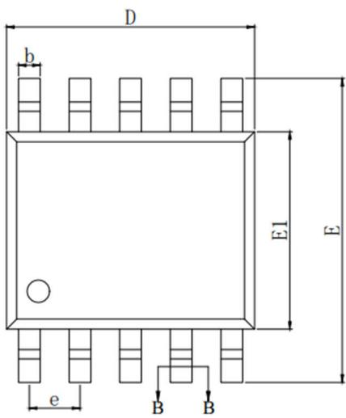  
SSOP-10 封装外形尺寸

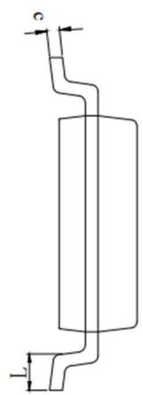

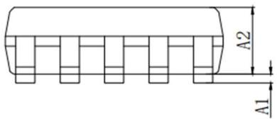

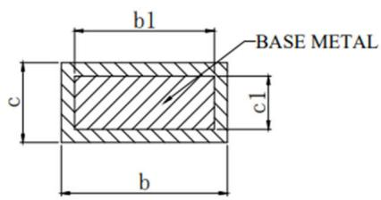  
SECTION:B-B

<table><tr><td colspan="4">COMMON DIMENSIONS(UNITS OF MEASURE=MILLIMETER)</td></tr><tr><td>SYMBOL</td><td>MIN</td><td>NOM</td><td>MAX</td></tr><tr><td>A1</td><td>0.10</td><td>-</td><td>0.25</td></tr><tr><td>A2</td><td>1.30</td><td>1.40</td><td>1.50</td></tr><tr><td>b</td><td>0.39</td><td>-</td><td>0.47</td></tr><tr><td>b1</td><td>0.38</td><td>0.41</td><td>0.44</td></tr><tr><td>c</td><td>0.20</td><td>-</td><td>0.24</td></tr><tr><td>c1</td><td>0.19</td><td>0.20</td><td>0.21</td></tr><tr><td>D</td><td>4.80</td><td>4.90</td><td>5.00</td></tr><tr><td>E</td><td>5.80</td><td>6.00</td><td>6.20</td></tr><tr><td>E1</td><td>3.80</td><td>3.90</td><td>4.00</td></tr><tr><td>e</td><td colspan="3">1.00 BSC</td></tr><tr><td>L</td><td colspan="3">1.05 REF</td></tr></table>

<table><tr><td>SYMBOL</td><td>MIN</td><td>NOM</td><td>MAX</td></tr><tr><td>A1</td><td>0.004</td><td>-</td><td>0.010</td></tr><tr><td>A2</td><td>0.051</td><td>0.055</td><td>0.059</td></tr><tr><td>b</td><td>0.015</td><td>-</td><td>0.019</td></tr><tr><td>b1</td><td>0.015</td><td>0.016</td><td>0.017</td></tr><tr><td>c</td><td>0.008</td><td>-</td><td>0.009</td></tr><tr><td>c1</td><td>0.007</td><td>-</td><td>0.008</td></tr><tr><td>D</td><td>0.189</td><td>0.193</td><td>0.197</td></tr><tr><td>E</td><td>0.228</td><td>0.236</td><td>0.244</td></tr><tr><td>E1</td><td>0.150</td><td>0.154</td><td>0.157</td></tr><tr><td>e</td><td colspan="3">0.039 BSC</td></tr><tr><td>L</td><td colspan="3">0.041 REF</td></tr></table>

NOTES:

DOES NOT INCLUDE MOLD FLASH, PROTRUSIONS OR GATE BURRS, MOLD FLASH, PROTRUSIONS AND GATE BURRS SHALL NOT EXCEED 0.008 INCH (0.2Omm) PER SIDE.

## 锡焊温度曲线

## 1. 推荐波峰焊温度曲线如下：（Wave solder，265℃ Max）

<table><tr><td></td><td></td><td>最大正斜度</td><td>设温度之间的时间</td><td>最大值温度</td><td>最大实斜度</td></tr><tr><td></td><td></td><td></td><td>100-130C</td><td></td><td></td></tr><tr><td></td><td></td><td>CHF</td><td>件</td><td>C</td><td>CHF</td></tr><tr><td>1</td><td>内接品1位置</td><td>2.708</td><td>52.997</td><td>256.8</td><td>-0.9</td></tr><tr><td>2</td><td>内接品3位置</td><td>2.794</td><td>54.997</td><td>258.1</td><td>-0.7</td></tr><tr><td>3</td><td>内接品4位置</td><td>2.705</td><td>57.997</td><td>258.4</td><td>-0.4</td></tr><tr><td>4</td><td>内接品5位置</td><td>2.790</td><td>55.997</td><td>259.7</td><td>-0.6</td></tr><tr><td></td><td>断路</td><td>0.089</td><td>5.000</td><td>2.9</td><td>0.5</td></tr><tr><td></td><td>平均值</td><td>2.7493</td><td>55.4970</td><td>258.25</td><td>-6.65</td></tr><tr><td></td><td>海方差</td><td>0.04941</td><td>2.08167</td><td>1.190</td><td>0.208</td></tr><tr><td colspan="6">速度:900mm/minProfile specification:Pre-heating:100~130, Time:≥30sPre-heating:100~130, Time:≥30sThe slope of pre-heating area≤3,The slope of cooling area:5~7Soldering wave temperature:245~265°C</td></tr></table>

## 2. 推荐低温回流焊温度曲线如下：（Low temperature reflow, $\underline { { 1 7 } } 5 ^ { \circ } \mathsf { C }$ Max）

## 3. 推荐高温回流焊温度曲线如下：（High temperature reflow, 250℃ Max）

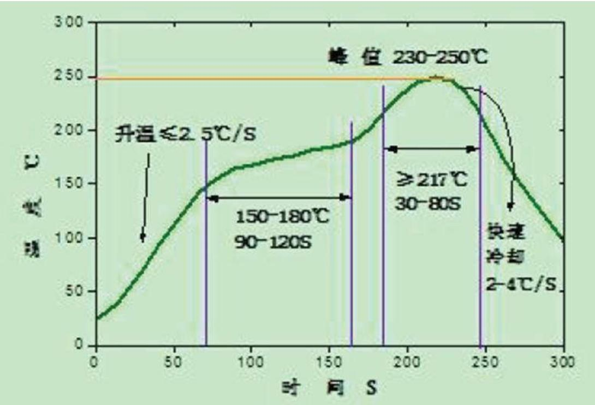

## 版本信息

<table><tr><td>版本</td><td>日期</td><td>记录</td></tr><tr><td>Rev. 1.0</td><td>2025/01</td><td>正式发行</td></tr><tr><td></td><td></td><td></td></tr></table>

## 免责声明

晶丰明源尽⼒确保本产品规格书内容的准确和可靠，但是保留在没有通知的情况下，修改规格书内容的权利。

本产品规格书未包含任何针对晶丰明源或第三方所有的知识产权的授权。针对本产品规格书所记载的信息，晶丰明源不做任何明示或暗示的保证，包括但不限于对规格书内容的准确性、商业上的适销性、特定⽬的的适用性或者不侵犯晶丰明源或任何第三人知识产权做任何明示或暗示保证，晶丰明源也不就因本规格书本⾝及其使用有关的偶然或必然损失承担任何责任。

## 电子器件报废说明

该产品在生命周期结束后，由客户按照一般电子产品的报废流程进行处理。