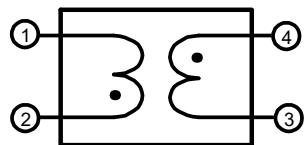
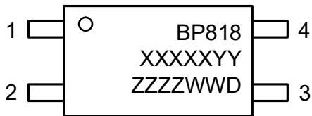
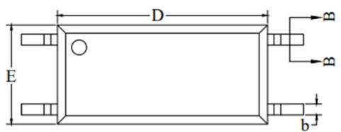
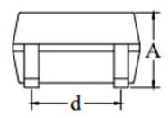
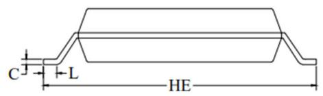
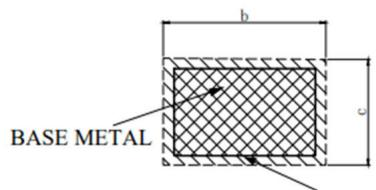

## 概述

BP818 是一款用于开关电源初级和次级之间通信的磁耦合隔离器。

BP818 内置了两个耦合线圈，利用耦合线圈的电磁感应，在初次级之间传输电信号，并实现电气隔离。由于采用磁场耦合的方式，BP818具备非常稳定可靠的性能，消除了传统光耦电流传输比精度低、非线性、受温度影响大，以及寿命受限等缺点。同时，BP818工作时初次级均无需静态偏置电流，大大降低了系统的待机功耗，配合晶丰明源公司相应的初级和次级控制芯片可组成高性能开关电源整体解决方案。

BP818 初次级之间满足加强绝缘安规要求标准。采用LSOP-4封装，初次级之间爬电距离> 8 mm，绝缘电压>5000 VAC。满足 UL62368，TUV（IEC62368），CQC（GB4943.1）以及 VDE（IEC60747）加强绝缘标准，满足MSL-3潮敏等级。

  
LSOP-4 封装

## 特点

 利用磁场耦合传输信号

 性能稳定，寿命⻓，不受环境温度的影响

 较宽的工作温度范围，-55 °C \~ 125 °C

 无需静态偏置电流，降低了待机功耗

 初次级绝缘电压 ≥5000 VAC

 爬电距离 >8mm

 通过 UL62368 认证

 通过 TUV（IEC62368）认证

 通过 CQC（GB4943.1-2022）认证

 通过 VDE（IEC60747）加强绝缘标准测试

## 应用领域

 QC / USB PD / 可编程 AC/DC 充电器

 适配器

 AC/DC 开关电源

## 电⽓原理图

  
图 1. BP818 电气原理图

## 定购信息

<table><tr><td>定购型号</td><td>封装</td><td>包装形式</td><td>打印</td></tr><tr><td>BP818</td><td>LSOP-4</td><td>卷盘3000 颗/盘</td><td>BP818XXXXYYZZZZWWD</td></tr></table>

## 管脚封装

BP818：产品型号

XXXXXYY: 批次号

ZZZZ: 内部标示

WW：周号

D：保留位

图 2. LSOP-4 管脚封装

## 极限参数(注 1)

<table><tr><td>符号</td><td>参数</td><td>参数范围</td><td>单位</td></tr><tr><td> $V_{ISO}$ </td><td>绝缘电压</td><td>5000</td><td>Vrms</td></tr><tr><td> $P_{DMAX}$ </td><td>最大功耗(注2)</td><td>300</td><td>mW</td></tr><tr><td> $T_{OPR}$ </td><td>工作温度范围</td><td>-55 to +125</td><td>°C</td></tr><tr><td> $T_{STG}$ </td><td>存储温度范围</td><td>-55 to +150</td><td>°C</td></tr><tr><td> $T_{LEAD}$ </td><td>最高焊接温度(注3)</td><td>265</td><td>°C</td></tr></table>

注 1：极限参数是指超出该范围，有可能导致器件永久性损坏。极限参数为器件应⼒的额定值，⻓期工作在极限参数条件可能会影响器件的可靠性。

注 2：温度升高最大功耗一定会减小，这也是由TJMAX,θJA,和环境温度TA所决定的。最大允许功耗为 $P _ { D M A X } = ( T _ { J M A X } - T _ { A } ) / \theta _ { J A }$ 或是极限范围给出的数字中比较低的那个值。

注 3：持续时间10秒

## 电⽓参数(注 4)

<table><tr><td>符号</td><td>描述</td><td>条件</td><td>最小值</td><td>典型值</td><td>最大值</td><td>单位</td></tr><tr><td> $N_{PS}$ </td><td>初次级匝比</td><td></td><td></td><td>1</td><td></td><td></td></tr><tr><td> $L_P$ </td><td>初级或次级电感</td><td>Pin 1 到 Pin 2,或 Pin 3 到 Pin 4</td><td></td><td>15</td><td></td><td>nH</td></tr><tr><td> $L_M$ </td><td>初次级互感</td><td> $T_A=25°C$ </td><td></td><td>3</td><td></td><td>nH</td></tr><tr><td> $R_{P\_DC}$ </td><td>绕组直流阻抗</td><td>Pin 1 到 Pin 2,或 Pin 3 到 Pin 4</td><td></td><td></td><td>10</td><td>mΩ</td></tr><tr><td> $R_{IO}$ </td><td>隔离电阻</td><td> $V_{IO}=500VDC,40\sim60\% R.H.$ </td><td> $5\times10^{10}$ </td><td></td><td></td><td>Ω</td></tr><tr><td> $C_{IO}$ </td><td>隔离电容</td><td> $T_A=25°C$ </td><td></td><td>1</td><td></td><td>pF</td></tr></table>

注 4：电气参数定义了器件在工作范围内并且在保证特定性能指标的测试条件下的直流和交流电参数规范。最小值和最大值由测试保证，典型值由设计、测试或统计分析保证。对于未给定上下限值的参数，该规范不予保证其精度，但其典型值合理反映了器件性能。

## 封装信息

LSOP-4 封装外形尺寸  

  
SECTION B-B  
WITH PLATING

COMMON DIMENSIONS (UNITS OF MEASURE=MILLIMETER)

<table><tr><td>SYMBOL</td><td>MIN</td><td>NOM</td><td>MAX</td></tr><tr><td>A</td><td>1.80</td><td>2.00</td><td>2.20</td></tr><tr><td>b</td><td>0.30</td><td>0.40</td><td>0.50</td></tr><tr><td>d</td><td colspan="3">2.54 Typ</td></tr><tr><td>C</td><td>0.10</td><td>0.20</td><td>0.30</td></tr><tr><td>D</td><td>7.30</td><td>7.60</td><td>7.90</td></tr><tr><td>E</td><td>3.30</td><td>3.60</td><td>3.90</td></tr><tr><td>HE</td><td>9.90</td><td>10.20</td><td>10.50</td></tr><tr><td>L</td><td>0.50</td><td>-</td><td>-</td></tr></table>

COMMON DIMENSIONS (UNITS OF MEASURE=INCH)

<table><tr><td>SYMBOL</td><td>MIN</td><td>NOM</td><td>MAX</td></tr><tr><td>A</td><td>0.071</td><td>0.079</td><td>0.087</td></tr><tr><td>b</td><td>0.012</td><td>0.016</td><td>0.020</td></tr><tr><td>d</td><td colspan="3">0.100 Typ</td></tr><tr><td>C</td><td>0.004</td><td>0.008</td><td>0.012</td></tr><tr><td>D</td><td>0.287</td><td>0.299</td><td>0.311</td></tr><tr><td>E</td><td>0.130</td><td>0.142</td><td>0.154</td></tr><tr><td>HE</td><td>0.390</td><td>0.402</td><td>0.413</td></tr><tr><td>L</td><td>0.020</td><td>-</td><td>-</td></tr></table>

NOTES: 1.DOES NOT INCLUDE MOLD FLASH, PROTRUSIONS OR GATE BURRS, MOLD FLASH, PROTRUSIONS AND GATE BURRS SHALL NOT EXCEED 0.008 INCH (0.2Omm) PER SIDE.

## 版本信息

<table><tr><td>版本</td><td>日期</td><td>记录</td></tr><tr><td>Rev. 1.0</td><td>2023/05</td><td>正式发行</td></tr><tr><td>Rev. 1.1</td><td>2024/03</td><td>更新焊接温度和封装信息</td></tr><tr><td>Rev. 1.2</td><td>2024/10</td><td>增加潮敏等级描述</td></tr><tr><td></td><td></td><td></td></tr></table>

## 免责声明

晶丰明源尽⼒确保本产品规格书内容的准确和可靠，但是保留在没有通知的情况下，修改规格书内容的权利。

本产品规格书未包含任何针对晶丰明源或第三方所有的知识产权的授权。针对本产品规格书所记载的信息，晶丰明源不做任何明示或暗示的保证，包括但不限于对规格书内容的准确性、商业上的适销性、特定⽬的的适用性或者不侵犯晶丰明源或任何第三⼈知识产权做任何明示或暗示保证，晶丰明源也不就因本规格书本⾝及其使用有关的偶然或必然损失承担任何责任。

## 电子器件报废说明

该产品在生命周期结束后，由客户按照一般电子产品的报废流程进行处理。