## BP83223集成 GaN 原边反馈反激式 APFC 控制器

## 概述

BP83223 是一款高 PF、原边反馈、反激恒压控制芯片。芯片内部集成了700 V高压GaN功率管、高压启动电路和输入电压采样电路，只需要很少的外围器件就可以实现高精度恒压输出、高功率因数和低电流谐波。

BP83223采用Ton时间控制机制，内置了PF增强控制算法，可轻松满足轻载下的新 ErP 分次电流谐波标准。准谐振工作模式（BCM 和 DCM）在谷底开通功率管，可实现更高的效率和较优的 EMI 性能。BP83223 内置了动态加速模块，能有效地改善系统对负载的响应速度，提供稳定的输出电压性能。

BP83223 采用了频率折返控制技术，系统在较大负载时工作于BCM模式，随着负载减小进入DCM模式，同时降低开关频率，有利于提高轻载效率。

BP83223 内置多种保护，包括逐周期限流、输出短路保护、输出过压保护、次级整流管短路保护、过载保护、VCC 过压/欠压保护、输入欠压保护、以及过温保护等。

BP83223 采用 ESOP-10 封装，具备较好的散热性能，满足MSL-3 潮敏等级。

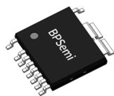  
ESOP-10 封装

## 特点

 原边反馈恒压控制，无需光耦

 集成 700 V 高压 GaN，输出功率可达 100 W

 集成高压启动和输入电压采样电路，外围极简

 增强的PF控制算法，实现较低的THD

 功率管谷底开通，开关损耗小

 低待机功耗（< 100 mW@230 Vac）

■ 优异的线性调整率和负载调整率

 优化的动态响应速度

 ESOP-10 封装，散热更好

##  保护功能

 逐周期限流(OCP)

 输出短路保护(SCP)

 输出过压保护(OVP)

次级整流管短路保护

 过载保护(OLP)

 VCC过压、欠压保护

 输入欠压保护(Brown-out)

过温保护(OTP)

## 应用领域

 大功率AC/DC 多口快充

LED 照明

## 典型应用

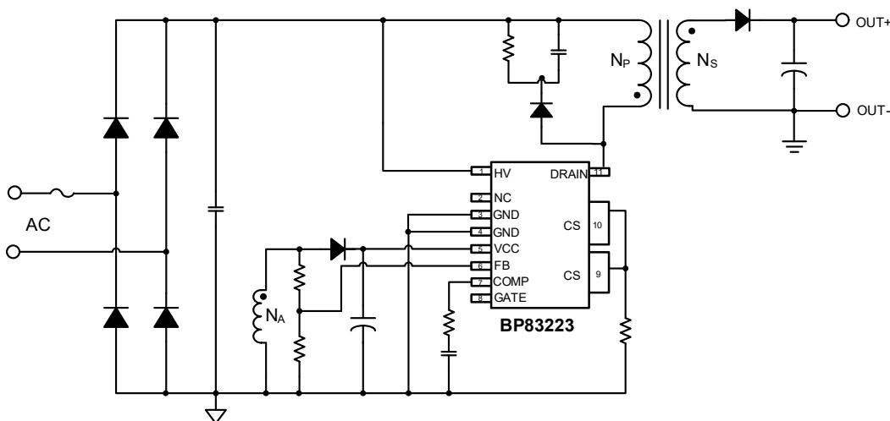  
图 1. BP83223 典型应用电路

## 定购信息

<table><tr><td>定购型号</td><td>封装</td><td>包装形式</td><td>打印</td></tr><tr><td>BP83223</td><td>ESOP-10</td><td>卷盘2500颗/盘</td><td>BP83223XXXXYYZZZZWWX</td></tr></table>

## 管脚封装

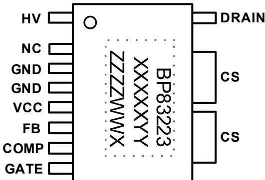  
图 2. ESOP-10 管脚封装图（底部 pad 为 CS）

BP83223：产品型号

XXXXXYY: 批次号

ZZZZ: 内部标示

WW：周号

X：保留位

## 管脚描述

<table><tr><td>管脚号</td><td>管脚名称</td><td>描述</td></tr><tr><td>1</td><td>HV</td><td>高压启动、供电和输入电压检测</td></tr><tr><td>2</td><td>NC</td><td>无连接</td></tr><tr><td>3/4</td><td>GND</td><td>芯片地</td></tr><tr><td>5</td><td>VCC</td><td>芯片供电电源</td></tr><tr><td>6</td><td>FB</td><td>输出电压检测引脚,通过分压电阻连接到变压器辅助绕组,同时检测变压器退磁</td></tr><tr><td>7</td><td>COMP</td><td>环路补偿引脚,外接 RC 网络到 GND</td></tr><tr><td>8</td><td>GATE</td><td>内置 GaN 功率管栅极</td></tr><tr><td>9/10/底部 PAD</td><td>CS</td><td>电流采样输入端,内部连接至 GaN 功率管源极,外部需要接电流采样电阻</td></tr><tr><td>11</td><td>DRAIN</td><td>内置 GaN 功率管漏极</td></tr></table>

## 极限参数(注 1)

<table><tr><td>符号</td><td>参数</td><td>参数范围</td><td>单位</td></tr><tr><td> $V_{DRAIN}$ </td><td>GaN 功率管耐压</td><td>-0.3~700</td><td>V</td></tr><tr><td> $V_{HV}$ </td><td>HV 引脚电压</td><td>-0.3~700</td><td>V</td></tr><tr><td> $V_{CC}$ </td><td> $V_{CC}$  电压</td><td>-0.3~30</td><td>V</td></tr><tr><td> $I_{CC}$ </td><td> $V_{CC}$  电流</td><td>10</td><td>mA</td></tr><tr><td> $V_{FB}$ </td><td>FB 反馈端电压</td><td>-0.3~6</td><td>V</td></tr><tr><td> $V_{COMP}$ </td><td>COMP 电压</td><td>-0.3~6</td><td>V</td></tr><tr><td> $V_{CS}$ </td><td>CS 引脚电压</td><td>-0.3~6</td><td>V</td></tr><tr><td> $V_{GATE}$ </td><td>GATE 引脚电压</td><td>-0.3~7</td><td>V</td></tr><tr><td> $P_{DMAX}$ </td><td>功耗(注2)</td><td>1.47</td><td>W</td></tr><tr><td> $θ_{JA}$ </td><td>结到环境的热阻(注3)</td><td>85</td><td>°C/W</td></tr><tr><td> $T_J$ </td><td>工作结温范围</td><td>-40 to 150</td><td>°C</td></tr><tr><td> $T_{STG}$ </td><td>储存温度范围</td><td>-55 to 150</td><td>°C</td></tr><tr><td rowspan="2">ESD</td><td>除 HV 引脚外(注4)</td><td>2</td><td>kV</td></tr><tr><td>HV 引脚</td><td>1</td><td>kV</td></tr></table>

注 1：极限参数是指超出该范围，有可能导致器件永久性损坏。极限参数为器件应⼒的额定值，⻓期工作在极限参数条件可能会影响器件的可靠性。  
注 2：温度升高最大功耗一定会减小，这也是由T , θ ,和环境温度T 所决定的。最大允许功耗为 $\mathsf { P } _ { \mathsf { D M A X } } = ( \mathsf { T } _ { \mathsf { J M A X } } - \mathsf { T } _ { \mathsf { A } } ) /$ θ 或是极限范围给出的数字中比较低的那个值。  
注 3：1平方英寸双层PCB板，按照JEDEC 标准测试。  
注 4：人体模型，100pF电容通过1.5kΩ电阻放电。

电气参数(注5)（无特别说明情况下， ${ \sf T } _ { \sf A } = 2 5 ^ { \circ } { \sf C } )$

<table><tr><td>符号</td><td>描述</td><td>条件</td><td>最小值</td><td>典型值</td><td>最大值</td><td>单位</td></tr><tr><td colspan="7">VCC供电</td></tr><tr><td> $V_{CC\_ON}$ </td><td>启动阈值电压</td><td>VCC上升至IC开启</td><td>15</td><td>17</td><td>19</td><td>V</td></tr><tr><td> $V_{CC\_UVLO}$ </td><td>欠压保护电压</td><td>VCC下降至IC关闭</td><td>8</td><td>9</td><td>10</td><td>V</td></tr><tr><td> $V_{CC\_CLAMP}$ </td><td>钳位电压</td><td> $I_{CC}=1mA$ </td><td></td><td>24</td><td></td><td>V</td></tr><tr><td> $V_{CC\_OV}$ </td><td>过压保护阈值</td><td> $I_{CC}>10mA$ </td><td>26</td><td>27</td><td>30</td><td>V</td></tr><tr><td> $I_{CC\_ST}$ </td><td>启动电流</td><td> $V_{CC}=V_{CC\_ON}-1V$ </td><td></td><td>5</td><td>15</td><td>μA</td></tr><tr><td> $I_Q$ </td><td>静态工作电流</td><td>无开关动作</td><td></td><td>270</td><td></td><td>μA</td></tr><tr><td> $I_{CC}$ </td><td>工作电流</td><td> $C_L=100\ pF, F_S=15\ kHz$ </td><td>0.25</td><td>0.35</td><td>1</td><td>mA</td></tr><tr><td colspan="7">HV供电</td></tr><tr><td> $V_{CC\_HV}$ </td><td>高压供电VCC电压</td><td></td><td>9</td><td>10</td><td>11</td><td>V</td></tr><tr><td> $I_{HV1}$ </td><td rowspan="2">高压供电电流</td><td> $V_{CC}<4V, V_{HV}=40V$ </td><td>0.4</td><td>0.6</td><td>1</td><td>mA</td></tr><tr><td> $I_{HV2}$ </td><td> $V_{CC}\geqslant 4V, V_{HV}=40V$ </td><td>4</td><td>4.5</td><td>10</td><td>mA</td></tr><tr><td colspan="7">输入欠压保护</td></tr><tr><td> $V_{BR\_OUT}$ </td><td>输入欠压保护阈值</td><td></td><td></td><td>70</td><td></td><td>Vac</td></tr><tr><td> $t_{BR\_delay}$ </td><td>Brown-out检测时间</td><td></td><td></td><td>18</td><td></td><td>ms</td></tr><tr><td colspan="7">FB反馈与退磁检测</td></tr><tr><td> $V_{REF}$ </td><td>内部恒压基准</td><td></td><td>1.18</td><td>1.2</td><td>1.22</td><td>V</td></tr><tr><td> $V_{FB\_ST}$ </td><td>启动阶段判断阈值</td><td></td><td>0.26</td><td>0.31</td><td>0.36</td><td>V</td></tr><tr><td> $V_{FB\_H1}$ </td><td>快速响应FB过高阈值</td><td></td><td>1.27</td><td>1.31</td><td>1.38</td><td>V</td></tr><tr><td> $I_{SINK}$ </td><td>COMP快速下拉电流</td><td></td><td></td><td>7</td><td></td><td>mA</td></tr><tr><td> $V_{FB\_H2}$ </td><td>退出FB过高快速响应</td><td></td><td>1.15</td><td>1.28</td><td>1.35</td><td>V</td></tr><tr><td> $V_{FB\_L1}$ </td><td>退出FB过低快速响应</td><td></td><td>0.99</td><td>1.02</td><td>1.07</td><td>V</td></tr><tr><td> $V_{FB\_L2}$ </td><td>快速响应FB过低阈值</td><td></td><td>0.95</td><td>0.99</td><td>1.15</td><td>V</td></tr><tr><td> $I_{SOURCE}$ </td><td>COMP快速上拉电流</td><td></td><td>105</td><td>140</td><td>195</td><td>μA</td></tr><tr><td> $V_{FB\_OV}$ </td><td>FB过压保护阈值</td><td></td><td>1.25</td><td>1.5</td><td>1.75</td><td>V</td></tr><tr><td> $I_{FB\_DET}$ </td><td>FB故障检测电流</td><td></td><td>85</td><td>100</td><td>115</td><td>μA</td></tr><tr><td> $V_{FB\_OPEN}$ </td><td>FB开路检测阈值</td><td></td><td>2.3</td><td>2.7</td><td>3.1</td><td>V</td></tr><tr><td> $V_{FB\_SHORT}$ </td><td>FB短路检测阈值</td><td></td><td>0.30</td><td>0.35</td><td>0.40</td><td>V</td></tr><tr><td> $V_{FB\_FALL}$ </td><td>退磁检测FB下降阈值</td><td></td><td></td><td>0.1</td><td></td><td>V</td></tr><tr><td> $V_{FB\_RISE}$ </td><td>退磁检测FB上升阈值</td><td></td><td></td><td>0.2</td><td></td><td>V</td></tr><tr><td> $V_{FB\_OLP}$ </td><td>过载保护阈值电压</td><td></td><td></td><td>1</td><td></td><td>V</td></tr><tr><td> $t_{FB\_OLP}$ </td><td>过载保护屏蔽时间</td><td></td><td></td><td>410</td><td></td><td>ms</td></tr><tr><td colspan="7">误差放大器</td></tr><tr><td> $G_m$ </td><td>跨导放大系数</td><td></td><td></td><td>50</td><td></td><td>μA/V</td></tr><tr><td> $V_{COMP}$ </td><td>COMP电压线性工作范围</td><td></td><td>0.2</td><td></td><td>2.7</td><td>V</td></tr><tr><td colspan="7">电流采样</td></tr><tr><td> $V_{CS\_ST}$ </td><td>启动阶段 CS 限流值</td><td></td><td>0.38</td><td>0.45</td><td>0.52</td><td>V</td></tr><tr><td> $V_{CS\_MIN}$ </td><td>最小限流值</td><td></td><td></td><td>100</td><td></td><td>mV</td></tr><tr><td> $V_{CS\_MAX}$ </td><td>最大限流值</td><td></td><td>0.6</td><td>0.7</td><td>0.8</td><td>V</td></tr><tr><td> $V_{CS\_FT}$ </td><td>故障保护限流阈值</td><td></td><td>0.85</td><td>1</td><td>1.15</td><td>V</td></tr><tr><td> $t_{LEB}$ </td><td>前沿消隐时间</td><td></td><td></td><td>300</td><td></td><td>ns</td></tr><tr><td colspan="7">内部时间控制</td></tr><tr><td> $f_{S\_MAX}$ </td><td>最高开关频率限制值</td><td></td><td></td><td>120</td><td></td><td>kHz</td></tr><tr><td> $f_{S\_MIN}$ </td><td>最低开关频率限制值</td><td></td><td></td><td>200</td><td></td><td>Hz</td></tr><tr><td> $t_{ON\_MAX}$ </td><td>最大开通时间</td><td></td><td></td><td>20</td><td></td><td>μs</td></tr><tr><td> $t_{ON\_MIN}$ </td><td>最小开通时间</td><td></td><td></td><td>500</td><td></td><td>ns</td></tr><tr><td> $t_{ZCD\_SKIP}$ </td><td>退磁检测屏蔽时间</td><td></td><td></td><td>1.8</td><td></td><td>μs</td></tr><tr><td> $t_{ZCD}$ </td><td>退磁检测时间</td><td></td><td></td><td>5</td><td></td><td>μs</td></tr><tr><td> $t_{DELAY}$ </td><td>开通延时</td><td></td><td></td><td>500</td><td></td><td>ns</td></tr><tr><td> $t_{OFF\_MAX\_ST}$ </td><td>启动过程最大关断时间</td><td></td><td></td><td>130</td><td></td><td>μs</td></tr><tr><td> $t_{SHORT}$ </td><td>短路保护屏蔽时间</td><td></td><td></td><td>50</td><td></td><td>ms</td></tr><tr><td> $t_{FAULT}$ </td><td>故障保护重启间隔时间</td><td></td><td></td><td>400</td><td></td><td>ms</td></tr><tr><td colspan="7">GaN 功率管</td></tr><tr><td> $BV_{DSS}$ </td><td>漏源电压</td><td></td><td>700</td><td></td><td></td><td>V</td></tr><tr><td rowspan="2"> $I_{DSS}$ </td><td rowspan="2">关断漏电流</td><td> $V_{DS}=700 V,T_J=25°C$ </td><td></td><td>0.7</td><td>25</td><td rowspan="2">μA</td></tr><tr><td> $V_{DS}=700 V,T_J=150°C$ </td><td></td><td>6</td><td>200</td></tr><tr><td rowspan="2"> $R_{DS\_ON}$ </td><td rowspan="2">导通电阻</td><td> $V_{GS}=6 V, I_D=5 A, T_J=25°C$ </td><td></td><td>106</td><td>140</td><td rowspan="2">mΩ</td></tr><tr><td> $V_{GS}=6 V, I_D=5 A, T_J=150°C$ </td><td></td><td>230</td><td></td></tr><tr><td> $I_D$ </td><td>漏极连续电流</td><td> $T_C=25°C$ </td><td></td><td>17</td><td></td><td>A</td></tr><tr><td rowspan="2"> $V_{GS\_TH}$ </td><td rowspan="2">栅极阈值电压</td><td> $I_D=17 mA, T_J=25°C$ </td><td>1.2</td><td>1.6</td><td>2.5</td><td rowspan="2">V</td></tr><tr><td> $I_D=17 mA, T_J=150°C$ </td><td></td><td>1.5</td><td></td></tr><tr><td> $Q_G$ </td><td>栅极电荷</td><td> $V_{GS}=0 to 6V, V_{DS}=400V$ </td><td></td><td>3</td><td></td><td>nC</td></tr><tr><td> $C_{iss}$ </td><td>输入电容</td><td rowspan="3"> $V_{GS}=0V, V_{DS}=400V, fs=100 kHz$ </td><td></td><td>110</td><td></td><td>pF</td></tr><tr><td> $C_{oss}$ </td><td>输出电容</td><td></td><td>30</td><td></td><td>pF</td></tr><tr><td> $C_{rss}$ </td><td>逆导电容</td><td></td><td>0.46</td><td></td><td>pF</td></tr><tr><td> $C_{o\_er}$ </td><td>等效输出电容(能量相关)</td><td rowspan="2"> $V_{GS}=0V, V_{DS}=0 to 400V$ </td><td></td><td>42</td><td></td><td>pF</td></tr><tr><td> $C_{o\_tr}$ </td><td>等效输出电容(时间相关)</td><td></td><td>68</td><td></td><td>pF</td></tr><tr><td colspan="7">过温保护</td></tr><tr><td> $T_{OTP}$ </td><td>过温保护阈值</td><td></td><td></td><td>150</td><td></td><td>°C</td></tr><tr><td> $T_{HYS}$ </td><td>过温保护迟滞</td><td></td><td></td><td>30</td><td></td><td>°C</td></tr></table>

注 5：电气参数定义了器件在工作范围内并且在保证特定性能指标的测试条件下的直流和交流电参数规范。最小值和最大值由测试保证，典型值由设计、测试或统计分析保证。对于未给定上下限值的参数，该规范不予保证其精度，但其典型值合理反映了器件性能。

## 内部结构框图

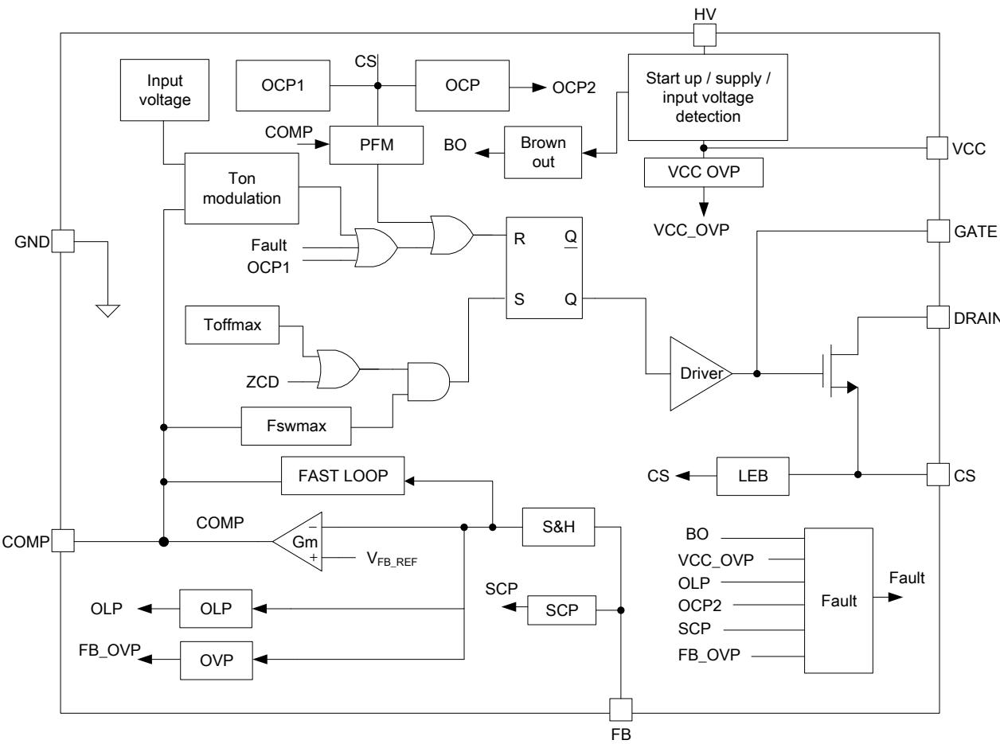  
图 3. BP83223 内部框图

## 功能描述

BP83223是一款原边反馈恒压控制的单级反激APFC 控制芯片，主要应用于高PF 恒压输出的应用领域。反激变换器工作于非连续模式时，原边峰值电流：

$$
I _ {p e a k} = \frac {V _ {i n}}{L _ {m}} * t _ {o n}
$$

一个开关周期的平均电流为：

$$
I _ {p} = \frac {1}{2} * I _ {p e a k} * d = \frac {V _ {i n}}{2 L _ {m}} * t _ {o n} * d
$$

其中

$$
V _ {i n} = \sqrt {2} V _ {a c} \cos \theta
$$

当原边输入电流 ${ \mathsf I } _ { \mathsf p }$ 与 $\mathsf { V } _ { \mathsf { i n } }$ 同频同相时，THD和PF性能最优，此时 $\tan ^ { \star } \mathsf { d }$ 需要为常数，令

$$
k _ {0} * d * t _ {o n} = V _ {c o m p}
$$

k $^ { \star } { \sf d }$ 为内部斜坡信号的斜率， $\mathbf { t } _ { \mathsf { o n } }$ 由斜坡信号与comp电压 决定，则

$$
I _ {p} = \frac {V _ {i n}}{2 L _ {m} * k _ {0}} * V _ {c o m p} = \frac {V _ {i n}}{R _ {i n}}
$$

其中 $\mathsf { R i n }$ 为原边等效输入阻抗

$$
R _ {i n} = \frac {2 L _ {m} * k _ {0}}{V _ {c o m p}}
$$

由于 $\mathsf { V } _ { \mathsf { c o m p } }$ 电压在一个工频周期内不变，因此等效输入阻抗在一个工频周期内为常数，输入电流与输入电压成线性关系，从而实现高功率因数。

## 高压启动与供电

系统上电后，当VCC电压小于4V时，⺟线电压直接通过HV引脚以电流 $\mathsf { I } _ { \mathsf { H V 1 } }$ 对 VCC 电容芯片。当 VCC 电压大于 4V 时，HV电流变为 $\mathsf { I } _ { \mathsf { H V } 2 \circ }$ 。以避免VCC电容短路时芯片损耗太大引起发热。当VCC 电压达到芯片开启阈值 $V _ { C C \_ O N }$ 时，芯片内部控制电路开始工作，此时由VCC电容提供芯片的工作电流，直到辅助供电达到正常。

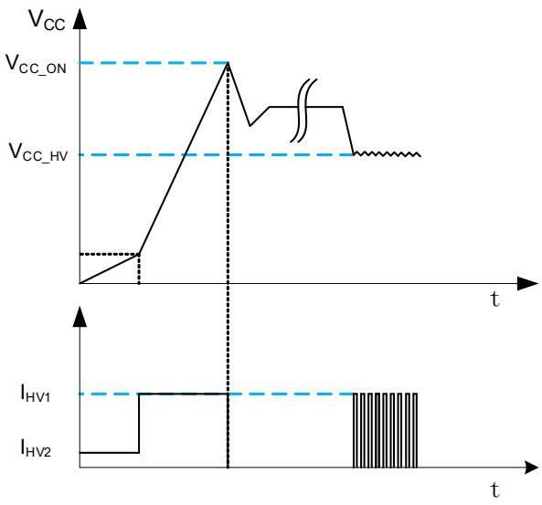  
图 4. VCC 启动时序

异常情况下，当辅助供电不足时，VCC电压下降，当下降到${ \mathsf { V } } { \mathsf { c } } { \mathsf { c } } \_ { \mathsf { H V } }$ 时，高压供电再次开启。虽然HV可以提供VCC工作电流以保证芯片正常工作，但是由于是从高压供电，损耗较大，⻓时间工作会导致芯片过热，因此正常工作时，需要保证辅助绕组供电充足，使得VCC电压高于 $\mathsf { V } _ { \mathsf { C C \_ H V } \circ }$

## VCC 过压、欠压保护

当芯片检测到VCC引脚的电压高于 $\mathsf { V } _ { \mathsf { C } \mathsf { C } \_ \mathsf { O } \mathsf { v } }$ 时，则触发VCC过压保护，芯片停止开关动作，等待 t 时间后再次检测VCC 电压，如果故障消除则重新启动，否则继续等待 t时间。当VCC电压低于 $V _ { \mathsf { C C \_ U V L O } }$ 时，则触发VCC欠压保护，系统复位，HV 高压电流源重新给VCC电容充电。

## 输出电压采样

原边反馈恒压控制能够省去副边反馈电路和光耦，从而降低了系统成本。为了在原边实现副边恒压控制，需要通过辅助绕组检测输出电压。当功率管关断时，辅助绕组的电压为：

$$
V _ {A U X} = \frac {N _ {A}}{N _ {S}} * (V _ {O U T} + V _ {D})
$$

其中， ${ \mathsf { N } } _ { \mathsf { A } }$ 为辅助绕组的圈数， ${ \sf N } _ { \sf S }$ 为副边绕组的圈数， $V _ { \mathsf { D } }$ 为输出续流二极管的正向压降。输出电压计算：

$$
V _ {O U T} = \frac {N _ {S}}{N _ {A}} * \frac {R _ {F B H} + R _ {F B L}}{R _ {F B L}} * V _ {R E F} - V _ {D}
$$

其中，VREF 为内部参考电压， $\mathsf { R } _ { \mathsf { F B L } }$ 是反馈网络的下分压电阻，$\mathsf { R } _ { \mathsf { F B H } }$ 是反馈网络的上分压电阻。

## 退磁检测和谷底开通

BP83223 通过 FB 引脚检测退磁信号。当 FB 电压下降到$V _ { F B \_ R 1 S E }$ 时，ZCDA 信号高；当 FB 电压 $V _ { F B \_ F A L L }$ 时，ZCDA 信号低。ZCD 信号为 ZCDA 信号的下降沿。退磁检测的屏蔽时间为 tZCD\_SKIP 以避免功率管关断瞬间漏感引起的振荡误触发。具体时序如下：

1) 如果 $\mathrm { \ t { s w \_ M l N } }$ 结束后， $\mathtt { t } _ { \mathtt { Z C D } }$ 时间内检测到了退磁信号ZCD，则延时t 后开通功率管。

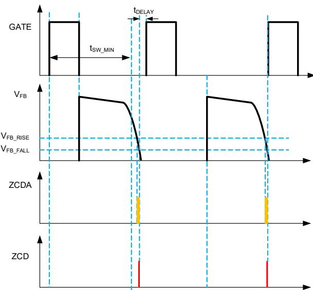  
图5. BCM模式谷底开通

2) 如果 tSW MIN 结束前已经检测到了退磁信号 ZCD，开关并不⽴即开通，等到 $\mathrm { \ t { s w \_ M I N } }$ 结束后，若在 $\mathtt { t } _ { \mathtt { Z C D } }$ 时间内检测到了退磁信号ZCD，则延时t 后开通功率管。

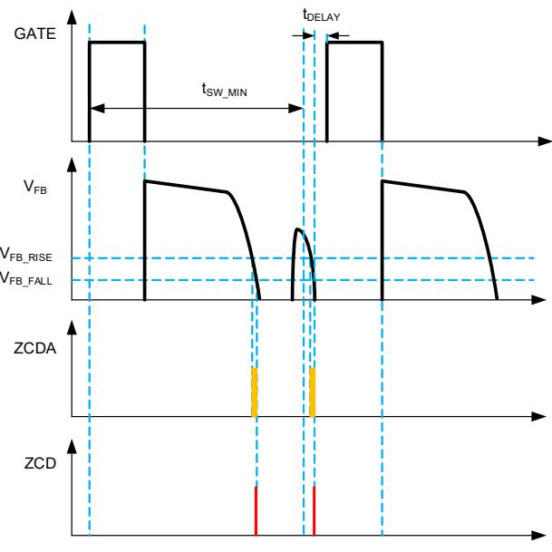  
图6. DCM模式谷底开通

3) 如果tSW\_MIN结束前已经检测到了退磁信号ZCD，开关并不⽴即开通，等到t 结束后，若在t 时间内无法检测到退磁信号，则在t 结束时刻⽴即开通功率管。

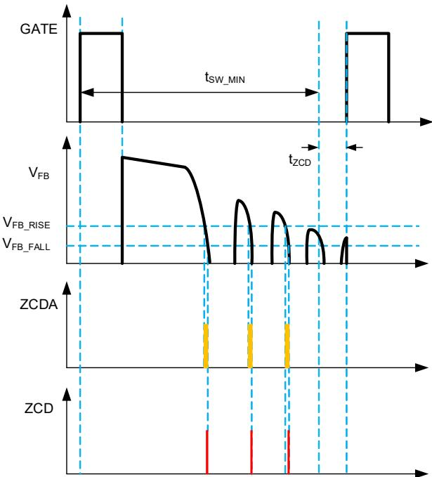  
图7. DCM模式无谷底开通

## 导通时间与频率控制

BP83223的开关频率和ton时间受COMP 电压（电压误差放大器输出）调制。重载时工作于PWM 模式，当负载越大，COMP电压越高，ton越大，同时允许的最高开关频率越高。当到达第一个谷底时，芯片工作于临界模式，锁定第一个谷底，ton随负载增加继续增加，但是频率曲线开始反转。当负载减小，COMP电压降低，ton变小，允许的最高开关频率降低。当ton减小到ton\_min时，不再减小。COMP电压与开关频率和开通时间的关系如下图所示：

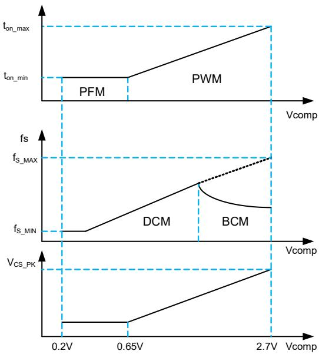  
图8. 导通时间和频率调制

## 动态性能优化

为了改善对负载动态变化的响应，控制器采用了动态性能优化设计。当FB 电压上升到 $V _ { F B \_ H 1 }$ 时，COMP被拉低，控制器⻢上减小能量输出，当FB 下降到 $V _ { F B \_ H 2 }$ ，COMP 回归正常状态。当FB 电压下降到 $V _ { F B \_ L 2 }$ 时，COMP被拉高，控制器⻢上增加能量输出，当FB 上升到 $V _ { F B \_ L 1 } ,$ COMP 回归正常状态。

## PF增强控制

由于输入端X 电容充放电会引起输入电流产生相移，特别是轻载时，PF值会显著下降。BP83223内置PFC提升功能，对X电容充放电引起的电流相移进⾏了补偿。

## 短路保护

BP83223 连续 $\scriptstyle \mathrm { \mathtt { t s H O R T } }$ 时间检测不到退磁信号，则触发输出短路保护，等待 $\mathrm { \ t F A U L { \bar { I } } }$ 时间后重新检测故障状态。

## 逐周期限流保护

芯片逐周期检测电感的峰值电流，CS 端连接到峰值电流比较器的输入端，与内部限流阈值电压进⾏比较，当CS 电压达到内部检测阈值时，功率管保护并关断。启动时，当FB电压低于 $V _ { F B \_ S \top }$ 时，系统处于启动阶段，COMP电压拉高至最大值，此时CS 峰值电流限值为 $\mathsf { V } _ { \mathsf { C S \_ S \top } }$ ，一旦当FB 电压大于 $V _ { F B \_ S T }$ 后，系统退出启动阶段，环路开始起作用。

## 输出⼆极管短路保护

当电感或输出二极管短路时，CS 电压迅速上升。若CS 电压大于 $V _ { \mathsf { C S \_ F T } }$ ，系统进入故障保护状态。等待 $\tan \tau$ 以后重新检测故障状态。

## 输出过压保护

当FB 电压开关周期连续大于2次检测到大于 $V _ { F B \_ O \vee }$ ，系统进入故障保护状态，等待 $\mathrm { \Delta t _ { F A U L T } }$ 以后重新检测故障状态。

## 过载保护

当检测到FB 电压低于 $V _ { F B \_ O \mathsf { L } P }$ 并持续超过 $\tan \angle F B \_ 0 \angle P$ 时间，系统进入故障保护状态。等待 $\tan \tau$ 以后重新检测故障状态。

## 输入欠压保护

当输入电压小于 $V _ { B R \_ 0 \cup T }$ 并持续 $\tan \angle C \vert \tan \beta \vert$ ，系统进入故障保护状态，等待 $\tan \tau$ 以后重新检测故障状态。

## FB 开/短路保护

启动后FB 脚流出检测电流 $\mathsf { I } _ { \mathsf { F B \_ D E T } }$ ，若FB 电压大于 $V _ { F B \_ O P E N }$ 或者小于 $\mathsf { V } _ { \mathsf { F B \_ S H O R T } } ,$ 系统进入故障保护状态。等待 $\mathrm { \Delta t _ { F A U L T } }$ 以后重新检测故障状态。

## 过温保护

BP83223具有过热保护功能，在驱动电源过热时⽴即停止开关，避免芯片温度上升，以提高系统的可靠性。芯片内部设定过热保护温度为 ${ \mathsf { T } } _ { \mathsf { O T P } } ,$ ，温度迟滞为 ${ \sf T } _ { \sf H Y S o }$

## 封装信息

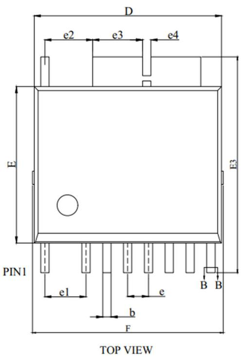  
ESOP-10 封装外形尺寸

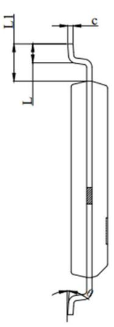  
SIDE VIEW

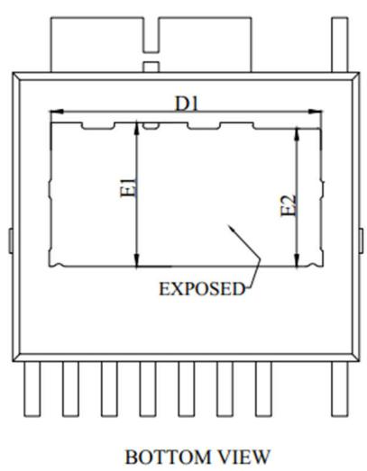

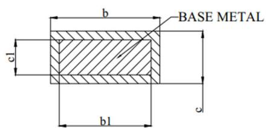

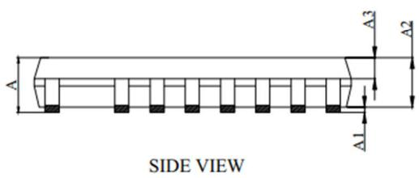

SECTION:B-B

<table><tr><td>SYMBOL</td><td>MIN</td><td>NOM</td><td>MAX</td></tr><tr><td>A</td><td>1.30</td><td>-</td><td>1.62</td></tr><tr><td>A1</td><td>0.00</td><td>-</td><td>0.12</td></tr><tr><td>A2</td><td>1.30</td><td>1.40</td><td>1.50</td></tr><tr><td>A3</td><td>0.60</td><td>0.65</td><td>0.70</td></tr><tr><td>b</td><td>0.37</td><td>-</td><td>0.47</td></tr><tr><td>b1</td><td>0.35</td><td>-</td><td>0.45</td></tr><tr><td>c</td><td>0.17</td><td>-</td><td>0.27</td></tr><tr><td>c1</td><td>0.15</td><td>-</td><td>0.25</td></tr><tr><td>D</td><td>8.90</td><td>9.00</td><td>9.10</td></tr><tr><td>D1</td><td>6.77</td><td>-</td><td>6.97</td></tr><tr><td>E</td><td>7.40</td><td>7.50</td><td>7.60</td></tr><tr><td>E1</td><td>3.465</td><td>-</td><td>3.665</td></tr><tr><td>E2</td><td>3.365</td><td>-</td><td>3.565</td></tr><tr><td>E3</td><td>10.14</td><td>10.34</td><td>10.54</td></tr><tr><td>F</td><td>9.00</td><td>-</td><td>9.40</td></tr><tr><td>e</td><td colspan="3">1.00 BSC</td></tr><tr><td>e1</td><td colspan="3">1.98 BSC</td></tr><tr><td>e2</td><td>2.20</td><td>2.30</td><td>2.40</td></tr><tr><td>e3</td><td>2.295</td><td>2.395</td><td>2.495</td></tr><tr><td>e4</td><td colspan="3">0.40 BSC</td></tr><tr><td>L</td><td>0.62</td><td>0.72</td><td>0.82</td></tr><tr><td>L1</td><td>1.32</td><td>1.42</td><td>1.52</td></tr><tr><td>θ</td><td>0°</td><td>3°</td><td>6°</td></tr></table>

<table><tr><td>SYMBOL</td><td>MIN</td><td>NOM</td><td>MAX</td></tr><tr><td>A</td><td>0.051</td><td>-</td><td>0.064</td></tr><tr><td>A1</td><td>0.000</td><td>-</td><td>0.005</td></tr><tr><td>A2</td><td>0.051</td><td>0.055</td><td>0.059</td></tr><tr><td>A3</td><td>0.024</td><td>0.026</td><td>0.028</td></tr><tr><td>b</td><td>0.015</td><td>-</td><td>0.019</td></tr><tr><td>b1</td><td>0.014</td><td>-</td><td>0.018</td></tr><tr><td>c</td><td>0.007</td><td>-</td><td>0.011</td></tr><tr><td>c1</td><td>0.006</td><td>-</td><td>0.010</td></tr><tr><td>D</td><td>0.350</td><td>0.354</td><td>0.358</td></tr><tr><td>D1</td><td>0.267</td><td>-</td><td>0.274</td></tr><tr><td>E</td><td>0.291</td><td>0.295</td><td>0.299</td></tr><tr><td>E1</td><td>0.136</td><td>-</td><td>0.144</td></tr><tr><td>E2</td><td>0.132</td><td>-</td><td>0.140</td></tr><tr><td>E3</td><td>0.399</td><td>0.407</td><td>0.415</td></tr><tr><td>F</td><td>0.354</td><td>-</td><td>0.370</td></tr><tr><td>e</td><td colspan="3">0.039 BSC</td></tr><tr><td>e1</td><td colspan="3">0.078 BSC</td></tr><tr><td>e2</td><td>0.087</td><td>0.091</td><td>0.094</td></tr><tr><td>e3</td><td>0.090</td><td>0.094</td><td>0.098</td></tr><tr><td>e4</td><td colspan="3">0.016 BSC</td></tr><tr><td>L</td><td>0.024</td><td>0.028</td><td>0.032</td></tr><tr><td>L1</td><td>0.052</td><td>0.056</td><td>0.060</td></tr><tr><td>θ</td><td>0°</td><td>3°</td><td>6°</td></tr></table>

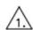

ADOES NOT INCLUDE MOLD FLASH, PROTRUSIONS OR GATE BURRS, MOLD FLASH,

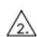

## 版本信息

<table><tr><td>版本</td><td>日期</td><td>记录</td></tr><tr><td>Rev. 1.0</td><td>2025/05</td><td>正式发行</td></tr><tr><td></td><td></td><td></td></tr></table>

## 免责声明

晶丰明源尽⼒确保本产品规格书内容的准确和可靠，但是保留在没有通知的情况下，修改规格书内容的权利。

本产品规格书未包含任何针对晶丰明源或第三方所有的知识产权的授权。针对本产品规格书所记载的信息，晶丰明源不做任何明示或暗示的保证，包括但不限于对规格书内容的准确性、商业上的适销性、特定⽬的的适用性或者不侵犯晶丰明源或任何第三人知识产权做任何明示或暗示保证，晶丰明源也不就因本规格书本⾝及其使用有关的偶然或必然损失承担任何责任。

## 电子器件报废说明

该产品在生命周期结束后，由客户按照一般电子产品的报废流程进行处理。