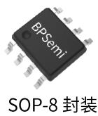
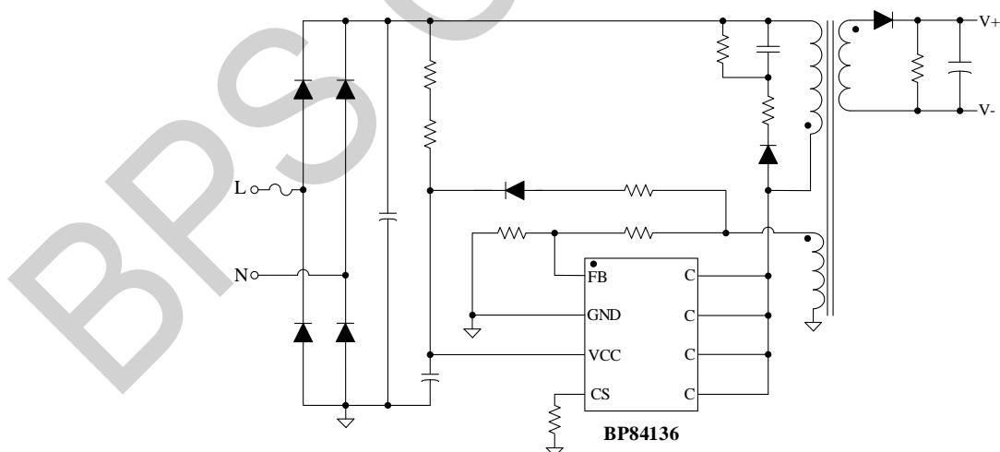
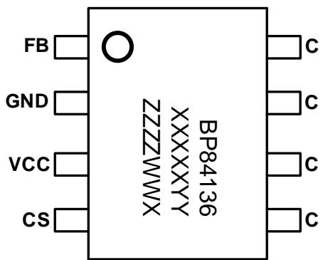
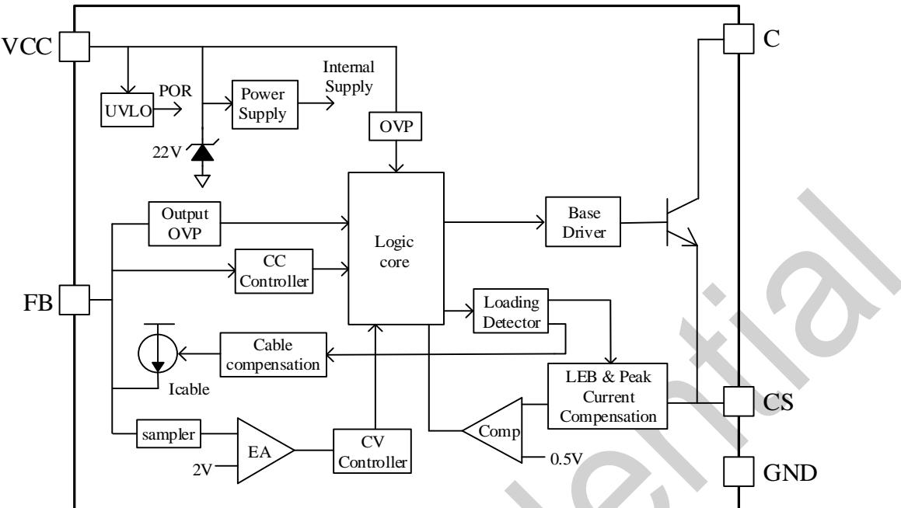
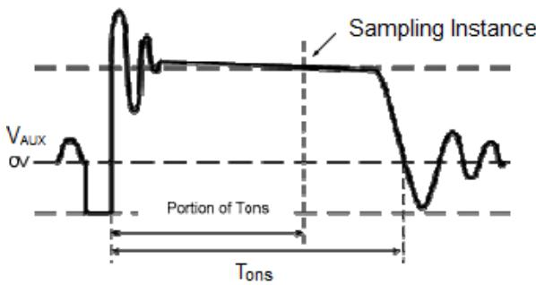
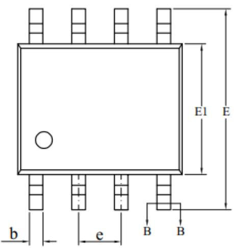
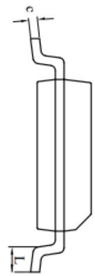
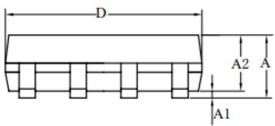
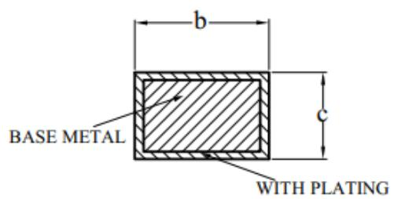

## BP84136隔离反激恒压恒流控制芯片

## 概述

BP84136是一款高性能恒压恒流原边反馈控制器，适用于各种低功耗AC/DC充电器和适配器应用场合。该控制器采用原边反馈控制机制，无需光耦和TL431即可以实现高精度的电压输出。

在恒流控制模式中，可以通过改变与CS管脚连接的电阻阻值来调节输出电流大小。在恒压控制模式下，BP84136使用了多种工作模式以得到高转换效率和小的音频异响。BP84136内置输出线损补偿，并可以通过修改反馈电阻阻值调整补偿比例，以达到适应各种不同输出导线线损要求，可以有效的补偿输出电流在输出线上引起的线损压降。在恒流模式和重负载下，BP84136工作于PFM，而在轻载和中度负载下同时减小peak和工作频率，以优化转换效率，避免音频异响。

BP84136具有多重的保护功能，包括输出过压、欠压保护，VCC过压、欠压保护，反馈开路、短路保护，输出整流管开路、短路保护，CS开路保护，过温保护等。BP84136采用SOP-8封装。

## 特点

<75 mW待机功耗，满足六级能效要求

准谐振工作机制，提高系统效率

峰值电流渐变抖动改善EMI

内置功率三极管

恒压、恒流精度高

输出线损补偿可调

内置输入线电压补偿

输出过压、短路保护

VCC 电压过压、欠压保护

输出整流管开路、短路保护

反馈开路、短路保护

CS 开路保护

过温保护

## 应用领域

手机、无绳电话、PDA、MP3和其它便携式设备等的适配器、充电器

LED 驱动电源

线性电压和 RCC 开关电源升级换代

PC、TV等设备使用的辅助电源

## 典型应用

  
图 1. BP84136 典型应用图

## 定购信息

<table><tr><td>定购型号</td><td>封装</td><td>包装形式</td><td>打印</td></tr><tr><td>BP84136</td><td>SOP8</td><td>卷盘4000颗/盘</td><td>BP84136XXXXYYZZZZWWX</td></tr></table>

## 管脚封装

  
图 2. 管脚封装图

BP84136：产品型号

XXXXXYY:批次号

ZZZZ: 内部标示

WW：周号

X：保留位

## 管脚描述

<table><tr><td>管脚号</td><td>管脚名称</td><td>描述</td></tr><tr><td>1</td><td>FB</td><td>反馈电压输入端</td></tr><tr><td>2</td><td>GND</td><td>芯片地</td></tr><tr><td>3</td><td>VCC</td><td>芯片供电脚</td></tr><tr><td>4</td><td>CS</td><td>电流检测脚</td></tr><tr><td>5、6、7、8</td><td>C</td><td>内置三极管集电极</td></tr></table>

## 极限参数(注1)

<table><tr><td>符号</td><td>参数</td><td>参数范围</td><td>单位</td></tr><tr><td>VC</td><td>集电极耐压</td><td>-0.7~700</td><td>V</td></tr><tr><td>VCC</td><td>芯片供电脚电压范围</td><td>-0.3~22</td><td>V</td></tr><tr><td>CS</td><td>电流检测脚电压范围</td><td>-0.3~6</td><td>V</td></tr><tr><td>FB</td><td>输入反馈脚电压范围</td><td>-0.7~6</td><td>V</td></tr><tr><td> $P_{DMAX}$ </td><td>功耗(注2)</td><td>0.86</td><td>W</td></tr><tr><td> $\theta_{JA}$ </td><td>PN结到环境的热阻(注3)</td><td>145</td><td>°C/W</td></tr><tr><td> $T_J$ </td><td>工作结温范围</td><td>-40~150</td><td>°C</td></tr><tr><td> $T_{STG}$ </td><td>储存温度范围</td><td>-55~150</td><td>°C</td></tr></table>

注1：极限参数是指超出该范围，有可能导致器件永久性损坏。极限参数为器件应力的额定值，长期工作在极限参数条件可能会影响器件的可靠性。  
注2：温度升高最大功耗一定会减小，这也是由TJMAX，θJA,和环境温度TA所决定的。最大允许功耗为PDMAx=(TJMAx-TA)/θJA或是极限范围给出的数字中比较低的那个值。  
注 3：1 平方英寸双层 PCB 板，按照 JEDEC 标准测试。

## 推荐输出功率范围

<table><tr><td>产品</td><td>输出功率(85~264Vac)</td></tr><tr><td>BP84136</td><td>5V3.1A</td></tr></table>

电气参数(注4)（无特别说明情况下， ${ \sf T } _ { \sf A } { = } 2 5 ^ { \circ } \sf C$

<table><tr><td>描述</td><td>符号</td><td>条件</td><td>最小值</td><td>典型值</td><td>最大值</td><td>单位</td></tr><tr><td colspan="7">VCC供电部分</td></tr><tr><td> $V_{CC\_ON}$ </td><td>VCC启动电压</td><td></td><td>13.05</td><td>14.5</td><td>15.95</td><td>V</td></tr><tr><td> $V_{CC\_OFF}$ </td><td>VCC欠压保护阈值</td><td></td><td>3.3</td><td>3.65</td><td>3.9</td><td>V</td></tr><tr><td> $I_{START}$ </td><td>VCC启动电流</td><td> $VCC=V_{CC\_ON}-1V$ </td><td>0</td><td>0.23</td><td>20</td><td>μA</td></tr><tr><td> $I_{STAND\_BY}$ </td><td>静态工作电流</td><td></td><td>0.3</td><td></td><td>0.6</td><td>mA</td></tr><tr><td> $V_{CC\_OVP}$ </td><td>VCC过压保护阈值</td><td></td><td>18</td><td>20</td><td>22</td><td>V</td></tr><tr><td colspan="7">电流采样部分</td></tr><tr><td> $V_{CS\_MAX}$ </td><td>CS最大限流阈值</td><td></td><td>490</td><td>500</td><td>510</td><td>mV</td></tr><tr><td> $V_{CS\_MIN}$ </td><td>CS最小限流阈值</td><td></td><td>131</td><td></td><td>200</td><td>mV</td></tr><tr><td> $t_{LEB}$ </td><td>前沿消隐时间</td><td></td><td></td><td>400</td><td></td><td>ns</td></tr><tr><td colspan="7">FB反馈部分</td></tr><tr><td> $V_{FB\_REF}$ </td><td>FB反馈基准电压</td><td></td><td>1.975</td><td>2</td><td>2.025</td><td>V</td></tr><tr><td> $I_{CABLE\_MAX}$ </td><td>最大线损补偿电流</td><td></td><td>-43</td><td>-39.5</td><td>-37</td><td>μA</td></tr><tr><td> $V_{FB\_DEM}$ </td><td>退磁比较电压阈值</td><td></td><td></td><td>25</td><td></td><td>mV</td></tr><tr><td> $T_{FB\_SHORT}$ </td><td>输出短路去抖动时间</td><td></td><td></td><td>36</td><td></td><td>ms</td></tr><tr><td colspan="7">保护功能部分</td></tr><tr><td> $V_{FB\_OVP}$ </td><td>FB过压保护电压</td><td></td><td></td><td>2.4</td><td></td><td>V</td></tr><tr><td> $V_{FB\_SCP}$ </td><td>FB短路保护电压</td><td></td><td></td><td>1.4</td><td></td><td>V</td></tr><tr><td> $T_{SD}$ </td><td>过温保护温度</td><td></td><td></td><td>150</td><td></td><td>°C</td></tr><tr><td> $T_{HYS}$ </td><td>过温保护温度迟滞</td><td></td><td></td><td>20</td><td></td><td>°C</td></tr><tr><td colspan="7">功率管</td></tr><tr><td> $V_{CBO}$ </td><td>集电极-基极击穿电压</td><td></td><td>750</td><td></td><td></td><td>V</td></tr><tr><td> $I_{C\_MAX}$ </td><td>最大集电极电流</td><td></td><td></td><td>4</td><td></td><td>A</td></tr></table>

注4：电气参数定义了器件在工作范围内并且在保证特定性能指标的测试条件下的直流和交流电参数规范。最小值和最大值由测试保证，典型值由设计、测试或统计分析保证。对于未给定上下限值的参数，该规范不予保证其精度，但其典型值合理反映了器件性能

## 内部结构框图

  
图 3. BP84136 内部结构图

## 功能描述

BP84136是一款恒压恒流的原边反馈控制芯片，系统工作于断续模式，无需光耦和TL431即可以实现高精度的电压输出，适用于充电器和适配器以及其它辅助类电源。BP84136在恒流模式和重负载下工作于PEM，而在轻载和中度负载下同时减小峰值电流和工作频率，以优化转换效率，避免音频异响。

## 启动

芯片启动电流仅为2 ${ \mathrm { . ~ } } \mu \mathsf { A } ;$ ，使得系统能使用较大的启动电阻以减小启动电阻的损耗。系统上电后通过启动电阻对VCC 电容进行充电，当VCC电压达到芯片的启动电压，芯片内部控制电路开始工作。输出电压开始上升，当输出电压上升到足够高后，VCC由辅助绕组通过二极管进行供电，在芯片开始工作到辅助绕组开始供电期间，芯片所需电流均由VCC电容直接提供，VCC电压会下降。设计时需考虑使用足够大的VCC 电容以免在辅助绕组开始供电以前，VCC电压下降到芯片关断电压以下，造成启动失败。

## 输出恒流设置

芯片内部采用逐周期检测电感峰值电流，CS端连接到内部的峰值电流比较器输入端，与内部基准电压进行比较，从而控制功率管开关。可以改变连接CS 到地的电流检测电阻 $R _ { C S }$ 的阻值大小来限定峰值电流并最终调节系统最大输出电流。

芯片内置输入线电压补偿功能，使得输出电流基本不随输入电压变化。恒流模式下，电感峰值电流 $; I _ { p k }$ 由下式决定：

$$
I _ {p k} = \frac {V _ {C S \_ M A X}}{R _ {C S}} = \frac {0 . 5}{R _ {C S}}
$$

$R _ { C S }$ 为 CS 脚电阻，输出电流由下式决定

$$
I _ {O} = 0. 2 5 * I _ {p k} * \frac {N _ {P}}{N _ {S}}
$$

其中， $N _ { P }$ 为变压器原边绕组匝数， $N _ { S }$ 为变压器输出绕组匝数， $I _ { p k }$ 为原边电感的峰值电流。

## 输出恒压设置

芯片通过采样辅助绕组平台电压，经分压电阻分压后与内部基准比较形成闭环，以调整输出电压。在输出续流管导通期间，副边绕组可以看作是励磁绕组，辅助绕组看作是磁化绕组，辅助绕组电压 $V _ { \sf A U X }$ 可由下述公式获得：

$$
V _ {\mathrm{AUX}} = \frac {N _ {\mathrm{AUX}}}{N _ {S}} (V _ {o} + V _ {d})
$$

其中， $V _ { O }$ 是输出电压， $V _ { d }$ 是续流二极管导通压降， $N _ { S }$ 和 $N _ { A U X }$ 分别是变压器副边绕组和辅助绕组的匝数。

续流二极管导通压降 $V _ { d }$ 大小取决于通过二极管的电流，如果副边的平台电压都是在相同副边电流时刻检测，副边电压和输出电压的差值 $V _ { d }$ 是固定值。

  
图 4. 辅助绕组电压波形

图4为辅助绕组电压波形，通过连接在辅助绕组和FB脚之间的分压电阻，系统检测2/3的Tons(续流二极管导通时间)时间点处的电压，并将此电压和内部 $V _ { F B \_ R E F }$ (典型值2V)比较，差值通过误差比较器放大，误差放大器输出反映负载情况，控制关断时间，调节输出电压，从而达到恒定的输出电压。输出电压计算公式如下：

$$
V o = \frac {V _ {F B \_ R E F} \times (R _ {F B L} + R _ {F B H})}{R _ {F B L}} \times \frac {N _ {S}}{N _ {A U X}} - V d
$$

其中，RFBL是 FB 下拉电阻， $\mathsf { R e } _ { \mathsf { B H } }$ 是 FB 上拉电阻。

## 电感计算

芯片开关频率随工作模式和负载情况而改变，对于一个工作于DCM的 Flyback 系统，其最大工作频率由下式决定：

$$
F _ {m a x} = \frac {2 \times P _ {O \_ m a x}}{\eta \times L _ {P} \times I _ {p k} ^ {2}}
$$

其中， $P _ { O \_ m a x }$ 是系统最大输出功率，η为系统转换效率，Lp为原边电感，Ipk为原边电感的峰值电流。

工作频率建议设定在40\~55 kHz范围，在确定好系统的工作频率Fmax之后，即可确定电感的计算公式为：

$$
L _ {P} = \frac {2 \times P _ {O \_ m a x}}{\eta \times F _ {m a x} \times I _ {p k} ^ {2}}
$$

## 输出导线线损补偿

为了得到较好的负载调整率，BP84136内置输出导线线损补偿功能。一路与负载电流成反比的电流 $\mathsf { l c A B L E \_ M A X }$ 由芯片内部产生并从FB 脚流出， 在FB分压电阻上产生一个与负载电流成反比的偏置电压用于补偿输出电流在输出线上引起的线损压降。最大补偿比例由下式决定：

$$
\frac {\Delta V}{V _ {o u t}} \approx \frac {I _ {C A B L E \_ M A X} \times (R _ {F B L} | | R _ {F B H}) - 0 . 1 4 3}{V _ {F B \_ R E F}} \times 100 \%
$$

例如， $\sf R e s c { = } 9 k \Omega$ $R _ { F B H } = 1 8 \not \ k \Omega$ ，则补偿比例为：

$$
\frac {\Delta V}{V _ {o u t}} \approx \frac {4 0 u A \times (9 K | | 1 8 K) - 0 . 1 4 3}{2 V} \times 100 \% \approx 5 \%
$$

## 输出过压保护及短路保护

当FB检测到平台电压达到内部设定的 $V _ { F B \_ O \vee P }$ (典型值 2.4V)时，系统进入过压保护。

$$
V _ {O V P} = \frac {2 . 4 \times (R _ {F B L} + R _ {F B H})}{R _ {F B L}} \times \frac {N _ {S}}{N _ {A U X}}
$$

其中，Vovp是过压保护电压阈值。

$$
V _ {S C P} = \frac {1 . 4 \times (R _ {F B L} + R _ {F B H})}{R _ {F B L}} \times \frac {N _ {S}}{N _ {a u x}}
$$

当 FB 检测到平台电压持续 36 ms 低于内部设定的短路保护阈值1.4V时，系统进入短路保护。

## 保护功能

BP84136内置多种保护功能，包括输出整流管开路、短路保护，VCC过压、欠压保护，反馈网络开路、短路保护，CS开路保护，迟滞过温保护等。

## PCB设计

在设计PCB时，需要遵循以下原则：

1) VCC 旁路电容尽量靠近芯片 VCC 和 GND 脚。

2)接到FB的分压电阻必须靠近FB引脚，且节点要远离变压器原边绕组的动点。

3)电流采样电阻的功率地线尽可能短，且要和芯片的地线及其他小信号的地线分头接到母线电容的地端。

4）减小功率环路的面积，如变压器初级、功率管、母线电容的环路面积，以及变压器副边绕组、整流二极管、输出电容的环路面积，可以减小EMI辐射。

增加C引脚的铺铜面积可以提高芯片散热

## 封装信息

  
SOP-8 封装外形尺寸

  
SECTION B-B

<table><tr><td rowspan="2">SYMBOL</td><td colspan="3">MILLIMETER</td></tr><tr><td>MIN</td><td>NOM</td><td>MAX</td></tr><tr><td>A</td><td>1.30</td><td>—</td><td>1.80</td></tr><tr><td>A1</td><td>0.05</td><td>—</td><td>0.25</td></tr><tr><td>A2</td><td>1.25</td><td>1.40</td><td>1.65</td></tr><tr><td>b</td><td>0.33</td><td>—</td><td>0.51</td></tr><tr><td>c</td><td>0.17</td><td>—</td><td>0.25</td></tr><tr><td>D</td><td>4.70</td><td>4.90</td><td>5.10</td></tr><tr><td>E</td><td>5.80</td><td>6.00</td><td>6.30</td></tr><tr><td>E1</td><td>3.70</td><td>3.90</td><td>4.10</td></tr><tr><td>e</td><td colspan="3">1.27BSC</td></tr><tr><td>L</td><td>0.40</td><td>—</td><td>1.00</td></tr></table>

## 版本信息

<table><tr><td>版本</td><td>日期</td><td>记录</td></tr><tr><td>Rev. 0.9</td><td>2023/11</td><td>Preliminary</td></tr><tr><td>Rev. 1.0</td><td>2024/08</td><td>1.0</td></tr></table>

## 免责声明

晶丰明源尽力确保本产品规格书内容的准确和可靠，但是保留在没有通知的情况下，修改规格书内容的权利。

本产品规格书未包含任何针对晶丰明源或第三方所有的知识产权的授权。针对本产品规格书所记载的信息，晶丰明源不做任何明示或暗示的保证，包括但不限于对规格书内容的准确性、商业上的适销性、特定目的的适用性或者不侵犯晶丰明源或任何第三人知识产权做任何明示或暗示保证，晶丰明源也不就因本规格书本身及其使用有关的偶然或必然损失承担任何责任。

## 电子器件报废说明

该产品在生命周期结束后，由客户按照一般电子产品的报废流程进行处理。