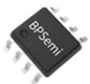
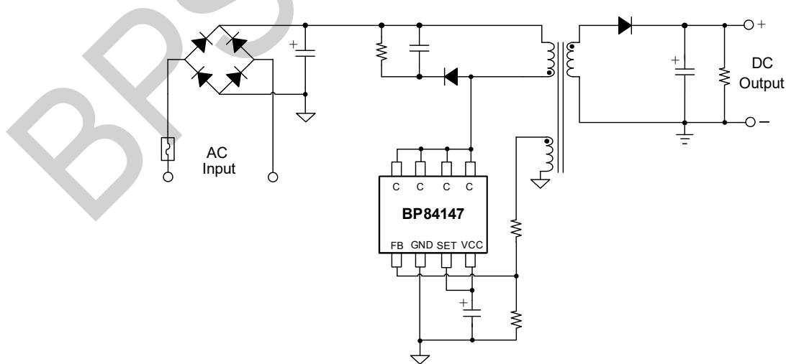
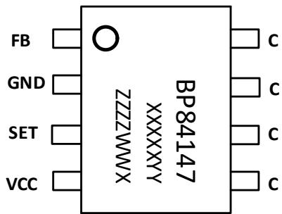
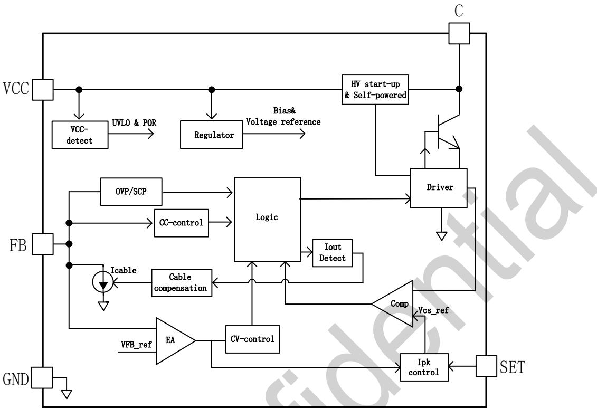
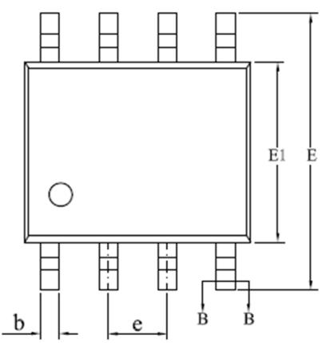
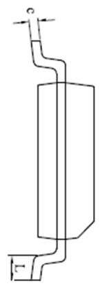
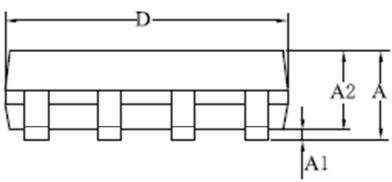
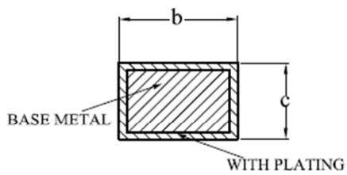

## BP84147自供电 PSR 反激驱动开关

## 概述

BP84147是原边反馈控制恒压、恒流反激变换器芯片。

BP84147采用DCM控制方式，通过检测辅助绕组的去磁实现开关管的谷底开通，减小开关损耗和EMI。

BP84147通过高压自供电给VCC充电，无需外部启动电阻，同时源极开关结构可以实现VCC自供电，无需辅助供电，便于宽输出电压的应用。BP84147采用镜像电流采样技术可以省去原边CS电阻，节省了成本和体积，同时提高了系统可靠性。原边限流点可以通过外部调节，实现不同的恒流值。恒压模式下，BP84147提供了输出线压降补偿功能，以获得较好的负载调整率。

BP84147通过检测辅助绕组电压实现原边反馈，无需光耦和相关电路元件，极简的外围电路不仅降低了系统成本和体积，也提高了可靠性。

BP84147具有丰富的保护功能，包括逐周期限流，VCC欠压保护，VCC电压钳位，输出短路保护，反馈开路保护，输出过压/欠压保护，输出整流管短路保护，迟滞过温保护等，使系统更加安全可靠。

BP84147采用SOP-8封装。

  
SOP-8 封装

## 特点

 原边 CV/CC 控制，源极开关 BJT

 满足6 级能效要求，<75mW待机功耗

 内置高压启动

 VCC自供电，无需辅助供电

 原边镜像电流采样，无需CS电阻

 输出线压降补偿，实现良好的负载调整率

 输入线电压补偿，实现CC 精度±5%

 原边Ilimit 外部两档可调

 外围元器件少

 保护功能

 逐周期限流（OCP）

 输出短路保护（SCP）

CS 引脚开路保护（CS OLP）

次级整流管短路保护

反馈环开路保护（OLP）

过温保护（OTP）

## 应用领域

 AC/DC 充电器

 适配器

 AC/DC 辅助电源

## 典型应用

  
图 1. BP84147 典型应用电路

## 定购信息

<table><tr><td>定购型号</td><td>封装</td><td>包装形式</td><td>打印</td></tr><tr><td>BP84147</td><td>SOP-8</td><td>卷盘4000颗/盘</td><td>BP84147XXXXYYZZZZWWX</td></tr></table>

## 管脚封装

  
BP84147：产品型号  
图 2. SOP-8 管脚封装图

XXXXXYY: 批次号

ZZZZ: 内部标示

WW：周号

X：保留位

## 管脚描述

<table><tr><td>管脚号</td><td>管脚名称</td><td>描述</td></tr><tr><td>1</td><td>FB</td><td>反馈电压检测脚,同时检测变压器去磁信号</td></tr><tr><td>2</td><td>GND</td><td>芯片内部功率管的源极,芯片地</td></tr><tr><td>3</td><td>SET</td><td>峰值电流 $I_{PK}$ 设置引脚</td></tr><tr><td>4</td><td>VCC</td><td>VCC引脚,接VCC电容</td></tr><tr><td>5、6、7、8</td><td>C</td><td>内置三极管的集电极</td></tr></table>

## 输出功率

<table><tr><td>产品型号</td><td>工作特点</td><td>输出功率(90~265VAC)</td></tr><tr><td>BP84147</td><td>恒流输出</td><td>18 W</td></tr></table>

极限参数(注 1)

<table><tr><td>符号</td><td>参数</td><td>参数范围</td><td>单位</td></tr><tr><td>VCC</td><td>芯片 VCC 引脚电压范围</td><td>-0.6~6</td><td>V</td></tr><tr><td>FB</td><td>FB 脚到 GND 电压范围</td><td>-6~6</td><td>V</td></tr><tr><td>SET</td><td>SET 脚到 GND 电压范围</td><td>-0.6~6</td><td>V</td></tr><tr><td>C</td><td>集电极到 GND 脚的电压范围</td><td>-0.6~800</td><td>V</td></tr><tr><td> $P_{DMAX}$ </td><td>功耗(注 2)</td><td>0.97</td><td>W</td></tr><tr><td> $\theta_{JA}$ </td><td>结到环境的热阻(注 3)</td><td>145</td><td>°C/W</td></tr><tr><td> $T_J$ </td><td>工作结温范围</td><td>-40~150</td><td>°C</td></tr><tr><td> $T_{STG}$ </td><td>储存温度范围</td><td>-55~150</td><td>°C</td></tr><tr><td>ESD</td><td>人体模型 ESD(注 4)</td><td>2</td><td>kV</td></tr></table>

注 1：极限参数是指超出该范围，有可能导致器件永久性损坏。极限参数为器件应⼒的额定值，⻓期工作在极限参数条件可能会影响器件的可靠性。  
注 2：温度升高最大功耗一定会减小，这也是由 $T _ { \Delta M A X } , \theta _ { J A } ,$ 和环境温度 $\mathsf { T } _ { \mathsf { A } }$ 所决定的。最大允许功耗为 $P _ { \tt D M A X } = \left( \mathbb { T } _ { \tt J M A X } - \mathbb { T } _ { \tt A } \right) / \theta _ { \tt J A }$ 或是极限范围给出的数字中比较低的那个值。  
注 3：1平方英寸双层 PCB 板，按照 JEDEC 标准测试。  
注 4：人体模型，100pF 电容通过 1.5kΩ 电阻放电。

电气参数(注 5)

<table><tr><td>符号</td><td>描述</td><td>条件</td><td>最小值</td><td>典型值</td><td>最大值</td><td>单位</td></tr><tr><td colspan="7">VCC供电</td></tr><tr><td> $V_{CC\_ON}$ </td><td>VCC启动阈值电压</td><td>VCC上升至IC开启</td><td>4.5</td><td>5</td><td>5.5</td><td>V</td></tr><tr><td> $V_{CC\_UVLO}$ </td><td>VCC欠压保护开启电压</td><td>VCC下降至IC关闭</td><td></td><td>3.1</td><td></td><td>V</td></tr><tr><td> $V_{CC\_Clamp}$ </td><td>VCC钳位电压</td><td>ICC=500μA</td><td></td><td>5</td><td></td><td>V</td></tr><tr><td> $I_{ST}$ </td><td>启动前VCC电流</td><td>VCC=  $V_{CC\_ON}-1V$ </td><td></td><td></td><td>1</td><td>μA</td></tr><tr><td> $I_Q$ </td><td>待机电流</td><td> $T_J=25°C$ </td><td></td><td>40</td><td></td><td>μA</td></tr><tr><td> $I_{CC}$ </td><td>工作电流</td><td> $T_J=25°C$ </td><td></td><td>200</td><td></td><td>μA</td></tr><tr><td colspan="7">峰值电流控制</td></tr><tr><td> $I_{PK1}$ </td><td>峰值电流阈值1</td><td>SET接VCC</td><td></td><td>880</td><td></td><td>mA</td></tr><tr><td> $I_{PK2}$ </td><td>峰值电流阈值2</td><td>SET接GND</td><td></td><td>740</td><td></td><td>mA</td></tr><tr><td> $R_{DEM}$ </td><td>副边退磁占空比</td><td> $T_J=25°C$ </td><td></td><td>44</td><td></td><td>%</td></tr><tr><td> $t_{LEB}$ </td><td>前沿消隐时间</td><td> $T_J=25°C$ </td><td></td><td>400</td><td></td><td>ns</td></tr><tr><td colspan="7">FB电压检测</td></tr><tr><td> $V_{FB\_REF}$ </td><td>反馈基准电压</td><td> $T_J=25°C$ </td><td>0.99</td><td>1.01</td><td>1.04</td><td>V</td></tr><tr><td> $V_{FB\_OVP}$ </td><td>输出过压保护</td><td> $T_J=25°C$ </td><td></td><td>120%* $V_{FB\_REF}$ </td><td></td><td>V</td></tr><tr><td> $t_{FB\_OVP}$ </td><td>过压保护延迟</td><td> $T_J=25°C$ </td><td></td><td>3</td><td></td><td>Cycles</td></tr><tr><td> $V_{FB\_UVP}$ </td><td>FB欠压保护阈值</td><td> $T_J=25°C$ </td><td></td><td>0.6</td><td></td><td>V</td></tr><tr><td> $t_{FB\_UVP}$ </td><td>FB欠压保护延时</td><td> $T_J=25°C$ </td><td></td><td>40</td><td></td><td>ms</td></tr><tr><td> $I_{CABLE\_max}$ </td><td>最大线损补偿电流</td><td>FULL load</td><td></td><td>12</td><td></td><td>μA</td></tr><tr><td colspan="7">开关频率</td></tr><tr><td> $F_{MIN}$ </td><td>最低工作频率</td><td> $T_J=25°C$ </td><td></td><td>160</td><td></td><td>Hz</td></tr><tr><td colspan="7">过温保护</td></tr><tr><td> $T_{SD}$ </td><td>过热保护温度</td><td></td><td></td><td>150</td><td></td><td>°C</td></tr><tr><td> $T_{HYS}$ </td><td>过温保护迟滞</td><td></td><td></td><td>30</td><td></td><td>°C</td></tr><tr><td colspan="7">功率管</td></tr><tr><td> $V_{CBO}$ </td><td>三极管击穿电压</td><td>Ic=0.4 mA</td><td>800</td><td></td><td></td><td>V</td></tr></table>

注 5：电气参数定义了器件在工作范围内并且在保证特定性能指标的测试条件下的直流和交流电参数规范。最小值和最大值由测试保证，典型值由设计、测试或统计分析保证。对于未给定上下限值的参数，该规范不予保证其精度，但其典型值合理反映了器件性能。

## 内部结构框图

  
图 3. BP84147 内部框图

## 功能描述

BP84147是原边控制恒压、恒流反激变换器芯片，配合合封的BJT实现源极开关拓扑。BP84147采用DCM控制方式，通过检测辅助绕组的去磁实现开关管在谷底开通，减小开关损耗和EMI。

BP84147通过BJT内置的高压电阻给VCC充电，无需外置启动电阻，同时源极开关结构可以实现VCC自供电，无需辅助供电，便于宽输出电压的应用。BP84147集成低压MOS，镜像电流采样技术可以省去原边CS电阻，节省了成本和体积，同时提高了系统可靠性。原边限流点可以通过外部调节，实现不同的恒流值。恒压模式下，BP84147提供了可编程输出线压降补偿功能，以获得较好的负载调整率。

BP84147具有丰富的保护功能，包括逐周期限流，VCC欠压保护，VCC电压钳位，输出短路保护，反馈开路保护，输出过压/欠压保护，输出整流管开路、短路保护，迟滞过温保护等，使系统更加安全可靠。（注6：以下描述到的参数均为电气参数列表中的典型值，除非特别说明是最大或最小值）

## 启动

BP84147 自带高压启动和自供电功能，系统上电后通过C引脚对VCC的电容进⾏充电，当VCC电压达到芯片的启动电压VCC\_ON，芯片内部控制电路开始工作。为保证给芯片提供稳定的工作电压，建议VCC引脚的旁路电容应选择低ESR 电容，以保证芯片可靠稳定工作和VCC电源纹波小，推荐使用2.2µF温度特性好的电解电容。为避免低温启动困难，需要在VCC引脚并联一个约1uF的X7R材质的瓷片电容。

## 输出恒流

BP84147 内部采用逐周期检测电感峰值电流，当原边电感电流增大到芯片内部设定的峰值电流阈值I 时，功率管关断。芯片内置输入线电压补偿功能，使得输出电流基本不随输入电压变化。输出电流由下式决定：

$$
I _ {O} = R _ {D E M} * I _ {p k} * \frac {N _ {P}}{N _ {S}} * 0. 5
$$

其中，RDEM为退磁时间占比，Np 为变压器原边绕组匝数，Ns为变压器输出绕组匝数，Ipk 为原边电感的峰值电流，应用时可以通过设定变压器的匝数比设定输出电流。SET 引脚接VCC时，原边控制的峰值电流为IPK1，SET 引脚接GND时，原边峰值电流为 IPK2。

## 输出恒压

BP84147 通过采样辅助绕组电压，以调整板端输出电压$\mathsf { V } _ { \mathsf { O U T } }$ 。输出电压有下面公式决定：

$$
V _ {O U T \_ M I N} = V _ {F B} * \frac {R _ {F B L} + R _ {F B H}}{R _ {F B L}} * \frac {N _ {S}}{N _ {a u x}} - V _ {D}
$$

其中，VFB为内部参考电压，RFBL是FB 下拉电阻，RFBH是FB 上拉电阻， $V _ { \mathsf { D } }$ 为输出续流二极管压降，Ns和Naux分别是变压器副边绕组和辅助绕组的匝数。

为了得到好的负载调整率，BP84147 内置输出线损补偿功能。由芯片内部产生与负载电流成正比的FB 引脚下拉电流Icable，在FB 分压电阻上产生与负载电流成正比的分压比，用于补偿输出电流在输出线上引起的线损压降。最大补偿比例由下式决定：

$$
\frac {\Delta V}{V _ {o u t}} \approx \frac {I _ {c a b l e \_ m a x} \times (R _ {F B L} \| R _ {F B H})}{V _ {F B \_ R E F}} \times 100 \%
$$

## 输出过压/欠压保护

当 FB 检测到平台电压达到内部设定的过压保护阈值 VFB并持续 tFB OVP时间，系统进入过压保护。OVP 由下面公式计算得出：

$$
V _ {O V P} = \frac {V _ {F B \_ O V P} \times (R _ {F B L} + R _ {F B H})}{R _ {F B L}} * \frac {N _ {S}}{N _ {a u x}} - V _ {D}
$$

其中， $V _ { F B \_ O \vee P }$ 是过压保护电压阈值。

当 FB 检测到平台电压持续 t 低于内部设定的短路保护阈值 $\mathsf { V } _ { \mathsf { F B \_ U V P } }$ 时，系统进入欠压保护模式。

$$
V _ {U V P} = \frac {V _ {F B \_ U V P} \times (R _ {F B L} + R _ {F B H})}{R _ {F B L}} \times \frac {N _ {S}}{N _ {a u x}} - V _ {D}
$$

其中，V 是输出短路保护电压阈值。

## VCC 欠压保护/电压钳位

当VCC电压低于Vcc欠压保护电压VCC\_OFF时，芯片发生VCC欠压保护，芯片停止工作；当 VCC 电压高于 VCC 启动电压$V _ { C C \_ O N }$ 时，芯片开始工作。当 BP84147 VCC 电压高于$\mathsf { V c c \_ c l a m p }$ 时，内部电路会钳位到VCC\_Clamp。

## FB脚短路保护

当FB 引脚短路，IC检测到原边功率管导通时的FB电压连续4 个工作周期高于-400mV，系统进入FBPIN短路保护。

## 输出⼆极管短路保护

在 $\tan B$ 时间内，连续 7 次检测到原边电流高于限流值，则触发输出二极管短路保护。

## 过温保护

BP84147 内置了过温保护电路，当结温达到过温保护阈值${ \sf T } _ { \mathsf { S D } }$ 时，芯片停止工作；直到结温下降到过温保护解除阈值

## PCB Layout 指南

在设计BP84147PCB时，需要遵循以下建议：

1) VCC电容尽可能靠近VCC和GND引脚放置，如果由于限制， 电解电容离芯片较远，通常建议在VCC 和 GND 脚之间放置一个 0.1uF 的瓷片电容，并靠近芯片，以提升芯片的抗⼲扰能⼒和抗ESD能⼒。

为了降低辐射⼲扰，应减小高频功率环路面积。初级⺟次级绕组、二极管和输出滤波电容组成的环路面积尽可能小；初级绕组和钳位电路组成的环路面积尽可能小。

3) FB 信号线不要铺大铜⽪，以避免容易受到⼲扰。⾛线尽可能短，并远离 C（集电极）、初级钳位电路、辅助绕组等强⼲扰源。

4) 芯片的C引脚（集电极）能很好地起到散热作用，是器件散热的主要途径。但是由于芯片 C 属于 EMI 动点，在满足散热的条件下铺铜面积应尽量小。

5) 应将Y电容放置在初级输入滤波电容正端和次级滤波电容地之间。如果输入端使用了π型 EMI 滤波器，那么滤波电感应放置在输入滤波电容的负极之间。

6) 辅助绕组的地端应直接连接到⺟线电容的负端。

7) ESD放电针应直接连接在初级输入滤波电容正端和次级滤波电容地或者输出正端之间，并远离芯片控制电路。

## 封装信息

  
SOP-8封装外形尺寸

  
SECTION B-B

<table><tr><td rowspan="2">SYMBOL</td><td colspan="3">MILLIMETER</td></tr><tr><td>MIN</td><td>NOM</td><td>MAX</td></tr><tr><td>A</td><td>1.30</td><td>—</td><td>1.80</td></tr><tr><td>A1</td><td>0.10</td><td>—</td><td>0.25</td></tr><tr><td>A2</td><td>1.25</td><td>1.40</td><td>1.65</td></tr><tr><td>b</td><td>0.33</td><td>—</td><td>0.51</td></tr><tr><td>c</td><td>0.17</td><td>—</td><td>0.25</td></tr><tr><td>D</td><td>4.70</td><td>4.90</td><td>5.10</td></tr><tr><td>E</td><td>5.80</td><td>6.00</td><td>6.20</td></tr><tr><td>E1</td><td>3.70</td><td>3.90</td><td>4.10</td></tr><tr><td>e</td><td colspan="3">1.27BSC</td></tr><tr><td>L</td><td>0.40</td><td>—</td><td>1.00</td></tr></table>

## 版本信息

<table><tr><td>版本</td><td>日期</td><td>记录</td></tr><tr><td>Rev. 1.0</td><td>2023/08</td><td>正式发行</td></tr><tr><td></td><td></td><td></td></tr></table>

## 免责声明

晶丰明源尽⼒确保本产品规格书内容的准确和可靠，但是保留在没有通知的情况下，修改规格书内容的权利。

本产品规格书未包含任何针对晶丰明源或第三方所有的知识产权的授权。针对本产品规格书所记载的信息，晶丰明源不做任何明示或暗示的保证，包括但不限于对规格书内容的准确性、商业上的适销性、特定⽬的的适用性或者不侵犯晶丰明源或任何第三人知识产权做任何明示或暗示保证，晶丰明源也不就因本规格书本⾝及其使用有关的偶然或必然损失承担任何责任。