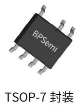
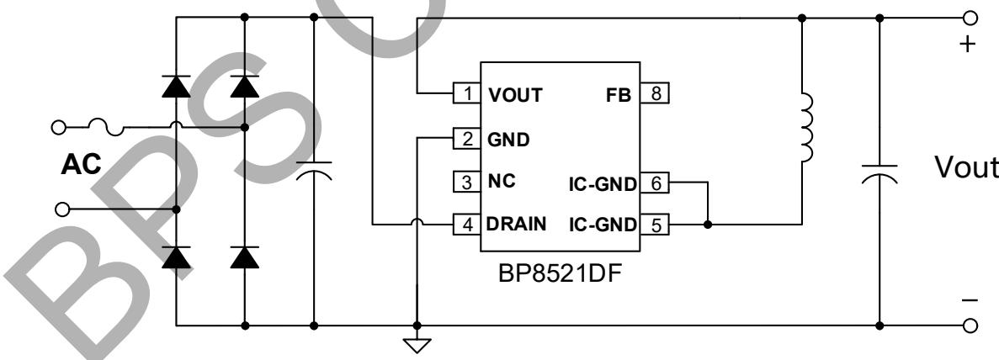
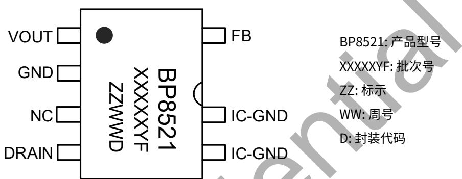
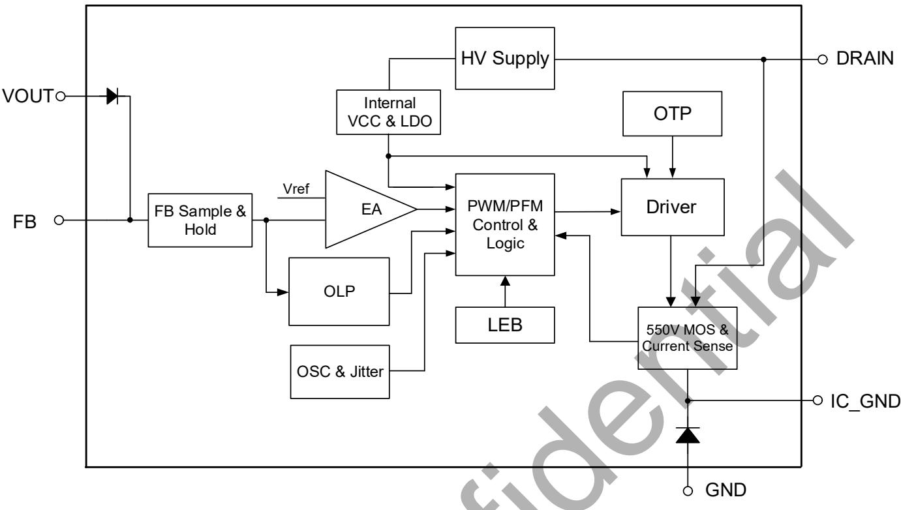
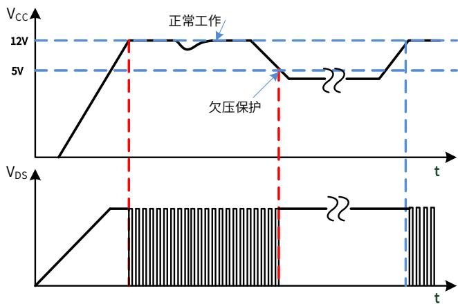
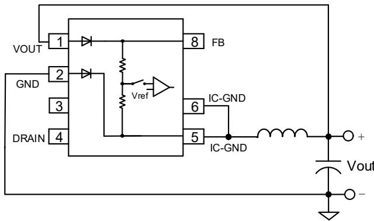
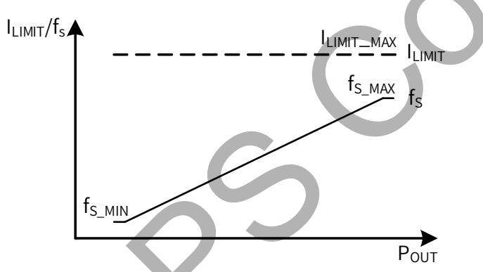
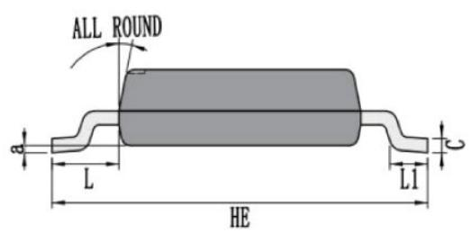
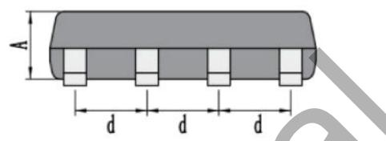
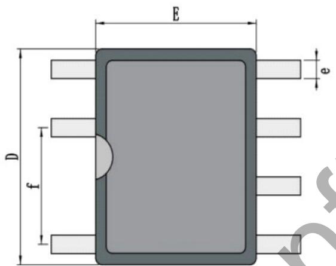

## BP8521DF 超高集成度开关电源驱动芯片

## 概述

BP8521DF 是一款高性能、高集成度、低待机功耗的开关电源驱动芯片，适用于全电压 85\~265VAC 输入的 Buck、Buck-Boost 拓扑应用。功率电感可兼容 0510 色环电感或 CD43 贴片电感。

BP8521DF 芯片内部集成 550V 高压 MOSFET、高压启动和自供电电路、电流采样电路、电压反馈电路以及续流二极管，无需外部 VCC 电容和环路补偿即可实现优异的恒压输出特性，极大地减少外围器件数量，节省系统成本和体积，同时提高可靠性。

BP8521DF 提供丰富的保护功能，使系统更加安全可靠。

BP8521DF 采用 TSOP-7 封装。

## 特点

■ 兼容 0510 色环电感或 CD43 贴片电感

■ 集成 VCC 电容、续流二极管和反馈二极管

■ 集成 550V 高压 MOSFET

■ 集成高压启动和自供电电路

■ 低待机功耗

■ 固定 5V 输出

■ 良好的动态响应和输出电压纹波表现

■ 良好的负载调整率和线性调整率

■ 改善 EMI 的频率调制技术

■ 保护功能

输出过载保护(OLP)

逐周期限流

迟滞过温保护(OTP)

## 应用领域

小家电辅助电源

电机驱动辅助电源

■ IOT/智能家居/智能照明

## 典型应用

  
图 1. BP8521DF 典型 Buck 应用电路

## 定购信息

<table><tr><td>定购型号</td><td>封装</td><td>包装形式</td><td>打印</td></tr><tr><td>BP8521DF</td><td>TSOP-7</td><td>卷盘5,000只/盘</td><td>BP8521XXXXXYFZZWWD</td></tr></table>

## 管脚封装

  
图 2. 管脚封装图

BP8521: 产品型号
XXXXXYF: 批次号
ZZ: 标示
WW: 周号
D: 封装代码

## 管脚描述

<table><tr><td>管脚号</td><td>管脚名称</td><td>描述</td></tr><tr><td>1</td><td>VOUT</td><td>输出电压端,内置反馈二极管阳极</td></tr><tr><td>2</td><td>GND</td><td>输出电压参考地,内置续流二极管阳极</td></tr><tr><td>3</td><td>NC</td><td>无连接</td></tr><tr><td>4</td><td>DRAIN</td><td>内置 MOSFET 漏极,此引脚也向芯片内部提供自供电电流</td></tr><tr><td>5、6</td><td>IC-GND</td><td>芯片地,内置 MOSFET 源极,内置续流二极管阴极</td></tr><tr><td>8</td><td>FB</td><td>反馈电压采样端,内置反馈二极管阴极,外部无需连接</td></tr></table>

## 输出规格表(注1)

<table><tr><td rowspan="2">型号</td><td colspan="2">输出规格</td></tr><tr><td>输出电压(V)</td><td>最大连续输出电流(mA)</td></tr><tr><td>BP8521DF</td><td>5</td><td>50</td></tr></table>

注1：表中的推荐最大输出电流是在充分散热的条件下，外围参数设计合理，非隔离Buck或者Buck-Boost电路应用。

极限参数(注2)（无特别说明情况下， $T_{A}=25^{\circ}C$ ）

<table><tr><td>符号</td><td>参数</td><td>参数范围</td><td>单位</td></tr><tr><td> $V_{DRAIN}$ </td><td>内部高压 MOSFET 漏极到源极电压</td><td>-0.3~550</td><td>V</td></tr><tr><td> $V_{FB}$ </td><td>FB 引脚电压(以 IC-GND 引脚为参考)</td><td>-0.3~30</td><td>V</td></tr><tr><td> $V_{GND}$ </td><td>GND 到 IC-GND 引脚电压</td><td>-600~0.3</td><td>V</td></tr><tr><td> $V_{OUT}$ </td><td>VOUT 引脚电压(以 IC-GND 引脚为参考)</td><td>-600~30</td><td>V</td></tr><tr><td> $P_{DMAX}$ </td><td>功耗(注 3)</td><td>0.86</td><td>W</td></tr><tr><td> $\theta_{JA}$ </td><td>结到环境的热阻(注 4)</td><td>145</td><td>°C/W</td></tr><tr><td> $T_J$ </td><td>工作结温范围</td><td>-40 to 150</td><td>°C</td></tr><tr><td> $T_{STG}$ </td><td>储存温度范围</td><td>-55 to 150</td><td>°C</td></tr><tr><td>ESD</td><td>人体模型 ESD(注 5)</td><td>2</td><td>kV</td></tr></table>

注 2：极限参数是指超出该工作范围，芯片有可能损坏。除非特殊说明，电压值均参考 IC-GND。电气参数定义了器件在工作范围内并且在保证特定性能指标的测试条件下的直流和交流电参数规范。对于未给定上下限值的参数，该规范不予保证其精度，但其典型值合理反映了器件性能。  
注3：温度升高最大功耗一定会减小，这也是由 $T_{\mathrm{JMAX}}$ ， $\theta_{\mathrm{JA}}$ 和环境温度 $T_{\mathrm{A}}$ 所决定的。最大允许功耗为 $P_{\mathrm{DMAX}} = (T_{\mathrm{JMAX}} - T_{\mathrm{A}}) / \theta_{\mathrm{JA}}$ 或是极限范围给出的数字中比较低的那个值。

注4：1平方英寸双层PCB板，按照JEDEC标准测试。

注5：按照JEDEC标准测试，100pF电容通过 $1.5\mathrm{k}\Omega$ 电阻放电。

电气参数(注6)（无特别说明情况下， $T_{A}=25^{\circ}C$ ）

<table><tr><td>符号</td><td>描述</td><td>条件</td><td>最小值</td><td>典型值</td><td>最大值</td><td>单位</td></tr><tr><td colspan="7">电源电压</td></tr><tr><td> $V_{DRAIN_ON}$ </td><td> $V_{DRAIN}$ 开启电压</td><td>Rising</td><td>13</td><td>16</td><td>19</td><td>V</td></tr><tr><td> $I_Q$ </td><td> $V_{DRAIN}$ 静态电流</td><td> $V_{DRAIN}=11V$ </td><td>40</td><td>80</td><td>110</td><td>μA</td></tr><tr><td colspan="7">采样电压</td></tr><tr><td> $V_{FB}$ </td><td> $V_{FB}$ 引脚调制电压</td><td></td><td>5.23</td><td>5.33</td><td>5.43</td><td>V</td></tr><tr><td> $V_{FB\_OLP}$ </td><td> $V_{FB}$ 引脚过载保护电压</td><td></td><td></td><td>2.6</td><td></td><td>V</td></tr><tr><td> $t_{OLP}$ </td><td>输出过载屏蔽时间</td><td></td><td></td><td>2048</td><td></td><td>cycles</td></tr><tr><td> $t_{AR\_OFF}$ </td><td>自动重启间隔时间</td><td></td><td></td><td>400</td><td></td><td>ms</td></tr><tr><td colspan="7">振荡器</td></tr><tr><td> $f_{S\_MAX}$ </td><td>最大开关频率</td><td></td><td>70</td><td>77</td><td>84</td><td>kHz</td></tr><tr><td> $f_{S\_MIN}$ </td><td>最小开关频率</td><td></td><td>1.5</td><td>2.5</td><td>3.5</td><td>kHz</td></tr><tr><td> $t_{ON\_MAX}$ </td><td>最大开通时间</td><td></td><td>1.8</td><td></td><td></td><td>μs</td></tr><tr><td colspan="7">电流采样</td></tr><tr><td> $I_{LIMIT\_MAX}$ </td><td>最大电流限值(注7)</td><td></td><td>93</td><td>110</td><td>120</td><td>mA</td></tr><tr><td> $t_{LEB}$ </td><td>前沿消隐时间</td><td></td><td></td><td>215</td><td>350</td><td>ns</td></tr><tr><td colspan="7">功率管</td></tr><tr><td> $R_{DS\_ON}$ </td><td>功率管导通阻抗</td><td> $I_{DS}=100mA$ </td><td></td><td>24</td><td>35</td><td>Ω</td></tr><tr><td> $I_{DSS}$ </td><td>功率管关断漏电流</td><td> $V_{DS}=550V$ </td><td></td><td>10</td><td></td><td>μA</td></tr><tr><td> $BV_{DSS}$ </td><td>功率管击穿电压</td><td> $V_{GS}=0V, I_{DS}=500μA$ </td><td>550</td><td></td><td></td><td>V</td></tr><tr><td colspan="7">续流二极管</td></tr><tr><td> $V_{RRM1}$ </td><td>二极管反向击穿电压</td><td> $I_R=5μA$ </td><td>600</td><td></td><td></td><td>V</td></tr><tr><td> $V_{F1}$ </td><td>二极管正向导通压降</td><td> $I_F=110mA$ </td><td>0.8</td><td>1.0</td><td>1.6</td><td>V</td></tr><tr><td colspan="7">反馈二极管</td></tr><tr><td> $V_{RRM2}$ </td><td>二极管反向击穿电压</td><td> $I_R=5μA$ </td><td>600</td><td></td><td></td><td>V</td></tr><tr><td> $V_{F2}$ </td><td>二极管正向导通压降</td><td> $I_F=2mA$ </td><td>0.5</td><td>0.55</td><td>0.65</td><td>V</td></tr><tr><td colspan="7">过热保护</td></tr><tr><td> $T_{OTP}$ </td><td>过温保护阈值</td><td></td><td></td><td>150</td><td></td><td>°C</td></tr><tr><td> $T_{HYST}$ </td><td>过温保护迟滞</td><td></td><td></td><td>40</td><td></td><td>°C</td></tr></table>

注6：电气参数定义了器件在工作范围内并且在保证特定性能指标的测试条件下的直流和交流电参数规范。最小值和最大值由测试保证，典型值由设计、测试或统计分析保证。对于未给定上下限值的参数，该规范不予保证其精度，但其典型值合理反映了器件性能。除非特殊说明，电压值均参考IC-GND。

注7：电气参数 $I_{LIMIT\_MAX}$ 是FT用DC方式测试，无关断延时。实际系统由于关断延时， $I_{LIMIT\_MAX}$ 会比设计值高一点，高压更明显。此偏差受到输入电压和电感量影响。

# BPS Confidential

## 内部结构框图

  
图 3. BP8521DF 内部框图

## 功能描述

BP8521DF 是一款高压输入具有恒压输出特性的驱动芯片，无需外部补偿电路。芯片无需外部 VCC 电容，内部集成 550V 功率开关、续流二极管、高压自供电电路、电流采样电路、电压反馈电路，以及丰富的保护功能，只需要少量的外围器件就可以实现恒压输出。此外，BP8521DF 具有较低的待机功耗、良好的输出电压调整率和较低的输出电压纹波。同时，BP8521DF 的输出电感可以兼容色环电感或贴片电感，降低了系统的成本和体积。（注 8：以下描述到的参数均为电气参数列表中的典型值，除非特别说明是最大或最小值）

## 高压启动供电

BP8521DF 集成了高压启动与自供电电路，无需外部 VCC 电容。系统上电后，母线电压上升，内部高压启动电路通过 DRAIN 端对内置 VCC 电容充电。当内置 VCC 电容电压达到芯片启动阈值 12V 时，芯片内部控制电路开始工作。当内置 VCC 电容电压降低到欠压保护阈值 5V 时，芯片关断内部 MOSFET。芯片正常工作时，在 MOSFET 关断期间自供电电路通过 DRAIN 端对内置 VCC 电容供电。

  
图 4. 高压启动与 VCC 欠压保护时序

## 软启动

BP8521DF 具有软启动功能，在软启动过程中，MOSFET 峰值电流（限流点）保持不变，开关频率随着输出电压的升高而逐渐升高。

## 输出电压采样

BP8521DF 通过 VOUT 引脚采样输出电压，经过内置反馈二极管到达 FB 引脚，FB 电压经内部电阻分压后与内部基准电压进行运算实现恒压控制。输出电压采样仅在续流状态 3μs 时进行，电感设计时建议保证续流时间大于 7μs，以防止无法正确采样输出电压导致工作异常。

  
图 5. 输出电压采样示意图

## 多模式控制

BP8521DF 采用频率自适应控制技术，如图 6 所示。

  
图6. 控制模式

## 电流检测

BP8521DF 内部集成电流采样电路，对 MOSFET 电流逐周期限制，无需外置电流采样电阻。当一个开关周期开始时，控制电路开通 MOSFET，漏极电流上升，当电流上升达到内部限制值时，控制电路关断 MOSFET，直到下一个开关周期开始。内置前沿消隐(Leading Edge Blanking)时间， $t_{LEB}$ 可以避免由于外部电路的容性或二极管的反向恢复导致 MOSFET 在开通瞬间出现的电流尖峰误触发 MOSFET 关断。

## 自动重启

当外部故障（输出短路、过载）触发相应的保护，控制电路关断 MOSFET，系统停止工作。BP8521DF 内部的自动重启电路计时 $t_{AR\_OFF}$ (400ms) 后重新启动系统，如果启动后故障没有消除，则重新触发相应的保护。

## 过载保护（OLP）

BP8521DF 内部控制电路通过 FB 引脚检测输出过载或短路故障。如果芯片检测到 FB 电压低于 $V_{FB\_OLP}(2.6V)$ 且持续 2048 个开关周期，则触发过载保护(OLP)并进入自动重启程序。将 FB 引脚短路到 IC-GND 或 VOUT 引脚悬空也可以触发该保护。

## 过温保护（OTP）

BP8521DF 内置了过温保护电路。当结温达到过温保护阈值 $T_{OTP}(150^{\circ}\mathrm{C})$ 时，芯片会停止工作，MOSFET 关断，直到结温下降到 $T_{OTP}-T_{HYST}$ 时，芯片重新启动。 $T_{HYST}(40^{\circ}\mathrm{C})$ 为温度迟滞，较大的温度迟滞有利于把系统整体温度控制在较低水平。

## 应用指南

## 输出电感的选择

根据系统所需的电流输出能力，BP8521DF 的输出电感可以选用 1mH 或 1.5mH。考虑系统成本和体积，可以根据实际需求选用 0510 色环电感或 CD43 贴片电感。选型时请注意电感的最大饱和电流等参数，以避免电感持续工作在严重饱和状态。此外，所选择的电感需要保证芯片工作在最低限流点时的续流时间大于 7μs，以保证芯片可以正常反馈采样，即

$$
L \geq \frac {V _ {O U T} * 7 \mu s}{I _ {L I M I T \_ M I N}}
$$

## 输入电容的选择

输入滤波电容对工频电压纹波、传导 EMI、以及电源抵抗 Surge 的能力都起到关键的作用。电容量的选择要保证直流母线电压不能过低(通常不要低于 70V)，因此电容量取决于输出功率和电源效率。全电压 85\~265VAC 输入时，如果使用全波整流，一般取≥3μF/W；对于半波整流，电容量一般取≥6μF/W。单高压 176\~265VAC 输入时，在满足 EMI 和 Surge 的前提下容量可以减半。

## 输出电容的选择

输出电容的作用是滤除电感电流中的交流成分，提供稳定的直流电压给负载，一般根据输出电压纹波要求来选取合适的电容。当输出电流恒定时，输出纹波主要由输出电容的 ESR 以及容量决定。

$$
\Delta V _ {O U T} = \Delta V _ {E S R} + \Delta V _ {C}
$$

CCM 模式下，由容性产生的纹波电压为：

$$
\Delta V _ {C} = \frac {\Delta I _ {L}}{8 * C _ {O U T} * f _ {S}}
$$

DCM 模式下，由容性产生的纹波电压为：

$$
\Delta V _ {C} = \frac {I _ {O U T} * (I _ {L I M I T \_ M A X} - I _ {O U T}) ^ {2}}{C _ {O U T} * f _ {S} * I _ {L I M I T \_ M A X} ^ {2}}
$$

实际应用中，为了得到较小的 ESR，电容量相对比较大，由容量产生的输出电压纹波很小，几乎可以忽略，因此电压纹波主要由电容的 ESR 产生：

$$
\Delta V _ {E S R} = \Delta I _ {L} * E S R (\mathsf {C C M})
$$

$$
\Delta V _ {E S R} = I _ {L I M I T \_ M A X} * E S R (\mathrm{DCM})
$$

过大的 ESR 不仅产生较大的输出电压纹波，还可能导致电容产生损耗而发热，缩短电解电容的寿命。

BP8521DF 的输出电容值，建议选取 $100\mu F$ 。

## 假负载计算

当输出空载时，需要一个假负载为电感电流提供回路，从而稳定输出电压，电感的平均电流即为假负载的电流。

$$
I _ {A V G} = \frac {1}{2} * I _ {L} * (T _ {O N} + T _ {O F F}) * f _ {S \_ M I N}
$$

其中， $I_{L}$ 为空载时电感峰值电流：

$$
I _ {L} = \frac {V _ {I N \_ M A X}}{L} * t _ {D e l a y} + I _ {L I M I T}
$$

$I_{LIMIT}$ 为空载工作时的限流值， $f_{S\_MIN}$ 为芯片最低频率， $T_{ON}$ 、 $T_{OFF}$ 分别为空载时 MOSFET 开通和关断时间：

$$
T _ {O N} = \frac {L * I _ {L}}{V _ {I N \_ M A X}}
$$

$$
T _ {O F F} = \frac {L * I _ {L}}{V _ {O U T} + V _ {D i o d e}}
$$

$$
R _ {L} = \frac {V _ {O U T}}{I _ {A V G}}
$$

以上计算未考虑芯片自供电电流通过假负载，实际需要的假负载电流稍大。BP8521DF 的假负载电流建议 5mA 左右，即选取 1kΩ 电阻。

## PCB Layout 指南

在设计 BP8521DF 应用 PCB 时，需要遵循以下建议：

1) VOUT 和 FB 引脚应避免铺铜，且远离母线电压、母线地和输出电感，以防止反馈信号受到干扰。

2) IC-GND 引脚能很好地起到散热作用，可以在 PCB 上铺铜来降低芯片的温度，但是 IC-GND 为电压动点（相对母线地电压），在满足散热的条件下，铺铜面积应尽量小以减少噪声辐射。同时建议 IC-GND 引脚远离交流输入端，以避免耦合产生的 EMI 问题。

3) Buck 变换器中，DRAIN 引脚是芯片内部 MOSFET 的漏极，接输入电容正端，为电压静点。建议铺铜以提高芯片的散热能力。同时建议注意 DRAIN 脚与其他引脚的走线距离。

4) 为了达到较好的 EMI 表现，建议尽可能减小功率环路的面积。以 Buck 变换器为例，输入母线电容、芯片内部 MOSFET、芯片内部续流二极管形成的环路容易产生辐射噪声，因此母线电容应尽量靠近芯片漏极以缩小此环路面积。芯片内部续流二极管、输出电感、输出电容形成的环路面积也应尽量减小。

5) 输出电感容易产生电磁干扰，建议远离芯片 FB 和 VOUT 引脚，同时远离交流输入端以避免 EMI 问题。

## 封装信息

TSOP-7 封装外形尺寸  

<table><tr><td>Unit</td><td></td><td>A</td><td>C</td><td>D</td><td>E</td><td>HE</td><td>d</td><td>e</td><td>f</td><td>L</td><td>L1</td><td>a</td><td>∠</td></tr><tr><td rowspan="3">mm</td><td>max</td><td>1.20</td><td>0.25</td><td>4.90</td><td>4.00</td><td>6.00</td><td>1.32</td><td>0.45</td><td>2.59</td><td>1.15</td><td>0.80</td><td>0.20</td><td rowspan="6"> $12^{\circ}$ </td></tr><tr><td>typ</td><td>1.10</td><td>0.20</td><td>4.70</td><td>3.80</td><td>5.90</td><td>1.27</td><td>0.40</td><td>2.54</td><td>1.05</td><td>/</td><td>/</td></tr><tr><td>min</td><td>1.00</td><td>0.15</td><td>4.50</td><td>3.60</td><td>5.80</td><td>1.22</td><td>0.35</td><td>2.49</td><td>0.95</td><td>0.40</td><td>0</td></tr><tr><td rowspan="3">mil</td><td>max</td><td>47</td><td>10</td><td>193</td><td>157</td><td>236</td><td>52</td><td>18</td><td>102</td><td>45</td><td>31</td><td>8</td></tr><tr><td>typ</td><td>43</td><td>8</td><td>185</td><td>150</td><td>232</td><td>50</td><td>16</td><td>100</td><td>41</td><td>/</td><td>/</td></tr><tr><td>min</td><td>39</td><td>6</td><td>177</td><td>142</td><td>228</td><td>48</td><td>14</td><td>98</td><td>37</td><td>16</td><td>0</td></tr></table>

## 版本信息

<table><tr><td>版本</td><td>日期</td><td>记录</td></tr><tr><td>Rev.1.0</td><td>2025/07</td><td>首次发布</td></tr></table>

## 免责声明

晶丰明源尽力确保本产品规格书内容的准确和可靠，但是保留在没有通知的情况下，修改规格书内容的权利。

本产品规格书未包含任何针对晶丰明源或第三方所有的知识产权的授权。针对本产品规格书所记载的信息，晶丰明源不做任何明示或暗示的保证，包括但不限于对规格书内容的准确性、商业上的适销性、特定目的的适用性或者不侵犯晶丰明源或任何第三人知识产权做任何明示或暗示保证，晶丰明源也不就因本规格书本身及其使用有关的偶然或必然损失承担任何责任。

## 电子器件报废说明

该产品在生命周期结束后，由客户按照一般电子产品的报废流程进行处理。