## BP85221SL 超高集成度开关电源驱动芯片

## 概述

BP85221SL 是一款高性能、高集成度、低待机功耗的开关电源驱动芯片，适用于全电压85\~265VAC输入的Buck、Buck-Boost 拓扑应用。功率电感可兼容 0510 色环电感或 CD43 贴片电感。

BP85221SL 内部集成整流二极管、550V 高压 MOSFET、高压启动和自供电电路、电流采样电路、电压反馈电路以及续流二极管，无需外部 VCC 电容，减少外围器件数量，降低系统成本和体积，提高可靠性。

BP85221SL 提供丰富的保护功能，包括输出过载/短路保护、逐周期限流、过温保护等，使系统更加安全可靠。

BP85221SL 采用 SSOP-6 封装。

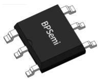  
SSOP-6 封装

## 特点

◼ 兼容 0510 色环电感或 CD43贴片电感

◼ 集成 800V 整流二极管

◼ 集成 VCC电容、续流二极管和反馈二极管

◼ 集成 550V 高压 MOSFET

◼ 集成高压启动和自供电电路

◼ 低待机功耗

◼ 固定 5V 输出

◼ 优异的动态响应

◼ 优异的负载调/线性调整率

◼ 改善 EMI 的频率调制技术

◼ 保护功能

输出过载保护(OLP)迟滞过温保护(OTP)

## 应用领域

◼ 小家电辅助电源

◼ IOT/智能家居/智能照明

◼ 替换阻容降压电路

## 典型应用

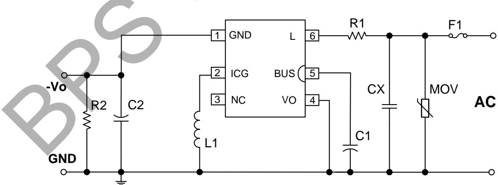  
图 1. BP85221SL 典型 Buck-Boost 应用电路

BP85221：产品型号

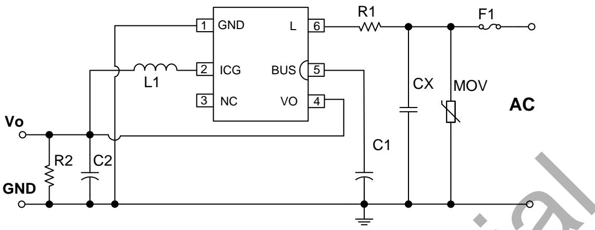  
图 2. BP85221SL 典型 Buck 应用电路

## 定购信息

<table><tr><td>定购型号</td><td>封装</td><td>包装形式</td><td>打印</td></tr><tr><td>BP85221SL</td><td>SSOP-6</td><td>卷盘5,000只/盘</td><td>BP85221XXXXYLZZWWS</td></tr></table>

## 管脚封装

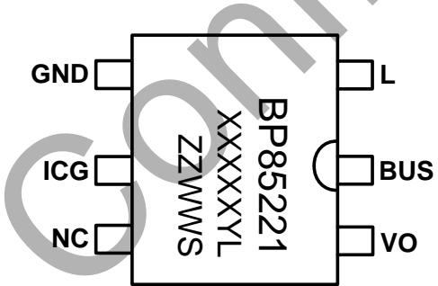  
图 3. 管脚封装图

XXXXXYL: 批次号

ZZ: 标示

WW：周号

S：封装代码

## 管脚描述

<table><tr><td>管脚号</td><td>管脚名称</td><td>描述</td></tr><tr><td>1</td><td>GND</td><td>输出地,内置续流二极管阳极</td></tr><tr><td>2</td><td>ICG</td><td>芯片地,内置 MOSFET 源极,内置续流二极管阴极</td></tr><tr><td>3</td><td>NC</td><td>无连接</td></tr><tr><td>4</td><td>VO</td><td>输出电压采样端,内置反馈二极管阳极,接输出正端</td></tr><tr><td>5</td><td>BUS</td><td>内置整流桥二极管阴极,接 BUS 电容正端</td></tr><tr><td>6</td><td>L</td><td>内置整流桥二极管阳极,接 AC 端</td></tr></table>

## 输出规格表(注 1)

<table><tr><td rowspan="2">型号</td><td colspan="2">输出规格</td></tr><tr><td>输出电压(V)</td><td>最大输出电流(mA)</td></tr><tr><td>BP85221SL</td><td>5</td><td>30</td></tr></table>

注 1：表中的推荐最大输出电流是在充分散热的条件下，外围参数设计合理，非隔离Buck或者Buck-Boost电路应用。

极限参数(注 2) （无特别说明情况下， ${ \bar { \mathsf { T } } } _ { \mathsf { A } } = 2 5 ^ { \circ } { \mathsf { C } } )$

<table><tr><td>符号</td><td>参数</td><td>参数范围</td><td>单位</td></tr><tr><td> $V_{L}$ </td><td>L到BUS电压</td><td>-1~800</td><td>V</td></tr><tr><td> $V_{DS}$ </td><td>内部高压MOSFET漏极到源极电压</td><td>-0.3~550</td><td>V</td></tr><tr><td> $V_{GND}$ </td><td>GND到ICG引脚电压</td><td>-600~0.3</td><td>V</td></tr><tr><td> $V_{O}$ </td><td>Vo引脚电压(以ICG引脚为参考)</td><td>-600~30</td><td>V</td></tr><tr><td> $P_{DMAX}$ </td><td>最大功耗(注3)</td><td>0.96</td><td>W</td></tr><tr><td> $\theta_{JA}$ </td><td>结到环境的热阻(注4)</td><td>130</td><td>°C/W</td></tr><tr><td> $T_{J}$ </td><td>工作结温范围</td><td>-40 to 150</td><td>°C</td></tr><tr><td> $T_{STG}$ </td><td>储存温度范围</td><td>-55 to 150</td><td>°C</td></tr><tr><td>ESD</td><td>人体模型ESD(注5)</td><td>2</td><td>kV</td></tr></table>

## 注 2：极限参数是指超出该工作范围，芯片有可能损坏。除非特殊说明，电压值均参考ICG。电气参数定义了器件在工作范围内并且在保证特定性能指标的测试条件下的直流和交流电参数规范。对于未给定上下限值的参数，该规范不予保证其精度，但其典型值合理反映了器件性能。

电气参数(注 6) （无特别说明情况下， ${ \bar { \mathsf { T } } } _ { \mathsf { A } } = 2 5 ^ { \circ } { \mathsf { C } } )$

<table><tr><td>符号</td><td>描述</td><td>条件</td><td>最小值</td><td>典型值</td><td>最大值</td><td>单位</td></tr><tr><td colspan="7">自供电</td></tr><tr><td> $V_{DS\_SUP}$ </td><td>最小漏极启动电压</td><td></td><td></td><td>40</td><td></td><td>V</td></tr><tr><td> $I_{CC}$ </td><td>芯片工作电流</td><td> $V_{DRAIN}=50V$ </td><td></td><td>100</td><td></td><td>μA</td></tr><tr><td> $I_Q$ </td><td>芯片静态电流</td><td> $V_{DRAIN}=11V$ </td><td></td><td>80</td><td>150</td><td>μA</td></tr><tr><td colspan="7">输出电压反馈</td></tr><tr><td> $V_O$ </td><td> $V_O$ 引脚调制电压</td><td></td><td>5.85</td><td>6.00</td><td>6.15</td><td>V</td></tr><tr><td> $V_{O\_OLP}$ </td><td> $V_O$ 引脚过载保护电压</td><td></td><td></td><td>3.3</td><td></td><td>V</td></tr><tr><td> $t_{OLP}$ </td><td>输出过载屏蔽时间</td><td></td><td></td><td>1024</td><td></td><td>cycles</td></tr><tr><td> $t_{AR\_OFF}$ </td><td>自动重启间隔时间</td><td></td><td></td><td>0.5</td><td></td><td>s</td></tr><tr><td colspan="7">振荡器</td></tr><tr><td> $f_{S\_MAX}$ </td><td>最大开关频率</td><td></td><td>70</td><td>77</td><td>84</td><td>kHz</td></tr><tr><td> $f_{S\_MIN}$ </td><td>最小开关频率</td><td></td><td>2</td><td>2.8</td><td>3.8</td><td>kHz</td></tr><tr><td> $t_{ON\_MAX}$ </td><td>最大开通时间</td><td></td><td>1.8</td><td></td><td></td><td>μs</td></tr><tr><td colspan="7">电流采样</td></tr><tr><td> $I_{LIMIT}$ </td><td>峰值电流限值(注7)</td><td></td><td>95</td><td>110</td><td>125</td><td>mA</td></tr><tr><td> $t_{LEB}$ </td><td>前沿消隐时间</td><td></td><td></td><td>200</td><td></td><td>ns</td></tr><tr><td colspan="7">功率管</td></tr><tr><td> $R_{DS\_ON}$ </td><td>功率管导通阻抗</td><td> $I_{DS}=100mA$ </td><td></td><td>25</td><td></td><td>Ω</td></tr><tr><td> $I_{DSS}$ </td><td>功率管关断漏电流</td><td> $V_{DS}=550V$ </td><td></td><td>10</td><td></td><td>μA</td></tr><tr><td> $BV_{DSS}$ </td><td>功率管的击穿电压</td><td> $V_{GS}=0V, I_{DS}=500μA$ </td><td>550</td><td></td><td></td><td>V</td></tr><tr><td colspan="7">续流二极管</td></tr><tr><td> $V_{RRM1}$ </td><td>二极管反向击穿电压</td><td> $I_R=5μA$ </td><td>600</td><td></td><td></td><td>V</td></tr><tr><td> $V_{F1}$ </td><td>二极管正向导通压降</td><td> $I_F=110mA$ </td><td></td><td>1</td><td></td><td>V</td></tr><tr><td> $I_{FAV1}$ </td><td>最大平均正向导通电流</td><td></td><td>300</td><td></td><td></td><td>mA</td></tr><tr><td> $T_{RR1}$ </td><td>反向恢复时间</td><td> $I_F=500mA, I_R=1.0A, I_{RR}=250mA$ </td><td></td><td></td><td>35</td><td>ns</td></tr><tr><td colspan="7">反馈二极管</td></tr><tr><td> $V_{RRM2}$ </td><td>二极管反向击穿电压</td><td> $I_R=5μA$ </td><td>600</td><td></td><td></td><td>V</td></tr><tr><td> $V_{F2}$ </td><td>二极管正向导通压降</td><td> $I_F=2mA$ </td><td></td><td>1</td><td></td><td>V</td></tr><tr><td> $I_{FAV2}$ </td><td>最大平均正向导通电流</td><td></td><td>300</td><td></td><td></td><td>mA</td></tr><tr><td> $T_{RR2}$ </td><td>反向恢复时间</td><td> $I_F=500mA, I_R=1.0A, I_{RR}=250mA$ </td><td></td><td></td><td>35</td><td>ns</td></tr><tr><td colspan="7">过热保护</td></tr><tr><td> $T_{OTP}$ </td><td>过温保护阈值</td><td></td><td></td><td>145</td><td></td><td>°C</td></tr><tr><td> $T_{HYST}$ </td><td>过温保护迟滞</td><td></td><td></td><td>40</td><td></td><td>°C</td></tr></table>

注 6：规格书的最小、最大规范范围由测试保证，典型值由设计、测试或统计分析保证。除非特殊说明，电压值均参考ICG。  
注 电气参数 方式测试 关断 时 实 系统由 关断 时 会比 计值高 点 高 此偏差受到输入电电感量影响。

## 内部结构框图

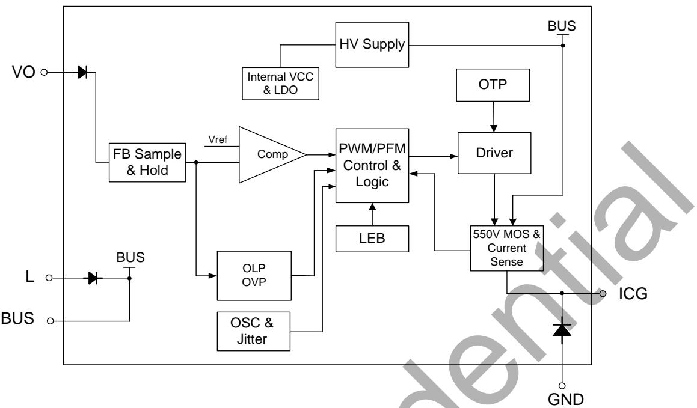  
图 4. BP85221SL 内部框图

## 功能描述

BP85221SL 内部集成整流桥二极管、550V 功率开关、续流二极管、高压自供电电路、电流采样电路、电压反馈电路，以及丰富的保护功能。BP85221SL 无需外部补偿电路和外部VCC电容，只需要少量的外围器件就可以实现恒压输出。针对性的优化设计使得 BP85221SL 的输出电感（L1）可以兼容色环电感或贴片电感，降低系统成本和体积。（注 8：以下描述到的参数均为电气参数列表中的典型值，除非特别说明是最大或最小值）

## 高压启动供电

BP85221SL 集成高压启动与自供电电路，无需外部 VCC 电容。系统上电后，母线电压上升，内部高压启动电路通过BUS 引脚对内置 VCC 电容充电。当内置 VCC 电容电压达到芯片启动阈值 11V 时，芯片内部控制电路开始工作。当内置VCC 电容电压降低到欠压保护阈值 5V 时，芯片关断内部MOSFET。芯片正常工作时，自供电电路在MOSFET关断期间通过 BUS端对内置 VCC电容供电。

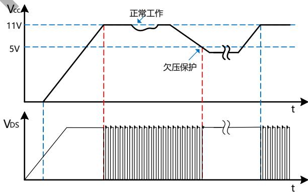  
图 5. 高压启动与 VCC 欠压保护时序

## 软启动

BP85221SL 具有软启动功能。在软启动过程中，开关频率随着输出电压逐渐升高

## 输出电压采样

BP85221SL通过VO引脚采样输出电压，经过内置反馈二极管、内部电阻分压后与基准电压运算实现恒压控制。输出电压采样仅在续流阶段 3μs 时进行，电感设计时建议保证续流时间大于 7μs，以防止无法正确采样输出电压导致工作异常。

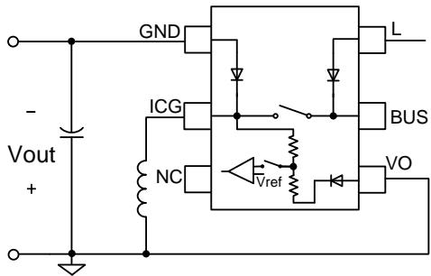  
图 6. 输出电压采样示意图

## 频率自适应控制

BP85221SL 采用频率自适应控制技术。如图 7 所示。

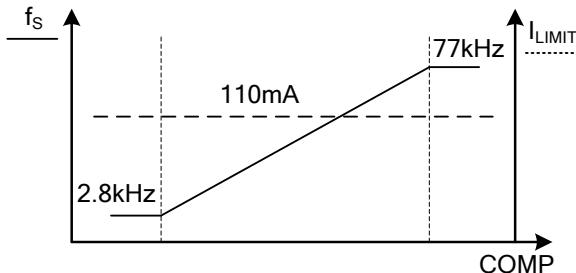  
图 7. 控制曲线

## 电流检测

BP85221SL 内部集成电流采样电路，无需外置电流采样电阻。当一个开关周期开始时，控制电路开通 MOSFET，漏极电流上升，当电流上升达到内部限制值时，控制电路关断MOSFET，直到下一个开关周期开始。内置前沿消隐(Leading Edge Blanking)时间，t 可以避免 MOSFET 开通瞬间的电流尖峰误触发 MOSFET 关断。

## 自动重启

当外部故障（输出短路、过载）触发相应的保护，控制电路关断 MOSFET，系统停止工作。BP85221SL 内部的自动重启电路计时 t (0.5s)后重新启动系统，如果启动后故障没有消除，则重新触发相应的保护。每次重启都会经历软启过程。

## 过载保护（OLP）

BP85221SL内部控制电路通过VO引脚检测输出过载故障。如果芯片检测到 VO 电压低于 $V _ { \mathsf { O _ { \mathsf { - } } O L P } }$ (3.3V)且持续 1024 个开关周期，则触发过载保护(OLP)并进入自动重启程序。输出短路也会触发过载保护（OLP）。

## 过温保护

BP85221SL 内置过温保护电路。当结温达到过温保护阈值$\mathsf { T } _ { \mathsf { O T P } } ( 1 4 5 ^ { \circ } \mathsf { C } )$ 时，芯片会停止开关，MOSFET 保持关断，直到结温下降到 $T _ { \mathsf { O T P } ^ { - } } \mathsf { T } _ { \mathsf { H Y S T } }$ 时，芯片重新启动。

## 应用指南

## 限流电阻的选择

建议在 L 端连接绕线电阻用以阻挡浪涌电流，保护内置整流二极管，同时改善EMI。可以根据实际应用的浪涌和EMI要求选取限流电阻阻值。

## 输入电容的选择

输入滤波电容对工频电压纹波、传导 EMI、以及电源抵抗Surge 的能力都起到关键的作用。电容量的选择要保证直流母线电压不能过低(通常不要低于 70V)，因此电容量取决于输出功率和电源效率。全电压85\~265VAC输入时，电容量建议取 $\mathsf { \Omega } _ { : \geq 6 \mu \mathsf { F } } / \mathsf { W } ,$ 。 单高压 176\~265VAC 输入时，电容量建$\therefore \angle C A Q \geq 3 \mu F / W .$ 。为满足EMI和Surge要求，可以结合实际应用适当调整输入电容容量。

## 输出电容的选择

输出电容的作用是滤除电感电流中的交流成分，提供稳定的直流电压给负载，一般根据输出电压纹波要求来选取合适的电容。当输出电流恒定时，输出纹波主要由输出电容的 ESR以及容量决定。

$$
\Delta V _ {O U T} = \Delta V _ {E S R} + \Delta V _ {C}
$$

CCM 模式下，由容性产生的纹波电压为：

$$
\Delta V _ {C} = \frac {\Delta I _ {L}}{8 * C _ {O U T} * f _ {S}}
$$

DCM 模式下，由容性产生的纹波电压为：

$$
\Delta V _ {C} = \frac {I _ {O U T} * (I _ {L I M I T \_ M A X} - I _ {O U T}) ^ {2}}{C _ {O U T} * f _ {S} * I _ {L I M I T \_ M A X} ^ {2}}
$$

实际应用中，为了得到较小的 ESR，电容量相对比较大，由容量产生的输出电压纹波很小，几乎可以忽略，因此电压纹波主要由电容的 ESR 产生：

$$
\Delta V _ {E S R} = \Delta I _ {L} * E S R \quad (\mathsf {C C M})
$$

$$
\Delta V _ {E S R} = I _ {L I M I T \_ M A X} * E S R \quad (\mathrm{DCM})
$$

BP85221SL 的输出电容值，建议选取 100μF。

## 输出电感

根据系统所需的电流输出能力，BP85221SL 的输出电感可以选用 1mH 或 1.5mH。考虑系统成本和体积，可以根据实际需求选用 0510 色环电感或 CD43 贴片电感。选型时请注意电感的最大饱和电流等参数，以避免电感持续工作在严重饱和状态。

## 假负载计算

当输出空载时，需要假负载为电感电流提供回路，从而稳定输出电压，电感的平均电流即为假负载的电流。

$$
I _ {A V G} = \frac {1}{2} * I _ {L} * (T _ {O N} + T _ {O F F}) * f _ {S \_ M I N}
$$

其中， $\mathsf { I } _ { \mathsf { L } }$ 为空载时电感峰值电流：

$$
I _ {L} = \frac {V _ {I N \_ M A X}}{L} * t _ {D e l a y} + I _ {L I M I T \_ M I N}
$$

ILIMIT\_MIN 为芯片的最低限流值，fS\_MIN 为芯片最低频率， ${ \mathsf { T } } _ { \mathsf { O N } } .$ ${ \sf T } _ { \sf O F F }$ 分别为空载时 MOSFET 开通和关断时间：

$$
T _ {O N} = \frac {L * I _ {L}}{V _ {I N \_ M A X}}
$$

$$
T _ {O F F} = \frac {L * I _ {L}}{V _ {O U T} + V _ {D i o d e}}
$$

$$
R _ {L} = \frac {V _ {O U T}}{I _ {A V G}}
$$

以上计算未考虑芯片自供电电流等因素，实际需要的假负载电流稍大。

BP85221SL 的假负载电流建议 5mA 左右，即选取 1KΩ 电阻。

## PCB Layout 指南

在设计 BP85221SL 的 PCB 时，建议遵循以下内容：

1. 交流电压输入端和 EMI 滤波电路建议远离电感等电压电流跳变点，以减少 EMI 噪声耦合。

2. L与BUS引脚之间为内置整流二极管，承受交流高压，请注意走线间距，保留足够的爬电距离。

3. VO 引脚为输出电压反馈端，应避免铺铜且远离母线、电感等高压跳变点，以防止反馈信号受到干扰。建议走线短而粗。

4. 可以在 ICG 引脚上适当铺铜来增强散热。

5. 为了达到较好的 EMI 表现，提高系统可靠性，建议尽可能减小功率环路的面积和走线长度。以 Buck-Boost为例：建议将母线电容放置在 BUS 引脚附近，电感放置在 ICG 附近，母线电容、内置 MOSFET、电感形成的励磁回路面积和走线长度尽量减小。电感、内置续流二极管、输出电容组成的续流回路面积和走线长度也建议尽量缩小。

封装信息

SSOP-6 封装外形尺寸

Unit: mm

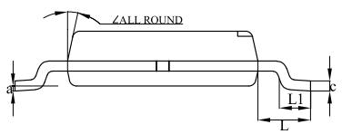

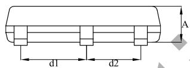

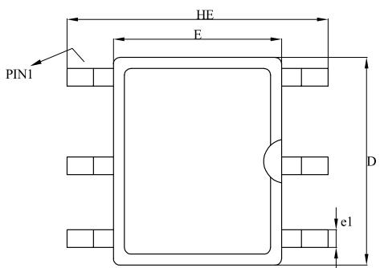

<table><tr><td>Unit</td><td></td><td>A</td><td>C</td><td>D</td><td>E</td><td>HE</td><td>d1</td><td>d2</td><td>e1</td><td>L</td><td>L1</td><td>a</td><td>∠</td></tr><tr><td rowspan="3">mm</td><td>max</td><td>1.20</td><td>0.25</td><td>4.90</td><td>4.00</td><td>6.00</td><td>2.05</td><td>1.70</td><td>0.45</td><td>1.15</td><td>0.63</td><td rowspan="3">0.2 (ref)</td><td rowspan="6"> $12^{\circ}$ </td></tr><tr><td>typ</td><td>1.10</td><td>0.20</td><td>4.70</td><td>3.80</td><td>5.90</td><td>2.00</td><td>1.65</td><td>0.40</td><td>1.05</td><td>/</td></tr><tr><td>min</td><td>1.00</td><td>0.15</td><td>4.50</td><td>3.60</td><td>5.80</td><td>1.95</td><td>1.60</td><td>0.35</td><td>0.95</td><td>0.23</td></tr><tr><td rowspan="3">mil</td><td>max</td><td>47</td><td>10</td><td>193</td><td>157</td><td>236</td><td>81</td><td>67</td><td>18</td><td>45</td><td>25</td><td rowspan="3">8 (ref)</td></tr><tr><td>typ</td><td>43</td><td>8</td><td>185</td><td>150</td><td>232</td><td>79</td><td>65</td><td>16</td><td>41</td><td>/</td></tr><tr><td>min</td><td>39</td><td>6</td><td>177</td><td>142</td><td>228</td><td>77</td><td>63</td><td>14</td><td>37</td><td>9</td></tr></table>

## 版本信息

<table><tr><td>版本</td><td>日期</td><td>记录</td></tr><tr><td>Rev.1.0</td><td>2024/05</td><td>首次发布</td></tr></table>

## 免责声明

晶丰明源尽力确保本产品规格书内容的准确和可靠，但是保留在没有通知的情况下，修改规格书内容的权利。

本产品规格书未包含任何针对晶丰明源或第三方所有的知识产权的授权。针对本产品规格书所记载的信息，晶丰明源不做任何明示或暗示的保证，包括但不限于对规格书内容的准确性、商业上的适销性、特定目的的适用性或者不侵犯晶丰明源或任何第三人知识产权做任何明示或暗示保证，晶丰明源也不就因本规格书本身及其使用有关的偶然或必然损失承担任何责任