## BP86213D 低功耗 PSR 隔离 CC/CV 控制芯片

## 概述

BP86213D 是一款高集成度的低功耗 PSR 隔离 CC/CV 控制芯片。芯片工作在电感电流断续导通模式，适用于 85Vac\~265Vac 全范围输入电压的隔离反激电源。

BP86213D 芯片采用电压电流控制技术, 不需要环路补偿电容, 即可实现优异的恒压恒流特性, 极大的节约了系统成本和体积。

BP86213D 芯片集成 650VMOSFET、高压启动和供电电路。采用 PWM/PFM 多模式控制技术，从辅助绕组给 VCC 供电，能有效降低系统待机功耗，提高效率和动态性能，并减小系统工作在轻载时的噪声。

BP86213D 具有多重保护功能，包括输出开路/短路保护，芯片供电欠压/过压保护，CS 开路/短路保护，输入欠压保护、逐周期限流，过温保护等。

BP86213D 芯片采用 SOP-8 封装，增大了高压 DRAIN PIN 到其他脚位的爬电距离，使得芯片能够应用于较复杂的工作环境。

## 特点

■ 低待机功耗<75mW

■ 集成高压启动和供电电路

■ PWM/PFM、准谐振多模式控制

■ ±3%输出电压精度

■ ±5%输出电流精度

内置软启动

线电压补偿

■ 保护功能

输入欠压保护(Brown-in/out)

CS 开路/短路保护

输出短路保护(SCP)

输出过压保护(Output OVP)

反馈开路保护

逐周期限流(Cycle-by-Cycle)

迟滞过温保护(OTP)

  
SOP-8 封装

## 应用领域

■ 家用电器辅助电源

■ PC 待机电源

■ 通信、工业控制辅助电源

■ 适配器、充电器

## 典型应用

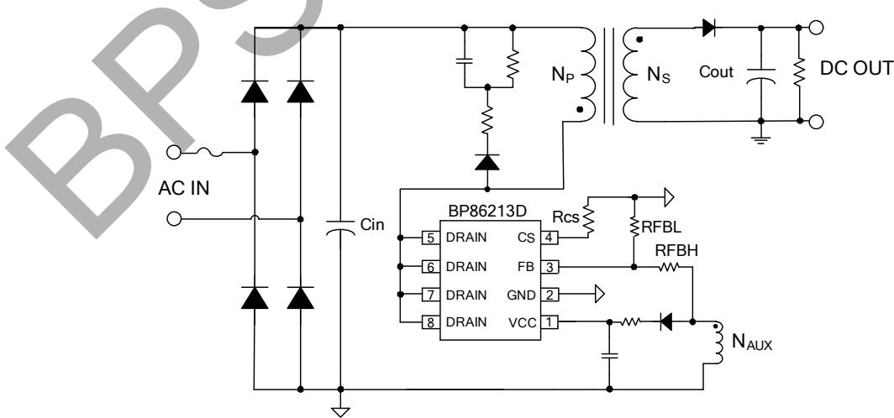  
图 1. BP86213D 典型反激应用电路

## 定购信息

<table><tr><td>定购型号</td><td>封装</td><td>包装形式</td><td>打印</td></tr><tr><td>BP86213D</td><td>SOP-8</td><td>编带4000 颗/盘</td><td>BP86213XXXXYYZZZZWWD</td></tr></table>

## 管脚封装

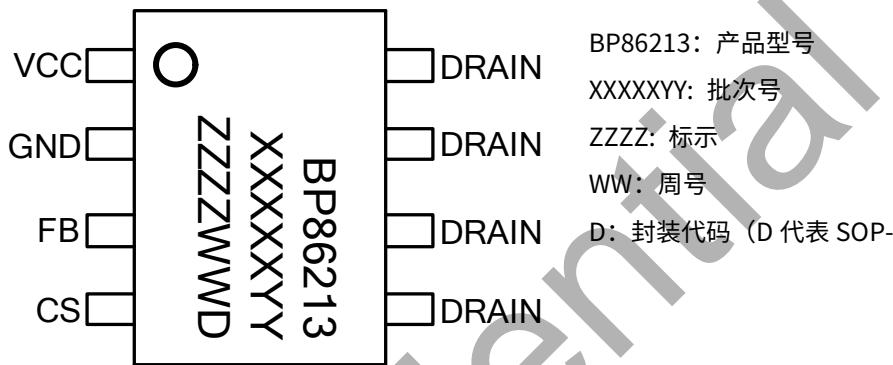  
图 2. SOP-8 管脚封装图

## 管脚描述

<table><tr><td>管脚号</td><td>管脚名称</td><td>描述</td></tr><tr><td>1</td><td>VCC</td><td>芯片电源端,连接一个0.1μF~1μF的陶瓷电容到芯片地做旁路电容</td></tr><tr><td>2</td><td>GND</td><td>芯片参考地</td></tr><tr><td>3</td><td>FB</td><td>输出反馈控制端,同时集成输入欠压保护、输出欠/过压保护</td></tr><tr><td>4</td><td>CS</td><td>电流采样端</td></tr><tr><td>5,6,7,8</td><td>DRAIN</td><td>芯片内部高压MOSFET漏极,此引脚也向芯片内部提供自供电电流</td></tr></table>

## 输出功率推荐表

<table><tr><td colspan="3">典型输出功率</td></tr><tr><td rowspan="2">型号</td><td colspan="2">开放式(注1)</td></tr><tr><td>230VAC ±15%</td><td>85~265VAC</td></tr><tr><td>BP86213D</td><td>15W</td><td>12W</td></tr></table>

注1：连续输出功率，测试条件为开放式环境，环境温度为 $45^{\circ} \mathrm{C}$ 。

极限参数(注 2) （无特别说明情况下， $T_{A}=25^{\circ}C$ ）

<table><tr><td>符号</td><td>参数</td><td>参数范围</td><td>单位</td></tr><tr><td> $V_{DS}$ </td><td>内部 MOSFET 漏极到源极电压</td><td>-0.3~650</td><td>V</td></tr><tr><td> $V_{CC}$ </td><td>VCC 电压</td><td>-0.3~33</td><td>V</td></tr><tr><td> $I_{CC\_MAX}$ </td><td>VCC 引脚最大电源电流</td><td>30</td><td>mA</td></tr><tr><td> $I_{DS}$ </td><td>最大漏极电流 ( $T_j=120°C$ )</td><td>1.5</td><td>A</td></tr><tr><td> $I_{DS-pulse}$ </td><td>最大脉冲漏极电流 ( $T_{pulse}=300ns$ )</td><td>3</td><td>A</td></tr><tr><td> $V_{FB}$ </td><td>反馈端输入电压</td><td>-0.3~6</td><td>V</td></tr><tr><td> $V_{CS}$ </td><td>电流采样端电压</td><td>-0.3~6</td><td>V</td></tr><tr><td> $P_{DMAX}$ </td><td>功耗(注 3)</td><td>0.86</td><td>W</td></tr><tr><td> $θ_{JA}$ </td><td>PN 结到环境的热阻</td><td>145</td><td>°C/W</td></tr><tr><td> $T_J$ </td><td>工作结温范围</td><td>-40 to 150</td><td>°C</td></tr><tr><td> $T_{STG}$ </td><td>储存温度范围</td><td>-55 to 150</td><td>°C</td></tr><tr><td>ESD</td><td>人体模型 HBM(注 4)</td><td>±2.5</td><td>kV</td></tr></table>

注 2: 极限参数是指超出该工作范围，芯片有可能损坏。电气参数定义了器件在工作范围内并且在保证特定性能指标的测试条件下的直流和交流电参数规范。对于未给定上下限值的参数，该规范不予保证其精度，但其典型值合理反映了器件性能。  
注3：温度升高最大功耗一定会减小，这也是由 $T_{JMAX}, \theta_{JA}$ 和环境温度 $T_A$ 所决定的。最大允许功耗为 $P_{DMAX} = (T_{JMAX} - T_A) / \theta_{JA}$ 或是极限范围给出的数字中比较低的那个值。  
注4：按照JEDEC标准测试，100pF电容通过 $1.5\mathrm{K}\Omega$ 电阻放电。

电气参数(注 5)（无特别说明情况下， $V_{CC}=15V, T_{A}=25^{\circ}C$ ）

<table><tr><td>符号</td><td>描述</td><td>条件</td><td>最小值</td><td>典型值</td><td>最大值</td><td>单位</td></tr><tr><td colspan="7">启动供电</td></tr><tr><td> $V_{SUP}$ </td><td>最小启动电压</td><td></td><td></td><td>30</td><td></td><td>V</td></tr><tr><td colspan="7">VCC 供电</td></tr><tr><td> $V_{CC\_OVP}$ </td><td>VCC 过压保护阈值</td><td>5mA</td><td></td><td>30</td><td></td><td>V</td></tr><tr><td> $V_{CC\_ON}$ </td><td>VCC 启动电压</td><td> $V_{CC}$ 上升</td><td>10.8</td><td>12</td><td>12.6</td><td>V</td></tr><tr><td> $V_{CC\_UVLO}$ </td><td>VCC欠压保护阈值</td><td> $V_{CC}$ 下降</td><td>7.2</td><td>7.6</td><td>8.4</td><td>V</td></tr><tr><td> $I_{CH}$ </td><td>VCC 启动电流</td><td> $V_{CC}=0V$ </td><td>1.2</td><td>2.5</td><td>5.8</td><td>mA</td></tr><tr><td> $I_{OP1}$ </td><td>VCC 工作电流</td><td> $V_{FB}=2V,V_{CS}=1V$ </td><td>0.7</td><td>0.9</td><td>1.1</td><td>mA</td></tr><tr><td> $I_{OP2}$ </td><td>保护状态时 VCC 电流</td><td>after fault</td><td>0.6</td><td>0.8</td><td>1.0</td><td>mA</td></tr><tr><td colspan="7">CS 电流采样</td></tr><tr><td> $V_{CS\_REF}$ </td><td>恒流时 CS 基准电压</td><td></td><td>580</td><td>600</td><td>610</td><td>mV</td></tr><tr><td> $V_{CS\_MIN}$ </td><td>最小 CS 检测阈值电压</td><td></td><td></td><td>200</td><td></td><td>mV</td></tr><tr><td> $T_{LEB}$ </td><td>前沿消隐时间</td><td></td><td></td><td>300</td><td></td><td>ns</td></tr><tr><td colspan="7">FB 反馈</td></tr><tr><td> $V_{FB\_REF}$ </td><td>内部电压检测基准</td><td></td><td>1.98</td><td>2.02</td><td>2.06</td><td>V</td></tr><tr><td> $V_{FB\_OVP}$ </td><td>FB 过压保护阈值(注 6)</td><td></td><td>2.16</td><td>2.4</td><td>2.64</td><td>V</td></tr><tr><td> $V_{FB\_DEM}$ </td><td>FB 过零检测阈值</td><td></td><td></td><td>0.1</td><td></td><td>V</td></tr><tr><td> $V_{FB\_SHORT}$ </td><td>输出短路阈值</td><td></td><td></td><td>1.2</td><td></td><td>V</td></tr><tr><td> $F_{OSC\_SHORT}$ </td><td>输出短路钳位频率</td><td></td><td></td><td>10</td><td></td><td>kHz</td></tr><tr><td> $F_{MIN}$ </td><td>空载最低工作频率</td><td></td><td></td><td>455</td><td></td><td>Hz</td></tr><tr><td> $T_{SAMPLE\_BIG}$ </td><td>满载采样时间</td><td> $V_{CS}=600mV$ </td><td></td><td>5.12</td><td></td><td>μs</td></tr><tr><td> $T_{SAMPLE\_SMALL}$ </td><td>空载采样时间</td><td> $V_{CS}=200mV$ </td><td></td><td>2</td><td></td><td>μs</td></tr><tr><td> $T_{OFF\_MAX}$ </td><td>最大关断时间</td><td></td><td></td><td>1.54</td><td></td><td>ms</td></tr><tr><td> $T_{ON\_MAX}$ </td><td>最大开通时间</td><td></td><td>18</td><td>22</td><td>30</td><td>μs</td></tr><tr><td> $I_{FB\_VAC\_UVON}$ </td><td>输入欠压导通阈值</td><td></td><td></td><td>-475</td><td></td><td>μA</td></tr><tr><td> $I_{FB\_VAC\_UVOFF}$ </td><td>输入欠压关断阈值</td><td></td><td></td><td>-200</td><td></td><td>μA</td></tr><tr><td colspan="7">功率管</td></tr><tr><td> $R_{DS\_ON}$ </td><td>功率管导通阻抗</td><td> $V_{GS}=10V/IDS=1A$ </td><td></td><td>3.8</td><td>5.7</td><td>Ω</td></tr><tr><td> $BV_{DSS}$ </td><td>功率管击穿电压</td><td> $V_{GS}=0V/IDS=250μA$ </td><td>650</td><td></td><td></td><td>V</td></tr><tr><td> $I_{DSS}$ </td><td>功率管漏电流</td><td> $V_{GS}=0V/V_{DS}=650V$ </td><td></td><td></td><td>20</td><td>μA</td></tr><tr><td colspan="7">过温保护</td></tr><tr><td> $T_{OTP}$ </td><td>过温保护阈值</td><td></td><td></td><td>145</td><td></td><td>°C</td></tr><tr><td> $T_{HYST}$ </td><td>过温保护迟滞</td><td></td><td></td><td>40</td><td></td><td>°C</td></tr></table>

注5：规格书的最小、最大规范范围由测试保证，典型值由设计、测试或统计分析保证。除非特殊说明，电压值均参考GND。  
注6：设计保证。

## 内部结构框图

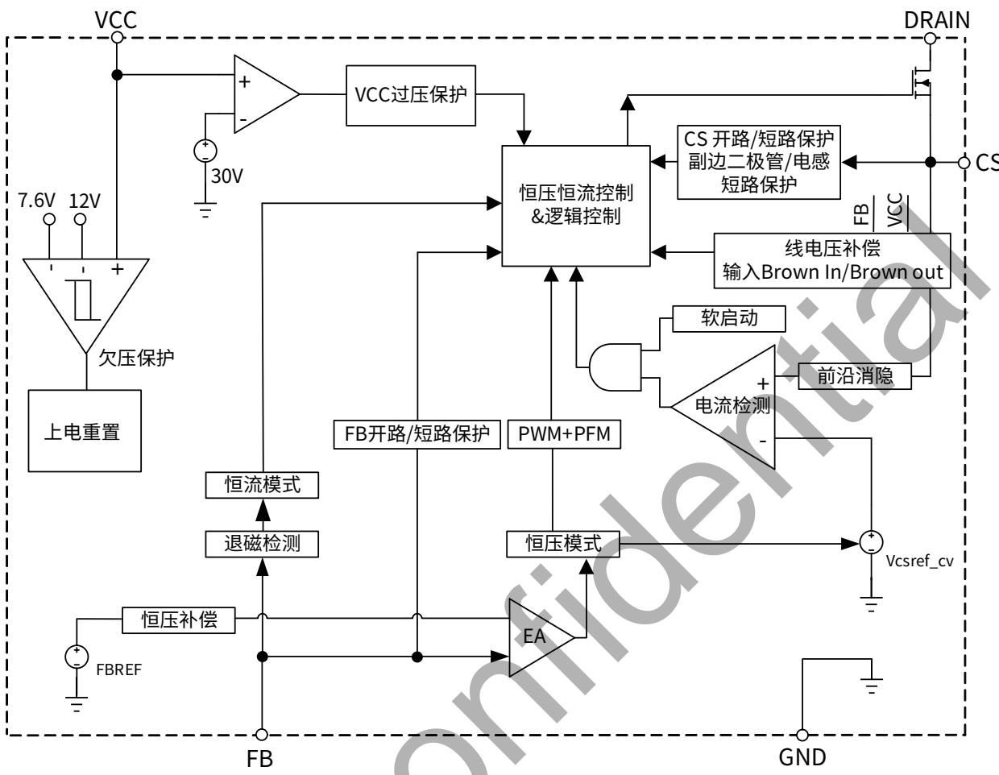

## 功能描述

BP86213D 是一款 PSR 隔离 CC/CV 输出特性的控制芯片。系统工作于电感电流断续模式，采用 PWM/PFM 多模式准谐振控制，只需要极少的外围组件就可以达到优异的恒压恒流特性。特别适合于家用电器辅助电源，电机驱动电源，适配器以及有恒压恒流需求的 LED 驱动器等。

## 启动与 VCC 供电

系统上电后，当母线电压达到芯片最小启动电压 $V_{\mathrm{SUP}}(30\mathrm{V})$ 时，内部启动电路通过 DRAIN PIN 对 VCC 电容充电。当 VCC 电压达到芯片开启阈值 $V_{\mathrm{CC\_ON}}(12\mathrm{V})$ 时，芯片检测流出 FB 的电流与输入电压欠压保护阈值 $I_{FB\_VAC\_UVON}(-475\mu\mathrm{A})$ 进行比较。如果大于 $I_{FB\_VAC\_UVON}$ 则说明母线电压较低，进入欠压保护重启状态；如果小于 $I_{FB\_VAC\_UVON}$ 说明母线电压已升高到设定值以上，芯片内部控制电路开始工作。输出电压建立后，关闭高压 JFET 供电，使用辅助绕组给 VCC 供电，可以实现低的空载功耗。

## 软启动

芯片具有软启动功能，启动过程中，原边开关频率从 10kHz 逐渐增加，避免了进入 CCM 造成电流积累而导致 MOSFET 应力的增加，同时峰值电流保持为最大值以减小启动时间。每一次重启都会经历软启动的过程。

## 恒流控制，输出电流设置

芯片逐周期检测电感的峰值电流，CS 端连接到内部的峰值电流比较器的输入端，与内部阈值电压进行比较，当 CS 外部电压达到内部检测阈值时，功率管 MOSFET 关断。当处于 CC 状态时， $T_{d}/T=1/2$ 。

输出电流的表达式为：

$$
I _ {O U T} = \frac {1}{2} * \frac {N _ {P}}{N _ {S}} * \frac {V _ {C S \_ R E F}}{R _ {C S}} * \frac {T _ {d}}{T}
$$

其中，

Np 变压器主级的匝数，
Ns 是变压器次级的匝数，
Iout 是恒流输出， $V_{CS\_REF}$ 是恒流时 CS 基准电压，
Rcs 是电流检测电阻。

## 恒压控制，输出电压设置

BP86213D 通过采样电感两端压降，分压后与内部基准比较形成闭环后，来恒定输出电压 Vout。

$$
V _ {O U T} = \frac {V _ {F B \_ R E F} * (R _ {F B L} + R _ {F B H})}{R _ {F B L}} * \frac {N _ {S}}{N _ {a u x}} - V _ {f}
$$

其中，

$V_{f}$ 是续流二极管压降，

$R_{FBL}$ 是 FB 下拉电阻，

$R_{FBH}$ 是 FB 上拉电阻，

Naux 是变压器辅助绕组的匝数。

## PWM/PFM 多模式控制

BP86213D 芯片采用 PWM/PFM 多模式控制技术，能有效降低系统待机功耗，提高效率，并减小系统工作在轻载时的噪声。PWM/PFM 多模式控制如图 4 所示。

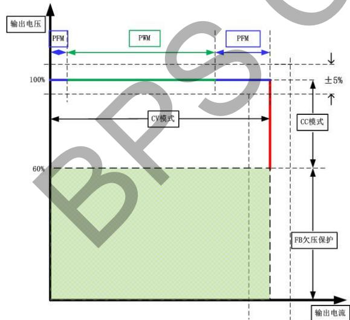  
图 4. PWM/PFM 多模式控制

PWM/PFM 多模式的控制曲线如图 5 所示。

CV 模式

1、80%-100%负载，CS 峰值参考电压为 0.6V，此段为 PFM+QR。

2、8.9%-80%负载，CS 峰值参考电压随负载改变而改变，此段为 PWM+QR。

3、0%-8.9%负载，CS 峰值参考电压固定为 0.2V，此段为 PFM 模式，随着负载降低继续降频，最小工作频率为 455Hz。

## CC 模式

随着 Vout 升高，Ipk 固定、频率随之增加，且工作在 DCM 下。

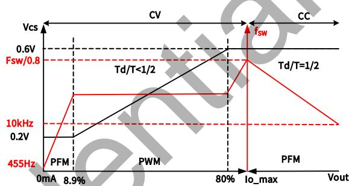  
图 5. 控制曲线

## 线电压补偿设置

芯片内部的关断延迟，导致不同线电压下，电感的峰值电流有差异。线电压越高，电感峰值电流偏差越大，输出电流就越大，影响 CC 精度。线电压补偿的目的是使电感峰值电流在不同线电压下保持原来预期值。

功率管导通时 FB clamp 电路将 FB 电压钳位至接近地，镜像 MOSFET 导通时的 $I_{FB}$ 得到 $K^{*}I_{FB}$ ，将该电流注入到补偿电阻 Rcs 上，产生 $\Delta V_{CS}$ ，叠加到 CS 电压上，用 $V_{CS} + \Delta V_{CS}$ 和参考电压进行比较，决定功率管关断。示意图如图 6 所示，FB 上电阻计算如下：

$$
\begin{array}{l} \mathrm {I_ {FB}} = \frac {\left(\mathrm {V_ {bulk}} - \mathrm {V_ {ds}}\right) \times \mathrm {N_ {aux}}}{\mathrm {N_ {p}} \times \mathrm {R_ {FBH}}} > 3 0 0 u A \\ \frac {\mathrm {V_ {bulk}} - \mathrm {V_ {ds}}}{\mathrm{L}} \times \Delta t = \Delta \mathrm {I_ {pk}} = \frac {\Delta \mathrm {V_ {cs}}}{\mathrm {R_ {cs}}} \\ \Delta \mathrm {V_ {cs}} = \mathrm{K} \times \mathrm {I_ {FB}} \times \mathrm {R_ {c}} = \frac {\mathrm{K} \times \left(\mathrm {V_ {bulk}} - \mathrm {V_ {ds}}\right) \times \mathrm {N_ {aux}} \times \mathrm {R_ {c}}}{\mathrm {N_ {p}} \times \mathrm {R_ {FBH}}} = \frac {\mathrm {V_ {bulk}} - \mathrm {V_ {ds}}}{\mathrm{L}} \times \Delta t \times \mathrm {R_ {cs}} \\ \mathrm {R_ {FBH}} = \frac {\mathrm{K} \times \mathrm {N_ {aux}} \times \mathrm {R_ {c}} \times \mathrm{L}}{\mathrm {N_ {p}} \times \Delta t \times \mathrm {R_ {cs}}} \end{array}
$$

其中，

Vbulk 是母线电压，

Vds 是功率管导通时的漏源电压，

$\Delta t$ 是芯片关断延时，K 是固定系数。

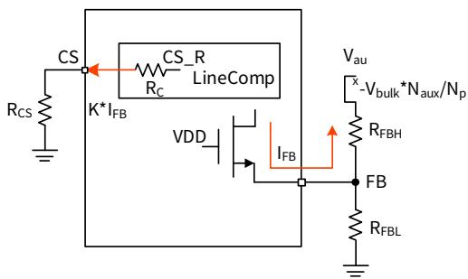  
图 6. 线电压补偿示意图

## 保护功能

BP86213D 内置多种保护功能, 包括输出开路/短路保护, VCC 欠压保护, 过温保护等。

## 输出短路

当输出短路时，FB 检测到的电压低于 1.2V 时，系统进入短路保护。短路工作时的开关频率被钳位在 10kHz，短路持续工作 150ms 后，关断功率管 MOSFET，计时 1.5s 后系统重启，有效降低开关管 MOSFET 的应力。

## 输出过压保护

当 FB 上升沿屏蔽 $2\mu s$ 后若连续三个周期大于 2.4V 则触发输出过压保护，关断功率管，1.5s 后系统重启。

## CS 开路/短路保护

当芯片检测到 CS 处于开路/短路状态，则关断功率管 MOSFET，计时 1.5s 后系统重启。

## 过温保护

BP86213D 芯片内置了过温保护电路，当结温达到过温保护阈值 $T_{OTP}$ (145°C) 时，芯片会停止工作，直到结温下降到 $T_{OTP}-T_{HYST}$ 时，芯片进入自动重启程序。 $T_{HYST}$ (40°C) 为温度迟滞，较大的温度迟滞有利于把系统温度控制在一个较低的水平。

## 应用指南

输入电容选择

输入滤波电容对工频电压纹波、传导EMI、以及电源抵抗Surge的能力都起到关键的作用。为了优化变压器的设计，电容量的选取要保证直流母线电压不能过低（通常低压输入时不低于80VDC，高压输入时不低于200VDC），因此电容量取决于输出功率和电源效率。BP86213D的应用场合一般功率相对较大，需要用全波整流，根据输出功率可以对输入电容进行初步估计(如表1所示)，全电压或低压输入时，一般取2\~3μF/W；高压输入时，一般取1μF/W。

<table><tr><td>输入</td><td>电压范围(VAC)</td><td>输入电容(μF/W)</td><td>推荐最低母线电压(V)</td></tr><tr><td>全电压</td><td>85~265</td><td>2~3</td><td>≥80V</td></tr><tr><td>低压</td><td>85~135</td><td>2~3</td><td>≥80V</td></tr><tr><td>高压</td><td>160~265</td><td>1</td><td>≥200V</td></tr></table>

表1. 推荐输入电容值和最低母线电压

根据选定的输入电容计算最低母线电压的精确值需要求解一个复杂的方程, 为简便起见, 通常使用以下公式得到一个相对精确的结果:

$$
V _ {D C \_ M I N} = \sqrt {2 * V _ {A C M I N} ^ {2} - \frac {P _ {O} * (1 - 2 * f _ {L} * t _ {C})}{\eta * C _ {I N} * f _ {L}}}
$$

其中，整流桥的导通时间 $t_{c}$ 一般取3ms，可以假设效率 $\eta$ 初始值为80%， $f_{L}$ 为输入交流电压频率， $V_{ACMIN}$ 为最低输入交流电压有效值， $P_{0}$ 为额定输出功率， $C_{IN}$ 为输入电容容量。最高母线电压可以通过计算得到：

$$
V _ {D C \_ M A X} = \sqrt {2} * V _ {A C M A X}
$$

## 变压器计算

## 变压器的计算按照以下步骤：

## 1) 选取次级反射到初级的电压( $V_{OR}$ ):

选取反射电压时，需要同时考虑最高输入电压下初级MOSFET和次级整流二极管的最高耐压值并留一定的裕量。MOSFET最高漏极电压为：

$$
V _ {D R A I N \_ M A X} = V _ {D C \_ M A X} + V _ {O R} + V _ {L K}
$$

其中， $V_{LK}$ 为漏感产生的电压尖峰， $V_{OR}$ 为次级反射到初级的电压。漏极电压波形如图7所示，通常建议漏极最高电压不超过90%的功率管击穿电压（ $BV_{DSS}$ ）。次级二极管的最高反向电压为：

$$
V _ {R} = \frac {V _ {D C \_ M A X} * (V _ {O U T} + V _ {D})}{V _ {O R}} + V _ {O U T}
$$

$V_{D}$ 为次级二极管的正向导通压降， $V_{OUT}$ 为输出电压。通常选取 $V_{OR}=70\sim90V$ 作为起始值开始变压器计算，然后反复迭代计算以达到优化设计的目的。

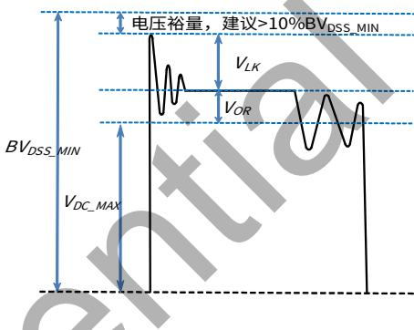  
图7. MOSFET漏极电压波形

## $V_{OR}$ 的选取需要综合考虑：

1. 反射电压越高，初次级匝比越大，初级漏感越大，会增加初级MOSFET电压应力和漏感产生的损耗。较高的反射电压虽然可以降低次级二极管的反向电压应力，从而可以使用较低电压的二极管，但是会增加次级的峰值和有效值电流，增加次级绕组和二极管导通损耗。同时，过高的反射电压还会引起传导EMI问题，这是由于非连续模式下初级电感和漏极寄生电容的自由振荡导致的。另外在DCM工作模式的PSR应用中，需确保最低交流输入整流后的最低直流Bulk电压下，占空比不大于0.5；反射电压若是选取太大，就需要比较大的输入电容，这会一定程度上增加成本和元器件体积。

2. 反射电压若是过小，虽输入电容可以适当减小，但会降低低压输入时的占空比、增加初级电流有效值、降低效率；同时增加次级二极管的电压应力。

综上所述，建议反射电压的选取范围：

<table><tr><td>输入电压范围(VAC)</td><td>推荐  $V_{OR}(V)$ </td></tr><tr><td>85~265</td><td>70~90</td></tr><tr><td>85~135</td><td>70~90</td></tr><tr><td>160~265</td><td>80~140</td></tr></table>

2) 变压器初次级匝比可以通过以下表达式得到:

$$
\frac {N _ {P}}{N _ {S}} = \frac {V _ {O R}}{V _ {O U T} + V _ {D}}
$$

其中， $N_{P}$ 和 $N_{S}$ 分别为变压器初级和次级匝数。

## 3) 初级峰值电流计算

根据最大输出电流的计算公式

$$
I _ {O \_ M A X} = \frac {1}{2} * \frac {N _ {P}}{N _ {S}} * \frac {V _ {C S \_ R E F}}{R _ {C S}} * \frac {T _ {d}}{T}
$$

最大输出电流状态即恒流状态下，Td/T=0.5，可得初级峰值电流 $I_{P}$ ：

$$
I _ {P} = \frac {V _ {C S \_ R E F}}{R _ {C S}} = 4 * \frac {N _ {S}}{N _ {P}} * I _ {O \_ M A X}
$$

得出 $I_{P}$ ，即可同步得出CS电阻值：

$$
R _ {C S} = \frac {V _ {C S \_ R E F}}{I _ {P}}
$$

4) 初级电感量计算：

$$
L m = \frac {2 * V _ {O} * I _ {O \_ M A X}}{\eta * I _ {P} ^ {2} * f _ {S}}
$$

其中， $\eta$ 是预估的效率，可按照设计目标作为参考代入； $f_{s}$ 为最大输出功率对应的工作频率。为保证FB反馈的可靠工作，重载下(Vcs=600mV)的退磁时间 $T_{DM}$ 须大于采样时间 $T_{SAMPLE\_BIG}$ ，同时轻载下(Vcs=200mV)的退磁时间须大于采样时间 $T_{SAMPLE\_SMALL}$ ，且保留足够余量。又因最大输出功率时对应的开关周期约等于2倍的退磁时间，因此综上建议最大输出功率对应的最高开关频率不超过55KHz。按照变压器设计线圈尽量少的原则，电感量要尽量小，因此上面计算公式中的 $f_{s}$ 可预设为50\~55kHz。设计中需要考虑制造商的精度，通常变压器的电感量精度是±7\~10%。因此，为了保证批量生产时能满足最高频率的要求，需要在计算值的基础上增加10%。

## 5) 计算初次级匝数：

为了抑制反激变压器工作时产生的音频噪声，一般需要控制最大磁通密度 $B_{MAX}$ 不超过3000高斯，在噪声要求很高的应用中，甚至需要低于2500高斯。变压器的匝数越多，磁通密度越小，变压器体积越大，导线损耗也越大。初级匝数计算如下：

$$
N _ {P} = \frac {L _ {P} * I _ {P}}{B _ {M A X} * A _ {E}}
$$

其中， $A_{E}$ 为磁芯的有效截面积， $B_{MAX}$ 为设定的最大磁通密度。然后通过步骤2计算次级匝数 $N_{S}$ ，并对计算结果进行取整，最后代入上式进行验证，直到 $B_{MAX}$ 满足要求为止。

## 6) 初次级电流有效值计算：

根据最终的初级电感重新计算最大占空比 $D_{MAX}$ :

$$
D _ {M A X} = \frac {2 * P _ {O}}{V _ {D C \_ M I N} * I _ {P} * \eta}
$$

初级绕组有效值电流为：

$$
I _ {P \_ R M S} = I _ {P} * \sqrt {\frac {D _ {M A X}}{3}}
$$

次级绕组电流有效值为：

$$
I _ {S \_ R M S} = I _ {P} * \frac {N _ {P}}{N _ {S}} * \sqrt {\frac {V _ {D C \_ M I N} * D _ {M A X}}{3 * V _ {O R}}}
$$

## 7) 电流密度和绕组线径

一般根据散热条件选择电流密度，通常无风密闭的环境电流密度4\~6A/mm²，散热条件较好的情况下选择6\~10A/mm²。然后根据步骤6计算的绕组电流有效值计算所需的线径。

## 输出电容的选择

输出电容的作用是滤除次级绕组电流中的交流成分，提供稳定的直流电压给负载，一般根据输出电压纹波要求来选取合适的电容。当输出电流恒定时，输出电压纹波主要由输出电容的 ESR 以及容量决定。

$$
\Delta V _ {O U T} = \Delta V _ {E S R} + \Delta V _ {C}
$$

实际应用中，为了得到较小的 ESR，电容量相对比较大，因此由容量产生的输出电压纹波很小，几乎可以忽略，电压纹波主要由电容的 ESR 产生：

$$
\Delta V _ {O U T} \approx \Delta V _ {E S R} = I _ {P} * \frac {N _ {P}}{N _ {S}} * E S R
$$

ESR 不仅产生输出电压纹波，纹波电流在 ESR 中产生的损耗还会导致电容发热，缩短电解电容的寿命，因此电解电容一般都会有纹波电流限制。流进电解电容的纹波电流有效值为：

$$
I _ {R I P P L E} = \sqrt {I _ {S \_ R M S} ^ {2} - I _ {O} ^ {2}}
$$

电容厂家的手册中一般给出的是 $100^{\circ}$ C 环境温度下的额定纹波电流有效值，实际应用中的环境温度要低得多，计算电容的额定纹波电流有效值时需要乘以对应的温度因子。当一个电容的纹波电流不能满足时，可以使用多个电容并联。

## 输出二极管选择

DCM 模式下，虽然正常工作没有反向恢复问题，但是开机和输出短路等条件下依然是 CCM。因此，次级整流二极管一般选择超快恢复二极管或肖特基二极管。变压器匝比确定后，重新计算次级二极管反向电压为：

$$
V _ {R} = \frac {V _ {D C \_ M A X} * N _ {S}}{N _ {P}} + V _ {O U T}
$$

常用的肖特基二极管耐压一般小于 200V，更高耐压的应用需要选择超快恢复二极管。二极管的额定电流一般选取输出电流的 3 倍或以上。

## 输出假负载计算

输出空载时，为了降低空载损耗，芯片工作在最低开关频率，同时为了避免最低开关频率处于音频范围而产生噪音，芯片的峰值电流也会降低到最小峰值 $V_{CS\_MIN}$ ，此时芯片输出的最低功率估算：

$$
P _ {O \_ M I N} = \frac {L _ {P} * V _ {C S \_ M I N} ^ {2} * F _ {M I N} * \eta}{2 * R _ {C S} ^ {2}}
$$

上式中，空载下的效率 $\eta$ 可近似为0.5， $F_{MIN}$ 典型值455Hz。输出空载时，负载消耗能量为0，需要增加用于消耗最低功率 $P_{O\_MIN}$ 的假负载，防止输出电压飘高。

假负载 $R_{DM}$ 的选择需满足：

$$
R _ {D M} <   \frac {V _ {O} ^ {2}}{P _ {O \_ M I N}}
$$

实际选择假负载需在满足上述估算的基础上越大越好，以得到更好的待机功耗。

## 钳位电路计算

反激变换器中由于变压器漏感的存在，在开关管关断瞬间会产生很大的尖峰电压，使得开关管承受较高的电压应力。因此，为确保反激变换器安全可靠工作，必须引入钳位电路吸收漏感能量。其中RCD钳位电路因结构简单、成本低、性能可靠而被广泛应用，如图8所示。初级MOSFET关断时，漏感中的能量通过二极管D1，衰减电阻R2转移到钳位电容C1中，然后通过电阻R1消耗掉。R2的作用是衰减变压器漏感与钳位电容C1形成的高频振荡，一般取20\~200Ω之间，阻值太小起不到衰减作用，太大就会导致漏感能量不能进入钳位电容，使得钳位电路不起作用。钳位二极管D1在小功率应用(≤12W)中可以使用普通二极管，好处是较慢的反向恢复时间会使得钳位电容中的能量部分转移到次级，提高轻载效率，同时对高频振荡起到衰减的作用。功率较大时，普通二极管的反向恢复损耗会导致发热比较严重，因此需要使用快恢复二极管。

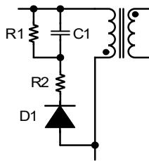  
图8. RCD钳位电路

钳位电阻R1和钳位电容C1的计算过程如下，首先计算MOSFET关断瞬间漏感两端电压：

$$
V _ {L k} = V _ {C L A M P} - V _ {O R}
$$

其中， $V_{CLAMP}$ 为钳位电容上的电压，流过漏感的电流斜率为：

$$
\frac {d i _ {L k}}{d t} = - \frac {V _ {C L A M P} - V _ {O R}}{L _ {K}}
$$

漏感电流从 $I_{P}$ 下降到0的时间为:

$$
t _ {S} = \frac {L _ {K} * I _ {P}}{V _ {C L A M P} - V _ {O R}}
$$

钳位电路消耗的功率为：

$$
P _ {C L A M P} = \frac {1}{2} * f _ {S} * L _ {L K} * I _ {P} ^ {2} * \frac {V _ {C L A M P}}{V _ {C L A M P} - V _ {O R}}
$$

钳位电阻计算：

$$
R _ {1} = \frac {V _ {C L A M P} ^ {2}}{P _ {C L A M P}} = \frac {2 * V _ {C L A M P} * (V _ {C L A M P} - V _ {O R})}{f _ {S} * L _ {L K} * I _ {P} ^ {2}}
$$

钳位电容计算：

$$
C _ {1} = \frac {V _ {C L A M P}}{\Delta V _ {C L A M P} * R _ {1} * f _ {S}}
$$

根据经验值， $\Delta V_{CLAMP}$ 可取为 $2\% \sim 5\% * V_{CLAMP}$ ， $V_{CLAMP}$ 一般选为 $2 \sim 2.5$ 倍的 $V_{ORo}$ 。

## 降低音频噪声

反激变换器的音频噪声来源主要是变压器、钳位电容和辅助供电电容。电容的噪声主要是因为瓷片电容的压电效应导致，钳位电容可以选择X7R材质，相比Z5U材质对音频噪声有较大改善，也可以使用没有压电效应的薄膜电容。辅助供电电容尽量使用电解电容，以避免轻载时由于较低的开关频率而产生噪声。变压器的噪声主要是因为线包和磁芯的震动，通过浸凡立水可以有效改善线包的震动。磁芯的震动可以通过降低最大磁通密度来改善，最大不要超过3000高斯，在噪声要求很高的应用中，甚至需要低于2500高斯。同时，在磁芯中柱点胶固定能进一步降低音频噪声。

## PCB Layout 指南

在设计BP86213DPCB时，参考图9所示，需要遵循以下建议：

1) VCC 电容必须直接靠近 VCC 和 GND 引脚放置，与电容的连接走线应尽量短。

2) 芯片地和辅助绕组的地应分别单独连接到母线电容负端。

3) FB 脚易受干扰，因此：

1. FB 脚外围的 FB 电阻及走线应远离高压 Drain 端和母线电压，避免高压漏电到 FB 造成干扰；

2. FB 下拉电阻要尽量靠近芯片 FB 脚和芯片地;

3. FB 上拉电阻尽量靠近 FB 脚，与辅助绕组的走线应尽量短。

4) 为了降低辐射干扰，应减小高频功率环路面积。初级母线电容、变压器绕组、芯片和 CS 电阻组成的环路面积。

尽可能小；次级绕组、二极管和输出滤波电容组成的环路面积尽可能小；初级绕组和钳位电路组成的环路面积尽可能小。

5) 芯片Drain端可以适当增大覆铜面积，帮助芯片散热。Drain端覆铜应注意：

1. 因为 Drain 端是动点，覆铜形状应尽量圆润，不可有突兀尖端，避免形成辐射天线，同时防止对周边低压区域放电。

2. 如果是双面板，Drain 端的大面积覆铜面对应的另一面，不要有大面积的 Bulk 高压覆铜面或地覆铜面，避免形成耦合电容而产生 EMI 问题。

6) 应将 Y 电容放置在初级输入滤波电容正端和次级滤波电容地之间, 这样放置可以使高频共模浪涌电流远离芯片, 从而避免芯片在雷击时受到干扰。如果在输入端使用了 $\pi$ 型 EMI 滤波器, 那么滤波器内的电感应放置在输入滤波电容的负极之间。

ESD 放电针应直接连接在初级输入滤波电容正端和次级滤波电容地或者输出正端之间，并远离芯片控制电路。

减小高频功率回路面积

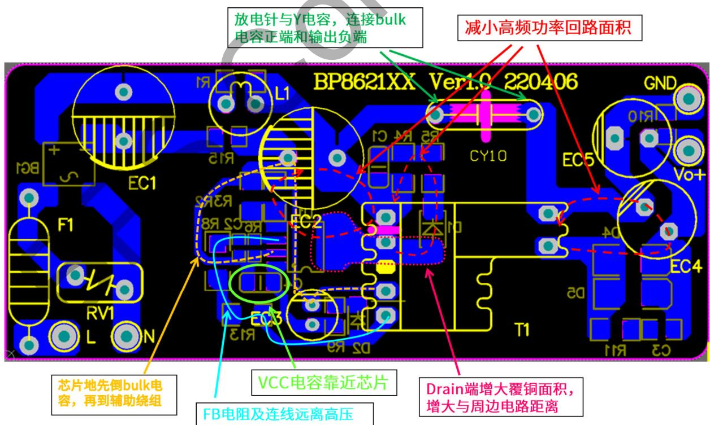  
图 9. PCB Layout 建议

## 设计实例

图 10 所示为用 BP86213D 设计的一个全电压输入，12V/1A 输出的电源实例。

电源输入端包含 F1，RV1，BG1，RT1，EC1，L1，L2，EC2。其中 F1 为保险丝，在电源故障状态下起保护作用。VR1 的作用是在雷击瞬间钳位输入端电压，保护后级电路。L1，L2 和 EC1，EC2 组成 $\pi$ 形滤波，改善电路 EMI 性能。整流桥 BG1 将输入交流电压全波整流成直流电压。EC1，EC2 对整流后的电压进行平滑滤波。

主功率电路包含 BP86213D, 变压器 T1, 输出二极管 D3, 输出电容 EC4、EC5。变压器选用 EE16-10, D3 为肖特基二极管, VF 小, 且反向恢复时间短, 提高效率。EC4、EC5 为两个并联的电解电容, 以达到较小的输出电压纹波, 输出纹波电压主要取决于电容的 ESR。

控制电路包含 BP86213D，R2，R3，R6，R7，R8。其中 R2，R3 控制输出恒流值；R6，R7，R8 控制输出电压。要想获得较高的输出恒压恒流精度，这些控制电路的电阻需选用 1% 精度的电阻。

变压器辅助供电绕组，D2，R9，EC3为芯片外部供电电路。辅助供电绕组与输出绕组耦合，可在输出二极管导通期间获得较稳定的电压，通过R9限流后给芯片VCC脚供电，提高轻载效率，降低空载功耗。

D1, R4, R5, C1 组成变压器原边绕组的钳位电路; R11, C3 组成次级整流二极管的吸收电路。优化的钳位电路和吸收电路，可降低芯片和二极管的电压应力，并可改善 EMI。

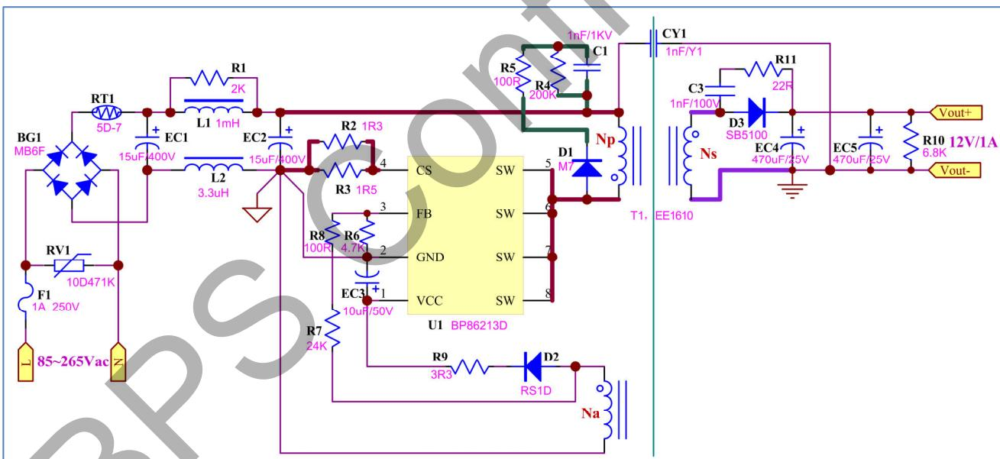  
图 10. BP86213D 设计实例电路图，90\~264VAC 输入，12V/1A 输出

## 特性曲线

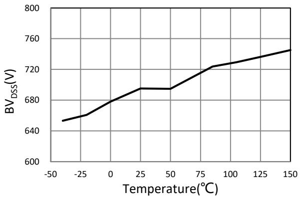  
图 11. BV $_{DSS}$ vs. Temperature

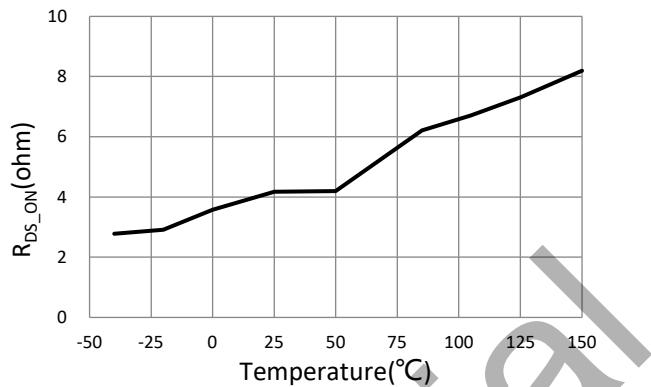  
图 12. $R_{DS\_ON}$ vs. Temperature

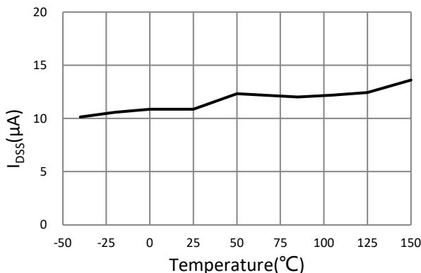  
图 13. $I_{DSS}$ vs. Temperature

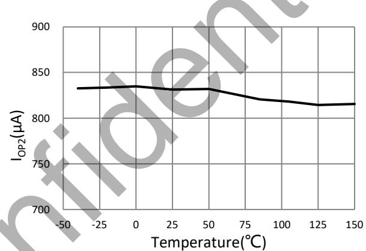  
图 14. $I_{OP2}$ vs. Temperature

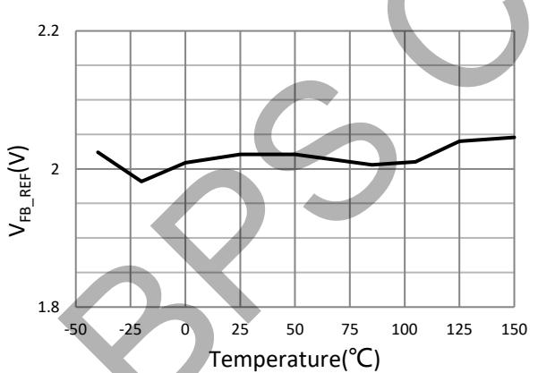  
图 15. $V_{FB\_REF}$ vs. Temperature

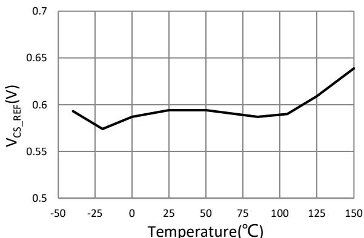  
图 16. $V_{CS\_REF}$ vs. Temperature

## 封装信息

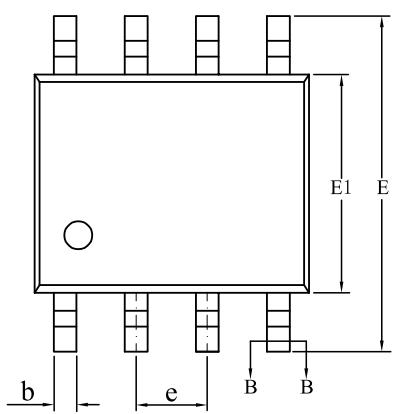  
SOP-8 封装外形尺寸

Unit:mm

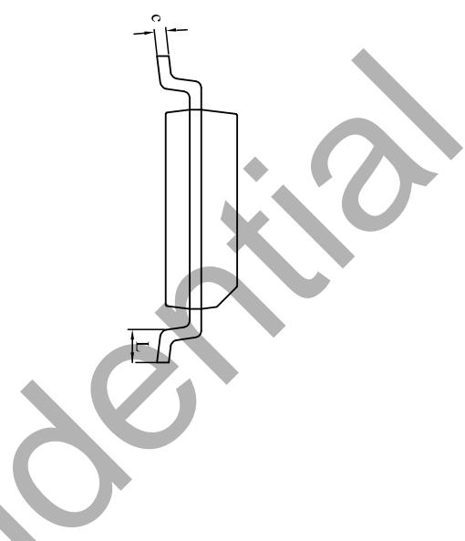

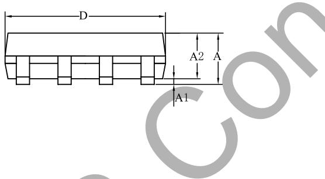

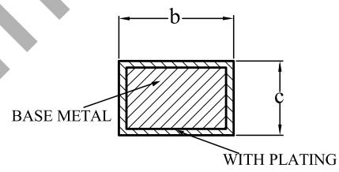  
WITH PLATING  
SECTION B-B

<table><tr><td rowspan="2">SYMBOL</td><td colspan="3">MILLIMETER</td></tr><tr><td>MIN</td><td>NOM</td><td>MAX</td></tr><tr><td>A</td><td>1.30</td><td>—</td><td>1.80</td></tr><tr><td>A1</td><td>0.05</td><td>—</td><td>0.25</td></tr><tr><td>A2</td><td>1.25</td><td>1.40</td><td>1.65</td></tr><tr><td>b</td><td>0.33</td><td>—</td><td>0.51</td></tr><tr><td>c</td><td>0.17</td><td>—</td><td>0.25</td></tr><tr><td>D</td><td>4.70</td><td>4.90</td><td>5.10</td></tr><tr><td>E</td><td>5.80</td><td>6.00</td><td>6.30</td></tr><tr><td>E1</td><td>3.70</td><td>3.90</td><td>4.10</td></tr><tr><td>e</td><td colspan="3">1.27BSC</td></tr><tr><td>L</td><td>0.40</td><td>—</td><td>1.00</td></tr></table>

## 版本信息

<table><tr><td>版本</td><td>日期</td><td>记录</td></tr><tr><td>Rev.1.0</td><td>2023/01</td><td>首次发布</td></tr><tr><td>Rev.1.1</td><td>2023/06</td><td>更新极限参数</td></tr><tr><td>Rev.1.2</td><td>2024/10</td><td>更新模板,增加 FB 过压保护阈值的上限值和下限值</td></tr></table>

## 免责声明

晶丰明源尽力确保本产品规格书内容的准确和可靠，但是保留在没有通知的情况下，修改规格书内容的权利。

本产品规格书未包含任何针对晶丰明源或第三方所有的知识产权的授权。针对本产品规格书所记载的信息，晶丰明源不做任何明示或暗示的保证，包括但不限于对规格书内容的准确性、商业上的适销性、特定目的的适用性或者不侵犯晶丰明源或任何第三人知识产权做任何明示或暗示保证，晶丰明源也不就因本规格书本身及其使用有关的偶然或必然损失承担任何责任。

## 电子器件报废说明

该产品在生命周期结束后，由客户按照一般电子产品的报废流程进行处理。