## BP87122集成复合管反激式 PWM驱动芯片

## 概述

BP87122 是一款高集成度、高效率、低待机功耗的电流模式PWM 控制芯片，适用于全电压范围 90\~265VAC 输入Flyback变换器应用。

芯片内部集成了750V的复合功率管，支持CCM和DCM工作模式。重载下芯片工作于 65 kHz 固定开关频率，中等负载时由 FB 反馈电压信号控制内部振荡器工作于降频模式，减小系统开关损耗。轻载和空载时工作于跳频模式，进一步降低系统开关损耗，使待机功耗小于75mW。

BP87122 通过内部的分段软驱动电路结构，并加入频率调制技术，可以达到优异的EMI性能。芯片内置有斜坡补偿电路，以改善系统的稳定性，避免次谐波振荡。系统的跳频频率设置在22kHz以上，可以避免轻载音频噪声。

BP87122 内置多种保护，包括逐周期限流，输出短路保护，VCC 过压、欠压保护，过温保护等，使系统更加安全可靠。

BP87122 采用 SOP-8 封装，满足 MSL-3 潮敏等级。

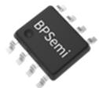  
SOP-8 封装

## 特点

 内部集成750V的复合功率管

 内置软启动功能

 满载固定65kHz，最低工作频率22kHz，无音频噪声

 跳频模式，改善轻载效率

 内置斜坡补偿，避免次谐波振荡

 保护功能

 逐周期限流(OCP)

 输出短路保护(SCP)

 VCC 过压、欠压保护（VCC\_OVP & UVLO）

 过温保护(OTP)

## 应用领域

 QC / USB PD / 可编程 AC/DC 充电器

 高效率反激式AC/DC 适配器

 AC/DC 辅助电源

## 典型应用

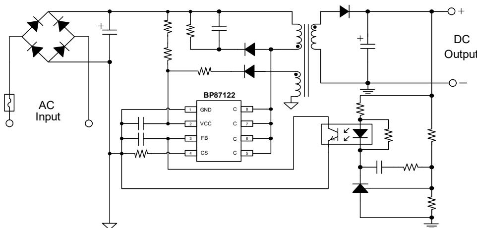  
图 1. BP87122 典型应用电路

## 定购信息

<table><tr><td>定购型号</td><td>封装</td><td>包装形式</td><td>打印</td></tr><tr><td>BP87122</td><td>SOP-8</td><td>卷盘4,000颗/盘</td><td>BP87122XXXXYYZZZZWWX</td></tr></table>

## 管脚封装

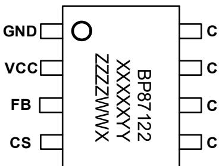  
图 2. SOP-8 管脚封装图

BP87122：产品型号

XXXXXYY: 批次号

ZZZZ: 内部标示

WW：周号

X：保留位

## 管脚描述

<table><tr><td>管脚号</td><td>管脚名称</td><td>描述</td></tr><tr><td>1</td><td>GND</td><td>芯片地</td></tr><tr><td>2</td><td>VCC</td><td>芯片电源端,建议接 4.7uF 以上 VCC 电容到地</td></tr><tr><td>3</td><td>FB</td><td>输出反馈控制端,连接到光耦集电极。光耦发射极连接到芯片地</td></tr><tr><td>4</td><td>CS</td><td>电流采样输入端,电流采样电阻接 CS 引脚和地之间</td></tr><tr><td>5、6、7、8</td><td>C</td><td>芯片内部高压功率管</td></tr></table>

## 输出功率

<table><tr><td>型号</td><td>工作特点</td><td>输出功率(90~265 VAC)(注1)</td></tr><tr><td>BP87122</td><td>过载保护</td><td>20 W</td></tr></table>

注 1：最小连续输出功率，测试条件为封闭式塑料外壳，环境温度为45 ℃。

极限参数(注 2)

<table><tr><td>符号</td><td>参数</td><td>参数范围</td><td>单位</td></tr><tr><td> $V_C$ </td><td>内部高压功率管耐压</td><td>-0.3~750</td><td>V</td></tr><tr><td> $V_{CC}$ </td><td> $V_{CC}$ 电压</td><td>-0.3~44</td><td>V</td></tr><tr><td> $I_{CC\_MAX}$ </td><td> $V_{CC}$ 引脚最大电流</td><td>10</td><td>mA</td></tr><tr><td> $V_{FB}$ </td><td>FB反馈端电压</td><td>-0.3~6</td><td>V</td></tr><tr><td> $V_{CS}$ </td><td>CS引脚电压</td><td>-0.3-6</td><td>V</td></tr><tr><td> $P_{DMAX}$ </td><td>功耗(注3)</td><td>0.97</td><td>W</td></tr><tr><td> $T_J$ </td><td>工作结温范围</td><td>-40 to 150</td><td>°C</td></tr><tr><td> $T_{STG}$ </td><td>储存温度范围</td><td>-55 to 150</td><td>°C</td></tr></table>

注 2：极限参数是指超出该工作范围，芯片有可能损坏。电气参数定义了器件在工作范围内并且在保证特定性能指标的测试条件下的直流和交流电参数规范。对于未给定上下限值的参数，该规范不予保证其精度，但其典型值合理反映了器件性能。  
注 3：温度升高最大功耗一定会减小，这也是由 $\Gamma _ { \mathrm { J M A X } } , \mathsf { \Delta } \theta _ { \mathrm { J A } } ,$ ,和环境温度T 所决定的。最大允许功耗为 $P _ { \tt D M A X } = \left( \mathbb { T } _ { \tt J M A X } - \mathbb { T } _ { A } \right) / \theta _ { \tt J A }$ 或是极限范围给出的数字中比较低的那个值。

电气参数（注4)（无特别说明情况下， $\mathsf { V } _ { \mathsf { C C } } = 1 8 \mathsf { V } , \mathsf { T } _ { \mathsf { A } } = 2 5 ^ { \circ } \mathsf { C } )$

<table><tr><td>符号</td><td>描述</td><td>条件</td><td>最小值</td><td>典型值</td><td>最大值</td><td>单位</td></tr><tr><td colspan="7">VCC供电部分</td></tr><tr><td> $V_{CC\_ON}$ </td><td>VCC启动阈值电压</td><td>VCC上升至IC开启</td><td>12.5</td><td>14</td><td>17.5</td><td>V</td></tr><tr><td> $V_{CC\_UVLO}$ </td><td>VCC欠压保护开启电压</td><td>VCC下降至IC关闭</td><td>5.2</td><td>5.8</td><td>6.4</td><td>V</td></tr><tr><td> $V_{CC\_HOLD}$ </td><td>VCC保持电压</td><td> $V_{FB}=0V,V_{CS}=0V$ </td><td></td><td>6.8</td><td></td><td>V</td></tr><tr><td> $V_{CC\_OV}$ </td><td>过压保护</td><td></td><td>37</td><td>38.8</td><td>40</td><td>V</td></tr><tr><td> $I_{CC\_ST}$ </td><td>启动电流</td><td> $V_{CC}=14V,测试VCC端电流$ </td><td>10</td><td>14</td><td>22</td><td>μA</td></tr><tr><td> $I_{CC}$ </td><td>工作电流</td><td> $V_{CC}=20V,V_{CS}=0V$ </td><td>2.4</td><td>3.56</td><td>5</td><td>mA</td></tr><tr><td colspan="7">FB反馈</td></tr><tr><td> $V_{FB\_OPEN}$ </td><td>FB开环电压</td><td></td><td>4.7</td><td>4.95</td><td>5.2</td><td>V</td></tr><tr><td> $I_{FB\_SHORT}$ </td><td>FB短路电流</td><td></td><td>0.18</td><td>0.21</td><td>0.24</td><td>mA</td></tr><tr><td> $V_{FB\_GREEN}$ </td><td>进入绿色模式FB阈值</td><td> $V_{CC}=18V,V_{CS}=0V,FB下降至C端频率低于35kHz$ </td><td>1.7</td><td>1.95</td><td>2.2</td><td>V</td></tr><tr><td> $V_{FB\_BURST\_L}$ </td><td>进入跳频模式电压阈值</td><td></td><td>0.5</td><td>0.7</td><td>0.9</td><td>V</td></tr><tr><td> $V_{FB\_BURST\_H}$ </td><td>退出跳频模式电压阈值</td><td></td><td>0.6</td><td>0.8</td><td>1</td><td>V</td></tr><tr><td colspan="7">振荡器</td></tr><tr><td> $f_{OSC}$ </td><td>振荡频率</td><td> $V_{CC}=20V,V_{FB}=3.7V,V_{CS}=0V$ </td><td>59</td><td>65</td><td>71</td><td>kHz</td></tr><tr><td> $D_{MAX}$ </td><td>最大占空比</td><td> $V_{CC}=20V,V_{FB}=3.7V,V_{CS}=0V$ </td><td>65</td><td>75</td><td>85</td><td>%</td></tr><tr><td> $f_{BURST}$ </td><td>跳频频率</td><td></td><td>21.5</td><td>23.7</td><td>26</td><td>kHz</td></tr><tr><td> $f_{PK\_PK}$ </td><td>抖频范围峰-峰值</td><td></td><td></td><td>10</td><td></td><td>kHz</td></tr><tr><td colspan="7">电流采样</td></tr><tr><td> $V_{CS\_INT}$ </td><td>CS初始限流值</td><td> $V_{CC}=20V,V_{FB}=3.7V,Duty=0$ </td><td>0.74</td><td>0.76</td><td>0.78</td><td>V</td></tr><tr><td> $V_{CS\_PK}$ </td><td>CS最大限流值</td><td> $Duty=D_{MAX}$ </td><td></td><td>0.95</td><td></td><td>V</td></tr><tr><td> $t_{D\_OC}$ </td><td>过流保护延迟时间</td><td> $T_J=25°C$ </td><td></td><td>100</td><td></td><td>ns</td></tr><tr><td> $t_{LEB}$ </td><td>前沿消隐时间</td><td> $T_J=25°C$ </td><td></td><td>400</td><td></td><td>ns</td></tr><tr><td> $t_{SS}$ </td><td>软起动时间</td><td></td><td></td><td>4</td><td></td><td>mS</td></tr><tr><td colspan="7">功率管</td></tr><tr><td> $I_{LK}$ </td><td>功率管关断漏电流</td><td> $V_{CC}=20V,V_C=750V,V_{FB}=0V$ </td><td></td><td></td><td>10</td><td>μA</td></tr><tr><td> $BV_C$ </td><td>功率管的击穿电压</td><td> $I_C=250μA$ </td><td>750</td><td></td><td></td><td>V</td></tr><tr><td> $R_{ON}$ </td><td>功率管等效导通电阻</td><td> $I_C=1A$ </td><td></td><td>1.8</td><td></td><td>Ω</td></tr><tr><td> $V_{C\_SUP}$ </td><td>启动电压</td><td></td><td></td><td></td><td>40</td><td>V</td></tr><tr><td colspan="7">过热保护</td></tr><tr><td> $T_{OTP+}$ </td><td>过温保护阈值</td><td></td><td></td><td>150</td><td></td><td>°C</td></tr><tr><td> $T_{OTP-}$ </td><td>过温保护解除阈值</td><td></td><td></td><td>110</td><td></td><td>°C</td></tr></table>

注 4：电气参数定义了器件在工作范围内并且在保证特定性能指标的测试条件下的直流和交流电参数规范。最小值和最大值由测试保证，典型值由设计、测试或统计分析保证。对于未给定上下限值的参数，该规范不予保证其精度，但其典型值合理反映了器件性能。

## 内部结构框图

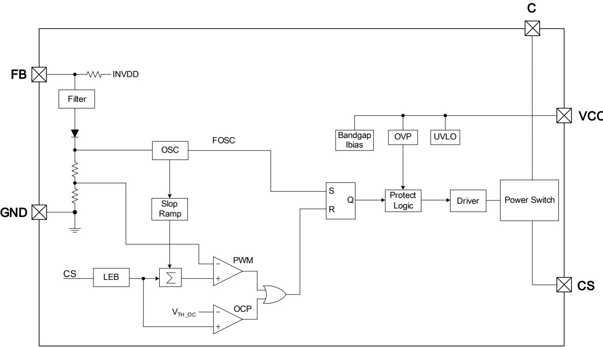  
图 3. BP87122 内部框图

## 功能描述

BP87122 为电流模式 PWM 开关电源控制芯片，内置 750 V复合功率管，不仅外围电路⾮常简洁，节省了系统成本和体积，能轻松通过最新能效指标对待机功耗的要求。BP87122支持 CCM 和 DCM 工作模式，低压输入时工作于 CCM 可以降低初级和次级电流有效值，从而提高整机效率；高压输入时工作于 DCM 可以降低开关损耗和次级整流管反向恢复电流，提升效率的同时有利于通过辐射EMI测试。BP87122通过分段驱动功率管，并加入频率调制，可以达到优异的 EM性能。BP87122 提供了丰富的保护功能，使系统很容易满足各种可靠性指标要求，因此特别适用于高端适配器应用。

（注 5：以下描述到的参数均为电气参数列表中的典型值，除⾮特别说明是最大或最小值）

## 启动与 VCC 供电

BP87122需外加启动电阻。系统上电后，⺟线电压通过起动电阻对VCC电容充电。当VCC电压上升到启动阈值电压V 时，芯片开始工作（图4所示）。此时，VCC电容给芯片提供工作电流，直到辅助绕组电压建立起来给VCC 供电。当VCC电压下降到欠压保护电压 $V _ { \mathsf { C C \_ U V L O } }$ 时，芯片停止工作，通过启动电阻重新对VCC电容充电，直到VCC\_ON。因此，VCC电容需要足够大，以至于启动时在辅助绕组电压没有建立起来之前，VCC电压不会下降到V 。然而，过大的VCC电容不仅会增加成本，也会增加启动时间，通常建议使用4.7\~22μF/50V的电解电容。很多情况下由于PCB布局限制，电解电容离芯片较远，在干扰复杂的环境中，通常建议在VCC 和GND脚之间放置一个0.1uF的瓷片电容，并靠近芯片，以提升芯片的抗干扰能⼒和抗ESD能⼒。

## 软启动

芯片内置4ms 软启动时间。在软启动过程中，控制电路限制达林顿管峰值电流，使其从零逐渐增加到最大值，以减小开机时达林顿管上的电压和电流应⼒。由于启动时输出电压一般较低，达林顿管关断期间输出电压对变压器的去磁较少，原边电流在开通时间内逐渐累积增大，可能超过达林顿管安全工作区而导致失效。软启动电路通过控制启动过程中达林顿管峰值电流逐渐增加（图4所示），可以避免原边累积过大的电流，从而降低达林顿管电压电流应⼒和降低次级二极管的电压尖峰。每一次重启都会经历一次软启动过程。

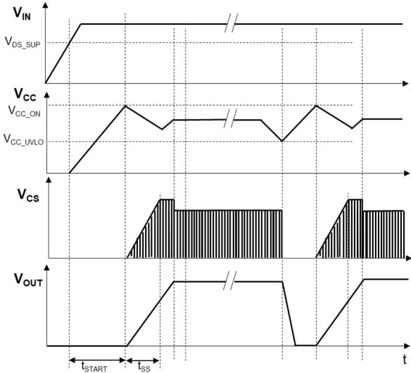  
图4. 启动与VCC欠压保护时序

## 频率控制

BP87122采用PWM/PFM多模式控制技术，能有效提高平均效率，降低系统待机功耗。重载下芯片工作于 PWM 模式，固定开关频率 $\mathsf { f o s c }$ （65 kHz）。随着负载减小，FB 电压降低到一定值后，芯片进入 PFM（绿色）模式，开关频率随负载减小而降低（如图5所示）。降低开关频率的好处是减小了开关损耗，提高了轻载时的效率，从而提高系统的平均效率，满足六级能效要求。为了避免音频噪声，开关频率的最小值设定为 fBURST（23.7 kHz）。负载继续降低时，开关频率不再继续下降，芯片进入跳频模式：当 FB 电压降低到阈值$V _ { F B \_ B U R S \top \_ L }$ 时，芯片关闭驱动信号，输出电压开始逐渐降低，FB 电压上升，当 FB 电压升高到阈值 $\mathsf { V } _ { \mathsf { F B \_ B U R S T \_ H } }$ 时，芯片又开启驱动信号，如此循环。跳频模式降低了平均开关频率，进一步减小开关损耗，使得系统待机功耗很容易满足 < 75mW的要求。

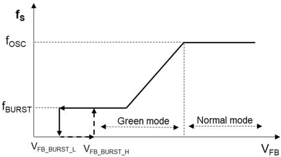  
图5. 频率控制曲线

## 频率调制

BP87122 采用了频率调制技术，对开关频率进⾏一定的调制，分散了噪声的频谱分布，可以降低 EMI 的平均值和准峰值。能有效降低EMI传导干扰，简化系统EMI设计。

## 电流检测

BP87122 通过外部电阻采样达林顿管电流，对其逐周期限制，以实现电流模式控制。当CS引脚电压超过FB引脚电压设定的限制值时，在该周期剩余阶段会关断功率达林顿管，直到下一个开关周期开始。内置前沿消隐(Leading EdgeBlanking)时间 $\tan \angle C _ { \mathsf { L E B } }$ 可以避免由于外部电路的容性或次级二极管的反向恢复导致达林顿管在开通瞬间出现的电流尖峰误触发达林顿管关断（如图6所示）。因此，CS引脚无需外加RC滤波网络。

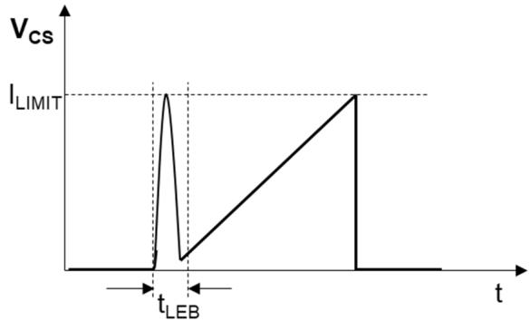  
图6. 前沿消隐

## 输入线电压补偿

在没有输入电压补偿的情况下，由于功率管关断延迟时间的存在，初级限流值随输入电压变化差异很大，输入电压越高，初级限流值越大，最大输出功率也随着增加。同时，在相同的频率和峰值电流下，CCM输出功率也会小于DCM，导致低压输入时输出功率受限。为了实现高低压输入时最大输出功率相同，BP87122对初级限流值进⾏了补偿，使初级限流值随功率管导通时间增加而增大（如图7所示）。因此，高输入电压下导通时间短，限流值低；相反，低输入电压下导通时间⻓，限流值高。这种通过检测开通时间而对初级电流的补偿，实现了全输入电压范围内功率限制值恒定。改变电流采样电阻值可以改变恒功率的大小。

## 斜坡补偿

峰值电流控制变换器工作于CCM模式且占空比大于50%时，存在次谐波振荡问题，为避免此问题，芯片内置了斜坡补偿电路。斜坡补偿的方式为在电流取样信号上叠加斜坡信号。

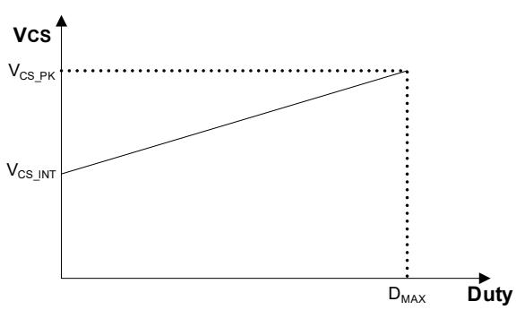  
图7. 输入线电压补偿

## VCC 过压保护

当VCC电压高于VCC\_OV，芯片停止开关动作。VCC 电压开始下降，当下降到VCC\_UVLO时，系统复位，重新开始高压启动。

## 过温保护

BP87122内置了过温保护电路，当结温达到过温保护阈值TOTP+(150 ℃)时，芯片会停止工作，直到结温下降到过温保护解除阈值TOTP-(110 ℃）时，芯片触发自动重启。

## PCB Layout 指南

在设计PCB 时，需要遵循以下建议：

1) VCC电容尽可能靠近VCC和GND引脚放置，如果由于PCB 布局限制，电解电容离芯片较远，通常建议在VCC和GND引脚之间放置一个0.1 μF的瓷片电容，并靠近芯片，以提升芯片的抗干扰能⼒和抗ESD能⼒。

2) 光耦的信号地走线应单点接地到芯片地。

3) 连接光耦的反馈信号线不要铺大铜⽪，以避免容易受到干扰。走线尽可能短，并远离变压器、功率管C引脚走线、初级钳位电路、辅助绕组等强干扰源。当光耦离芯片较远时，反馈信号线和信号地线应并排走线，以减小环路⾯积。

4) 为了降低辐射干扰，应减小高频功率环路⾯积。初级⺟线电容、变压器绕组和芯片组成的环路⾯积尽可能小；次级绕组、二极管和输出滤波电容组成的环路⾯积尽可能小；初级绕组和钳位电路组成的环路⾯积尽可能小。

5) 芯片的 C 脚能很好地起到散热作用，是器件散热的主要途径。但是由于芯片 C 属于 EMI 动点，在满足散热条件下铺铜⾯积应尽量小。

6) 应将Y电容放置在初级输入滤波电容正端和次级滤波电容地之间。如果在输入端使用了π型 EMI 滤波器，滤波电感应放置在输入滤波电容的负极之间。

7) 辅助绕组的地端应直接连接到⺟线电容的负端。

8) ESD放电针应直接连接在初级输入滤波电容正端和次级滤波电容地或者输出正端之间，并远离芯片控制电路。

## 封装信息

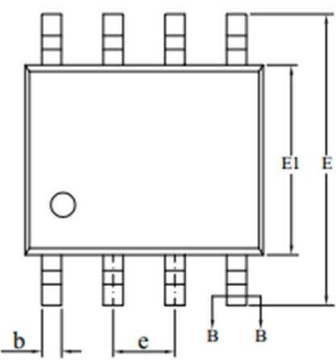  
SOP-8封装外形尺寸

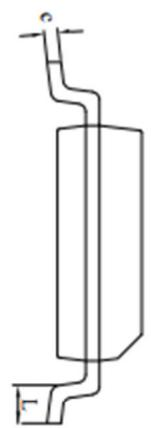

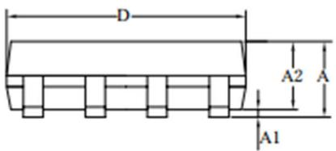

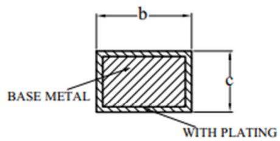  
SECTION B-B

<table><tr><td rowspan="2">SYMBOL</td><td colspan="3">MILLIMETER</td></tr><tr><td>MIN</td><td>NOM</td><td>MAX</td></tr><tr><td>A</td><td>1.30</td><td>—</td><td>1.80</td></tr><tr><td>A1</td><td>0.05</td><td>—</td><td>0.25</td></tr><tr><td>A2</td><td>1.25</td><td>1.40</td><td>1.65</td></tr><tr><td>b</td><td>0.33</td><td>—</td><td>0.51</td></tr><tr><td>c</td><td>0.17</td><td>—</td><td>0.25</td></tr><tr><td>D</td><td>4.70</td><td>4.90</td><td>5.10</td></tr><tr><td>E</td><td>5.80</td><td>6.00</td><td>6.30</td></tr><tr><td>E1</td><td>3.70</td><td>3.90</td><td>4.10</td></tr><tr><td>e</td><td colspan="3">1.27BSC</td></tr><tr><td>L</td><td>0.40</td><td>—</td><td>1.00</td></tr></table>

## 版本信息

<table><tr><td>版本</td><td>日期</td><td>记录</td></tr><tr><td>Rev. 1.0</td><td>2024/10</td><td>正式发行</td></tr><tr><td></td><td></td><td></td></tr></table>

## 免责声明

晶丰明源尽⼒确保本产品规格书内容的准确和可靠，但是保留在没有通知的情况下，修改规格书内容的权利。

本产品规格书未包含任何针对晶丰明源或第三方所有的知识产权的授权。针对本产品规格书所记载的信息，晶丰明源不做任何明示或暗示的保证，包括但不限于对规格书内容的准确性、商业上的适销性、特定⽬的的适用性或者不侵犯晶丰明源或任何第三⼈知识产权做任何明示或暗示保证，晶丰明源也不就因本规格书本⾝及其使用有关的偶然或必然损失承担任何责任。

## 电子器件报废说明

该产品在生命周期结束后，由客户按照一般电子产品的报废流程进行处理。