## BP87216集成 MOSFET 反激式 PWM 驱动芯片

## 概述

BP87216 是一款高集成度、高效率、低待机功耗的电流模式PWM 控制芯片，适用于全电压范围 90\~265VAC 输入Flyback变换器应用。

芯片内部集成了 660 V 高压 MOSFET、高压启动电路，⽀持CCM 和 DCM 工作模式。重载下芯片工作于 65 kHz 固定开关频率，中等负载时由 FB 反馈电压信号控制内部振荡器工作于降频模式，减小系统开关损耗。轻载和空载时工作于跳频模式，进一步降低系统开关损耗，使待机功耗小于75mW。

BP87216 通过内部的分段软驱动电路结构，并加入频率调制技术，可以达到优异的EMI性能。芯片内置有斜坡补偿电路，以改善系统的稳定性，避免次谐波振荡。系统的跳频频率设置在 22 kHz 以上，可以避免轻载音频噪声。精准的原边恒功率控制算法，轻松满足QC快充对输出功率曲线的要求。

BP87216 内置多种保护，包括逐周期限流，输出短路保护，输出过压和欠压保护，VCC 过压和欠压保护，过温保护等，以及较低的输出短路功耗使系统更加安全可靠。

BP87216 采用 ESOP-10 封装，满足 MSL-3 潮敏等级。

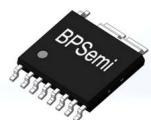  
ESOP-10 封装

## 特点

 全电压范围（90\~265VAC）满足六级能效，<75 mW 待机功耗

 内部集成 660 V 高压 MOSFET

 集成高压启动电路，无需外加启动电阻

 精准的原边恒功率控制

 内置软启动功能

 频率调制及分段软驱动电路，优化EMI性能

 满载固定65kHz，最低工作频率22kHz，无音频噪声

 跳频模式，改善轻载效率

 内置斜坡补偿，避免次谐波震荡

■ 较低的输出短路功耗

 保护功能

 逐周期限流(OCP)

 输出短路保护(SCP)

 输出过压、欠压保护(OVP＆UVP)

 VCC过压、欠压保护

 过温保护(OTP)

## 应用领域

 QC / USB PD / 可编程 AC/DC 充电器

 高效率反激式AC/DC 适配器

 AC/DC 辅助电源

## 典型应用

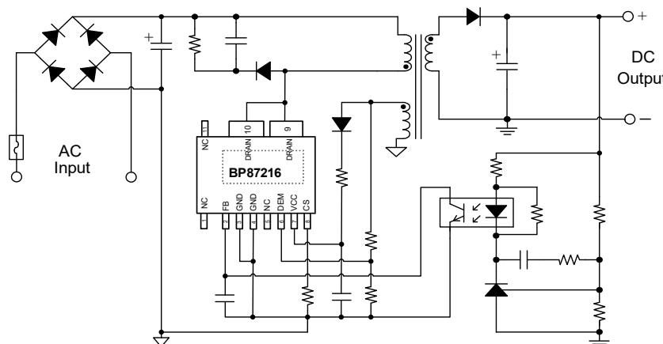  
图 1. BP87216 典型应用电路

## 定购信息

<table><tr><td>定购型号</td><td>封装</td><td>包装形式</td><td>打印</td></tr><tr><td>BP87216</td><td>ESOP-10</td><td>卷盘2500颗/盘</td><td>BP87216XXXXYYZZZZWWX</td></tr></table>

## 管脚封装

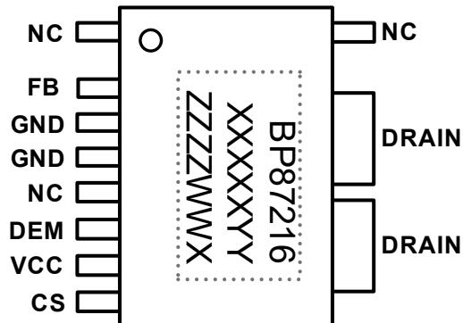  
图 2. ESOP-10 管脚封装图（底部 pad 为 DRAIN）

BP87216：产品型号

XXXXXYY: 批次号

ZZZZ: 内部标示

WW：周号

X：保留位

## 管脚描述

<table><tr><td>管脚号</td><td>管脚名称</td><td>描述</td></tr><tr><td>1/5/11</td><td>NC</td><td>无连接</td></tr><tr><td>2</td><td>FB</td><td>输出反馈控制端,连接到光耦集电极。光耦发射极连接到芯片地</td></tr><tr><td>3/4</td><td>GND</td><td>芯片地</td></tr><tr><td>6</td><td>DEM</td><td>输出电压检测端,通过分压电阻接辅助绕组,实现输出过压和欠压保护</td></tr><tr><td>7</td><td>VCC</td><td>芯片电源端,建议接4.7μF以上VCC电容到地</td></tr><tr><td>8</td><td>CS</td><td>电流采样输入端,电流采样电阻接CS引脚和地之间</td></tr><tr><td>9/10</td><td>DRAIN</td><td>芯片内部高压功率管,此引脚同时向芯片内部提供高压启动电流</td></tr></table>

## 输出功率

<table><tr><td>产品型号</td><td>工作特点</td><td>输出功率(90~265VAC)(注1)</td></tr><tr><td>BP87216</td><td>恒功率输出</td><td>35 W</td></tr></table>

注 1：最小连续输出功率，测试条件为封闭式塑料外壳，环境温度为45 ℃。

## 极限参数(注 2)

<table><tr><td>符号</td><td>参数</td><td>参数范围</td><td>单位</td></tr><tr><td> $V_{DRAIN}$ </td><td>内部高压 MOSFET 耐压</td><td>-0.3~660</td><td>V</td></tr><tr><td> $V_{CC}$ </td><td> $V_{CC}$  电压</td><td>-0.3~40</td><td>V</td></tr><tr><td> $I_{CC\_MAX}$ </td><td> $V_{CC}$  引脚最大电流</td><td>10</td><td>mA</td></tr><tr><td> $V_{FB}$ </td><td>FB 反馈端电压</td><td>-0.3~7</td><td>V</td></tr><tr><td> $V_{DEM}$ </td><td>DEM 引脚电压</td><td>-0.3~7</td><td>V</td></tr><tr><td> $V_{CS}$ </td><td>CS 引脚电压</td><td>-0.3-7</td><td>V</td></tr><tr><td> $P_{DMAX}$ </td><td>功耗(注 3)</td><td>1.5</td><td>W</td></tr><tr><td> $T_J$ </td><td>工作结温范围</td><td>-40 to 150</td><td>°C</td></tr><tr><td> $T_{STG}$ </td><td>储存温度范围</td><td>-55 to 150</td><td>°C</td></tr></table>

注 2：极限参数是指超出该范围，有可能导致器件永久性损坏。极限参数为器件应⼒的额定值，⻓期工作在极限参数条件可能会影响器件的可靠性。  
注 3：温度升高最大功耗一定会减小，这也是由 $T _ { \Delta M A X } , \theta _ { J A } ,$ 和环境温度 $\mathsf { T } _ { \mathsf { A } }$ 所决定的。最大允许功耗为 $P _ { \tt D M A X } = \left( \mathbb { T } _ { \tt J M A X } - \mathbb { T } _ { A } \right) / \theta _ { \tt J A }$ 或是极限范围给出的数字中比较低的那个值。  
注 4：1平方英寸双层PCB板，按照JEDEC 标准测试。

电气参数(注 5)

<table><tr><td>符号</td><td>描述</td><td>条件</td><td>最小值</td><td>典型值</td><td>最大值</td><td>单位</td></tr><tr><td colspan="7">VCC供电</td></tr><tr><td> $V_{CC\_ON}$ </td><td>VCC启动阈值电压</td><td>VCC上升至IC开启</td><td>12.5</td><td>14</td><td>17</td><td>V</td></tr><tr><td> $V_{CC\_UVLO}$ </td><td>VCC欠压保护开启电压</td><td>VCC下降至IC关闭</td><td>5.4</td><td>6.4</td><td>7.4</td><td>V</td></tr><tr><td> $V_{CC\_HOLD}$ </td><td>VCC保持电压</td><td> $V_{FB}=0V,V_{CS}=0V$ </td><td>6.4</td><td>7.2</td><td>8.4</td><td>V</td></tr><tr><td> $V_{CC\_OV}$ </td><td>过压保护</td><td> $T_J=25°C$ </td><td>36</td><td>37.5</td><td>39</td><td>V</td></tr><tr><td> $I_{CC\_ST}$ </td><td>启动电流</td><td> $V_{CC}=12V,测试VCC端电流$ </td><td></td><td>1.6</td><td>5</td><td>μA</td></tr><tr><td> $I_{CC}$ </td><td>工作电流</td><td> $V_{CC}=18V,V_{FB}=3.7V,V_{CS}=0V$ </td><td>0.5</td><td>1</td><td>1.5</td><td>mA</td></tr><tr><td> $I_{CH}$ </td><td> $V_{CC}电容充电电流$ </td><td> $V_{CC}=0V,V_{DRAIN}=100V$ </td><td>80</td><td>110</td><td>150</td><td>μA</td></tr><tr><td colspan="7">DEM引脚</td></tr><tr><td> $V_{DEM\_UVP}$ </td><td>输出欠压保护阈值</td><td></td><td></td><td>0.725</td><td></td><td>V</td></tr><tr><td> $t_{UVP\_delay}$ </td><td>欠压保护延迟</td><td></td><td></td><td>32</td><td></td><td>mS</td></tr><tr><td> $V_{DEM\_OVP}$ </td><td>输出过压保护阈值</td><td></td><td></td><td>2.4</td><td></td><td>V</td></tr><tr><td> $t_{OVP\_delay}$ </td><td>过压保护延时</td><td></td><td></td><td>8</td><td></td><td>cycle</td></tr><tr><td colspan="7">FB反馈</td></tr><tr><td> $V_{FB\_OPEN}$ </td><td>FB开环电压</td><td></td><td>5.1</td><td>5.6</td><td>6.1</td><td>V</td></tr><tr><td> $I_{FB\_SHORT}$ </td><td>FB短路电流</td><td></td><td>0.14</td><td>0.19</td><td>0.26</td><td>mA</td></tr><tr><td> $V_{FB\_GREEN}$ </td><td>进入绿色模式FB阈值</td><td> $V_{CC}=18V,V_{CS}=0V,FB下降至DRAIN端频率低于35kHz$ </td><td>1.5</td><td>1.8</td><td>2.1</td><td>V</td></tr><tr><td> $V_{FB\_BURST\_L}$ </td><td>进入跳频模式电压阈值</td><td></td><td>0.9</td><td>1.1</td><td>1.3</td><td>V</td></tr><tr><td> $V_{FB\_BURST\_H}$ </td><td>退出跳频模式电压阈值</td><td></td><td>1</td><td>1.2</td><td>1.4</td><td>V</td></tr><tr><td colspan="7">振荡器</td></tr><tr><td> $f_{OSC}$ </td><td>振荡频率</td><td> $V_{CC}=18V,V_{FB}=3V,V_{CS}=0V$ </td><td>59</td><td>65</td><td>71</td><td>kHz</td></tr><tr><td> $D_{MAX}$ </td><td>最大占空比</td><td> $V_{CC}=18V,V_{FB}=3.3V,V_{CS}=0V$ </td><td>65</td><td>75</td><td>85</td><td>%</td></tr><tr><td> $f_{BURST}$ </td><td>跳频频率</td><td></td><td>20</td><td>23.7</td><td>27.5</td><td>kHz</td></tr><tr><td> $f_{PK\_PK}$ </td><td>抖频范围峰-峰值</td><td></td><td></td><td>10</td><td></td><td>kHz</td></tr><tr><td colspan="7">电流采样</td></tr><tr><td> $V_{CS\_INT}$ </td><td>CS初始限流值</td><td> $V_{CC}=18V,V_{FB}=3V,Duty=0$ </td><td>0.74</td><td>0.77</td><td>0.81</td><td>V</td></tr><tr><td> $V_{CS\_PK}$ </td><td>CS最大限流值</td><td> $Duty=D_{MAX}$ </td><td></td><td>0.95</td><td></td><td>V</td></tr><tr><td> $t_{D\_OC}$ </td><td>过流保护延迟时间</td><td> $T_J=25°C$ </td><td></td><td>100</td><td></td><td>ns</td></tr><tr><td> $t_{\text{LEB}}$ </td><td>前沿消隐时间</td><td> $T_J=25°C$ </td><td></td><td>300</td><td></td><td>ns</td></tr><tr><td> $t_{\text{SS}}$ </td><td>软起动时间</td><td></td><td></td><td>4</td><td></td><td>mS</td></tr><tr><td colspan="7">功率管</td></tr><tr><td> $I_{\text{DSS}}$ </td><td>功率管关断漏电流</td><td> $V_{\text{DS}}=660 V, V_{\text{GS}}=0 V$ </td><td></td><td></td><td>10</td><td>μA</td></tr><tr><td> $BV_{\text{DSS}}$ </td><td>功率管击穿电压</td><td> $V_{\text{GS}}=0 V, I_D=250 μA$ </td><td>660</td><td></td><td></td><td>V</td></tr><tr><td> $I_D$ </td><td>连续漏极电流</td><td> $T_J=25°C$ </td><td></td><td>3.9</td><td></td><td>A</td></tr><tr><td> $R_{\text{DS_ON}}$ </td><td>功率管导通电阻</td><td> $V_{\text{GS}}=10 V, I_D=1.5 A$ </td><td></td><td>0.67</td><td>0.8</td><td>Ω</td></tr><tr><td> $V_{\text{DS\_SUP}}$ </td><td>漏极启动电压</td><td> $T_J=25°C$ </td><td></td><td></td><td>40</td><td>V</td></tr><tr><td colspan="7">过热保护</td></tr><tr><td> $T_{\text{OTP}}$ </td><td>过温保护阈值</td><td></td><td></td><td>150</td><td></td><td>°C</td></tr></table>

注 5：电气参数定义了器件在工作范围内并且在保证特定性能指标的测试条件下的直流和交流电参数规范。最小值和最大值由测试保证，典型值由设计、测试或统计分析保证。对于未给定上下限值的参数，该规范不予保证其精度，但其典型值合理反映了器件性能。

## 内部结构框图

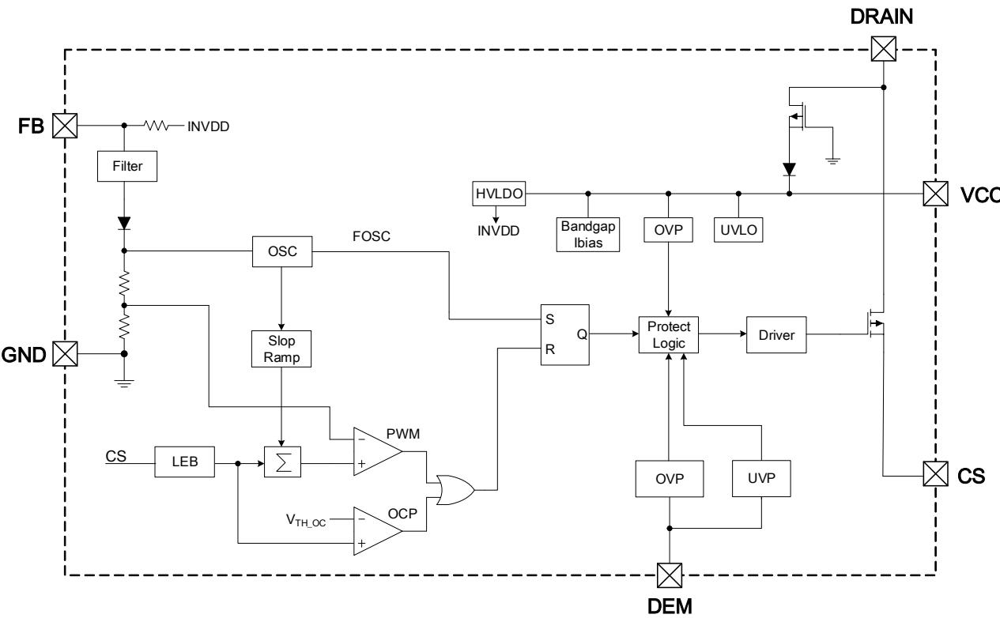  
图 3. BP87216 内部框图

## 功能描述

BP87216为电流模式PWM 开关电源控制芯片，内置660V高压MOSFET以及高压启动电路，不仅外围电路⾮常简洁，节省了系统成本和体积，而且省去了启动电阻的功耗，能轻松通过最新能效指标对待机功耗的要求。BP87216 ⽀持CCM和DCM工作模式，低压输入时工作于CCM可以降低初级和次级电流有效值，从而提高整机效率；高压输入时工作于DCM可以降低开关损耗和次级整流管反向恢复电流，提升效率的同时有利于通过辐射EMI测试。BP87216通过分段驱动功率管，并加入频率调制，可以达到优异的EMI性能。BP87216 提供了丰富的保护功能，使系统很容易满足各种可靠性指标要求，因此特别适用于高端适配器应用。（注6：以下描述到的参数均为电气参数列表中的典型值，除⾮特别说明是最大或最小值）

## 高压启动与 VCC 欠压保护

BP87216 产品集成高压启动电路，无需外加启动电阻。系统上电后，当⺟线电压达到芯片漏极启动电压 $V _ { \mathsf { D S } } \mathsf { \Omega } _ { \mathsf { S U P } }$ 时，内部高压启动电路通过 DRAIN 端对 VCC 电容充电，充电电流为

ICH 。当 VCC 电压上升到启动阈值电压 $V _ { C C \_ O N }$ 时，充电电路关闭，芯片开始工作（图 4 所示）。因此，启动延迟时间为：

$$
t _ {S T A R T} = C _ {V C C} * \frac {V _ {C C \_ O N} - V _ {C C \_ I N T}}{I _ {C H}}
$$

其中， $\mathsf { C v c c }$ 为 VCC 电容值， $\mathsf { I } _ { \mathsf { C H } }$ 为充电电流， $\mathsf { V c c \_ m } \tau$ 为初始VCC 电压值。此时，VCC 电容给芯片提供工作电流，直到辅助绕组电压建立起来给 VCC 供电。当 VCC 电压下降到欠压保护电压 $V _ { \mathsf { C C \_ U V L O } }$ 时，芯片停止工作，高压启动电路重启对VCC 电容充电，直到 $V _ { C C \_ O N }$ 。因此，VCC 电容需要足够大，以至于启动时在辅助绕组电压没有建立起来之前，VCC 电压不会下降到 $V _ { \mathsf { C C \_ U V L O } }$ 。然而，过大的 VCC 电容不仅会增加成本，也会增加启动时间，通常建议使用 4.7\~22 μF / 50 V 的电解电容。很多情况下由于PCB布局限制，电解电容离芯片较远，在干扰复杂的环境中，通常建议在 VCC 和 GND 引脚之间放置一个 $0 . 1 \mu \mathsf { F }$ 的瓷片电容，并靠近芯片，以提升芯片的抗干扰能⼒和抗ESD能⼒。

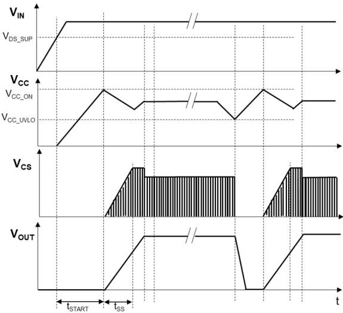  
图4. 高压启动与VCC欠压保护时序

## 软启动

芯片内置4ms软启动时间。在软启动过程中，控制电路限制MOSFET 峰值电流，使其从零逐渐增加到最大值，以减小开机时MOSFET上的电压和电流应⼒。由于启动时输出电压一般较低，MOSFET 关断期间输出电压对变压器的去磁较少，原边电流在开通时间内逐渐累积增大，可能超过MOSFET安全工作区而导致失效。软启动电路通过控制启动过程中MOSFET 峰值电流逐渐增加（图 4 所示），可以避免原边累积过大的电流，从而降低MOSFET电压电流应⼒和降低次级二极管的电压尖峰。每一次重启都会经历一次软启动过程。

## 频率控制

BP87216采用 PWM/PFM多模式控制技术，能有效提高平均效率，降低系统待机功耗。重载下芯片工作于PWM 模式，固定开关频率 $\mathsf { f } _ { \mathsf { O S C } }$ 。随着负载减小，FB 电压降低到一定值后，芯片进入PFM（绿色）模式，开关频率随负载减小而降低（如图5所示）。降低开关频率的好处是减小了开关损耗，提高了轻载时的效率，从而提高系统的平均效率，满足六级能效要求。为了避免音频噪声，开关频率的最小值设定为fBURST。负载继续降低时，开关频率不再继续下降，芯片进入跳频模式：当FB 电压降低到阈值 $V _ { F B \_ B U R S T \_ L }$ 时，芯片关闭驱动信号，输出电压开始逐渐降低，FB 电压上升，当FB 电压升高到阈值 $V _ { F B \_ B \cup R S \top \_ H }$ 时，芯片又开启驱动信号，如此循环。跳频模式降低了平均开关频率，进一步减小开关损耗，使得系统待机功耗很容易满足<75 mW的要求。

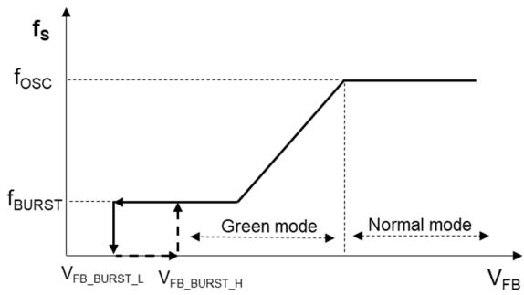  
图5. 频率控制曲线

## 频率调制

BP87216 采用了频率调制技术，对开关频率进⾏一定的调制，分散了噪声的频谱分布，可以降低 EMI 的平均值和准峰值。能有效降低EMI传导干扰，简化系统EMI设计。

## 电流检测

BP87216 通过外部电阻采样 MOSFET 电流，对其逐周期限制，以实现电流模式控制。当CS引脚电压超过FB引脚电压设定的限制值时，在该周期剩余阶段会关断功率 MOSFET，直到下一个开关周期开始。内置前沿消隐(Leading EdgeBlanking)时间 tLEB可以避免由于外部电路的容性或次级二极管的反向恢复导致MOSFET在开通瞬间出现的电流尖峰误触发 MOSFET 关断（如图 6 所示）。因此，CS 引脚无需外加RC滤波网络。

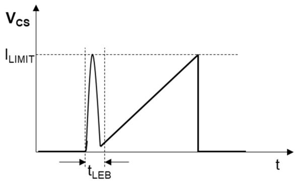  
图6. 前沿消隐

## 输入线电压补偿

在没有输入电压补偿的情况下，由于功率管关断延迟时间的存在，初级限流值随输入电压变化差异很大，输入电压越高，初级限流值越大，最大输出功率也随着增加。同时，在相同的频率和峰值电流下，CCM 输出功率也会小于 DCM，导致低压输入时输出功率受限。为了实现高低压输入时最大输出功率相同，BP87216 对初级限流值进⾏了补偿，使初级限流值随功率管导通时间增加而增大（如图 7 所示）。因此，高输入电压下导通时间短，限流值低；相反，低输入电压下导通时间⻓，限流值高。这种通过检测开通时间而对初级电流的补偿，实现了全输入电压范围内功率限制值恒定。改变电流采样电阻值可以改变恒功率的大小。

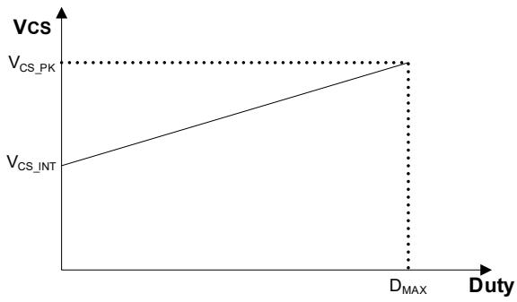  
图7. 输入线电压补偿

## 斜坡补偿

峰值电流控制变换器工作于 CCM 模式且占空比大于 50%时，存在次谐波振荡问题，为避免此问题，芯片内置了斜坡补偿电路。斜坡补偿的方式为在电流取样信号上叠加斜坡信号。

## 恒功率输出

BP87216 通过检测原边电流峰值和导通时间估算输出功率，通过内部控制电路实现恒功率输出控制。可以通过改变原边电流采样电阻改变输出恒功率值。

## VCC 过压保护

当 VCC 电压高于 $\mathsf { V } _ { \mathsf { C C } , \mathsf { O V } } ,$ 芯片停止开关动作。VCC 电压开始下降，当下降到 $V _ { \mathsf { C C \_ U V L O } }$ 时，系统复位，重新开始高压启动。

## 输出过、欠压保护

芯片 DEM 引脚通过辅组绕组实时检测输出电压，在反馈开路时，当检测DEM引脚电压达到 $V _ { D E M \_ O V P }$ 并持续 $\mathrm { \sf t o v p \_ d e l a y }$ 时间后，芯片停止开关动作，防止输出电压过高；在输出电压较低，DEM 引脚电压低于 $V _ { D E M \_ U V P }$ 并持续 $\tan \angle C = \angle C ( \angle A )$ 时间后，芯片停止开关动作。此功能可用于快充应用中，设置当输出电压低于协议芯片操作电压前停止开关动作，避免恒流区输出电流失控。

## 过温保护

BP87216 芯片内置了过温保护电路，当结温达到过温保护阈值 ${ \mathsf { T } } _ { 0 { \mathsf { T } } { \mathsf { P } } }$ 时，芯片会停止工作。VCC电压开始下降，当下降到

VCC\_UVLO 时，系统复位，重新开始高压启动。当 VCC 再次达到 $V _ { C C \_ O N }$ 时，如果温度处于 TOTP以上，芯片再次停止工作，直到温度低于TOTP。

## PCB Layout 指南

在设计PCB 时，需要遵循以下建议：

1) VCC电容尽可能靠近VCC和GND引脚放置，如果由于PCB 布局限制，电解电容离芯片较远，通常建议在VCC和GND引脚之间放置一个0.1 μF的瓷片电容，并靠近芯片，以提升芯片的抗干扰能⼒和抗ESD能⼒。

2) 光耦的信号地走线应单点接地到芯片地。

3) 连接光耦的反馈信号线不要铺大铜⽪，以避免容易受到干扰。走线尽可能短，并远离变压器、功率管 DRAIN走线、初级钳位电路、辅助绕组等强干扰源。当光耦离芯片较远时，反馈信号线和信号地线应并排走线，以减小环路⾯积。

4) 为了降低辐射干扰，应减小高频功率环路⾯积。初级⺟线电容、变压器绕组和芯片组成的环路⾯积尽可能小；次级绕组、二极管和输出滤波电容组成的环路⾯积尽可能小；初级绕组和钳位电路组成的环路⾯积尽可能小。

5) 芯片的 DRAIN 脚能很好地起到散热作用，是器件散热的主要途径。但是由于芯片 DRAIN 属于 EMI 动点，在满足散热条件下铺铜⾯积应尽量小。

6) 应将Y电容放置在初级输入滤波电容正端和次级滤波电容地之间。如果在输入端使用了π型 EMI 滤波器，那么滤波电感应放置在输入滤波电容的负极之间。

7) 辅助绕组的地端应直接连接到⺟线电容的负端。

8) ESD放电针应直接连接在初级输入滤波电容正端和次级滤波电容地或者输出正端之间，并远离芯片控制电路。

## 特性曲线

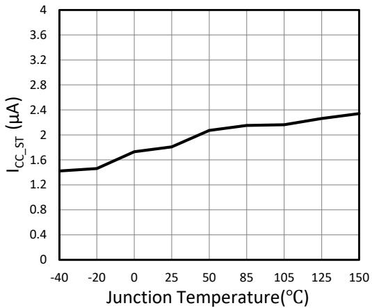  
图 8. ICC\_ST vs. Temperature

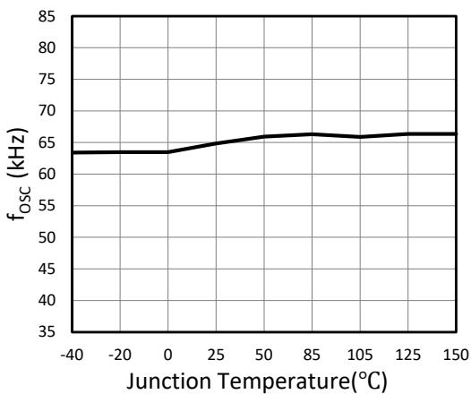  
图 9. fOSC vs. Temperature

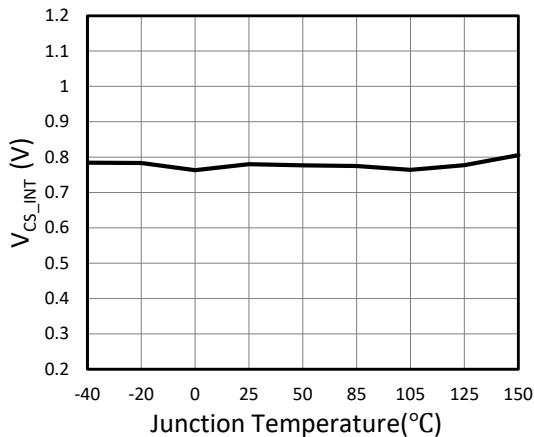  
图 10. VCS\_INT vs. Temperature

ADOES NOT INCLUDE MOLD FLASH, PROTRUSIONS OR GATE BURRS, MOLD FLASH,

## 封装信息

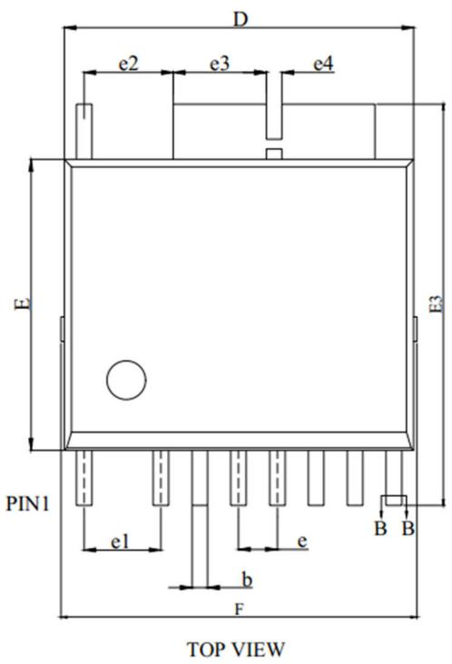  
ESOP-10 封装外形尺寸

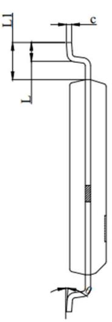  
SIDE VIEW

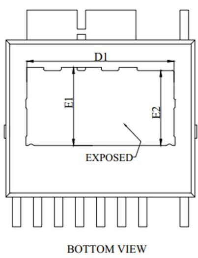

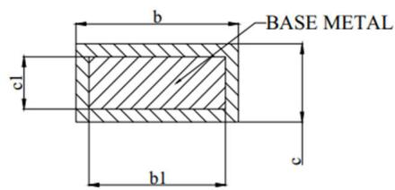

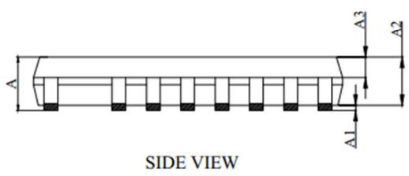

SECTION:B-B

<table><tr><td>SYMBOL</td><td>MIN</td><td>NOM</td><td>MAX</td></tr><tr><td>A</td><td>1.30</td><td>-</td><td>1.62</td></tr><tr><td>A1</td><td>0.00</td><td>-</td><td>0.12</td></tr><tr><td>A2</td><td>1.30</td><td>1.40</td><td>1.50</td></tr><tr><td>A3</td><td>0.60</td><td>0.65</td><td>0.70</td></tr><tr><td>b</td><td>0.37</td><td>-</td><td>0.47</td></tr><tr><td>b1</td><td>0.35</td><td>-</td><td>0.45</td></tr><tr><td>c</td><td>0.17</td><td>-</td><td>0.27</td></tr><tr><td>c1</td><td>0.15</td><td>-</td><td>0.25</td></tr><tr><td>D</td><td>8.90</td><td>9.00</td><td>9.10</td></tr><tr><td>D1</td><td>6.77</td><td>-</td><td>6.97</td></tr><tr><td>E</td><td>7.40</td><td>7.50</td><td>7.60</td></tr><tr><td>E1</td><td>3.465</td><td>-</td><td>3.665</td></tr><tr><td>E2</td><td>3.365</td><td>-</td><td>3.565</td></tr><tr><td>E3</td><td>10.14</td><td>10.34</td><td>10.54</td></tr><tr><td>F</td><td>9.00</td><td>-</td><td>9.40</td></tr><tr><td>e</td><td colspan="3">1.00 BSC</td></tr><tr><td>e1</td><td colspan="3">1.98 BSC</td></tr><tr><td>e2</td><td>2.20</td><td>2.30</td><td>2.40</td></tr><tr><td>e3</td><td>2.295</td><td>2.395</td><td>2.495</td></tr><tr><td>e4</td><td colspan="3">0.40 BSC</td></tr><tr><td>L</td><td>0.62</td><td>0.72</td><td>0.82</td></tr><tr><td>L1</td><td>1.32</td><td>1.42</td><td>1.52</td></tr><tr><td>θ</td><td>0°</td><td>3°</td><td>6°</td></tr></table>

<table><tr><td>SYMBOL</td><td>MIN</td><td>NOM</td><td>MAX</td></tr><tr><td>A</td><td>0.051</td><td>-</td><td>0.064</td></tr><tr><td>A1</td><td>0.000</td><td>-</td><td>0.005</td></tr><tr><td>A2</td><td>0.051</td><td>0.055</td><td>0.059</td></tr><tr><td>A3</td><td>0.024</td><td>0.026</td><td>0.028</td></tr><tr><td>b</td><td>0.015</td><td>-</td><td>0.019</td></tr><tr><td>b1</td><td>0.014</td><td>-</td><td>0.018</td></tr><tr><td>c</td><td>0.007</td><td>-</td><td>0.011</td></tr><tr><td>c1</td><td>0.006</td><td>-</td><td>0.010</td></tr><tr><td>D</td><td>0.350</td><td>0.354</td><td>0.358</td></tr><tr><td>D1</td><td>0.267</td><td>-</td><td>0.274</td></tr><tr><td>E</td><td>0.291</td><td>0.295</td><td>0.299</td></tr><tr><td>E1</td><td>0.136</td><td>-</td><td>0.144</td></tr><tr><td>E2</td><td>0.132</td><td>-</td><td>0.140</td></tr><tr><td>E3</td><td>0.399</td><td>0.407</td><td>0.415</td></tr><tr><td>F</td><td>0.354</td><td>-</td><td>0.370</td></tr><tr><td>e</td><td colspan="3">0.039 BSC</td></tr><tr><td>e1</td><td colspan="3">0.078 BSC</td></tr><tr><td>e2</td><td>0.087</td><td>0.091</td><td>0.094</td></tr><tr><td>e3</td><td>0.090</td><td>0.094</td><td>0.098</td></tr><tr><td>e4</td><td colspan="3">0.016 BSC</td></tr><tr><td>L</td><td>0.024</td><td>0.028</td><td>0.032</td></tr><tr><td>L1</td><td>0.052</td><td>0.056</td><td>0.060</td></tr><tr><td>θ</td><td>0°</td><td>3°</td><td>6°</td></tr></table>

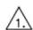

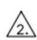

## 版本信息

<table><tr><td>版本</td><td>日期</td><td>记录</td></tr><tr><td>Rev. 1.0</td><td>2024/10</td><td>正式发行</td></tr><tr><td>Rev. 1.1</td><td>2024/10</td><td>增加潮敏等级描述</td></tr><tr><td></td><td></td><td></td></tr></table>

## 免责声明

晶丰明源尽⼒确保本产品规格书内容的准确和可靠，但是保留在没有通知的情况下，修改规格书内容的权利。

本产品规格书未包含任何针对晶丰明源或第三方所有的知识产权的授权。针对本产品规格书所记载的信息，晶丰明源不做任何明示或暗示的保证，包括但不限于对规格书内容的准确性、商业上的适销性、特定⽬的的适用性或者不侵犯晶丰明源或任何第三⼈知识产权做任何明示或暗示保证，晶丰明源也不就因本规格书本⾝及其使用有关的偶然或必然损失承担任何责任。

## 电子器件报废说明

该产品在生命周期结束后，由客户按照一般电子产品的报废流程进行处理。