## BP87526H集成 MOSFET 磁耦通讯 QR 反激驱动器

## 概述

BP87526H 是一款高性能、高集成度、低待机功耗、高频准谐振反激驱动芯片。内置800 V 高压MOSFET，集成高压启动电路、高压辅助供电电路，适用于高效率、小体积、高可靠性、宽输出电压范围的35\~55 W反激变换器应用。

BP87526H 支持自适应 COT 控制方式，接收和解调配对的副边控制器发送到原边的脉冲信号，同时检测原边漏极电压⾕底，控制原边功率管的开通，实现较高的效率。采用 AdaptiveCOT控制方式和原副边磁耦通讯，⼤幅度降低了控制电路的静态工作电流，使得系统待机功耗小于 30 mW，可以满足待机功耗要求较高的应用场合。辅助供电引脚耐压可达到 150 V，能满足宽输出电压范围。

BP87526H 内置了完备的保护功能，包括 Brown-in/out、输入高压保护、CS 引脚开路/短路保护、次级整流管短路保护、输出过压保护、VCC过压/⽋压保护、反馈环开路保护，LPS、过温保护等。

BP87526H 采用 ESOP-10 封装，具备较好的散热性能，同时满足爬电距离的要求，满足MSL-3潮敏等级。

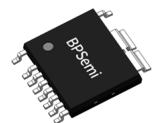  
ESOP-10 封装

## 特点

 内置 800 V 高压 MOSFET

 集成高压启动

 150 V辅助供电耐压，满足宽输出电压范围

 自适应COT控制，快速的动态响应

 磁耦通讯实现超低待机功耗，<30 mW

 QR⾕底开通，优化效率和EMI特性

 最高可达 140 kHz 开关频率

 满足 LPS（Limit Power Source）安规要求

 完备的保护功能

 Brown-in/out

 输入 OVP

Y CS 引脚开路、短路保护

 次级整流管短路保护

 输出过压保护

 VCC过压、⽋压保护

 反馈开环保护

 迟滞过温保护

## 应用领域

 USB PD、QC 充电器

 可编程 AC/DC 充电器

## 典型应用

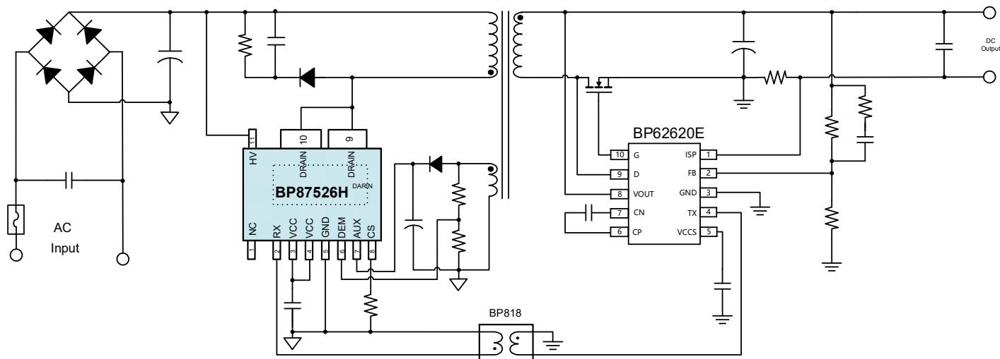  
图 1. BP87526H 典型应用电路

## 定购信息

<table><tr><td>定购型号</td><td>封装</td><td>包装形式</td><td>打印</td></tr><tr><td>BP87526H</td><td>ESOP-10</td><td>卷盘2500颗/盘</td><td>BP87526HXXXXYYZZZZWWX</td></tr></table>

## 管脚封装

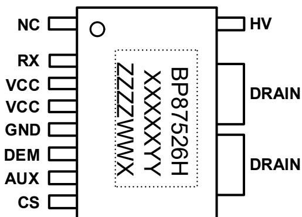  
BP87526H：产品型号  
图 2. ESOP-10 管脚封装图（底部 pad 为 DRAIN）

XXXXXYY: 批次号

ZZZZ: 内部标示

WW：周号

X：保留位

## 管脚描述

<table><tr><td>管脚号</td><td>管脚名称</td><td>描述</td></tr><tr><td>1</td><td>NC</td><td>无连接</td></tr><tr><td>2</td><td>RX</td><td>信号接收引脚,用于接收副边发送到原边的控制信号,直接连接磁耦</td></tr><tr><td>3/4</td><td>VCC</td><td>芯片供电引脚,建议接0.1μF陶瓷电容到芯片地</td></tr><tr><td>5</td><td>GND</td><td>芯片地</td></tr><tr><td>6</td><td>DEM</td><td>漏极电压谷底检测引脚,同时用于检测输出电压</td></tr><tr><td>7</td><td>AUX</td><td>辅助供电引脚,连接到辅助供电滤波电容正端</td></tr><tr><td>8</td><td>CS</td><td>电流采样输入端,电流采样电阻接CS引脚和地之间</td></tr><tr><td>9/10/底部pad</td><td>DRAIN</td><td>功率MOSFET漏极</td></tr><tr><td>11</td><td>HV</td><td>高压启动引脚,同时用于检测输入电压</td></tr></table>

## 推荐输出功率(注 1)

<table><tr><td>型号</td><td>峰值输出功率</td><td>连续输出功率</td></tr><tr><td>BP87526H</td><td>36 W(持续 30 分钟)</td><td>24 W</td></tr></table>

注 1：输出功率取决于外部散热条件和持续时间，表中为全电压输入、封闭式塑料外壳、40°C 环境温度下的典型值。

极限参数(注 2)

<table><tr><td>符号</td><td>参数</td><td>参数范围</td><td>单位</td></tr><tr><td> $V_{DRAIN}$ </td><td>内部高压功率管耐压</td><td>-0.3~800</td><td>V</td></tr><tr><td> $V_{HV}$ </td><td>HV引脚电压</td><td>-0.3~700</td><td>V</td></tr><tr><td> $V_{AUX}$ </td><td>AUX引脚电压</td><td>-0.3~150</td><td>V</td></tr><tr><td> $V_{CC}$ </td><td>VCC电压</td><td>-0.3~39</td><td>V</td></tr><tr><td> $V_{RX}$ </td><td>RX引脚电压</td><td>-0.3~7</td><td>V</td></tr><tr><td> $V_{CS}$ </td><td>CS引脚电压</td><td>-0.7-7</td><td>V</td></tr><tr><td> $V_{DEM}$ </td><td>DEM引脚电压</td><td>-0.7-7</td><td>V</td></tr><tr><td> $P_{DMAX}$ </td><td>功耗(注3)</td><td>1.47</td><td>W</td></tr><tr><td> $\theta_{JA}$ </td><td>结到环境的热阻(注4)</td><td>85</td><td>°C/W</td></tr><tr><td> $T_J$ </td><td>工作结温范围</td><td>-40 to 150</td><td>°C</td></tr><tr><td> $T_{STG}$ </td><td>储存温度范围</td><td>-55 to 150</td><td>°C</td></tr><tr><td> $T_{LEAD}$ </td><td>最高焊接温度,10sec</td><td>265</td><td>°C</td></tr><tr><td rowspan="2">ESD</td><td>除HV引脚外(注5)</td><td>2</td><td>kV</td></tr><tr><td>HV引脚</td><td>1</td><td>kV</td></tr></table>

注 2：极限参数是指超出该范围，有可能导致器件永久性损坏。极限参数为器件应⼒的额定值，⻓期工作在极限参数条件可能会影响器件的可靠性。  
注 3：温度升高最⼤功耗一定会减小，这也是由 $\tau _ { \mathfrak { M A } } , \theta _ { \mathfrak { J A } } ,$ ,和环境温度T 所决定的。最⼤允许功耗为 $\mathsf { P } _ { \mathsf { D M A X } } = ( \mathsf { T } _ { \mathsf { J M A X } } - \mathsf { T } _ { \mathsf { A } } ) /$ θ 或是极限范围给出的数字中比较低的那个值。  
注 4：1平方英寸双层PCB板，按照JEDEC 标准测试。  
注 5：人体模型，100pF电容通过1.5kΩ电阻放电。

电气参数(注6)（无特别说明情况下， ${ \sf T } _ { \sf A } = 2 5 ^ { \circ } { \sf C } )$

<table><tr><td>符号</td><td>描述</td><td>条件</td><td>最小值</td><td>典型值</td><td>最大值</td><td>单位</td></tr><tr><td colspan="7">供电部分</td></tr><tr><td> $V_{CC\_ON}$ </td><td>VCC启动电压</td><td>VCC电压上升至IC开启</td><td>14.5</td><td>15.5</td><td>16.5</td><td>V</td></tr><tr><td> $V_{CC\_UVLO}$ </td><td>VCC欠压保护电压</td><td>VCC电压下降至IC关闭</td><td>7.4</td><td>8</td><td>8.6</td><td>V</td></tr><tr><td rowspan="3"> $I_{CC}$ </td><td rowspan="3">工作电流</td><td>fs=0 kHz</td><td>190</td><td>240</td><td>320</td><td>μA</td></tr><tr><td>fs=25 kHz</td><td>340</td><td>390</td><td>450</td><td>μA</td></tr><tr><td>fs=85 kHz</td><td></td><td>800</td><td></td><td>μA</td></tr><tr><td> $V_{CC\_HV+}$ </td><td>HV启动供电的VCC阈值</td><td></td><td>8.4</td><td>9.3</td><td>10</td><td>V</td></tr><tr><td> $V_{CC\_HV-}$ </td><td>HV停止供电的VCC阈值</td><td></td><td></td><td>11.2</td><td></td><td>V</td></tr><tr><td> $V_{CC\_AUX}$ </td><td>LDO稳压输出</td><td></td><td>11.8</td><td>12.9</td><td>13.8</td><td>V</td></tr><tr><td> $V_{CC\_OV}$ </td><td>VCC过压保护阈值</td><td></td><td></td><td>36</td><td></td><td>V</td></tr><tr><td> $V_{AUX\_OV}$ </td><td>AUX过压保护阈值</td><td></td><td>85</td><td>90</td><td>95</td><td>V</td></tr><tr><td colspan="7">HV引脚</td></tr><tr><td rowspan="2"> $I_{HV}$ </td><td rowspan="2">高压启动电流</td><td>VCC≤1V,  $V_{HV}=100V$ </td><td>0.1</td><td>0.17</td><td>0.2</td><td>mA</td></tr><tr><td>VCC&gt;1V,  $V_{HV}=100V$ </td><td>1.6</td><td>2</td><td>2.4</td><td>mA</td></tr><tr><td> $I_{HV_LK}$ </td><td>HV漏电流</td><td>VCC=18V,  $V_{HV}=500V$ </td><td>5</td><td>7.7</td><td>11</td><td>μA</td></tr><tr><td> $V_{BR_IN}$ </td><td>Brown-In电压</td><td></td><td>95</td><td>100</td><td>105</td><td>V</td></tr><tr><td> $V_{BR_OUT}$ </td><td>Brown-Out电压</td><td></td><td>85</td><td>90</td><td>95</td><td>V</td></tr><tr><td> $t_{BR_OUT}$ </td><td>Brown-Out检测时间</td><td></td><td>30</td><td>32</td><td>40</td><td>ms</td></tr><tr><td> $V_{HV\_OVP}$ </td><td>输入过压保护阈值</td><td></td><td>420</td><td>440</td><td>460</td><td>V</td></tr><tr><td> $V_{HYS\_OVP}$ </td><td>输入过压保护迟滞</td><td></td><td></td><td>30</td><td></td><td>V</td></tr><tr><td> $t_{HV\_OVP}$ </td><td>输入过压保护屏蔽时间</td><td></td><td></td><td>5</td><td></td><td>μs</td></tr><tr><td> $t_{HV\_DET}$ </td><td>输入电压采样时间间隔</td><td></td><td></td><td>250</td><td></td><td>μs</td></tr><tr><td> $t_{HV\_Delay}$ </td><td>启机输入电压检测延时</td><td></td><td></td><td>64</td><td></td><td>ms</td></tr><tr><td colspan="7">控制功能</td></tr><tr><td> $f_{S\_PRI}$ </td><td>启机开关频率</td><td></td><td></td><td>25</td><td></td><td>kHz</td></tr><tr><td> $f_{S\_PRI(MIN)}$ </td><td>原边稳压最低工作频率</td><td></td><td></td><td>200</td><td></td><td>Hz</td></tr><tr><td> $f_{S\_MAX}$ </td><td>最高开关频率</td><td></td><td>130</td><td>140</td><td>150</td><td>kHz</td></tr><tr><td> $f_{S\_PWM1}$ </td><td>PWM区间1开关频率</td><td></td><td></td><td>25</td><td></td><td>kHz</td></tr><tr><td> $f_{S\_PWM2}$  $f_M$ </td><td>PWM区间2开关频率抖频调制频率</td><td></td><td></td><td>85 $f_s/128$ </td><td></td><td>kHzHz</td></tr><tr><td rowspan="2"> $f_{JITTER}$ </td><td rowspan="2">PWM频率抖动峰值</td><td> $f_S=f_{S_PWM1}$ </td><td></td><td>1</td><td></td><td>kHz</td></tr><tr><td> $f_S=f_{S_PWM2}$ </td><td></td><td>3.5</td><td></td><td>kHz</td></tr><tr><td rowspan="2"> $V_{JITTER}$ </td><td rowspan="2">CS抖动峰值</td><td> $V_{CS}<150mV$ </td><td></td><td>6</td><td></td><td>mV</td></tr><tr><td> $V_{CS}≥150mV$ </td><td></td><td>12</td><td></td><td>mV</td></tr><tr><td> $t_{ON\_MAX}$ </td><td>功率管最大导通时间</td><td></td><td></td><td>16.5</td><td></td><td>μs</td></tr><tr><td> $t_{OFF\_MIN}$ </td><td>功率管最小关断时间</td><td></td><td></td><td>2</td><td></td><td>μs</td></tr><tr><td> $t_{AR\_ON}$ </td><td>启动等待时间</td><td></td><td></td><td>80</td><td></td><td>ms</td></tr><tr><td> $t_{AR\_OFF}$ </td><td>自动重启前的停止时间</td><td></td><td></td><td>1.5</td><td></td><td>s</td></tr><tr><td> $t_{AR\_SKIP}$ </td><td>启动后通信故障屏蔽时间</td><td></td><td></td><td>1</td><td></td><td>s</td></tr><tr><td colspan="7">电流采样</td></tr><tr><td> $V_{CS\_MAX}$ </td><td>CS最大限流值</td><td></td><td>300</td><td>315</td><td>330</td><td>mV</td></tr><tr><td> $V_{CS\_MIN}$ </td><td>CS最小限流值</td><td></td><td>90</td><td>95</td><td>100</td><td>mV</td></tr><tr><td> $t_{LEB1}$ </td><td>前沿消隐时间</td><td></td><td>200</td><td>250</td><td>300</td><td>ns</td></tr><tr><td> $t_{Delay}$ </td><td>限流延迟时间</td><td></td><td></td><td>200</td><td></td><td>ns</td></tr><tr><td> $V_{CS\_SSCP}$ </td><td>次级整流管短路限流阈值</td><td></td><td></td><td>450</td><td></td><td>mV</td></tr><tr><td> $t_{LEB2}$ </td><td>整流管短路前沿消隐时间</td><td></td><td></td><td>50</td><td></td><td>ns</td></tr><tr><td> $N_{SSCP}$ </td><td>整流管短路故障连续计数</td><td></td><td></td><td>2</td><td></td><td></td></tr><tr><td> $I_{CS\_OLP}$ </td><td>CS开路保护检测电流</td><td></td><td></td><td>40</td><td></td><td>μA</td></tr><tr><td> $V_{CS\_OLP}$ </td><td>CS开路保护阈值</td><td></td><td></td><td>1</td><td></td><td>V</td></tr><tr><td> $V_{CS\_SCP}$ </td><td>CS短路保护阈值</td><td></td><td>57</td><td>60</td><td>63</td><td>mV</td></tr><tr><td rowspan="2"> $t_{CS\_SCP}$ </td><td rowspan="2">CS短路保护检测时间</td><td> $V_{in}=100Vdc$ </td><td></td><td>3.5</td><td></td><td>μs</td></tr><tr><td> $V_{in}=300Vdc$ </td><td></td><td>1.26</td><td></td><td>μs</td></tr><tr><td> $N_{CS\_SCP}$ </td><td>CS短路故障计数</td><td></td><td></td><td>2</td><td></td><td></td></tr><tr><td colspan="7">DEM引脚</td></tr><tr><td> $V_{DEM\_OVP}$ </td><td>过压保护阈值</td><td rowspan="5"> $V_{CC}=18V$ </td><td></td><td>2.5</td><td></td><td>V</td></tr><tr><td> $t_{OVP\_delay}$ </td><td>过压保护延时</td><td></td><td>5</td><td></td><td>cycle</td></tr><tr><td> $V_{DEM\_REF}$ </td><td>原边反馈参考电压</td><td></td><td>0.53</td><td></td><td>V</td></tr><tr><td> $V_{DEM\_BCM}$ </td><td>启动QR控制阈值</td><td></td><td>0.2</td><td></td><td>V</td></tr><tr><td> $V_{DEM\_SCP}$ </td><td>DEM引脚短路保护阈值</td><td></td><td>220</td><td></td><td>mV</td></tr><tr><td colspan="7">其他保护功能</td></tr><tr><td> $I_{RX\_OLP}$ </td><td>RX开路保护检测电流</td><td></td><td></td><td>32</td><td></td><td>μA</td></tr><tr><td> $V_{RX\_OLP}$ </td><td>RX开路保护阈值电压</td><td></td><td></td><td>220</td><td></td><td>mV</td></tr><tr><td> $V_{RX}$ </td><td>RX接收的最小阈值电压</td><td></td><td>8</td><td>12</td><td>16</td><td>mV</td></tr><tr><td> $T_{OTP+}$ </td><td>过温保护阈值</td><td></td><td>140</td><td>145</td><td>150</td><td>°C</td></tr><tr><td> $T_{OTP-}$ </td><td>过温保护解除阈值</td><td></td><td>97</td><td>102</td><td>107</td><td>°C</td></tr><tr><td colspan="7">功率管</td></tr><tr><td> $I_{DSS}$ </td><td>关断漏电流</td><td> $V_{DS}=800 V, V_{GS}=0 V$ </td><td></td><td></td><td>10</td><td>μA</td></tr><tr><td> $BV_{DSS}$ </td><td>功率管击穿电压</td><td> $I_D=1 mA, V_{GS}=0 V$ </td><td>800</td><td></td><td></td><td>V</td></tr><tr><td> $I_D$ </td><td>连续漏极电流</td><td> $T_C=25°C$ </td><td></td><td></td><td>4</td><td>A</td></tr><tr><td> $I_{D\_PULSE}$ </td><td>漏极脉冲电流</td><td> $T_C=25°C$ </td><td></td><td></td><td>12</td><td>A</td></tr><tr><td> $E_{AS}$ </td><td>雪崩能量(单脉冲)</td><td>VDD=50 V, L=10 mH</td><td>100</td><td></td><td></td><td>mJ</td></tr><tr><td> $R_{DS\_ON}$ </td><td>导通电阻</td><td> $V_{GS}=10 V, I_D=2 A$ </td><td></td><td>1.2</td><td>1.4</td><td>Ω</td></tr></table>

注 6：电气参数定义了器件在工作范围内并且在保证特定性能指标的测试条件下的直流和交流电参数规范。最小值和最大值由测试保证，典型值由设计、测试或统计分析保证。对于未给定上下限值的参数，该规范不予保证其精度，但其典型值合理反映了器件性能。

## 内部结构框图

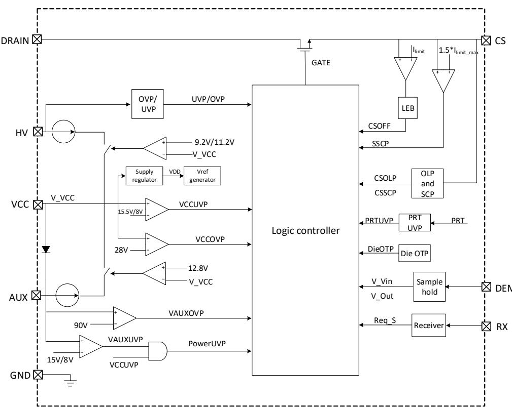  
图 3. BP87526H 内部框图

## 功能描述

BP87526H 内置了 800 V 高压 MOSFET，采用 QR ⾕底开通工作模式，较低的开关损耗使得其适用于较高的工作频率，可以减小变压器和输出滤波电容的体积。BP87526H 采用Adaptive COT 控制方式和原副边磁耦通讯，⼤幅度降低了控制电路的静态工作电流，使得系统待机功耗小于30 mW，可以满足待机功耗要求较高的应用场合。辅助供电引脚耐压可达到 150 V，能满足宽输出电压范围。BP87526H 采用ESOP-10 封装，具备较好的散热性能，同时也满足爬电距离的要求。BP87526H 内置了完备的保护功能，包括 Brown-in/out、输入过压保护、CS 引脚开路/短路保护、次级整流管短路保护、输出过压保护、VCC 过压/⽋压保护、反馈环开路保护，LPS、过温保护等。（注 7：以下描述到的参数均为电气参数列表中的典型值，除非特别说明是最⼤或最小值）

## 高压启动与 VCC 供电

BP87526H 的 HV引脚连接至整流后的高压直流，该引脚具有多个功能，包括高压启动、输入电压检测。

系统上电后，芯片内部的高压电流源对VCC电容充电。当VCC≤1 V 时，充电电流为 0.2 mA；当 VCC>1 V 时，充电电流为1 mA，这样做的目的是防止VCC电容短路时芯片损耗太⼤引起发热。由于VCC引脚和AUX引脚之间有二极管特性，因此，充电电流同时也给AUX引脚外接的电容充电。当VCC 电压上升到启动阈值电压VCC\_ON时，高压电流源关闭，芯片开始工作，此时由AUX电容和VCC电容提供芯片的工作电流，直到辅助供电达到正常。

正常工作时，辅助绕组产生的直流电压通过AUX端的LDO给VCC提供稳定的电压V 。由于AUX耐压可达150V，允许辅助供电电压有较⼤的变化范围，可轻松满足PD/PPS 快充对宽输出电压范围的要求（通常为3\~21 V）。

异常情况下，当辅助供电不足时，VCC电压下降，当下降到$\mathsf { V c c \_ H V \ d }$ 时，高压电流源再次开启，给VCC 电容充电，直到VCC电压重新回到 ${ \mathsf { V c c \_ H V - } }$ 以上。虽然HV可以提供VCC工作电流以保证芯片正常工作，但是由于是从高压供电，损耗较⼤，⻓时间工作会导致芯片过热，因此正常工作时，需要保证辅助绕组供电充足，使得VCC电压高于 VCC\_HV+。

## VCC 过压、欠压保护

当芯片检测到VCC引脚的电压高于 $\mathsf { V } _ { \mathsf { C } \mathsf { C } \_ \mathsf { O } \mathsf { v } }$ 时，则触发VCC过压保护，芯片停止开关动作，等待 $\tan \angle O F F$ 时间后再次检测VCC电压，如果故障消除则重新启动，否则继续等待tAR\_OFF时间。当VCC 电压低于 $V _ { \mathsf { C C \_ U V L O } }$ 时，则触发VCC⽋压保护，系统复位，HV高压电流源重新给VCC 电容充电。

## AUX 过压保护

当检测到AUX 引脚的电压高于 $V _ { \sf A U X \_ O V }$ 时，则触发AUX过压保护，芯片停止开关动作，等待 $\tt t _ { A R \_ O F F }$ 时间后再次检测AUX电压，如果故障消除则重新启动，否则继续等待 $\tt t _ { A R \_ O F F }$ 时间。

## 启动过程

正常工作时，系统由副边控制芯片主导控制，BP87526H 需要通过 RX 引脚接收副边控制器发送的脉冲信号，根据接收到的信号控制原边功率管的开通和峰值电流（如图 5 所示）。系统首次上电时，由于副边控制器VDD电压还未建立，不会向原边发送脉冲信号，BP87526H 自主控制功率管的开通与关断，并通过 DEM 引脚检测辅助绕组电压实现原边反馈，将输出稳定到一个较低的电压。此时原边反馈的参考电压为$V _ { D E M \_ R E F }$ ，通常将输出电压稳定在 3.3 V。原边反馈时，初级最⼤峰值电流为正常工作时的 50%，起始开关频率为固定16kHz。当检测到DEM电压达到 $V _ { D E M \_ B C M }$ 时启动QR控制。与此同时，原边开始接收来自副边的脉冲信号，当接收到有效的信号时，停止原边反馈，听从副边的控制，进入正常工作模式（如图4所示）。

如果 BP87526H 在启动后的 $\tan \_ { \tt O N }$ 时间内未接收到有效的脉冲信号，则进入自动重启时序（停止工作 $\tan \angle O F F$ 时间后再次启动）。

## 信号接收(RX)

BP87526H内置脉冲信号接收模块，检测RX引脚的信号，并对该信号进⾏解调后输入逻辑控制电路。该脉冲信号为负电压有效（如图5所示）。为了保证可靠通信，BP87526H内置了RX引脚开路保护功能。在芯片启动工作前，对RX引脚上拉I 电流，检测RX引脚电压，如果V >$V _ { \sf R X \_ O L P } ,$ ，则判定为RX开路。RX开路故障响应为锁定，一旦检测到RX引脚为开路状态，则锁定该故障，只有VCC⽋压才能清除该锁定状态。

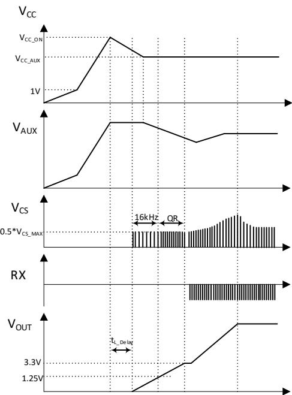  
图4. 系统启动时序

## 准谐振（QR）谷底导通

BP87526H采用准谐振(QR)工作模式，通过DEM引脚检测辅助绕组的电压信号，在漏极电压⾕底开通功率管，实现较小的开关损耗和较好的EMI 干扰。当芯片检测到DEM引脚电压达到V （200 mV）时，启动QR 控制。由于原边的自由振荡幅值随时间衰减，例如在较轻负载的条件下，经过较⻓时间后，振荡已经很小，⾕底开通的好处不明显。因此QR模块只在原边功率管关断后的31μs内工作，超过31μs，QR模块不工作。

当QR模块工作时，原边接收到副边的有效脉冲信号，延迟3μs，在3μs 内如果检测到⾕底，则⾕底开通，如果检测不到⾕底，则3μs后直接开通功率管。当QR 模块不工作时，原边接收到副边的有效脉冲信号时，只要原边检测到退磁已经完成，则立即开通功率管。如果此时还没有检测到退磁完成，则该脉冲信号被忽略。

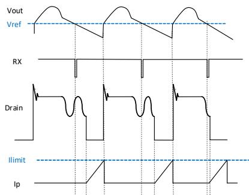  
图5. 信号接收与⾕底导通

## 控制方式

BP87526H根据接收到的脉冲信号频率调节原边峰值电流。配对的副边控制器采用自适应COT控制方式，开关频率随负载增加而增加。当负载较小，开关频率低于25 kHz时，BP87526H维持原边电流最小值 $V _ { \mathsf { C S \_ M I N } }$ 不变。当负载增加，频率上升到25 kHz时，维持开关频率不变，增加峰值电流，直到达到最⼤值 $V _ { C S \_ M A X C }$ 。负载继续增加时，维持峰值电流不变，频率随负载增加而增加，如图6 所示。由于低压输入时，初级功率管的损耗以导通损耗为主，开关损耗相对较低，因此为了优化不同输入输出电压时的效率，低压输入时降低25\~85 kHz开关频率之间的峰值电流，提前升高开关频率。同时，输出电压较低时，输出功率较小，DCM较深，降低峰值电流也可以提高效率。

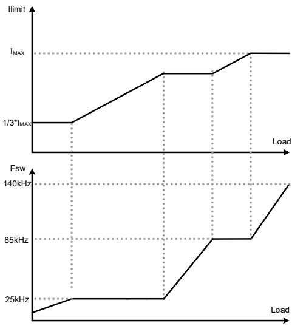  
图6. 控制曲线

## 电流检测

BP87526H通过外部电阻采样原边电流，对其逐周期限制，以实现电流模式控制。当CS 引脚电压超过设定的限制值时，在该周期剩余阶段会关断功率管，直到下一个开关周期开始。最高 CS 电压 VCS\_MAX只有 300 mV，可以有效降低 CS电阻上的损耗，提高系统效率。内置前沿消隐(LeadingEdge Blanking)时间 tLEB1可以避免由于寄生容性或次级二极管的反向恢复电流导致功率管在开通瞬间出现电流尖峰误触发关断。因此，CS 引脚无需外加RC滤波网络。

## 自动重启

启动过程中，如果BP87526H在启动后的t 时间内未接收到有效的脉冲信号，则进入自动重启时序，控制器将停止工作，等待 $\tt t _ { A R \_ O F F }$ 时间后重新启动系统。正常工作时，

BP87526H将根据RX引脚的状态，判断副边是否发生故障，如果持续tAR\_SKIP时间RX 引脚没有接收到有效脉冲信号，则控制器将停止工作，等待 $\tan \angle O F F$ 时间后重新启动系统。其它系统故障触发的自动重启时序与以上相同。

## 输入欠压、过压保护

BP87526H通过HV引脚检测输入电压，实现输入电压⽋压和过压保护。

输入电压过压保护：工作过程中，当检测到HV 电压高于VHV\_OVP并持续tHV\_OVP时间时，则触发线电压过压保护，芯片停止驱动功率管，此时芯片会通过HV 引脚持续给VCC 供电，等待 $\tan O F F$ 时间后重新启动。

输入电压⽋压保护：工作过程中，当持续tBR\_OUT时间检测到HV电压低于 $V _ { B R \_ 0 \cup T }$ 时,则触发⽋压保护，芯片停止驱动功率管，此时芯片会通过HV引脚持续给VCC 供电，等待$\tan \angle O F F$ 时间后重新启动。如果此时输入交流掉电，VCC电压下降到 $V _ { \mathsf { C C \_ U V L O } }$ 后，系统复位。

首次上电或系统自动重启时，芯片在驱动功率管之前，持续$\mathrm { \Delta t { H V \_ D e l a y } }$ 进⾏HV电压检测，如果电压正常（输入电压高于V ，同时低于 $\mathsf { V } _ { \mathsf { H V \_ O V P } } - \mathsf { V } _ { \mathsf { H Y S \_ O V P } } )$ ，将产生功率管驱动，否则触发相应的保护，直至输入电压正常。

## 频率抖动

BP87526H 采用了频率调制技术，对开关频率进⾏一定的调制，分散噪声的频谱分布，可以降低 EMI 的平均值和准峰值，能有效降低EMI传导干扰，简化系统EMI设计。

## 输出过压保护

BP87526H 通过 DEM 引脚检测输出电压，从而实现输出输出过压保护。当 DEM 引脚电压连续 5 个开关周期⼤于V 时，则触发输出过压保护，系统进入自动重启时序。

## 次级整流管短路保护

当次级整流管或变压器副边绕组短路时，原边电流通路中只剩下变压器的漏感，功率管导通后原边电流会迅速上升。而由于电流检测信号在LEB时间内被屏蔽，因此原边电流在LEB时间内会上升到一个非常⼤的值，可能会损坏功率管。BP87526H集成了二级过流保护功能，该过流保护的LEB 时间减小为t ，同时比较阈值升高为1.5 倍 $V _ { \mathsf { C S \_ M A X } }$ ，以避免影响芯片正常工作。当原边电流达到二级过流保护阈值时，芯片在该周期剩余阶段会关断功率管，直到下一个开关周期开始。如果原边电流连续两个周期达到二级过流保护阈值，则触发次级整流管短路保护，该故障的响应为自动重启。

## CS开路、短路保护

CS 开路保护：在芯片启动工作前，对CS 引脚上拉ICS\_OLP电流，检测CS 引脚电压，如果VCS>VCS\_OLP，则判定为CS 开路。CS 开路故障的响应为锁定，一旦检测到CS 引脚为开路状态，则锁定该故障，只有VCC⽋压才能清除该锁定状态。

CS 短路保护：首次上电或系统自动重启时，在起始的N 个开关周期，进⾏CS 短路状态检测。原边开关管导通tCS\_SCP时间后，芯片采样CS 引脚的电压和功率管驱动状态，当驱动为高电平同时 $V _ { C S } < V _ { C S \_ S C P } ,$ ，则在该周期剩余阶段关断功率管，直到下一个开关周期开始。连续 ${ \mathsf { N c s \_ s c p } }$ 个周期触发该事件则判定为CS 引脚短路，系统自动重启。

## 输出过流保护（Limit Power Source）

芯片通过检测CS 电压和DEM电压的退磁时间，得到输出电流信息，当检测到输出电流连续80ms超过8A，则触发输出过流保护功能，系统自动重启。

## 过温保护

BP87526H内置了过温保护电路，当结温达到过温保护阈值TOTP+时，芯片会停止工作，直到结温下降到过温保护解除阈值T 时，芯片自动重启。

## PCB Layout 指南

在设计BP87526HPCB 时，需要遵循以下建议：

1) 为了降低辐射干扰，应减小高频功率环路⾯积。初级⺟线电容、变压器绕组和芯片组成的环路⾯积尽可能小；次级绕组、二极管和输出滤波电容组成的环路⾯积尽可能小；初级绕组和钳位电路组成的环路⾯积尽可能小。

2) VCC 电容需靠近芯片VCC引脚和GND引脚。

3) CS 电阻尽量靠近CS 引脚和GND引脚。

4) 磁耦 GND 需单独走线到芯片 GND 引脚，并于 RX 并⾏走线，信号线不要铺⼤铜⽪，以避免容易受到干扰。走线尽可能短，并远离 Drian、初级钳位电路等强干扰源。

5) 芯片的 Drain 引脚能很好的起到散热作用，是器件散热的主要途径。但由于芯片Drain属于EMI动点，在满足散热的条件下铺铜⾯积应尽量小。

6) 应将Y电容放置在初级输入滤波电容正端和次级滤波电容地之间。如果输入端使用了π型 EMI 滤波器，那么滤波电感应放置在输入滤波电容的负极之间。

7) ESD放电针应直接连接在初级输入滤波电容正端和次级滤波电容地或者输出正端之间，并远离芯片控制电路。

## 封装信息

SECTION:B-B  
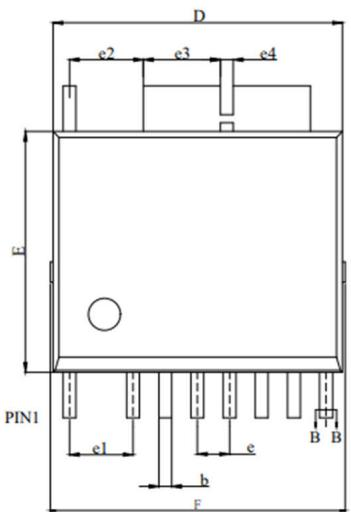

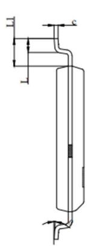  
ESOP-10 封装外形尺寸  
SIDE VIEW

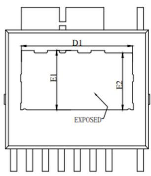  
BOTTOMVIEW

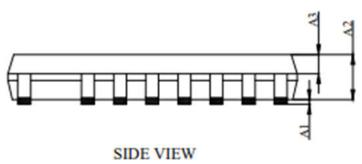

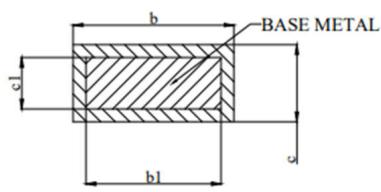

<table><tr><td>SYMBOL</td><td>MIN</td><td>NOM</td><td>MAX</td></tr><tr><td>A1</td><td>0.00</td><td>-</td><td>0.12</td></tr><tr><td>A2</td><td>1.30</td><td>1.40</td><td>1.50</td></tr><tr><td>A3</td><td>0.60</td><td>0.65</td><td>0.70</td></tr><tr><td>b</td><td>0.37</td><td>-</td><td>0.47</td></tr><tr><td>b1</td><td>0.35</td><td>-</td><td>0.45</td></tr><tr><td>c</td><td>0.17</td><td>-</td><td>0.27</td></tr><tr><td>c1</td><td>0.15</td><td>-</td><td>0.25</td></tr><tr><td>D</td><td>8.90</td><td>9.00</td><td>9.10</td></tr><tr><td>D1</td><td>6.77</td><td>-</td><td>6.97</td></tr><tr><td>E</td><td>7.40</td><td>7.50</td><td>7.60</td></tr><tr><td>E1</td><td>3.465</td><td>-</td><td>3.665</td></tr><tr><td>E2</td><td>3.365</td><td>-</td><td>3.565</td></tr><tr><td>F</td><td>9.00</td><td>-</td><td>9.40</td></tr><tr><td>e</td><td colspan="3">1.00 BSC</td></tr><tr><td>e1</td><td colspan="3">1.98 BSC</td></tr><tr><td>e2</td><td>2.20</td><td>2.30</td><td>2.40</td></tr><tr><td>e3</td><td>2.295</td><td>2.395</td><td>2.495</td></tr><tr><td>e4</td><td colspan="3">0.40 BSC</td></tr><tr><td>L</td><td>0.62</td><td>0.72</td><td>0.82</td></tr><tr><td>L1</td><td>1.32</td><td>1.42</td><td>1.52</td></tr><tr><td>θ</td><td>0°</td><td>3°</td><td>6°</td></tr></table>

COMMON DIMENSIONS (UNITS OF MEASURE=INCH)

<table><tr><td>SYMBOL</td><td>MIN</td><td>NOM</td><td>MAX</td></tr><tr><td>A1</td><td>0.000</td><td>-</td><td>0.005</td></tr><tr><td>A2</td><td>0.051</td><td>0.055</td><td>0.059</td></tr><tr><td>A3</td><td>0.024</td><td>0.026</td><td>0.28</td></tr><tr><td>b</td><td>0.015</td><td>-</td><td>0.019</td></tr><tr><td>b1</td><td>0.014</td><td>-</td><td>0.018</td></tr><tr><td>c</td><td>0.007</td><td>-</td><td>0.011</td></tr><tr><td>c1</td><td>0.006</td><td>-</td><td>0.010</td></tr><tr><td>D</td><td>0.350</td><td>0.354</td><td>0.358</td></tr><tr><td>D1</td><td>0.267</td><td>-</td><td>0.274</td></tr><tr><td>E</td><td>0.291</td><td>0.295</td><td>0.299</td></tr><tr><td>E1</td><td>0.136</td><td>-</td><td>0.144</td></tr><tr><td>E2</td><td>0.132</td><td>-</td><td>0.140</td></tr><tr><td>F</td><td>0.354</td><td>-</td><td>0.370</td></tr><tr><td>e</td><td colspan="3">0.039 BSC</td></tr><tr><td>e1</td><td colspan="3">0.078 BSC</td></tr><tr><td>e2</td><td>0.087</td><td>0.091</td><td>0.094</td></tr><tr><td>e3</td><td>0.090</td><td>0.094</td><td>0.098</td></tr><tr><td>e4</td><td colspan="3">0.016 BSC</td></tr><tr><td>L</td><td>0.024</td><td>0.028</td><td>0.032</td></tr><tr><td>L1</td><td>0.052</td><td>0.056</td><td>0.060</td></tr><tr><td>θ</td><td>0°</td><td>3°</td><td>6°</td></tr></table>

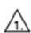

NOTES:

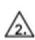

ADOES NOT INCLUDE MOLD FLASH, PROTRUSIONS OR GATE BURRS, MOLD FLASH, PROTRUSIONS AND GATE BURRS SHALL NOT EXCEED 0.008 INCH (O.2Omm) PER SIDE. DOES NOT INCLUDE INTER-LEAD FLASH OR PROTRUSIONS INTER-LEAD FLASH AND PROTRUSIONS SHALL NOT EXCEED 0.010 INCH (0.25mm) PER SIDE.

## 锡焊温度曲线

## 1. 推荐波峰焊温度曲线如下：（Wave solder，265℃ Max）

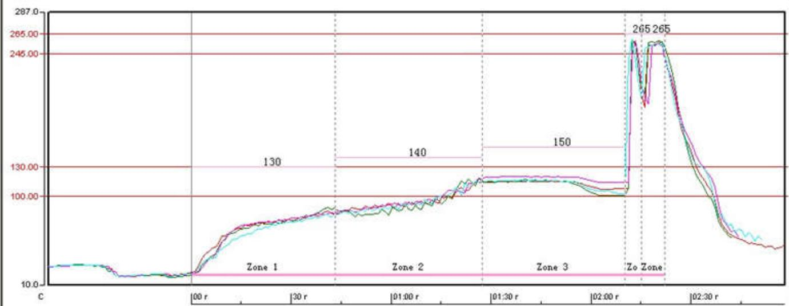

<table><tr><td></td><td></td><td>最大正斜度</td><td>设温度之间的时间</td><td>最大值温度</td><td>最大实斜度</td></tr><tr><td></td><td></td><td></td><td>100-130C</td><td></td><td></td></tr><tr><td></td><td></td><td>CHF</td><td>件</td><td>C</td><td>CHF</td></tr><tr><td>1</td><td>内接品1位置</td><td>2.708</td><td>52.997</td><td>256.8</td><td>-0.9</td></tr><tr><td>2</td><td>内接品3位置</td><td>2.794</td><td>54.997</td><td>258.1</td><td>-0.7</td></tr><tr><td>3</td><td>内接品4位置</td><td>2.705</td><td>57.997</td><td>258.4</td><td>-0.4</td></tr><tr><td>4</td><td>内接品5位置</td><td>2.790</td><td>55.997</td><td>259.7</td><td>-0.6</td></tr><tr><td></td><td>断路</td><td>0.089</td><td>5.000</td><td>2.9</td><td>0.5</td></tr><tr><td></td><td>平均值</td><td>2.7493</td><td>55.4970</td><td>258.25</td><td>-6.65</td></tr><tr><td></td><td>海方差</td><td>0.04941</td><td>2.08167</td><td>1.190</td><td>0.208</td></tr><tr><td colspan="6">速度:900mm/minProfile specification:Pre-heating:100~130, Time:≥30sPre-heating:100~130, Time:≥30sThe slope of pre-heating area≤3,The slope of cooling area:5~7Soldering wave temperature:245~265°C</td></tr></table>

## 2. 推荐低温回流焊温度曲线如下：（Low temperature reflow, $\underline { { 1 7 } } 5 ^ { \circ } \mathsf { C }$ Max）

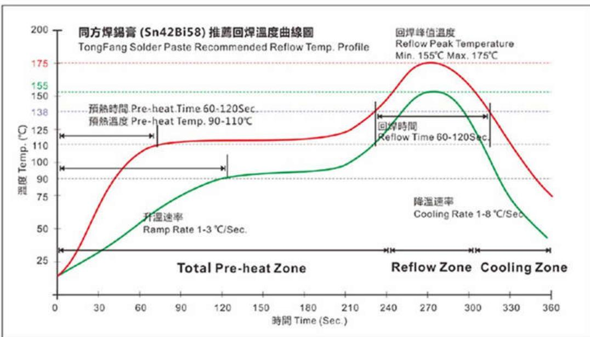

## 3. 推荐高温回流焊温度曲线如下：（High temperature reflow, 250℃ Max）

## 版本信息

<table><tr><td>版本</td><td>日期</td><td>记录</td></tr><tr><td>Rev. 1.0</td><td>2025/01</td><td>正式发行</td></tr><tr><td></td><td></td><td></td></tr></table>

## 免责声明

晶丰明源尽⼒确保本产品规格书内容的准确和可靠，但是保留在没有通知的情况下，修改规格书内容的权利。

本产品规格书未包含任何针对晶丰明源或第三方所有的知识产权的授权。针对本产品规格书所记载的信息，晶丰明源不做任何明示或暗示的保证，包括但不限于对规格书内容的准确性、商业上的适销性、特定目的的适用性或者不侵犯晶丰明源或任何第三人知识产权做任何明示或暗示保证，晶丰明源也不就因本规格书本⾝及其使用有关的偶然或必然损失承担任何责任。

## 电子器件报废说明

该产品在生命周期结束后，由客户按照一般电子产品的报废流程进行处理。