## 概述

S7302S是一款高性能高集成度单片式次级同步整流控制芯片，内部集成一个超低导通阻抗的N沟道的MOSFET以及一个同步整流的驱动及控制电路。

S7302S被设计在非连续开关模式(DCM)下工作，内部集成的高性能N沟道MOSFET具有低开启阀值电压、超低导通阻抗,超快速开关特性。同时本体寄生的二极管具备超快速的反向恢复时间。

S7302S可应用在输出为5V标准的反激控制的开关电源系统中，以替代次级整流二极管。S7302S能有效的降低次级整流管的功率损耗，内部电路通过检测MOSFET的VDS之间的电压变化产生一个理想的驱动信号来控制内部MOSFET的导通与截止。非常适合要求尺寸小，转换效率高的应用中。S7302S将为客户提供优异的解决方案。

S7302S采用SOP-8封装。

  
SOP-8 封装

## 特点

支持非连续模式(DCM)

支持准谐振模式（QRM)

内部集成高性能功率MOSFET

■高度集成，只需极少外围器件

## 应用范围

■充电器和适配器的同步整流

反激式控制器

主要用于5V2A或2.4A输出

## 典型应用

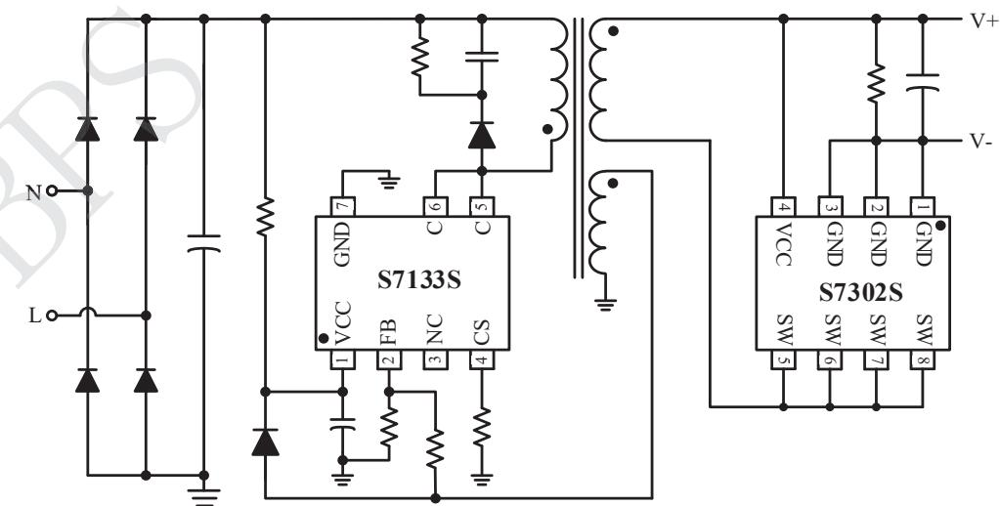  
图 1 S7302S 典型应用图

## 定购信息

<table><tr><td>定购型号</td><td>封装</td><td>温度范围</td><td>包装形式</td><td>打印</td></tr><tr><td>S7302S</td><td>SOP-8</td><td>-40°C~105°C</td><td>卷盘4000颗/盘</td><td>S7302SXXXXXXXXXXXXXXXXX</td></tr></table>

## 管脚封装

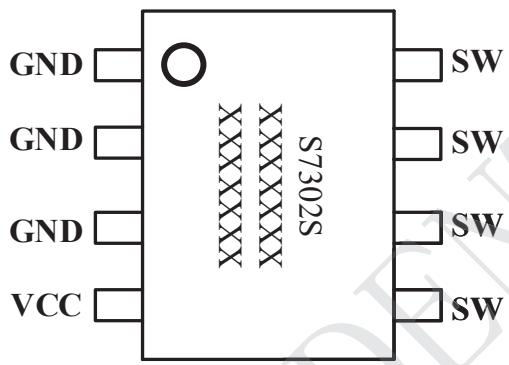  
图 2 封装管脚图

## 管脚描述

<table><tr><td>管脚号</td><td>管脚名称</td><td>描述</td></tr><tr><td>1、2、3</td><td>GND</td><td>芯片地脚</td></tr><tr><td>4</td><td>VCC</td><td>芯片电源端</td></tr><tr><td>5、6、7、8</td><td>SW</td><td>集成功率MOSFET的漏极</td></tr></table>

## 极限参数(注1)

<table><tr><td>符号</td><td>参数</td><td>参数范围</td><td>单位</td></tr><tr><td>VCC</td><td>芯片电源端</td><td>-0.3~7</td><td>V</td></tr><tr><td>SW</td><td>集成功率MOSFET的漏极</td><td>-0.3~40</td><td>V</td></tr><tr><td> $P_{DMAX}$ </td><td>功耗(注2)</td><td>0.45</td><td>W</td></tr><tr><td> $\theta_{JA}$ </td><td>PN结到环境的热阻</td><td>145</td><td>°C/W</td></tr><tr><td> $T_J$ </td><td>工作结温范围</td><td>-40~150</td><td>°C</td></tr><tr><td> $T_{STG}$ </td><td>储存温度范围</td><td>-40~150</td><td>°C</td></tr></table>

注1：最大极限值是指超出该工作范围，芯片有可能损坏。推荐工作范围是指在该范围内，器件功能正常，但并不完全保证满足个别性能指标电气参数定义了器件在工作范围内并且在保证特定性能指标的测试条件下的直流和交流电参数规范。对于未给定上下限值的参数，该规范不予保证其精度，但其典型值合理反映了器件性能。

注2：温度升高最大功耗一定会减小，这也是由TJMAx,θJA,和环境温度TA所决定的。最大允许功耗为PDMAx=(TJMAx-TA)/θJA或是极限范围给出的数字中比较低的那个值。

电气参数(注3，4)（无特别说明情况下，VCC=5V,TA=25°C)

<table><tr><td>描述</td><td>符号</td><td>条件</td><td>最小值</td><td>典型值</td><td>最大值</td><td>单位</td></tr><tr><td colspan="7">电源部分</td></tr><tr><td>静态工作电流</td><td>Iop</td><td>VCC=5V</td><td></td><td>180</td><td></td><td>uA</td></tr><tr><td>启动电压</td><td>VCC_ON</td><td></td><td></td><td>3.3</td><td></td><td>V</td></tr><tr><td>欠压锁定电压</td><td>VCC_OFF</td><td></td><td></td><td>2.9</td><td></td><td>V</td></tr><tr><td colspan="7">同步电压检测部分</td></tr><tr><td>同步管开启电压</td><td>VON_SR</td><td></td><td></td><td>-150</td><td></td><td>mV</td></tr><tr><td>同步管关闭电压</td><td>VOFF_SR</td><td></td><td></td><td>-3</td><td></td><td>mV</td></tr><tr><td>同步管开启延时</td><td>Tdon</td><td></td><td></td><td>100</td><td></td><td>nS</td></tr><tr><td>同步管关断延时</td><td>Tdoff</td><td></td><td></td><td>20</td><td></td><td>nS</td></tr><tr><td>同步管最小开启时间</td><td>Ton_min</td><td></td><td></td><td>1</td><td></td><td>uS</td></tr><tr><td>同步管最小关闭时间</td><td>Toff_min</td><td></td><td></td><td>1</td><td></td><td>uS</td></tr><tr><td colspan="7">功率 MOSFET 部分</td></tr><tr><td>功率管导通阻抗</td><td>RDS_ON</td><td>VGS=4.5V, ID=6A</td><td></td><td>20</td><td>25</td><td>mΩ</td></tr><tr><td>功率管耐压</td><td>BVDSS</td><td>VGS=0V, ID=250uA</td><td>40</td><td></td><td></td><td>V</td></tr><tr><td>开启门槛电压</td><td>VGS_TH</td><td>VDS=VGS, ID=250uA</td><td>1</td><td>1.5</td><td>2</td><td>V</td></tr></table>

注3：典型参数值为25℃下测得的参数标准。  
注4：规格书的最小、最大规范范围由测试保证，典型值由设计、测试或统计分析保证。

## 内部结构框图

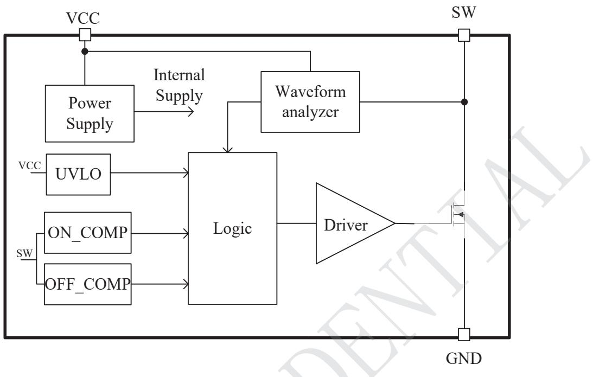  
图 3 S7302S 内部结构图

## 特性参数温度曲线

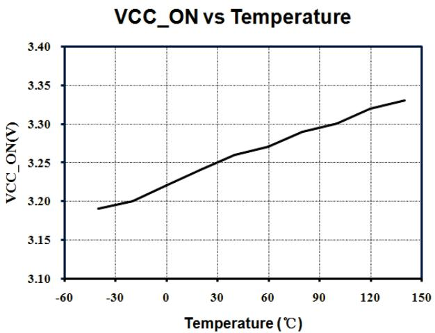

## 功能说明

S7302S 是一个应用于开关电源系统的高性能同步整流芯片，此芯片用来取代反激变换器中的肖特基二极管，可以提高效率，降低温度损耗。S7302S 可支持 DCM 和 QR工作模式满足5V充电器、适配器系统。其供电方式是通过系统输出直接供电。

## 1、VCC 欠压锁定(UVLO)

S7302S 在芯片上电过程中应用了UVLO引脚的电压上升到VCC的启动电压时，芯片从LATCH模式中恢复过来进入正常工作模式，此时功率管可以被正常开启；当 VCC 电压下降到 VCC 欠压锁定电压时芯片再次进入欠压锁定模式，功率管处于关断状态。

## 2、最小开启时间

S7302S 控制电路可以控制同步管具有最小导通功能。在功率管开启时，次边寄生元件会产生高频噪声，而这些高频噪声可能会引起功率管被误关断，而此最小导通时间可以有效屏蔽误关断信号，保证功率管可以维持1uS的开启时间。

## 3、同步整流管开启

芯片通过检测功率管的 VDS电压来控制其开启。当反激转换器原边关断，次边开始消磁时，次边电流首先通过功率管的体二极管开始续流并产生一个Vbe压降，这样功率管的漏极电压将下降到-0.7V左右。如图4所示，S7302S如果首先检测到功率管的漏极是大于0.7V，然后又检测到其电压下降到-0.15V，则会在100nS左右的延时之后，开启功率管。另外，为了避免 DCM下同步整流 SW引脚的谐振电压误开启同步整流芯片，S7302S内置伏秒乘积判断功能。为了使同步整流能正常响应原边控制器的开关系统需满足以下要求

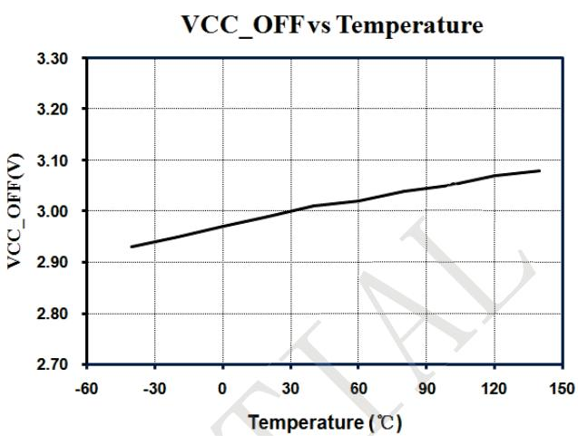

$$
\frac {I _ {\text { peak\_min }} \times L _ {p \_ \min}}{N _ {P S}} \geq 9 (V * u s)
$$

Ipeak mir，Lp min，和Nps 分别表示原边最小峰值电流，变压器原边电感最小值和原副边匝数比。

## 4、同步整流管关断

当同步管开启之后，随着次边续流电流的逐渐减小，同步管的漏端电压会逐渐上升。如图4所示，S7302S检测到次边电流小于其内部设置的关断电流后，会迅速关断功率管。

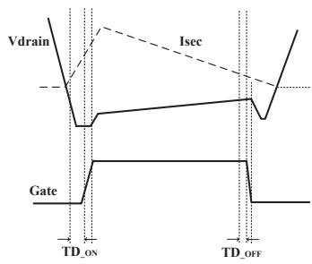  
图4 同步整流开启与关断时序

SOP-8 封装信息  
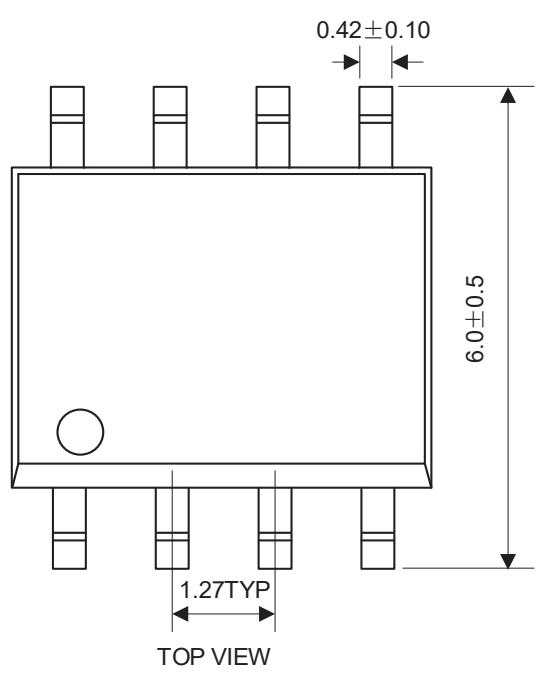

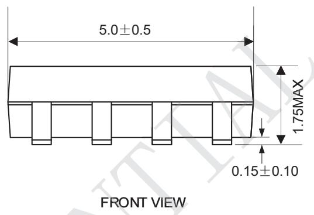

BOTTOM VIEW  
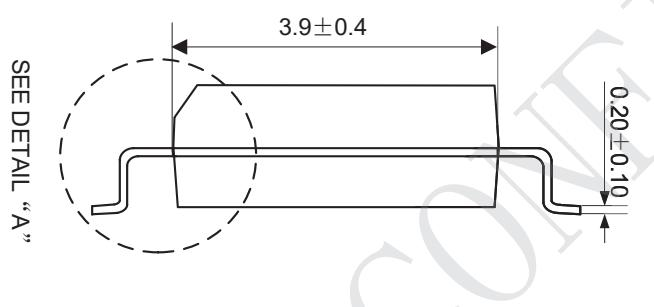

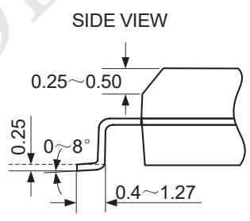  
DETAILĀAā

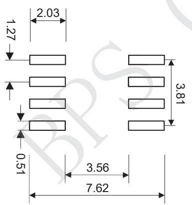  
RECOMMENDED LAND PATTERN

## NOTE:

1) ALL DIMENSIONS ARE IN MILLIMETERS. 2) EXPOSED PADDLE SIZE DOES NOT INCLUDE MOLD FLASH. 3) LEAD COPLANARITY SHALL BE 0.10 MILLIMETER MAX. 4) DRAWING CONFORMS TO JEDEC MO-229, VARIATION VEED-5. 5) DRAWING IS NOT TO SCALE.

## 版本信息

<table><tr><td>版本</td><td>日期</td><td>记录</td></tr><tr><td>Rev. 1.4</td><td>2020/11</td><td>格式修改发行</td></tr><tr><td></td><td></td><td></td></tr><tr><td></td><td></td><td></td></tr><tr><td></td><td></td><td></td></tr><tr><td></td><td></td><td></td></tr><tr><td></td><td></td><td></td></tr></table>

## 免责声明

晶丰明源尽力确保本产品规格书内容的准确和可靠，但是保留在没有通知的情况下，修改规格书内容的权利。

本产品规格书未包含任何针对晶丰明源或第三方所有的知识产权的授权。针对本产品规格书所记载的信息，晶丰明源不做任何明示或暗示的保证，包括但不限于对规格书内容的准确性、商业上的适销性、特定目的的适用性或者不侵犯晶丰明源或任何第三人知识产权做任何明示或暗示保证，晶丰明源也不就因本规格书本身及其使用有关的偶然或必然损失承担任何责任。