## 概述

BPA85963DH 是一款高性能、高集成度、低待机功耗的开关电源驱动芯片，适用于全电压 85\~265VAC 输入的 Buck、Buck-Boost 等变换器拓扑应用。

BPA85963DH 内部集成了 800V 高压 MOSFET、高压启动和自供电电路、电流采样电路以及电压反馈电路，采用先进的控制技术，无需环路补偿即可实现优异的恒压输出特性，极大地减少了外围器件数量，节省了系统成本和体积，同时提高了可靠性。

BPA85963DH 芯片采用多模式控制技术，能有效降低系统待机功耗，提高效率和改善动态性能，并减小系统工作在轻载时的音频噪声。

BPA85963DH 提供了丰富的保护功能，包括输出过压保护、输出过载保护、逐周期限流、过温保护等，使系统更加安全可靠。

BPA85963DH 采用 SOP-7 封装。

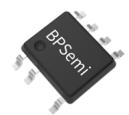  
SOP-7 封装

## 特点

 内部集成 800V 高压 MOSFET

 集成高压启动和自供电电路

 集成输出电压采样

 固定 15V 输出

 优异的动态响应速度，输出电压纹波小

 降低音频噪声的降幅调制技术

 自适应开关频率，最高 48kHz

 改善 EMI 性能的频率调制技术

 内置软启动功能

 保护功能

输出过压保护(OVP)

输出过载保护(OLP)

逐周期限流(Cycle-by-Cycle)

过温保护(OTP)

## 应用领域

 家电辅助电源

 电机驱动辅助电源

■ IOT/智能家居/智能照明

## 典型应用

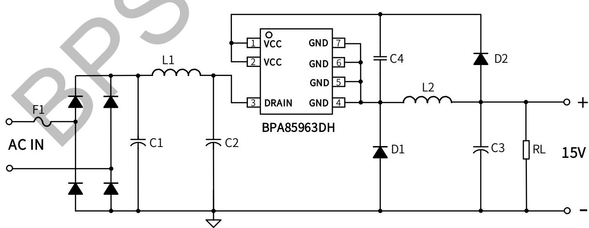  
图 1. BPA85963DH 典型 Buck 应用电路

## 定购信息

<table><tr><td>定购型号</td><td>封装</td><td>包装形式</td><td>打印</td></tr><tr><td>BPA85963DH</td><td>SOP-7</td><td>卷盘4,000只/盘</td><td>BPA85963XXXXXYHZZZWWD</td></tr></table>

## 管脚封装

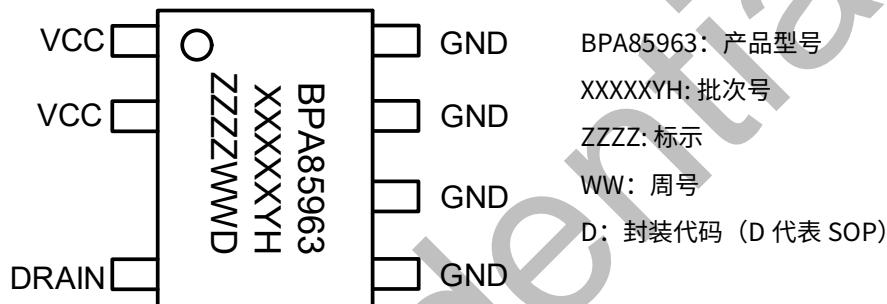

GND

ZZZZ: 标示

D：封装代码（D 代表SOP）

图 2. 管脚封装图

## 管脚描述

<table><tr><td>管脚号</td><td>管脚名称</td><td>描述</td></tr><tr><td>1、2</td><td>VCC</td><td>输出电压采样脚,同时此引脚也向芯片内部提供供电电流</td></tr><tr><td>3</td><td>DRAIN</td><td>芯片内部高压 MOSFET 漏极,此引脚也向芯片内部提供自供电电流</td></tr><tr><td>4、5、6、7</td><td>GND</td><td>芯片地,内部 MOSFET 源极</td></tr></table>

## 输出规格表

<table><tr><td>型号</td><td>输出电压</td><td>稳态输出电流(注1)</td><td>峰值输出电流(注2)</td></tr><tr><td>BPA85963DH</td><td>15V</td><td>200mA</td><td>250mA</td></tr></table>

注 1：稳态功率在半封闭式 75°C 环境下测试(Buck/Buck-boost 应用)，持续时间大于2小时。  
注 2：峰值功率在半封闭式 75°C 环境下测试(Buck/Buck-boost 应用)，持续时间大于 1 分钟。

## 极限参数(注 3) （无特别说明情况下， ${ \sf T } _ { \sf A } = 2 5 ^ { \circ } { \sf C } )$

<table><tr><td>符号</td><td>参数</td><td>参数范围</td><td>单位</td></tr><tr><td> $V_{DRAIN}$ </td><td>内部高压 MOSFET 漏极到源极电压</td><td>-0.3~800</td><td>V</td></tr><tr><td> $I_D$ </td><td>漏极连续电流</td><td>0.6</td><td>A</td></tr><tr><td> $I_{DM}$ </td><td>漏极电流脉冲(注 4)</td><td>2.4</td><td>A</td></tr><tr><td> $V_{CC}$ </td><td>Vcc 引脚电压</td><td>-0.3~20</td><td>V</td></tr><tr><td> $P_{DMAX}$ </td><td>功耗(注 5)</td><td>0.87</td><td>W</td></tr><tr><td> $θ_{JA}$ </td><td>结到环境的热阻(注 6)</td><td>145</td><td>°C/W</td></tr><tr><td> $T_J$ </td><td>工作结温范围</td><td>-40 to 150</td><td>°C</td></tr><tr><td> $T_{STG}$ </td><td>储存温度范围</td><td>-55 to 150</td><td>°C</td></tr><tr><td>ESD</td><td>人体模型 ESD(注 7)</td><td>3</td><td>kV</td></tr></table>

注 3：极限参数是指超出该工作范围，芯片有可能损坏。除非特殊说明，电压值均参考芯片 GND。电气参数定义了器件在工作范围内并且在保证特定性能指标的测试条件下的直流和交流电参数规范。对于未给定上下限值的参数，该规范不予保证其精度，但其典型值合理反映了器件性能。  
注 4：MOSFET 漏极脉冲电流的宽度受限于其可承受的最大结温。  
注 5：温度升高最大功耗一定会减小，这也是由 TJMAX, θJA,和环境温度TA所决定的。最大允许功耗为 $P _ { D M A X } = ( T _ { J M A X } - T _ { A } ) / \theta _ { J \beta }$ 或是极限范围给出的数字中比较低的那个值。

注 6：1平方英寸双层 PCB板，按照JEDEC 标准测试。

注 7：按照 JEDEC 标准测试, 100pF 电容通过 1.5KΩ电阻放电。

电气参数(注 8) （无特别说明情况下，TA =25℃）

<table><tr><td>符号</td><td>描述</td><td>条件</td><td>最小值</td><td>典型值</td><td>最大值</td><td>单位</td></tr><tr><td colspan="7">自供电</td></tr><tr><td> $V_{DS\_SUP}$ </td><td>最小漏极启动电压</td><td></td><td></td><td>40</td><td></td><td>V</td></tr><tr><td> $I_{CC}$ </td><td>芯片工作电流</td><td> $V_{FB}=15V$ </td><td></td><td>380</td><td>450</td><td>μA</td></tr><tr><td> $I_Q$ </td><td>芯片静态电流</td><td> $V_{FB}=8V$ </td><td></td><td>200</td><td>250</td><td>μA</td></tr><tr><td> $V_{CC\_ON}$ </td><td>VCC启动阈值电压</td><td>VCC电压上升至IC开启</td><td></td><td>11.5</td><td></td><td>V</td></tr><tr><td> $V_{CC\_UVLO}$ </td><td>VCC欠压保护开启电压</td><td>VCC电压下降至IC关闭</td><td></td><td>5</td><td></td><td>V</td></tr><tr><td colspan="7">输出电压反馈</td></tr><tr><td> $V_{CC\_REF}$ </td><td>VCC引脚调制电压</td><td></td><td>15</td><td>16</td><td>16.2</td><td>V</td></tr><tr><td> $V_{CC\_OLP}$ </td><td>VCC引脚过载保护电压</td><td></td><td></td><td>10.5</td><td></td><td>V</td></tr><tr><td> $t_{OLP}$ </td><td>输出过载屏蔽时间</td><td></td><td></td><td>2048</td><td></td><td>Cycles</td></tr><tr><td> $V_{CC\_OVP}$ </td><td>VCC引脚OVP电压</td><td></td><td></td><td>17.2</td><td></td><td>V</td></tr><tr><td> $t_{OVP}$ </td><td>输出过压屏蔽时间</td><td></td><td></td><td>4</td><td></td><td>Cycles</td></tr><tr><td> $t_{AR\_OFF}$ </td><td>自动重启停止时间</td><td></td><td></td><td>500</td><td></td><td>ms</td></tr><tr><td colspan="7">振荡器</td></tr><tr><td> $f_{S\_MAX}$ </td><td>最大开关频率</td><td></td><td>43</td><td>48</td><td>53</td><td>kHz</td></tr><tr><td> $f_{S\_MIN}$ </td><td>最小开关频率</td><td></td><td>0.6</td><td>1</td><td>1.4</td><td>kHz</td></tr><tr><td> $t_{ON\_MAX}$ </td><td>最大开通时间</td><td></td><td>15</td><td></td><td></td><td>us</td></tr><tr><td colspan="7">电流采样</td></tr><tr><td> $I_{LIMIT\_MAX}$ </td><td>最大电流限值</td><td></td><td>430</td><td>480</td><td>530</td><td>mA</td></tr><tr><td> $I_{LIMIT\_MIN}$ </td><td>最小电流限值</td><td></td><td></td><td>100</td><td></td><td>mA</td></tr><tr><td> $t_{LEB}$ </td><td>前沿消隐时间</td><td></td><td></td><td>350</td><td></td><td>ns</td></tr><tr><td colspan="7">功率管</td></tr><tr><td> $R_{DS\_ON}$ </td><td>功率管导通阻抗</td><td></td><td></td><td>18</td><td>22.5</td><td>Ω</td></tr><tr><td> $I_{DSS}$ </td><td>功率管关断漏电流</td><td></td><td></td><td>100</td><td></td><td>μA</td></tr><tr><td> $BV_{DSS}$ </td><td>功率管的击穿电压</td><td></td><td>800</td><td></td><td></td><td>V</td></tr><tr><td colspan="7">过热保护</td></tr><tr><td> $T_{OTP}$ </td><td>过温保护阈值</td><td></td><td></td><td>145</td><td></td><td>°C</td></tr><tr><td> $T_{HYST}$ </td><td>过温保护迟滞</td><td></td><td></td><td>40</td><td></td><td>°C</td></tr></table>

## 内部结构框图

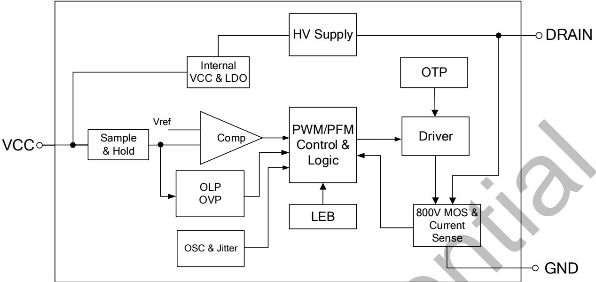  
图 3. BPA85963DH 内部框图

## 功能描述

BPA85963DH 是一款高压输入具有多个恒压输出特性的驱动芯片，采用了先进的多模式控制和环路补偿技术，无需外部补偿电路。芯片内部集成 800V 功率开关、高压自供电电路、电流采样电路、电压反馈电路，以及丰富的保护功能，只需要极少的外围器件就可以达到优异的恒压输出特性。 开关频具有较低的待机功耗、良好的输出电压调整率、较低的输出电压纹波和低音频噪声使得BPA85963DH特别适合于非隔离辅助电源应用。（注 9：以下描述到的参数均为电气参数列表中的典型值，除非特别说明是最大或最小值）

## 高压供电

BPA85963DH 集成了高压启动与自供电电路。系统上电后，母线电压上升，当母线电压达到最小漏极启动电压 VDS\_SUP充电。当内置VCC电容电压达到芯片启动阈值11.5V时，芯片内部控制电路开始工作。当 VCC 电容电压降低到欠压保护阈值 5V 时，芯片关断内部 MOSFET。芯片正常工作时，在MOSFET 关断期间，自供电电路通过 DRAIN 端对内置 VCC电容供电。

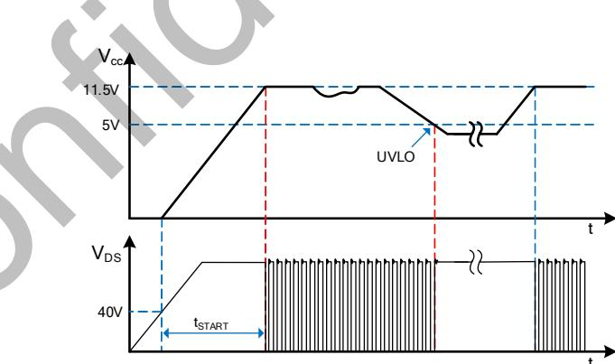  
图 4. 高压启动与 VCC 欠压保护时序

## 软启动

BPA85963DH 具有软启动功能，在软启动过程中，MOSFET峰值电流(限流点)逐渐增加。由于启动时输出电压一般较低，MOSFET 关断期间输出电压对电感的去磁较少，电感电流进入深度连续模式(CCM)，使得续流二极管的反向恢复电流较大。续流二极管反向恢复电流会通过MOSFET并产生损耗，过大的电流尖峰还可能会导致MOSFET损坏。软启动电路通过控制启动过程中MOSFET峰值电流逐渐增加，可以有效降低二极管的反向恢复电流，从而降低MOSFET电流应力。 由保护电路触发产生的重启动也会经历一次软启动过程，以避免输出电压过冲。软启动过程如图5所示，起始限流值为50%最大限流值，32 个开关周期(T )后增加到 75%最大限流值，再持续 32 个开关周期后结束软启动，限流值变为最大值。

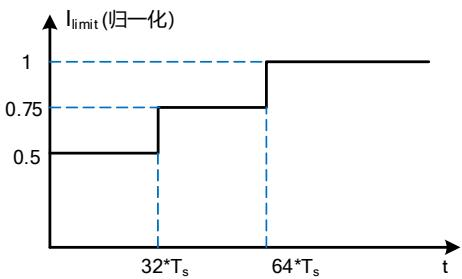  
图 5. 软启动过程

## 输出电压采样

BPA85963DH 通过 VCC 引脚采样输出电压，如图 6 所示，VCC 电压经内部电阻分压后与内部基准电压进行运算实现恒压控制。输出电压采样仅在续流状态 3μs 时进行，电感设计时建议留足余量，以防止无法正确采样输出电压导致工作异常。

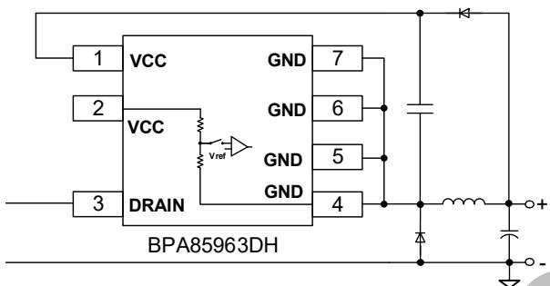  
图 6. 输出电压采样示意图

## 多模式控制

BPA85963DH采用PWM/PFM多模式控制技术，能有效降低系统待机功耗，提高平均效率，并减小系统工作在轻载时的噪声。电感峰值电流控制模式，具有较快的动态响应速度。如图7所示，重载条件下，芯片工作在PFM模式，MOSFET限流点（电感峰值电流）保持最大值 ILIMIT\_MAX 不变，开关频率随负载增加而升高，最高为 fS\_MAX (48kHz)。随着负载减小，开关频率降低，达到 22kHz 后芯片进入 PWM 工作模式。PWM 模式下开关频率保持 22kHz 不变，MOSFET 限流点随负载减小而降低，随着负载的继续减小， 芯片进入 PFM 工作模式。MOSFET 限流点保持 ILIMIT\_MIN 不变，开关频率降低，直到空载条件下，开关频率降低到最小值 $\mathsf { f } _ { \mathsf { S } \_ \mathsf { M I N } }$ (1kHz)。轻载和空载条件下，较小的电感峰值电流在磁芯中产生的磁通密度也相应减小，因此能有效抑制音频噪声。

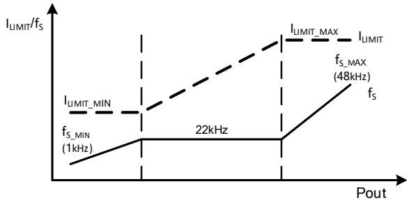  
图 7. 控制模式

## 电流检测

BPA85963DH 内部集成电流采样电路，无需外置电流采样电阻，对MOSFET电流逐周期限制。控制电路开通 MOSFET 极电流上升，当电流上升达到内部限制值时，控制电路关断 MOSFET，直到下一个开关周期开始。内置前沿消隐(Leading Edge Blanking)时间，tLEB 可以避免由于外部电路的容性或二极管的反向恢复导致MOSFET在开通瞬间出现的电流尖峰误触发MOSFET关断。

## 自动重启

当外部故障 （如过压、过载）触发相应的保护，控制电路关系统停止工作。BPA85963DH内部的自动重启电路等待 $\tt t _ { A R \_ O F F }$ (500ms)时间后重新启动系统，如果启动后故障没有消除，则重新触发相应的保护。每次重启都会经历软启动过程。

## 过载保护/输出过压保护

BPA85963DH 内部控制电路通过 VCC 引脚检测输过载故障和输出过压故障。如图 8 所示，系统上电启动后，如果芯片检测到 VCC 电压低于 $V _ { \mathsf { C C } } \mathsf { _ { o L P } }$ (10.5V)且持续 2048 个开关周期，则触发过载保护(OLP)并进入自动重启程序。当 VCC 电压连续 4 个开关周期高于 VCC\_OVP (17.2V)时，触发输出过压保护，芯片进入自动重启程序。

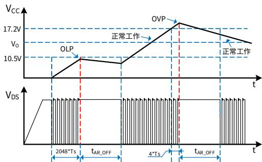  
图 8. 过载保护、输出过压保护工作模式

## 过温保护

BPA85963DH 内置了过温保护电路。当结温达到过温保护阈值 ${ \sf T } _ { 0 \bar { 1 } \mathsf { P } } ( 1 4 5 ^ { \circ } { \mathsf { C } } )$ 时，芯片会停止工作，MOSFET关断，直到结温下降到 $T _ { 0 \mathsf { T P } ^ { - } } \mathsf { T } _ { \mathsf { H Y S T } }$ 时，芯片重新启动。THYST(40℃)为过温保护迟滞，较大的温度迟滞有利于把系统整体温度控制在较低水平。

## 封装信息

SOP-7 封装外形尺寸  
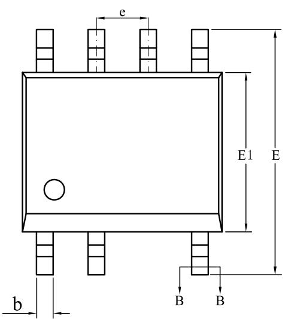

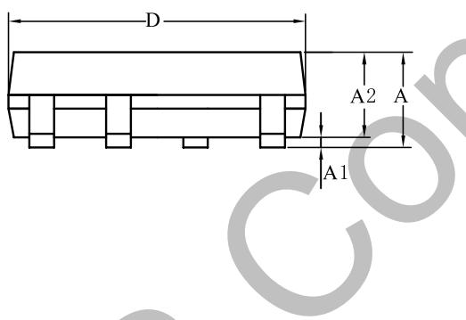

BASE METAL

WITH PLATING

SECTION B-B

<table><tr><td rowspan="2">SYMBOL</td><td colspan="3">MILLIMETER</td></tr><tr><td>MIN</td><td>NOM</td><td>MAX</td></tr><tr><td>A</td><td>1.30</td><td>—</td><td>1.80</td></tr><tr><td>A1</td><td>0.10</td><td>—</td><td>0.25</td></tr><tr><td>A2</td><td>1.25</td><td>—</td><td>1.65</td></tr><tr><td>b</td><td>0.33</td><td>—</td><td>0.51</td></tr><tr><td>c</td><td>0.17</td><td>—</td><td>0.25</td></tr><tr><td>D</td><td>4.70</td><td>4.90</td><td>5.10</td></tr><tr><td>E</td><td>5.80</td><td>6.00</td><td>6.20</td></tr><tr><td>E1</td><td>3.70</td><td>3.90</td><td>4.10</td></tr><tr><td>e</td><td colspan="3">1.27BSC</td></tr><tr><td>L</td><td>0.40</td><td>—</td><td>1.00</td></tr></table>

版本信息

<table><tr><td>版本</td><td>日期</td><td>记录</td></tr><tr><td>Rev.1.0</td><td>2026/06</td><td>首次发行</td></tr></table>

## 免责声明

晶丰明源尽力确保本产品规格书内容的准确和可靠，但是保留在没有通知的情况下，修改规格书内容的权利。

本产品规格书未包含任何针对晶丰明源或第三方所有的知识产权的授权。针对本产品规格书所记载的信息，晶丰明源不做任何明示或暗示的保证，包括但不限于对规格书内容的准确性、商业上的适销性、特定目的的适用性或者不侵犯晶丰明源或任何第三人知识产权做任何明示或暗示保证，晶丰明源也不就因本规格书本身及其使用有关的偶然或必然损失承担任何责任。

## 电子器件报废说明

该产品在生命周期结束后，由客户按照一般电子产品的报废流程进行处理。