## 集成高效率非隔离反激式开关电源驱动芯片

## 概述

BPA86015G 是一款高性能、高集成度、低待机功耗的开关电源驱动芯片，适用于全电压范围 85\~265VAC 输入的非隔离式反激式变换器应用，无需光耦，直接反馈。在限定输出电压范围内可通过输出绕组直接供电，无需额外辅助绕组供电。

BPA86015G 内部集成了 800V 高压 MOSFET、高压启动恒流源等。芯片有多种控制模式：在重载时，工作在 PFM 模式；在额定满载/中载时，可能工作在 PWM+PFM 模式；在轻载时，进入 Burst mode，降低待机功耗。芯片具有抖频功能以实现优异的 EMI 性能。内置峰值电流补偿电路，可以使不同交流电压输入时的极限输出功率一致。内置软启动功能可以在上电过程中减小电流尖峰，防止变压器饱和，提高系统可靠性。

BPA86015G 提供了丰富的保护功能，包括输出过压保护、输出短路保护、输出过载保护、逐周期限流、过温保护等。通过BR 脚可以检测输入过压和欠压，能有效保护功率 MOSFET，使系统更加安全可靠。

BPA86015G 采用 SMD-7 封装，具备较好的散热性能，同时满足爬电距离的要求，使得芯片能够应用于较复杂的工作环境。

SMD-7 封装  

## 特点

 内部集成 800V 高压 MOSFET

 集成高压启动

 无需光耦，直接反馈

 省去辅助绕组，直接供电

 低待机功耗

 峰值电流补偿功能

 改善 EMI 抖频功能

 高低压脚之间爬电距离>3mm

 保护功能

 输入欠压保护(Brown-in/out)

 输入过压保护(Bus OVP)

输出短路保护(SCP)

输出过压保护(Output OVP)

输出过载保护(OLP)

逐周期限流(Cycle-by-Cycle)

迟滞过温保护(OTP)

## 应用领域

 非隔离辅助电源

电机驱动电源

 空调外机辅助电源

## 典型应用

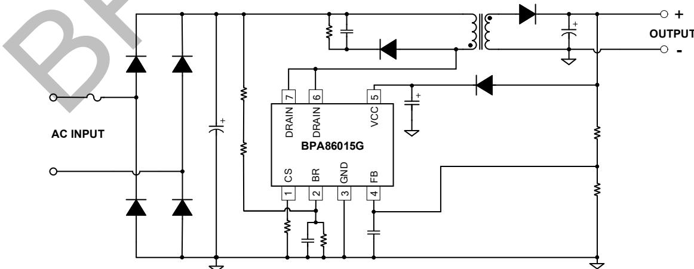  
图 1. BPA86015G 典型非隔离反激应用电路

## 定购信息

<table><tr><td>定购型号</td><td>封装</td><td>包装形式</td><td>打印</td></tr><tr><td>BPA86015G</td><td>SMD-7</td><td>盘卷1000颗/盘</td><td>BPA86015XXXXYYZZZZWWG</td></tr></table>

## 管脚封装

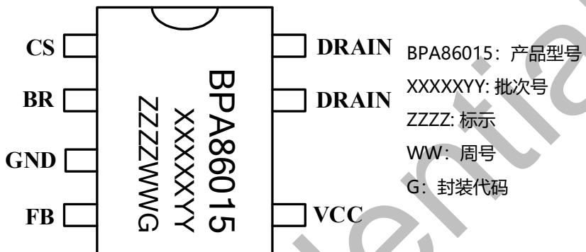  
图 2. SMD-7 管脚封装图

## 管脚描述

<table><tr><td>管脚号</td><td>管脚名称</td><td>描述</td></tr><tr><td>1</td><td>CS</td><td>电流采样端</td></tr><tr><td>2</td><td>BR</td><td>输入电压检测端,如果接地则禁用此引脚功能</td></tr><tr><td>3</td><td>GND</td><td>芯片地</td></tr><tr><td>4</td><td>FB</td><td>输出反馈端</td></tr><tr><td>5</td><td>VCC</td><td>电源供电端</td></tr><tr><td>6、7</td><td>DRAIN</td><td>功率 MOSFET 漏极</td></tr></table>

## 输出功率推荐表

<table><tr><td colspan="5">输出功率表</td></tr><tr><td rowspan="2">型号</td><td colspan="2">230VAC ±15%</td><td colspan="2">85~265VAC</td></tr><tr><td>适配器(注 1)</td><td>开放式(注 2)</td><td>适配器(注 1)</td><td>开放式(注 2)</td></tr><tr><td>BPA86015G</td><td>23W</td><td>32W</td><td>17W</td><td>21W</td></tr></table>

注 1： 最小连续输出功率，测试条件为封闭式塑料外壳，环境温度为 50℃。  
注 2： 最小连续输出功率，测试条件为开放式环境，环境温度为 50℃。

## 极限参数(注 3)

<table><tr><td>符号</td><td>参数</td><td>参数范围</td><td>单位</td></tr><tr><td> $V_{DRAIN}$ </td><td>高压 MOSFET 漏极到源极电压</td><td>-0.3~800</td><td>V</td></tr><tr><td> $I_D$ </td><td>漏极连续电流</td><td>3</td><td>A</td></tr><tr><td> $I_{DM}$ </td><td>漏极脉冲电流(注 4)</td><td>8</td><td>A</td></tr><tr><td> $V_{CC}$ </td><td> $V_{CC}$ 电压</td><td>-0.3~40</td><td>V</td></tr><tr><td> $I_{CC\_MAX}$ </td><td> $V_{CC}$ 引脚最大电流</td><td>20</td><td>mA</td></tr><tr><td> $V_{FB}$ </td><td>输出电压反馈端电压</td><td>-0.3~7</td><td>V</td></tr><tr><td> $V_{BR}$ </td><td>BR PIN 电压</td><td>-0.3~7</td><td>V</td></tr><tr><td> $V_{CS}$ </td><td>电流采用端电压</td><td>-0.3~7</td><td>V</td></tr><tr><td> $P_{DMAX}$ </td><td>功耗(注 5)</td><td>1.5</td><td>W</td></tr><tr><td> $θ_{JA}$ </td><td>结到环境的热阻(注 6)</td><td>80</td><td>°C/W</td></tr><tr><td> $T_J$ </td><td>工作结温范围</td><td>-40 to 150</td><td>°C</td></tr><tr><td> $T_{STG}$ </td><td>储存温度范围</td><td>-55 to 150</td><td>°C</td></tr><tr><td>ESD</td><td>人体模型 ESD(注 7)</td><td>5</td><td>kV</td></tr></table>

注 3：极限参数是指超出该工作范围，芯片有可能损坏。电气参数定义了器件在工作范围内并且在保证特定性能指标的测试条件下的直流和交流电参数规范。对于未给定上下限值的参数，该规范不予保证其精度，但其典型值合理反映了器件性能。  
注 4：MOSFET 漏极脉冲电流的宽度受限于其可承受的最大结温。  
注 5：温度升高最大功耗一定会减小，这也是由 TJMAX, $\mathsf { \theta } _ { \mathsf { J A } }$ ,和环境温度 $\mathsf { T } _ { \mathsf { A } }$ 所决定的。最大允许功耗为 $P _ { \mathsf { D M A X } } = ( \mathsf { T } _ { \mathsf { J M A X } } - \mathsf { T } _ { \mathsf { A } } ) / \mathsf { \theta } _ { \mathsf { J A } }$ 或是极限范围给出的数字中比较低的那个值。  
注 6：1 平方英寸双层 PCB 板，按照 JEDEC 标准测试。  
注 7：按照 JEDEC 标准测试, 100pF 电容通过 1.5kΩ电阻放电。

电气参数 (注 8)（无特别说明情况下， ${ \bar { \mathsf { T } } } _ { \mathsf { A } } = 2 5 ^ { \circ } { \mathsf { C } } )$

<table><tr><td>符号</td><td>描述</td><td>条件</td><td>最小值</td><td>典型值</td><td>最大值</td><td>单位</td></tr><tr><td colspan="7">VCC供电部分</td></tr><tr><td> $V_{CC\_ON}$ </td><td>VCC启动电压</td><td></td><td>13</td><td>15</td><td>16.2</td><td>V</td></tr><tr><td> $V_{CC\_OFF}$ </td><td>VCC关断电压</td><td></td><td></td><td>8.5</td><td></td><td></td></tr><tr><td> $V_{CC\_HYS}$ </td><td>VCC电压迟滞</td><td></td><td></td><td>6.5</td><td></td><td>V</td></tr><tr><td> $I_{S1}$ </td><td>VCC待机电流</td><td> $V_{FB}>1.2V$ </td><td></td><td>1.15</td><td></td><td>mA</td></tr><tr><td> $I_{S2}$ </td><td>VCC工作电流</td><td> $V_{FB}=0.5V$ </td><td></td><td>2.1</td><td></td><td>mA</td></tr><tr><td> $V_{CC\_HOLD}$ </td><td>VCC维持电压</td><td></td><td></td><td>9.6</td><td></td><td>V</td></tr><tr><td> $V_{CC\_OVP}$ </td><td>VCC过压保护点</td><td></td><td></td><td>30</td><td></td><td>V</td></tr><tr><td colspan="7">振荡器</td></tr><tr><td> $f_{OSC}$ </td><td>振荡器频率</td><td>平均值</td><td>90</td><td>100</td><td>110</td><td>kHz</td></tr><tr><td> $\Delta f_{OSC\_JITTER}$ </td><td>抖频范围</td><td></td><td></td><td>16</td><td></td><td>kHz</td></tr><tr><td> $f_{M}$ </td><td>调制频率</td><td></td><td></td><td>256</td><td></td><td>Hz</td></tr><tr><td> $f_{OSC\_MIN}$ </td><td>降频后的振荡频率</td><td></td><td></td><td>26</td><td></td><td>kHz</td></tr><tr><td> $D_{MAX}$ </td><td>最大占空比</td><td></td><td>70</td><td>78</td><td>85</td><td>%</td></tr><tr><td colspan="7">输出反馈部分</td></tr><tr><td> $VFB_{REF}$ </td><td>反馈基准电压</td><td></td><td></td><td>1.19</td><td></td><td>V</td></tr><tr><td> $TD_{FBOLP}$ </td><td>输出过载保护检测延时</td><td>75ms</td><td></td><td>75</td><td></td><td>ms</td></tr><tr><td colspan="7">电流采样</td></tr><tr><td> $VCS_{LIMIT}$ </td><td>CS LIMIT电压</td><td> $T_j=25°C$ </td><td></td><td>0.97</td><td></td><td>V</td></tr><tr><td> $T_{LEB}$ </td><td>前沿消隐时间</td><td> $T_j=25°C$ </td><td></td><td>400</td><td></td><td>ns</td></tr><tr><td> $T_{ILD}$ </td><td>电流限流延迟时间</td><td> $T_j=25°C$ </td><td></td><td>100</td><td></td><td>ns</td></tr><tr><td> $VCS_{D\_SHORT}$ </td><td>输出二极管短路保护点</td><td> $T_j=25°C$ </td><td></td><td>1.5</td><td></td><td>V</td></tr><tr><td colspan="7">功率管 MOSFET</td></tr><tr><td>RDS_ON</td><td>功率管导通阻抗</td><td> $I_D=400mA, T_j=25°C$ </td><td></td><td>4.0</td><td></td><td>Ω</td></tr><tr><td>IDSS</td><td>功率管关断漏电流</td><td> $V_{DS}=560V, T_j=25°C$ </td><td></td><td></td><td>50</td><td>μA</td></tr><tr><td> $BV_{DSS}$ </td><td>功率管的击穿电压</td><td> $T_j=25°C$ </td><td>800</td><td></td><td></td><td>V</td></tr><tr><td> $V_{SUP}$ </td><td>漏极供电启动电压</td><td> $T_j=25°C$ </td><td></td><td>50</td><td></td><td>V</td></tr><tr><td colspan="7">BR脚功能</td></tr><tr><td> $V_{BR(IN)}$ </td><td>输入开启电压</td><td> $T_j=25°C$ </td><td>0.73</td><td>0.9</td><td>1.07</td><td>V</td></tr><tr><td> $V_{BR(OUT)}$ </td><td>输入欠压点</td><td> $T_j=25°C$ </td><td>0.63</td><td>0.8</td><td>0.97</td><td>V</td></tr><tr><td> $V_{BR(CLAMP)}$ </td><td>BR钳位电压</td><td> $I_{BR}=100μA$ </td><td></td><td>5.5</td><td></td><td>V</td></tr><tr><td> $V_{BR(DIS)}$ </td><td>输入检测屏蔽电压</td><td> $T_j=25°C$ </td><td></td><td>0.2</td><td></td><td>V</td></tr><tr><td> $V_{BR(OVP)}$ </td><td>输入过压点</td><td></td><td>3.7</td><td>4</td><td>4.3</td><td>V</td></tr><tr><td colspan="7">过温保护</td></tr><tr><td> $T_{OTP}$ </td><td>过热保护阈值</td><td></td><td></td><td>150</td><td></td><td>°C</td></tr><tr><td> $T_{HYST}$ </td><td>过热保护迟滞</td><td></td><td></td><td>40</td><td></td><td>°C</td></tr></table>

注 8：规格书的最小、最大规范范围由测试保证，典型值由设计、测试或统计分析保证。

## 内部结构框图

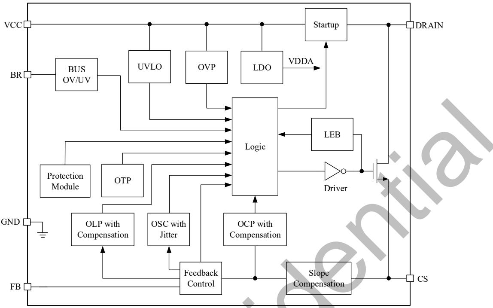  
图 3. BPA86015G 内部框图

## 功能描述

BPA86015G 是一款高性能、高集成度、低待机功耗的开关电源驱动芯片，适用于全电压范围 85\~265VAC 输入的非隔离式反激式变换器应用，无需光耦，直接反馈。在限定输出电压范围内可通过输出绕组直接供电，无需额外辅助绕组供电。BPA86015G 内部集成了 800V 高压 MOSFET、高压启动恒流源、斜坡补偿电路等（如图 3 所示）。芯片有多种控制模式：在重载时，工作在 PFM 模式；在额定满载/中载时，工作在 PWM+PFM 模式；在轻载时，进入 Burst mode，降低待机功耗。芯片具有抖频功能以实现优异的 EMI 性能。内置率一致。内置软启动功能可以在上电过程中减小电流尖峰，防止变压器饱和，提高系统可靠性。

BPA86015G 提供了丰富的保护功能，包括输出过压保护、输出短路保护、输出过载保护、逐周期限流、过温保护等。通过 BR 脚也可以检测输入过压和欠压，能有效保护功率MOSFET，使系统更加安全可靠。（注 9：以下描述到的参数均为电气参数列表中的典型值，除非特别说明是最大或最小值）

高压启动供电与 VCC 供电

系统上电后，当母线电压达到芯片漏极供电启动电压 $\mathsf { V } _ { \mathsf { S U P } }$ 时，内部高压启动电路通过 DRAIN 端对 VCC 电容充电。当 VCC电压达到芯片启动阈值电压 $\mathsf { V } _ { \mathsf { C C } , \mathsf { O N } }$ （15V）时，芯片内部控制电路开始工作。

## VCC 欠压保护

VCC 引脚具有欠压保护功能。工作过程中，由于异常导致VCC 电压下降到低于 $\mathsf { V } _ { \mathsf { C C } , \mathsf { O N } } \mathrm { - V } _ { \mathsf { C C } , \mathsf { H Y S } }$ （8.5V）时，欠压保护电路使芯片关断功率 MOSFET，停止开关动作。VCC 电压需要回升到 $\mathsf { V } _ { \mathsf { C C , O N } }$ （15V）才能重新开启功率 MOSFET，并且会进入软启动过程（图 4 所示）。

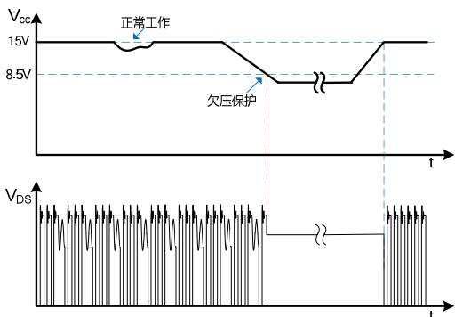  
图 4. VCC 欠压保护时序

## VCC 引脚实现输出过压保护

VCC 引脚同时可用来实现输出过压保护功能，当 VCC 引脚的电压超过 OVP 阈值电压 $\mathsf { V } _ { \mathsf { C C } \mathsf { \circ v p } }$ （30V）时，则触发 $\mathsf { V } _ { \mathsf { C C } \mathsf { \circ v p } }$ 保护。OVP 保护期间，IC 关闭 MOSFET，输出电压下降，VCC 电压下降，直到降至关断电压点 8.5V，高压启动恒流源重新对 VCC 电容充电，电压达到 $\mathsf { V } _ { \mathsf { C C , O N } }$ (15V)时芯片重新启动，进入下一个 VCC 电压检测周期，如果故障一直存在则保持自动重启。VCC 电容除起到内部滤波的作用，还作为外部滤波器，避免交流纹波电压引起保护电路误触发。为使电容达到有效的高频滤波，应将电容尽量靠近 VCC 引脚（如图 5所示）。

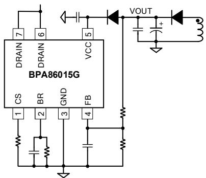  
图 5. VCC 引脚实现输出电压保护

## 软起动

芯片具有软启动功能，在软启动过程中，MOSFET 峰值电流(限流点)逐渐增加。由于启动时输出电压一般较低，MOSFET关断期间输出电压对变压器的去磁较少，容易进入深度连续模式(CCM) 使得次级整流二极管的反向恢复电流较大而导致很高的反向电压尖峰；同时由于去磁较少，原边电流在前沿消隐时间内逐渐累积，可能超过 MOSFET 安全工作区而导致失效。软启动电路通过控制启动过程中 MOSFET 峰值电流逐渐增加，可以避免原边累积过大的电流，从而降低 MOSFET电流应力和降低次级二极管的电压尖峰。（软启动过程如图 6所示），起始限流值为 $4 0 \% ^ { \star } \vert _ { \mathsf { L I M I T \_ M A X } }$ ，软启动时间为 8.4ms。如果输出电压在 8.4ms 内达到预设值，则结束软启动。由保护电路触发产生的自动重启也会经历一次软启动过程。

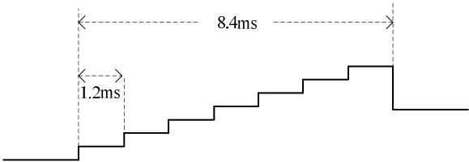  
图 6. 软启动过程

## 多模式控制

BPA86015G 具有 PFM/PWM 多种控制模式。在不同负载条件下，通过检测内部 EA 的输出电压 V 来改变工作模式。在重载时 $( \mathsf { V } _ { \mathsf { C O M P } } { > } 3 . 8 \mathsf { V } )$ ，工作在 PWM 模式，开关频率为100kHz。在中轻载时 $\cdot ( \mathsf { V } _ { \mathsf { C O M P 3 } } < \mathsf { V } _ { \mathsf { C O M P } } < 3 . 8 \mathsf { V } )$ )进入 PFM 模式，开关频率从 100kHz 降到 25kHz，以提高转换效率。在空载或负载较轻时 $( \mathsf { V } _ { \mathsf { C O M P } } { < } \mathsf { \bar { V } } _ { \mathsf { C O M P } 2 } )$ )进入 Burst 模式。不同芯片控制曲线阈值会有偏差。曲线如图 7 所示。

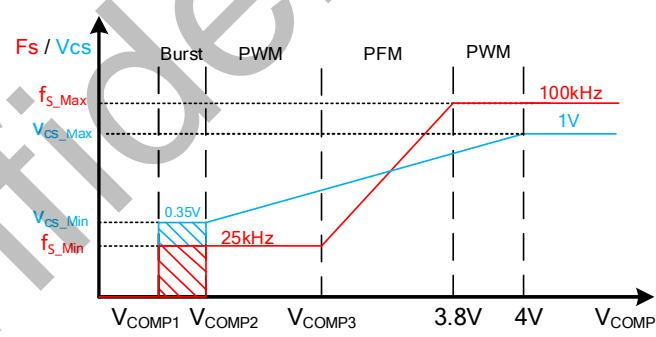  
图 7. 控制模式

## 电流检测与限制

BPA86015G 芯片内部集成电流检测电路，对 MOSFET 电流逐周期限制，通过外部电流采样电阻，以实现电流模式控制。当电流超过设定的限流点阈值 $( \mathsf { I } _ { \mathsf { L I M I } }$ )时，在该周期剩余阶段会关断功率 MOSFET，直到下一个开关周期开始。内置前沿消隐(Leading Edge Blanking)时间 $\mathbf { t } _ { \mathtt { L E B } }$ 可以避免由于外部电路的容性或次级二极管的反向恢复导致 MOSFET 在开通瞬间出现的电流尖峰误触发 MOSFET 关断。

## 短路/过载保护

BPA86015G 通过 FB 引脚检测输出短路、过载故障。当上述故障发生时，则检测到 FB 电压下降达到 1.2V 以下且持续时间 75ms，则触发保护，系统进入自动重启模式。

## BR 脚集成功能

BR 脚集成 Brown-in/out、 $\mathsf { V } _ { \mathsf { B R ( O V P ) } }$ 功能。如果 BR 脚接地，则禁用以上所述功能。

## 输入欠压保护（Brown-in/out）

BPA86015G 芯片在启动前通过 BR 引脚检测母线电压实现输入欠 压保护。 Brown-in ：当 $V _ { \tt B R }$ 高于 0.9V 且 VCC 达到$\mathsf { V } _ { \mathsf { C C , O N } }$ 则芯片启动。在 $\mathsf { V } _ { \mathsf { B R } } { < } 0 . 9 \mathsf { V }$ 时 VCC 在 ON 和 OFF 电压点 不 断 充 放 电 。 Brown-out ： 当 $V _ { B R }$ 低 于 0.8V 且 持 续$T D _ { F B O L P } = 7 5 m s$ ，则触发 Brown-out 保护，关闭 MOSFET。

## 输入过压保护

BPA86015G 芯片通过 BR 脚检测输入电压，实现 Bus OVP功能。当 $V _ { \tt B R }$ 高于 4V 则触发 $\mathsf { V } _ { \mathsf { B R ( O V P ) } }$ 保护，然后关闭芯片MOSFET。输出电压下降，VCC 电压下降，直到降至 VCC 关断阈值电压 $\mathsf { V } _ { \mathsf { C C } \mathsf { \mathsf { _ { o F F } } } } ( 8 . 5 \mathsf { V } )$ ，高压启动电路重新对 VCC 电容充电，达到启动电压点 $\mathsf { V } _ { \mathsf { C C , O N } }$ (15V)时芯片重新启动。如果过压状态一直存在，则电路维持 MOSFET OFF 状态。当过压状态不存在，则电路恢复正常工作。

## 峰值电流补偿

BPA86015G 芯片具有峰值电流补偿功能，使高低压输入下有接近的极限输出功率能力。

## 抖频

BPA86015G 芯片具有抖频功能，可以改善 EMI 性能，减小

## 过温保护

BPA86015G 芯片内置了过温保护电路，当结温达到过温保护阈值 $\mathsf { T } _ { \mathsf { O T P } } \left( 1 5 0 ^ { \circ } \mathsf { C } \right)$ 时，芯片会停止工作，直到结温下降到$T _ { \mathsf { o T P - } } \mathsf { T _ { H Y S T } }$ 时，芯片重新启动。 ${ \sf T } _ { \sf H Y S T } \left( 4 0 ^ { \circ } { \sf C } \right)$ 为温度迟滞，较大的温度迟滞有利于把系统温度控制在一个较低的水平（如图 8所示）。

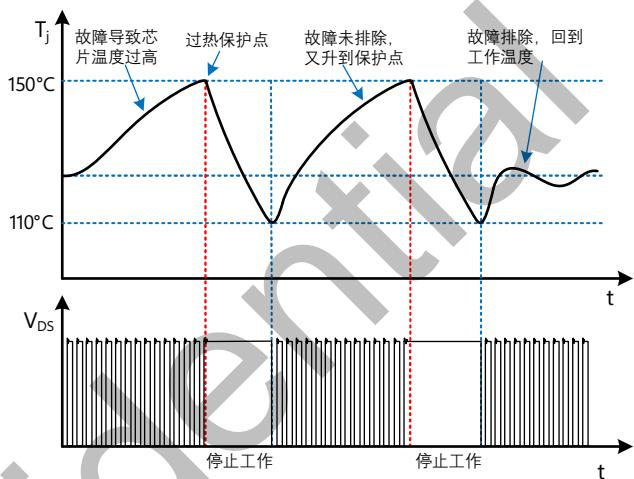  
图 8. 过温保护过程

## 应用指南

芯片适用范围

首先根据下表BPA86015G的适用功率范围，判断实际的应用需求是否满足：

<table><tr><td colspan="5">输出功率表</td></tr><tr><td rowspan="2">型号</td><td colspan="2">230VAC</td><td colspan="2">85~265VAC</td></tr><tr><td>适配器</td><td>开放式</td><td>适配器</td><td>开放式</td></tr><tr><td>BPA86015G</td><td>23W</td><td>32W</td><td>17W</td><td>21W</td></tr></table>

表1. 输出功率表

表 1 列出的最小连续输出功率，是基于合理的散热设计，将其温度控制到 $1 1 0 \%$ 或以下。开放式设计的测试环境温度为$5 0 ^ { \circ } \mathsf { C }$ ，密闭式适配器的测试环境温度为 $5 0 ^ { \circ } \mathsf { C }$

## 输入电容选择

输入滤波电容对工频电压纹波、传导EMI、以及电源抵抗Surge的能力都起到关键的作用。为了优化变压器的设计，电容量的选取要保证直流母线电压不能过低（通常低压输入时不低于80VDC，高压输入时不低于220VDC），因此电容量功率相对较大，需要用全波整流，根据输出功率可以对输入取 $2 { \sim } 3 \mu \mathsf { F } / \mathsf { W } ;$ ；高压输入时，一般取1μF/W。

<table><tr><td>输入</td><td>电压范围(VAC)</td><td>输入电容(μF/W)</td><td>推荐最低母线电压(V)</td></tr><tr><td>全电压</td><td>85~265</td><td>2~3</td><td>≥80V</td></tr><tr><td>低压</td><td>85~132</td><td>2~3</td><td>≥80V</td></tr><tr><td>高压</td><td>185~265</td><td>1</td><td>≥220V</td></tr></table>

表2. 推荐输入电容值和最低母线电压

根据选定的输入电容计算最低母线电压的精确值需要求解一个复杂的方程，为简便起见，通常使用以下公式得到一个相对精确的结果

$$
V _ {D C \_ M I N} = \sqrt {2 * V _ {A C M I N} ^ {2} - \frac {P _ {O} * (1 - 2 * f _ {L} * t _ {C})}{\eta * C _ {I N} * f _ {L}}}
$$

其中，整流桥的导通时间t 一般取3ms，可以假设效率初始值为80%，f 为输入交流电压频率， $\mathsf { V } _ { \mathsf { A C M I N } }$ 为最低输入交流电压有效值， $\mathsf { P } _ { 0 }$ 为额定输出功率， $C _ { \mathsf { I N } }$ 为输入电容容量。最高母线电压可以通过计算得到：

$$
V _ {D C \_ M A X} = \sqrt {2} * V _ {A C M A X}
$$

## 变压器计算

当BPA86015G最高限流点和开关频率已被设定，最大输出功率取决于变压器的电感量。电感量越大，最大输出功率越大，变压器体积也越大。因此，为了尽可能减小变压器体积，在满足额定输出规格的前提下，尽可能选取较小的电感量。一般建议在 $: V _ { D C , M I N }$ 条件下设计变压器，以保证所有输入电压范围内均满足额定输出规格。变压器的计算按照以下步骤：

## 1) 选取次级反射到初级的电压 $\mathsf { \Gamma } ( \mathsf { V } _ { \mathsf { O R } } )$ ）：

选取反射电压时，需要同时考虑最高输入电压下初级MOSFET和次级整流二极管的最高耐压值并留一定的裕量。MOSFET最高漏极电压为：

$$
V _ {D R A I N \_ M A X} = V _ {D C \_ M A X} + V _ {O R} + V _ {L K}
$$

其中， $V _ { \downarrow }$ 为漏感产生的电压尖峰， $\mathsf { V } _ { \mathsf { O R } }$ 为次级反射到初级的电压。漏极电压波形如图9所示，通常建议漏极最高电压不超过90%的功率管击穿电压 $( \mathsf { B V } _ { \mathsf { D S S } } )$ 。次级二极管的最高反向电压为：

$$
V _ {R} = \frac {V _ {D C \_ M A X} * (V _ {O U T} + V _ {D})}{V _ {O R}} + V _ {O U T}
$$

${ \mathsf { V } } _ { \mathsf { D } } .$ 为次级二极管的正向导通压降， $\mathsf { V } _ { \mathsf { O U T } }$ 为输出电压。通常预估 $V _ { \mathrm { { L K } } } { = } 6 0 \mathrm { V }$ $V _ { \mathsf { O R } } = 8 0 { \sim } 1 0 0 \mathsf { V }$ 作为起始值开始变压器计算，然后反复迭代计算以达到优化设计的目的。

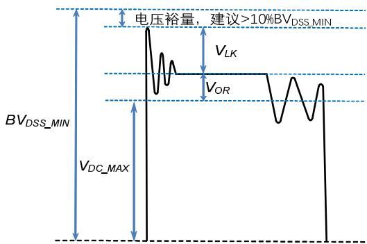  
图9. MOSFET漏极电压波形

变压器匝比可以通过以下表达式得到：

$$
N = \frac {N _ {P}}{N _ {S}} = \frac {V _ {O R}}{V _ {O U T} + V _ {D}}
$$

其中， $\Nu _ { \tt P }$ 和 $\mathsf { N } _ { \mathsf { S } } \triangle$ 别为变压器初级和次级匝数。反射电压越高，初次级匝比越大，初级漏感越大，会增加初级MOSFET电压应力和漏感产生的损耗。较高的反射电压虽然可以降低次级二极管的反向电压应力，从而可以使用较低电压的二极管，但是会增加次级的峰值和有效值电流，增加次级绕组和二极管导通损耗。同时，过高的反射电压还会引起传导EMI问题，这是由于非连续模式下初级电感和漏极寄生电容的自由振荡导致的。因此，建议 $\mathsf { V } _ { \mathsf { O R } }$ 不要超过135V。相反，过小的反射电压会降低连续模式下（低压输入时）的占空比，增加初级电流有效值，降低效率，同时次级二极管的电压应力增加。

## 2) 确定初级最大峰值电流：

纹波系数， $\mathsf { K } _ { \mathsf { P } }$ 的定义如下，

$$
K _ {P} = \frac {I _ {R}}{I _ {L I M I T \_ M A X}}
$$

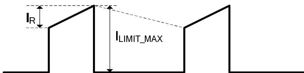  
图10. 连续模式下初级电流波形

当系统工作在CCM时 $\ K _ { \tt N } < 1$ ；当系统工作在BCM或DCM时 $K _ { \mathsf { P } } { = } 1$ 。根据工作模式选定 $\mathsf { K } _ { \mathsf { P } } \mathsf { \exists }$ 并计算初级最大峰值电流I $\mathsf { L I M I T \_ M A X }$

$$
I _ {L I M I T \_ M A X} = \frac {2 * I o}{(1 - D) * N}\tag{BCM}
$$

$$
I _ {L I M I T \_ M A X} = \frac {2 * I o}{(1 - D) * N * (2 - K _ {P})}\tag{CCM}
$$

$$
D = \frac {(V _ {O U T} + V _ {D}) * N}{V _ {D C \_ M I N} + (V _ {O U T} + V _ {D}) * N}
$$

$$
N = \frac {N _ {P}}{N _ {S}}
$$

根据 $L i M I \bot M A X 2 -$ 算电流采样电阻Rcs：

$$
R _ {C S} = \frac {V C S _ {L I M I T}}{I _ {L I M I T \_ M A X}}
$$

${ \mathsf { V C S } } _ { \mathsf { L I M I T } }$ 是CS引脚采样电压阈值，建议取电气参数表中的下限值，以保证足够的输出能力。

3) CCM模式下初级电感量计算：

$$
L _ {P} = \frac {2 * 0 . 9 * P _ {O} * [ Z * (1 - \eta) + \eta ]}{K _ {P} * (2 - K _ {P}) * I _ {L I M I T \_ M A X} ^ {2} * f _ {S} * \eta}
$$

其中， ${ \sf f } _ { \sf S } .$ 为开关频率(取电气参数表的下限值)， $\mathsf { I } _ { \mathsf { L I M I T } , \mathsf { M A X } }$ 为初级最高峰值电流由步骤2确定 Z为损耗分配因子，即次级损耗占总损耗的比例，没有具体计算数据的情况下可以取0.5。初次计算时，可以假设效率 为80%，后期可根据测试结果进行迭代。

4)

DCM模式下初级电感量计算：

$$
L _ {P} = \frac {2 * 0 . 9 * P _ {O} * [ Z * (1 - \eta) + \eta ]}{I _ {L I M I T \_ M A X} ^ {2} * f _ {S} * \eta}
$$

## 5) 确定最终电感量：

以上计算出来的都是输出额定电流所需的最小电感量，度是 $: \pm 1 0 \%$ 。因此，为了保证批量生产时能满足最低电感量的要求，需要在计算值的基础上增加10%。

## 6) 计算初次级匝数：

为了抑制反激变压器工作时产生的音频噪声，一般需要控制最大磁通密度 $\mathsf { B } _ { \mathsf { M A X } }$ 不超过3000高斯，在噪声要求很高的应用中 甚至需要低于2500高斯。变压器的匝数越，磁通密度越小，变压器体积越大，导线损耗也越大。初级匝数计算如下：

$$
N _ {P} = \frac {L _ {P} * I _ {L I M I T \_ M A X}}{B _ {M A X} * A _ {E}}
$$

其中 ，初级 电流 峰值 $\mathsf { I } _ { \mathsf { L I M I T } } \mathsf { _ { M A X } }$ 建议 取 电气 参数 表中$V C S _ { \mathsf { L I M I T } } \hat { \mathsf { H } } \hat { \mathsf { J } }$ 上限值与Rcs的比值， ${ \mathsf { B } } _ { \mathsf { M A X } }$ 为设定的最大磁通密度， $\mathsf { A } _ { \mathtt { E } }$ 为磁芯的有效截面积。然后通过匝比计算次级匝数 $\mathsf { N } _ { \mathsf { S } }$ ，并对计算结果进行取整，最后代入上式进行验证，直到 $3 _ { \mathrm { { M A X } } }$ 满足要求为止。

## 7) 初次级电流有效值计算：

CCM模式下，初级绕组有效值电流为：

$$
I _ {P \_ R M S} = I _ {L I M I T \_ M A X} * \sqrt {\left(1 - K _ {P} + \frac {K _ {P} ^ {2}}{3}\right) * D _ {M A X}}
$$

次级绕组电流有效值为：

$$
I _ {S \_ R M S} = I _ {L I M I T \_ M A X} * \frac {N _ {P}}{N _ {S}} * \sqrt {\left(1 - K _ {P} + \frac {K _ {P} ^ {2}}{3}\right) * (1 - D _ {M A X})}
$$

DCM模式下，需要根据最终的初级电感重新计算最大占空比 $\mathsf { D } _ { \mathsf { M A X } \_ \mathsf { D C M } }$

$$
D _ {M A X \_ D C M} = \frac {2 * P _ {O}}{V _ {D C \_ M I N} * I _ {L I M I T \_ M A X} * \eta}
$$

初级绕组有效值电流为：

$$
I _ {P \_ R M S} = I _ {L I M I T \_ M A X} * \sqrt {\frac {D _ {M A X \_ D C M}}{3}}
$$

次级绕组电流有效值为：

$$
I _ {S \_ R M S} = I _ {L I M I T \_ M A X} * \frac {N _ {P}}{N _ {S}} * \sqrt {\frac {V _ {D C \_ M I N} * D _ {M A X \_ D C M}}{3 * V _ {O R}}}
$$

## 8) 电流密度和绕组线径：

一般根据散热条件选择电流密度，通常无风密闭的环境电流密度 $4 { \sim } 6 \mathsf { A } / \mathsf { m m } ^ { 2 }$ ，散热条件较好的情况下选择$6 { \sim } 1 0 \mathsf { A / m m } ^ { 2 }$ 。然后根据步骤7计算的绕组电流有效值计算所需的线径。

## 输出电容的选择

输出电容的作用是滤除次级绕组电流中的交流成分，提供稳定的直流电压给负载，一般根据输出电压纹波要求来选取合适的电容。当输出电流恒定时，输出电压纹波主要由输出电容的 ESR 以及容量决定。

$$
\Delta V _ {O U T} = \Delta V _ {E S R} + \Delta V _ {C}
$$

实际应用中，为了得到较小的 ESR，电容量相对比较大，因此由容量产生的输出电压纹波很小，几乎可以忽略，电压纹波主要由电容的 ESR 产生：

$$
\Delta V _ {O U T} \cong \Delta V _ {E S R} = I _ {L I M I T \_ M A X} * \frac {N _ {P}}{N _ {S}} * E S R
$$

ESR 不仅产生输出电压纹波，纹波电流在 ESR 中产生的损耗还会导致电容发热，缩短电解电容的寿命，因此电解电容一般都会有纹波电流限制。流进电解电容的纹波电流有效值为：

$$
I _ {R I P P L E} = \sqrt {I _ {S \_ R M S} ^ {2} - I _ {O} ^ {2}}
$$

电容厂家的手册中一般给出的是 $1 0 0 ^ { \circ } \mathsf { C }$ 环境温度下的额定纹波电流有效值，实际应用中的环境温度要低得多，计算电容的额定纹波电流有效值时需要乘以对应的温度因子。当一个电容的纹波电流不能满足时，可以使用多个电容并联。

## 输出二极管选择

在 CCM 模式下，初级 MOSFET 开通瞬间次级二极管反向恢复电流会通过变压器耦合到初级，流经 MOSFET 并产生损耗，同时也会产生 EMI 问题，过大的电流尖峰还可能会导致MOSFET 损坏。DCM 模式下，虽然正常工作没有反向恢复问题，但是开机和输出短路等条件下依然是 CCM。因此，次级整流输出二极管一般选择超快恢复二极管或者肖特基二极管。变压器匝比确定后，计算次级二极管反向电压为：

$$
V _ {R} = \frac {V _ {D C \_ M A X} * N _ {S}}{N _ {P}} + V _ {O U T}
$$

常用的肖特基二极管耐压一般小于 200V，更高耐压的应用需要选择超快恢复二极管。额定电流一般选取输出电流的 3 倍或以上。

## 降低空载功耗

BPA86015G 可通过高压启动电路通过 DRAIN 端对 VCC 电容充电。当 VCC 电压高于 15V，高压供电电路关闭，由输出绕组向 VCC 供电（如图 。应选择合适的供电电压，保证高压供电电路关闭 同时避免 VCC 电压过高。过高的VCC 可能导致功耗增加 ，VCC 高于 30V 将触发 OVP 保护。

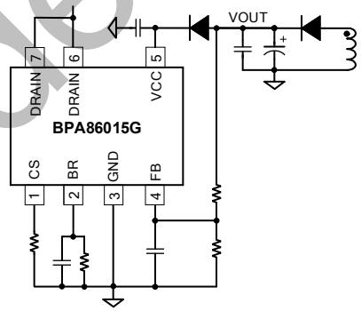  
图 11. 输出绕组供电电路

## 钳位电路计算

反激变换器中由于变压器漏感的存在，在开关管关断瞬间会产生很大的尖峰电压，使得开关管承受较高的电压应力。因此，为确保反激变换器安全可靠工作，必须引入钳位电路吸收漏感能量。其中RCD钳位电路因结构简单、成本低、性能可靠而被广泛应用，如图12所示。初级MOSFET关断时，漏感中的能量通过二极管D1，衰减电阻R2转移到钳位电容C1中，然后通过电阻R1消耗掉。R2的作用是衰减变压器漏感与钳位电容C1形成的高频振荡，一般取20\~100Ω之间，阻值太小起不到衰减作用，太大就会导致漏感能量不能进入钳位电容，使得钳位电路不起作用。钳位二极管D1在小功率应用(≤10W)中可以使用普通二极管，好处是较慢的反向恢复时间会使得钳位电容中的能量部分转移到次级，提高轻载效率，同时对高频振荡起到衰减的作用。功率较大时，普通二极管的反向恢复损耗会导致发热比较严重，因此需要使用快恢复二极管。

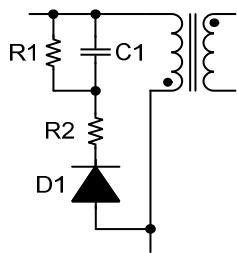  
图12. RCD钳位电路

钳位电阻 R1和钳位电容 C1的计算过程如下，首 先计算MOSFET关断瞬间漏感两端电压：

$$
V _ {L k} = V _ {C L A M P} - V _ {O R}
$$

其中， $\mathsf { V } _ { \mathsf { C L A M P } }$ 为钳位电容上的电压，流过漏感的电流斜率为：

$$
\frac {d i _ {L k}}{d t} = - \frac {V _ {C L A M P} - V _ {O R}}{L _ {K}}
$$

漏感电流从 $\mathsf { I } _ { \mathsf { P E A K } }$ 下降到0的时间为:

$$
t _ {S} = \frac {L _ {K} * I _ {P E A K}}{V _ {C L A M P} - V _ {O R}}
$$

钳位电路消耗的功率为：

$$
P _ {C L A M P} = \frac {1}{2} * f _ {S} * L _ {L K} * I _ {P E A K} ^ {2} * \frac {V _ {C L A M P}}{V _ {C L A M P} - V _ {O R}}
$$

钳位电阻计算：

$$
R _ {1} = \frac {V _ {C L A M P} ^ {2}}{P _ {C L A M P}} = \frac {2 * V _ {C L A M P} * (V _ {C L A M P} - V _ {O R})}{f _ {S} * L _ {L K} * I _ {P E A K} ^ {2}}
$$

钳位电容计算：

$$
C _ {1} = \frac {V _ {C L A M P}}{\Delta V _ {C L A M P} * R _ {1} * f _ {S}}
$$

根据经验值， $\Delta V _ { \mathsf { C L A M P } }$ 可取为2%\~5%\*V $\mathsf { V } _ { \mathsf { C L A M P } } .$ 一般选为2\~2.5倍的 $\mathsf { V } _ { \mathsf { O R } }$ 。

## 降低音频噪声

反激变换器的音频噪声来源主要是变压器、钳位电容和辅助供电电容。电容的噪声主要是因为瓷片电容的压电效应导致，钳位电容可以选择X7R材质，相比Z5U材质对音频噪声有较大改善，也可以使用没有压电效应的薄膜电容。辅助供电电容尽量使用电解电容，以避免轻载时由于较低的开关频率而产生噪声。变压器的噪声主要是因为线包和磁芯的震动，通过浸凡立水可以有效改善线包的震动。磁芯的震动可以通过降最大磁通密度来改善，最大不要超过3000高斯，在噪声要求很高的应用中，甚至需要低于2500高斯。同时，在磁芯中柱点胶固定能进一步降低音频噪声。

PCB Layout 指南

在设计 BPA86015G 的 PCB 时，需要遵循以下建议：

1) VCC 电容必须直接靠近 VCC 和 GND 引脚放置，与电容的连接走线应尽量短。建议使用 X7R 材质的陶瓷电容。

2) 为了降低辐射干扰，应减小高频功率环路面积。初级母线电容、变压器绕组和芯片组成的环路面积尽可能小；

3) 次级绕组、二极管和输出滤波电容组成的环路面积尽可能小；初级绕组和钳位电路组成的环路面积尽可能小。

4) DRAIN 引脚（MOSFET 漏极）是散热的主要途径，可以在 DRAIN 引脚铺铜来降低芯片温度，但过大铺铜可能导致 EMI 问题，需要按实际表现折中设计。可以在次级续流二极管两端铺铜增强散热，建议主要将铜皮铺在二极管阴极端。

减小高频功率环路面积  
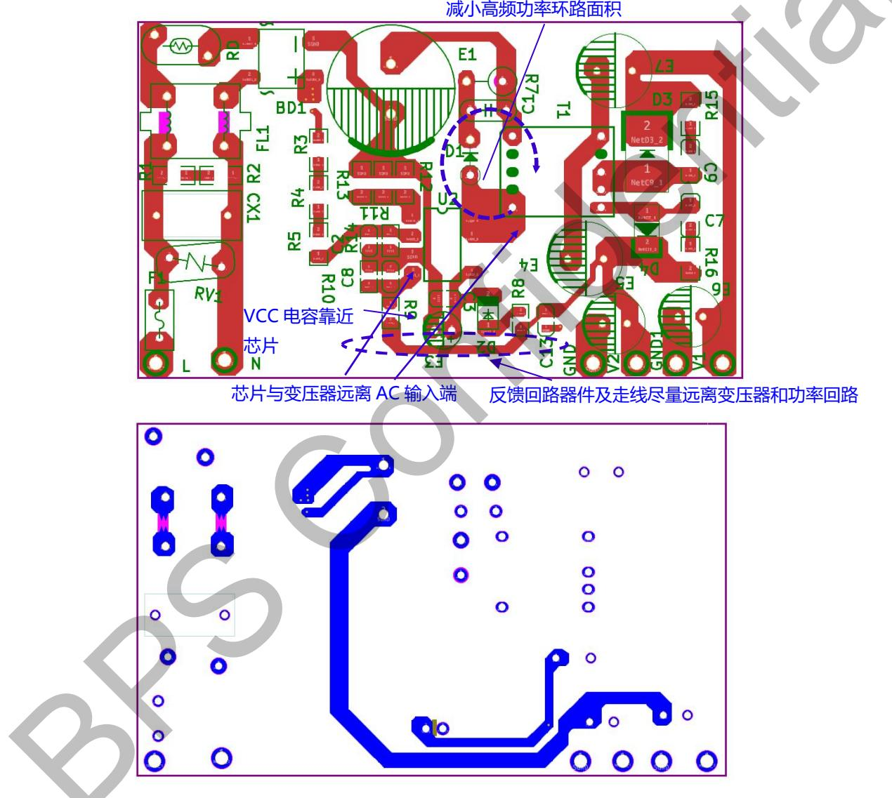  
图 13. PCB 布局建议

## 封装信息

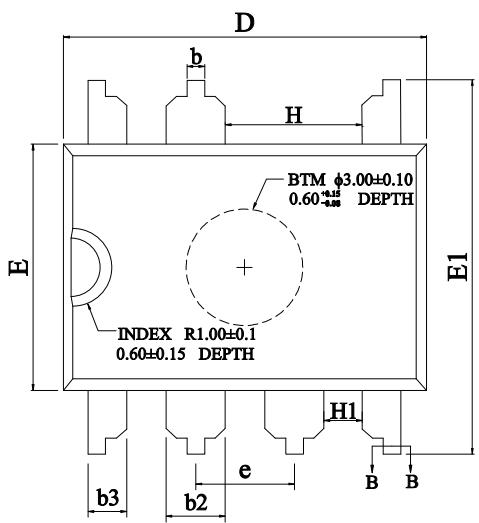  
TOP VIEW  
SMD-7 封装外形尺寸

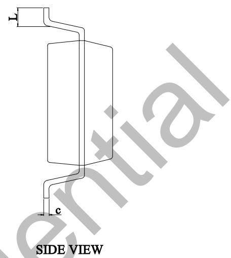

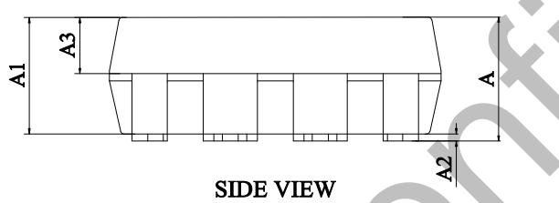

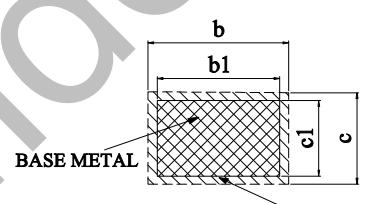  
WITHPLATING SECTIONB-B

COMMON DIMENSIONS (UNITS OF MEASURE=MILLIMETER)

<table><tr><td>SYMBOL</td><td>MIN</td><td>NOM</td><td>MAX</td></tr><tr><td>A</td><td>3.35</td><td>-</td><td>3.65</td></tr><tr><td>A1</td><td>3.25</td><td>3.30</td><td>3.35</td></tr><tr><td>A2</td><td>0.10</td><td>-</td><td>0.30</td></tr><tr><td>A3</td><td>1.50</td><td>1.60</td><td>1.70</td></tr><tr><td>b</td><td>0.38</td><td>-</td><td>0.55</td></tr><tr><td>b1</td><td>0.38</td><td>-</td><td>0.51</td></tr><tr><td>b2</td><td>1.45</td><td>1.52</td><td>1.62</td></tr><tr><td>b3</td><td>0.89</td><td>0.99</td><td>1.09</td></tr><tr><td>c</td><td>0.25</td><td>-</td><td>0.30</td></tr><tr><td>c1</td><td>0.24</td><td>0.25</td><td>0.26</td></tr><tr><td>D</td><td>9.32</td><td>9.35</td><td>9.40</td></tr><tr><td>E</td><td>6.30</td><td>6.35</td><td>6.40</td></tr><tr><td>E1</td><td>9.45</td><td>9.65</td><td>9.85</td></tr><tr><td>H</td><td>3.48</td><td>-</td><td>-</td></tr><tr><td>H1</td><td>0.76</td><td>-</td><td>-</td></tr><tr><td>L</td><td>0.91</td><td>-</td><td>1.12</td></tr><tr><td>e</td><td colspan="3">2.54 BSC</td></tr></table>

NOTES:

1. ALL DIMENSIONS MEET JEDEC STANDARD MS-O12F

2. ALL DIMENSIONS DO NOT INCLUDE MOLD FLASH OR PROTRUSIONS

## 版本信息

<table><tr><td>版本</td><td>日期</td><td>记录</td></tr><tr><td></td><td></td><td></td></tr></table>

## 免责声明

晶丰明源尽力确保本产品规格书内容的准确和可靠，但是保留在没有通知的情况下，修改规格书内容的权利。

本产品规格书未包含任何针对晶丰明源或第三方所有的知识产权的授权。针对本产品规格书所记载的信息，晶丰明源不做任何明示或暗示的保证，包括但不限于对规格书内容的准确性、商业上的适销性、特定目的的适用性或者不侵犯晶丰明源或任何第三人知识产权做任何明示或暗示保证，晶丰明源也不就因本规格书本身及其使用有关的偶然或必然损失承担任何责任。

## 电子器件报废说明

该产品在生命周期结束后，由客户按照一般电子产品的报废流程进行处理。

