## S7134B工程测试报告-六级能效(12V/1A)

上海晶丰明源半导体股份有限公司

Shanghai Bright Power Semiconductor Co., Ltd.

陈耀兵

2021 12 10

## 内容

电源规格  
电路及实物图  
BOM  
PCB Layout  
性能测试数据

<table><tr><td>项目描述</td><td>符号</td><td>最小</td><td>典型</td><td>最大</td><td>单位</td><td>备注</td></tr><tr><td colspan="7">输入</td></tr><tr><td>电压</td><td> $V_{IN}$ </td><td>90</td><td>115/230</td><td>264</td><td> $V_{AC}$ </td><td></td></tr><tr><td>频率</td><td> $f_{LINE}$ </td><td>47</td><td>50/60</td><td>63</td><td>Hz</td><td></td></tr><tr><td colspan="7">输出</td></tr><tr><td>输出电压</td><td> $V_{OUT}$ </td><td></td><td>12</td><td></td><td>V</td><td>±5%</td></tr><tr><td>输出电流</td><td> $I_{OUT}$ </td><td>0</td><td>1</td><td></td><td>A</td><td></td></tr><tr><td>输出电压纹波</td><td> $V_{RIPPLE}$ </td><td></td><td></td><td>120</td><td>mV</td><td>20MHz带宽</td></tr><tr><td>连续输出功率</td><td> $P_{OUT}$ </td><td></td><td>12</td><td></td><td>W</td><td></td></tr><tr><td colspan="7">效率</td></tr><tr><td>待机功耗</td><td> $P_{STDBY}$ </td><td></td><td></td><td>70</td><td>mW</td><td>230VAC,包含假负载</td></tr><tr><td>满载效率</td><td>η</td><td>83</td><td></td><td></td><td>%</td><td>115VAC/230VAC</td></tr><tr><td colspan="7">环境</td></tr><tr><td>传导EMI</td><td></td><td colspan="4">满足CISPR22/EN55022 Class B,至少6dB 裕量</td><td></td></tr><tr><td>Surge</td><td></td><td></td><td>4</td><td></td><td>kV</td><td>差模4kV,共模4kV</td></tr><tr><td>EFT</td><td></td><td></td><td>4</td><td></td><td>kV</td><td>5kHz/100kHz/38kHz</td></tr><tr><td>ESD</td><td></td><td></td><td>15</td><td></td><td>kV</td><td>接触8kV,空气15kV</td></tr><tr><td>工作环境温度</td><td> $T_{AMP}$ </td><td>0</td><td></td><td>40</td><td>°C</td><td></td></tr></table>

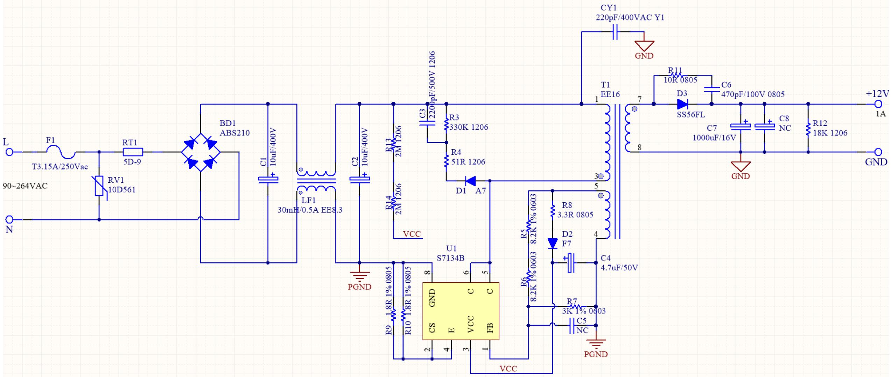

<table><tr><td>序号</td><td>元件标号</td><td>参数描述</td><td>封装尺寸</td><td>数量</td></tr><tr><td>1</td><td>PCB</td><td>CEM-1, 单面板</td><td>50mm*37.2mm</td><td>1</td></tr><tr><td>2</td><td>BD1</td><td>ABS210</td><td>BD_MB10S/MBF</td><td>1</td></tr><tr><td>3</td><td>C1, C2</td><td>10uF/400V</td><td>EC 10 P5.0</td><td>2</td></tr><tr><td>4</td><td>C3</td><td>2200pF/500V 1206</td><td>1206-C</td><td>1</td></tr><tr><td>5</td><td>C4</td><td>4.7uF/50V</td><td>EC 5 P2.5</td><td>1</td></tr><tr><td>6</td><td>C5</td><td>NC</td><td>0603-C</td><td>1</td></tr><tr><td>7</td><td>C6</td><td>470pF/100V 0805</td><td>0805-C</td><td>1</td></tr><tr><td>8</td><td>C7</td><td>1000uF/16V</td><td>EC 8.5 P3.5</td><td>1</td></tr><tr><td>9</td><td>C8</td><td>NC</td><td>EC 8.5 P3.5</td><td>1</td></tr><tr><td>10</td><td>CY1</td><td>220pF/400VAC Y1</td><td>CY10</td><td>1</td></tr><tr><td>11</td><td>D1</td><td>A7</td><td>D SOD-123</td><td>1</td></tr><tr><td>12</td><td>D1</td><td>SS56FL</td><td>D SMAF</td><td>1</td></tr><tr><td>13</td><td>D2</td><td>F7</td><td>D SOD-123</td><td>1</td></tr><tr><td>14</td><td>F1</td><td>T3.15A/250Vac</td><td>FUSE_F-P5_JZ</td><td>1</td></tr><tr><td>15</td><td>LF1</td><td>30mH/0.5A EE8.3</td><td>LF EE8.3</td><td>1</td></tr><tr><td>16</td><td>R3</td><td>330K 1206</td><td>1206-r</td><td>1</td></tr><tr><td>17</td><td>R4</td><td>51R 1206</td><td>1206-r</td><td>1</td></tr><tr><td>18</td><td>R5, R6</td><td>8.2K 1% 0603</td><td>0603-r</td><td>2</td></tr><tr><td>19</td><td>R7</td><td>3K 1% 0603</td><td>0603-r</td><td>1</td></tr><tr><td>20</td><td>R8</td><td>3.3R 0805</td><td>0805-r</td><td>1</td></tr><tr><td>21</td><td>R9, R10</td><td>1.8R 1% 0805</td><td>0805-r</td><td>2</td></tr><tr><td>22</td><td>R11</td><td>10R 0805</td><td>0805-r</td><td>1</td></tr><tr><td>23</td><td>R12</td><td>18K 1206</td><td>1206-r</td><td>1</td></tr><tr><td>24</td><td>R13, R14</td><td>2M 1206</td><td>1206-r</td><td>2</td></tr><tr><td>25</td><td>RT1</td><td>5D-9</td><td>RT7.5</td><td>1</td></tr><tr><td>26</td><td>RV1</td><td>10D561</td><td>RV-10D</td><td>1</td></tr><tr><td>27</td><td>T1</td><td>EE16</td><td>T EE16(5+3)-JZ</td><td>1</td></tr><tr><td>28</td><td>U1</td><td>S7134B</td><td>U SOP-7(S7134)</td><td>1</td></tr></table>

## 变压器规格书

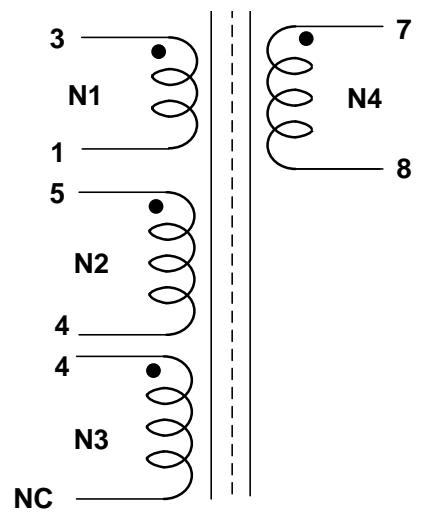

<table><tr><td>序号</td><td>起始脚</td><td>终止脚</td><td>绕制规则</td><td>匝数</td><td>绕线方式</td></tr><tr><td>N1</td><td>3</td><td>1</td><td>2UEW φ0.2*1P</td><td>66Ts</td><td>密绕三层(PIN脚朝外)</td></tr><tr><td>胶带</td><td></td><td></td><td></td><td>2Ts</td><td></td></tr><tr><td>N2</td><td>5</td><td>4</td><td>2UEW φ0.13*2P</td><td>6Ts</td><td>均匀间绕一层(PIN脚朝外)</td></tr><tr><td>胶带</td><td></td><td></td><td></td><td>2Ts</td><td></td></tr><tr><td>N4</td><td>7</td><td>8</td><td>TEX-E φ0.6*1P</td><td>6Ts</td><td>密绕一层(PIN脚朝外)</td></tr><tr><td>胶带</td><td></td><td></td><td></td><td>3Ts</td><td></td></tr><tr><td colspan="6">磁芯接地(PIN4)</td></tr></table>

## 规格参数：

1）骨架：EE16加宽（5+1+2PIN），磁芯材质：EE17.3 PC95 或同等材质 ，Ae＝38.8mm² ；  
2）N1、N2、N3: 2UEW 漆包线；N4: 三层绝缘线；磁芯接地 PIN4；  
3）绝缘胶带:3M900 或同等材质；  
4）初级绕组感量Lp：1.4mH±5%（测试条件： 0.3V，50kHz）；  
5）漏感量Llk：要求控制在初级绕组的4%以内(测试条件： 0.3 V，50kHz）；  
6）耐压测试= 3KV 2mA 1Min；  
7）成品要求：浸凡立水；

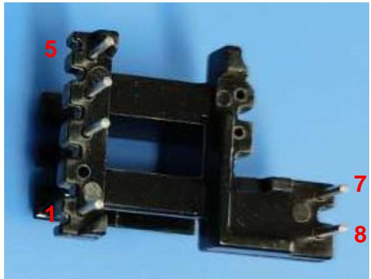

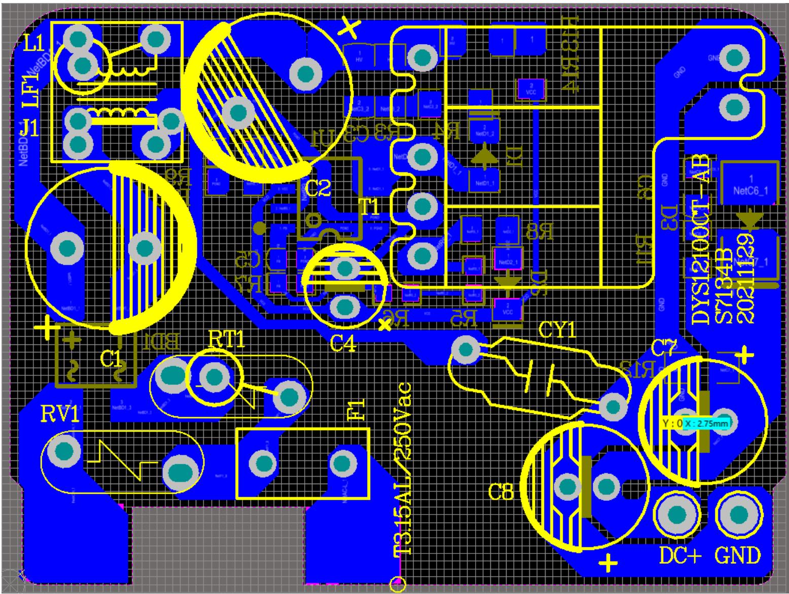

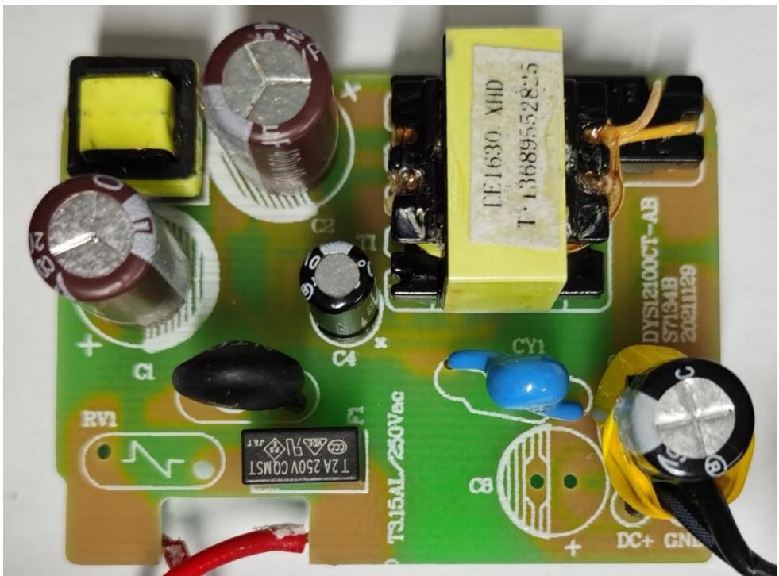

TOP SIDE

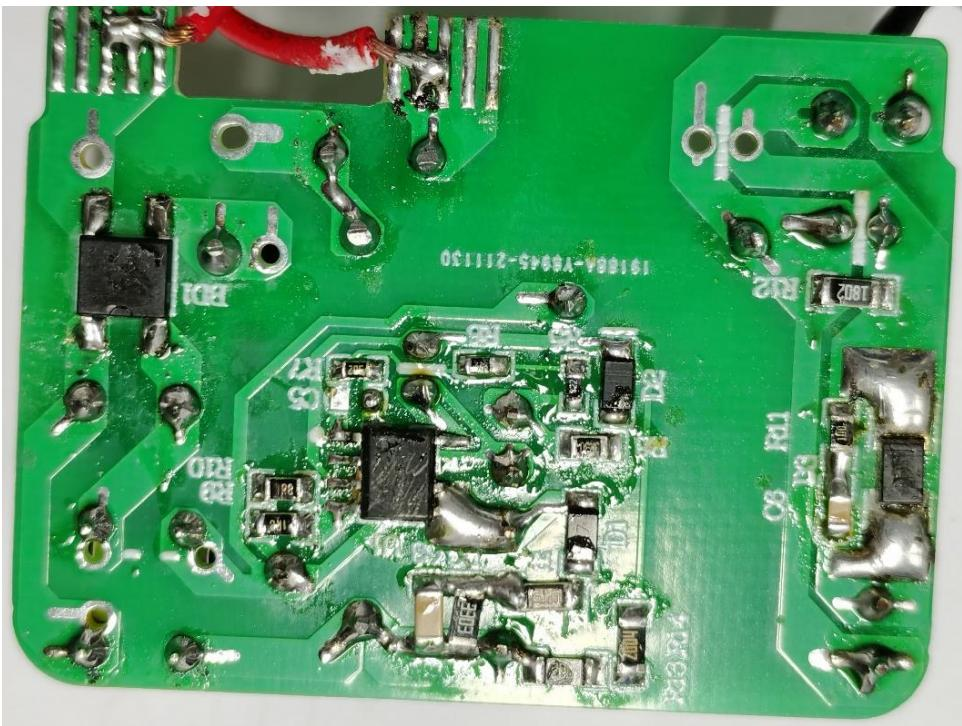

BOTTOM SIDE

待机功耗  
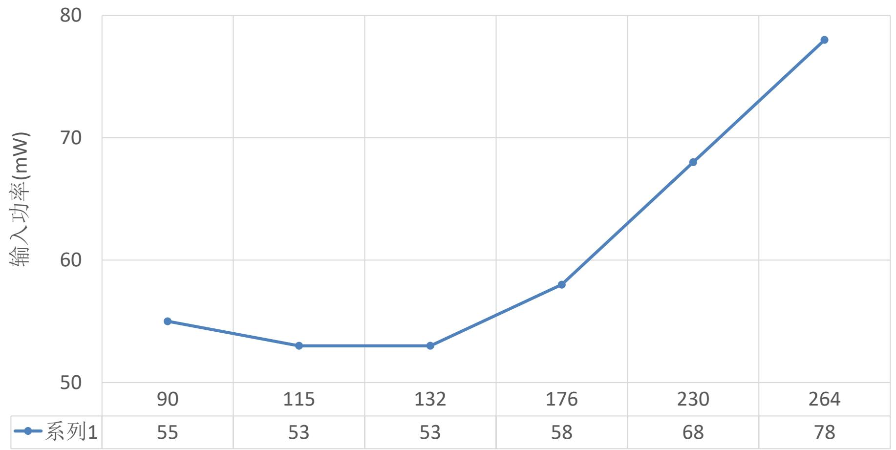

输入电压(Vac)

效率曲线  
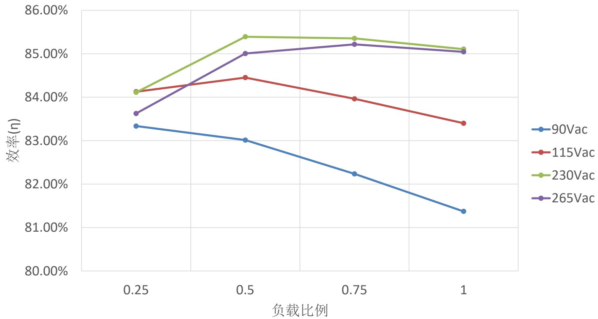

<table><tr><td> $V_{IN}(VAC)$ </td><td>Load(%)</td><td> $P_{IN}(W)$ </td><td> $V_{OUT}(V)$ </td><td>板端电压</td><td> $I_{OUT}(A)$ </td><td> $P_{OUT}(W)$ </td><td>Eff(%)</td><td>AVG Eff(%)</td></tr><tr><td rowspan="6">90</td><td>空载</td><td>0.056</td><td>12.0176</td><td>12.025</td><td>0</td><td>0</td><td></td><td></td></tr><tr><td>10%</td><td>1.47</td><td>11.69</td><td>11.716</td><td>0.1</td><td>1.1685</td><td>79.49%</td><td></td></tr><tr><td>25%</td><td>3.55</td><td>11.83</td><td>11.902</td><td>0.25</td><td>2.9584</td><td>83.34%</td><td rowspan="4">82.49%</td></tr><tr><td>50%</td><td>7.23</td><td>12.00</td><td>12.137</td><td>0.5</td><td>6.0019</td><td>83.01%</td></tr><tr><td>75%</td><td>10.99</td><td>12.05</td><td>12.247</td><td>0.75</td><td>9.0377</td><td>82.24%</td></tr><tr><td>100%</td><td>14.71</td><td>11.97</td><td>12.23</td><td>1</td><td>11.97</td><td>81.37%</td></tr><tr><td rowspan="6">115</td><td>空载</td><td>0.054</td><td>12.05</td><td>12.052</td><td>0</td><td>0</td><td>0</td><td></td></tr><tr><td>10%</td><td>1.46</td><td>11.68</td><td>11.714</td><td>0.1</td><td>1.1683</td><td>80.02%</td><td></td></tr><tr><td>25%</td><td>3.52</td><td>11.85</td><td>11.915</td><td>0.25</td><td>2.9613</td><td>84.13%</td><td rowspan="4">83.99%</td></tr><tr><td>50%</td><td>7.11</td><td>12.01</td><td>12.142</td><td>0.5</td><td>6.0046</td><td>84.45%</td></tr><tr><td>75%</td><td>10.77</td><td>12.06</td><td>12.254</td><td>0.75</td><td>9.0428</td><td>83.96%</td></tr><tr><td>100%</td><td>14.37</td><td>11.98</td><td>12.246</td><td>1</td><td>11.985</td><td>83.40%</td></tr><tr><td rowspan="6">230</td><td>空载</td><td>0.069</td><td>12.14</td><td>12.141</td><td>0</td><td>0</td><td>0</td><td></td></tr><tr><td>10%</td><td>1.48</td><td>11.66</td><td>11.6944</td><td>0.1</td><td>1.1661</td><td>78.79%</td><td></td></tr><tr><td>25%</td><td>3.52</td><td>11.84</td><td>11.912</td><td>0.25</td><td>2.9608</td><td>84.11%</td><td rowspan="4">84.99%</td></tr><tr><td>50%</td><td>7.04</td><td>12.02</td><td>12.156</td><td>0.5</td><td>6.0116</td><td>85.39%</td></tr><tr><td>75%</td><td>10.61</td><td>12.07</td><td>12.271</td><td>0.75</td><td>9.056</td><td>85.35%</td></tr><tr><td>100%</td><td>14.11</td><td>12.01</td><td>12.268</td><td>1</td><td>12.009</td><td>85.11%</td></tr><tr><td rowspan="6">265</td><td>空载</td><td>0.080</td><td>12.15</td><td>12.157</td><td>0</td><td>0</td><td>0</td><td></td></tr><tr><td>10%</td><td>1.50</td><td>11.66</td><td>11.694</td><td>0.1</td><td>1.1664</td><td>77.76%</td><td></td></tr><tr><td>25%</td><td>3.54</td><td>11.84</td><td>11.91</td><td>0.25</td><td>2.9603</td><td>83.63%</td><td rowspan="4">84.72%</td></tr><tr><td>50%</td><td>7.07</td><td>12.02</td><td>12.151</td><td>0.5</td><td>6.0099</td><td>85.01%</td></tr><tr><td>75%</td><td>10.63</td><td>12.08</td><td>12.274</td><td>0.75</td><td>9.0585</td><td>85.22%</td></tr><tr><td>100%</td><td>14.12</td><td>12.01</td><td>12.267</td><td>1</td><td>12.008</td><td>85.04%</td></tr></table>

◼ 注：V OUT为1.5m长24AWG线端电压，效率也为线端效率

## 输出电压调整率

<table><tr><td> $V_{IN}(VAC)$  $I_{OUT}(A)$ </td><td>90</td><td>115</td><td>132</td><td>176</td><td>230</td><td>265</td><td>平均值</td><td>线调整率</td></tr><tr><td>0</td><td>12.023</td><td>12.044</td><td>12.056</td><td>12.082</td><td>12.114</td><td>12.133</td><td>12.075</td><td>0.91%</td></tr><tr><td>20%</td><td>11.8036</td><td>11.8108</td><td>11.8128</td><td>11.8109</td><td>11.8071</td><td>11.8018</td><td>11.808</td><td>0.09%</td></tr><tr><td>40%</td><td>11.9541</td><td>11.9636</td><td>11.9686</td><td>11.9779</td><td>11.9788</td><td>11.9736</td><td>11.969</td><td>0.21%</td></tr><tr><td>60%</td><td>12.05</td><td>12.053</td><td>12.058</td><td>12.067</td><td>12.07</td><td>12.067</td><td>12.061</td><td>0.17%</td></tr><tr><td>80%</td><td>12.041</td><td>12.046</td><td>12.052</td><td>12.06</td><td>12.065</td><td>12.067</td><td>12.055</td><td>0.22%</td></tr><tr><td>100%</td><td>11.988</td><td>11.998</td><td>12.001</td><td>12.009</td><td>12.013</td><td>12.013</td><td>12.004</td><td>0.21%</td></tr><tr><td>平均值</td><td>11.977</td><td>11.986</td><td>11.991</td><td>12.001</td><td>12.008</td><td>12.009</td><td></td><td></td></tr><tr><td>负载调整率</td><td>2.06%</td><td>2.02%</td><td>2.04%</td><td>2.26%</td><td>2.56%</td><td>2.76%</td><td></td><td></td></tr></table>

◼ 计算方法：调整率=100%\*(最大值-最小值)/平均值

## 输出电压纹波

20MHz带宽，去掉示波器探头正端夹子和地线环，10uF/50V 0.1uF/50V

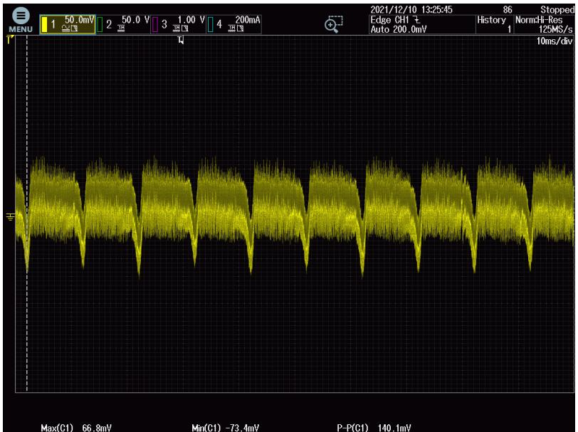

90 VAC

CH1 VOUT $\begin{array} { l } { \mathsf { C H 1 V _ { o u \intercal } } } \\ { \mathsf { R i p p l e } } \end{array}$ $V _ { \mathsf { P K - P K } } { = } 1 4 0 . 1$ VPK-PK=140.1 mV

Test Condition:

➢ Full Load

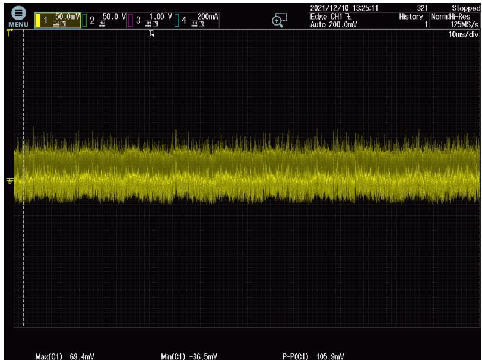

115 VAC

CH1 VOUT $\begin{array} { l } { \mathsf { C H 1 V _ { o u \intercal } } } \\ { \mathsf { R i p p l e } } \end{array}$ $V _ { p | ( - P K } = 1 0 5 . 9$ mV

Test Condition:

➢ Full Load

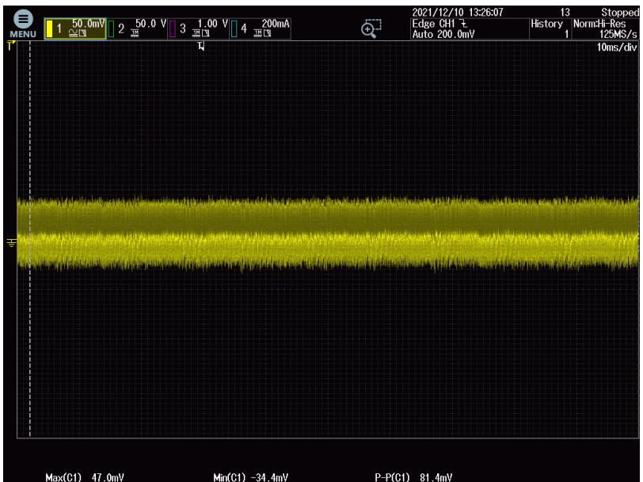

230 VAC

CH1 VOUT Ripple $\begin{array} { l } { { \tt V } _ { \tt P K - P K } { = } 8 1 . 4 } \\ { { \tt m V } } \end{array}$ VPK-PK=81.4

Test Condition:

➢ Full Load

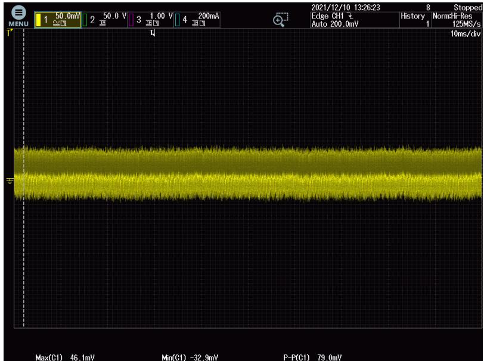

265 $\mathsf { v } _ { \mathsf { A C } }$

CH1 VOUT $\mathsf { V } _ { \mathsf { O U T } }$ Ripple $\mathsf { V } _ { \mathsf { P K - P K } } { = } 7 9 \mathsf { m } \mathsf { v }$

Test Condition:

➢ Full Load

## (50%-100%)

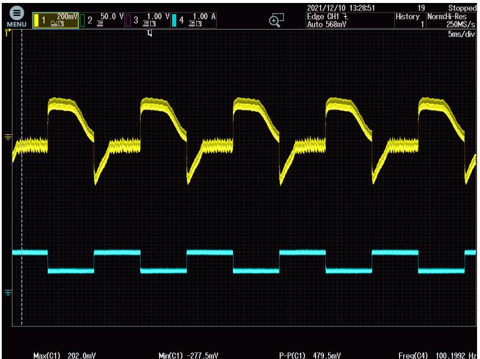

90 VAC

CH1 VOUT ${ \mathsf { C H 1 } } { \mathsf { V } } _ { \mathsf { O U T } }$ $V _ { \mathsf { P K - P K } } { = } 4 7 9 . 5 \mathsf  m v$  
$\mathsf { C H 4 } \mathsf { I } _ { \mathsf { O U T } }$

## Test Condition:

➢ $0 . 5 \mathsf { A } \mathsf { - } 1 \mathsf { A } \mathsf { - } 0 . 5 \mathsf { A }$  
➢ Slew Rate: 0.5 A/μS  
➢ Frequency: 100 Hz

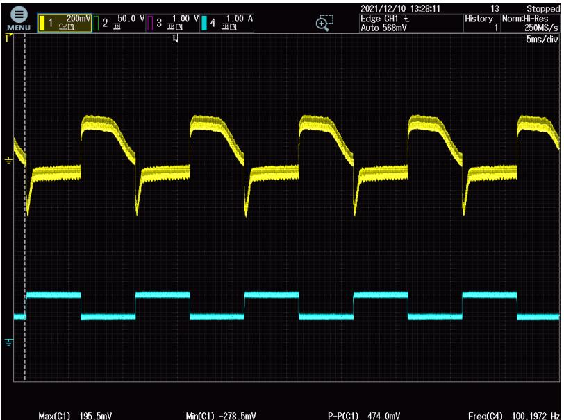

230 VAC

CH1 VOUT ${ \mathsf { C H 1 } } { \mathsf { V } } _ { \mathsf { O U T } }$ $V _ { P K - P K } = 4 7 4 m v$  
$\mathsf { C H 4 } \mathsf { l } _ { \mathsf { O U T } }$

## Test Condition:

➢ $0 . 5 \mathsf { A } \mathsf { - } 1 \mathsf { A } \mathsf { - } 0 . 5 \mathsf { A }$  
➢ Slew Rate: 0.5 $\mathsf { A } / \mu \mathsf { S }$  
➢ Frequency: 100 Hz

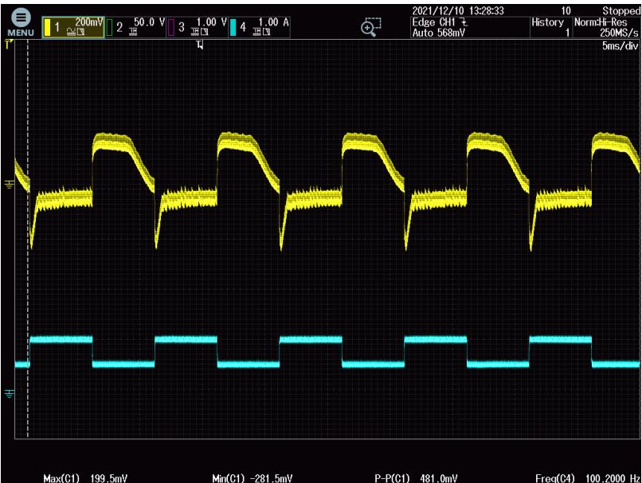

115 VAC

CH1 VOUT ${ \mathsf { C H 1 } } { \mathsf { V } } _ { \mathsf { O U T } }$ $V _ { P K - P K } { = } 4 8 1 m v$  
$\mathsf { C H 4 } \mathsf { I } _ { \mathsf { O U T } }$

## Test Condition:

➢ $0 . 5 \mathsf { A } \mathsf { - } 1 \mathsf { A } \mathsf { - } 0 . 5 \mathsf { A }$  
➢ Slew Rate: $0 . 5 \mathsf { A } / \mu \mathsf { S }$  
➢ Frequency: 100 Hz

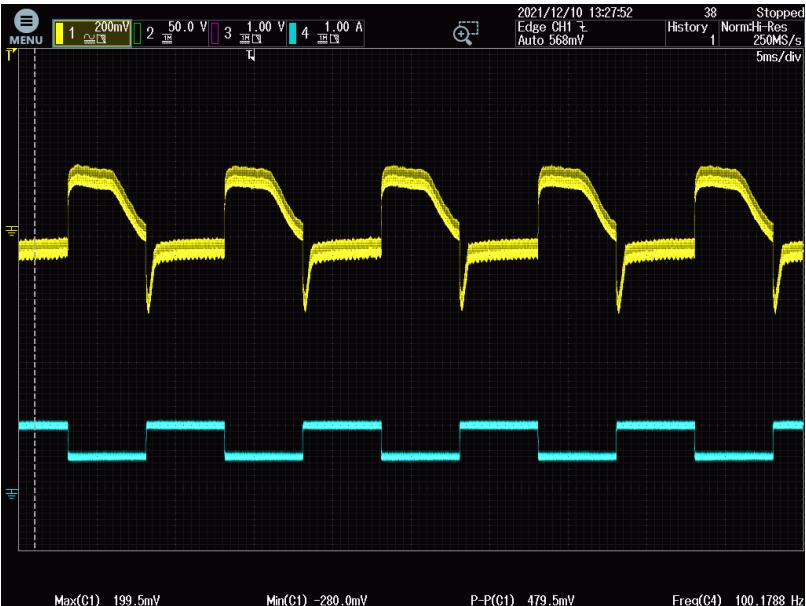

265 VAC

CH1 VOUT ${ \mathsf { C H 1 } } { \mathsf { V } } _ { \mathsf { O U T } }$ VPK-PK=479.5 mV  
$\mathsf { C H 4 } \mathsf { I } _ { \mathsf { O U T } }$

## Test Condition:

➢ $0 . 5 \mathsf { A } \mathsf { - } 1 \mathsf { A } \mathsf { - } 0 . 5 \mathsf { A }$  
➢ Slew Rate: 0.5 A/μS  
➢ Frequency: 100 Hz

## (10%-90%)

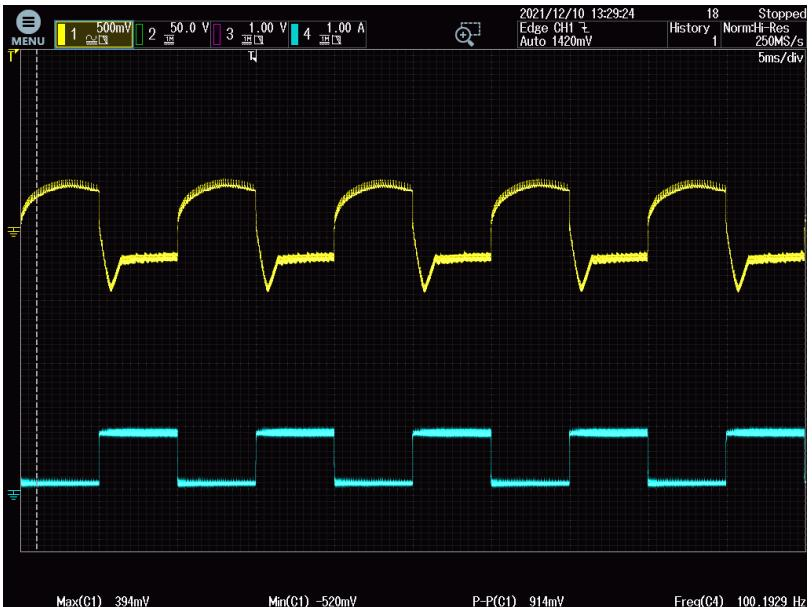

90 VAC

CH1 VOUT ${ \mathsf { C H 1 } } { \mathsf { V } } _ { \mathsf { O U T } }$ $\mathsf { V } _ { \mathsf { P K - P K } } { = } \mathsf { S } \mathsf { 1 } 4 \mathsf { m } \mathsf { v }$  
$\mathsf { C H 4 } \mathsf { I } _ { \mathsf { O U T } }$

## Test Condition:

➢ $0 . 1 \mathsf { A } \mathsf { - } 0 . 9 \mathsf { A } \mathsf { - } 0 . 1 \mathsf { A }$  
➢ Slew Rate: 0.5 A/μS  
➢ Frequency: 100 Hz

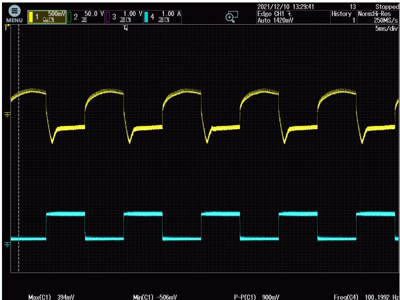

115 VAC

CH1 VOUT ${ \mathsf { C H 1 } } { \mathsf { V } } _ { \mathsf { O U T } }$ $\mathsf { V } _ { \mathsf { P K - P K } } { = } \mathsf { S } \mathsf { 0 } \mathsf { 0 } \mathsf { m } \mathsf { v }$  
$\mathsf { C H 4 } \mathsf { I } _ { \mathsf { O U T } }$

## Test Condition:

➢ $0 . 1 \mathsf { A } \mathsf { - } 0 . 9 \mathsf { A } \mathsf { - } 0 . 1 \mathsf { A }$  
➢ Slew Rate: 0.5 A/μS  
➢ Frequency: 100 Hz

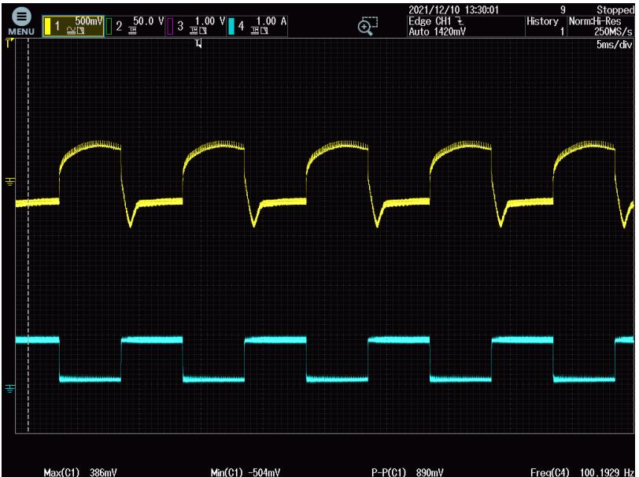

230 VAC

CH1 VOUT ${ \mathsf { C H 1 } } { \mathsf { V } } _ { \mathsf { O U T } }$ $V _ { \mathsf { P K - P K } } { = } 8 9 0 \mathsf { m V }$  
$\mathsf { C H 4 } \mathsf { l } _ { \mathsf { O U T } }$

## Test Condition:

➢ $0 . 1 \mathsf { A } \mathsf { - } 0 . 9 \mathsf { A } \mathsf { - } 0 . 1 \mathsf { A }$  
➢ Slew Rate: 0.5 $\mathsf { A } / \mu \mathsf { S }$  
➢ Frequency: 100 Hz

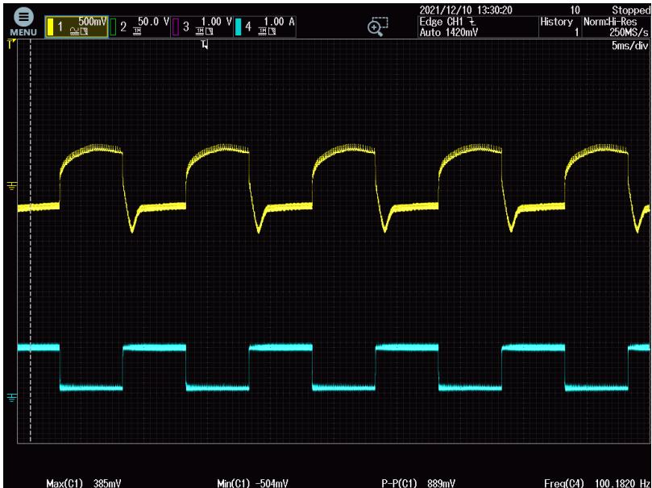

265 VAC

CH1 VOUT ${ \mathsf { C H 1 } } { \mathsf { V } } _ { \mathsf { O U T } }$ $V _ { \mathsf { P K - P K } } { = } 8 8 9 ~ \mathsf { m V }$  
$\mathsf { C H 4 } \mathsf { I } _ { \mathsf { O U T } }$

## Test Condition:

➢ $0 . 1 \mathsf { A } \mathsf { - } 0 . 9 \mathsf { A } \mathsf { - } 0 . 1 \mathsf { A }$  
➢ Slew Rate: 0.5 A/μS  
➢ Frequency: 100 Hz

## 开机延时

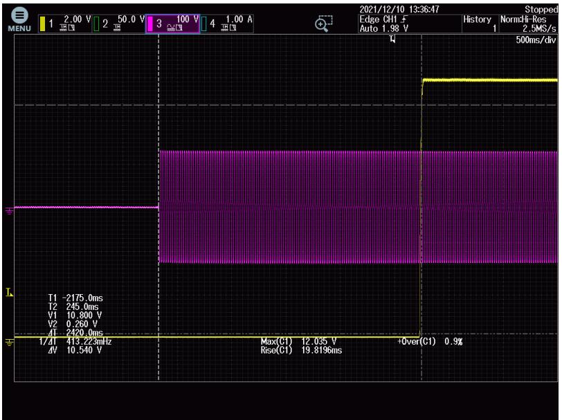

$90 v _ { \mathsf { A C } }$

CH1 $\mathsf { V } _ { \mathsf { O U T } }$  
CH3 VIN\_AC $\mathsf { V } _ { \mathsf { I N \_ A C } }$ $\mathsf { T } _ { \mathsf { D E L A Y } } \colon 2 . 4 2 \ \mathsf { S }$

Test Condition:  
➢ Full Load  
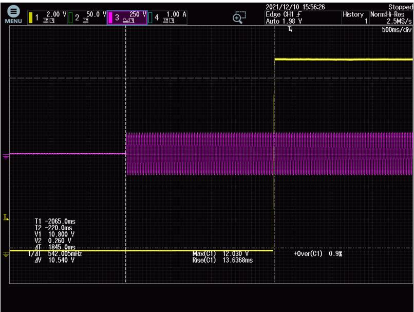

115 VAC

CH1 $\mathsf { V } _ { \mathsf { O U T } }$  
CH3 VIN\_AC $\mathsf { V } _ { \mathsf { I N \_ A C } }$ TDELAY: 1.845 S

Test Condition:  
➢ Full Load  
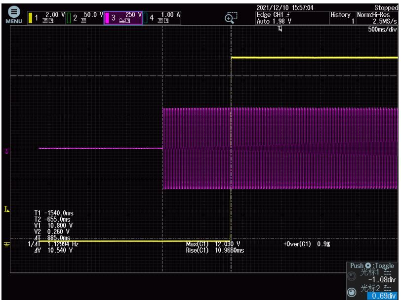

230 VAC

CH1 VOUT $\mathsf { V } _ { \mathsf { O U T } }$  
CH3 VIN\_AC $\mathsf { V } _ { \mathsf { I N \_ A C } }$ ${ \sf T } _ { \sf D E L A Y } .$ 885 mS

Test Condition:  
➢ Full Load  
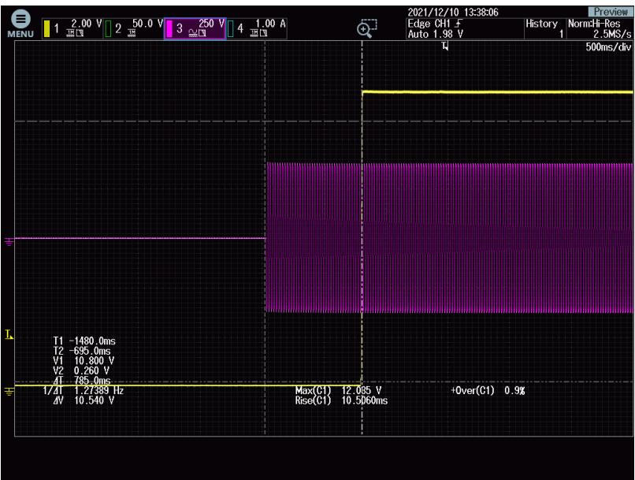

265 $\mathsf { v } _ { \mathsf { A C } }$

${ \mathsf { C H 1 } } { \mathsf { V } } _ { \mathsf { O U T } }$  
CH3 VIN\_AC $\mathsf { V } _ { \mathsf { I N \_ A C } }$ $\mathsf { T } _ { \mathsf { D E L A Y } } \bullet \mathsf { 7 } 8 5$ mS

Test Condition:

➢ Full Load

## 输出电压开机波形

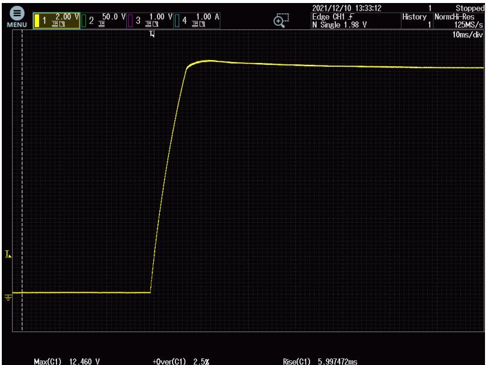

90 VAC

CH1 VOUT  
TRISE: 6 mS

Test Condition:

➢ No Load

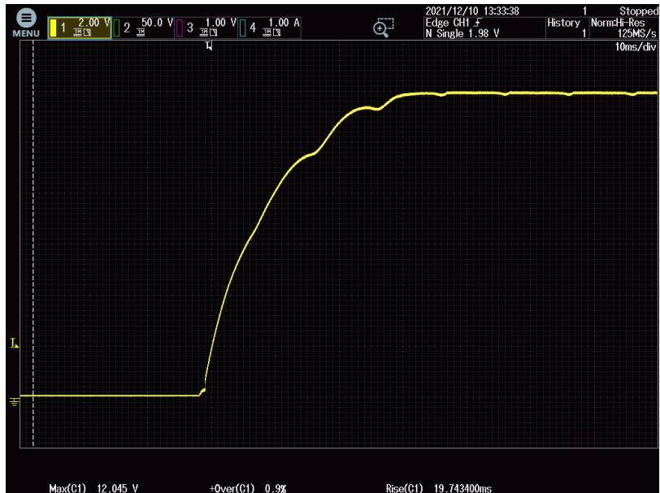

90 VAC

CH1 VOUT T : 19.74 mS

Test Condition:

➢ Full Load

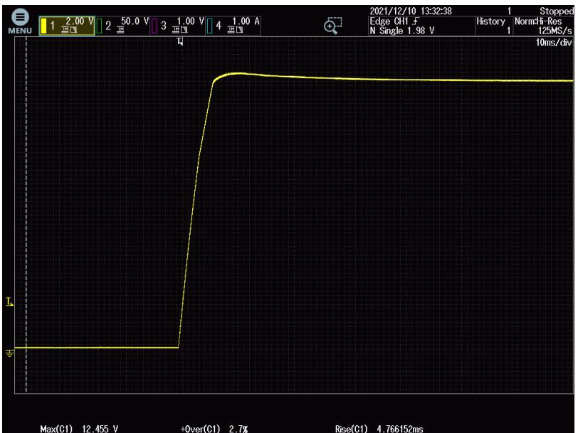

265 VAC

CH1 VOUT  
TRISE: 4.77 mS

Test Condition:

➢ No Load

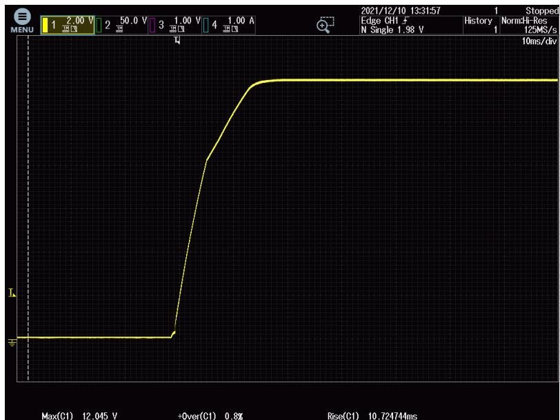

265 VAC

CH1 VOUT T : 10.72 mS

Test Condition:

➢ Full Load

## 容性负载开机波形

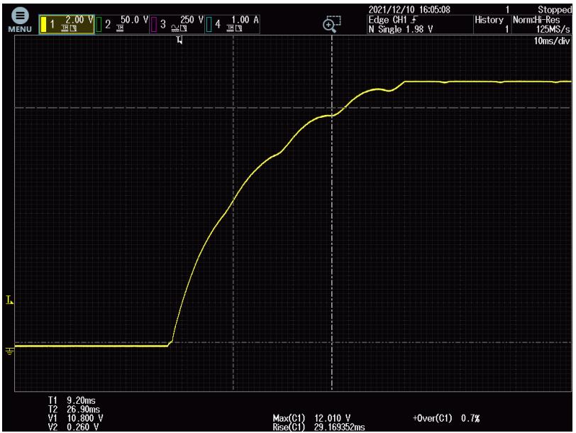

90 VAC

CH1 VOUT  
Co:440uF

Pass

## Test Condition:

➢ Full Load

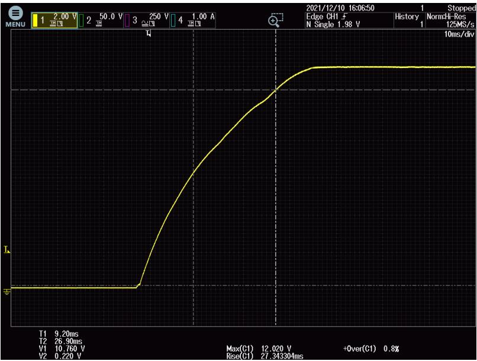

115 VAC

CH1 VOUT  
Co:1000uF

Pass

## Test Condition:

➢ Full Load

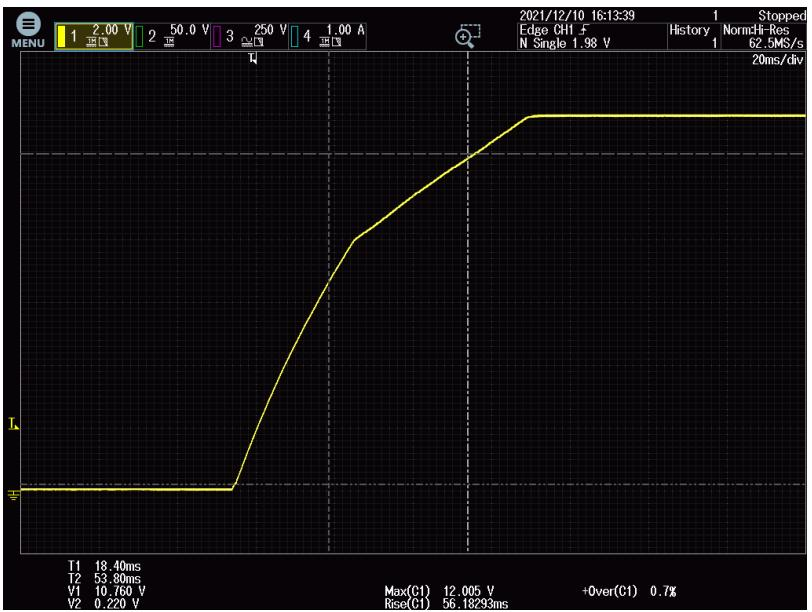

230 VAC

CH1 VOUT  
Co:4000uF

Pass

## Test Condition:

➢ Full Load

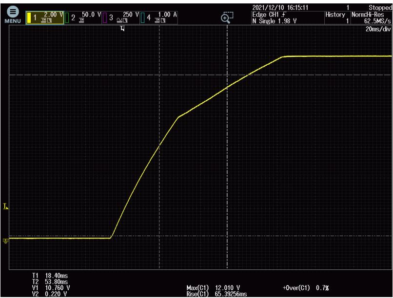

265 VAC

CH1 VOUT  
Co:5000uF

Pass

## Test Condition:

➢ Full Load

## 开关管电压电流波形

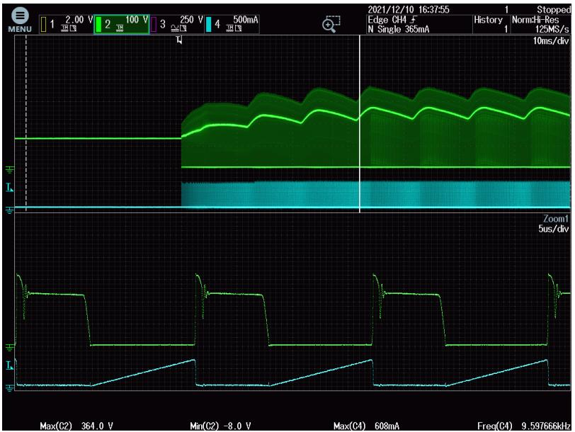

$90 v _ { \mathsf { A C } }$

${ \mathsf { C H } } 2 { \mathsf { V } } _ { \mathsf { D S } }$  
$C H 4 1 _ { \mathsf { D } }$ $V _ { \mathsf { D } \mathsf { S } } \mathsf { = } 3 6 4 \mathsf { V }$ $\mathsf { I } _ { \mathsf { M A X } } { = } 6 0 8 \mathsf { m } \mathsf { A }$

## Test Condition:

➢ Full Load  
➢ 开机

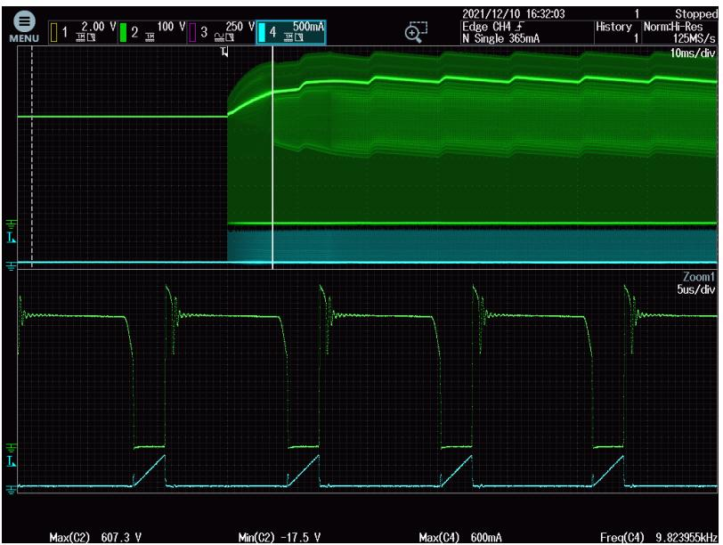

265 VAC

${ \mathsf { C H } } 2 \ { \mathsf { V } } _ { \mathsf { D S } }$  
$C H 4 1 _ { \mathsf { D } }$ $\mathtt { V } _ { \mathtt { D S } } mathtt { = } 6 0 7 . 3 \mathtt { V }$ IMAX=600 A $\mathsf { I } _ { \mathsf { M A X } } { = } 6 0 0 \mathsf { A }$

## Test Condition:

➢ Full Load  
➢ 开机

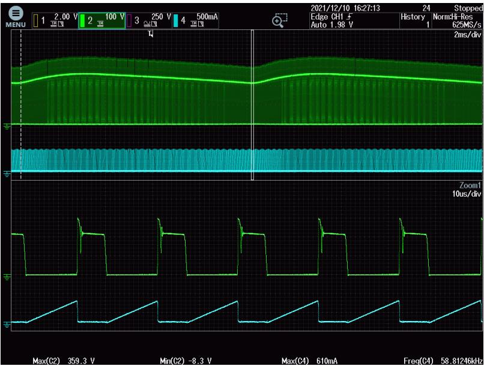

90 VAC

${ \mathsf { C H } } 2 { \mathsf { V } } _ { \mathsf { D S } }$  
$C H 4 1 _ { \mathsf { D } }$ $\mathtt { V } _ { \mathtt { D S } } mathtt { = } 3 5 9 . 3 \mathtt { V }$ IMAX= 610 mA $\mathsf { I } _ { \mathsf { M A X } } { = } 6 1 0 \mathsf { m } \mathsf { A }$

## Test Condition:

➢ Full Load

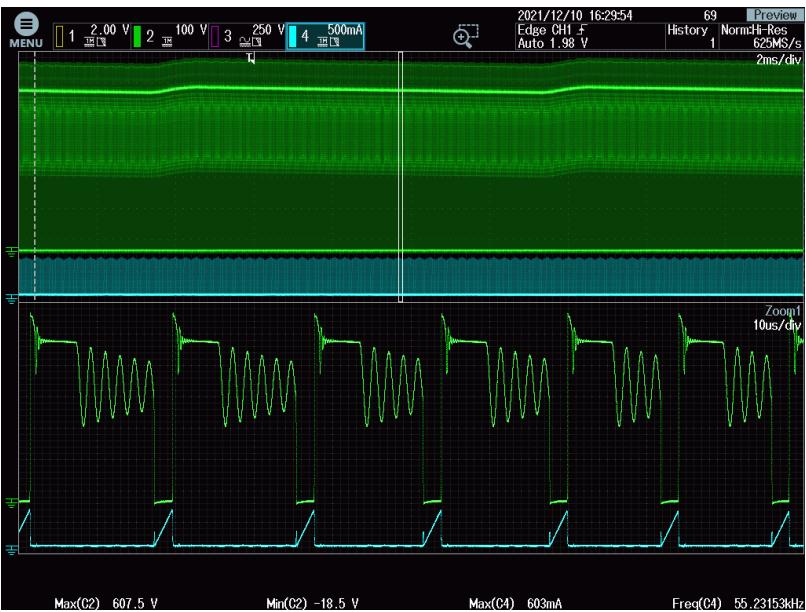

265 VAC

${ \mathsf { C H } } 2 { \mathsf { V } } _ { \mathsf { D S } }$  
$C H 4 1 _ { \mathsf { D } }$ $\mathtt { V } _ { \mathtt { D S } } mathtt { = } 6 0 7 . 5 \mathtt { V }$ $\mathsf { I } _ { \mathsf { M A X } } { = } 6 0 3 \mathsf { A }$

## Test Condition:

➢ Full Load

## 输出二极管电压电流波形

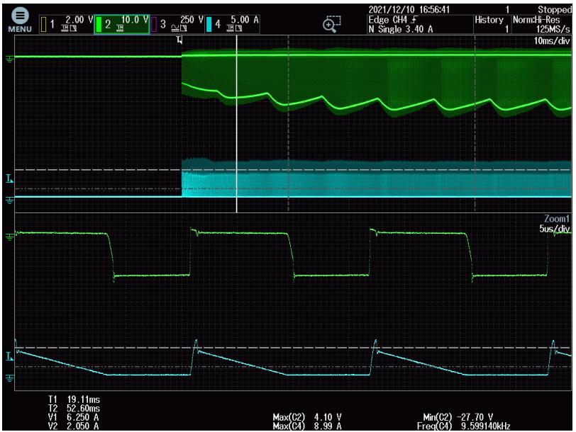

90 VAC

CH2 VD  
CH4 ID  
VD=27.7 V I =8.99 A

## Test Condition:

➢ Full Load  
➢ 开机

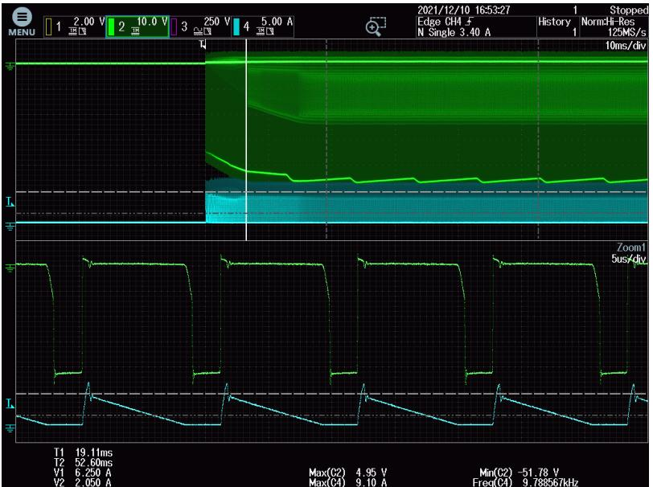

265 VAC

CH2 VD  
CH4 ID  
V =51.78 V  
I =9.1 A

## Test Condition:

➢ Full Load  
➢ 开机

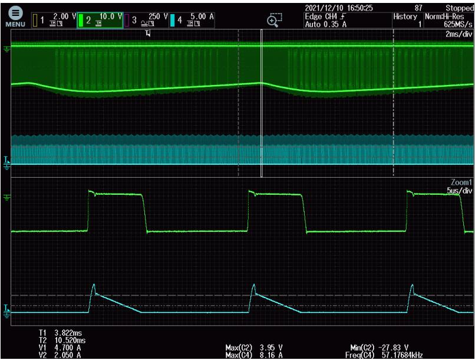

90 VAC

CH2 VD  
CH4 ID  
VD=27.83 V I =8.16 A

Test Condition:

➢ Full Load

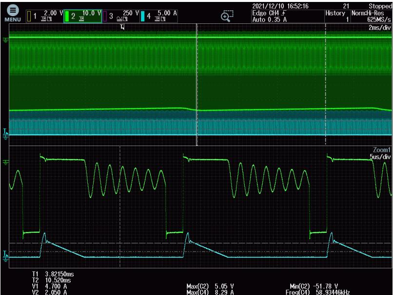

265 VAC

CH2 VD  
CH4 ID  
V =51.78 V I =8.29A

## Test Condition:

➢ Full Load

## 输出短路时开关管和输出二极管波形

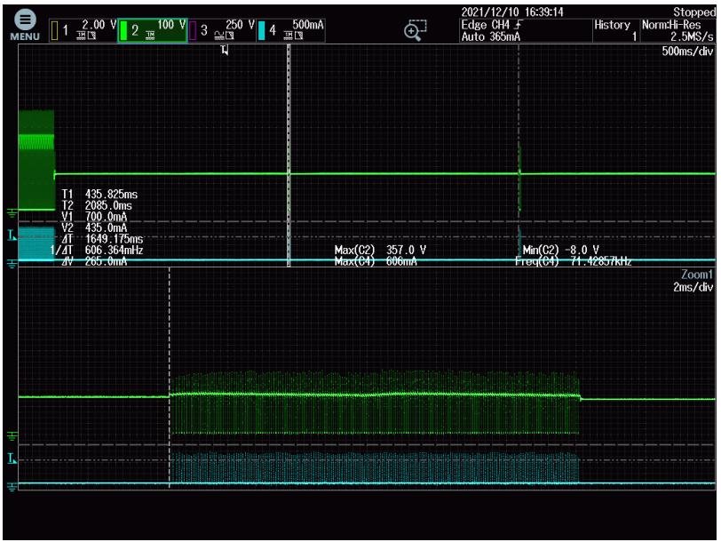

90 VAC

${ \mathsf { C H } } 2 { \mathsf { V } } _ { \mathsf { D S } }$  
$C H 4 1 _ { \mathsf { D } }$ $\mathsf { V } _ { \mathsf { D } \mathsf { S } \_ \mathsf { m a x } } = 3 5 7 \mathsf { V }$ $\mathsf { I } _ { \mathsf { D } \mathsf { S } \_ \mathsf { m a x } } = 6 0 6 \mathsf { m } \mathsf { A }$

## 开关管

## Test Condition:

➢ Full Load

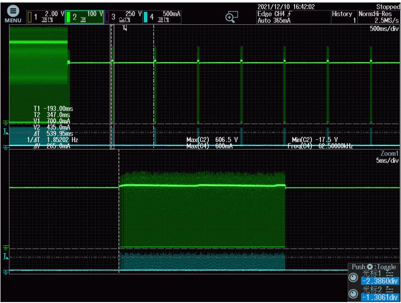

$2 6 5 \ : \mathsf { V } _ { \mathsf { A C } }$

${ \mathsf { C H } } 2 { \mathsf { V } } _ { \mathsf { D S } }$  
CH4 I $C H 4 1 _ { \mathsf { D } }$ $\mathsf { V } _ { \mathsf { D S \_ m a x } } { = } 6 0 6 . 5 \mathsf { V }$ $\mathsf { I } _ { \mathsf { D } \mathsf { S } \_ \mathsf { m a x } } = 6 0 0 \mathsf { m } \mathsf { A }$

## 开关管

## Test Condition:

➢ Full Load

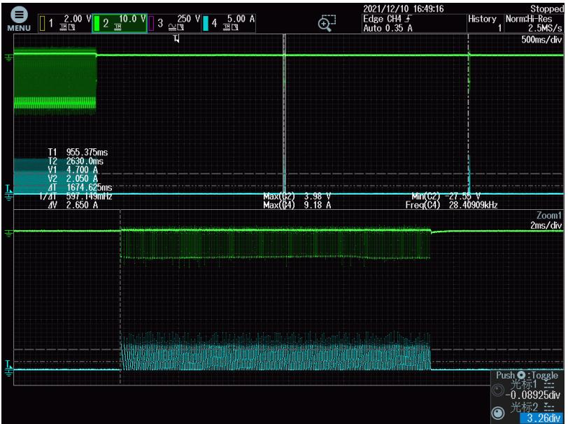

90 VAC

$C H 2 V _ { \mathsf { D } }$  
$C H 4 1 _ { \mathsf { D } }$ $\mathsf { V } _ { \mathsf { D \_ m a x } } { = } 2 7 . 5 5 \lor$ VD $\mathsf { I } _ { \mathsf { D } \_ \mathsf { m a x } } = 9 . 1 8 ~ \mathsf { A }$

## Test Condition:

➢ Full Load

## 二极管

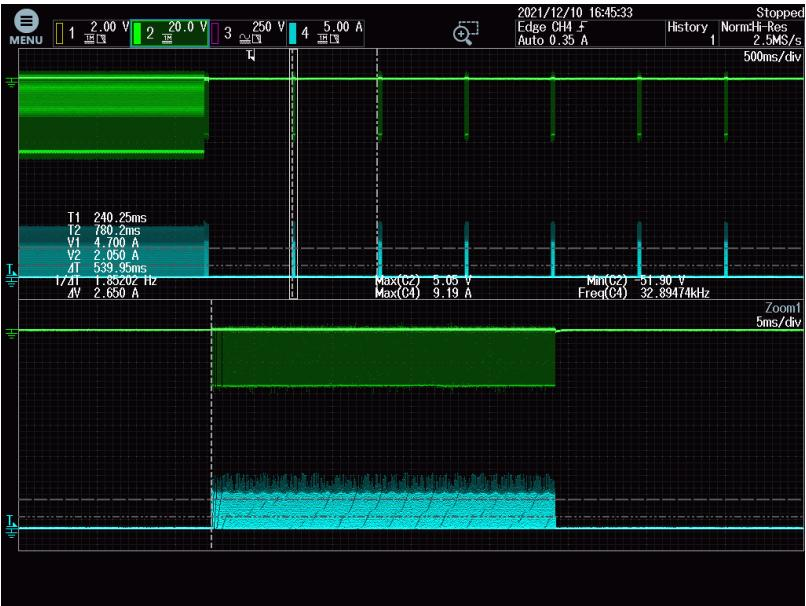

265 VAC

$C H 2 V _ { \mathsf { D } }$  
$C H 4 1 _ { \mathsf { D } }$ $\mathsf { V } _ { \mathsf { D } \_ \mathsf { m a x } } { = } 5 1 . 9 \ V$ VD $\mathsf { I } _ { \mathsf { D } \_ \mathsf { m a x } } = 9 . 1 9 \mathrm { ~ A ~ }$

## Test Condition:

➢ $\mathsf { F u l l \mathsf { L o a d } }$

## 二极管

## 温升测试

<table><tr><td rowspan="2">项目</td><td colspan="4">温度(°C)</td></tr><tr><td>90VAC</td><td>115VAC</td><td>230VAC</td><td>264VAC</td></tr><tr><td>环境温度</td><td>39.2</td><td>38.4</td><td>38.7</td><td>39</td></tr><tr><td>S7134B (U1)</td><td>98.8</td><td>89.2</td><td>83.1</td><td>84.9</td></tr><tr><td>SS56FL (D3)</td><td>100.5</td><td>97.2</td><td>96.5</td><td>97.8</td></tr><tr><td>变压器绕组(T1)</td><td>95.7</td><td>90.4</td><td>87.2</td><td>88.3</td></tr><tr><td>变压器磁芯(T1)</td><td>97.6</td><td>93.1</td><td>91.5</td><td>92.8</td></tr><tr><td>输入电解电容(C2)</td><td>81.4</td><td>75.6</td><td>70.3</td><td>70.9</td></tr><tr><td>输出电解电容(C7)</td><td>79.5</td><td>77</td><td>76</td><td>76.7</td></tr><tr><td>整流桥(BD1)</td><td>70.1</td><td>64</td><td>56.4</td><td>55.9</td></tr></table>

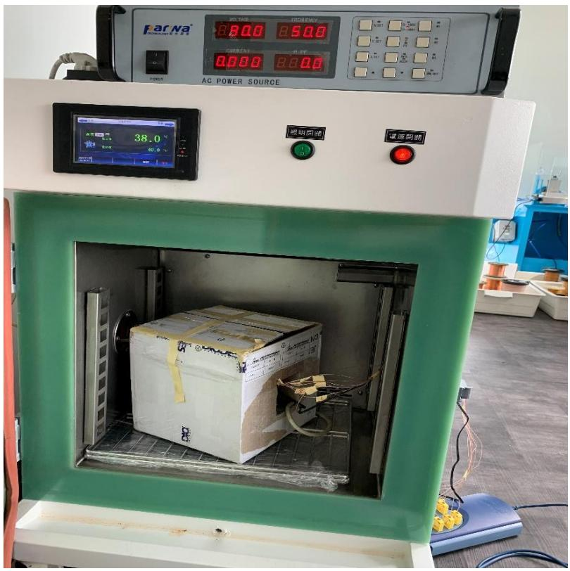

## 测试说明

➢ 在温箱中进行测试  
➢ 电路板放在一个封闭的盒子内  
➢ 热电偶连接到各个测量点  
➢ 等测量点温度达到稳定后记录数据

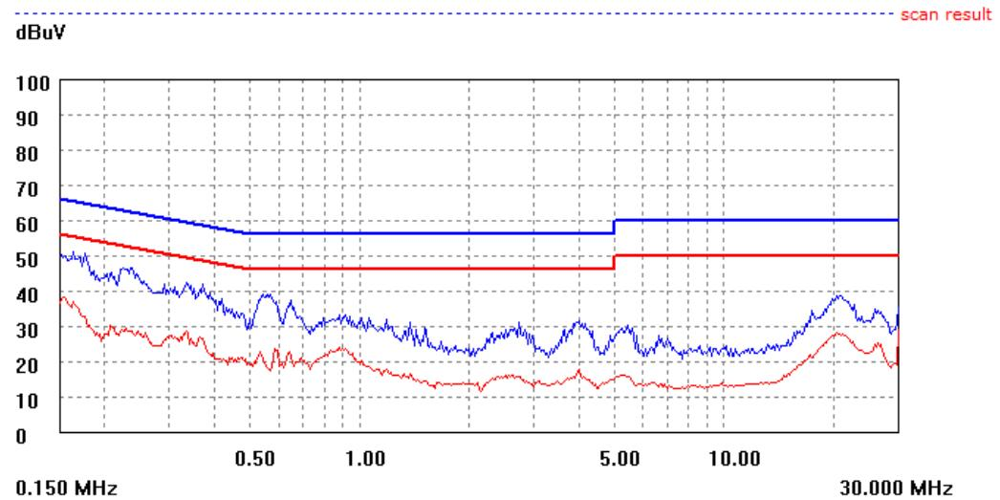

CE-115VAC Line

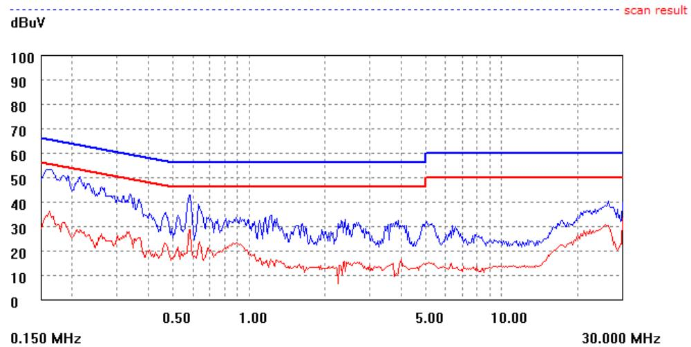

CE-230VAC Line

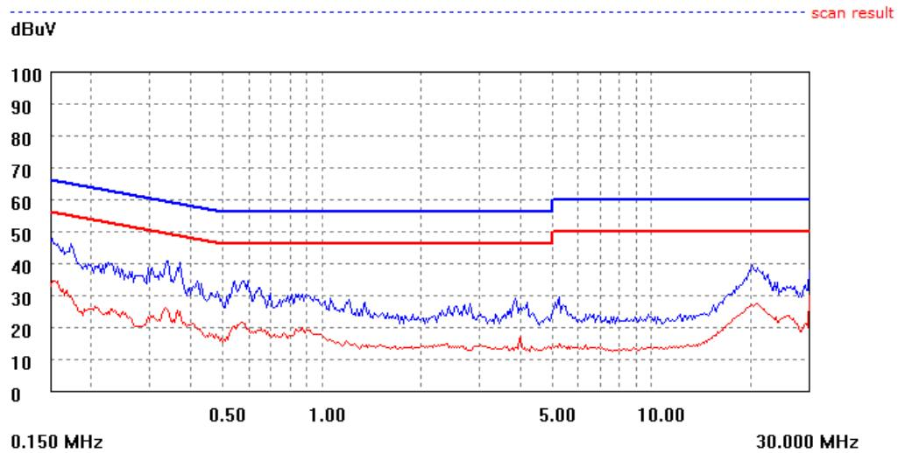

CE-115VAC Neutral

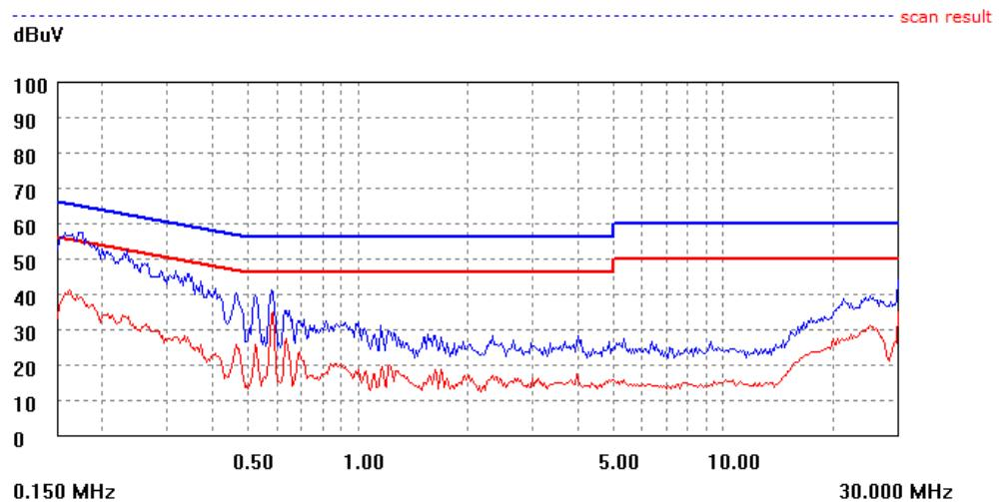

CE-230VAC Neutral

## THANK YOU FOR WATCHING
