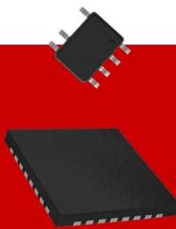

## BP85224DA -5V/0.2A参考设计

## (-5V/0.2A@85\~265Vac)

上海晶丰明源半导体股份有限公司

Shanghai Bright Power Semiconductor Co., Ltd.

PYQ

时间：2022年2月

## 内容

■ BP8224DA简介  
■ 电源规格  
■ 电路及实物图  
BOM  
■ PCB Layout图  
■ 性能测试数据

## ■ 产品特点:

集成VCC电容、续流二极管和反馈二极管  
集成650V高压MOSFET  
集成高压启动和自供电电路  
低待机功耗50mW@230Vac  
➢ 优异的动态响应速度，输出电压纹波小  
降低音频噪声的降幅调制技术  
改善EMI性能的频率调制技术

## ■ 应用领域：

小家电辅助电源  
电机驱动辅助电源  
IOT/智能家居/智能照明

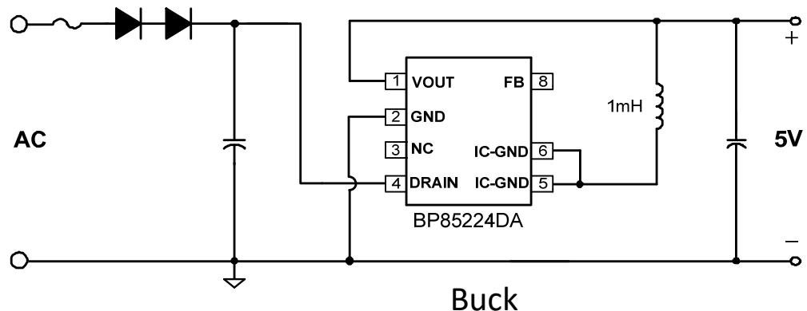

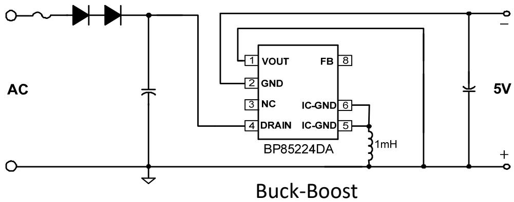

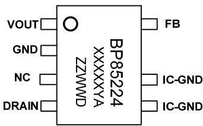

SOP7封装

## 电源规格

<table><tr><td>项目描述</td><td>符号</td><td>最小</td><td>典型</td><td>最大</td><td>单位</td><td>备注</td></tr><tr><td colspan="7">输入</td></tr><tr><td>电压</td><td> $V_{IN}$ </td><td>85</td><td>115/230</td><td>264</td><td> $V_{AC}$ </td><td></td></tr><tr><td>频率</td><td> $f_{LINE}$ </td><td>47</td><td>50/60</td><td>63</td><td>Hz</td><td></td></tr><tr><td colspan="7">输出</td></tr><tr><td>输出电压</td><td> $V_{OUT}$ </td><td></td><td>-5</td><td></td><td>V</td><td>±5%</td></tr><tr><td>输出电流</td><td> $I_{OUT}$ </td><td>0</td><td></td><td>200</td><td>mA</td><td></td></tr><tr><td>输出电压纹波</td><td> $V_{RIPPLE}$ </td><td></td><td></td><td>100</td><td>mV</td><td>20MHz带宽</td></tr><tr><td>连续输出功率</td><td> $P_{OUT}$ </td><td></td><td>1</td><td></td><td>W</td><td></td></tr><tr><td colspan="7">效率</td></tr><tr><td>待机功耗</td><td> $P_{STDBY}$ </td><td></td><td></td><td>50</td><td>mW</td><td>230VAC,包含假负载</td></tr><tr><td>满载效率</td><td>η</td><td>56</td><td></td><td></td><td>%</td><td></td></tr><tr><td colspan="7">环境</td></tr><tr><td>传导EMI</td><td></td><td colspan="4">满足CISPR22/EN55022 Class B</td><td></td></tr><tr><td>Surge</td><td></td><td></td><td>2</td><td></td><td>kV</td><td>差模</td></tr><tr><td>EFT</td><td></td><td></td><td>4</td><td></td><td>kV</td><td>5kHz/100kHz/38kHz</td></tr><tr><td>ESD</td><td></td><td></td><td>15</td><td>20</td><td>kV</td><td>空气放电</td></tr><tr><td>工作环境温度</td><td> $T_{AMP}$ </td><td>0</td><td></td><td>50</td><td>°C</td><td></td></tr></table>

## 电路及实物图

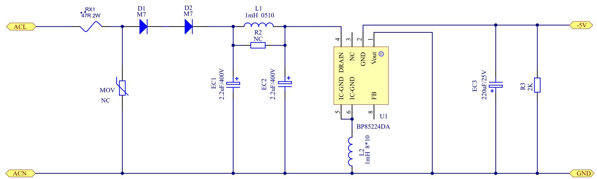

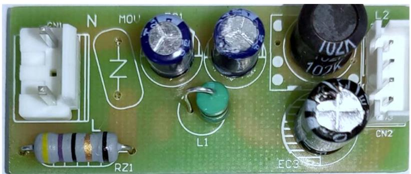

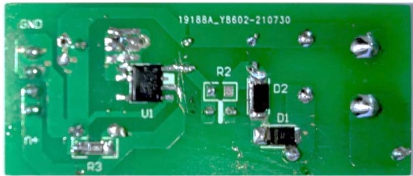

<table><tr><td>序号</td><td>元件标号</td><td>参数描述</td><td>封装尺寸</td><td>数量</td></tr><tr><td>1</td><td>PCB</td><td>CEM-1, 单面板</td><td>55.25mm*23.26mm</td><td>1</td></tr><tr><td>2</td><td>RX1</td><td>2W, 47R保险丝电阻</td><td>DIP</td><td>1</td></tr><tr><td>3</td><td>D1,D2</td><td>M7, 1A/1000V</td><td>SMA</td><td>2</td></tr><tr><td>4</td><td>L1</td><td>1mH, 色环电感0510</td><td>DIP</td><td>1</td></tr><tr><td>5</td><td>L2</td><td>1mH, 工字电感8*10</td><td>ø8*10mm</td><td>1</td></tr><tr><td>6</td><td>EC1, EC2</td><td>2.2uF/400V, 电解电容</td><td>ø6.3*9mm</td><td>2</td></tr><tr><td>7</td><td>EC3</td><td>220uF/25V, 电解电容</td><td>ø8*11.5mm</td><td>1</td></tr><tr><td>8</td><td>R3</td><td>2K, ±5%</td><td>SMD1206</td><td>1</td></tr><tr><td>9</td><td>U1</td><td>BP85224DA, SOP7</td><td>SOP7</td><td>1</td></tr><tr><td></td><td></td><td></td><td>Total</td><td>11</td></tr></table>

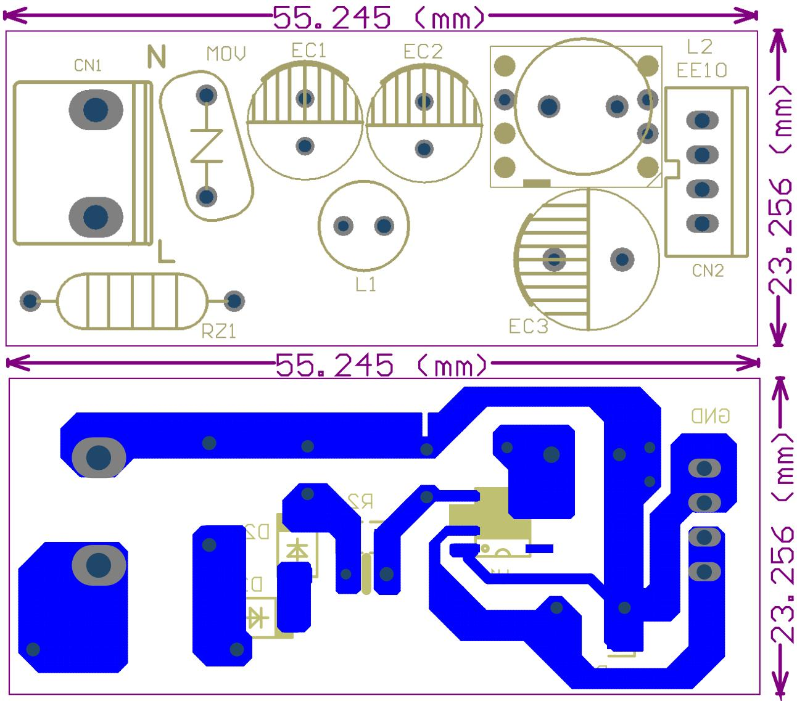

## 待机功耗

空载功耗  
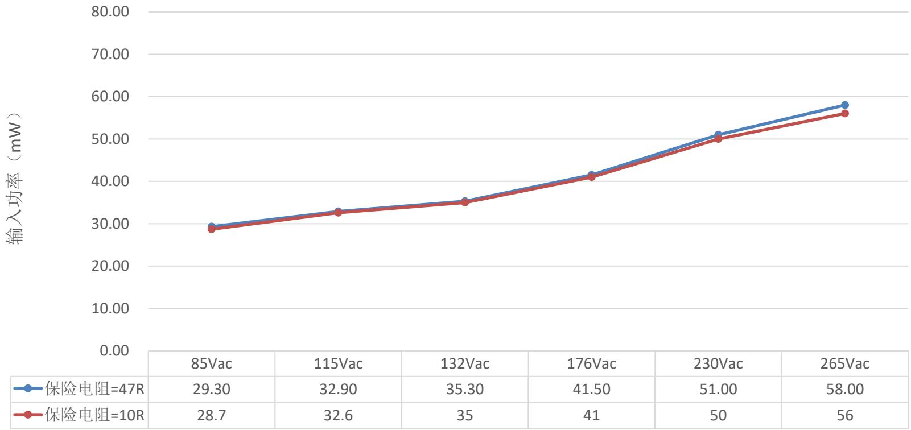

## 输入电压

## 效率

效率测试  
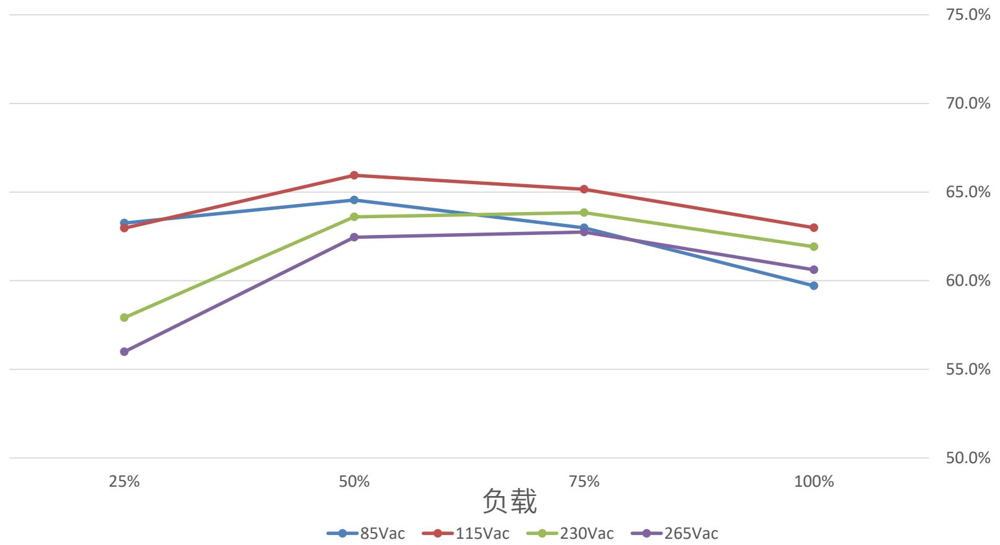

## 输出电压调整率

<table><tr><td> $V_{IN}(VAC)$ Load(%)</td><td>85</td><td>115</td><td>132</td><td>176</td><td>230</td><td>265</td><td>平均值</td><td>线调整率</td></tr><tr><td>0</td><td>5.10</td><td>5.10</td><td>5.09</td><td>5.08</td><td>5.07</td><td>5.07</td><td>5.09</td><td>0.59%</td></tr><tr><td>25%</td><td>5.04</td><td>5.05</td><td>5.04</td><td>5.05</td><td>5.04</td><td>5.04</td><td>5.04</td><td>0.20%</td></tr><tr><td>50%</td><td>4.97</td><td>4.97</td><td>4.97</td><td>4.97</td><td>4.98</td><td>4.98</td><td>4.97</td><td>0.20%</td></tr><tr><td>75%</td><td>4.93</td><td>4.93</td><td>4.93</td><td>4.92</td><td>4.92</td><td>4.92</td><td>4.93</td><td>0.20%</td></tr><tr><td>100%</td><td>4.90</td><td>4.90</td><td>4.91</td><td>4.90</td><td>4.90</td><td>4.90</td><td>4.90</td><td>0.20%</td></tr><tr><td>平均值</td><td>4.99</td><td>4.99</td><td>4.99</td><td>4.98</td><td>4.98</td><td>4.98</td><td rowspan="2" colspan="2"></td></tr><tr><td>负载调整率</td><td>4.01%</td><td>4.01%</td><td>3.61%</td><td>3.61%</td><td>3.41%</td><td>3.41%</td></tr></table>

■ 计算方法：调整率=100%\*(最大值-最小值)/平均值  
■ 测试条件：2K假负载

## 输出电压纹波

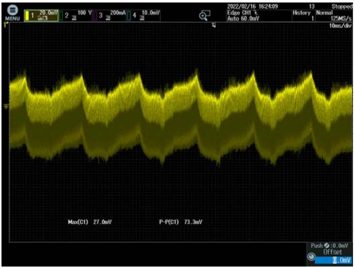

85 V $_{AC}$

■ CH1 V $_{OUT}$ Ripple
V $_{PK-PK}$ =73.3mV

## Test Condition:

Full Load

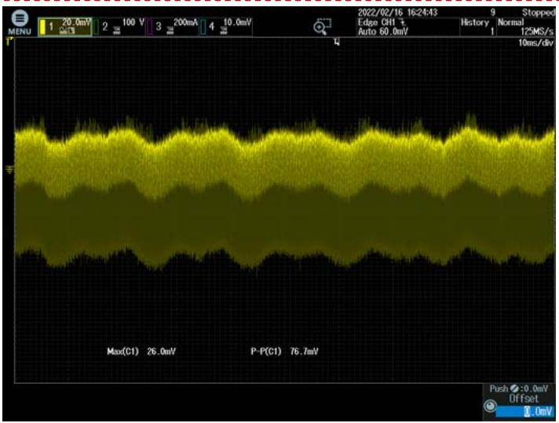

230 V $_{AC}$

■ CH1 V $_{OUT}$ Ripple
V $_{PK-PK}$ =76.7mV

## Test Condition:

Full Load ■ CH1 V $_{OUT}$ Ripple
V $_{PK-PK}$ =73.7mV

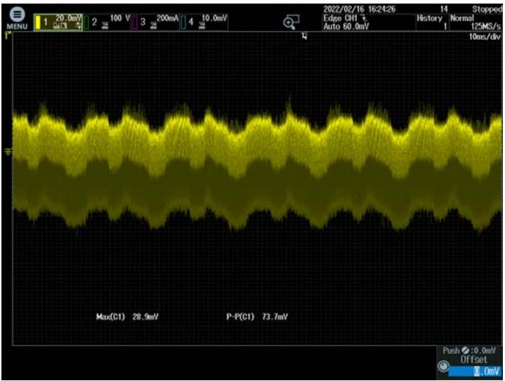

B25 晶丰明源  
Bright Power Semiconductor  
115 V $_{AC}$

## Test Condition:

Full Load

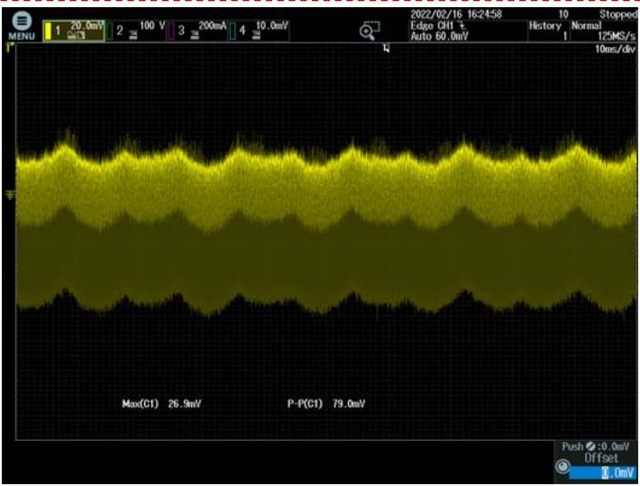

265 V $_{AC}$

■ CH1 V $_{OUT}$ Ripple
V $_{PK-PK}$ =79.0mV

## Test Condition:

Full Load

## 动态负载(50%-100%)

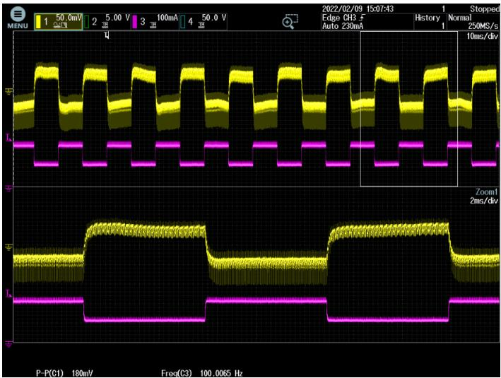

85 V $_{AC}$

■ CH1 V $_{OUT}$ V $_{PK-PK}$ = 180 mV  
CH3 IOUT

## Test Condition:

0.1 A-0.2 A-0.1 A  
Slew Rate: 0.2 A/μS  
Frequency: 100 Hz

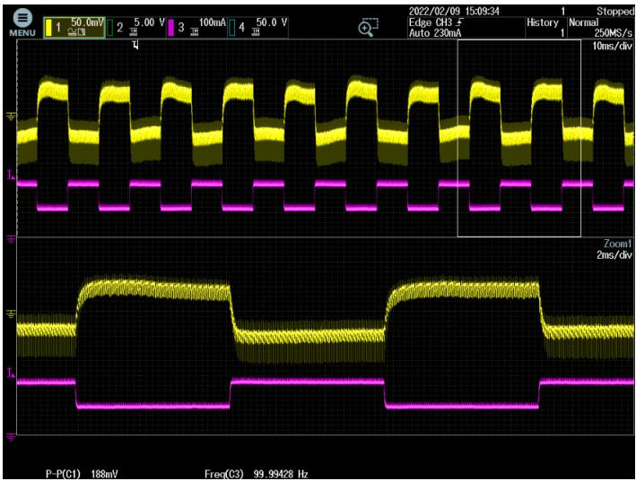

230 V $_{AC}$

■ CH1 V $_{OUT}$ V $_{PK-PK}$ = 188 mV  
CH3 IOUT

## Test Condition:

0.1 A-0.2 A-0.1 A  
Slew Rate: 0.2 A/μS  
Frequency: 100 Hz

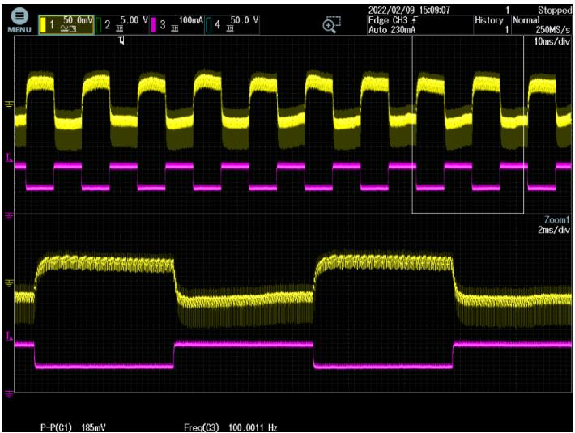

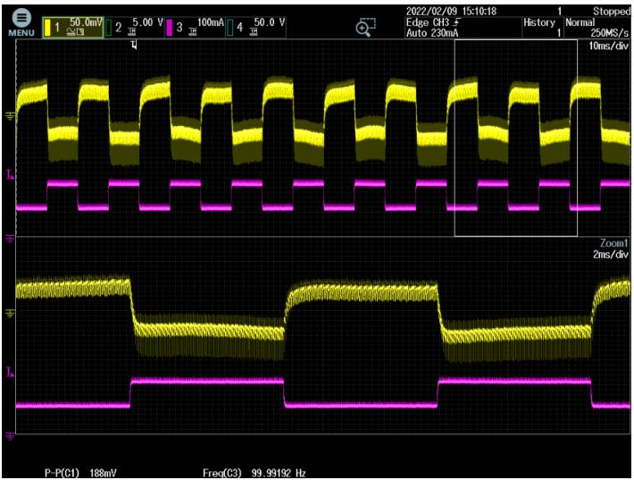

  
Bright Power Semiconductor  
115 V $_{AC}$

■ CH1 V $_{OUT}$ V $_{PK-PK}$ = 185 mV  
CH3 IOUT

## Test Condition:

0.1 A-0.2 A-0.1 A  
Slew Rate: 0.2 A/μS  
Frequency: 100 Hz

265 V $_{AC}$

■ CH1 V $_{OUT}$ V $_{PK-PK}$ = 188 mV  
CH3 IOUT

## Test Condition:

0.1 A-0.2 A-0.1 A  
Slew Rate: 0.2 A/μS  
Frequency: 100 Hz

## 动态负载(10%-90%)

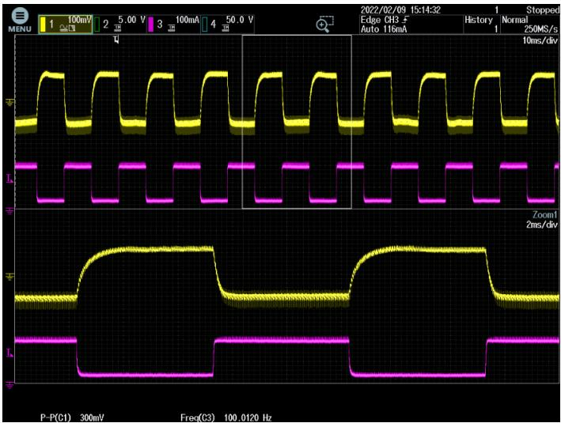

85 V $_{AC}$

■ CH1 V $_{OUT}$ V $_{PK-PK}$ =300 mV  
CH3 IOUT

## Test Condition:

0.02A-0.18 A-0.02 A  
Slew Rate: 0.2 A/μS  
Frequency: 100 Hz

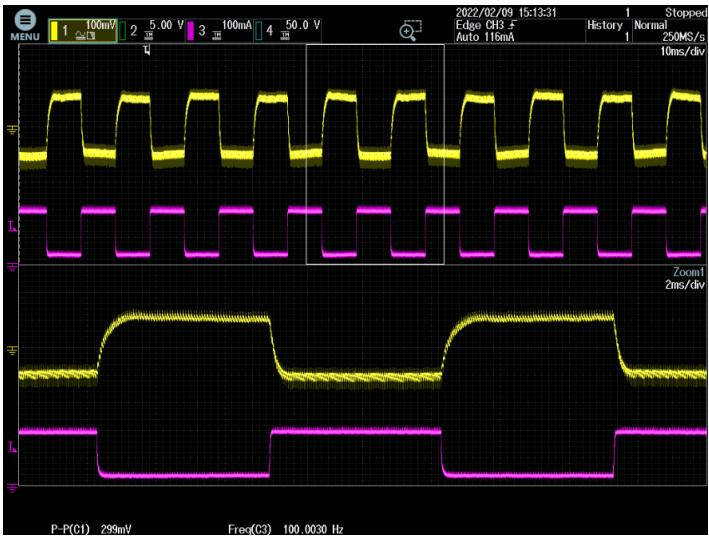

230 V $_{AC}$

■ CH1 V $_{OUT}$ V $_{PK-PK}$ =299 mV
■ CH3 I $_{OUT}$

## Test Condition:

0.02A-0.18 A-0.02 A  
Slew Rate: 0.2 A/μS  
Frequency: 100 Hz

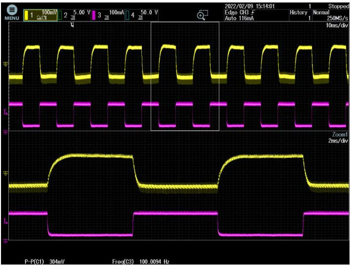

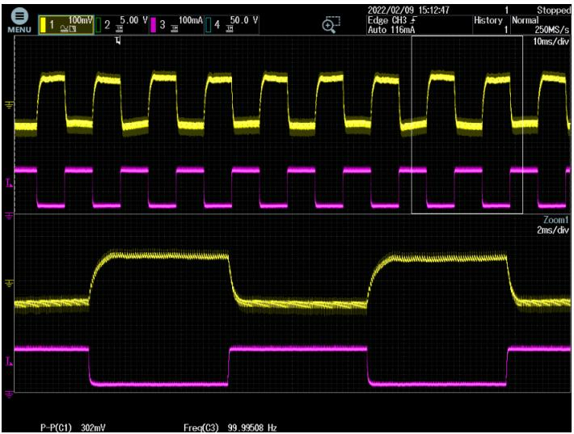

  
Bright Power Semiconductor  
115 V $_{AC}$

■ CH1 V $_{OUT}$ V $_{PK-PK}$ =304 mV  
CH3 IOUT

## Test Condition:

0.02A-0.18 A-0.02 A  
Slew Rate: 0.2 A/μS  
Frequency: 100 Hz

265 V $_{AC}$

■ CH1 V $_{OUT}$ V $_{PK-PK}$ =302 mV  
CH3 IOUT

## Test Condition:

0.02A-0.18 A-0.02 A  
Slew Rate: 0.2 A/μS  
Frequency: 100 Hz

## 输出电压开机波形ok

85 V $_{AC}$  
  
Test Condition:  
No Load

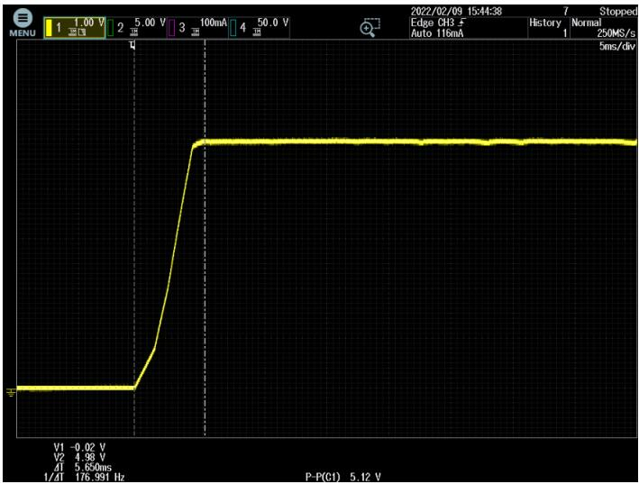

265 V $_{AC}$  
  
Test Condition:  
No Load

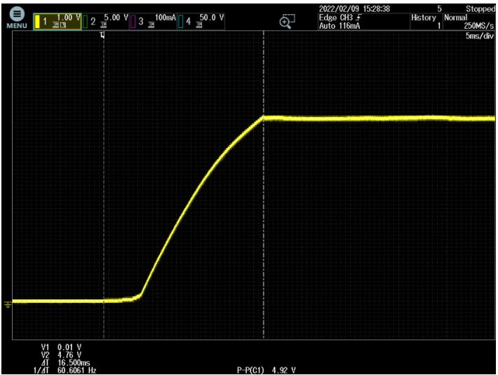

  
Bright Power Semiconductor  
85 V $_{AC}$

  
Test Condition:  
Full Load

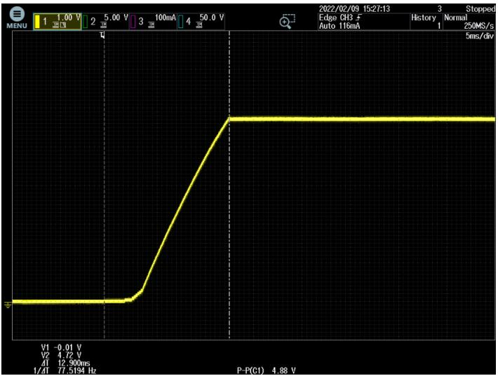

265 V $_{AC}$  
  
Test Condition:  
Full Load

## MOSFET开机波形

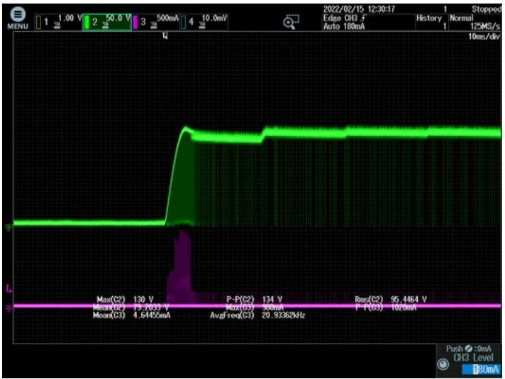

85 V $_{AC}$

CH2 V $_{DS}$  
CH3 I $_{DS}$

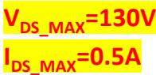  
Test Condition:

No Load

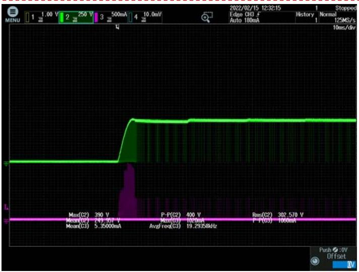

265 V $_{AC}$

CH2 V $_{DS}$  
CH3 I $_{DS}$

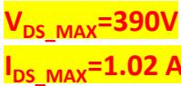  
Test Condition:

No Load

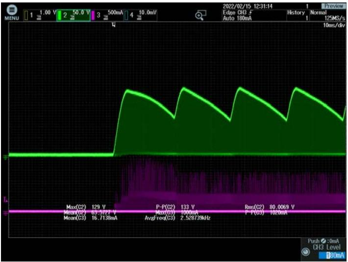

  
Bright Power Semiconductor  
85 V $_{AC}$

CH2 V $_{DS}$  
CH3 I $_{DS}$ V $_{DS\_MAX}$ =129V
I $_{DS\_MAX}$ =1 A

Test Condition:

Full Load

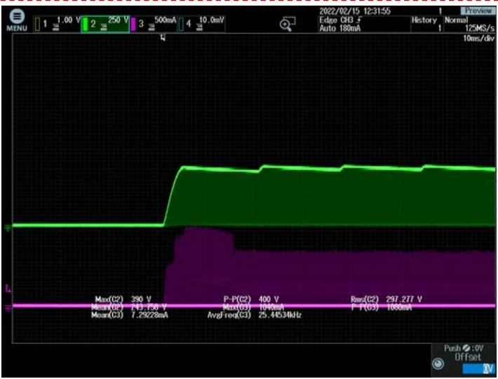

265 V $_{AC}$

CH2 V $_{DS}$  
CH3 I $_{DS}$

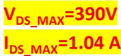  
Test Condition:

Full Load

## MOSFET稳态波形

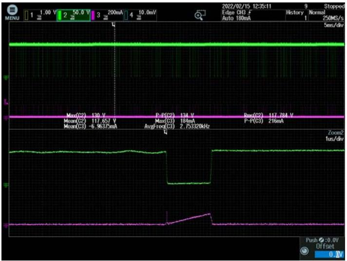

85 V $_{AC}$  
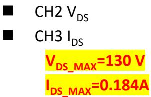

Test Condition:  
No Load

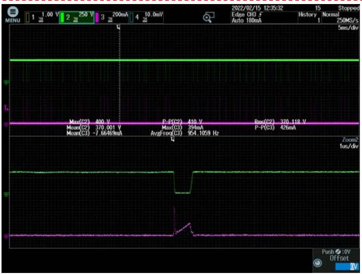

265 V $_{AC}$  
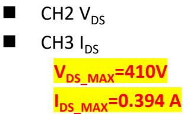

Test Condition:  
No Load

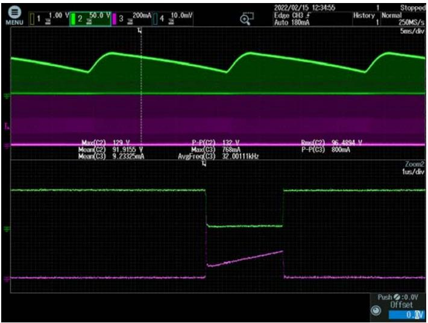

  
Bright Power Semiconductor  
85 V $_{AC}$

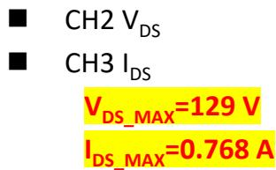

Test Condition:  
Full Load

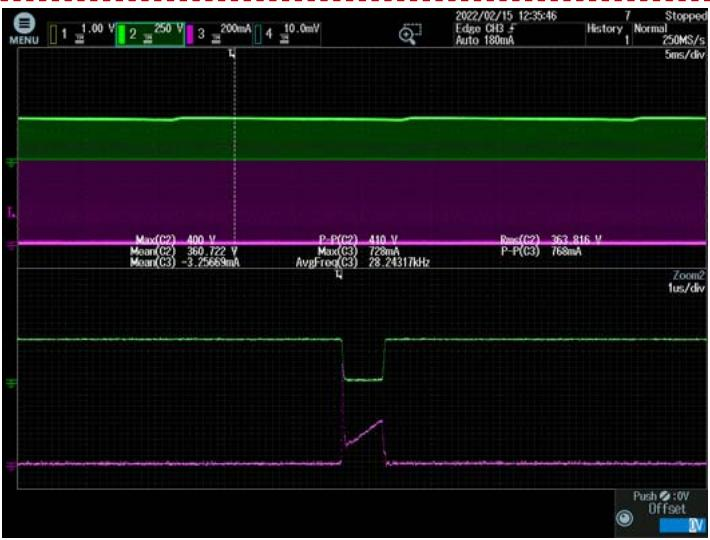

265 V $_{AC}$  
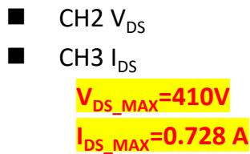

Test Condition:  
Full Load

## 输出二极管开机波形

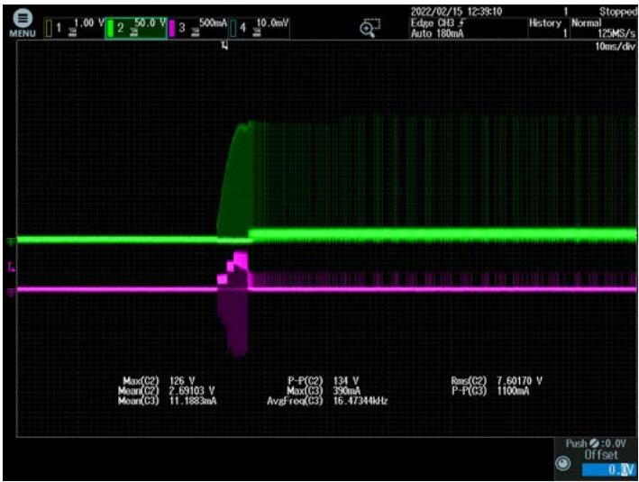

85 V $_{AC}$

CH2 V $_{R}$  
CH3 I $_{F}$

$$
\begin{array}{l} \mathrm {V_ {R\_MAX}} = 1 3 4 \mathrm{V} \\ \mathrm {I_ {F\_MAX}} = 0. 3 9 \mathrm{A} \end{array}
$$

## Test Condition:

No Load

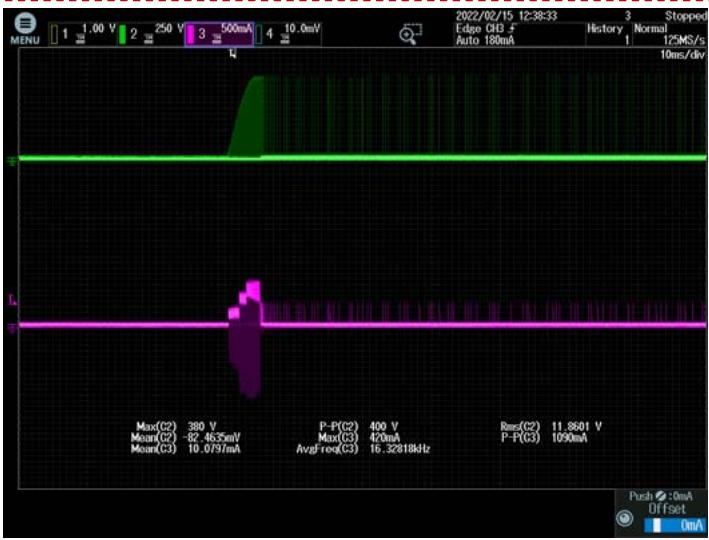

265 V $_{AC}$

CH2 V $_{R}$  
CH3 I $_{F}$

$$
\begin{array}{l} \mathrm {V_ {R\_MAX}} = 3 8 0 \mathrm{V} \\ \mathrm {I_ {F\_MAX}} = 0. 4 2 \mathrm{A} \end{array}
$$

## Test Condition:

No Load

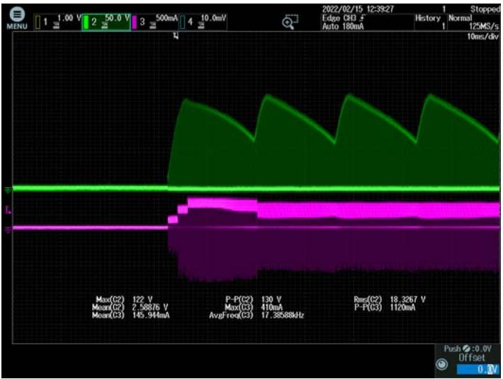

晶丰明源

Bright Power Semiconductor

85 V $_{AC}$

CH2 V $_{R}$  
CH3 I $_{F}$

$$
\begin{array}{l} \mathrm {V_ {R\_MAX}} = 1 2 2 \mathrm{V} \\ \mathrm {I_ {F\_MAX}} = 0. 4 1 \mathrm{A} \end{array}
$$

## Test Condition:

Full Load

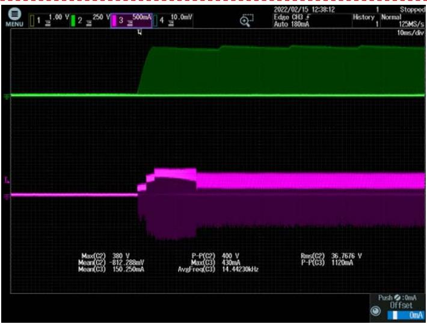

265 V $_{AC}$

CH2 V $_{R}$  
CH3 I $_{F}$

$$
\begin{array}{l} \mathrm {V_ {R\_MAX}} = 3 8 0 \mathrm{V} \\ \mathrm {I_ {F\_MAX}} = 0. 4 3 \mathrm{A} \end{array}
$$

## Test Condition:

Full Load

## 输出二极管稳态波形

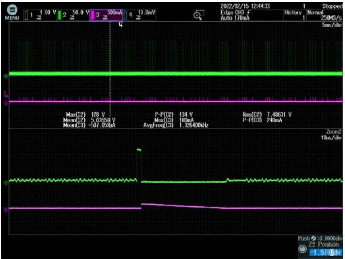

85 V $_{AC}$

CH2 V $_{R}$  
CH3 I $_{F}$

$$
V _ {R \_ M A X} = 1 2 8 V
$$

$$
I _ {F \_ M A X} = 0. 1 8 \mathrm{A}
$$

## Test Condition:

No Load

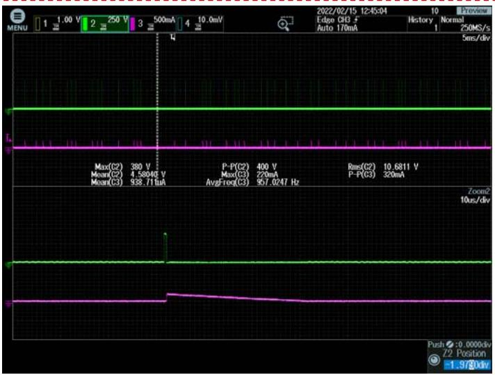

265 V $_{AC}$

CH2 V $_{R}$  
CH3 I $_{F}$

$$
V _ {R \_ M A X} = 3 8 0 V
$$

$$
I _ {F \_ M A X} = 0. 2 2 \mathrm{A}
$$

## Test Condition:

No Load

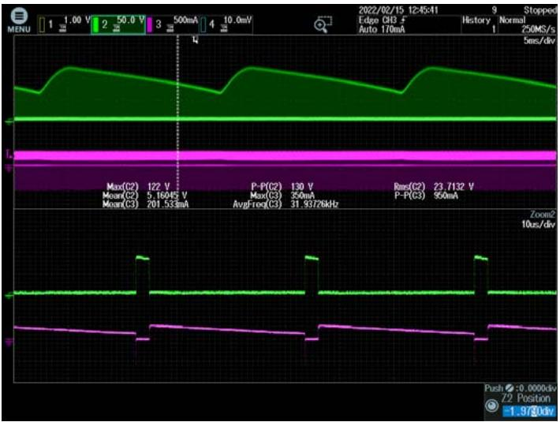

晶丰明源

Bright Power Semiconductor

85 V $_{AC}$

CH2 V $_{R}$  
CH3 I $_{F}$

$$
V _ {R \_ M A X} = 1 2 2 V
$$

$$
I _ {F \_ M A X} = 0. 3 5 \mathrm{A}
$$

## Test Condition:

Full Load

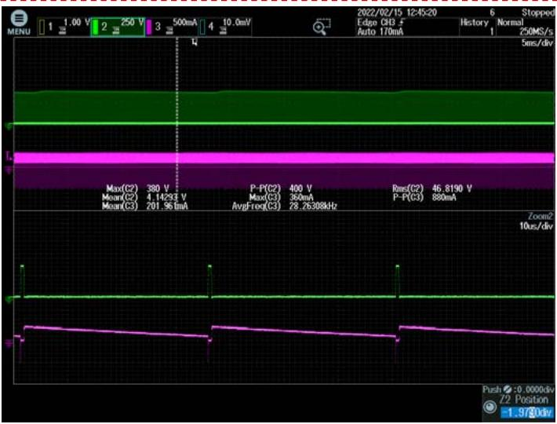

265 V $_{AC}$

CH2 V $_{R}$  
CH3 I $_{F}$

$$
V _ {R \_ M A X} = 3 8 0 V
$$

$$
I _ {F \_ M A X} = 0. 3 6 \mathrm{A}
$$

## Test Condition:

Full Load

## 输出短路保护（MOSFET波形）

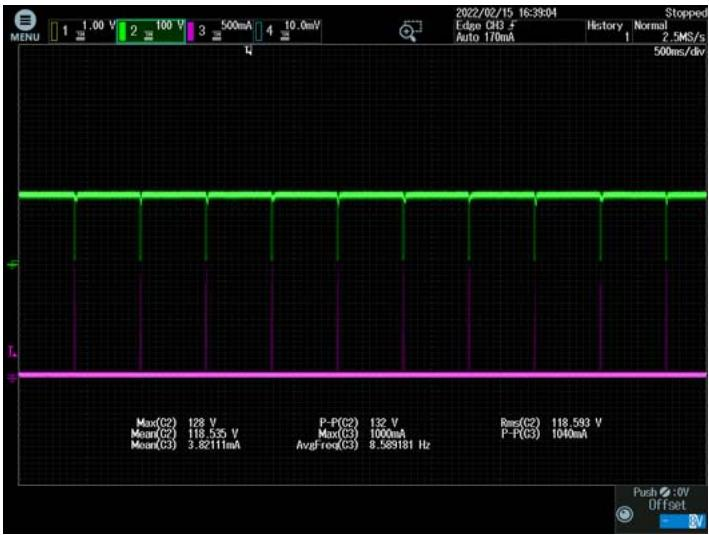

85 V $_{AC}$

CH2 V $_{DS}$  
CH3 I $_{DS}$

$$
V _ {D S \_ M A X} = 1 2 8 \mathrm{V}
$$

$$
I _ {D S \_ M A X} = 1 \mathrm{A}
$$

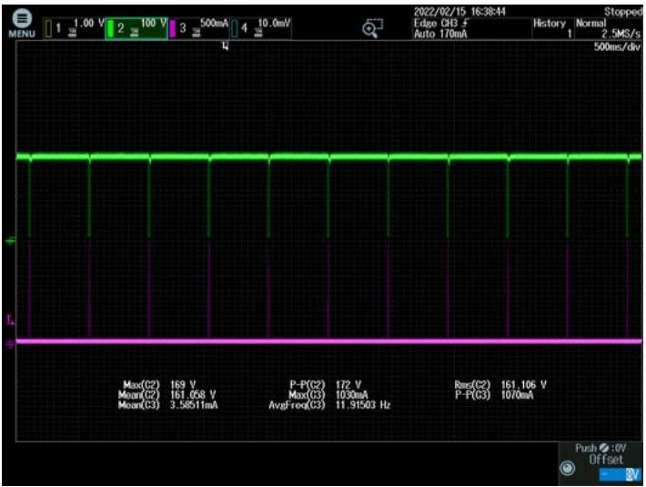

  
Bright Power Semiconductor  
115 V $_{AC}$

CH2 V $_{DS}$  
CH3 I $_{DS}$

$$
V _ {D S \_ M A X} = 1 6 9 \mathrm{V}
$$

$$
I _ {D S \_ M A X} = 1. 0 3 0 \mathrm{A}
$$

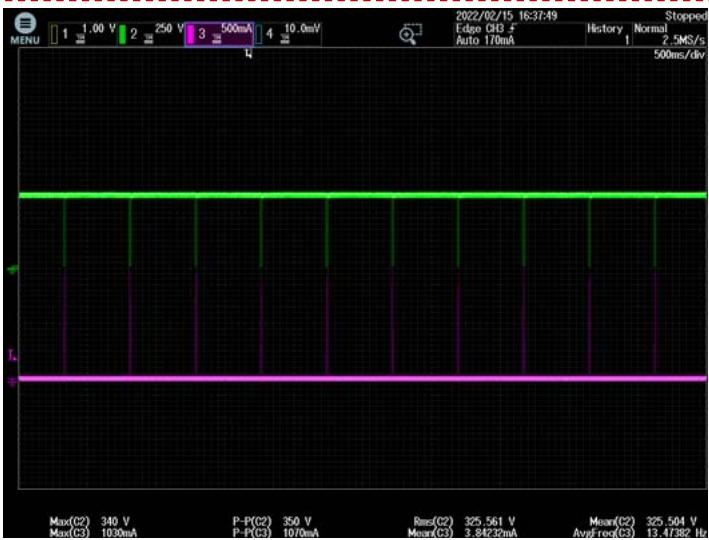

230 V $_{AC}$

CH2 V $_{DS}$  
CH3 I $_{DS}$

$$
V _ {D S \_ M A X} = 3 4 0 \mathrm{V}
$$

$$
I _ {D S \_ M A X} = 1. 0 7 \mathrm{A}
$$

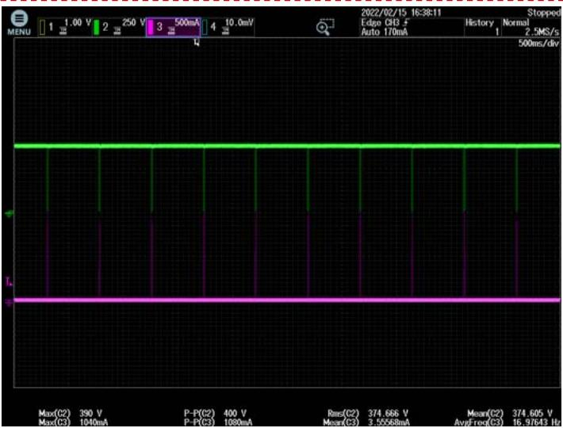

265 V $_{AC}$

CH2 V $_{DS}$

CH2 V $_{DS}$

CH2 V $_{DS}$

CH2 V $_{DS}$

CH2 V $_{DS}$

CH2 V $_{DS}$

CH2 V $_{DS}$

CH2 V $_{DS}$

CH2Vbs

$$
V _ {D S \_ M A X} = 4 0 0 \mathrm{V}
$$

$$
I _ {D S \_ M A X} = 1. 0 8 0 \mathrm{A}
$$

## 温升测试

<table><tr><td rowspan="2">项目</td><td>85VAC</td><td>115VAC</td><td>230VAC</td><td>265VAC</td></tr><tr><td>温度(°C)</td><td>温度(°C)</td><td>温度(°C)</td><td>温度(°C)</td></tr><tr><td>环境温度</td><td>51.86</td><td>52.14</td><td>52.24</td><td>52.35</td></tr><tr><td>BP85224DA (U1)</td><td>90.89</td><td>92.53</td><td>104.16</td><td>108.6</td></tr><tr><td>磁芯(L2)</td><td>67.39</td><td>68.23</td><td>71</td><td>72.01</td></tr><tr><td>绕线(L2)</td><td>71.32</td><td>72.11</td><td>75.65</td><td>77.05</td></tr><tr><td>整流二极管(D1)</td><td>57.46</td><td>56.97</td><td>56.79</td><td>57.04</td></tr><tr><td>输入电解电容(EC1)</td><td>58.66</td><td>58.64</td><td>59.05</td><td>59.43</td></tr><tr><td>输出电解电容(EC3)</td><td>60.63</td><td>61.39</td><td>63.21</td><td>63.92</td></tr></table>

备注：增大芯片Source散热铜箔面积可以降低芯片温度

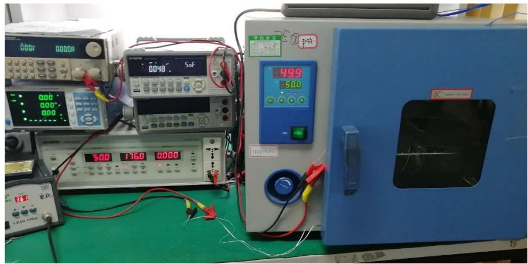

## 测试说明

在温箱中进行测试  
电路板放在一个封闭的盒子内  
热电偶连接到各个测量点  
等测量点温度达到稳定后记录数据

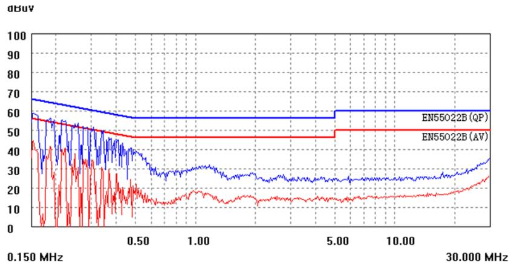

115Vac Line

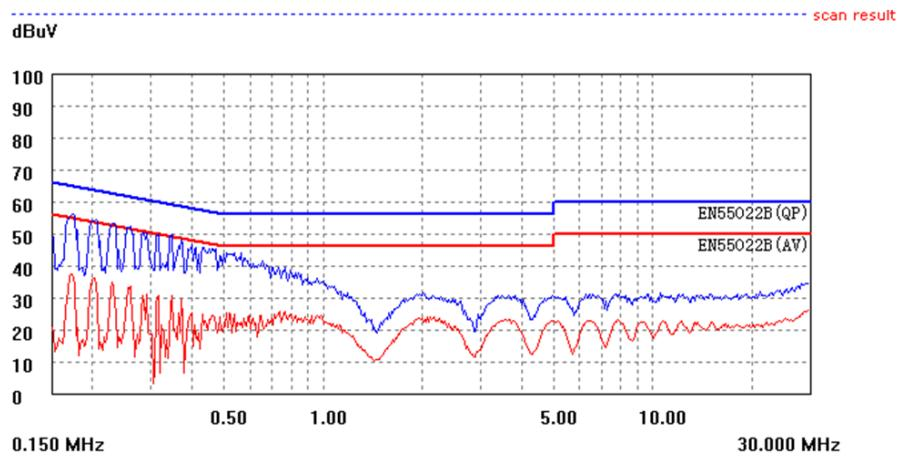

230Vac Line

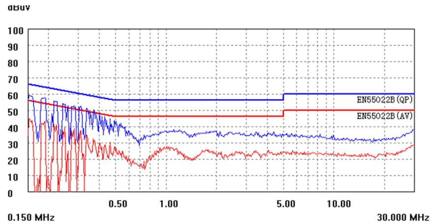

115Vac Neutral

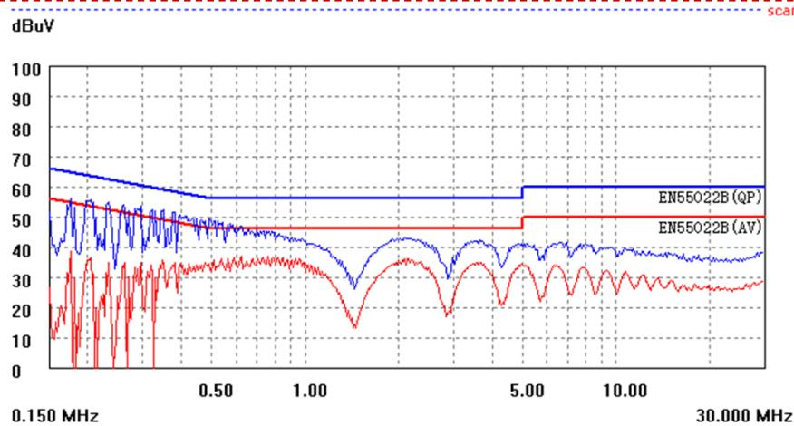

230Vac Neutral

## Surge 浪涌测试

<table><tr><td>差模</td><td>电压</td><td>相位角</td><td>发生器阻抗</td><td>测试次数</td><td>测试结果</td></tr><tr><td>L N</td><td>+1.5kV</td><td>0/90/180/270</td><td>2</td><td>10</td><td>Pass</td></tr><tr><td>L N</td><td>-1.5kV</td><td>0/90/180/270</td><td>2</td><td>10</td><td>Pass</td></tr><tr><td>L N</td><td>+2kV</td><td>0/90/180/270</td><td>2</td><td>10</td><td>Pass</td></tr><tr><td>L N</td><td>-2kV</td><td>0/90/180/270</td><td>2</td><td>10</td><td>Pass</td></tr></table>

## ■ 测试说明

按照GB/T17626.5和IEC61000-4-5的最新版本要求进行测试  
室温环境，230VAC输入，满载条件  
输入1.2/50us组合波浪涌电压  
每个测试点重复10次  
每次间隔时间1分钟  
➢ 试验时样机输出正常（符合A类标准）视为Pass

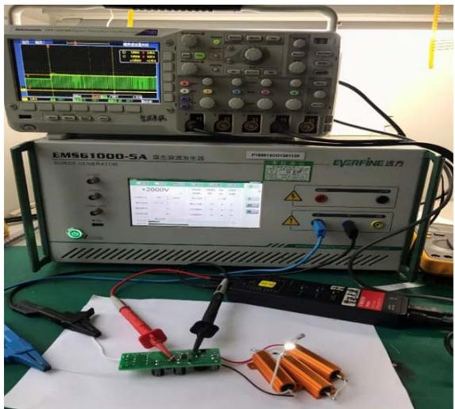

## EFT 群脉冲测试

<table><tr><td>共模</td><td>电压</td><td>脉冲群持续时间</td><td>脉冲频率</td><td>测试时间</td><td>测试结果</td></tr><tr><td>L N</td><td>+4kV</td><td>15ms</td><td>5kHz</td><td>120s</td><td>Pass</td></tr><tr><td>L N</td><td>-4kV</td><td>15ms</td><td>5kHz</td><td>120s</td><td>Pass</td></tr><tr><td>L N</td><td>+4kV</td><td>0.75ms</td><td>100kHz</td><td>120s</td><td>Pass</td></tr><tr><td>L N</td><td>-4kV</td><td>0.75ms</td><td>100kHz</td><td>120s</td><td>Pass</td></tr><tr><td>L N</td><td>+2kV</td><td>2ms</td><td>38kHz</td><td>120s</td><td>Pass</td></tr><tr><td>L N</td><td>-2kV</td><td>2ms</td><td>38kHz</td><td>120s</td><td>Pass</td></tr><tr><td>L N</td><td>+4kV</td><td>2ms</td><td>38kHz</td><td>120s</td><td>Pass</td></tr><tr><td>L N</td><td>-4kV</td><td>2ms</td><td>38kHz</td><td>120s</td><td>Pass</td></tr></table>

## ■ 测试说明

按照GB/T17626.4和IEC61000-4-4的最新版本要求进行测试  
室温环境，230VAC输入满载条件  
分别测试5kHz/100kHz/38kHz脉冲频率  
▶ 脉冲群周期为300ms  
每个测试条件测试时间120s  
➢ 试验时样机输出正常（符合A类标准）视为Pass

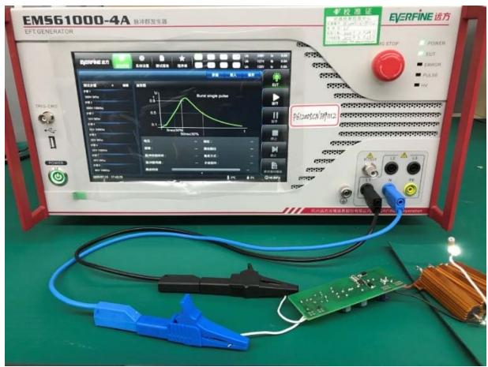

## ESD 测试

<table><tr><td>测试点</td><td>电压(V)</td><td>放电类型</td><td>放电次数</td><td>测试结果</td></tr><tr><td>Vo</td><td>+15kV</td><td>空气放电</td><td>10</td><td>Pass</td></tr><tr><td>Vo</td><td>-15kV</td><td>空气放电</td><td>10</td><td>Pass</td></tr><tr><td>GND</td><td>+15kV</td><td>空气放电</td><td>10</td><td>Pass</td></tr><tr><td>GND</td><td>-15kV</td><td>空气放电</td><td>10</td><td>Pass</td></tr><tr><td>Vo</td><td>+20kV</td><td>空气放电</td><td>10</td><td>Pass</td></tr><tr><td>Vo</td><td>-20kV</td><td>空气放电</td><td>10</td><td>Pass</td></tr><tr><td>GND</td><td>+20kV</td><td>空气放电</td><td>10</td><td>Pass</td></tr><tr><td>GND</td><td>-20kV</td><td>空气放电</td><td>10</td><td>Pass</td></tr></table>

## ■ 测试说明

按照GB/T17626.2和IEC61000-4-2的最新版本要求进行测试  
室温环境，230VAC输入满载条件  
每个测试点重复10次  
分别对输出正端和地进行空气放电  
➢ 试验时样机输出正常（符合A类标准）视为Pass

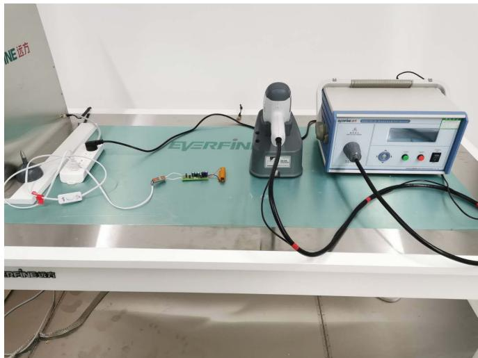

## THANK YOU FOR WATCHING
