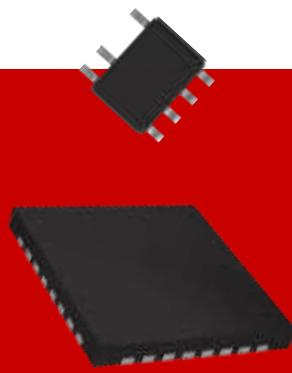

## BP85976P参考设计

## (18V/0.3A@85\~265Vac)

上海晶丰明源半导体股份有限公司

Shanghai Bright Power Semiconductor Co., Ltd.

PYQ

时间： 2022年8月

## 内容

BP85976P简介  
电源规格  
电路图  
性能测试数据

## 产品特点：

➢ 集成VCC电容  
➢ 集成650V高压MOSFET  
➢ 集成高压启动和自供电电路  
➢ 固定18V输出  
➢ 优异的动态响应速度，输出电压纹波小  
良好的负载调整率和线性调整率  
➢ 降低音频噪声的降幅调制技术  
➢ 内置软启动功能

## 应用领域：

➢ 小家电辅助电源  
➢ 电机驱动辅助电源  
➢ IOT/智能家居/智能照明

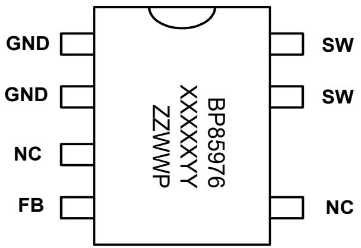

DIP7封装

## 电源规格

<table><tr><td>项目描述</td><td>符号</td><td>最小</td><td>典型</td><td>最大</td><td>单位</td><td>备注</td></tr><tr><td colspan="7">输入</td></tr><tr><td>电压</td><td> $V_{IN}$ </td><td>85</td><td>115/230</td><td>265</td><td> $V_{AC}$ </td><td></td></tr><tr><td>频率</td><td> $f_{LINE}$ </td><td>47</td><td>50/60</td><td>63</td><td>Hz</td><td></td></tr><tr><td colspan="7">输出</td></tr><tr><td>输出电压</td><td> $V_{OUT}$ </td><td></td><td>18</td><td></td><td>V</td><td>±5%</td></tr><tr><td>输出电流</td><td> $I_{OUT}$ </td><td></td><td>0.3</td><td></td><td>A</td><td></td></tr><tr><td>输出电压纹波</td><td> $V_{RIPPLE}$ </td><td></td><td></td><td>200</td><td>mV</td><td>20MHz带宽</td></tr><tr><td>连续输出功率</td><td> $P_{OUT}$ </td><td></td><td>5.4</td><td></td><td>W</td><td></td></tr><tr><td colspan="7">效率</td></tr><tr><td>待机功耗</td><td> $P_{STDBY}$ </td><td></td><td></td><td>100</td><td>mW</td><td>230VAC</td></tr><tr><td>满载效率</td><td>η</td><td>75</td><td></td><td></td><td>%</td><td></td></tr><tr><td colspan="7">环境</td></tr><tr><td>传导EMI</td><td></td><td colspan="4">满足CISPR22/EN55022 Class B,至少6dB 裕量</td><td></td></tr><tr><td rowspan="2">Surge</td><td></td><td></td><td>±2</td><td></td><td>kV</td><td>差模</td></tr><tr><td></td><td></td><td>±4</td><td></td><td>kV</td><td>共模</td></tr><tr><td>EFT</td><td></td><td></td><td>±4</td><td></td><td>kV</td><td>5kHz/100kHz/38kHz</td></tr><tr><td rowspan="2">ESD</td><td></td><td></td><td>±8</td><td></td><td>kV</td><td>接触放电</td></tr><tr><td></td><td></td><td>±15</td><td></td><td>kV</td><td>空气放电</td></tr><tr><td>工作环境温度</td><td> $T_{AMP}$ </td><td></td><td></td><td>50</td><td>°C</td><td></td></tr></table>

<table><tr><td>序号</td><td>元件标号</td><td>参数描述</td><td>封装尺寸</td><td>数量</td></tr><tr><td>1</td><td>PCB</td><td>CEM-1,单面板</td><td>92.36mm*36.18mm</td><td>1</td></tr><tr><td>2</td><td>RZ1</td><td>2W, 10R保险丝电阻</td><td>DIP</td><td>1</td></tr><tr><td>3</td><td>D1,D2,D3,D4</td><td>1N4007, 1A/1000V</td><td>DIP</td><td>4</td></tr><tr><td>4</td><td>D5,D6</td><td>ES1J,1A/600V</td><td>SMA</td><td>2</td></tr><tr><td>5</td><td>L1</td><td>1mH, 色环电感0510</td><td>DIP</td><td>1</td></tr><tr><td>6</td><td>L2</td><td>1mH, EE10</td><td>EE10</td><td>1</td></tr><tr><td>7</td><td>C2,C3</td><td>6.8uF/400V,电解电容</td><td>ø8*14mm</td><td>2</td></tr><tr><td>10</td><td>C4</td><td>220uF/35V电解电容</td><td>ø10*12.5mm</td><td>1</td></tr><tr><td>11</td><td>R1</td><td>8.2K, ±5%</td><td>SMD0805</td><td>1</td></tr><tr><td>12</td><td>U1</td><td>BP85976P</td><td>DIP</td><td>1</td></tr><tr><td></td><td></td><td></td><td>Total</td><td>15</td></tr></table>

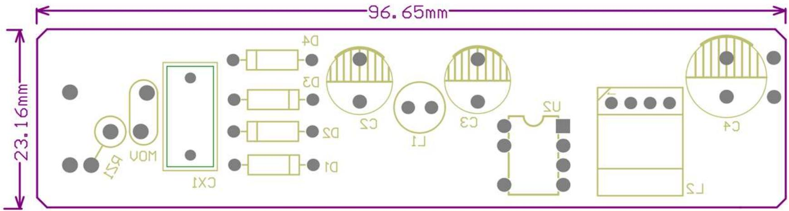

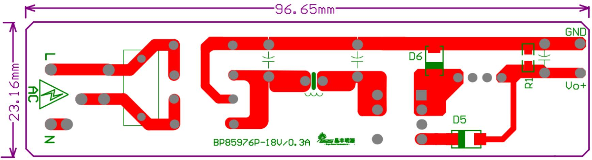

空载功耗  
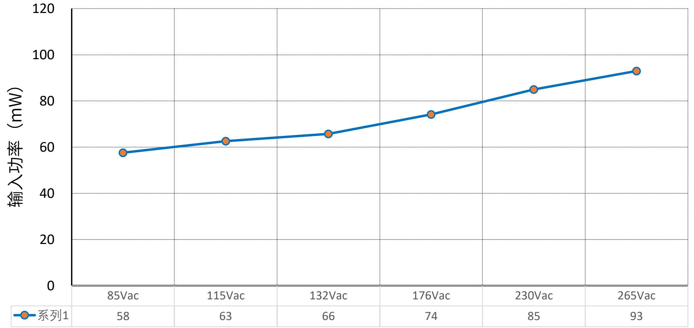

输入电压

效率测试  
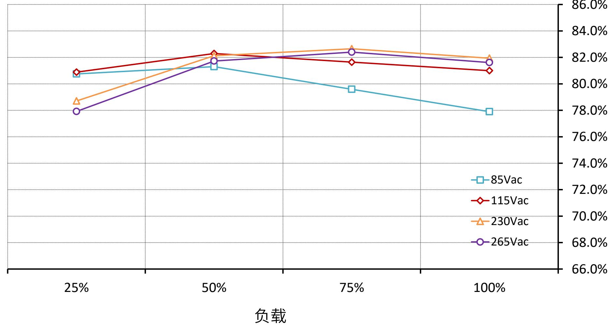

## 输出电压调整率

<table><tr><td> $V_{IN}(VAC)$ Load(%)</td><td>85</td><td>115</td><td>132</td><td>176</td><td>230</td><td>265</td><td>平均值</td><td>线调整率</td></tr><tr><td>0</td><td>18.299</td><td>18.284</td><td>18.288</td><td>18.271</td><td>18.273</td><td>18.276</td><td>18.28</td><td>0.15%</td></tr><tr><td>20%</td><td>18.089</td><td>18.043</td><td>18.046</td><td>18.024</td><td>18.033</td><td>18.026</td><td>18.04</td><td>0.36%</td></tr><tr><td>40%</td><td>18.016</td><td>17.966</td><td>17.973</td><td>17.931</td><td>17.938</td><td>17.930</td><td>17.96</td><td>0.48%</td></tr><tr><td>60%</td><td>17.954</td><td>17.919</td><td>17.920</td><td>17.874</td><td>17.871</td><td>17.860</td><td>17.90</td><td>0.53%</td></tr><tr><td>80%</td><td>17.894</td><td>17.876</td><td>17.876</td><td>17.828</td><td>17.816</td><td>17.800</td><td>17.85</td><td>0.53%</td></tr><tr><td>100%</td><td>17.884</td><td>17.858</td><td>17.845</td><td>17.795</td><td>17.775</td><td>17.760</td><td>17.82</td><td>0.70%</td></tr><tr><td>平均值</td><td>18.02</td><td>17.99</td><td>17.99</td><td>17.95</td><td>17.95</td><td>17.94</td><td rowspan="2" colspan="2"></td></tr><tr><td>负载调整率</td><td>2.30%</td><td>2.37%</td><td>2.46%</td><td>2.65%</td><td>2.77%</td><td>2.88%</td></tr></table>

◼ 计算方法：调整率=100%\*(最大值-最小值)/平均值  
测试条件：输出带8.2k假负载

## 输出电压纹波

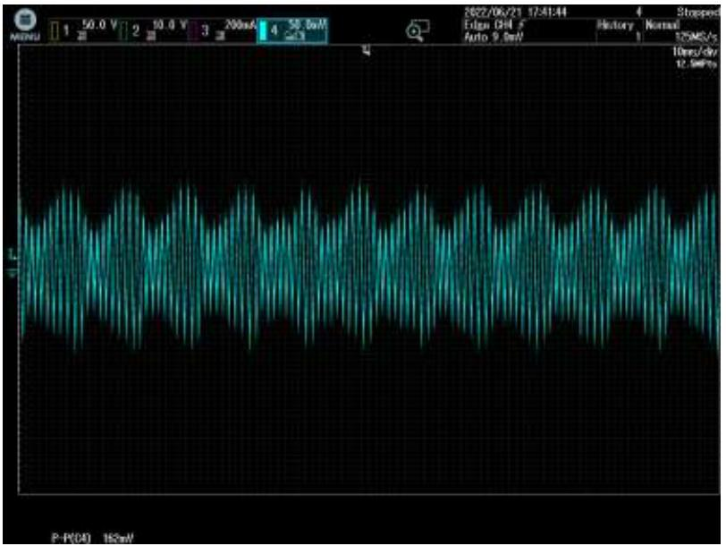

${ \otimes 5 } \mathsf { V } _ { \mathsf { A C } }$

CH4 $\mathsf { V } _ { \mathsf { O U T } } \mathsf { R i p p l e }$ $\mathsf { V } _ { \mathsf { P K - P K } } { = } 1 6 2 \mathsf { m V }$

## Test Condition:

➢ Full Load

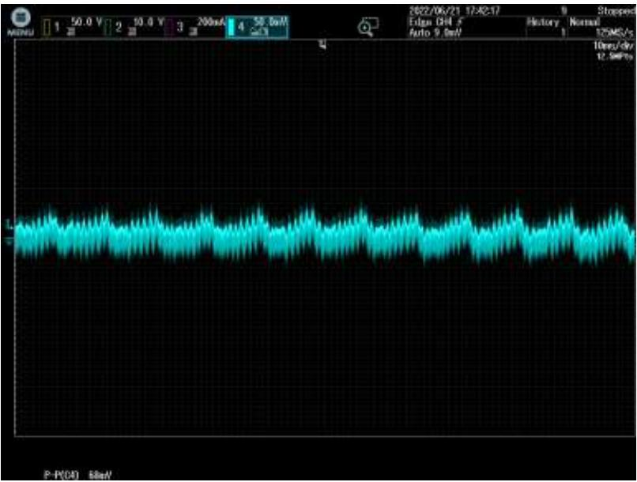

$1 1 5 \mathsf { V } _ { \mathsf { A C } }$

CH4 $\mathsf { V } _ { \mathsf { O U T } }$ Ripple $\mathtt { V } _ { \mathtt { P K - P K } } = 6 8 \mathsf { m V }$

## Test Condition:

➢ Full Load

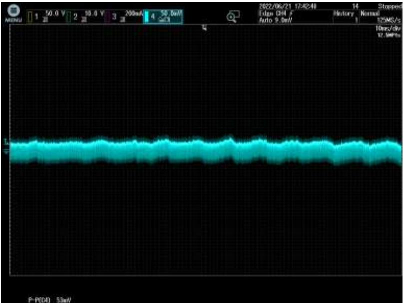

$230 v _ { \mathsf { A C } }$

CH4 $\mathsf { V } _ { \mathsf { O U T } } \mathsf { R i p p l e }$ $\mathtt { V } _ { \mathtt { P K - P K } } = 5 3 \mathsf { m V }$

## Test Condition:

➢ Full Load

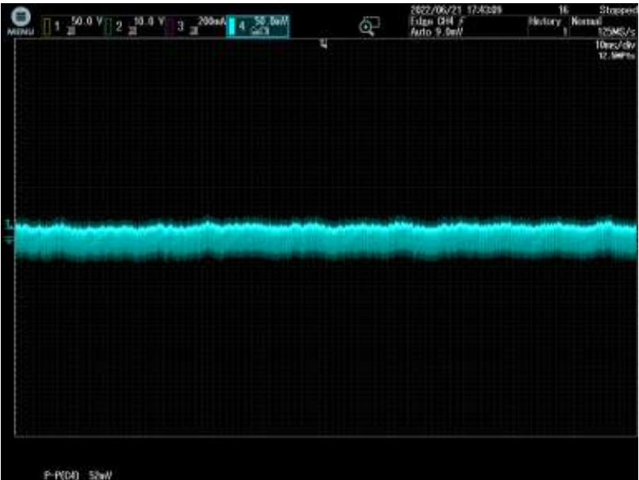

$2 6 5 \ : \mathsf { V } _ { \mathsf { A C } }$

$\begin{array} { r } { \mathsf { C H 4 V _ { o u r } } \mathsf { R i p p l e } } \\ { \mathsf { V _ { P K - P K } } \mathsf { = } 5 2 \mathsf { m v } } \end{array}$

## Test Condition:

➢ Full Load

## 动态负载(50%-100%)

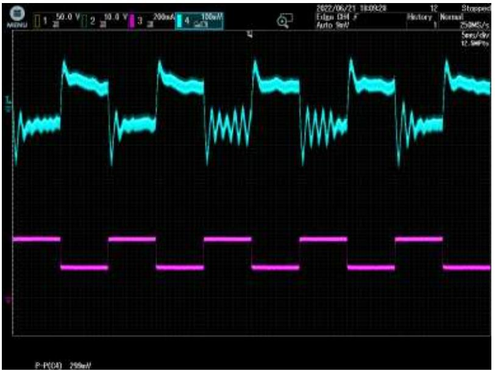

85 VAC

$\mathsf { C H } 4 \mathsf { V } _ { \mathsf { O U T } }$ $V _ { P K - P K } = 2 9 9 m v$  
$\mathsf { C H 3 } \mathsf { I _ { 0 \mathsf { U } \mathsf { T } } }$

## Test Condition:

➢ $0 . 5 \mathsf { A } \mathsf { - } 1 \mathsf { A } \mathsf { - } 0 . 5 \mathsf { A }$  
➢ Slew Rate: 0.5 A/μS  
➢ Frequency: 100 Hz

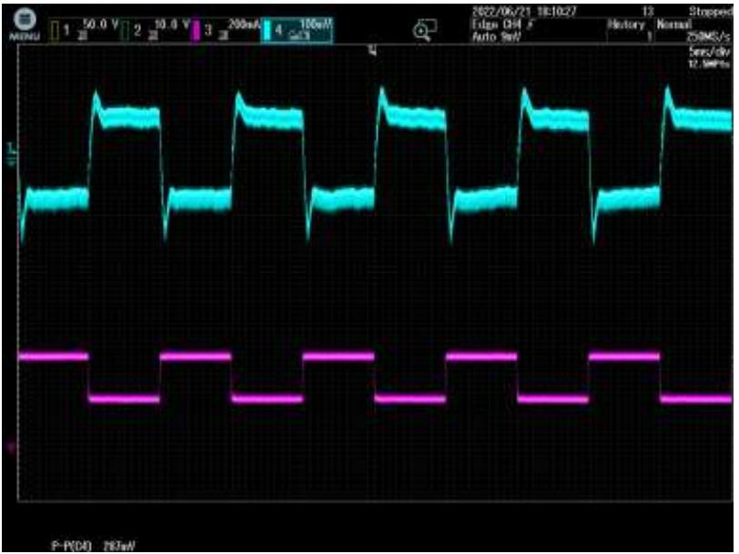

230 VAC

$\mathsf { C H } 4 \mathsf { V } _ { \mathsf { O U T } }$ $V _ { \mathsf { P K - P K } } = 2 8 7 ~ \mathsf { m V }$  
$\mathsf { C H 3 } \mathsf { I _ { 0 \mathsf { U T } } }$

## Test Condition:

➢ $0 . 5 \mathsf { A } \mathsf { - } 1 \mathsf { A } \mathsf { - } 0 . 5 \mathsf { A }$  
➢ $\mathsf { S l e w R a t e } \colon 0 . 5 \mathsf { A } / \mu \mathsf { S }$  
➢ Frequency: 100 Hz

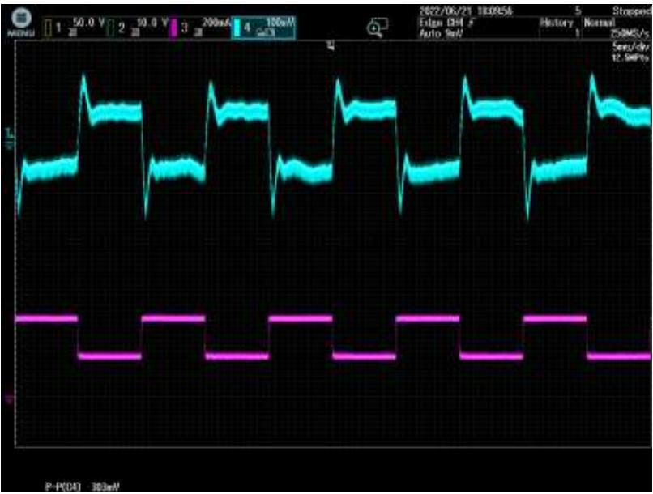

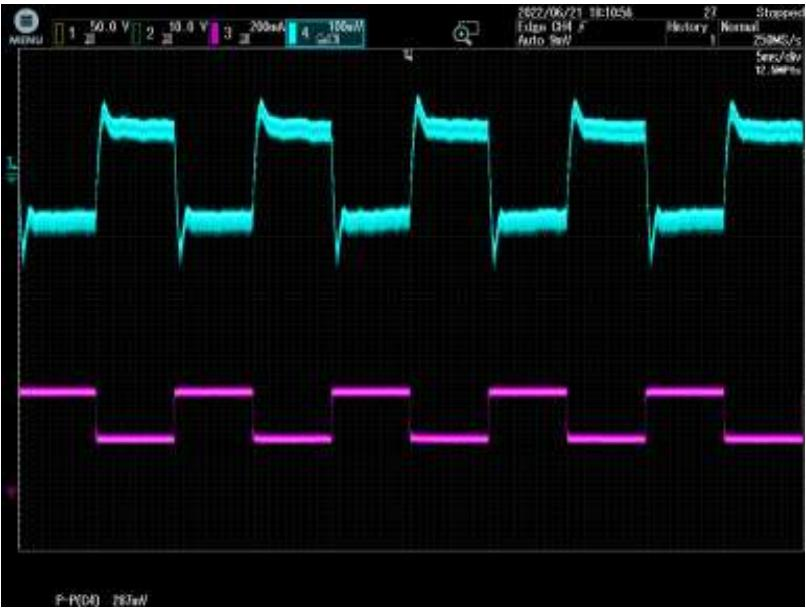

115 VAC

$\mathsf { C H } 4 \mathsf { V } _ { \mathsf { O U T } }$ $V _ { P K - P K } = 3 0 3 ~ \mathsf { m V }$  
$\mathsf { C H 3 } \mathsf { I _ { 0 \mathsf { U T } } }$

## Test Condition:

➢ $0 . 5 \mathsf { A } \mathsf { - } 1 \mathsf { A } \mathsf { - } 0 . 5 \mathsf { A }$  
➢ Slew Rate: 0.5 A/μS  
➢ Frequency: 100 Hz

265 VAC

$\mathsf { C H } 4 \mathsf { V } _ { \mathsf { O U T } }$ $V _ { P K - P K } = 2 8 7 ~ \mathsf { m V }$  
$\mathsf { C H 3 } \mathsf { I _ { 0 \mathsf { U T } } }$

## Test Condition:

➢ $0 . 5 \mathsf { A } \mathsf { - } 1 \mathsf { A } \mathsf { - } 0 . 5 \mathsf { A }$  
➢ $\mathsf { S l e w R a t e } \colon 0 . 5 \mathsf { A } / \mu \mathsf { S }$  
➢ Frequency: 100 Hz

## 动态负载(10%-90%)

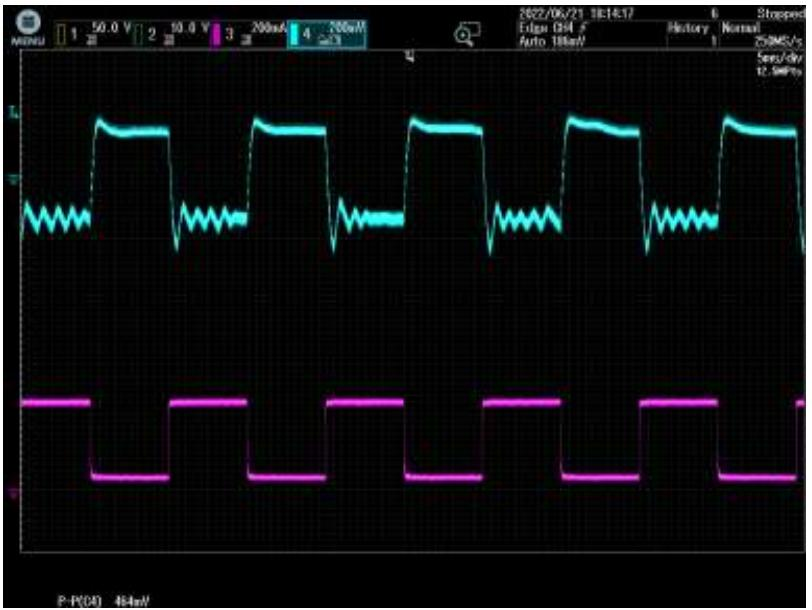

85 VAC

CH4 $\mathsf { V } _ { \mathsf { O U T } }$ $V _ { \mathsf { P K - P K } } { = } 2 6 4 ~ \mathsf { m V }$  
$\mathsf { C H 3 } \mathsf { I _ { 0 \mathsf { U } \mathsf { T } } }$

## Test Condition:

➢ 0.1A-0.9 A-0.1 A  
➢ Slew Rate: 0.5 A/μS  
➢ Frequency: 100 Hz

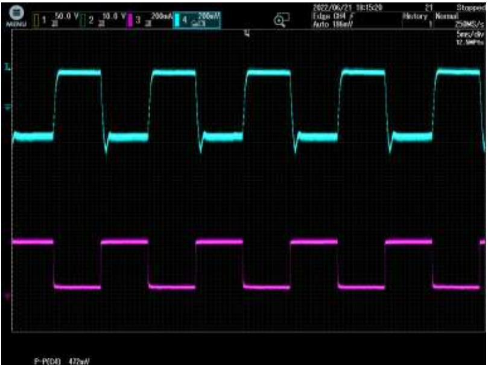

230 VAC

CH4 V $\mathsf { V } _ { \mathsf { O U T } }$ $V _ { P K - P K } = 2 7 2 m v$  
$\mathsf { C H 3 } \mathsf { I _ { 0 \mathsf { U T } } }$

## Test Condition:

➢ $0 . 1 \mathsf { A } \mathsf { - } 0 . 9 \mathsf { A } \mathsf { - } 0 . 1 \mathsf { A }$  
➢ Slew Rate: 0.5 A/μS  
➢ Frequency: 100 Hz

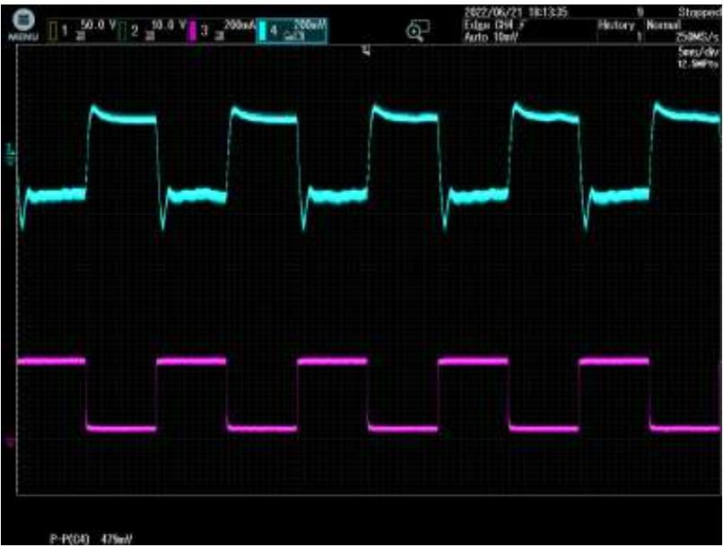

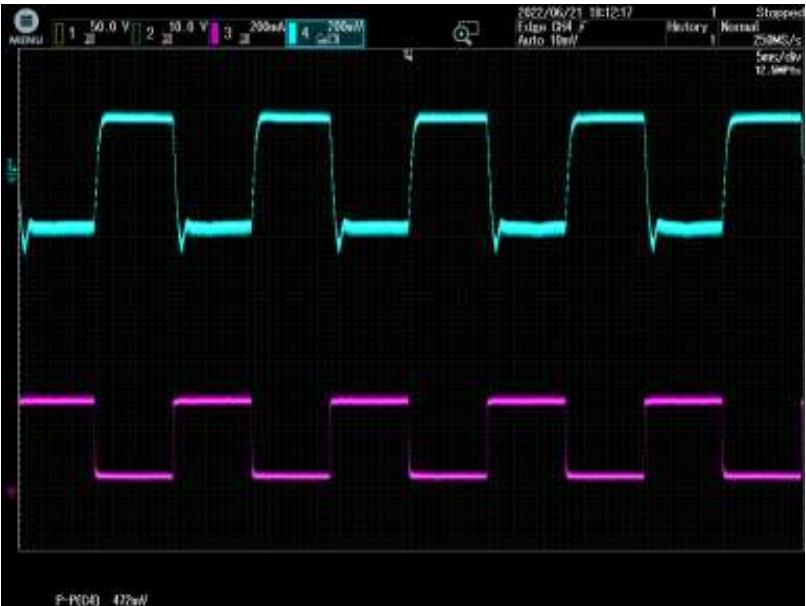

115 VAC

CH4 VOUT $\mathsf { C H } 4 \mathsf { V } _ { \mathsf { O U T } }$ $V _ { P K - P K } = 2 7 9 m v$  
$\mathsf { C H 3 } \mathsf { I _ { 0 \mathsf { U T } } }$

## Test Condition:

➢ 0.1A-0.9 A-0.1 A  
➢ Slew Rate: 0.5 A/μS  
➢ Frequency: 100 Hz

265 VAC

$\mathsf { C H } 4 \mathsf { V } _ { \mathsf { O U T } }$ $V _ { P K - P K } = 4 7 2 m v$  
$\mathsf { C H 3 } \mathsf { I _ { 0 \mathsf { U T } } }$

## Test Condition:

➢ 0.1A-0.9 A-0.1 A  
➢ Slew Rate: 0.5 A/μS  
➢ Frequency: 100 Hz

## 输出电压开机波形

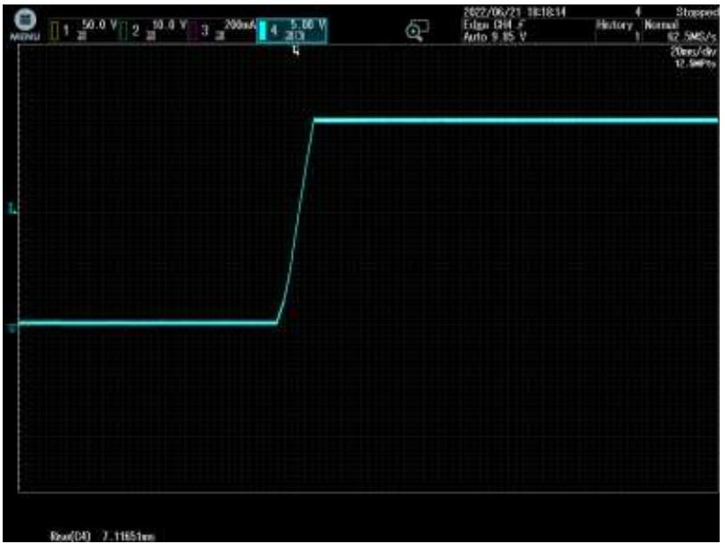

85 VAC  
  
Test Condition:  
➢ No Load

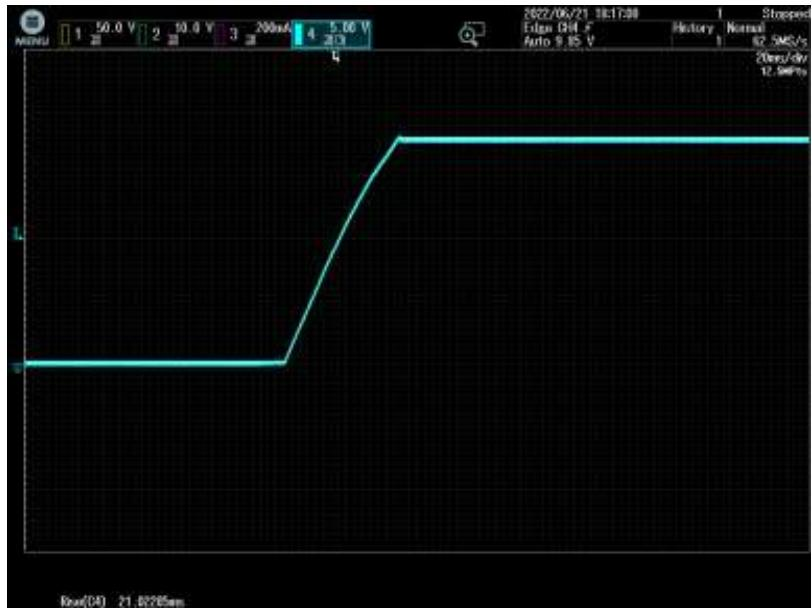

85 VAC  
  
Test Condition:  
➢ Full Load

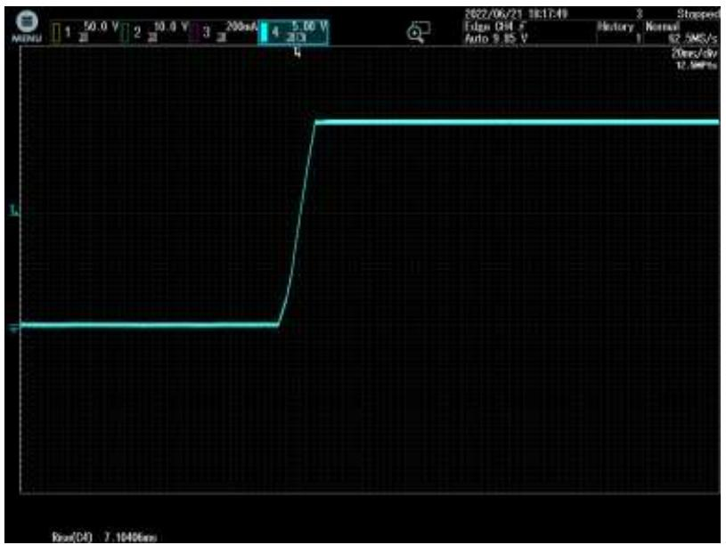

265 VAC  
  
Test Condition:  
➢ No Load

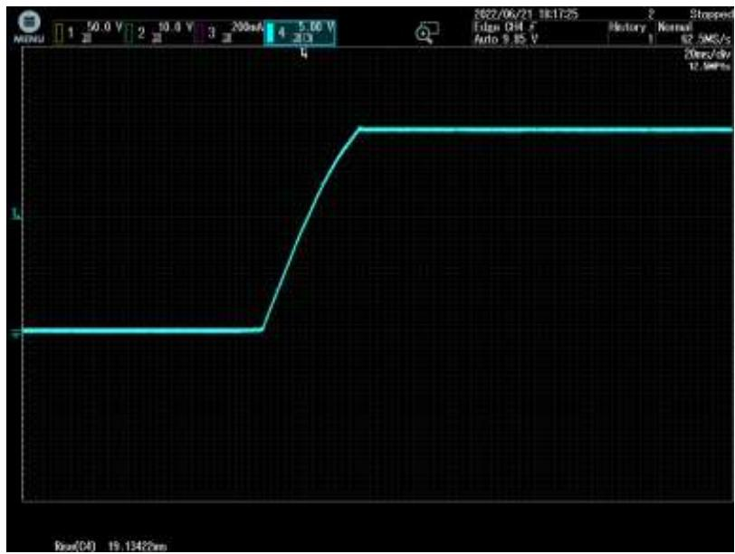

265 VAC  
  
Test Condition:  
➢ Full Load

## MOSFET开机波形

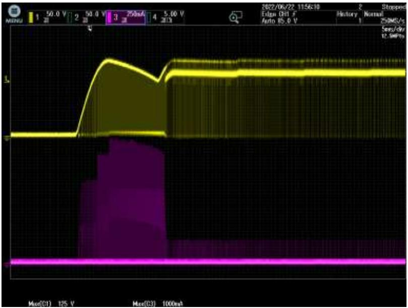

85 VAC

CH1 VDS  
CH3 IDS

$$
\begin{array}{l} \mathrm {V_ {DS\_MAX}} = 1 2 5 \mathrm{V} \\ \mathrm {I_ {DS\_MAX}} = 1 \mathrm{A} \end{array}
$$

## Test Condition:

➢ No Load

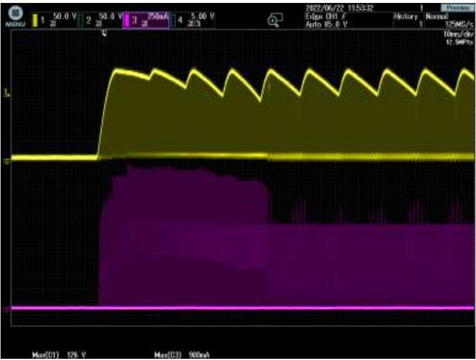

85 VAC

CH1 VDS  
CH3 IDS

$$
\begin{array}{l} \mathrm {V_ {DS\_MAX}} = 1 2 6 \mathrm{V} \\ \mathrm {I_ {DS\_MAX}} = 0. 9 8 \mathrm{A} \end{array}
$$

## Test Condition:

➢ Full Load

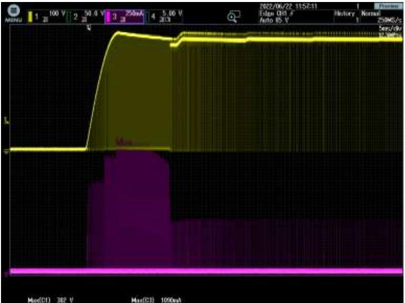

265 VAC

CH1 VDS  
CH3 IDS

$$
V _ {D S \_ M A X} = 3 8 2 V
$$

$$
I _ {D S \_ M A X} = 1. 0 9 \mathrm{A}
$$

## Test Condition:

➢ No Load

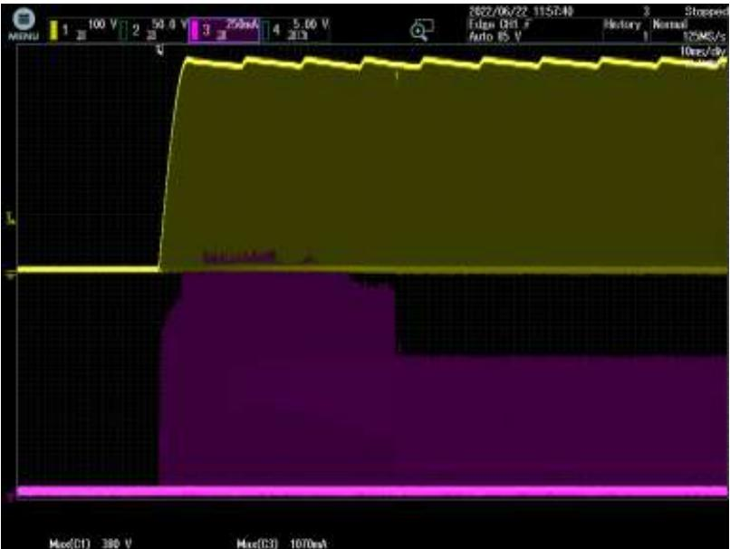

265 VAC

CH1 VDS  
CH3 IDS

$$
V _ {D S \_ M A X} = 3 8 0 V
$$

$$
I _ {D S \_ M A X} = 1. 0 7 \mathrm{A}
$$

## Test Condition:

➢ Full Load

## MOSFET稳态波形

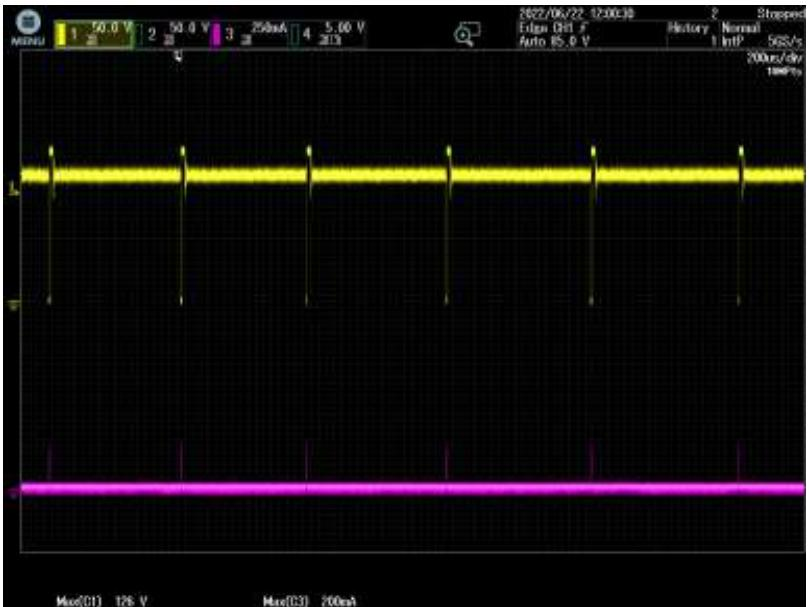

${ \otimes 5 } \mathsf { V } _ { \mathsf { A C } }$

${ \mathsf { C H 1 } } \mathsf { V _ { D S } }$  
$C H 3 \mid _ { \mathsf { D S } }$

$$
\begin{array}{l} \mathrm {V_ {DS\_MAX}} = 1 2 6 \mathrm{V} \\ \mathrm {I_ {DS\_MAX}} = 0. 2 \mathrm{A} \end{array}
$$

## Test Condition:

➢ No Load

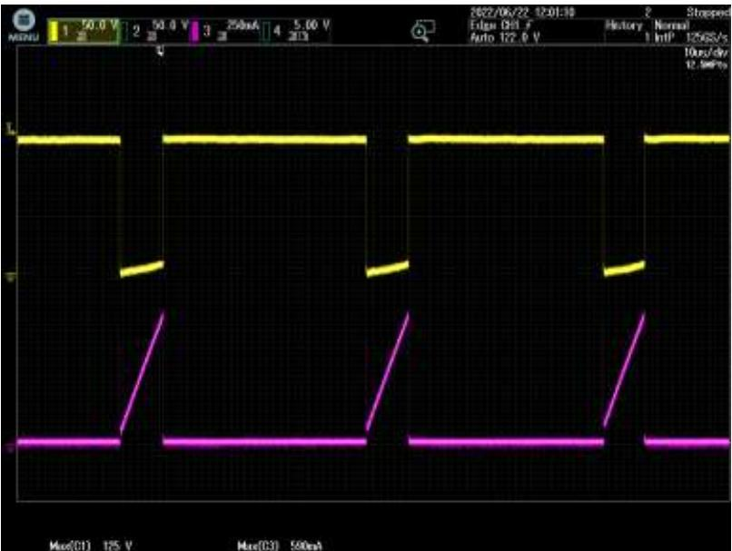

${ \tt S 5 V } _ { \sf A C }$

${ \mathsf { C H 1 } } \mathsf { V } _ { \mathsf { D S } }$  
$C H 3 \mid _ { \mathsf { D S } }$

$$
\begin{array}{l} \mathrm {V_ {DS\_MAX}} = 1 2 5 \mathrm{V} \\ \mathrm {I_ {DS\_MAX}} = 0. 5 9 \mathrm{A} \end{array}
$$

## Test Condition:

➢ Full Load

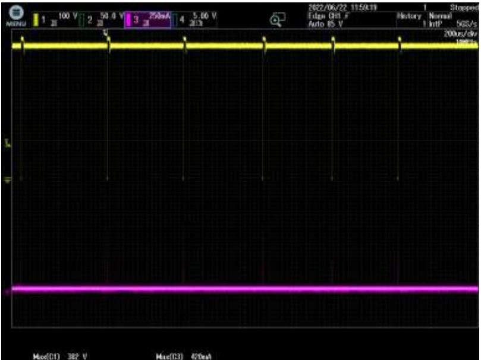

$2 6 5 \ : \mathsf { V } _ { \mathsf { A C } }$

${ \mathsf { C H 1 } } \mathsf { V _ { D S } }$  
$C H 3 \mid _ { \mathsf { D S } }$

$$
V _ {D S \_ M A X} = 3 8 2 V
$$

$$
I _ {D S \_ M A X} = 0. 4 2 \mathrm{A}
$$

## Test Condition:

➢ No Load

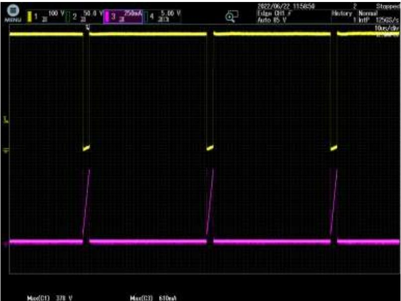

$2 6 5 \ : \mathsf { V } _ { \mathsf { A C } }$

${ \mathsf { C H 1 } } \mathsf { V } _ { \mathsf { D S } }$  
$C H 3 \mid _ { \mathsf { D S } }$

$$
V _ {D S \_ M A X} = 3 7 8 V
$$

$$
I _ {D S \_ M A X} = 0. 6 1 \mathrm{A}
$$

## Test Condition:

➢ Full Load

## 输出二极管开机波形

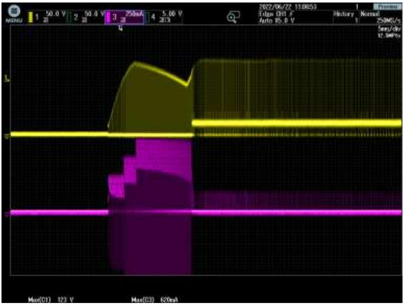

85 VAC

CH1 VR  
CH3 IF

$$
V _ {R \_ M A X} = 1 2 3 \mathrm{V}
$$

$$
I _ {F \_ M A X} = 0. 6 2 A
$$

## Test Condition:

➢ No Load

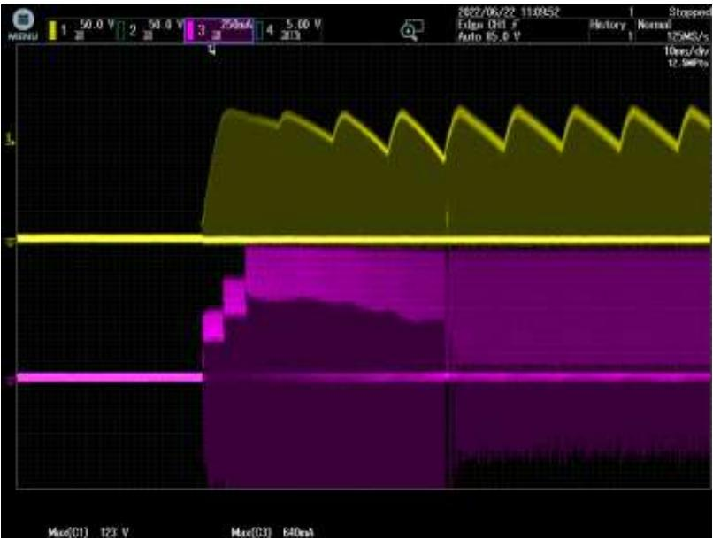

85 VAC

CH1 VR  
CH3 IF

$$
\begin{array}{l} \mathrm {V_ {R\_MAX}} = 1 2 3 \mathrm{V} \\ \mathrm {I_ {F\_MAX}} = 0. 6 4 \mathrm{A} \end{array}
$$

## Test Condition:

➢ Full Load

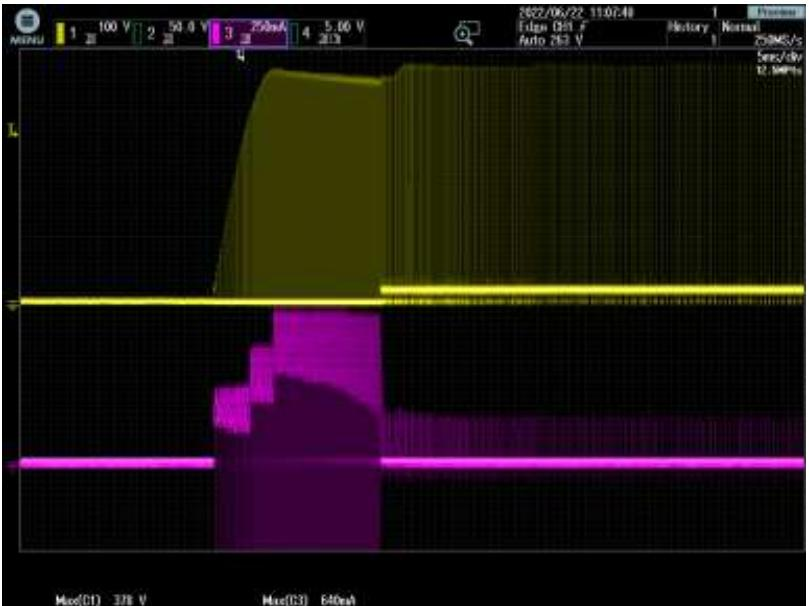

265 VAC

CH1 $V _ { \textsf { R } }$  
CH3 IF

$$
V _ {R \_ M A X} = 3 7 8 \mathrm{V}
$$

$$
I _ {F \_ M A X} = 0. 6 4 \mathrm{A}
$$

## Test Condition:

➢ No Load

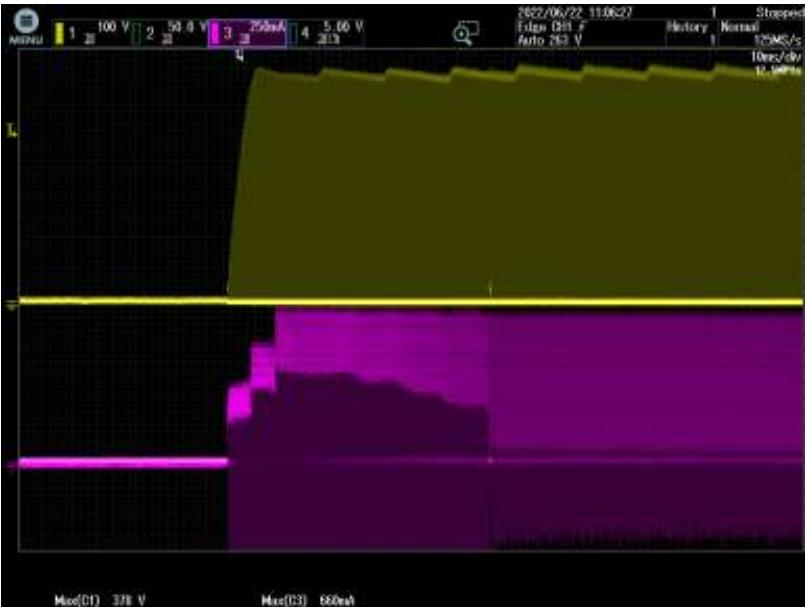

265 VAC

CH1 VR  
CH3 IF

$$
V _ {R \_ M A X} = 3 7 8 \mathrm{V}
$$

$$
I _ {F \_ M A X} = 0. 6 6 \mathrm{A}
$$

## Test Condition:

➢ Full Load

## 输出二极管稳态波形

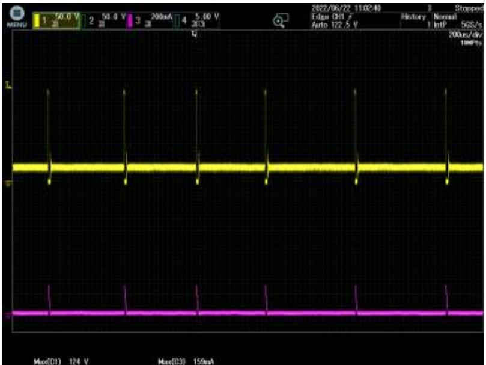

${ \otimes 5 } \mathsf { V } _ { \mathsf { A C } }$

$C H 1 \mathsfit { V } _ { \mathsf { R } }$  
$C H 3 1 _ { \mathsf { F } }$

$$
V _ {R \_ M A X} = 1 2 4 \mathrm{V}
$$

$$
I _ {F \_ M A X} = 0. 1 5 9 \mathrm{A}
$$

## Test Condition:

➢ No Load

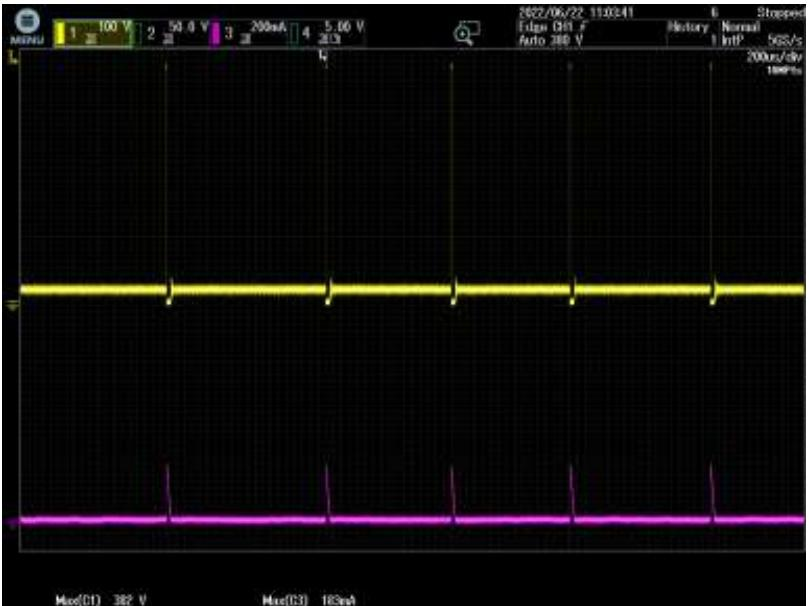

$2 6 5 \ : \mathsf { V } _ { \mathsf { A C } }$

$C H 1 \mathsfit { V } _ { \mathsf { R } }$  
$C H 3 1 _ { F }$

$$
V _ {R \_ M A X} = 3 8 2 \mathrm{V}
$$

$$
I _ {F \_ M A X} = 0. 1 8 3 \mathrm{A}
$$

## Test Condition:

➢ No Load

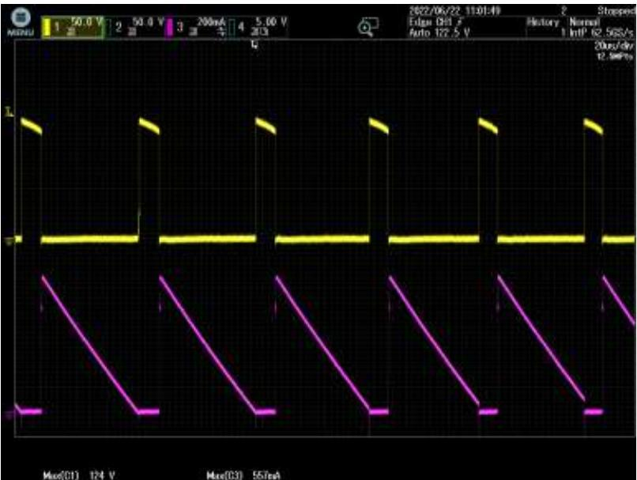

${ \tt S 5 V } _ { \sf A C }$

$C H \bot V _ { \mathsf { R } }$  
$C H 3 1 _ { F }$

$$
V _ {R \_ M A X} = 1 2 4 \mathrm{V}
$$

$$
I _ {F \_ M A X} = 0. 5 5 7 \mathrm{A}
$$

## Test Condition:

➢ Full Load

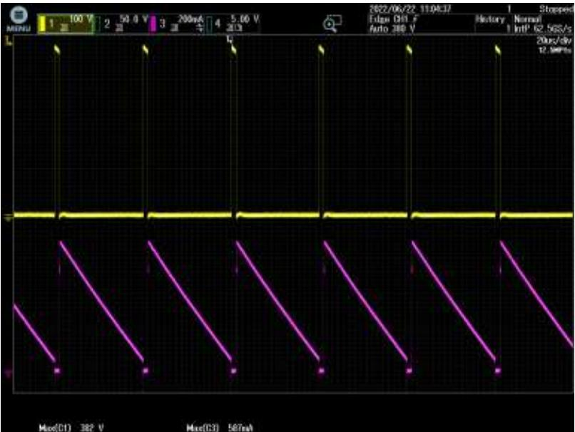

$2 6 5 \ : \mathsf { V } _ { \mathsf { A C } }$

${ \mathsf { C H 1 V } } _ { \mathsf { R } }$  
$C H 3 1 _ { \mathsf { F } }$

$$
V _ {R \_ M A X} = 3 8 2 \mathrm{V}
$$

$$
I _ {F \_ M A X} = 0. 5 8 7 \mathrm{A}
$$

## Test Condition:

➢ Full Load

## 输出短路保护（MOSFET波形）

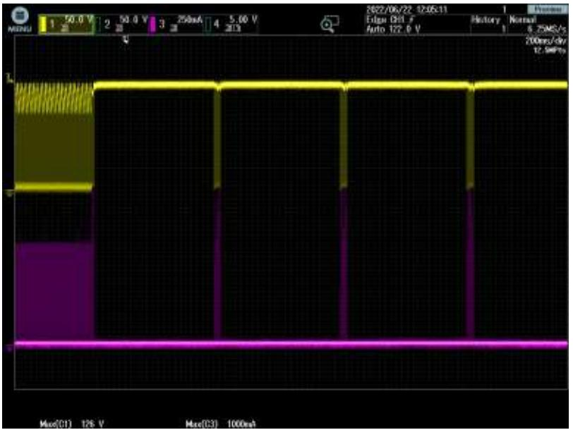

${ \otimes 5 } \mathsf { V } _ { \mathsf { A C } }$

${ \mathsf { C H 1 } } \mathsf { V _ { D S } }$  
$C H 3 \mid _ { \mathsf { D S } }$

$$
V _ {D S \_ M A X} = 1 2 6 \mathrm{V}
$$

$$
I _ {D S \_ M A X} = 1 \mathrm{A}
$$

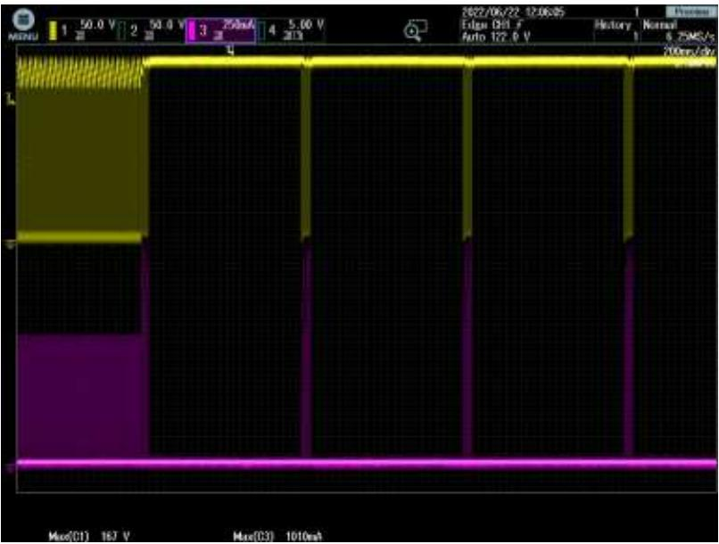

$1 1 5 \mathsf { V } _ { \mathsf { A C } }$

${ \mathsf { C H 1 } } \mathsf { V } _ { \mathsf { D S } }$  
$C H 3 \mid _ { \mathsf { D S } }$

$$
V _ {D S \_ M A X} = 1 6 7 \mathrm{V}
$$

$$
I _ {D S \_ M A X} = 1. 0 1 \mathrm{A}
$$

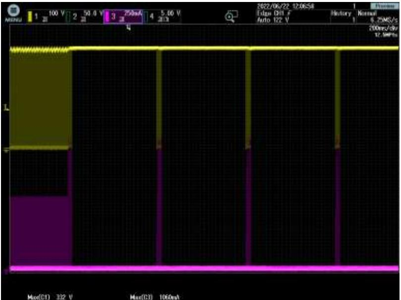

$230 v _ { \mathsf { A C } }$

${ \mathsf { C H 1 } } \mathsf { V _ { D S } }$  
$C H 3 \mid _ { \mathsf { D S } }$

$$
V _ {D S \_ M A X} = 3 3 2 \mathrm{V}
$$

$$
I _ {D S \_ M A X} = 1. 0 6 \mathrm{A}
$$

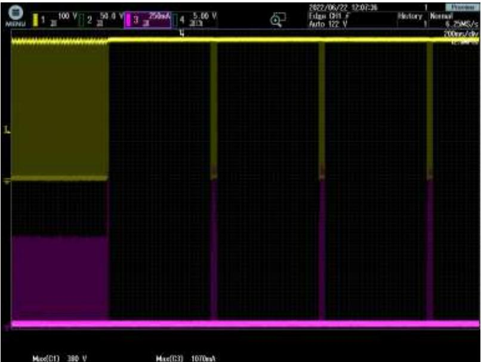

$2 6 5 \ : \mathsf { V } _ { \mathsf { A C } }$

${ \mathsf { C H 1 } } \mathsf { V } _ { \mathsf { D S } }$  
$C H 3 \mid _ { \mathsf { D S } }$

$$
V _ {D S \_ M A X} = 3 8 0 \mathrm{V}
$$

$$
I _ {D S \_ M A X} = 1. 0 7 \mathrm{A}
$$

<table><tr><td rowspan="2">项目</td><td>85VAC</td><td>115VAC</td><td>230VAC</td><td>265VAC</td></tr><tr><td>温度(°C)</td><td>温度(°C)</td><td>温度(°C)</td><td>温度(°C)</td></tr><tr><td>环境温度</td><td>55.36</td><td>55.09</td><td>55.07</td><td>55.19</td></tr><tr><td>BP85976P</td><td>113.75</td><td>99.49</td><td>99.97</td><td>102.33</td></tr><tr><td>温升(°C)</td><td>58.39</td><td>44.4</td><td>44.9</td><td>47.14</td></tr></table>

备注：50℃环温，温箱中使用热电偶测试

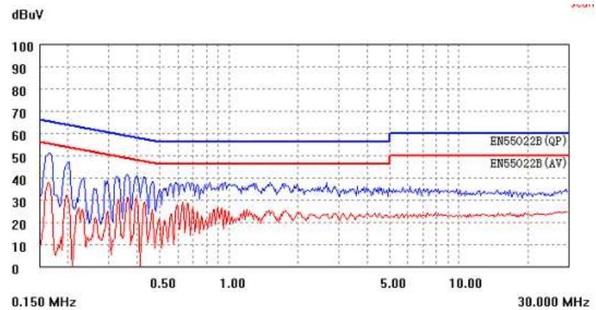

115Vac Line  
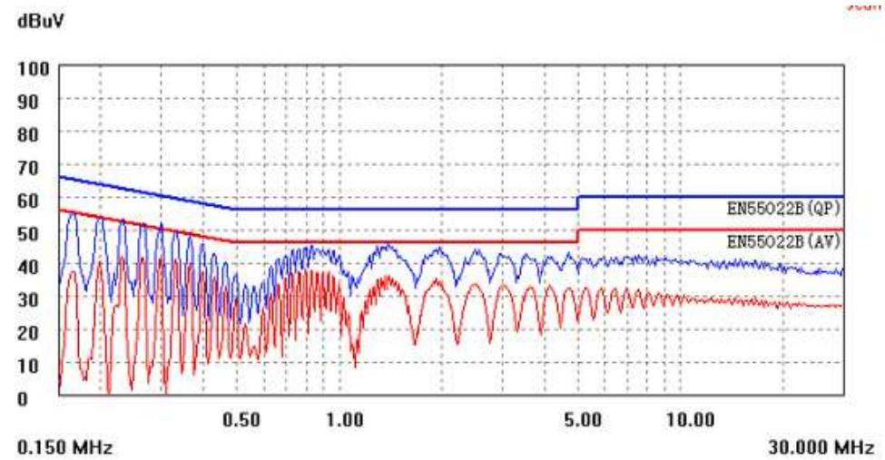

230Vac Line

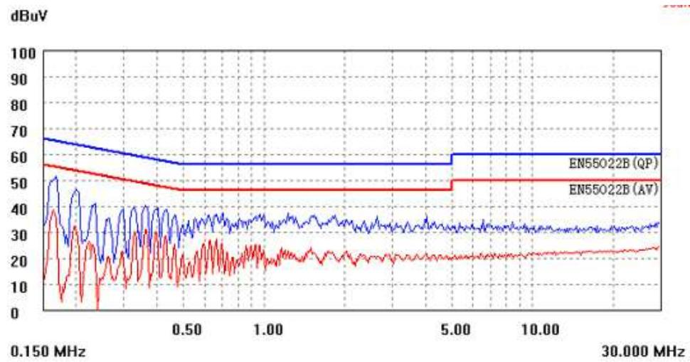

115Vac Neutral

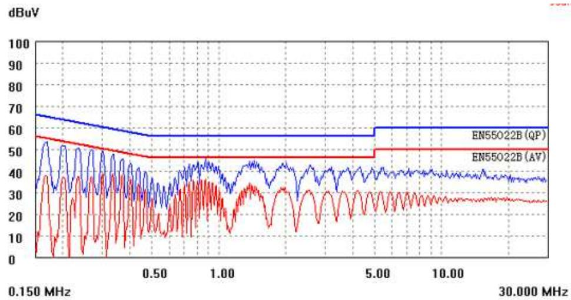

230Vac Neutral

<table><tr><td>差模</td><td>电压</td><td>相位角</td><td>发生器阻抗</td><td>测试次数</td><td>测试结果</td></tr><tr><td>L N</td><td>+1.5kV</td><td>0/90/180/270</td><td>2</td><td>10</td><td>Pass</td></tr><tr><td>L N</td><td>-1.5kV</td><td>0/90/180/270</td><td>2</td><td>10</td><td>Pass</td></tr><tr><td>L N</td><td>+2kV</td><td>0/90/180/270</td><td>2</td><td>10</td><td>Pass</td></tr><tr><td>L N</td><td>-2kV</td><td>0/90/180/270</td><td>2</td><td>10</td><td>Pass</td></tr></table>

## 测试说明

➢ 按照GB/T17626.5和IEC61000-4-5的最新版本要求进行测试  
➢ 室温环境，230VAC输入，满载条件  
➢ 输入1.2/50us组合波浪涌电压  
➢ 每个测试点重复10次  
➢ 每次间隔时间1分钟  
➢ 试验时样机输出正常（符合A类标准）视为Pass

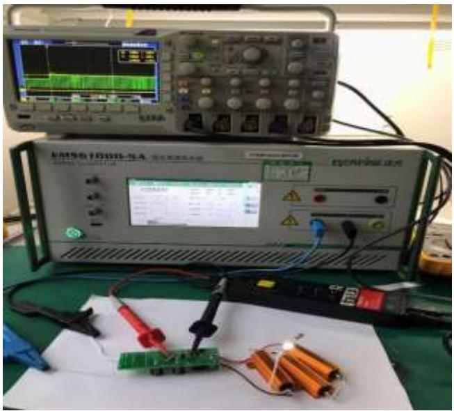

<table><tr><td>共模</td><td>电压</td><td>脉冲群持续时间</td><td>脉冲频率</td><td>测试时间</td><td>测试结果</td></tr><tr><td>L N</td><td>+4kV</td><td>15ms</td><td>5kHz</td><td>120s</td><td>Pass</td></tr><tr><td>L N</td><td>-4kV</td><td>15ms</td><td>5kHz</td><td>120s</td><td>Pass</td></tr><tr><td>L N</td><td>+4kV</td><td>0.75ms</td><td>100kHz</td><td>120s</td><td>Pass</td></tr><tr><td>L N</td><td>-4kV</td><td>0.75ms</td><td>100kHz</td><td>120s</td><td>Pass</td></tr><tr><td>L N</td><td>+2kV</td><td>2ms</td><td>38kHz</td><td>120s</td><td>Pass</td></tr><tr><td>L N</td><td>-2kV</td><td>2ms</td><td>38kHz</td><td>120s</td><td>Pass</td></tr><tr><td>L N</td><td>+4kV</td><td>2ms</td><td>38kHz</td><td>120s</td><td>Pass</td></tr><tr><td>L N</td><td>-4kV</td><td>2ms</td><td>38kHz</td><td>120s</td><td>Pass</td></tr></table>

## 测试说明

➢ 按照GB/T17626.4和IEC61000-4-4的最新版本要求进行测试  
➢ 室温环境，230VAC输入满载条件  
➢ 分别测试5kHz/100kHz/38kHz脉冲频率  
➢ 脉冲群周期为300ms  
➢ 每个测试条件测试时间120s  
➢ 试验时样机输出正常（符合A类标准）视为Pass

<table><tr><td>测试点</td><td>电压(V)</td><td>放电类型</td><td>放电次数</td><td>测试结果</td></tr><tr><td>Vo</td><td>+15kV</td><td>空气放电</td><td>10</td><td>PASS</td></tr><tr><td>Vo</td><td>-15kV</td><td>空气放电</td><td>10</td><td>PASS</td></tr><tr><td>GND</td><td>+15kV</td><td>空气放电</td><td>10</td><td>PASS</td></tr><tr><td>GND</td><td>-15kV</td><td>空气放电</td><td>10</td><td>PASS</td></tr><tr><td>Vo</td><td>+20kV</td><td>空气放电</td><td>10</td><td>PASS</td></tr><tr><td>Vo</td><td>-20kV</td><td>空气放电</td><td>10</td><td>PASS</td></tr><tr><td>GND</td><td>+20kV</td><td>空气放电</td><td>10</td><td>PASS</td></tr><tr><td>GND</td><td>-20kV</td><td>空气放电</td><td>10</td><td>PASS</td></tr></table>

## 测试说明

➢ 按照GB/T17626.2和IEC61000-4-2的最新版本要求进行测试  
➢ 室温环境，230VAC输入满载条件  
➢ 每个测试点重复10次  
➢ 分别对输出正端和地进行空气放电  
➢ 试验时样机输出正常（符合A类标准）视为Pass

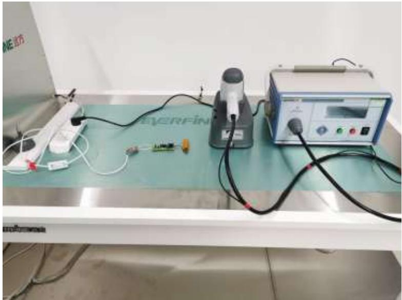

## THANK YOU FOR WATCHING
