## BP85976P参考设计

## (18V/0.25A & 5V/100mA@85\~265Vac)

上海晶丰明源半导体股份有限公司

Shanghai Bright Power Semiconductor Co., Ltd.

PYQ

时间： 2022年8月

## 内容

BP85976P简介  
电源规格  
电路图  
PCB Layout  
变压器设计  
性能测试数据

## 产品特点：

➢ 集成VCC电容  
➢ 集成650V高压MOSFET  
➢ 集成高压启动和自供电电路  
➢ 固定18V输出  
➢ 优异的动态响应速度，输出电压纹波小  
良好的负载调整率和线性调整率  
➢ 降低音频噪声的降幅调制技术  
➢ 内置软启动功能

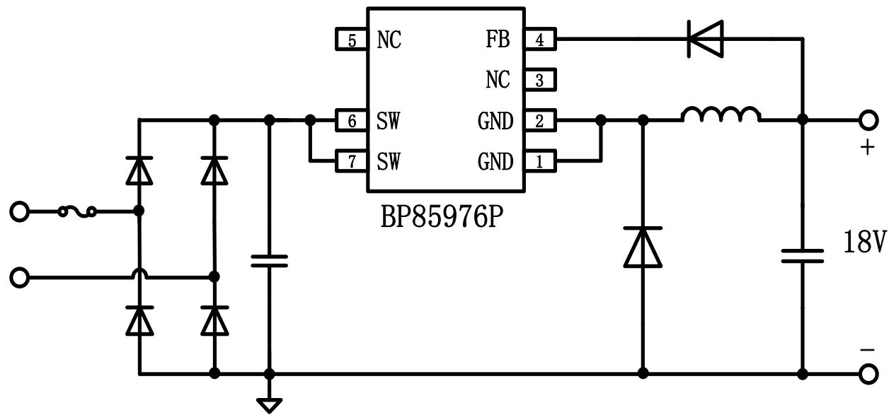

## 应用领域：

➢ 小家电辅助电源  
➢ 电机驱动辅助电源  
➢ IOT/智能家居/智能照明

DIP7封装

## 电源规格

<table><tr><td>项目描述</td><td>符号</td><td>最小</td><td>典型</td><td>最大</td><td>单位</td><td>备注</td></tr><tr><td colspan="7">输入</td></tr><tr><td>电压</td><td> $V_{IN}$ </td><td>85</td><td>115/230</td><td>265</td><td> $V_{AC}$ </td><td></td></tr><tr><td>频率</td><td> $f_{LINE}$ </td><td>47</td><td>50/60</td><td>63</td><td>Hz</td><td></td></tr><tr><td colspan="7">输出</td></tr><tr><td>输出电压</td><td> $V_{OUT}$ </td><td></td><td>18/5</td><td></td><td>V</td><td>±5%</td></tr><tr><td>输出电流</td><td> $I_{OUT}$ </td><td></td><td>0.25/0.1</td><td></td><td>A</td><td></td></tr><tr><td>输出电压纹波</td><td> $V_{RIPPLE}$ </td><td></td><td></td><td>200</td><td>mV</td><td>20MHz带宽</td></tr><tr><td>连续输出功率</td><td> $P_{OUT}$ </td><td></td><td>5</td><td></td><td>W</td><td></td></tr><tr><td colspan="7">效率</td></tr><tr><td>待机功耗</td><td> $P_{STDBY}$ </td><td></td><td></td><td>300</td><td>mW</td><td>230VAC</td></tr><tr><td>满载效率</td><td>η</td><td>72</td><td></td><td></td><td>%</td><td></td></tr><tr><td colspan="7">环境</td></tr><tr><td>传导EMI</td><td></td><td colspan="4">满足CISPR22/EN55022 Class B,至少6dB 裕量</td><td></td></tr><tr><td rowspan="2">Surge</td><td></td><td></td><td>±2</td><td></td><td>kV</td><td>差模</td></tr><tr><td></td><td></td><td>±4</td><td></td><td>kV</td><td>共模</td></tr><tr><td>EFT</td><td></td><td></td><td>±4</td><td></td><td>kV</td><td>5kHz/100kHz/38kHz</td></tr><tr><td rowspan="2">ESD</td><td></td><td></td><td>±8</td><td></td><td>kV</td><td>接触放电</td></tr><tr><td></td><td></td><td>±15</td><td></td><td>kV</td><td>空气放电</td></tr><tr><td>工作环境温度</td><td> $T_{AMP}$ </td><td></td><td></td><td>60</td><td>°C</td><td></td></tr></table>

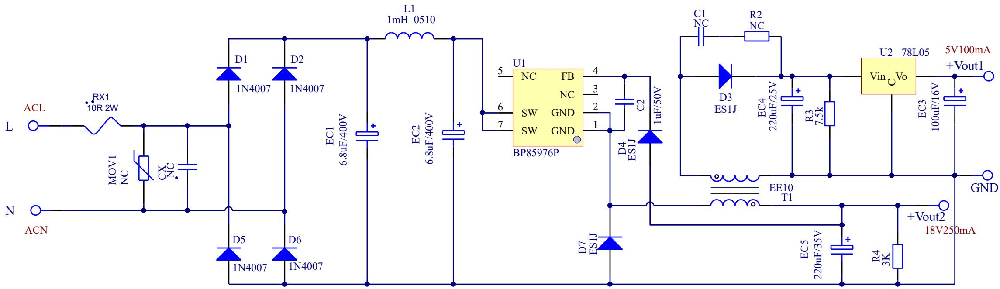

<table><tr><td>序号</td><td>元件标号</td><td>参数描述</td><td>封装尺寸</td><td>数量</td></tr><tr><td>1</td><td>PCB</td><td>CEM-1,单面板</td><td>90.2mm*27.4mm</td><td>1</td></tr><tr><td>2</td><td>RX1</td><td>2W,10R保险丝电阻</td><td>DIP</td><td>1</td></tr><tr><td>3</td><td>D1,D2,D5,D6</td><td>1N4007,1A/1000V</td><td>DIP</td><td>4</td></tr><tr><td>4</td><td>D3,D4,D7</td><td>ES1J,1A/600V</td><td>SMA</td><td>3</td></tr><tr><td>5</td><td>L1</td><td>1mH,色环电感0510</td><td>DIP</td><td>1</td></tr><tr><td>6</td><td>T1</td><td>1mH,EE10</td><td>EE10</td><td>1</td></tr><tr><td>7</td><td>EC1,EC2</td><td>6.8uF/400V,电解电容</td><td>ø8*14mm</td><td>2</td></tr><tr><td>8</td><td>EC3</td><td>100uF/16V,电解电容</td><td>ø5*11mm</td><td>1</td></tr><tr><td>9</td><td>EC4</td><td>220uF/25V电解电容</td><td>ø8*11.5mm</td><td>1</td></tr><tr><td>10</td><td>EC5</td><td>220uF/35V电解电容</td><td>ø10*12.5mm</td><td>1</td></tr><tr><td>11</td><td>C2</td><td>105</td><td>SMD0805</td><td>1</td></tr><tr><td>12</td><td>R3</td><td>7.5K,±5%</td><td>SMD0805</td><td>1</td></tr><tr><td>13</td><td>R4</td><td>3K,±5%</td><td>SMD0805</td><td>1</td></tr><tr><td>14</td><td>U1</td><td>BP85976P</td><td>DIP7</td><td>1</td></tr><tr><td>15</td><td>U2</td><td>78L05</td><td>SOT-89</td><td>1</td></tr><tr><td></td><td></td><td></td><td>Total</td><td>21</td></tr></table>

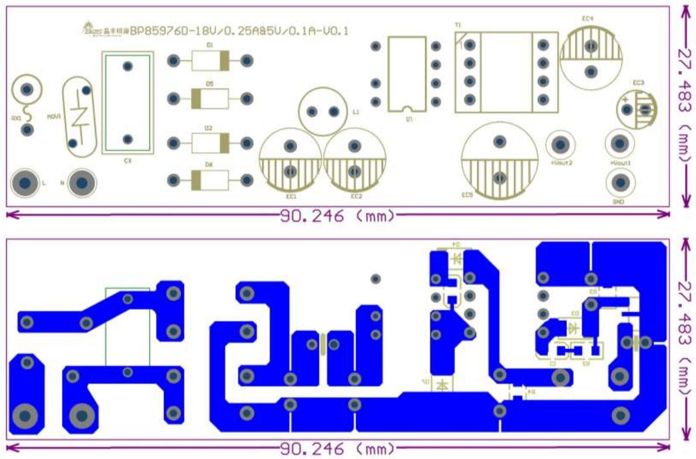

## 原理图

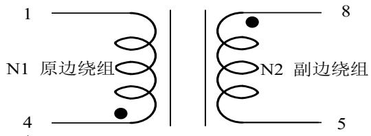

## 绕线方式

<table><tr><td>绕组</td><td>起始脚</td><td>终止脚</td><td>材料</td><td>匝数</td><td>绕线方式</td></tr><tr><td>N1</td><td>1</td><td>4</td><td> $\phi 0.2*1P$ </td><td>166Ts</td><td>密绕6层(PIN脚朝外)</td></tr><tr><td colspan="4">胶带</td><td>1Ts</td><td></td></tr><tr><td>N2</td><td>5</td><td>8</td><td> $\phi 0.13*1P$ </td><td>83Ts</td><td>密绕2层(PIN脚朝外)</td></tr><tr><td colspan="4">胶带</td><td>2Ts</td><td></td></tr></table>

## 规格与材料

➢ 初级绕组感量 $\mathsf { L } _ { \mathsf { p } } { = } 1 \mathsf { m } \mathsf { H } \pm 1 0 \%$ （测试条件: 0.3V，100kHz）  
➢ 骨架：EE10（4+4PIN）  
➢ 磁芯：EE10 PC40 或同等材质 ， $\mathsf { A e } { = } 1 2 \mathsf { m m } ^ { 2 }$  
➢ N1、N2: 2UEW 漆包线  
➢ 成品要求：浸凡立水

## 脚位图

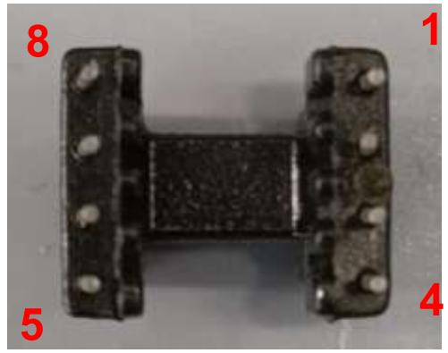

空载功耗  
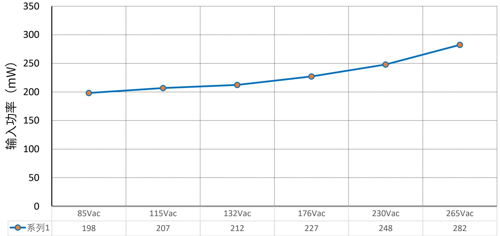

输入电压

效率测试  
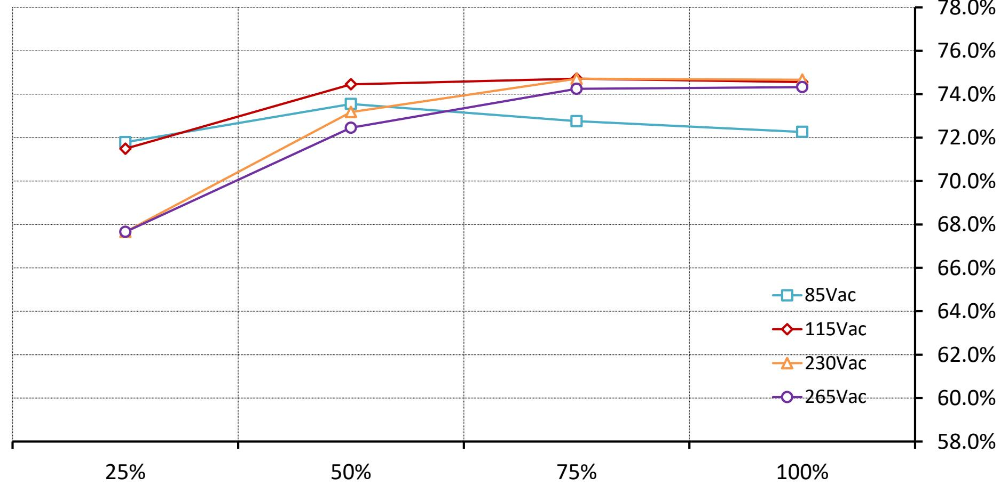

负载

## 输出电压调整率

<table><tr><td rowspan="2"></td><td rowspan="2"> $V_{IN}(VAC)$ Load(%)</td><td colspan="2">85V</td><td colspan="2">115V</td><td colspan="2">230V</td><td colspan="2">265V</td><td colspan="2">输入调整率</td></tr><tr><td>5V</td><td>18V</td><td>5V</td><td>18V</td><td>5V</td><td>18V</td><td>5V</td><td>18V</td><td>5V</td><td>12V</td></tr><tr><td>5V=0%</td><td>18V=0%</td><td>5.150</td><td>18.170</td><td>5.150</td><td>18.140</td><td>5.150</td><td>18.110</td><td>5.150</td><td>18.110</td><td>0.00%</td><td>0.33%</td></tr><tr><td rowspan="3">5V=50%</td><td>18V=0%</td><td>2.046</td><td>18.370</td><td>2.920</td><td>18.240</td><td>4.060</td><td>18.130</td><td>3.980</td><td>18.120</td><td>61.94%</td><td>1.37%</td></tr><tr><td>18V=50%</td><td>5.150</td><td>17.820</td><td>5.160</td><td>17.790</td><td>5.160</td><td>17.750</td><td>5.160</td><td>17.750</td><td>0.19%</td><td>0.39%</td></tr><tr><td>18V=100%</td><td>5.160</td><td>17.780</td><td>5.160</td><td>17.750</td><td>5.160</td><td>17.690</td><td>5.160</td><td>17.670</td><td>0.00%</td><td>0.62%</td></tr><tr><td rowspan="3">5V=100%</td><td>18V=0%</td><td>0.000</td><td>18.580</td><td>0.453</td><td>18.390</td><td>1.941</td><td>18.180</td><td>2.140</td><td>18.160</td><td>188.80%</td><td>2.29%</td></tr><tr><td>18V=50%</td><td>5.170</td><td>17.830</td><td>5.170</td><td>17.790</td><td>5.170</td><td>17.740</td><td>5.170</td><td>17.740</td><td>0.00%</td><td>0.51%</td></tr><tr><td>18V=100%</td><td>5.170</td><td>17.770</td><td>5.170</td><td>17.740</td><td>5.170</td><td>17.690</td><td>5.170</td><td>17.690</td><td>0.00%</td><td>0.45%</td></tr><tr><td colspan="2">负载交叉调整率</td><td>129.96%</td><td>4.49%</td><td>113.14%</td><td>3.62%</td><td>71.05%</td><td>2.74%</td><td>66.43%</td><td>2.74%</td><td colspan="2"></td></tr></table>

◼ 计算方法：调整率=100%\*(最大值-最小值)/平均值  
测试条件：18V输出带5.1k假负载  
◼ 备注：可从18V输出加7.5V稳压管和100ohm电阻到78L05输入端，防止5V输出跌到0V

## 极限负载能力

<table><tr><td> $V_{IN}(VAC)$ Load(mA)</td><td>85</td><td>115</td><td>230</td><td>265</td></tr><tr><td>18V负载电流(mA)</td><td>5V负载电流(mA)</td><td>5V负载电流(mA)</td><td>5V负载电流(mA)</td><td>5V负载电流(mA)</td></tr><tr><td>0</td><td>17.7</td><td>22.2</td><td>27.7</td><td>27.7</td></tr><tr><td colspan="5">note:当18V负载电流为0时,保证5V输出满足±5%Vout时所能提供的最大负载电流。</td></tr><tr><td>5V负载电流(mA)</td><td>18V负载电流(mA)</td><td>18V负载电流(mA)</td><td>18V负载电流(mA)</td><td>18V负载电流(mA)</td></tr><tr><td>15</td><td>0</td><td>0</td><td>0</td><td>0</td></tr><tr><td>25</td><td>2.2</td><td>0.7</td><td>0</td><td>0</td></tr><tr><td>30</td><td>3.7</td><td>2.2</td><td>0.7</td><td>0.7</td></tr><tr><td>40</td><td>6.7</td><td>4.2</td><td>1.7</td><td>2.2</td></tr><tr><td>50</td><td>9.7</td><td>6.7</td><td>3.7</td><td>3.7</td></tr><tr><td colspan="5">note:当5V输出提供左侧负载电流时,保证5V输出满足±5%Vout时,18V输出所需提供的最小负载电流。</td></tr></table>

## Note：

保证18V输出空载时，5V输出有 $2 5 \mathrm { { m A } ( 2 5 \% I _ { F U L L \ L O A D } ) }$ 带载能力，需在18V输出侧并联3K假负载。

## 输出电压纹波

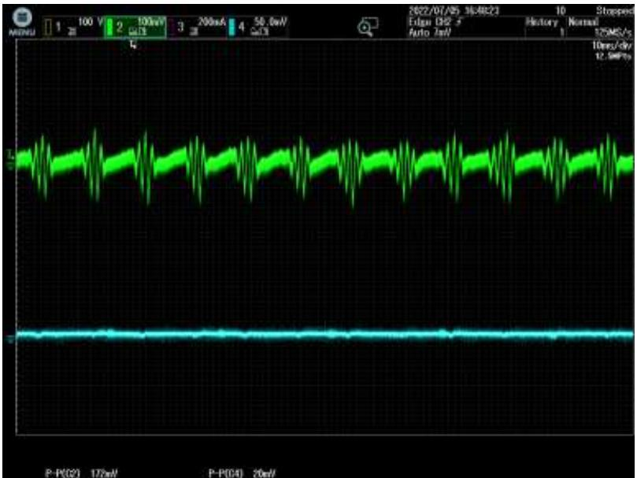

85 VAC

CH2 $\mathsf { V } _ { \mathsf { O U T } \_ 1 8 \mathsf { V } }$ Ripple $\mathsf { V } _ { \mathsf { P K - P K } } { = } 1 7 2 \mathsf { m V }$  
CH4 $\mathsf { V } _ { \mathsf { O U T } \_ 5 \mathsf { V } }$ Ripple $V _ { p | \min } = 2 0 m v$

## Test Condition:

➢ Full Load

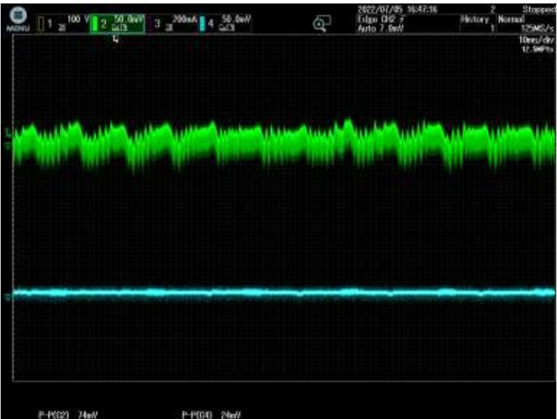

115 VAC

$\mathsf { C H 2 } \mathsf { V _ { O U T \_ 1 8 \vee } }$ Ripple $V _ { p | x - P K } = 7 4 m v$  
CH4 $\mathsf { V } _ { \mathsf { O U T } \_ 5 \mathsf { V } }$ Ripple $V _ { p | x - P K } = 2 4 m v$

## Test Condition:

➢ Full Load

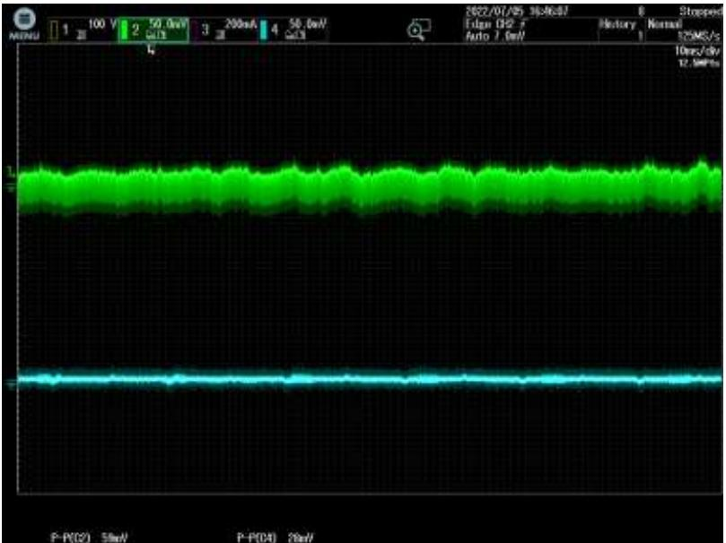

230 VAC

$\begin{array} { r } { \mathsf { C H } 2 \mathsf { V } _ { \mathsf { O U T \_ 1 8 V } } } \\ { \mathsf { V } _ { \mathsf { P K } \mathrm { \_ P K } } \mathsf { = } 5 9 \mathsf { m V } } \end{array}$ Ripple  
$\begin{array} { r l } & { \mathsf { C H 4 V _ { \mathsf { O U T \_ 5 v } } } \mathsf { R i p p l e } } \\ & { \mathsf { V _ { P K - P K } } \mathsf { = } 2 8 \mathsf { m V } } \end{array}$

## Test Condition:

➢ Full Load

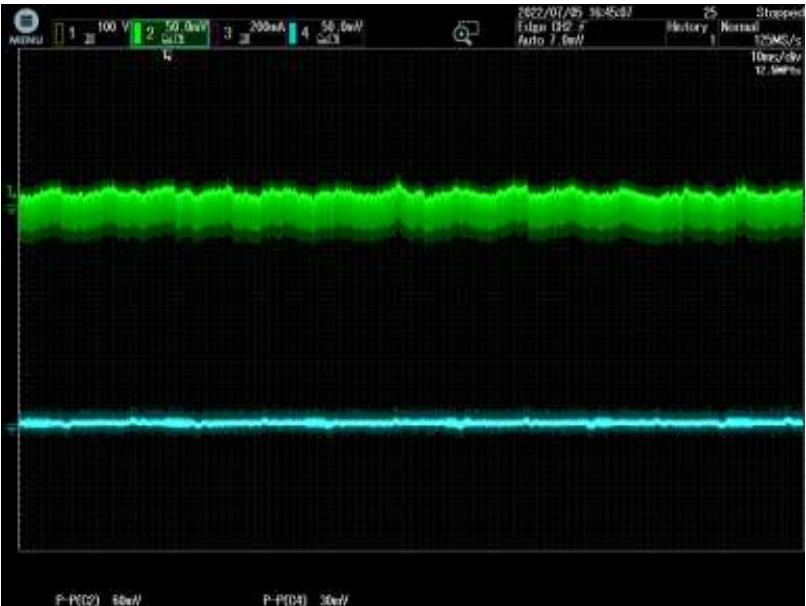

265 $\mathsf { v } _ { \mathsf { A C } }$

$\begin{array} { r } { \mathsf { C H } 2 \mathsf { V } _ { \mathsf { O U T } _ { - 1 8 \mathsf { V } } } } \\ { \mathsf { V } _ { \mathsf { P K } \cdot \mathsf { P K } } { = } 6 0 \mathsf { m V } } \end{array}$ Ripple  
$\begin{array} { r l } & { \mathsf { C H 4 V _ { \mathsf { O U T \_ 5 v } } } \mathsf { R i p p l e } } \\ & { \mathsf { V _ { P K - P K } } \mathsf { = } 3 0 \mathsf { m V } } \end{array}$

## Test Condition:

➢ Full Load

## 动态负载(50%-100%)

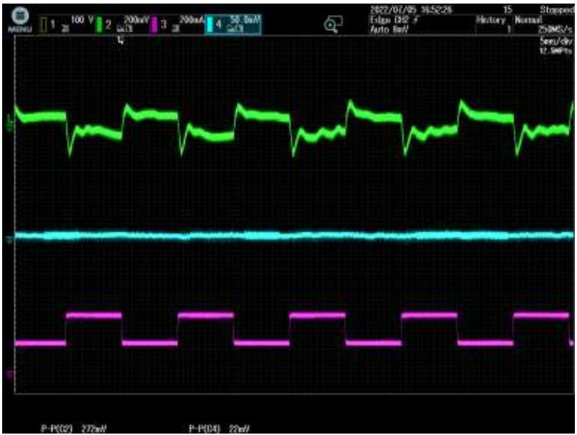

85 VAC

$\mathsf { C H 2 } \mathsf { V _ { O U T \ 1 8 V } }$ $v _ { p _ { k - P K } } = 2 7 2 m v$  
CH2 $\mathsf { V } _ { \mathsf { O U T } \ 5 \mathsf { V } }$ $V _ { \mathsf { P K - P K } } = 2 \bar { 2 } \mathsf { m v }$  
CH3 IOUT\_18V $\mathsf { I } _ { 0 \mathsf { U T } _ { - } 1 8 \mathsf { V } }$

## Test Condition:

➢ $0 . 1 2 5 \mathsf { A } – 0 . 2 5 \mathsf { A } – 0 . 1 2 5 \mathsf { A }$  
➢ Slew Rate: $0 . 5 \mathsf { A } / \mu \mathsf { S }$  
➢ Frequency: 100 Hz

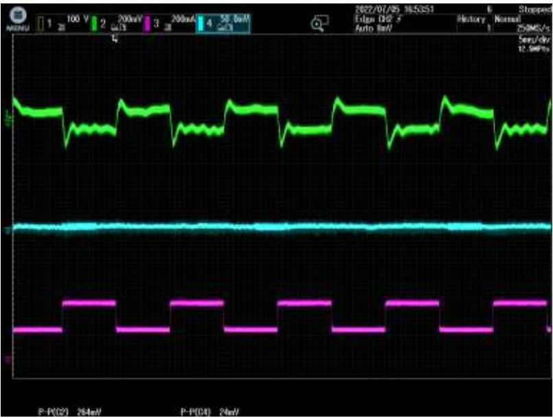

115 VAC

$\mathsf { C H 2 } \mathsf { V _ { O U T \ 1 8 \mathsf { V } } }$ $V _ { \mathsf { P K - P K } } = 2 \bar { 6 } 4 \mathsf { m v }$  
$\mathsf { C H 2 V _ { O U T } } \mathsf { 5 v }$ $V _ { \mathsf { P K - P K } } = 2 \bar { 4 } \mathsf { m v }$  
CH3 IOUT\_18V

## Test Condition:

➢ $0 . 1 2 5 \mathsf { A } – 0 . 2 5 \mathsf { A } – 0 . 1 2 5 \mathsf { A }$  
➢ Slew Rate: 0.5 A/μS  
➢ Frequency: 100 Hz

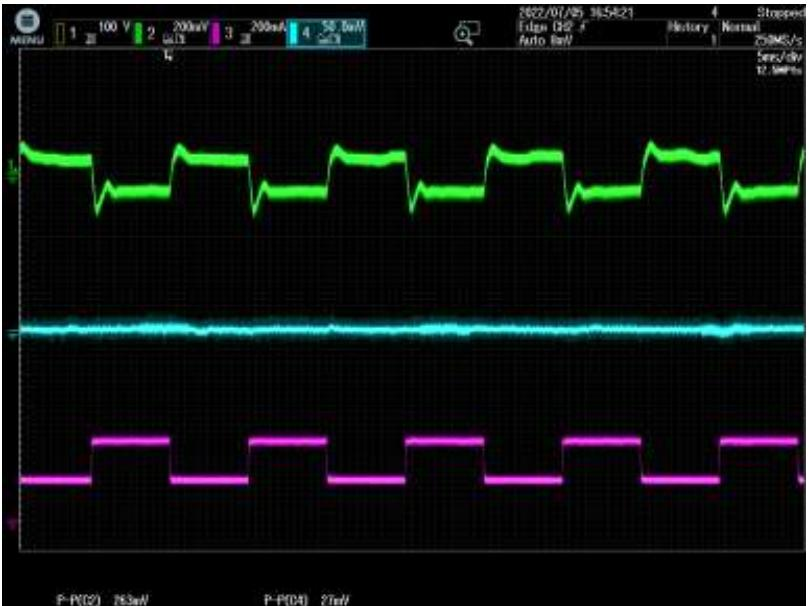

230 VAC

CH2 $\mathsf { V } _ { \mathsf { O U T } \ 1 8 \mathsf { V } }$ $v _ { p _ { k - P K } } = 2 6 3 m v$  
CH2 $\mathsf { V } _ { \mathsf { O U T } \ 5 \mathsf { V } }$ $v _ { p _ { \mathrm { K - P K } } } = 2 \bar { 7 } \ m v$  
CH3 IOUT\_18V $\mathsf { I } _ { 0 \mathsf { U T } _ { - } 1 8 \mathsf { V } }$

## Test Condition:

➢ $0 . 1 2 5 \mathsf { A } – 0 . 2 5 \mathsf { A } – 0 . 1 2 5 \mathsf { A }$  
➢ Slew Rate: 0.5 A/μS  
➢ Frequency: 100 Hz

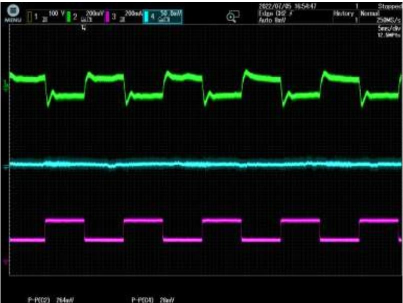

265 VAC

$\mathsf { C H 2 } \mathsf { V _ { O U T \ 1 8 V } }$ $V _ { \mathsf { P K - P K } } = 2 \bar { 6 } 4 \mathsf { m v }$  
$\mathsf { C H 2 V _ { O U T } } \mathsf { 5 v }$ $V _ { \mathsf { P K - P K } } = 2 \bar { 8 } \mathsf { m v }$  
CH3 IOUT\_18V $\mathsf { C H 3 } \mathsf { I _ { O U T \_ 1 8 v } }$

## Test Condition:

➢ $0 . 1 2 5 \mathsf { A } – 0 . 2 5 \mathsf { A } – 0 . 1 2 5 \mathsf { A }$  
➢ Slew Rate: 0.5 A/μS  
➢ Frequency: 100 Hz

## 动态负载(10%-90%)

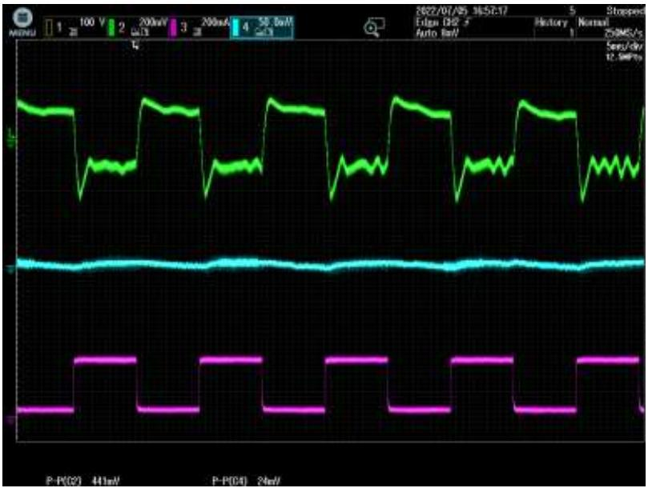

85 VAC

$\mathtt { C H 2 } \mathtt { V _ { 0 \sqcup T _ { 1 } 8 \vee _ { m \vee } } }$ UT\_18V  
$\mathsf { C H 4 V } _ { \mathsf { o u r } } \mathsf { \Pi } _ { \mathsf { m v } }$  
CH3 IOUT\_18V $\mathsf { I } _ { 0 \mathsf { U T } _ { - } 1 8 \mathsf { V } }$

## Test Condition:

➢ 0.025A-0.225A-0.025A  
➢ Slew Rate: 0.5 A/μS  
➢ Frequency: 100 Hz

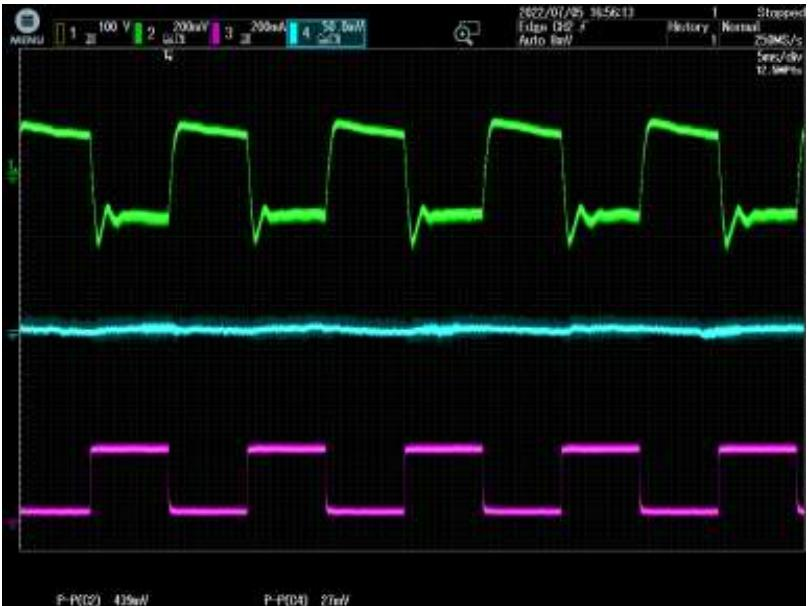

230VAC

$\begin{array} { r l } & { \mathsf { C H } 2 \mathsf { V } _ { \mathsf { O U T } } 1 8 \mathsf { V } } \\ & { \mathsf { V } _ { \mathsf { P K } \to \mathsf { P K } } = 4 3 9 \mathsf { m V } } \end{array}$  
CH4 V $v _ { p _ { k - P K } } = 2 7 m v$  
CH3 IOUT\_18V $\mathsf { I } _ { 0 \mathsf { U T } _ { - } 1 8 \mathsf { V } }$

## Test Condition:

➢ 0.025A-0.225A-0.025A  
➢ Slew Rate: 0.5 A/μS  
➢ Frequency: 100 Hz

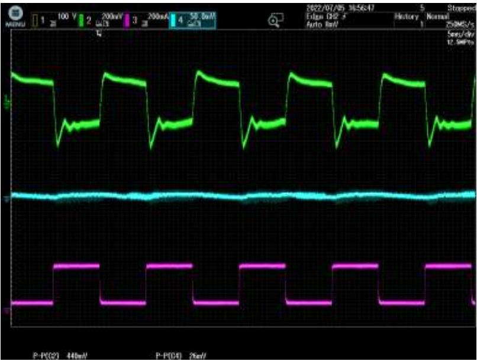

115 VAC

$\mathtt { C H 2 } \mathtt { V _ { 0 \sqcup T _ { 1 } 8 \vee _ { m \vee } } }$  
$\begin{array} { r l } & { \mathsf { C H 4 } \mathsf { V } _ { \mathsf { O U T } } \mathsf { 5 v } } \\ & { \mathsf { V } _ { \mathsf { P K - P K } } \mathsf { = 2 6 } \mathsf { m v } } \end{array}$  
CH3 IOUT\_18V

## Test Condition:

➢ 0.025A-0.225A-0.025A  
➢ Slew Rate: 0.5 A/μS  
➢ Frequency: 100 Hz

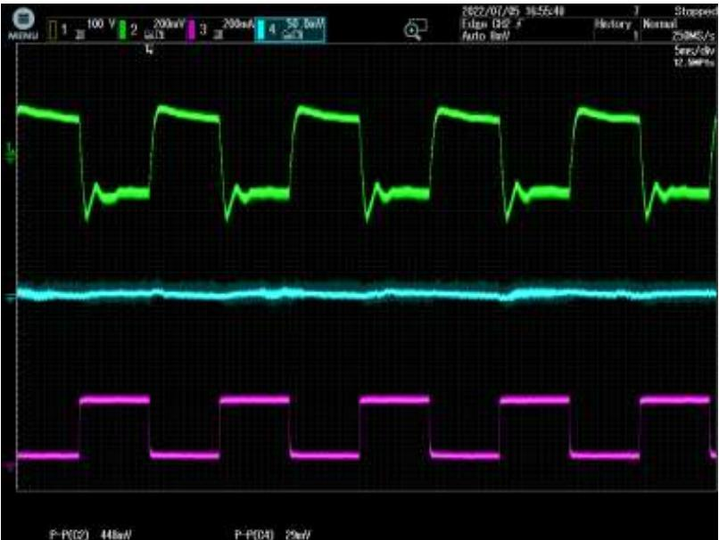

265 VAC

$\begin{array} { r l } & { \mathsf { C H 2 } \mathsf { V _ { O U T } } _ { 1 8 \mathsf { V } } } \\ & { \mathsf { V _ { P K - P K } } \equiv 4 4 8 \mathsf { m v } } \end{array}$  
CH4 V $v _ { p _ { k - P K } } = 2 9 m v$  
CH3 IOUT\_18V

## Test Condition:

➢ 0.025A-0.225A-0.025A  
➢ Slew Rate: 0.5 A/μS  
➢ Frequency: 100 Hz

## 输出电压开机波形

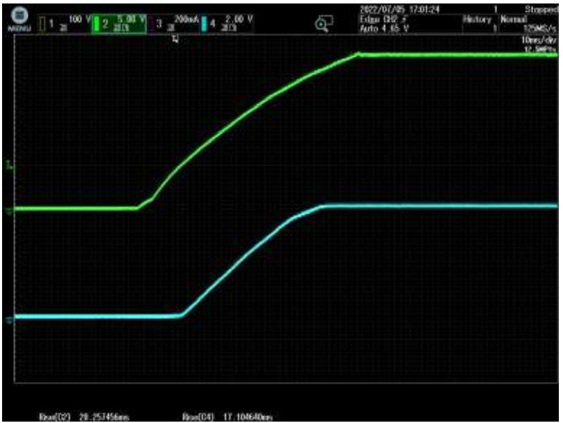

${ \otimes 5 } \mathsf { V } _ { \mathsf { A C } }$

$\begin{array} { l l } { { \mathbb { C } } { \mathbb { H } } 2 { \mathbb { V } } _ { 0 \cup \mathbb { T } _ { - } 1 8 \vee } } \\ { { \mathbb { t } } _ { \mathrm { r i s e } } { = } 2 8 . 2 \mathrm { m } 5 } \end{array}$ CH2 VOUT\_18V  
$\begin{array} { r l } { \mathbf { \mathbb { 1 } } } & { \subset \mathsf { H } 4 \mathsf { V } _ { 0 \cup \mathsf { T } } } \\ & { \mathbf { t } _ { \mathsf { r i s e } } = 1 7 . 1 \mathsf { m s } } \end{array}$

Test Condition:  
➢ Full Load  
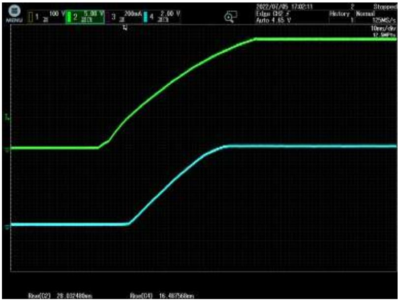

115 VAC

$\begin{array} { l l } { { \mathsf { C H 2 } } { \mathsf { V } } _ { 0 \cup \mathsf { T } _ { - } 1 8 \mathsf { V } } } \\ { { \mathsf { t } } _ { \mathsf { r i s e } } { = } 2 8 \mathsf { m S } } \end{array}$ CH2 VOUT\_18V  
$\begin{array} { r l } { \bullet } & { { } \mathsf { C H 4 V } _ { 0 \mathsf { U T } } } \\ { \quad } & { { } \mathbf { t } _ { \mathsf { r i s e } } = 1 6 . 5 \mathsf { m s } } \end{array}$

Test Condition:  
➢ Full Load  
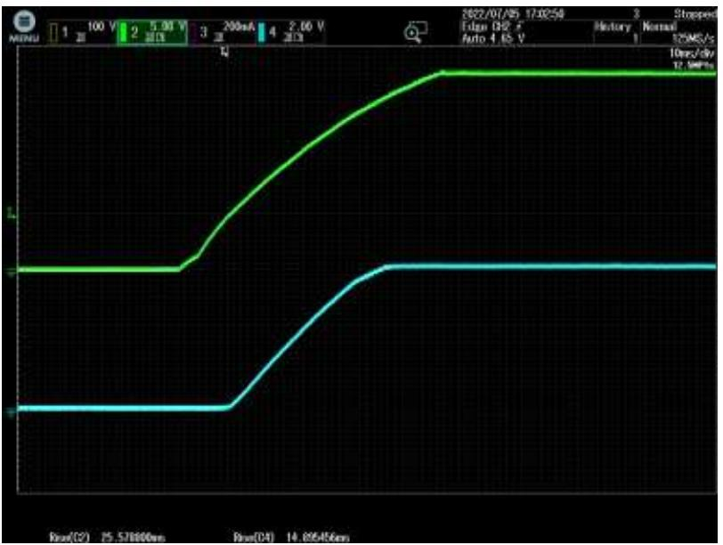

230 VAC

$\begin{array} { r l } { \mathbf { \Delta } } & { { } \mathsf { C H 2 } \mathsf { V _ { 0 \cup T \_ 1 8 \vee } } } \\ { \mathbf { \Delta } } & { { } \mathbf { t _ { r i s e } } = 2 5 . 6 \mathsf { m s } } \end{array}$ CH2 V  
CH4 V $\mathsf { V } _ { \mathsf { O U T } \_ 5 \mathsf { V } }$ t = 14.9 mS

Test Condition:  
➢ Full Load  
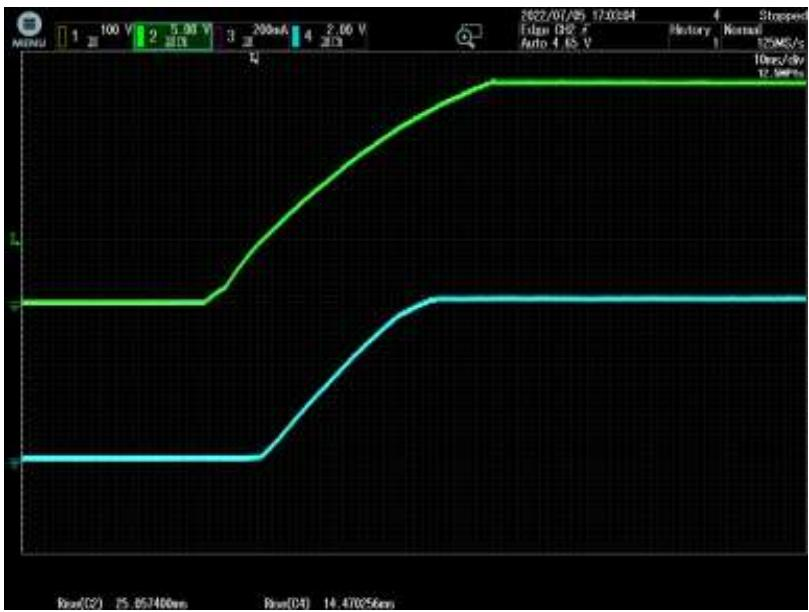

265 VAC

$\begin{array} { l l } { { \mathsf { C H 2 } } { \mathsf { V } } _ { 0 \cup \mathsf { T } _ { - } 1 8 \mathsf { V } } } \\ { { \mathsf { t } } _ { \mathsf { r i s e } } { = } 2 5 ~ \mathsf { m S } } \end{array}$ CH2 VOUT\_18V  
$\begin{array} { l } { { \mathsf { C H 4 V } _ { 0 \cup \mathsf { T } \_ 5 \vee } } } \\ { { \mathsf { t } _ { \mathsf { r i s e } } } { = } 1 4 . 4 \mathsf { m s } } \end{array}$ CH4 VOUT\_5V

Test Condition:

➢ Full Load

## MOSFET开机波形

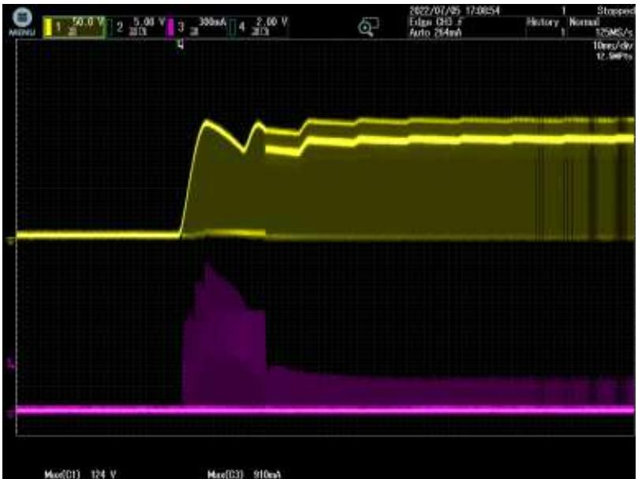

85 VAC

CH1 VDS  
CH3 IDS

$$
\begin{array}{l} \mathrm {V_ {DS\_MAX}} = 1 2 4 \mathrm{V} \\ \mathrm {I_ {DS\_MAX}} = 0. 9 1 \mathrm{A} \end{array}
$$

## Test Condition:

➢ No Load

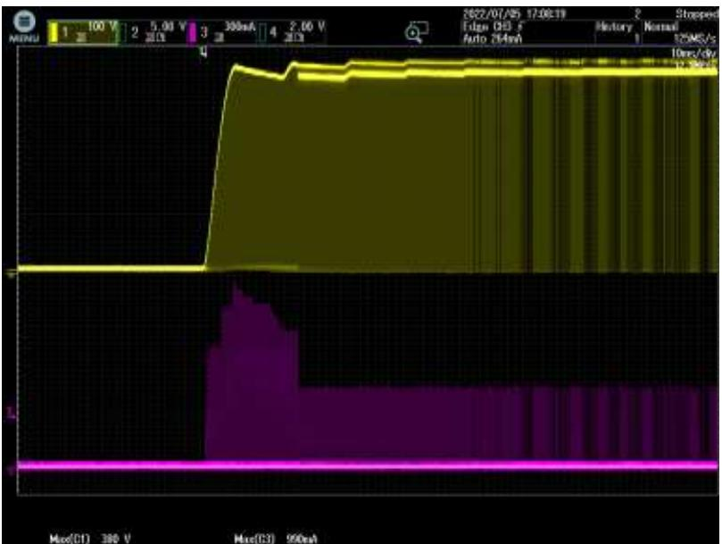

265 VAC

CH1 VDS  
CH3 IDS

$$
\begin{array}{l} \mathrm {V_ {DS\_MAX}} = 3 8 0 \mathrm{V} \\ \mathrm {I_ {DS\_MAX}} = 0. 9 9 \mathrm{A} \end{array}
$$

## Test Condition:

➢ No Load

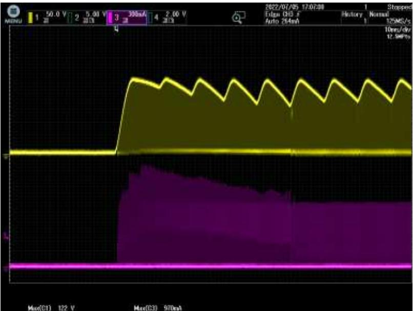

85 VAC

CH1 VDS  
CH3 IDS

$$
\begin{array}{l} \mathrm {V_ {DS\_MAX}} = 1 2 2 \mathrm{V} \\ \mathrm {I_ {DS\_MAX}} = 0. 9 7 \mathrm{A} \end{array}
$$

## Test Condition:

➢ Full Load

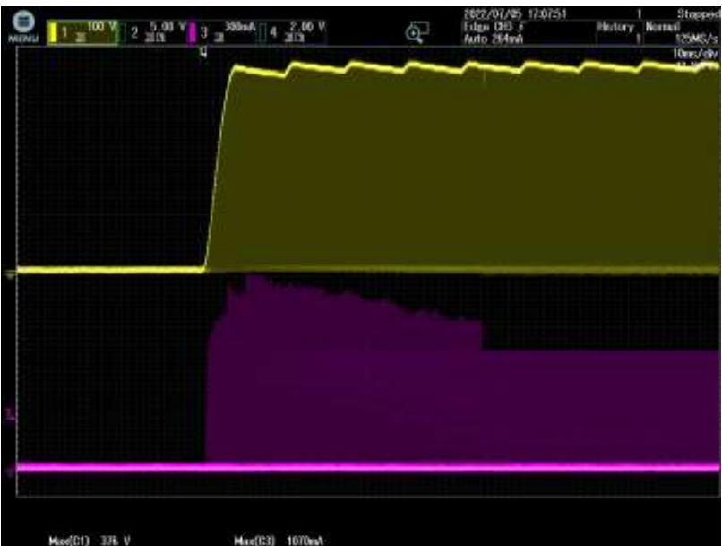

265 VAC

CH1 VDS  
CH3 IDS

$$
\begin{array}{l} \mathrm {V_ {DS\_MAX}} = 3 7 6 \mathrm{V} \\ \mathrm {I_ {DS\_MAX}} = 1. 0 7 \mathrm{A} \end{array}
$$

## Test Condition:

➢ Full Load

## MOSFET稳态波形

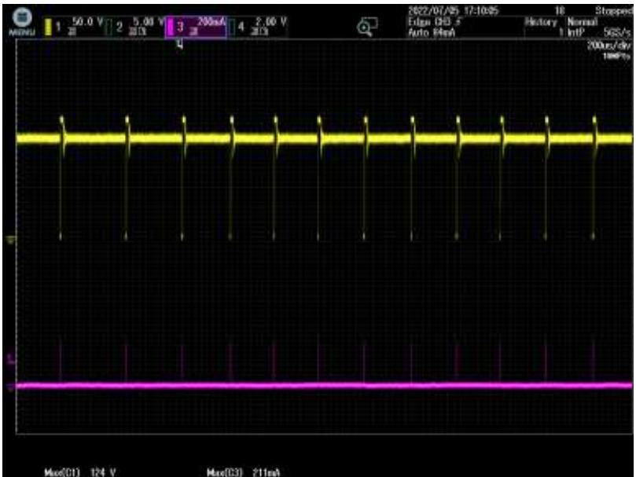

85 VAC  
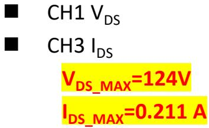

Test Condition:

➢ No Load

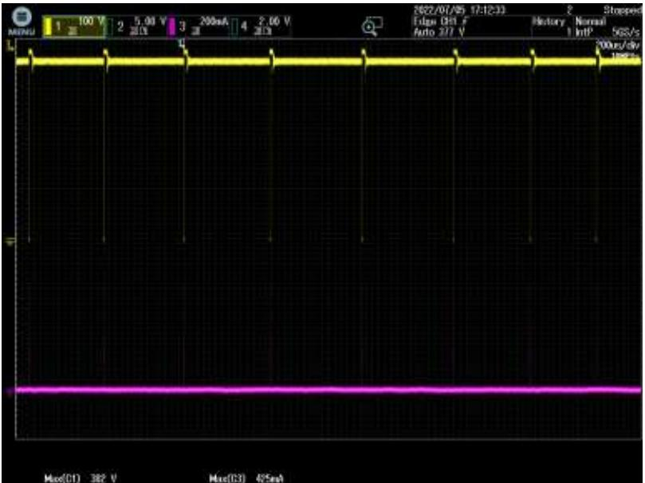

265 VAC  
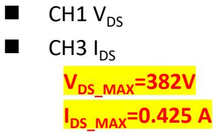

Test Condition:

➢ No Load

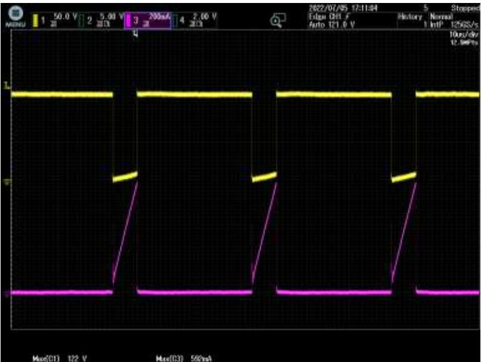

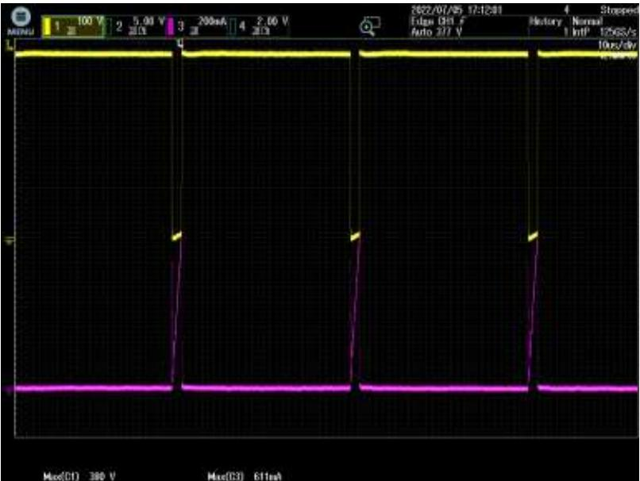

85 VAC  

Test Condition:

➢ Full Load

265 VAC  
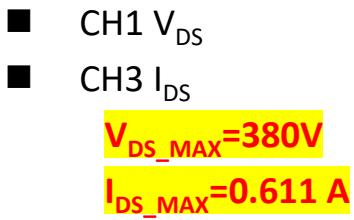

Test Condition:

➢ Full Load

## 输出二极管开机波形

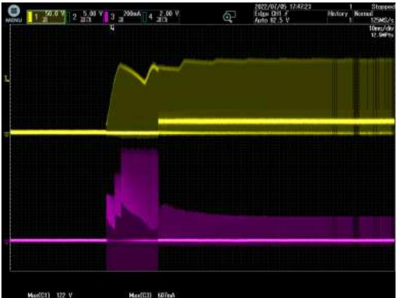

85 VAC

CH1 VR  
CH3 IF

$$
V _ {R \_ M A X} = 1 2 2 \mathrm{V}
$$

$$
I _ {F \_ M A X} = 0. 6 0 7 A
$$

## Test Condition:

➢ No Load

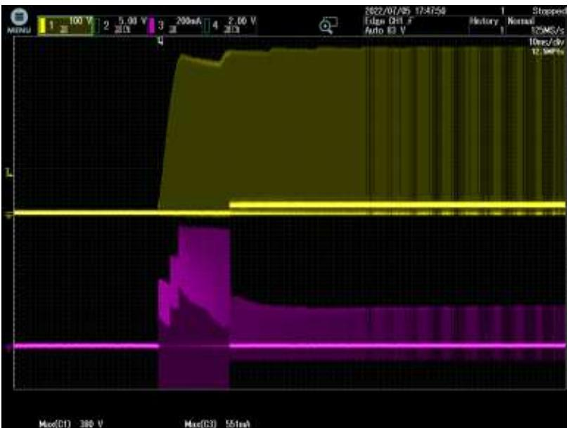

265 VAC

CH1 VR  
CH3 IF

$$
V _ {R \_ M A X} = 3 8 0 \mathrm{V}
$$

$$
I _ {F \_ M A X} = 0. 5 5 1 \mathrm{A}
$$

## Test Condition:

➢ No Load

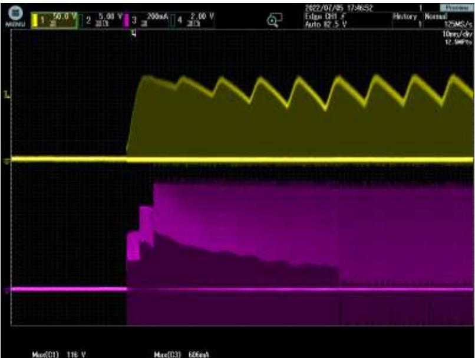

85 VAC

CH1 VR  
CH3 IF

$$
\begin{array}{l} \mathrm {V_ {R\_MAX}} = 1 1 6 \mathrm{V} \\ \mathrm {I_ {F\_MAX}} = 0. 6 0 6 \mathrm{A} \end{array}
$$

## Test Condition:

➢ Full Load

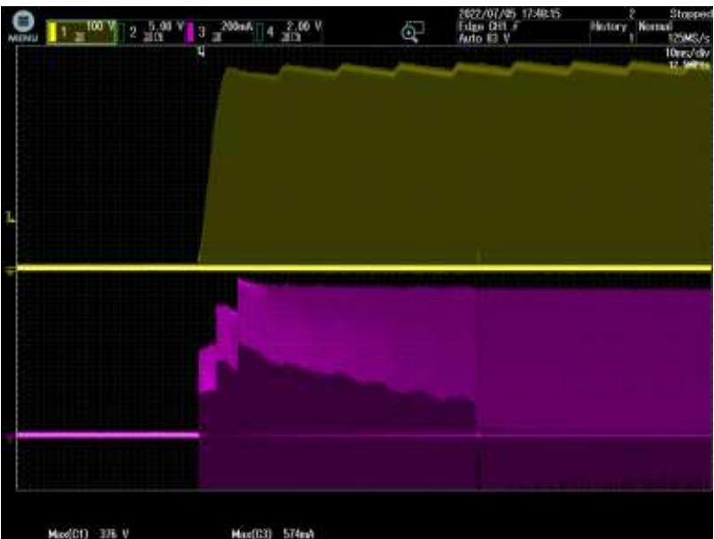

265 VAC

CH1 VR  
CH3 IF

$$
\begin{array}{l} \mathrm {V_ {R\_MAX}} = 3 7 6 \mathrm{V} \\ \mathrm {I_ {F\_MAX}} = 0. 5 7 4 \mathrm{A} \end{array}
$$

## Test Condition:

➢ Full Load

## 输出二极管稳态波形

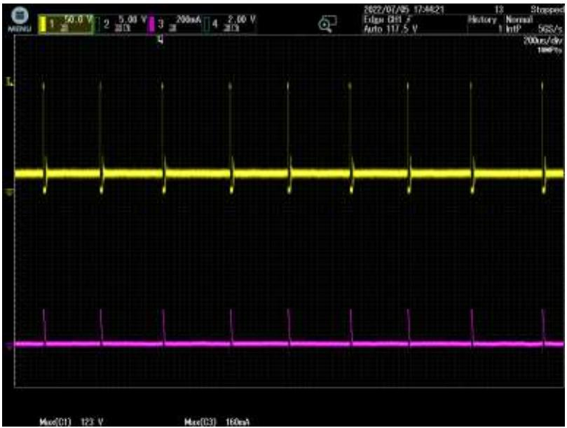

85 VAC

$C H 1 \mathsfit { V } _ { \mathsf { R } }$  
$C H 3 1 _ { \mathsf { F } }$

$$
\begin{array}{l} \mathrm {V_ {R\_MAX}} = 1 2 3 \mathrm{V} \\ \mathrm {I_ {F\_MAX}} = 0. 1 6 \mathrm{A} \end{array}
$$

## Test Condition:

➢ No Load

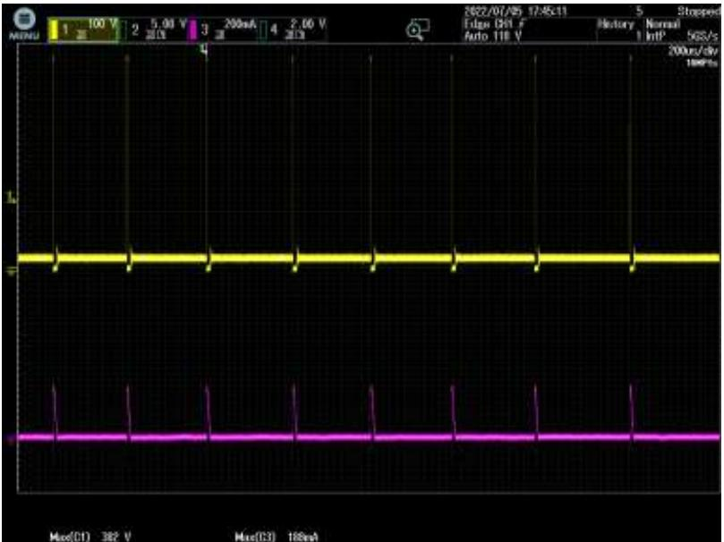

265 VAC

$C H 1 \mathsfit { V } _ { \mathsf { R } }$  
$C H 3 1 _ { F }$

$$
\begin{array}{l} \mathrm {V_ {R\_MAX}} = 3 8 2 \mathrm{V} \\ \mathrm {I_ {F\_MAX}} = 0. 1 8 8 \mathrm{A} \end{array}
$$

## Test Condition:

➢ No Load

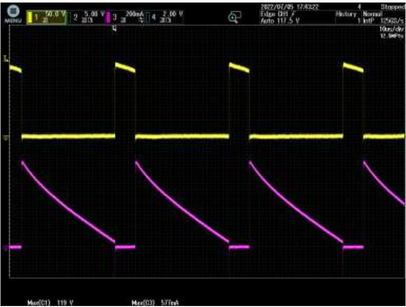

${ \tt S 5 V } _ { \sf A C }$

$C H \bot V _ { \mathsf { R } }$  
$C H 3 1 _ { F }$

$$
\begin{array}{l} \mathrm {V_ {R\_MAX}} = 1 1 9 \mathrm{V} \\ \mathrm {I_ {F\_MAX}} = 0. 5 5 7 \mathrm{A} \end{array}
$$

## Test Condition:

➢ Full Load

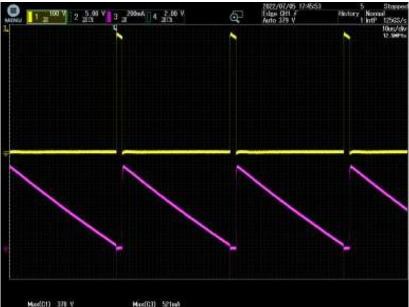

$2 6 5 \ : \mathsf { V } _ { \mathsf { A C } }$

${ \mathsf { C H 1 V } } _ { \mathsf { R } }$  
$C H 3 1 _ { \mathsf { F } }$

$$
\begin{array}{l} \mathrm {V_ {R\_MAX}} = 3 7 8 \mathrm{V} \\ \mathrm {I_ {F\_MAX}} = 0. 5 2 1 \mathrm{A} \end{array}
$$

## Test Condition:

➢ Full Load

## 输出短路保护（MOSFET波形）

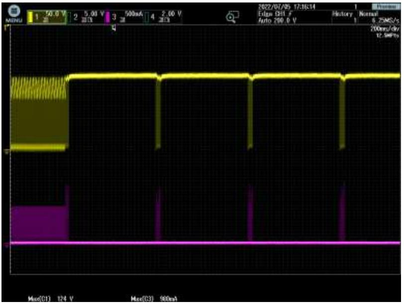

${ \otimes 5 } \mathsf { V } _ { \mathsf { A C } }$

${ \mathsf { C H 1 } } \mathsf { V _ { D S } }$  
$C H 3 \mid _ { \mathsf { D S } }$

$$
\begin{array}{l} \mathrm {V_ {DS\_MAX}} = 1 2 4 \mathrm{V} \\ \mathrm {I_ {DS\_MAX}} = 0. 9 8 \mathrm{A} \end{array}
$$

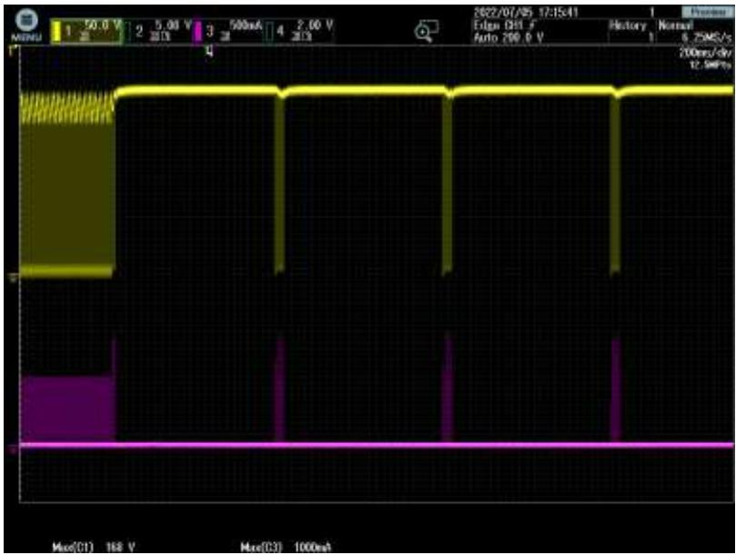

$1 1 5 \mathsf { V } _ { \mathsf { A C } }$

${ \mathsf { C H 1 } } \mathsf { V } _ { \mathsf { D S } }$  
$C H 3 \mid _ { \mathsf { D S } }$

$$
\begin{array}{l} \mathrm {V_ {DS\_MAX}} = 1 6 8 \mathrm{V} \\ \mathrm {I_ {DS\_MAX}} = 1 \mathrm{A} \end{array}
$$

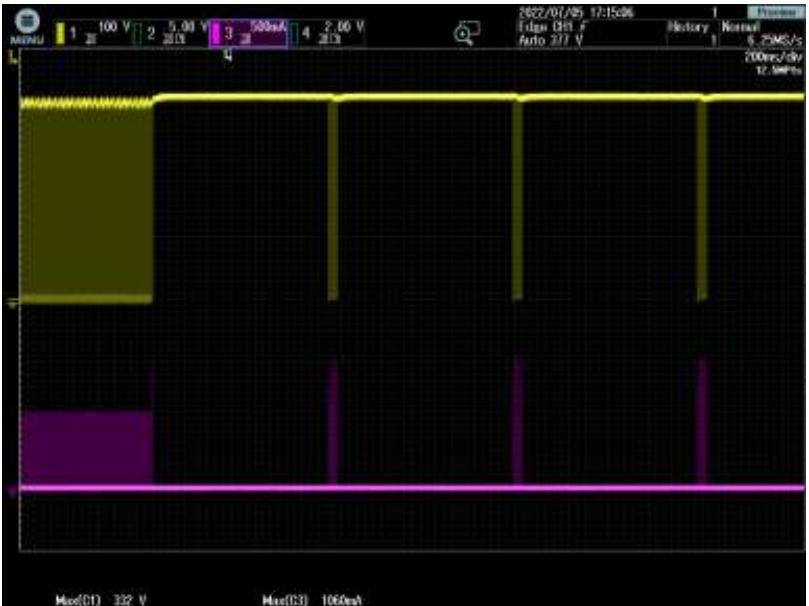

$230 v _ { \mathsf { A C } }$

${ \mathsf { C H 1 } } \mathsf { V _ { D S } }$  
$C H 3 \mid _ { \mathsf { D S } }$

$$
V _ {D S \_ M A X} = 3 3 2 \mathrm{V}
$$

$$
I _ {D S \_ M A X} = 1. 0 6 \mathrm{A}
$$

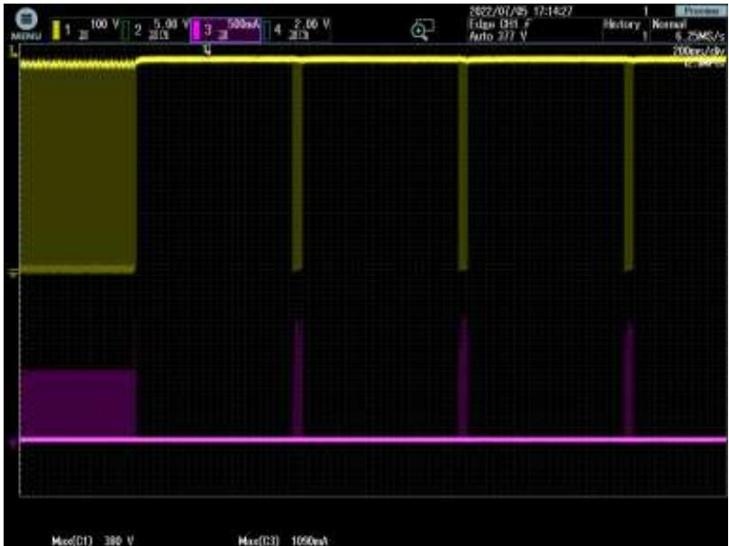

$2 6 5 \ : \mathsf { V } _ { \mathsf { A C } }$

${ \mathsf { C H 1 } } \mathsf { V } _ { \mathsf { D S } }$  
$C H 3 \mid _ { \mathsf { D S } }$

$$
V _ {D S \_ M A X} = 3 8 0 \mathrm{V}
$$

$$
I _ {D S \_ M A X} = 1. 0 9 \mathrm{A}
$$

<table><tr><td rowspan="2">项目</td><td>85VAC</td><td>115VAC</td><td>230VAC</td><td>265VAC</td></tr><tr><td>温度(°C)</td><td>温度(°C)</td><td>温度(°C)</td><td>温度(°C)</td></tr><tr><td>环境温度</td><td>54.12</td><td>53.87</td><td>53.9</td><td>54.1</td></tr><tr><td>BP85976P (U1)</td><td>117.51</td><td>104.8</td><td>109.01</td><td>115.73</td></tr><tr><td>变压器绕组(T1)</td><td>90.55</td><td>89.96</td><td>98.06</td><td>101.79</td></tr><tr><td>变压器磁芯(T1)</td><td>88.21</td><td>87.49</td><td>94.75</td><td>98.22</td></tr><tr><td>续流二极管(D7)</td><td>88.8</td><td>86.56</td><td>89.7</td><td>92.06</td></tr><tr><td>整流桥(D1)</td><td>62.63</td><td>59.79</td><td>57.8</td><td>57.43</td></tr><tr><td>输入电解电容(EC2)</td><td>66.74</td><td>63.72</td><td>62.48</td><td>63.03</td></tr><tr><td>输出电解电容(EC5)</td><td>74.37</td><td>73.13</td><td>75.33</td><td>76.84</td></tr></table>

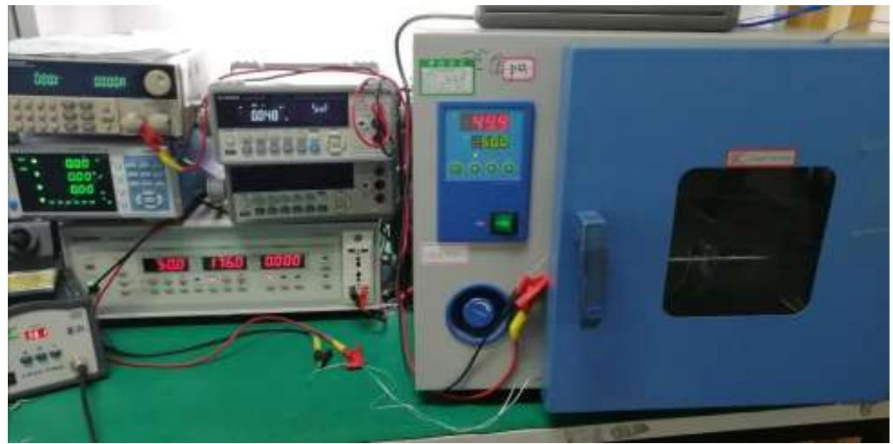

## 测试说明

➢ 在温箱中进行测试  
➢ 电路板放在一个封闭的盒子内  
➢ 热电偶连接到各个测量点  
➢ 等测量点温度达到稳定后记录数据

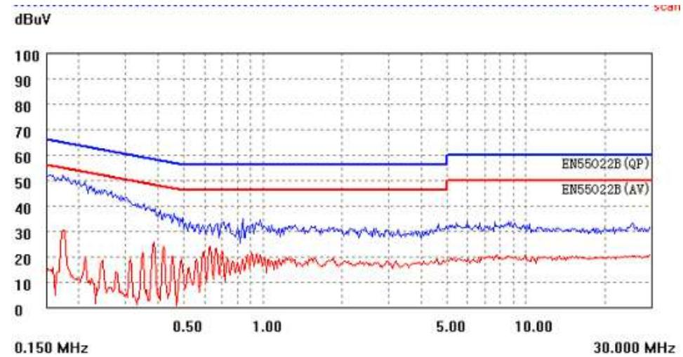

115Vac Line  
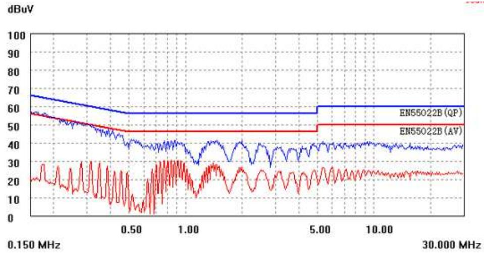

230Vac Line

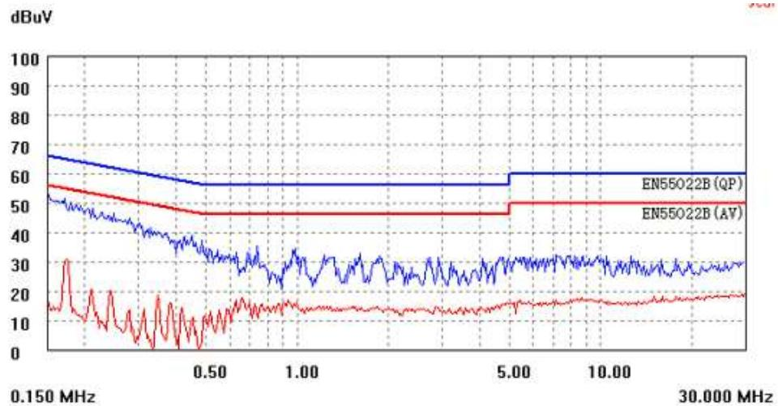

115Vac Neutral

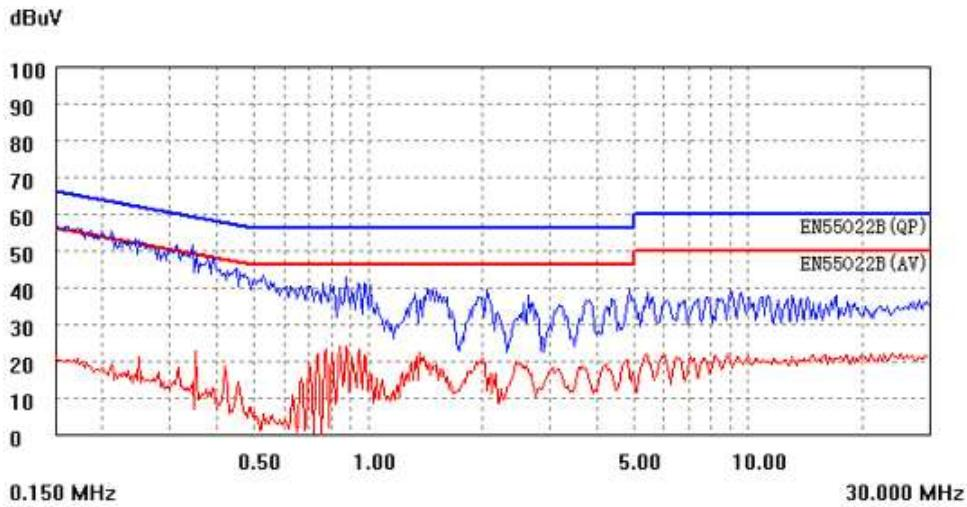

230Vac Neutral

<table><tr><td>差模</td><td>电压</td><td>相位角</td><td>发生器阻抗</td><td>测试次数</td><td>测试结果</td></tr><tr><td>L N</td><td>+1.5kV</td><td>0/90/180/270</td><td>2</td><td>10</td><td>Pass</td></tr><tr><td>L N</td><td>-1.5kV</td><td>0/90/180/270</td><td>2</td><td>10</td><td>Pass</td></tr><tr><td>L N</td><td>+2kV</td><td>0/90/180/270</td><td>2</td><td>10</td><td>Pass</td></tr><tr><td>L N</td><td>-2kV</td><td>0/90/180/270</td><td>2</td><td>10</td><td>Pass</td></tr></table>

## 测试说明

➢ 按照GB/T17626.5和IEC61000-4-5的最新版本要求进行测试  
➢ 室温环境，230VAC输入，满载条件  
➢ 输入1.2/50us组合波浪涌电压  
➢ 每个测试点重复10次  
➢ 每次间隔时间1分钟  
➢ 试验时样机输出正常（符合A类标准）视为Pass

## EFT 群脉冲测试

<table><tr><td>差模</td><td>电压</td><td>脉冲群持续时间</td><td>脉冲频率</td><td>测试时间</td><td>测试结果</td></tr><tr><td>L to N</td><td>+4kV</td><td>15ms</td><td>5kHz</td><td>120s</td><td>PASS</td></tr><tr><td>L to N</td><td>-4kV</td><td>15ms</td><td>5kHz</td><td>120s</td><td>PASS</td></tr><tr><td>L to N</td><td>+4kV</td><td>0.75ms</td><td>100kHz</td><td>120s</td><td>PASS</td></tr><tr><td>L to N</td><td>-4kV</td><td>0.75ms</td><td>100kHz</td><td>120s</td><td>PASS</td></tr><tr><td>L to N</td><td>+2kV</td><td>2ms</td><td>38kHz</td><td>120s</td><td>PASS</td></tr><tr><td>L to N</td><td>-2kV</td><td>2ms</td><td>38kHz</td><td>120s</td><td>PASS</td></tr><tr><td>L to N</td><td>+4kV</td><td>2ms</td><td>38kHz</td><td>120s</td><td>PASS</td></tr><tr><td>L to N</td><td>-4kV</td><td>2ms</td><td>38kHz</td><td>120s</td><td>PASS</td></tr></table>

## 测试说明

➢ 按照GB/T17626.4和IEC61000-4-4的最新版本要求进行测试  
➢ 室温环境，230VAC输入满载条件  
➢ 分别测试5kHz/100kHz/38kHz脉冲频率  
➢ 脉冲群周期为300ms  
➢ 每个测试条件测试时间120s  
➢ 试验时样机输出正常（符合A类标准）视为Pass

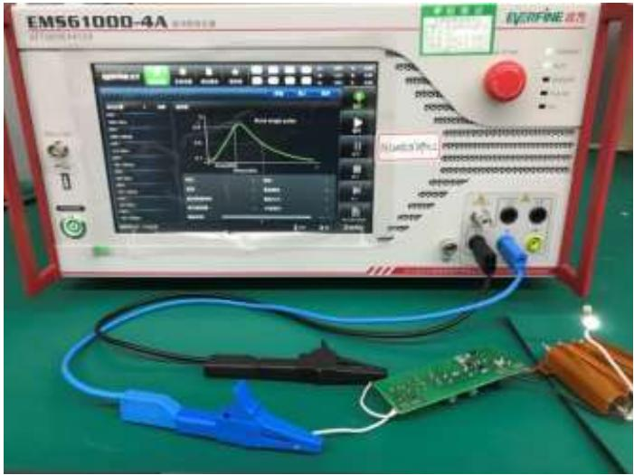

## THANK YOU FOR WATCHING
