## BP84147 调试小结

BRUCE

上海晶丰明源半导体股份有限公司

中山办-

'BPS

晶丰明源

## 问题小结

## 一：输出调压协议误触发。

现版本带调压协议，FB过零时间在全工况下变化较大，或者接近TH下限值，容易误触发调压协议。

## 二：温升曲线抖动。

现版本上电之初驱动能力只开启了17%，之后会慢慢恢复100%驱动能力。优点：EMI好过。缺点：测试温升曲线上升过程中有几段时间会忽然降低，客户体验度不好，会怀疑IC工作不稳定。

## 三：输出二极管开路保护。

尖峰震荡需要小于2US，空载最小消磁时间需要大于4US，否则有误触发开路保护风险。

（以上三个问题在新增版本中都会解决，解决办法为去除这3个功能。

BPS

晶丰明源

## 问题解析：输出调压协议误触发

原因分析：BP84147原本为快充IC，通过FB的波形检测来实现协议通讯，现在副边使用肖特基二极管，RCD使用慢管，有概率误触发协议指令。导致输出电压改变。解决办法：会增加一个不带协议的版本，供其他应用环境使用。

现有版本解决办法：FB从800MV下降到100MV时间调试到250NS左右（220-280NS） RCD用ES2J。

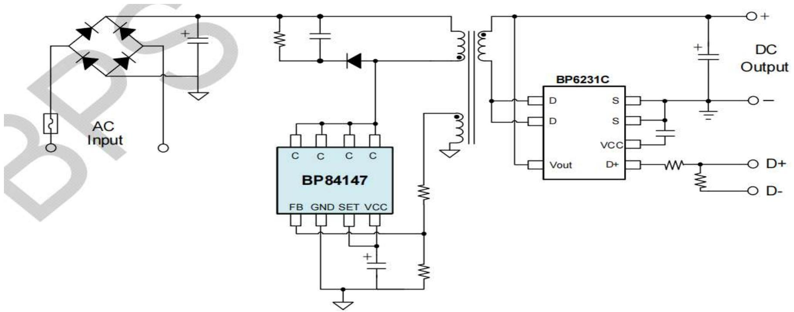

图1.BP84147典型应用电路

## 问题解析：输出调压协议误触发（协议触发条件 ）

斜率检测（一）逻辑框图  
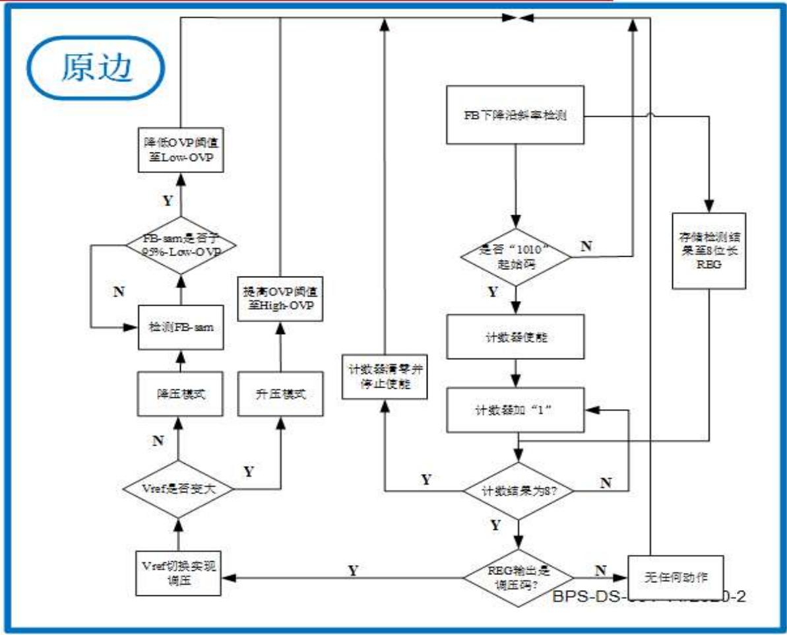

1.每个开关周期都会进行FB斜率检测，有负电流会检测为“1”，反之为“0”，每一次检测结果都会送入移位寄存器。

2.当检测到“1010”判断为收到起始码，使能计数器。每计8位再进行一次判断8位寄存器是否为调压码，如果不是则清空计数器开始新一轮循环。  
3.检测为升压码则先切高压OVP再切Vref。检测为降压码则先切Vref，直到Vout低于95%的低压OVP再把此时的高压OVP切到低压OVP。

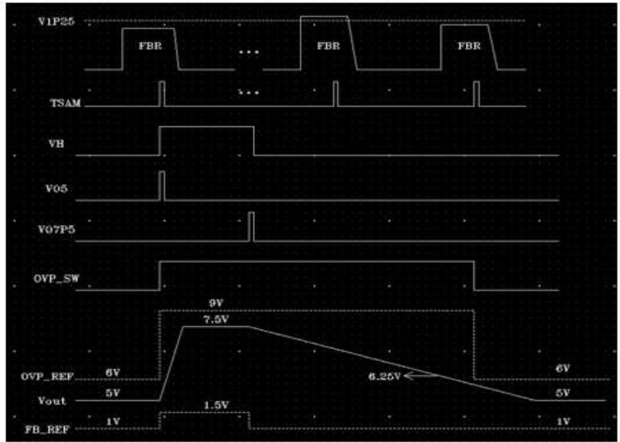

此图意思是每个周期检测FB，有负电流为“1”，反之为0。当“1”“0”组合达到调压检测条件，则调整输出电压值。

## 问题解析：输出调压协议误触发（协议触发条件）

斜率检测（二）定时与校准  
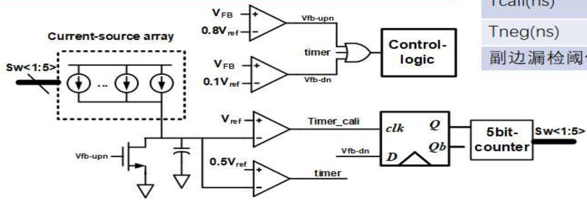

1.FB下降时，小于0.8Vref信号Vfb-upn置0。小于0.1Vref信号Vfb-dn置0。Timer信号比“Vfb-dn置o要晚，便“或运算出“1”，代表Vfb-dn过早，判断FB斜率过大，有负电流，反之运算出0”。  
2.运算出“0时没有负电流，使能校准，Timer-cali信号会校准到FB从0.8Vref下降到o.1Vref的时间。利用Timer-cali去采样Vfb-dn”，采样结果为1或0分别代表“超前或“滞后”，调节可逆计数器输出去控制电流源阵列，稳态时将循环加减1操作，然后取一半为Timer信号，作为时间判断的阈值。  
3.运算的结果会送入8位REG，内置码判断进行后续的OVP和Vref切换操作 BPS-DS-001-14/2020-2

<table><tr><td>Tres=280nsTneg=100ns</td><td>SS-40</td><td>TT27</td><td>FF125</td></tr><tr><td>Tcali(ns)</td><td>220~590</td><td>160~420</td><td>120~300</td></tr><tr><td>Tneg(ns)</td><td>140</td><td>100</td><td>70</td></tr><tr><td>副边漏检阈值(ns)</td><td>140±10%</td><td>140±10%</td><td>140±10%</td></tr></table>

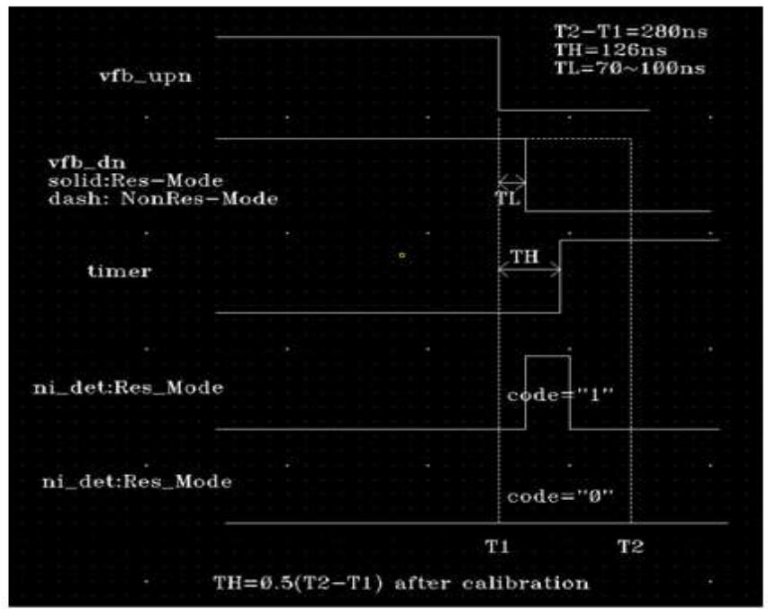

此图解释了FB检测判断的具体标椎，检测FB过零时间（即FB从800MV降到100MV的时间）小于TH则为“1”，大于TH则为0。FB过零时间在任何状态下接近TH，就容易同事存在“1”和“0”，有机会误触发调压协议。TH也是变动的，跟FB过零时间，不同温度下Tcali取值限制有关。

问题解析：输出调压协议误触发  
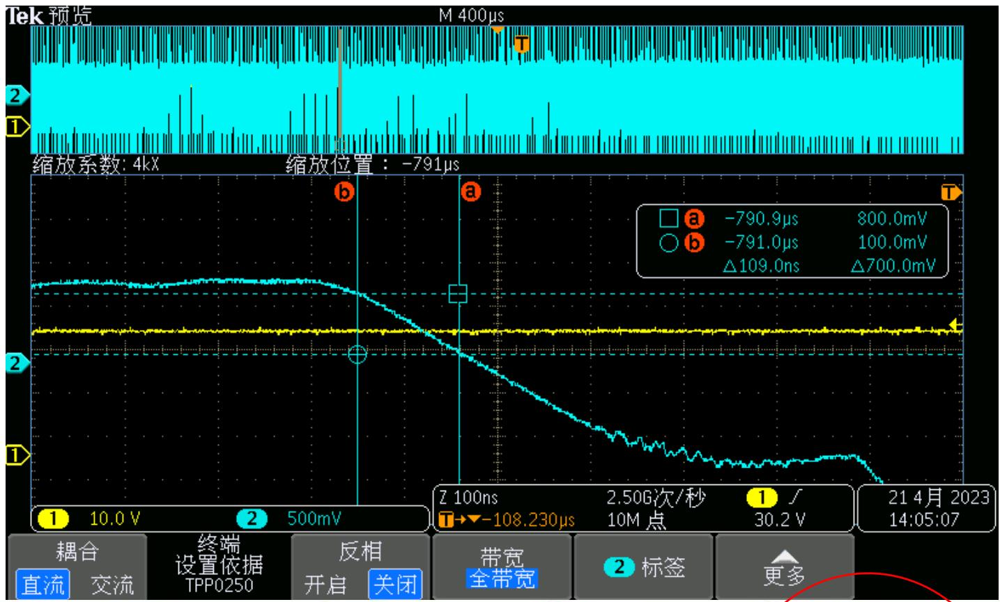

<table><tr><td>Tres=280nsTneg=100ns</td><td>SS-40</td><td>TT27</td><td>FF125</td></tr><tr><td>Tcali(ns)</td><td>220~590</td><td>160~420</td><td>120~300</td></tr><tr><td>Tneg(ns)</td><td>140</td><td>100</td><td>70</td></tr><tr><td>副边漏检阈值(ns)</td><td>140±10%</td><td>140±10%</td><td>140±10%</td></tr></table>

图片为升压误触发时的FB波形使用高温会饱和变压器，高温下FB过零时间降低

此情况发生在温度超过芯片125度之后，此时的TH时间最小值为70NS左右，由于检测有20-30NS的延迟，探头也有一定的影响。在示波器测试到110NS左右，大概率触发升压协议。

问题解析：输出调压协议误触发  
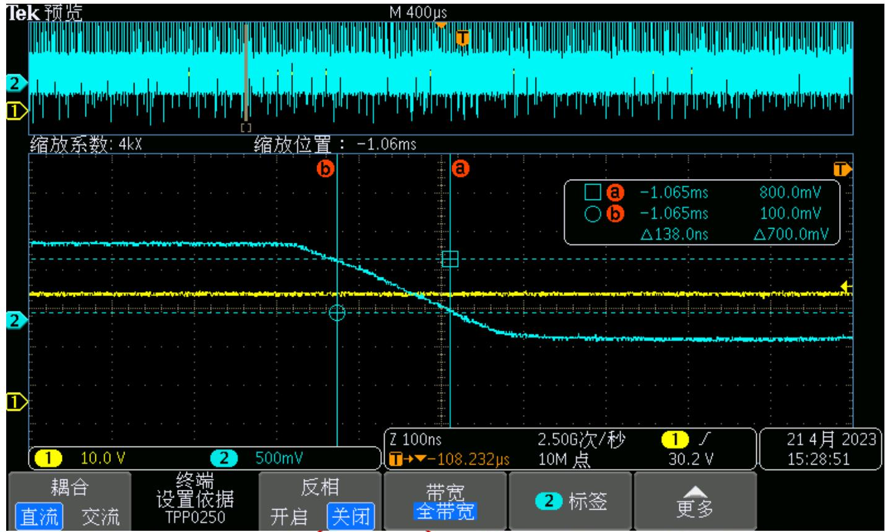

<table><tr><td>Tres=280ns
Tneg=100ns</td><td>SS-40</td><td>TT27</td><td>FF125</td></tr><tr><td>Tcali(ns)</td><td>220~590</td><td>160~420</td><td>120~300</td></tr><tr><td>Tneg(ns)</td><td>140</td><td>100</td><td>70</td></tr><tr><td>副边漏检阈值(ns)</td><td>140±10%</td><td>140±10%</td><td>140±10%</td></tr></table>

图片为升压误触发时的FB波形使用高温会饱和变压器，高温下FB过零时间降低

此情况发生在温度上升过程中，比较快就会出现，此时的TH检测值在140NS左右，而FB测试实际值也是140NS左右，有概率触发升压协议。

## 问题解析：输出调压协议误触发

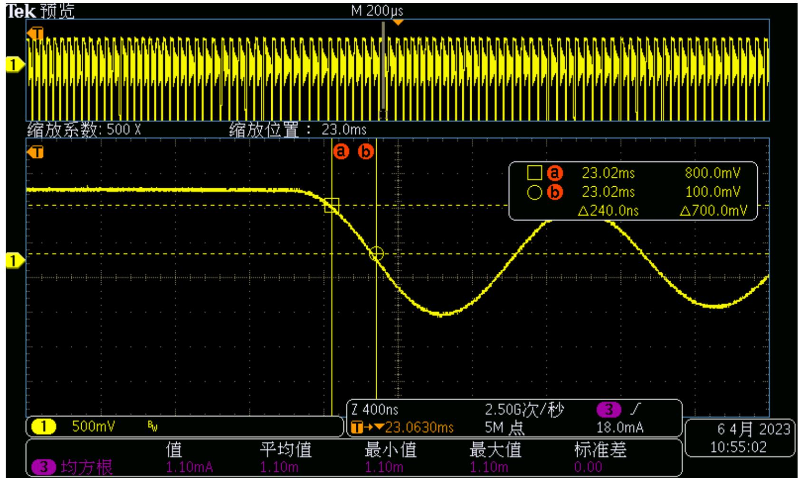

更换不饱和变压器，FB加下拉电容22P，测试FB过零时间240NS。常温，高温测试均不出现升压现象。

## 原边吸收慢管(S2M)FB波形

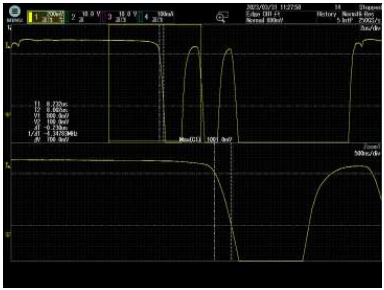

有后级电路：MCULDO  
➢ 满载：0.85A  
➢ FB：08V\~0.1V下降沿  
FB：230nS

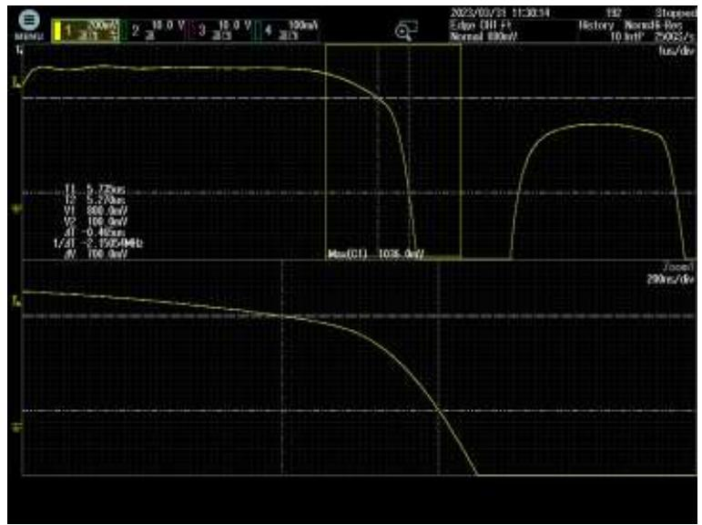

有后级电路：MCULDO  
➢ 空载：1W  
➢ FB：08V\~0.1V下降沿  
FB：465nS

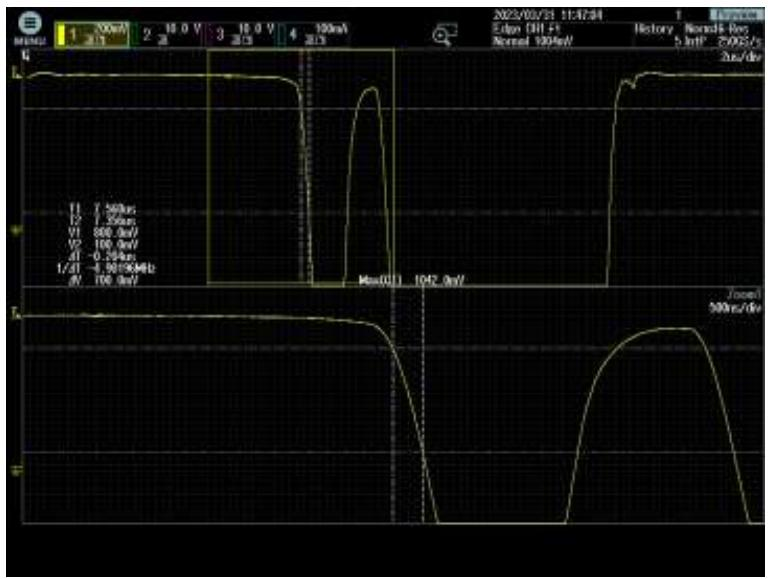

➢ 断开后级：MCULDO  
➢ 满载：0.85A  
➢ FB：08V\~0.1V下降沿  
FB：200nS

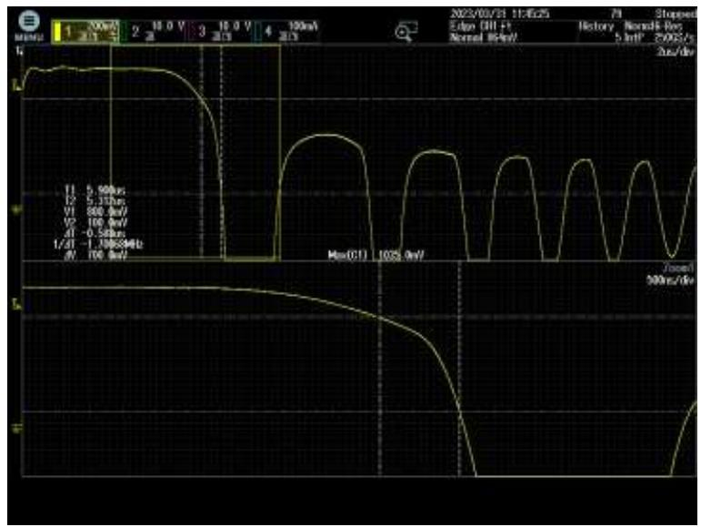

➢ 断开后级：MCULDO  
➢ 空载：0.3W  
➢ FB：08V\~0.1V下降沿  
FB：600nS

## 原边吸收快管FB波形

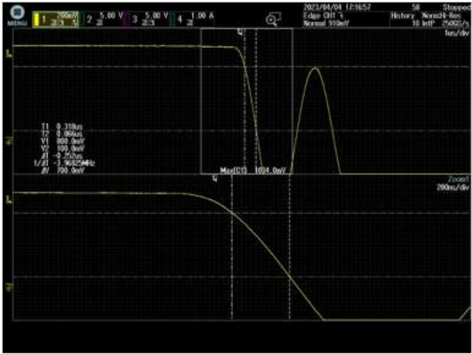

有后级电路：MCULDO  
满载：0.85A  
FB:0.8V\~0.1V下 降沿  
快管：RS1D  
FB:250nS

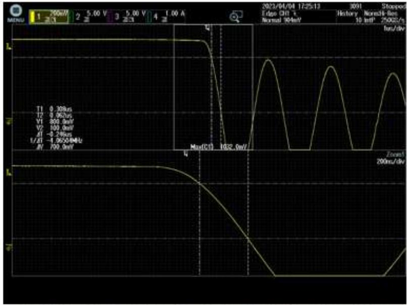

有后级电路：MCLDO  
》空载：1W  
FB：0.8V\~0.1V下降沿  
快管：RS1D  
FB:246nS

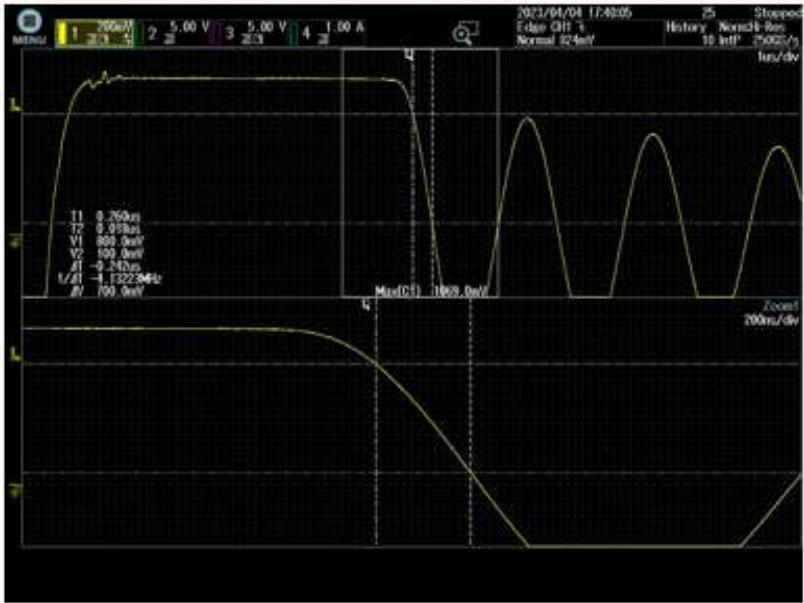

断开后级：MCULDO  
满载：0.85A  
FB:08V-0.1V下 降沿  
快管：ES1J  
FB:240nS

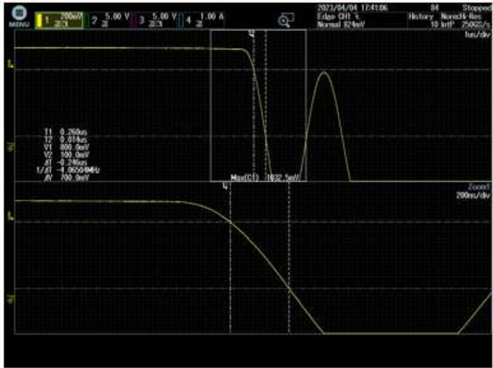

断开后级：MCULDO  
空载：0.3W  
FB:0.8V\~0.1V下 降沿  
快管：ES1J  
FB:246nS

## 问题解析：温升曲线抖动。

原因分析：现版本上电之初驱动能力只开启了17%，之后会慢慢恢复100%驱动能力。优点：EMI好过。缺点：测试温升曲线上升过程中有段时间会忽然降低，客户体验度不好，会怀疑IC工作不稳定。并且过程中有温度飘高的时候。

解决办法：新的版本会去除这个设计。

芯
片
温
度
曲
线  
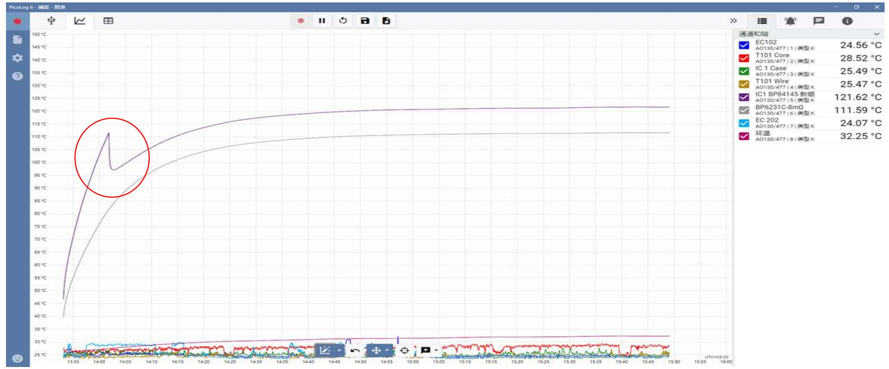

## 问题解析：输出二极管开路保护

原因分析：原来版本有输出二极管开路保护功能，优点是二极管开路不会炸机，缺点是变压器漏感大，尖峰震荡大于2US，或者空载消磁时间小于4US，会误触发保护，导致启动异常。

解决办法：新增版本直接去除了此功能，注意输出二极管开路会炸机。

## 输出二极管开路保护

启动时前4个工作周期，检测到退磁时间小于Tdeg\_min，则触发输出二极管开路保护状态，芯片停止工作。

## 问题解析：输出二极管开路保护

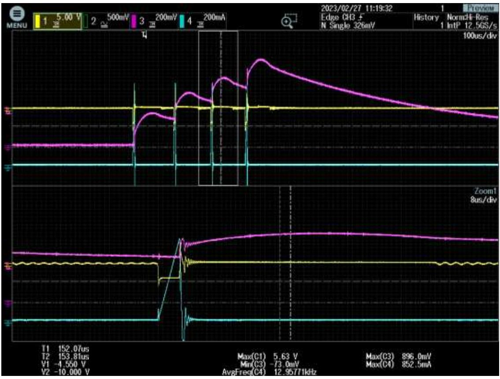

电子负载：不启机

CH1:FB

CH3:VO

CH4:IPK

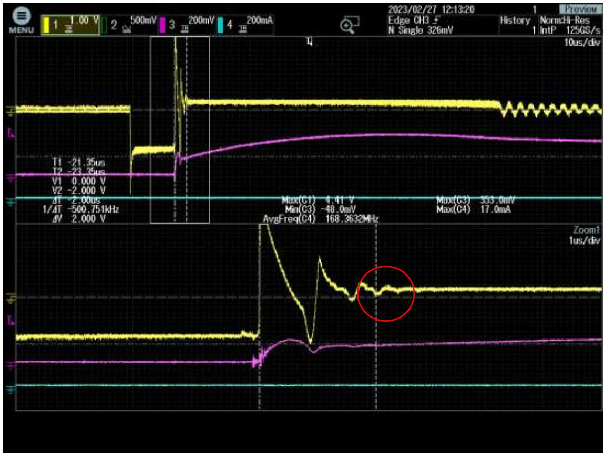

误触发保护：2us以后的2us检测到电压过零，就触发到保护（变压器漏感过大导致的震荡时间过长）

上海市浦东新区申江路5005弄星创科技广场3号楼9层

+86-21-51870166

sales@bpsemi.com

www.bpsemi.com

  
微信公众号

  
微信视频号
