## BP85075C\_Buck方案参考设计

## (18V/250mA,5V100mA)

时间：2024年7月

## 目录

BP85075C  
电源规格  
原理图  
PCB Layout/  
BOM  
性能测试数据  
重要声明

## BP85075C

集成高压启动和自供电电路  
集成开关电源控制器和电荷泵转换器  
集成650V功率管  
固定18V输出和5V输出  
减小音频噪声的降幅调制技术  
改善EMI性能的频率调制技术  
内置软启动功能  
丰富的保护功能

输出短路保护(SCP)、输出过载保护(OLP)、逐周期限流(Cycle-by-Cycle)、迟滞过温保护(OTP)

应用领域：

小家电辅助电源  
电机驱动辅助电源

典型应用电路

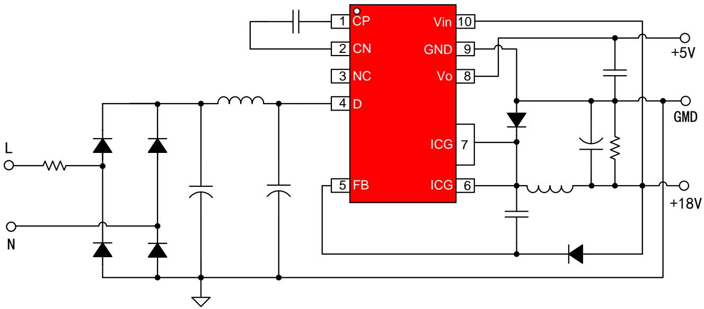

管脚图

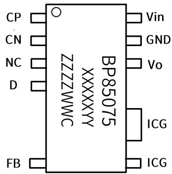

电源规格

<table><tr><td>项目描述</td><td>符号</td><td>最小</td><td>典型</td><td>最大</td><td>单位</td><td>备注</td></tr><tr><td colspan="7">输入</td></tr><tr><td>电压</td><td> $V_{IN}$ </td><td>85</td><td></td><td>265</td><td> $V_{AC}$ </td><td></td></tr><tr><td>频率</td><td> $f_{LINE}$ </td><td>47</td><td>50/60</td><td>63</td><td>Hz</td><td></td></tr><tr><td colspan="7">输出</td></tr><tr><td>输出电压</td><td> $V_{OUT\_12V}$ </td><td>11.4</td><td>12</td><td>12.6</td><td>V</td><td>±5%</td></tr><tr><td>输出电压</td><td> $V_{OUT\_5V}$ </td><td>4.75</td><td>5</td><td>5.25</td><td>V</td><td>±5%</td></tr><tr><td>输出电流</td><td> $I_{OUT\_12V}$ </td><td></td><td></td><td>250</td><td>mA</td><td></td></tr><tr><td>输出电流</td><td> $I_{OUT\_5V}$ </td><td></td><td></td><td>150</td><td>mA</td><td></td></tr><tr><td>输出电压纹波</td><td> $V_{OUT\_5V}$ </td><td></td><td></td><td>158.3</td><td>mV</td><td>稳态,20MHz带宽</td></tr><tr><td>连续输出功率</td><td> $P_{OUT}$ </td><td></td><td></td><td>5</td><td>W</td><td></td></tr><tr><td colspan="7">效率</td></tr><tr><td>待机功耗</td><td> $P_{STDBY}$ </td><td></td><td>80.26</td><td></td><td>mW</td><td>Vin=230VAC</td></tr><tr><td>满载效率</td><td>η</td><td></td><td>76.11</td><td></td><td>%</td><td>Vin=230VAC</td></tr><tr><td colspan="7">环境</td></tr><tr><td>传导EMI</td><td></td><td colspan="4">满足EN55022 Class B</td><td></td></tr><tr><td>Surge</td><td></td><td></td><td></td><td>2.0</td><td>kV</td><td></td></tr><tr><td>EFT</td><td></td><td></td><td></td><td>4</td><td>KV</td><td></td></tr><tr><td>ESD</td><td></td><td></td><td></td><td>12</td><td>KV</td><td>空气放电</td></tr><tr><td>工作环境温度</td><td> $T_{AMP}$ </td><td></td><td>25</td><td></td><td>°C</td><td></td></tr></table>

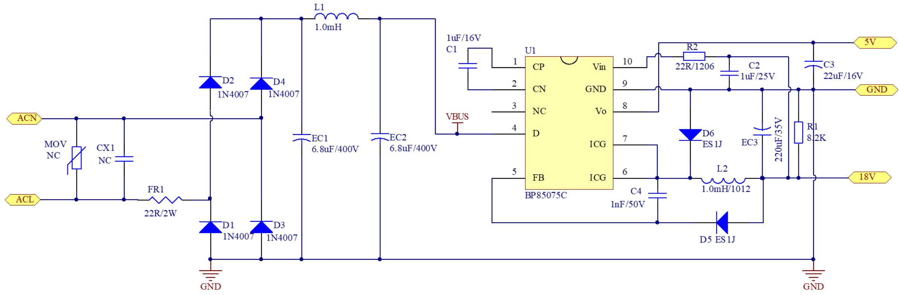

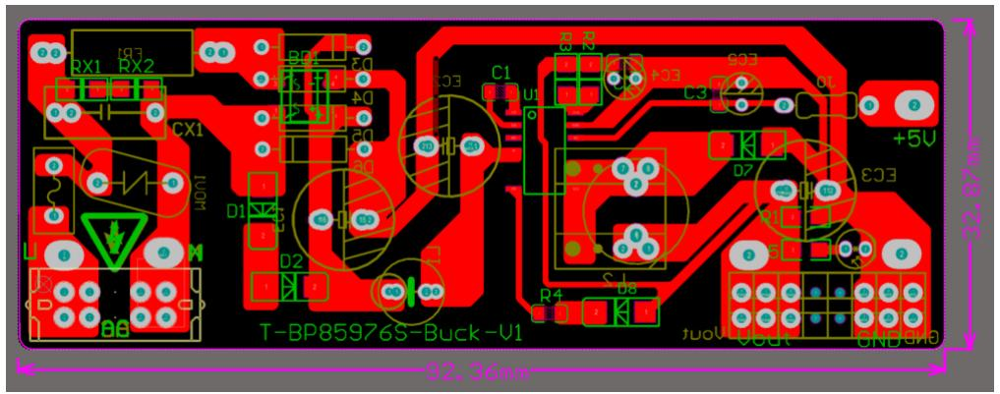

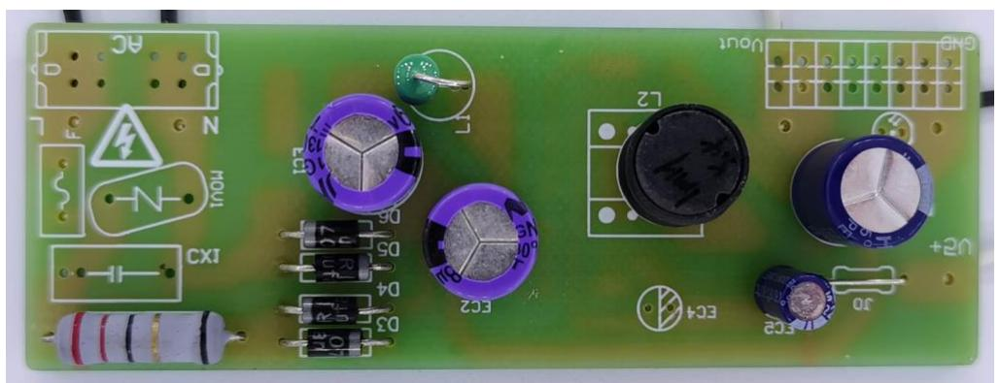

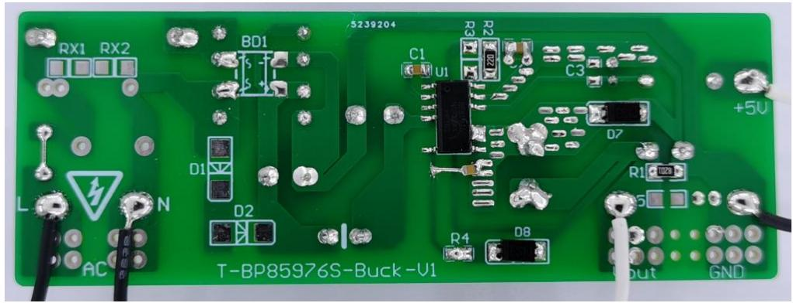

<table><tr><td>序号</td><td>原件标号</td><td>参数</td><td>描述</td><td>数量</td></tr><tr><td>1</td><td>D1-D4</td><td>1N4007-1A/1KV</td><td>DIP</td><td>4</td></tr><tr><td>2</td><td>FR1</td><td>绕线电阻-22R/2W</td><td>DIP</td><td>1</td></tr><tr><td>3</td><td>L1</td><td>色环电感-1mH</td><td>0510</td><td>1</td></tr><tr><td>4</td><td>L2</td><td>1mH-10*12</td><td>工字电感</td><td>1</td></tr><tr><td>5</td><td>D5/D6</td><td>ES1J-1A/600V</td><td>SMA</td><td>2</td></tr><tr><td>4</td><td>EC1/EC2</td><td>6.8uF/400V</td><td>电解电容</td><td>2</td></tr><tr><td>5</td><td>EC3</td><td>220uF/25V</td><td>电解电容</td><td>1</td></tr><tr><td>6</td><td>C2</td><td>贴片电容-1uF/25V</td><td>SMD0805</td><td>1</td></tr><tr><td>7</td><td>C3</td><td>22uF/16V</td><td>电解电容</td><td>1</td></tr><tr><td>8</td><td>C4</td><td>贴片电容-1nF/50V</td><td>SMD0805</td><td>1</td></tr><tr><td>9</td><td>R1</td><td>8.2K,±5%</td><td>SMD0805</td><td>1</td></tr><tr><td>10</td><td>R2</td><td>22R,±5%</td><td>SMD1206</td><td>1</td></tr><tr><td>11</td><td>U1</td><td>BP85075C</td><td>BPSOP10</td><td>1</td></tr><tr><td>总计</td><td></td><td></td><td></td><td>18</td></tr></table>

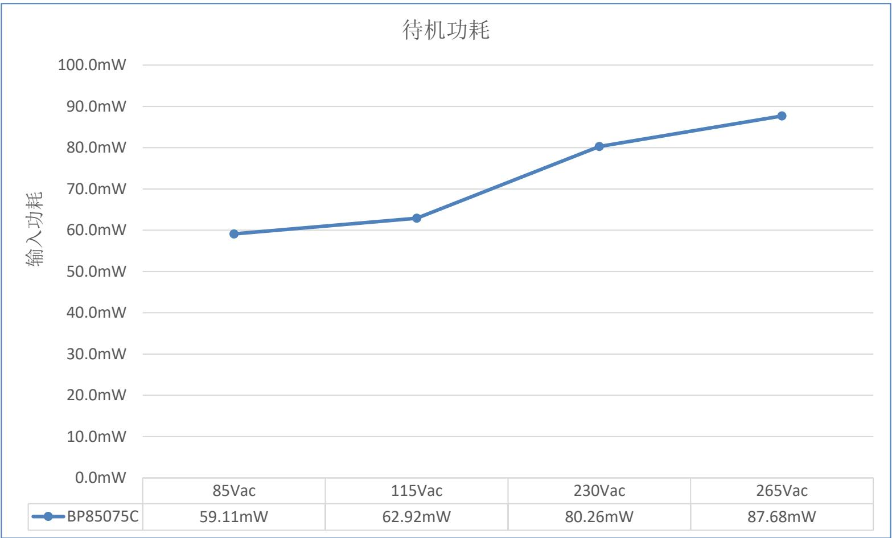

118V输出假负载8.2k，5V输出无假负载。

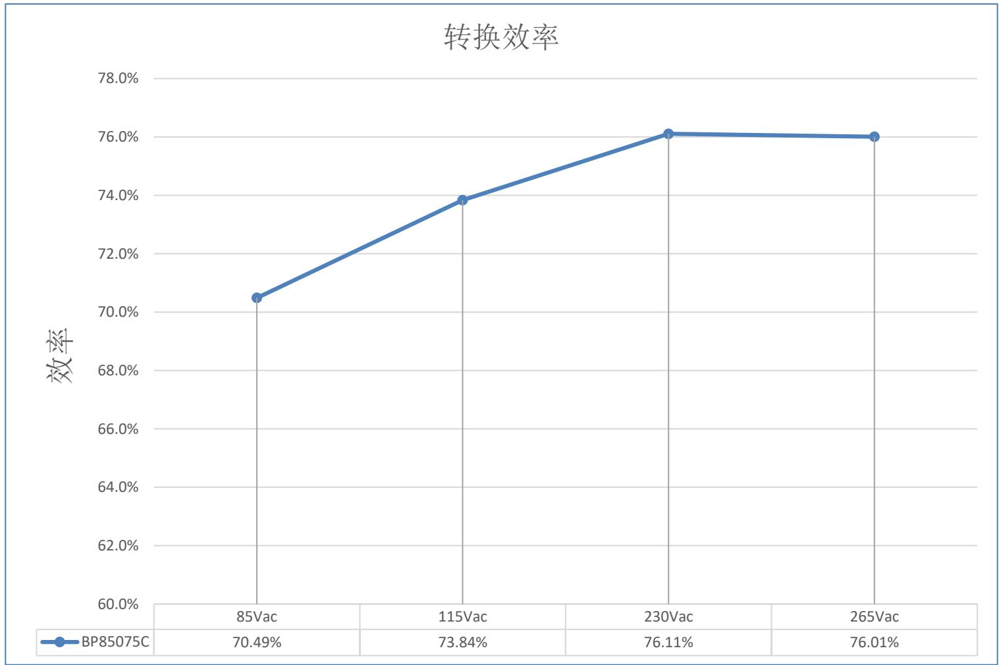

输出电压调整率

<table><tr><td colspan="2">IOUT(mA)\VIN(Vac)</td><td colspan="2">85Vac</td><td colspan="2">115Vac</td><td colspan="2">230Vac</td><td colspan="2">265Vac</td><td colspan="2">线调整率</td></tr><tr><td>5V输出带载</td><td>18V输出带载</td><td>5V输出</td><td>18V输出</td><td>5V输出</td><td>18V输出</td><td>5V输出</td><td>18V输出</td><td>5V输出</td><td>18V输出</td><td>5V输出</td><td>18V输出</td></tr><tr><td>0mA</td><td>0mA</td><td>5.033</td><td>18.033</td><td>5.024</td><td>18.021</td><td>5.036</td><td>17.988</td><td>5.036</td><td>17.981</td><td>0.24%</td><td>0.29%</td></tr><tr><td>100mA</td><td>250mA</td><td>4.940</td><td>17.450</td><td>4.940</td><td>17.458</td><td>4.940</td><td>17.386</td><td>4.940</td><td>17.391</td><td>0.00%</td><td>0.41%</td></tr><tr><td>0mA</td><td>250mA</td><td>5.030</td><td>17.454</td><td>5.023</td><td>17.464</td><td>5.036</td><td>17.421</td><td>5.036</td><td>17.419</td><td>0.26%</td><td>0.26%</td></tr><tr><td>100mA</td><td>0mA</td><td>4.941</td><td>17.788</td><td>4.941</td><td>17.764</td><td>4.940</td><td>17.739</td><td>4.941</td><td>17.740</td><td>0.02%</td><td>0.28%</td></tr><tr><td colspan="2">负载调整率</td><td>1.87%</td><td>3.30%</td><td>1.69%</td><td>3.18%</td><td>1.92%</td><td>3.41%</td><td>1.92%</td><td>3.35%</td><td colspan="2"></td></tr></table>

■调整率计算方法：调整率=100%\*(最大值-最小值)/平均值;

<table><tr><td colspan="5">系统最大带载能力(固定5V输出带载100mA)</td></tr><tr><td>芯片</td><td>85Vac</td><td>115Vac</td><td>230Vac</td><td>265Vac</td></tr><tr><td>BP85075C</td><td>4.95/100mA17.27V/340mA</td><td>4.95/100mA17.07V/340mA</td><td>4.95/100mA17.24V/340mA</td><td>4.95/100mA17.35V/340mA</td></tr></table>

■测试方法：固定5V输出带载100mA，调节18V输出带载能力;

5V输出最大带载能力（输入电压230Vac，18V固定带载250mA）

<table><tr><td>芯片编号</td><td>#2号</td><td>#3号</td><td>#4号</td></tr><tr><td>5V输出最大带载</td><td>4.91V/150mA</td><td>4.91V/150mA</td><td>4.93V/150mA</td></tr></table>

■测试方法：固定18V输出带载250mA，调节5V输出带载能力;

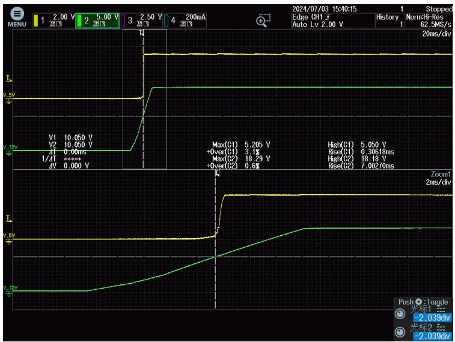

## 85VAC

CH1 Vout\_5V  
CH2 Vout\_18V Trise\_5V=0.31ms Trise\_18V= 7.00ms

## Test Condition:

》 lout\_5V=0mA  
》 lout\_18V=0mA

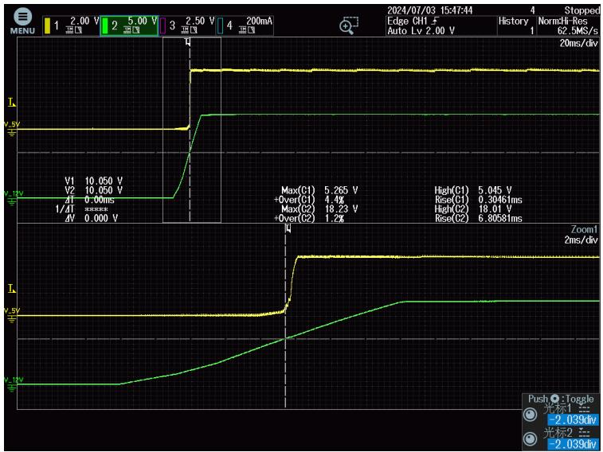

## 230VAC

CH1 Vout\_5V  
CH2 Vout\_18V Trise\_5V= 0.30ms Trise\_18V= 6.81ms

## Test Condition:

》 lout\_5V=0mA  
》 lout\_18V=0mA

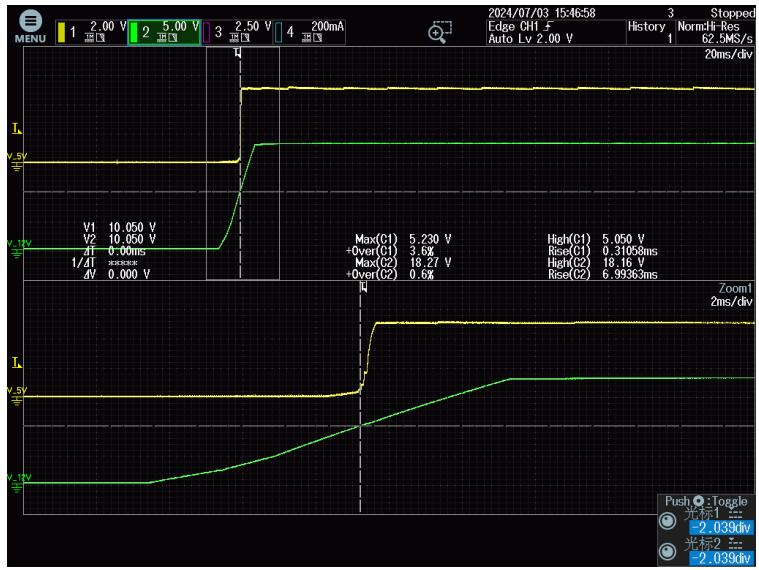

## 115VAC

CH1 Vout\_5V  
CH2 Vout\_18V Trise\_5V= 0.31ms Trise\_18V=3.99ms

## Test Condition:

》 lout\_5V=0mA  
》 lout\_18V=0mA

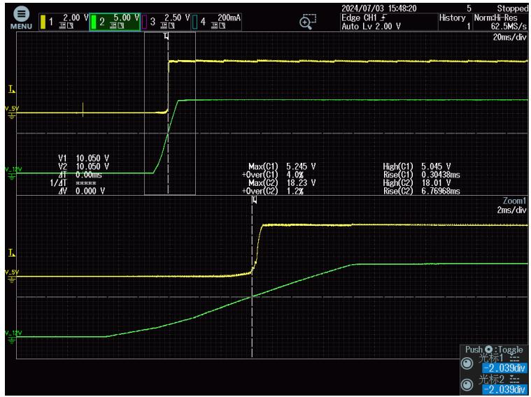

## 265VAC

CH1 Vout\_5V  
CH2 Vout\_18VTrise\_5V=0.30msTrise\_18V= 6.77ms

## Test Condition:

》 lout\_5V=0mA  
》 lout\_18V=0mA

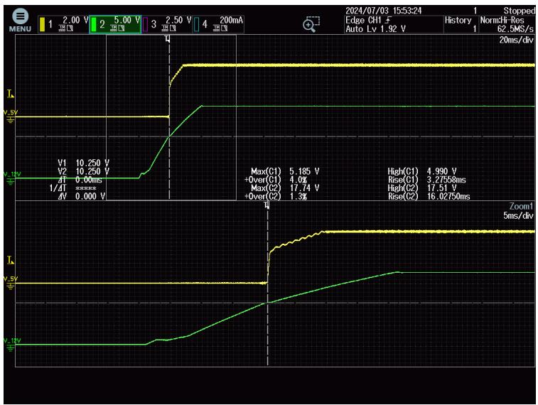

## 85VAC

CH1 Vout\_5V  
CH2 Vout\_18V  
Trise\_5V=3.28ms  
Trise\_18V=16.03ms

## Test Condition:

》 lout\_5V=100mA  
》 lout\_18V=250mA

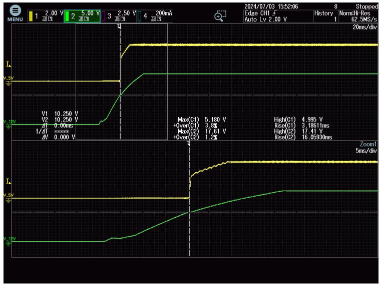

## 115VAC

CH1 Vout\_5V  
CH2 Vout\_18V  
Trise\_5V=3.19ms  
Trise\_18V= 16.06ms

## Test Condition:

》 lout\_5V=100mA  
》 lout\_18V=250mA

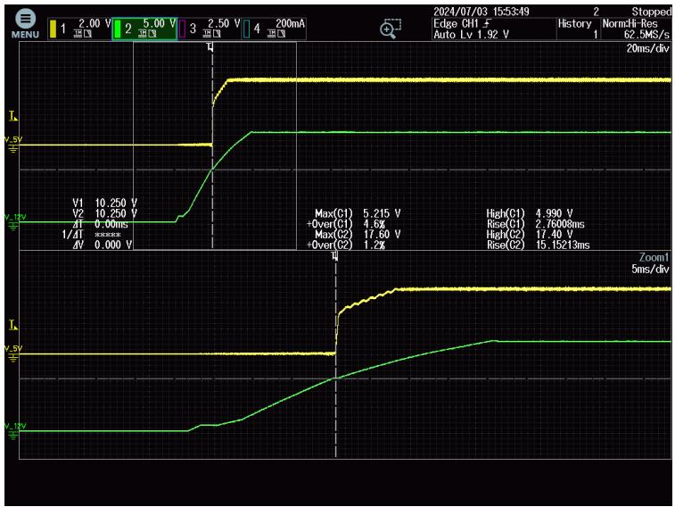

## 230VAC

CH1 Vout\_5V  
CH2 Vout\_18V  
Trise\_5V=2.76ms  
Trise\_18V=15.15ms

## Test Condition:

》 lout\_5V=100mA  
》 lout\_18V=250mA

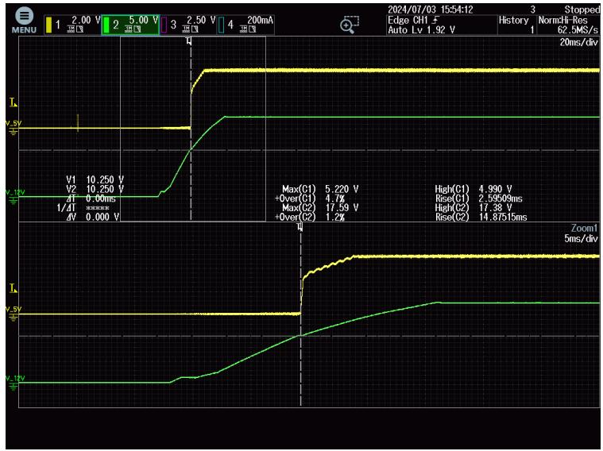

## 265VAC

CH1 Vout\_5V  
CH2 Vout\_18V  
Trise\_5V=2.60ms  
Trise\_18V=14.88ms

## Test Condition:

》 lout\_5V=100mA  
》 lout\_18V=250mA

5V 18V  
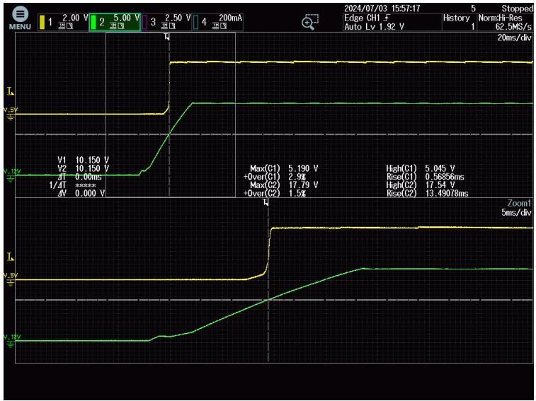

## 85VAC

CH1 Vout\_5V  
CH2 Vout\_18V  
Trise\_5V=0.57ms  
Trise\_18V= 13.49ms

## Test Condition:

》 lout\_5V=0mA  
》 lout\_18V=250mA

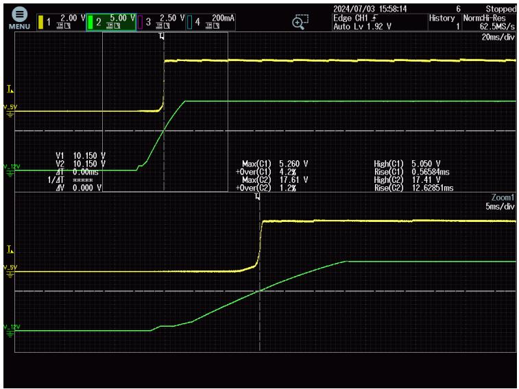

## 265VAC

CH1 Vout\_5V  
CH2 Vout\_18V  
Trise\_5V= 0.57ms  
Trise\_18V=12.63ms

## Test Condition:

》 lout\_5V=0mA  
》 lout\_18V=250mA

5V 18V  
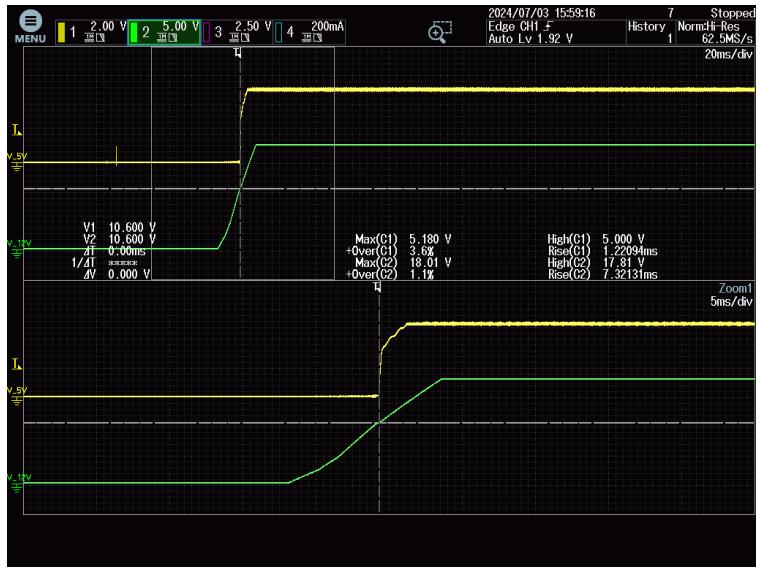

## 85VAC

CH1 Vout\_5V  
CH2 Vout\_18V  
Trise\_5V=1.22ms  
Trise\_18V=7.32ms

## Test Condition:

》 lout\_5V=100mA  
》 lout\_18V=0mA

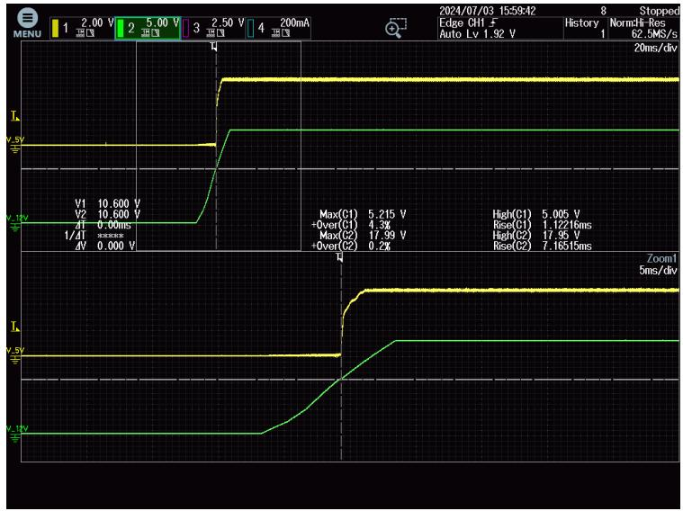

## 265VAC

CH1 Vout\_5V  
CH2 Vout\_18V  
Trise\_5V= 1.12ms  
Trise\_18V=7.17ms

## Test Condition:

》 lout\_5V=100mA  
》 lout\_18V=0mA

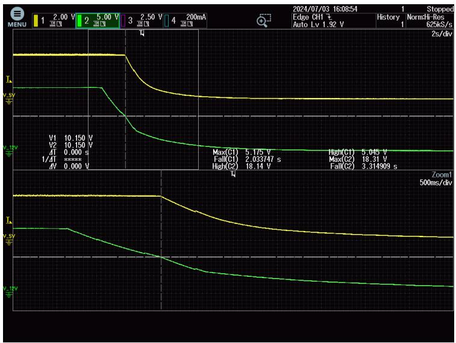

## 85VAC-空载

CH1 Vout\_5V  
CH2 Vout\_18V  
Fall \_5V=2.0s Fall \_18V= 3.3s

## Test Condition:

》 lout\_5V=0mA  
》 lout\_18V=0mA

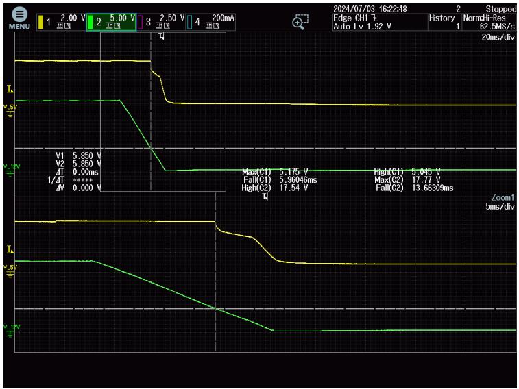

## 85VAC-交叉负载

CH1 Vout\_5V  
CH2 Vout\_18V Fall\_5V=5.96ms Fall\_18V=13.66ms

## Test Condition:

》 lout\_5V=0mA  
》 lout\_18V=250mA

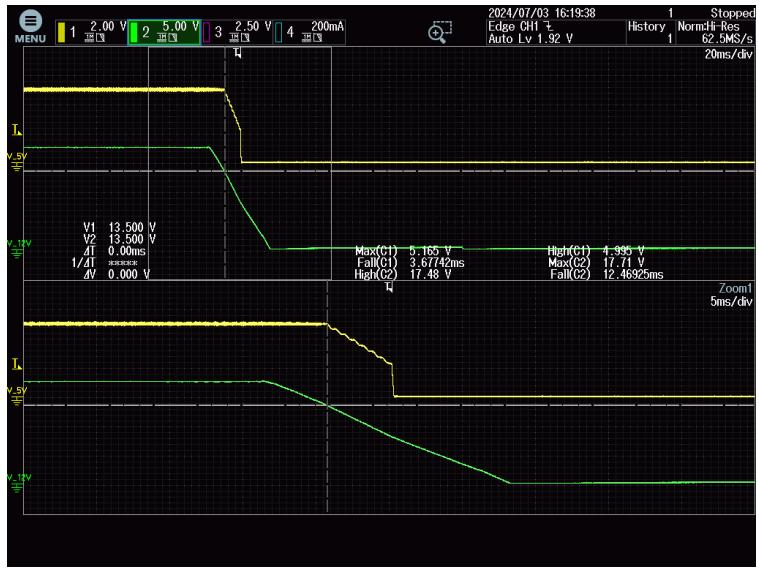

## 85VAC-满载

CH1 Vout\_5V  
CH2 Vout\_18VFall \_5V= 3.67msFall \_18V= 14.47ms

## Test Condition:

》 lout\_5V=100mA  
》 lout\_18V=250mA

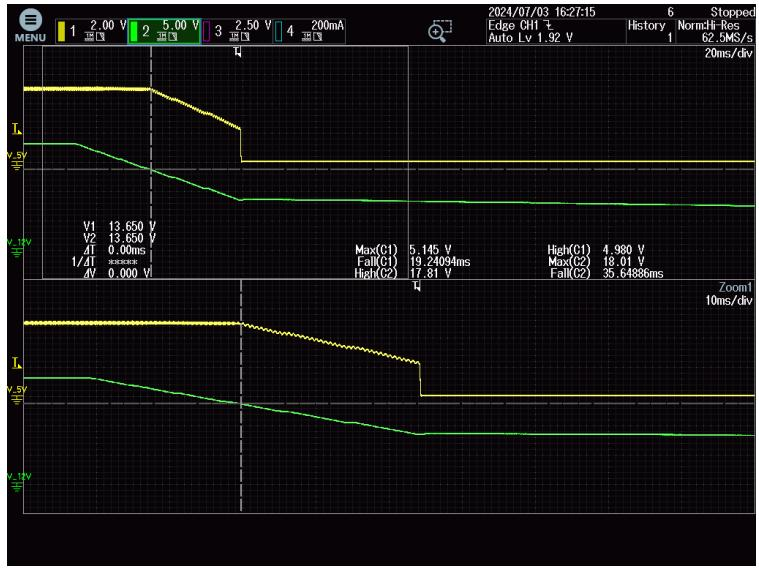

## 85VAC-交叉负载

CH1 Vout\_5V  
CH2 Vout\_18V Fall\_5V=19.24ms Fall\_18V=35.65ms

## Test Condition:

》 lout\_5V=100mA  
》 lout\_18V=0mA

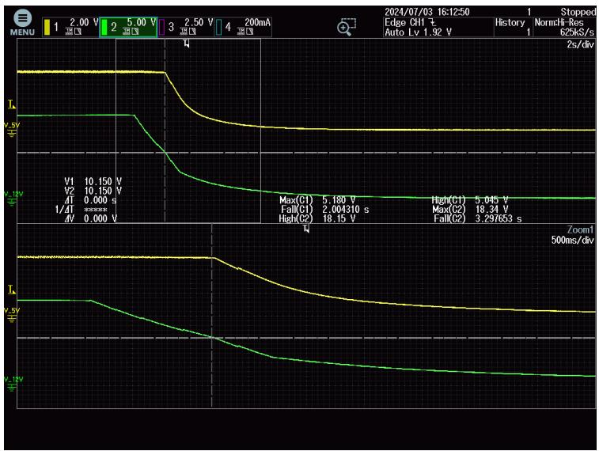

## 265VAC-空载

CH1 Vout\_5V  
CH2 Vout\_18V  
Fall \_5V=2.0s Fall \_18V= 3.3s

## Test Condition:

》 lout\_5V=0mA  
》 lout\_18V=0mA

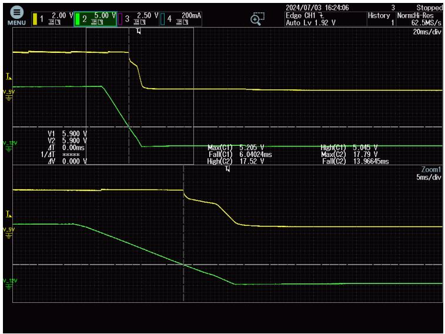

## 265VAC-交叉负载

CH1 Vout\_5V  
CH2 Vout\_18V Fall \_5V= 6.04ms Fall\_18V=14.00ms

## Test Condition:

》 lout\_5V=0mA  
》 lout\_18V=250mA

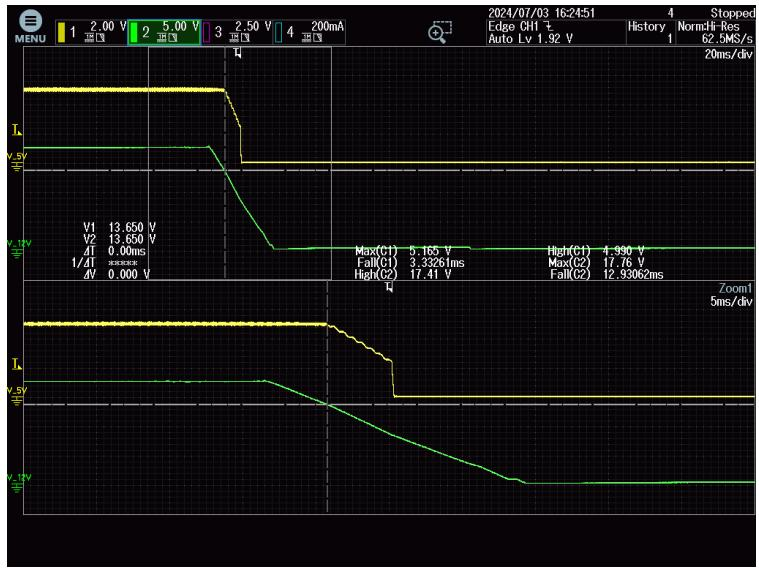

## 265VAC-满载

CH1 Vout\_5V  
CH2 Vout\_18V Fall \_5V= 3.33ms Fall\_18V= 12.93ms

## Test Condition:

》 lout\_5V=100mA  
》 lout\_18V=250mA

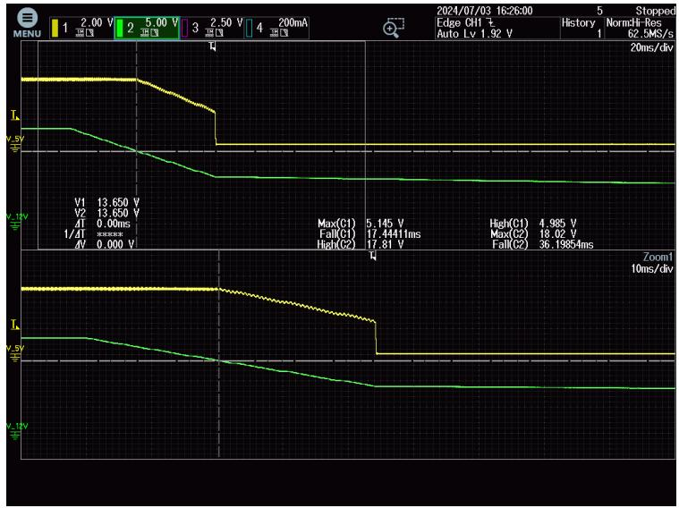

## 265VAC-交叉负载

CH1 Vout\_5V  
CH2 Vout\_18V Fall \_5V= 17.44ms Fall\_18V=36.20ms

## Test Condition:

》 lout\_5V=100mA  
》 lout\_18V=0mA

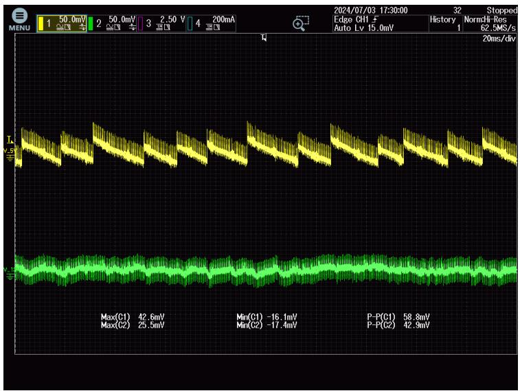

## 85VAC

CH1 Vout\_5V  
CH2 Vout\_18V

$$
V _ {P K - P K \_ 5 V} = 5 8. 8 m V
$$

$$
V _ {P K - P K \_ 1 8 V} = 4 2. 9 m V
$$

## Test Condition:

》 lout\_5V=0mA  
》 lout\_18V=0mA

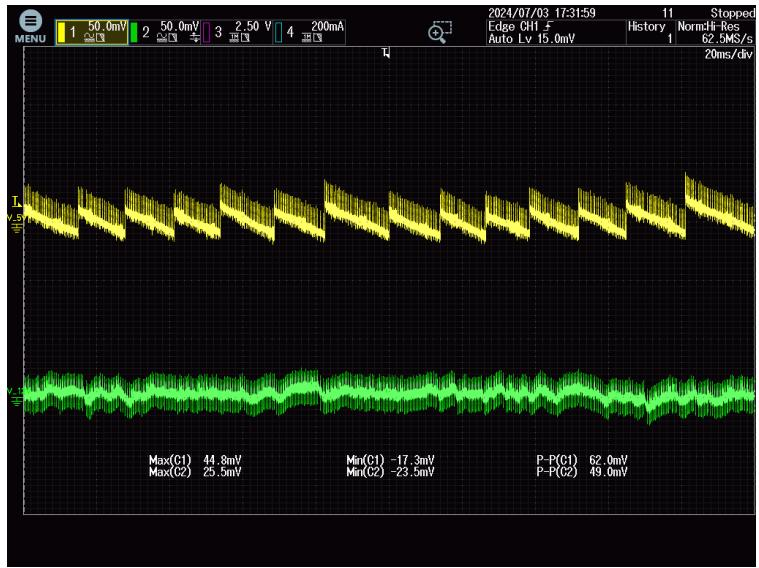

## 115VAC

CH1 Vout\_5V  
CH2 Vout\_18V

$$
V _ {P K - P K 5 V} = 6 2. 0 m V
$$

$$
V _ {P K - P K \_ 1 8 V} = 4 9. 0 m V
$$

## Test Condition:

》 lout\_5V=0mA  
》 lout\_18V=0mA

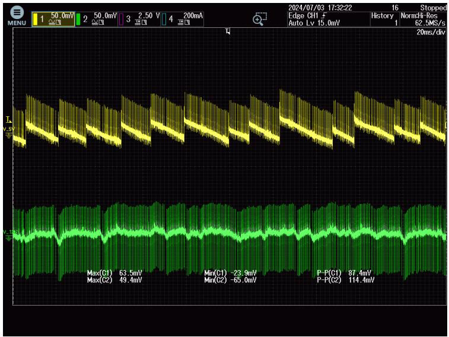

## 230VAC

CH1 Vout\_5V  
CH2 Vout\_18V

$$
V _ {P K - P K \_ 5 V} = 8 7. 4 m V
$$

$$
V _ {P K - P K \_ 1 8 V} = 1 1 4. 4 m V
$$

## Test Condition:

》 lout\_5V=0mA  
》 lout\_18V=0mA

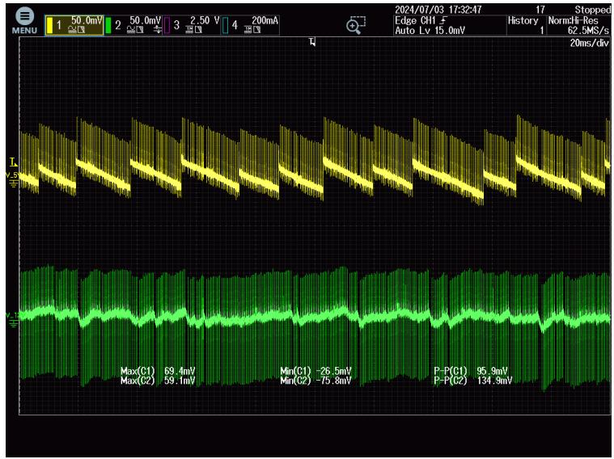

## 265VAC

CH1 Vout\_5V  
CH2 Vout\_18V

$$
V _ {P K - P K \_ 5 V} = 9 5. 9 m V
$$

$$
V _ {P K - P K \_ 1 8 V} = 1 3 4. 9 m V
$$

## Test Condition:

》 lout\_5V=0mA  
》 lout\_18V=0mA

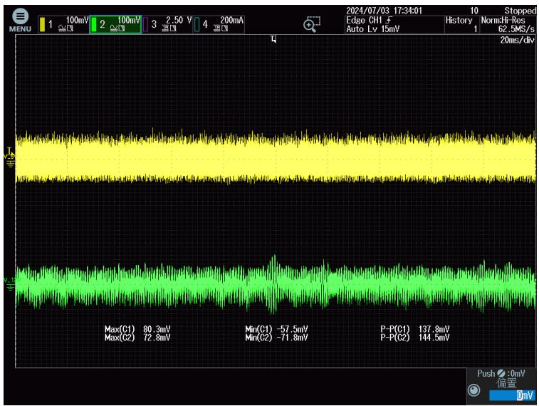

## 85VAC

CH1 Vout\_5V  
CH2 Vout\_18V

$$
\begin{array}{l} V _ {P K - P K \_ 5 V} = 1 3 7. 8 m V \\ V _ {P K - P K \_ 1 8 V} = 1 4 4. 5 m V \\ \end{array}
$$

## Test Condition:

》 lout\_5V=100mA  
》 lout\_18V=250mA

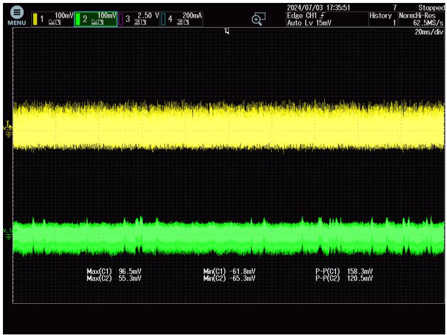

## 230VAC

CH1 Vout\_5V  
CH2 Vout\_18V

$$
V _ {P K - P K \_ 5 V} = 1 5 8. 3 m V
$$

$$
V _ {P K - P K \_ 1 8 V} = 1 2 0. 5 m V
$$

## Test Condition:

》 lout\_5V=100mA  
》 lout\_18V=250mA

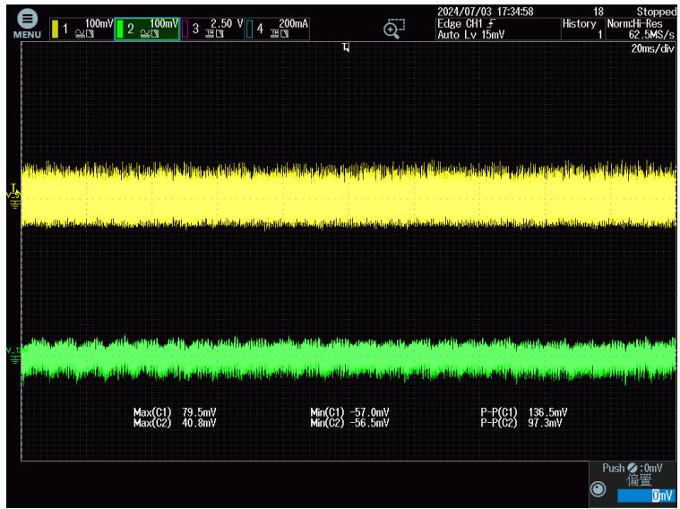

## 115VAC

CH1 Vout\_5V  
CH2 Vout\_18V

$$
\begin{array}{l} V _ {P K - P K \_ 5 V} = 1 3 6. 5 m V \\ V _ {P K - P K \_ 1 8 V} = 9 7. 3 m V \\ \end{array}
$$

## Test Condition:

》 lout\_5V=100mA  
》 lout\_18V=250mA

## 265VAC

CH1 Vout\_5V  
CH2 Vout\_18V

$$
V _ {P K - P K \_ 5 V} = 1 5 8. 3 m V
$$

$$
V _ {P K - P K \_ 1 8 V} = 1 1 4. 0 m V
$$

## Test Condition:

》 lout\_5V=100mA  
》 lout\_18V=250mA

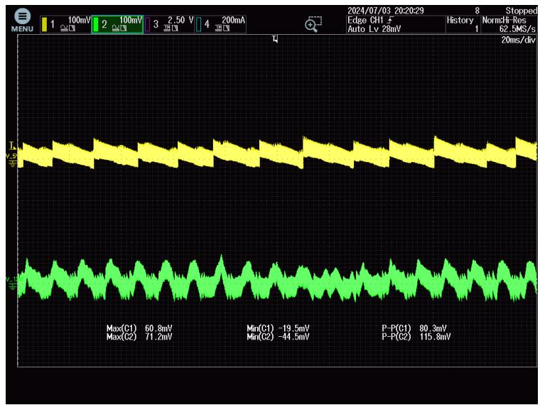

## 85VAC

CH1 Vout\_5V  
CH2 Vout\_18V

$$
\begin{array}{l} V _ {P K - P K \_ 5 V} = 8 0. 3 m V \\ V _ {P K - P K \_ 1 8 V} = 1 1 5. 8 m V \\ \end{array}
$$

## Test Condition:

》 lout\_5V=0mA  
》 lout\_18V=250mA

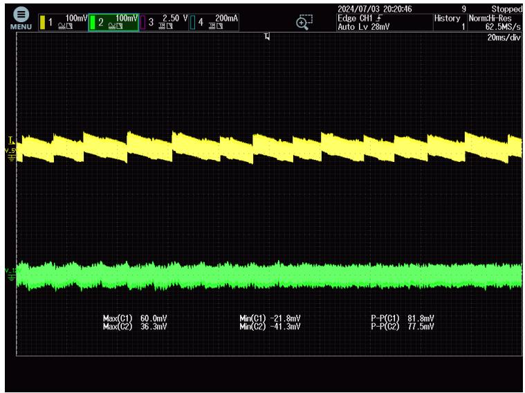

## 115VAC

CH1 Vout\_5V  
CH2 Vout\_18V

$$
V _ {P K - P K \_ 5 V} = 8 1. 8 m V
$$

$$
V _ {P K - P K \_ 1 8 V} = 7 7. 5 m V
$$

## Test Condition:

》 lout\_5V=0mA  
》 lout\_18V=250mA

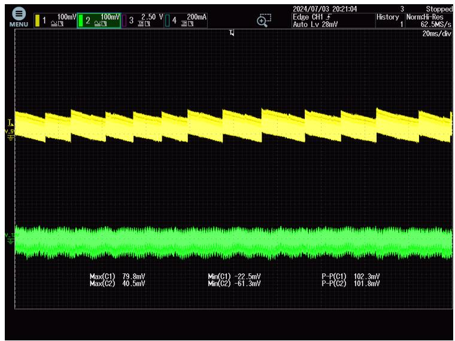

## 230VAC

CH1 Vout\_5V  
CH2 Vout\_18V

$$
V _ {P K - P K \_ 5 V} = 1 0 2. 3 m V
$$

$$
V _ {P K - P K \_ 1 8 V} = 1 0 1. 8 m V
$$

## Test Condition:

》 lout\_5V=0mA  
》 lout\_18V=250mA

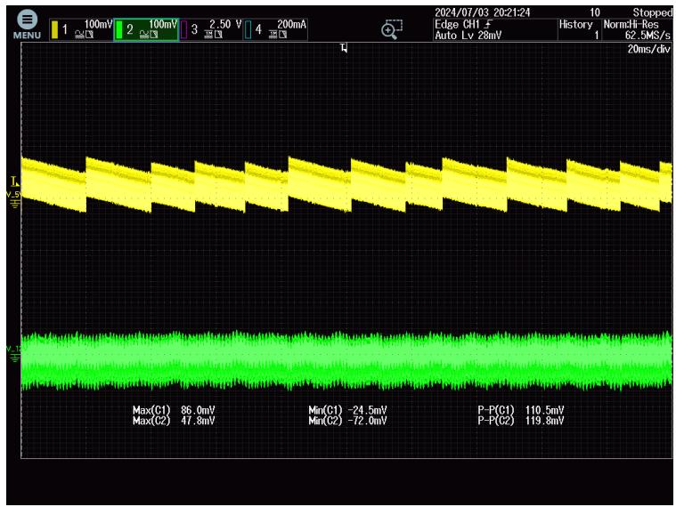

## 265VAC

CH1 Vout\_5V  
CH2 Vout\_18V

$$
V _ {P K - P K \_ 5 V} = 1 1 0. 5 m V
$$

$$
V _ {P K - P K \_ 1 8 V} = 1 1 9. 8 m V
$$

## Test Condition:

》 lout\_5V=0mA  
》 lout\_18V=250mA

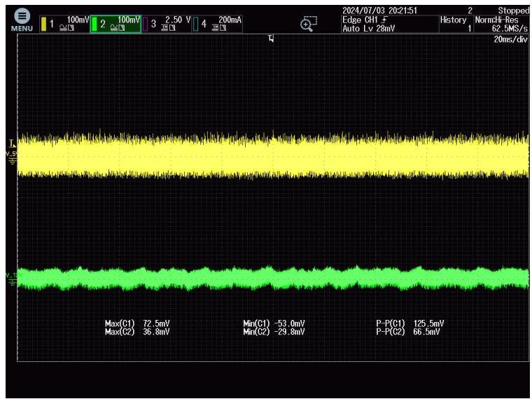

## 85VAC

CH1 Vout\_5V  
CH2 Vout\_18V

$$
V _ {P K - P K \_ 5 V} = 1 2 5. 5 m V
$$

$$
V _ {P K - P K \_ 1 8 V} = 6 6. 5 m V
$$

## Test Condition:

》 lout\_5V=100mA  
》 lout\_18V=0mA

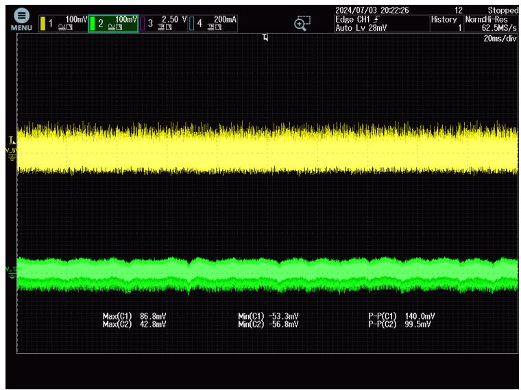

## 230VAC

CH1 Vout\_5V  
CH2 Vout\_18V

$$
V _ {P K - P K \_ 5 V} = 1 4 0. 0 m V
$$

$$
V _ {P K - P K \_ 1 8 V} = 9 9. 5 m V
$$

## Test Condition:

》 lout\_5V=100mA  
》 lout\_18V=0mA

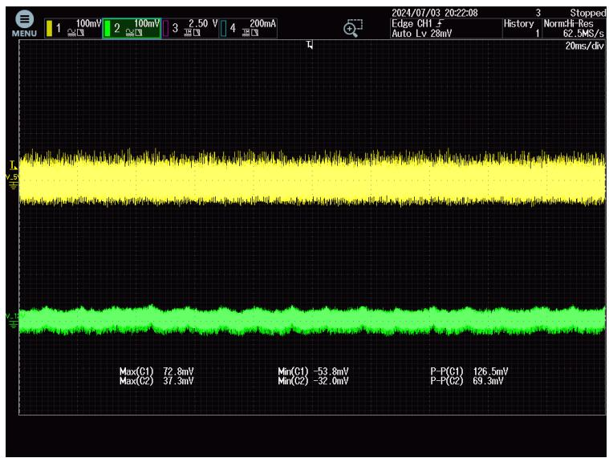

## 115VAC

CH1 Vout\_5V  
CH2 Vout\_18V

$$
V _ {P K - P K \_ 5 V} = 1 2 6. 5 m V
$$

$$
V _ {P K - P K \_ 1 8 V} = 6 9. 3 m V
$$

## Test Condition:

》 lout\_5V=100mA  
》 lout\_18V=0mA

## 265VAC

CH1 Vout\_5V  
CH2 Vout\_18V

$$
V _ {P K - P K \_ 5 V} = 1 5 0. 5 m V
$$

$$
V _ {P K - P K \_ 1 8 V} = 1 2 8. 8 m V
$$

## Test Condition:

》 lout\_5V=100mA  
》 lout\_18V=0mA

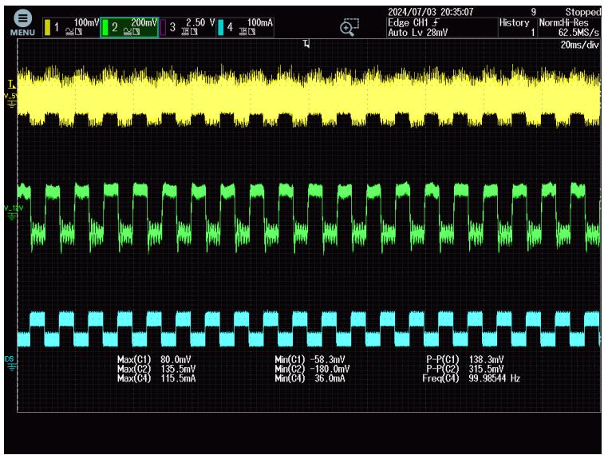

## 85VAC

CH1 Vout\_5V  
CH2 Vout\_18V  
CH4 Iout\_5V

$$
\begin{array}{l} V _ {P K - P K \_ 5 V} = 1 3 8. 3 m V \\ V _ {P K - P K \_ 1 8 V} = 3 1 5. 5 m V \end{array}
$$

## Test Condition:

➢ 5V: 50mA-100mA  
➢ 18V: 125mA-250mA  
➢ Slew Rate: 0.5 A/μS  
➢ Frequency: 100 Hz

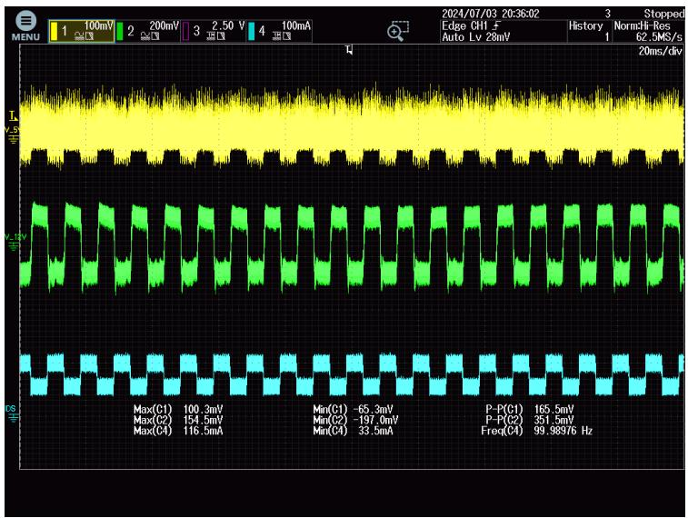

## 230VAC

CH1 Vout\_5V  
CH2 Vout\_18V  
CH4 Iout\_5V

$$
\begin{array}{l} V _ {P K - P K \_ 5 V} = 1 6 5. 5 m V \\ V _ {P K - P K \_ 1 8 V} = 3 5 1. 5 m V \end{array}
$$

## Test Condition:

➢ 5V: 50mA-100mA  
➢ 18V: 125mA-250mA  
➢ Slew Rate: 0.5 A/μS  
➢ Frequency: 100 Hz

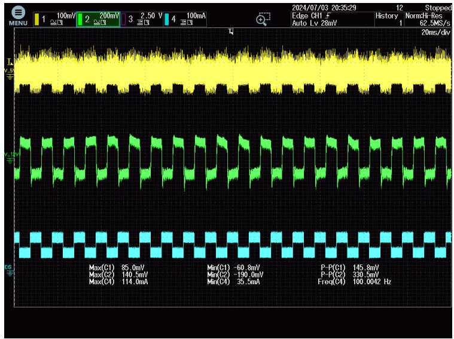

## 115VAC

CH1 Vout\_5V  
CH2 Vout\_18V  
CH4 Iout\_5V

$$
\begin{array}{l} \mathrm {V_ {PK - PK\_ 5V}} = 1 4 5. 8 \mathrm{mV} \\ \mathrm {V_ {PK - PK\_ 18V}} = 3 3 0. 5 \mathrm{mV} \end{array}
$$

## Test Condition:

➢ 5V: 50mA-100mA  
➢ 18V: 125mA-250mA  
➢ Slew Rate: 0.5 A/μS  
➢ Frequency: 100 Hz

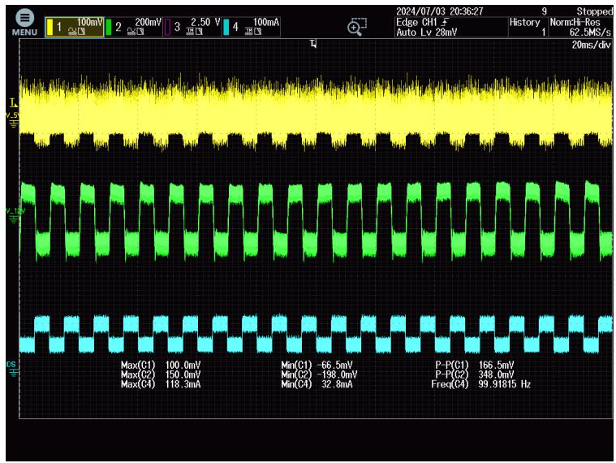

## 265VAC

CH1 Vout\_5V  
CH2 Vout\_18V  
CH4 Iout\_5V

$$
\begin{array}{l} \mathrm {V_ {PK - PK\_ 5V}} = 1 6 6. 5 \mathrm{mV} \\ \mathrm {V_ {PK - PK\_ 18V}} = 3 4 8. 0 \mathrm{mV} \end{array}
$$

## Test Condition:

➢ 5V: 50mA-100mA  
➢ 18V: 125mA-250mA  
➢ Slew Rate: 0.5 A/μS  
➢ Frequency: 100 Hz

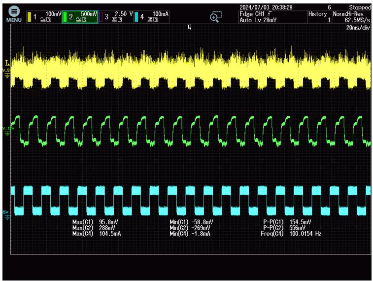

## 85VAC

CH1 Vout\_5V  
CH2 Vout\_18V  
CH4 Iout\_5V

## Test Condition:

➢ 5V: 10mA-90mA  
➢ 18V: 25mA-225mA  
➢ Slew Rate: 0.5 A/μS  
➢ Frequency: 100 Hz

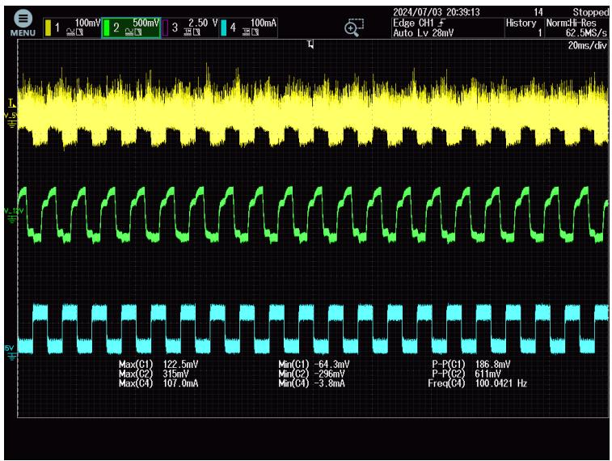

## 230VAC

CH1 Vout\_5V  
CH2 Vout\_18V  
CH4 Iout\_5V

## Test Condition:

➢ 5V: 10mA-90mA  
➢ 18V: 25mA-225mA  
➢ Slew Rate: 0.5 A/μS  
➢ Frequency: 100 Hz

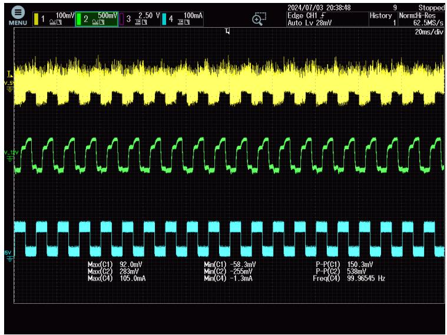

## 115VAC

CH1 Vout\_5V  
CH2 Vout\_18V  
CH4 Iout\_5V

## Test Condition:

➢ 5V: 10mA-90mA  
➢ 18V: 25mA-225mA  
➢ Slew Rate: 0.5 A/μS  
➢ Frequency: 100 Hz

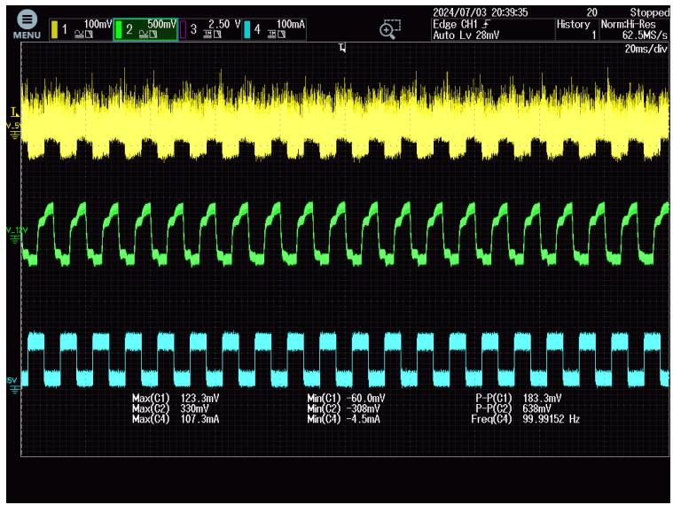

## 265VAC

CH1 Vout\_5V  
CH2 Vout\_18V  
CH4 Iout\_5V

## Test Condition:

➢ 5V: 10mA-90mA  
➢ 18V: 25mA-225mA  
➢ Slew Rate: 0.5 A/μS  
➢ Frequency: 100 Hz

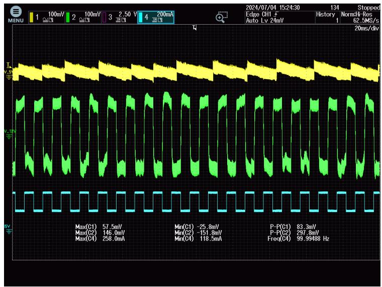

## 85VAC

CH1 Vout\_5V  
CH2 Vout\_18V  
CH4 Iout\_5V

$$
\begin{array}{l} V _ {P K - P K \_ 5 V} = 8 3. 3 m V \\ V _ {P K - P K \_ 1 8 V} = 2 9 7. 8 m V \end{array}
$$

## Test Condition:

➢ 5V: 0mA  
➢ 18V: 125mA-250mA  
➢ Slew Rate: 0.5 A/μS  
➢ Frequency: 100 Hz

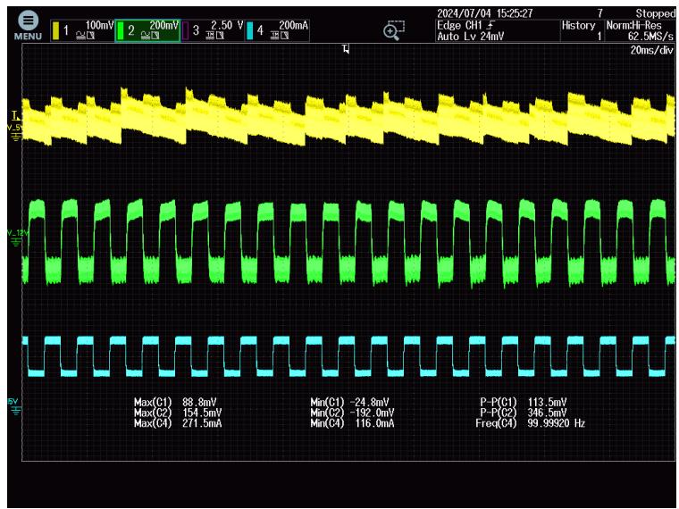

## 265VAC

CH1 Vout\_5V  
CH2 Vout\_18V  
CH4 Iout\_5V

$$
\begin{array}{l} V _ {P K - P K \_ 5 V} = 1 1 3. 5 m V \\ V _ {P K - P K \_ 1 8 V} = 3 4 6. 5 m V \end{array}
$$

## Test Condition:

➢ 5V: 0mA  
➢ 18V: 125mA-250mA  
➢ Slew Rate: 0.5 A/μS  
➢ Frequency: 100 Hz

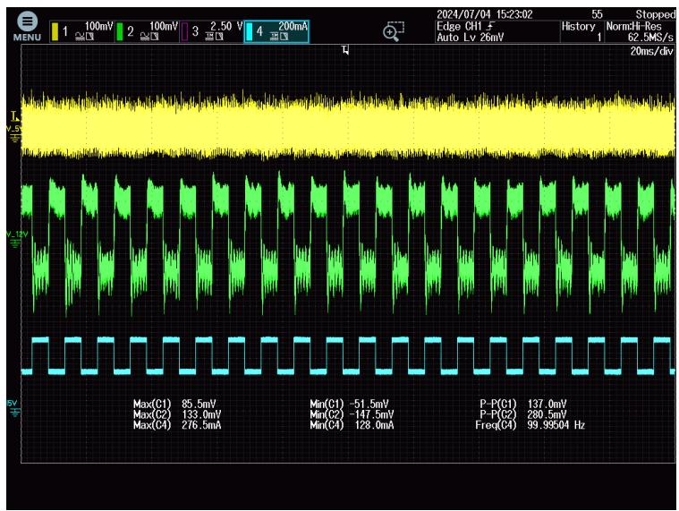

## 85VAC

CH1 Vout\_5V  
CH2 Vout\_18V  
CH4 Iout\_5V

$$
\begin{array}{l} \mathrm {V_ {PK - PK\_ 5V}} = 1 3 7. 0 \mathrm{mV} \\ \mathrm {V_ {PK - PK\_ 18V}} = 2 8 0. 5 \mathrm{mV} \end{array}
$$

## Test Condition:

➢ 5V 100mA  
➢ 18V: 125mA-250mA  
➢ Slew Rate: 0.5 A/μS  
➢ Frequency: 100 Hz

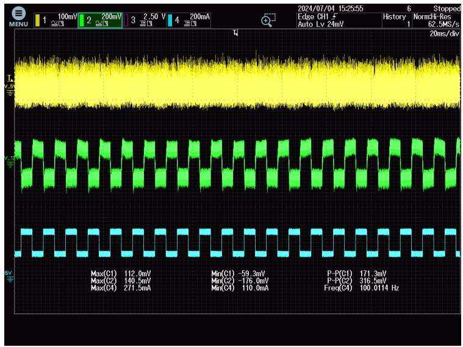

## 265VAC

CH1 Vout\_5V  
CH2 Vout\_18V  
CH4 Iout\_5V

$$
\begin{array}{l} \mathrm {V_ {PK - PK\_ 5V}} = 1 7 1. 3 \mathrm{mV} \\ \mathrm {V_ {PK - PK\_ 18V}} = 3 1 6. 5 \mathrm{mV} \end{array}
$$

## Test Condition:

➢ 5V: 100mA  
➢ 18V: 125mA-250mA  
➢ Slew Rate: 0.5 A/μS  
➢ Frequency: 100 Hz

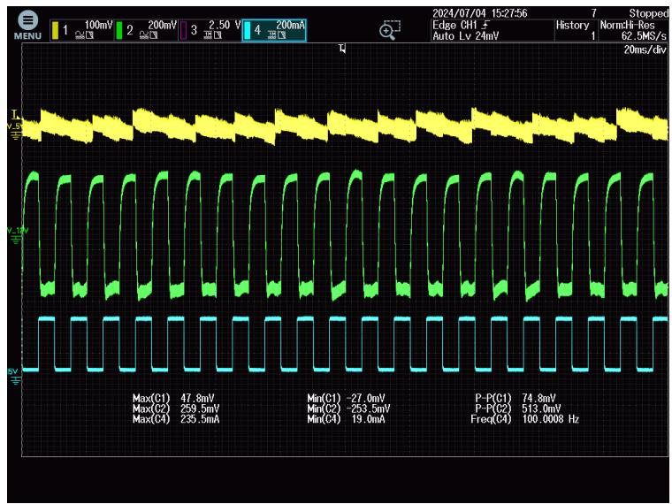

## 85VAC

CH1 Vout\_5V  
CH2 Vout\_18V  
CH4 Iout\_5V

$$
\begin{array}{l} V _ {P K - P K \_ 5 V} = 7 4. 8 m V \\ V _ {P K - P K \_ 1 8 V} = 5 1 3. 0 m V \end{array}
$$

## Test Condition:

➢ 5V: 0mA  
➢ 18V: 25mA-225mA  
➢ Slew Rate: 0.5 A/μS  
➢ Frequency: 100 Hz

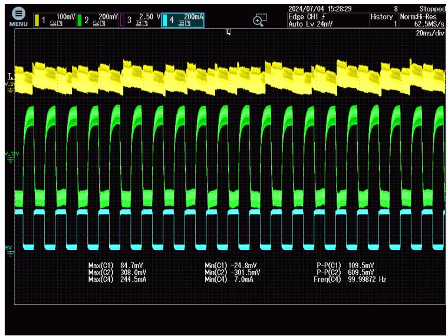

## 265VAC

CH1 Vout\_5V  
CH2 Vout\_18V  
CH4 Iout\_5V

$$
\begin{array}{l} V _ {P K - P K \_ 5 V} = 1 0 9. 5 m V \\ V _ {P K - P K \_ 1 8 V} = 6 0 9. 5 m V \end{array}
$$

## Test Condition:

➢ 5V: 0mA  
➢ 18V: 25mA-225mA  
➢ Slew Rate: 0.5 A/μS  
➢ Frequency: 100 Hz

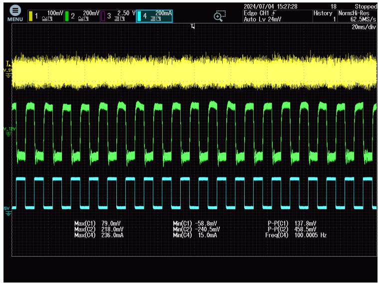

## 85VAC

CH1 Vout\_5V  
CH2 Vout\_18V  
CH4 Iout\_5V

$$
\begin{array}{l} \mathrm {V_ {PK - PK\_ 5V}} = 1 3 7. 8 \mathrm{mV} \\ \mathrm {V_ {PK - PK\_ 18V}} = 4 5 8. 5 \mathrm{mV} \end{array}
$$

## Test Condition:

➢ 5V 100mA  
➢ 18V: 25mA-225mA  
➢ Slew Rate: 0.5 A/μS  
➢ Frequency: 100 Hz

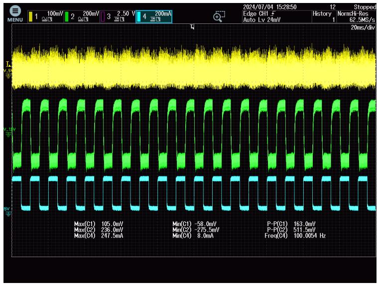

## 265VAC

CH1 Vout\_5V  
CH2 Vout\_18V  
CH4 Iout\_5V

$$
\begin{array}{l} \mathrm {V_ {PK - PK\_ 5V}} = 1 6 3. 0 \mathrm{mV} \\ \mathrm {V_ {PK - PK\_ 18V}} = 5 1 1. 5 \mathrm{mV} \end{array}
$$

## Test Condition:

➢ 5V: 100mA  
➢ 18V: 25mA-225mA  
➢ Slew Rate: 0.5 A/μS  
➢ Frequency: 100 Hz

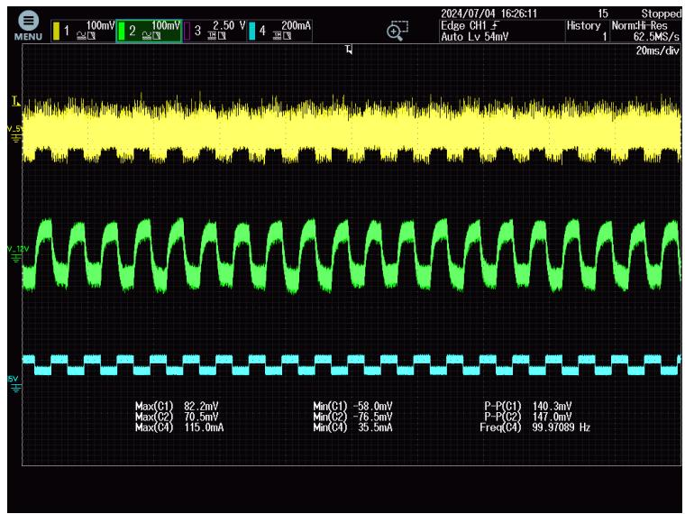

## 85VAC

CH1 Vout\_5V  
CH2 Vout\_18V  
CH4 Iout\_5V

$$
\begin{array}{l} \mathrm {V_ {PK - PK\_5V}} = 1 4 0. 3 \mathrm{mV} \\ \mathrm {V_ {PK - PK\_18V}} = 1 4 7. 0 \mathrm{mV} \end{array}
$$

## Test Condition:

5V: 50mA-100mA  
➢ 18V: 0mA  
➢ Slew Rate: 0.5 A/μS  
➢ Frequency: 100 Hz

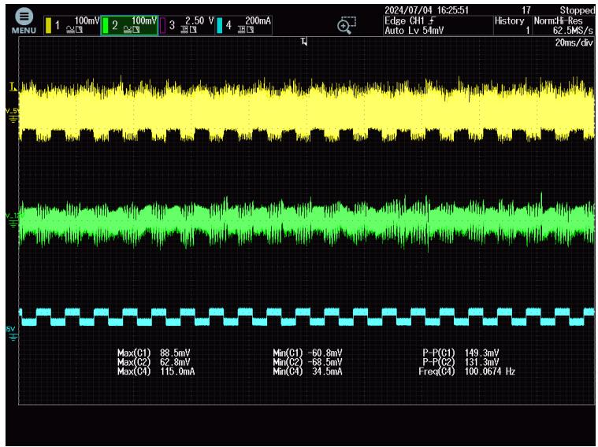

## 85VAC

CH1 Vout\_5V  
CH2 Vout\_18V  
CH4 Iout\_5V

$$
\begin{array}{l} \mathrm {V_ {PK - PK\_ 5V}} = 1 4 9. 3 \mathrm{mV} \\ \mathrm {V_ {PK - PK\_ 18V}} = 1 3 1. 3 \mathrm{mV} \end{array}
$$

## Test Condition:

5V: 50mA-100mA  
➢ 18V: 250mA  
➢ Slew Rate: 0.5 A/μS  
➢ Frequency: 100 Hz

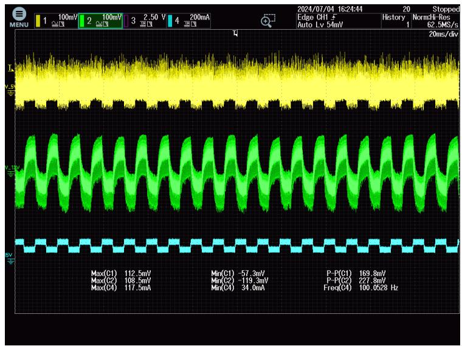

## 265VAC

CH1 Vout\_5V  
CH2 Vout\_18V  
CH4 Iout\_5V

$$
\begin{array}{l} V _ {P K - P K \_ 5 V} = 1 6 9. 8 m V \\ V _ {P K - P K \_ 1 8 V} = 2 2 7. 8 m V \end{array}
$$

## Test Condition:

5V: 50mA-100mA  
➢ 18V: 0mA  
➢ Slew Rate: 0.5 A/μS  
➢ Frequency: 100 Hz

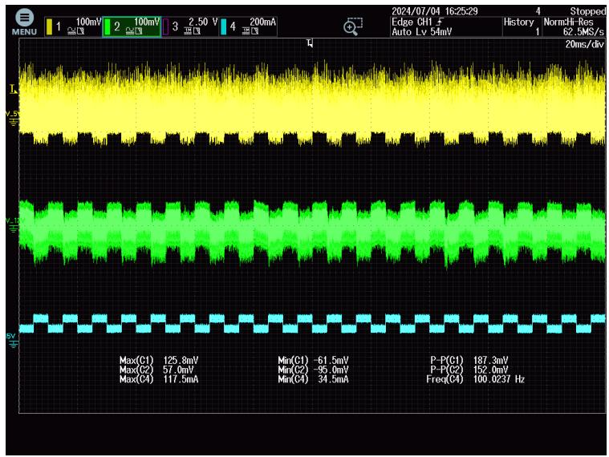

## 265VAC

CH1 Vout\_5V  
CH2 Vout\_18V  
CH4 Iout\_5V

$$
\begin{array}{l} \mathrm {V_ {PK - PK\_5V}} = 1 8 7. 3 \mathrm{mV} \\ \mathrm {V_ {PK - PK\_18V}} = 1 5 2. 0 \mathrm{mV} \end{array}
$$

## Test Condition:

5V: 50mA-100mA  
➢ 18V: 250mA  
➢ Slew Rate: 0.5 A/μS  
➢ Frequency: 100 Hz

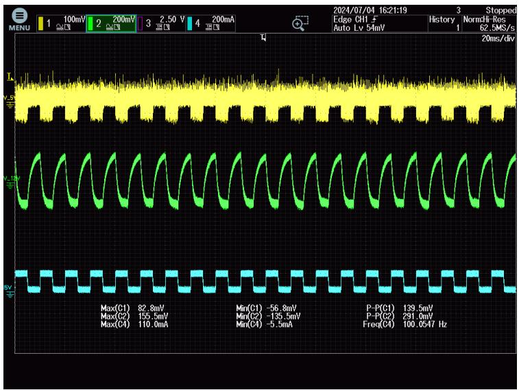

## 85VAC

CH1 Vout\_5V  
CH2 Vout\_18V  
CH4 Iout\_5V

$$
\begin{array}{l} \mathrm {V_ {PK - PK\_ 5V}} = 1 3 9. 5 \mathrm{mV} \\ \mathrm {V_ {PK - PK\_ 18V}} = 2 9 1. 0 \mathrm{mV} \end{array}
$$

## Test Condition:

➢ 5V: 5mA-95mA  
➢ 18V: 0mA  
➢ Slew Rate: 0.5 A/μS  
➢ Frequency: 100 Hz

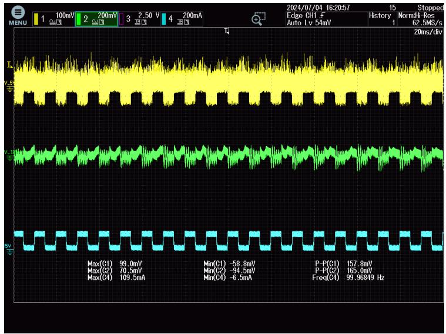

## 85VAC

CH1 Vout\_5V  
CH2 Vout\_18V  
CH4 Iout\_5V

$$
\begin{array}{l} \mathrm {V_ {PK - PK\_ 5V}} = 1 5 7. 8 \mathrm{mV} \\ \mathrm {V_ {PK - PK\_ 18V}} = 1 6 5. 0 \mathrm{mV} \end{array}
$$

## Test Condition:

➢ 5V: 5mA-95mA  
➢ 18V: 250mA  
➢ Slew Rate: 0.5 A/μS  
➢ Frequency: 100 Hz

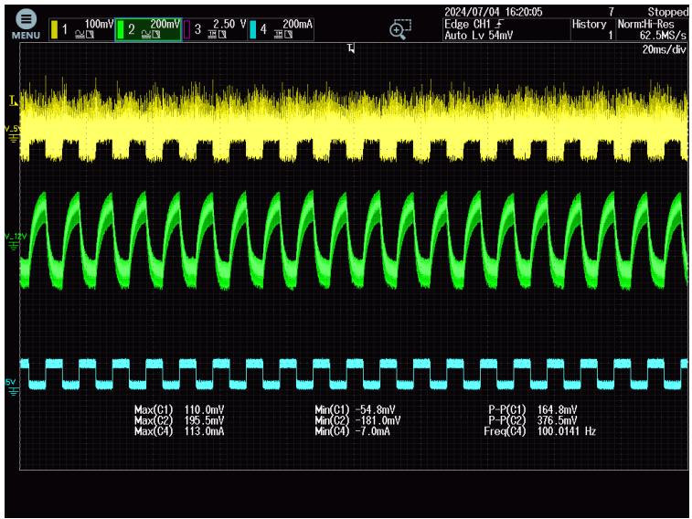

## 265VAC

CH1 Vout\_5V  
CH2 Vout\_18V  
CH4 Iout\_5V

$$
\begin{array}{l} \mathrm {V_ {PK - PK\_5V}} = 1 6 4. 8 \mathrm{mV} \\ \mathrm {V_ {PK - PK\_18V}} = 3 7 6. 5 \mathrm{mV} \end{array}
$$

## Test Condition:

➢ 5V: 5mA-95mA  
➢ 18V: 0mA  
➢ Slew Rate: 0.5 A/μS  
➢ Frequency: 100 Hz

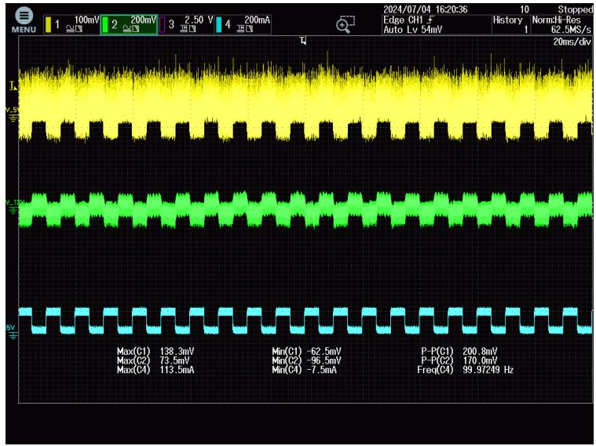

## 265VAC

CH1 Vout\_5V  
CH2 Vout\_18V  
CH4 Iout\_5V

$$
\begin{array}{l} \mathrm {V_ {PK - PK\_ 5V}} = 2 0 0. 8 \mathrm{mV} \\ \mathrm {V_ {PK - PK\_ 18V}} = 1 7 0. 0 \mathrm{mV} \end{array}
$$

## Test Condition:

➢ 5V: 5mA-95mA  
➢ 18V: 250mA  
➢ Slew Rate: 0.5 A/μS  
➢ Frequency: 100 Hz

## -MOSFET -

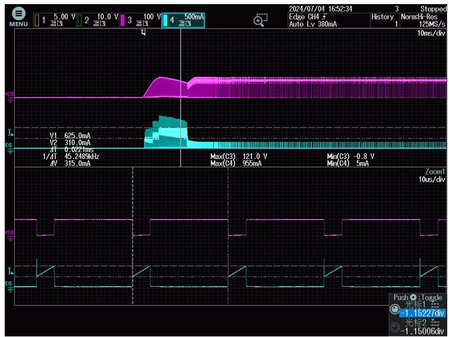

## 85VAC

CH3 VDS  
CH4 IDS

$$
V _ {D S \_ M A X} = 1 2 1 V
$$

$$
I _ {D S \_ M A X} = 9 5 5 m A
$$

## Test Condition:

》 lout\_5V=0mA  
》 lout\_18V=0mA

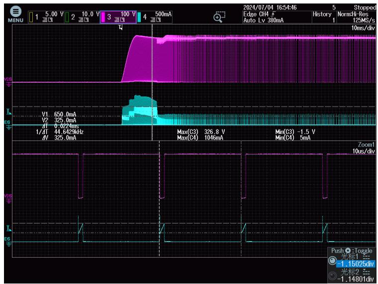

## 230VAC

CH3 $\mathsf { V } _ { \mathsf { D } \mathsf { S } }$  
CH4 IDS

$$
V _ {D S \_ M A X} = 3 2 6. 8 V
$$

$$
I _ {D S \_ M A X} = 1 0 4 6 m A
$$

## Test Condition:

》 lout\_5V=0mA  
》 lout\_18V=0mA

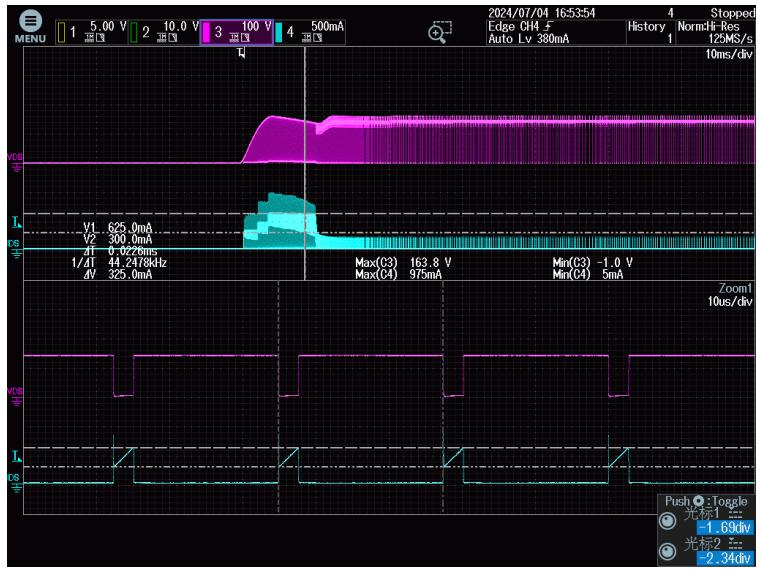

## 115VAC

CH3 $\mathsf { V } _ { \mathsf { D } \mathsf { S } }$  
CH4 IDS

$$
V _ {D S \_ M A X} = 1 6 3. 8 V
$$

$$
I _ {D S \_ M A X} = 9 7 5 m A
$$

## Test Condition:

》lout $. 5 V { = } 0 \mathsf { m } \mathsf { A }$  
> lout $\mathsf { 1 8 V = 0 m A }$

## 265VAC

CH3 $\mathsf { V } _ { \mathsf { D } \mathsf { S } }$  
CH4 $\mathsf { I } _ { \mathsf { D } \mathsf { S } }$

$$
V _ {D S \_ M A X} = 3 7 9. 4 V
$$

$$
I _ {D S \_ M A X} = 1 0 6 8 m A
$$

## Test Condition:

》 lout\_5V=0mA  
》 lout\_18V=0mA

## -MOSFET -

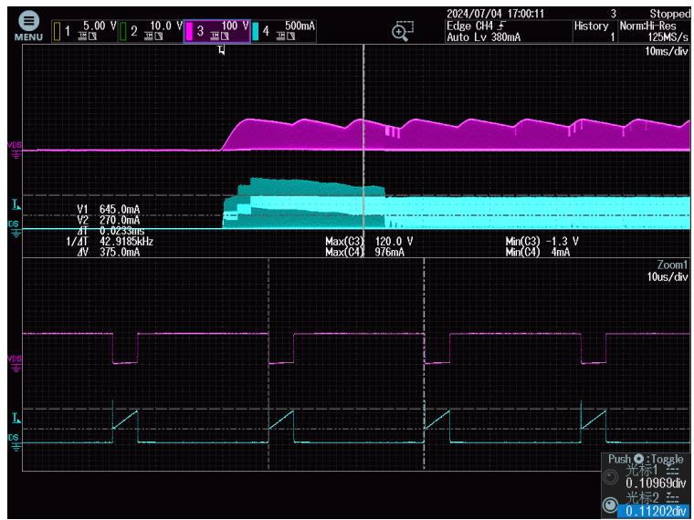

## 85VAC

CH3 VDS  
CH4 IDS

$$
V _ {D S \_ M A X} = 1 2 0 V
$$

$$
I _ {D S \_ M A X} = 9 7 6 m A
$$

## Test Condition:

> lout $\scriptstyle 5 \lor = 1 0 0 \mathsf { m A }$  
>lout $\mathtt { 1 8 V = 2 5 0 m A }$

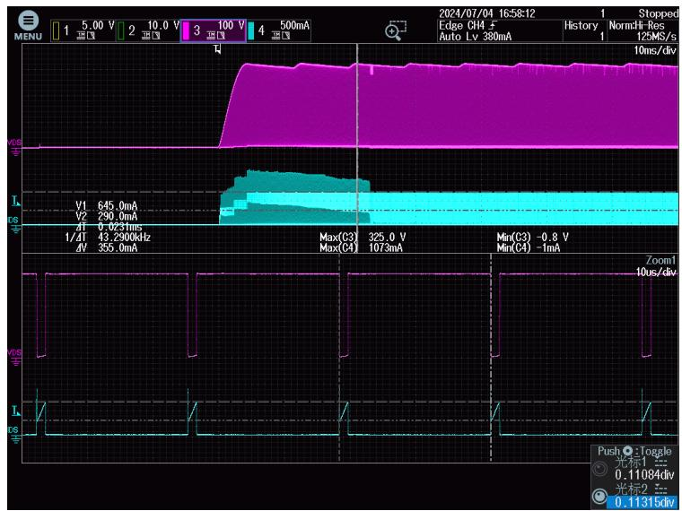

## 230VAC

CH3 $\mathsf { V } _ { \mathsf { D } \mathsf { S } }$  
CH4 IDS

$$
V _ {D S \_ M A X} = 3 2 5 V
$$

$$
I _ {D S \_ M A X} = 1 0 7 3 m A
$$

## Test Condition:

》 lout\_5V=100mA  
》 lout\_ $\mathsf { 1 8 V = 2 5 0 m A }$

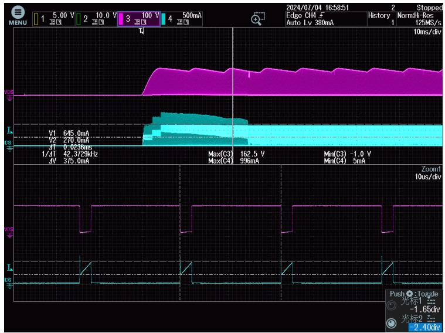

## 115VAC

CH3 $\mathsf { V } _ { \mathsf { D } \mathsf { S } }$  
CH4 IDS

$$
V _ {D S \_ M A X} = 1 6 2. 5 V
$$

$$
I _ {D S \_ M A X} = 9 9 6 m A
$$

## Test Condition:

》lout $. 5 V { = } 1 0 0 \mathsf { m A }$  
> lout\_ $\mathtt { 1 8 V = 2 5 0 m A }$

## 265VAC

CH3 $\mathsf { V } _ { \mathsf { D } \mathsf { S } }$  
CH4 IDS

$$
V _ {D S \_ M A X} = 3 7 5. 6 V
$$

$$
I _ {D S \_ M A X} = 1 0 8 8 m A
$$

## Test Condition:

>lout $\scriptstyle 5 \lor = 1 0 0 \mathsf { m A }$  
》lout\_ $1 8 \mathsf { V } { = } 2 5 0 \mathsf { m A }$

## -MOSFET -

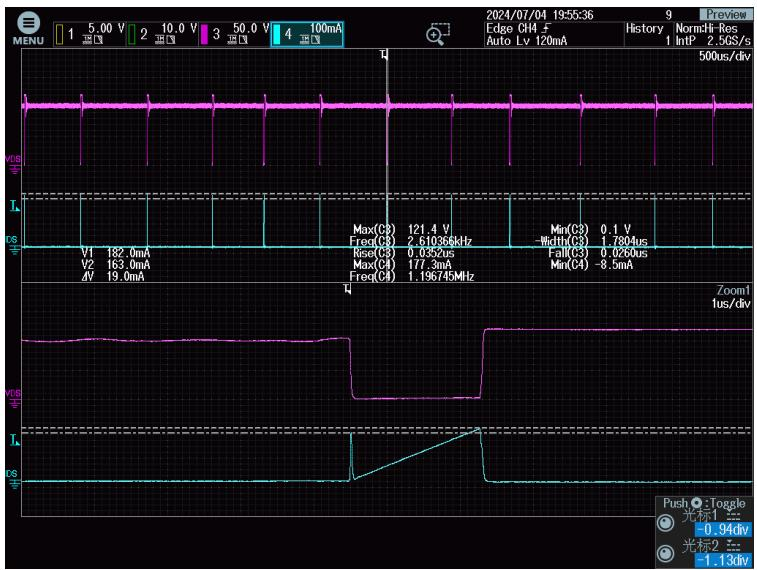

## 85VAC

CH3 VDS  
CH4 IDS

$$
\begin{array}{l} V _ {D S \_ M A X} = 1 2 1. 4 V \\ I _ {D S \_ M A X} = 1 7 7. 3 m A \end{array}
$$

## Test Condition:

》 lout\_5V=0mA  
》 lout\_18V=0mA

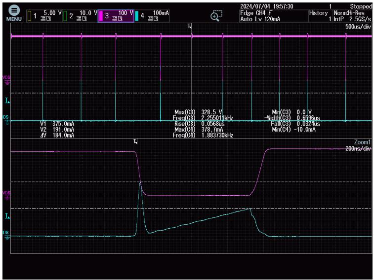

## 230VAC

CH3 $\mathsf { V } _ { \mathsf { D } \mathsf { S } }$  
CH4 IDS

$$
\begin{array}{l} V _ {D S \_ M A X} = 3 2 8. 5 V \\ I _ {D S \_ M A X} = 3 7 8. 7 m A \end{array}
$$

## Test Condition:

》 lout\_5V=0mA  
》 lout\_18V=0mA

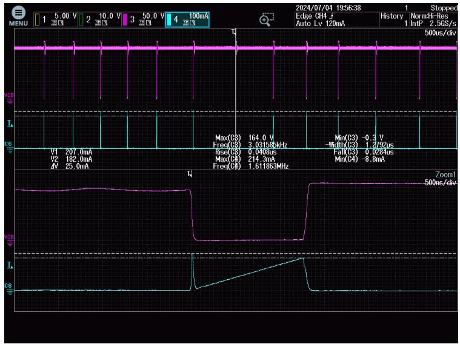

## 115VAC

CH3 $\mathsf { V } _ { \mathsf { D } \mathsf { S } }$  
CH4 IDS

$$
V _ {D S \_ M A X} = 1 6 4. 0 V
$$

$$
I _ {D S \_ M A X} = 2 1 4. 3 m A
$$

## Test Condition:

》lout $. 5 V { = } 0 \mathsf { m } \mathsf { A }$  
> lout $\mathsf { 1 8 V = 0 m A }$

## 265VAC

CH3 $\mathsf { V } _ { \mathsf { D } \mathsf { S } }$  
CH4 IDS

$$
V _ {D S \_ M A X} = 3 8 0. 0 V
$$

$$
I _ {D S \_ M A X} = 4 1 3. 0 \mathrm{mA}
$$

## Test Condition:

》 lout\_5V=0mA  
》 lout\_18V=0mA

## -MOSFET -

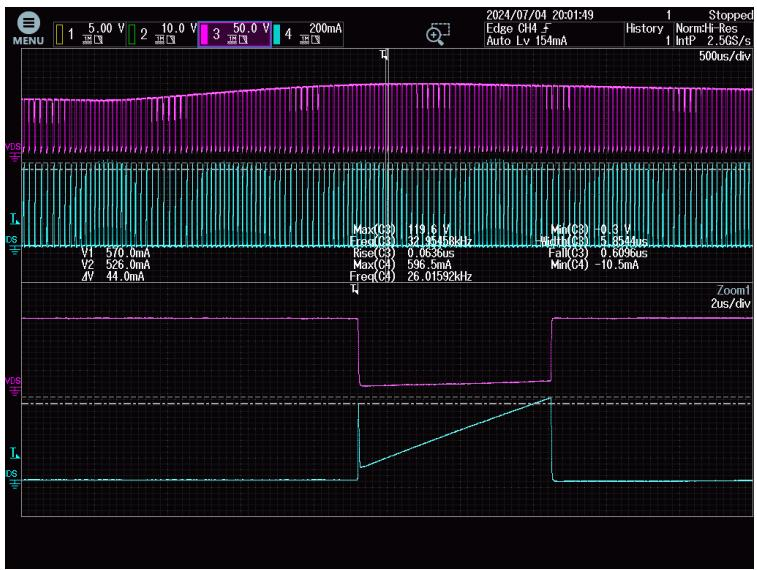

## 85VAC

CH3 VDS  
CH4 IDS

$$
V _ {D S \_ M A X} = 1 1 9. 6 V
$$

$$
I _ {D S \_ M A X} = 5 9 6. 5 \mathrm{mA}
$$

## Test Condition:

》 lout\_5V=100mA  
》 lout\_18V=250mA

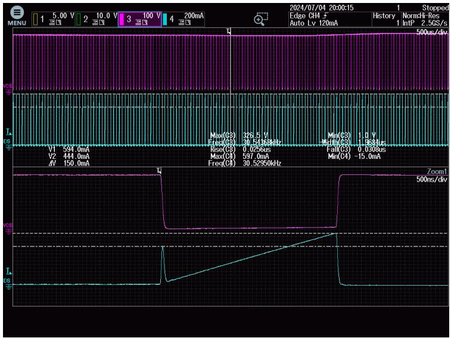

## 230VAC

CH3 $\mathsf { V } _ { \mathsf { D } \mathsf { S } }$  
CH4 IDS

$$
V _ {D S \_ M A X} = 3 2 6. 5 V
$$

$$
I _ {D S \_ M A X} = 5 9 7. 0 \mathrm{mA}
$$

## Test Condition:

》 lout\_5V=100mA  
》 lout\_18V=250mA

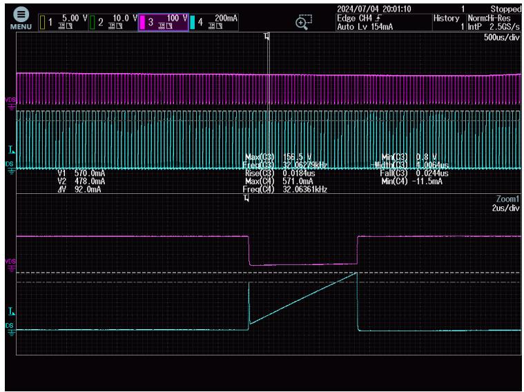

## 115VAC

CH3 $\mathsf { V } _ { \mathsf { D } \mathsf { S } }$  
CH4 IDS

$$
V _ {D S \_ M A X} = 1 5 6. 5 V
$$

$$
I _ {D S \_ M A X} = 5 7 1. 0 \mathrm{mA}
$$

## Test Condition:

》 lout\_5V=100mA  
》 lout\_18V=250mA

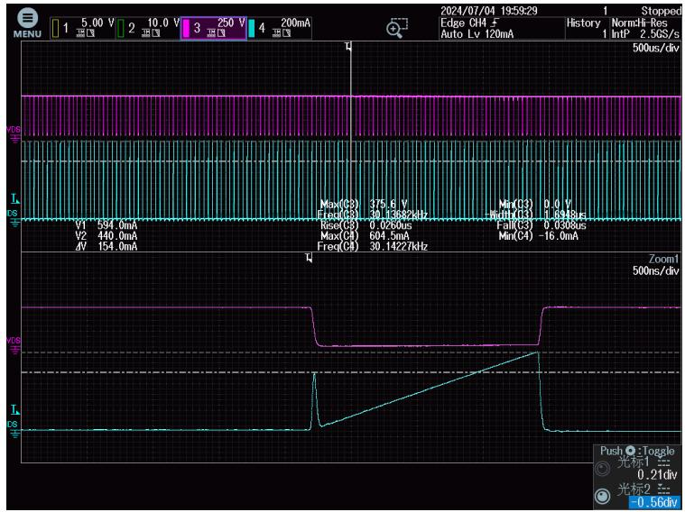

## 265VAC

CH3 $\mathsf { V } _ { \mathsf { D } \mathsf { S } }$  
CH4 IDS

$$
V _ {D S \_ M A X} = 3 7 5. 6 V
$$

$$
I _ {D S \_ M A X} = 6 0 4. 5 \mathrm{mA}
$$

## Test Condition:

》 lout\_5V=100mA  
》 lout\_18V=250mA

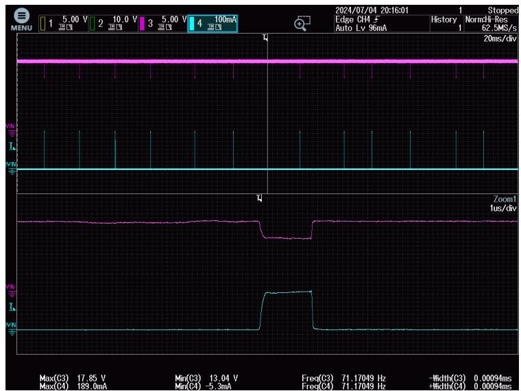

## 230VAC

CH3 VVIN  
CH4 IVIN

$$
V _ {V I N \_ M A X} = 1 7. 8 5 V
$$

$$
V _ {V I N \_ M I N} = 1 3. 0 4 V
$$

$$
I _ {\text { VIN\_MAX }} = 1 8 9 \mathrm{mA}
$$

## Test Condition:

lout\_5V=0mA  
》 lout\_18V=250mA

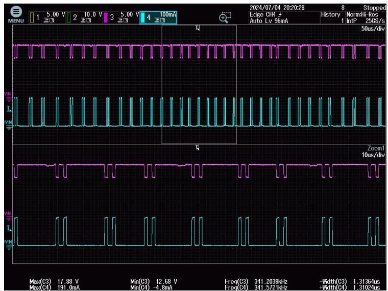

## 230VAC

CH3 VVIN  
CH4 IVIN

$$
V _ {V I N \_ M A X} = 1 7. 8 8 V
$$

$$
V _ {V I N \_ M I N} = 1 2. 6 8 V
$$

$$
I _ {\text { VIN\_MAX }} = 1 9 1. 0 \mathrm{mA}
$$

## Test Condition:

lout\_5V=50mA  
》 lout\_18V=250mA

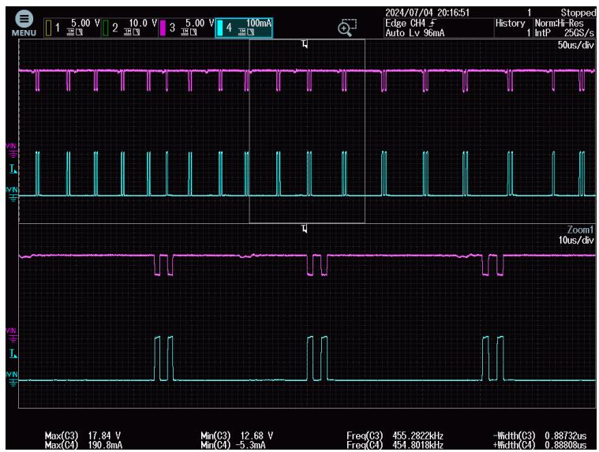

## 230VAC

CH3 VVIN  
CH4 IVIN

$$
V _ {V I N \_ M A X} = 1 7. 8 4 V
$$

$$
V _ {V I N \_ M I N} = 1 2. 6 8 V
$$

$$
I _ {\text { VIN\_MAX }} = 1 9 0. 8 \mathrm{mA}
$$

## Test Condition:

lout\_5V=25mA  
》 lout\_18V=250mA

## 230VAC

CH3 VVIN  
CH4 IVIN

$$
V _ {V I N \_ M A X} = 1 7. 8 3 V
$$

$$
V _ {V I N \_ M I N} = 1 2. 5 5 V
$$

$$
I _ {\text { VIN\_MAX }} = 1 9 2. 5 \mathrm{mA}
$$

## Test Condition:

lout\_5V=100mA  
》 lout\_18V=250mA

Line  
115Vac  
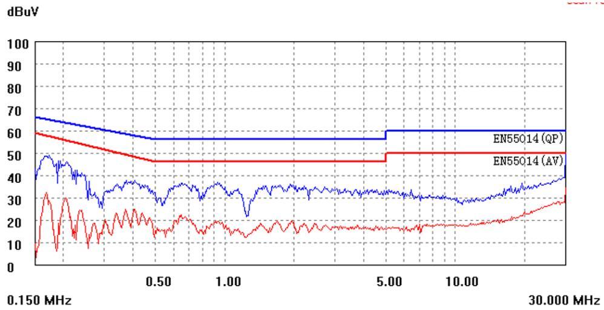

230Vac  
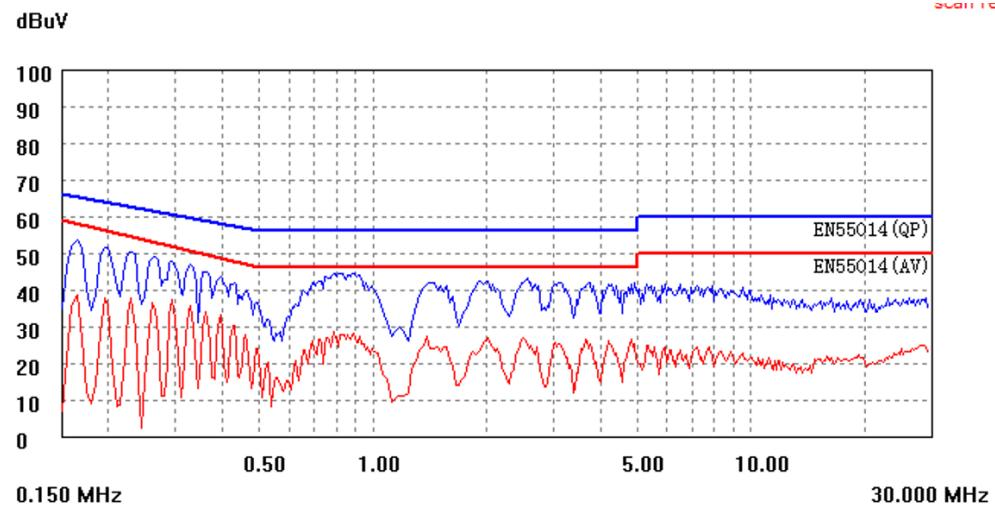

Neutra  
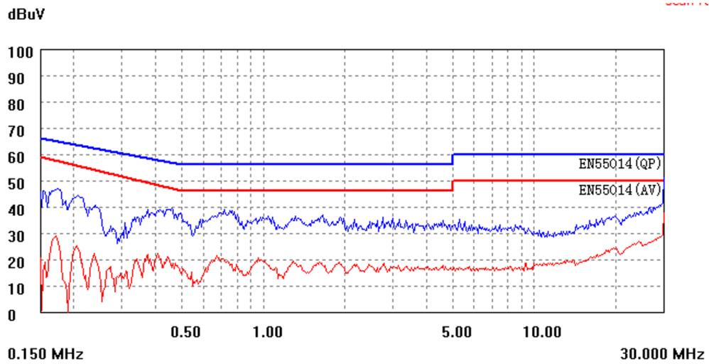

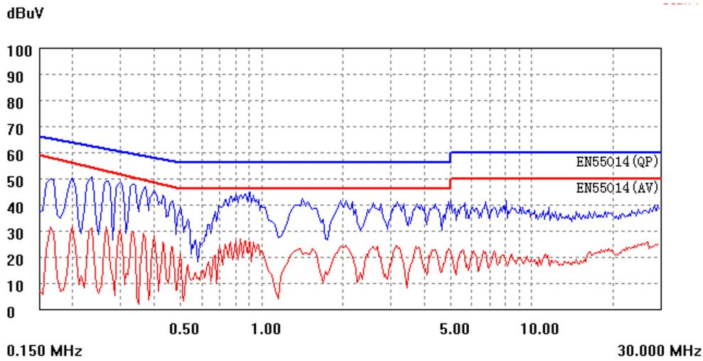

Line

115Vac  
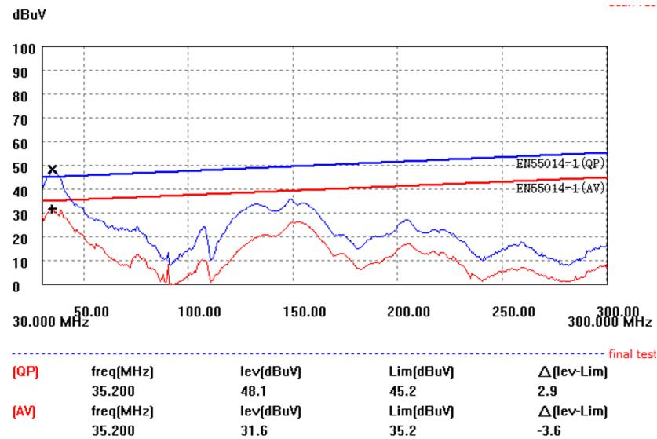

230Vac  
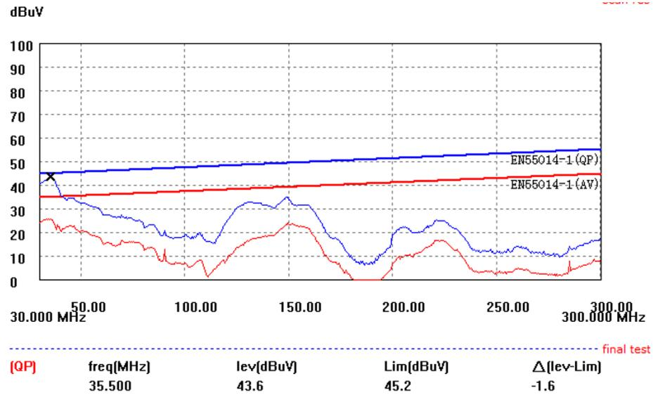

Neutra

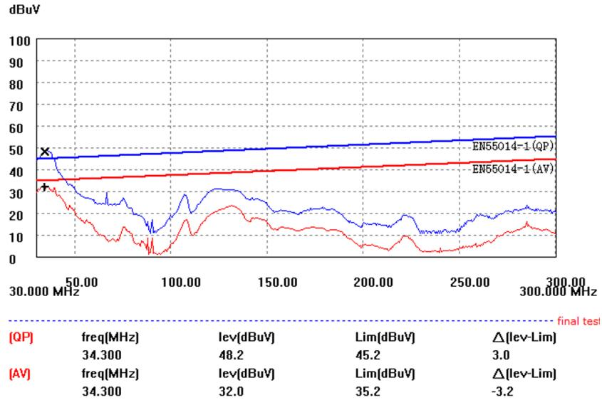

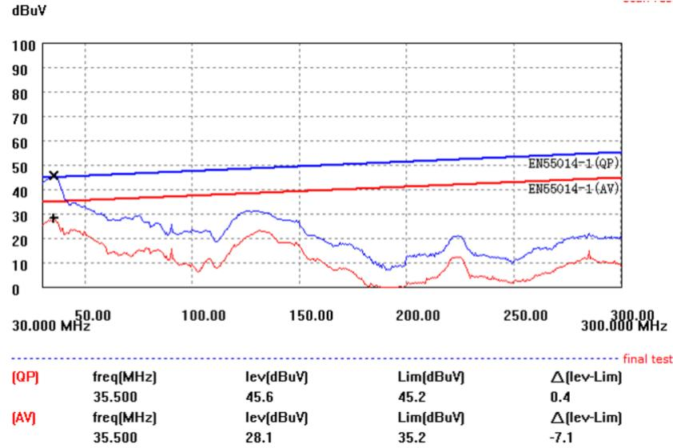

温升测试-常温密闭环境下测试参数参考原理图（5V/100mA,18V/250mA）

<table><tr><td rowspan="3">芯片编号</td><td rowspan="3">输入电压</td><td colspan="6">老化后</td><td rowspan="3">IC温度</td><td rowspan="3">环境温度</td><td rowspan="3">温升</td></tr><tr><td colspan="2">5V输出</td><td colspan="2">18V输出</td><td rowspan="2">输入功率</td><td rowspan="2">转换效率</td></tr><tr><td>输出电压</td><td>输出电流</td><td>输出电压</td><td>输出电流</td></tr><tr><td rowspan="4">BP85976S(VIN串22R电阻)</td><td>85Vac/60Hz</td><td>4.95V</td><td>100mA</td><td>17.71V</td><td>250mA</td><td>7.11W</td><td>69.23%</td><td>95.64°C</td><td>26.15°C</td><td>69.49°C</td></tr><tr><td>115Vac/60Hz</td><td>4.95V</td><td>100mA</td><td>17.65V</td><td>250mA</td><td>6.62W</td><td>74.12%</td><td>78.03°C</td><td>25.80°C</td><td>52.23°C</td></tr><tr><td>230Vac/50Hz</td><td>4.95V</td><td>100mA</td><td>17.61V</td><td>250mA</td><td>6.43W</td><td>76.15%</td><td>76.15°C</td><td>25.59°C</td><td>50.56°C</td></tr><tr><td>265Vac/50Hz</td><td>4.95V</td><td>100mA</td><td>17.60V</td><td>250mA</td><td>6.45W</td><td>75.88%</td><td>77.69°C</td><td>25.56°C</td><td>52.13°C</td></tr></table>

## Surge

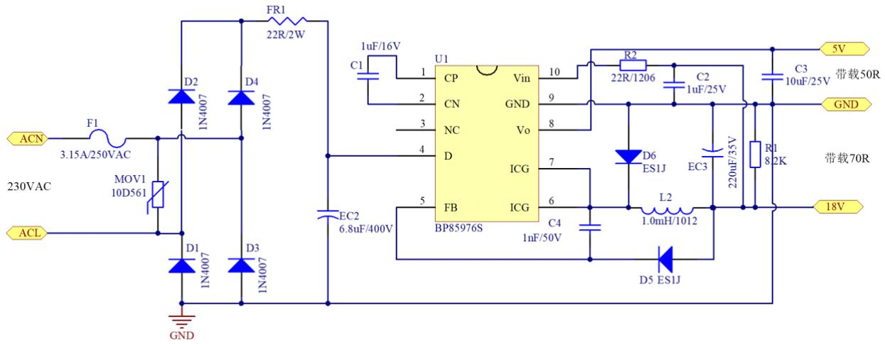

## 测试说明

➢ 按照GB/T17626.5和IEC61000-4-5的最新版本要求进行测试  
》室温环境，230VAC输入，满载条件  
》输入1.2/50us组合波浪涌电压  
》每个测试点重复5次  
》每次间隔时间1分钟  
》试验时样机输出正常（符合A类标准）视为PasS

<table><tr><td>差模</td><td>电压</td><td>相位角</td><td>测试次数</td><td>测试结果</td></tr><tr><td>L to N</td><td>±2.0kV</td><td>0</td><td>5</td><td>Pass</td></tr><tr><td>L to N</td><td>±2.0kV</td><td>90</td><td>5</td><td>Pass</td></tr><tr><td>L to N</td><td>±2.0kV</td><td>180</td><td>5</td><td>Pass</td></tr><tr><td>L to N</td><td>±2.0kV</td><td>270</td><td>5</td><td>Pass</td></tr><tr><td>L to N</td><td>±2.5kV</td><td>0</td><td>5</td><td>Pass</td></tr><tr><td>L to N</td><td>±2.5kV</td><td>90</td><td>5</td><td>Pass</td></tr><tr><td>L to N</td><td>±2.5kV</td><td>180</td><td>5</td><td>Pass</td></tr><tr><td>L to N</td><td>±3.0kV</td><td>0</td><td>5</td><td>Pass</td></tr><tr><td>L to N</td><td>±3.0kV</td><td>90</td><td>5</td><td>Pass</td></tr><tr><td>L to N</td><td>±3.0kV</td><td>180</td><td>5</td><td>Pass</td></tr><tr><td>L to N</td><td>±3.0kV</td><td>270</td><td>5</td><td>Pass</td></tr></table>

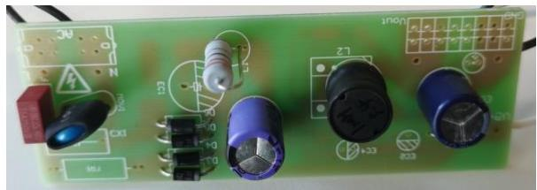

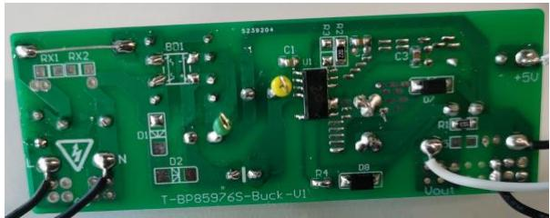

<table><tr><td>差模</td><td>电压</td><td>脉冲群持续时间</td><td>脉冲频率</td><td>测试时间</td><td>测试结果</td></tr><tr><td>L/N to PE</td><td>+4kV</td><td>15ms</td><td>5KHz</td><td>120s</td><td>Pass</td></tr><tr><td>L/N to PE</td><td>-4kV</td><td>15ms</td><td>5KHz</td><td>120s</td><td>Pass</td></tr><tr><td>L/N to PE</td><td>+4kV</td><td>0.75ms</td><td>100KHz</td><td>120s</td><td>Pass</td></tr><tr><td>L/N to PE</td><td>-4kV</td><td>0.75ms</td><td>100KHz</td><td>120s</td><td>Pass</td></tr><tr><td>L/N to PE</td><td>+2kV</td><td>1.95ms</td><td>38KHz</td><td>120s</td><td>Pass</td></tr><tr><td>L/N to PE</td><td>-2kV</td><td>1.95ms</td><td>38KHz</td><td>120s</td><td>Pass</td></tr><tr><td>L/N to PE</td><td>+4kV</td><td>1.95ms</td><td>38KHz</td><td>120s</td><td>Pass</td></tr><tr><td>L/N to PE</td><td>-4kV</td><td>1.95ms</td><td>38KHz</td><td>120s</td><td>Pass</td></tr></table>

## 测试说明

按照GB/T17626.5和IEC61000-4-4的最新版本要求进行测试  
》室温环境，230VAC输入，满载条件  
》分别测试5KHz/100KHz/38KHz  
脉冲群周期为300ms  
》每个测试条件测试时间120S  
》试验时样机输出正常（符合A类标准）视为Pass

<table><tr><td>测试</td><td>电压(V)</td><td>放电类型</td><td>放电次数</td><td>测试结果</td></tr><tr><td>Vo-18V</td><td>±12kV</td><td>空气放电</td><td>10</td><td>PASS</td></tr><tr><td>GND</td><td>±12kV</td><td>空气放电</td><td>10</td><td>PASS</td></tr><tr><td>Vo-5V</td><td>±12kV</td><td>空气放电</td><td>10</td><td>PASS</td></tr></table>

## 测试说明

》 按照GB/T17626.2和IEC61000-4-2的最新版本要求进行测试  
》室温环境，230VAC输入满载条件  
》每个测试点重复10次  
》分别对输出正端和地进行空气放电  
》试验时样机输出正常（符合A类标准）视为Pass

## 备注：

1、FB对ICG需要加1nF电容。  
2、5V输出需要并22uF电解。

## 重要声明

本文档中的数据和信息仅供参考，不构成任何形式的建议、验收标准或保证。实际测试数据和结果可能同文档中列出的数据和结果存在差异，请用户自行确认产品的适用性。  
此文档测试的BP85075C样品未经CP/FT工序，后续根据批量数据可能微调某些参数，可能略影响性能表现。此文档供参考评估，最终性能表现请以量产版本芯片为准。

上海市浦东新区申江路5005弄星创科技广场3号楼9层

+86-21-51870166

sales@bpsemi.com

www.bpsemi.com

  
微信公众号

  
微信视频号
