## 小家电

## BP85075C芯片双路输出推广资料

时间：2024年7月

## 产品特点

集成开关电源控制器和电荷泵转换器  
集成650V高压MOSFET  
集成高压启动和自供电电路  
固定18V输出和5V输出  
多模式控制技术，低待机功耗  
内置软起动功能  
丰富的保护功能  
BPSOP10封装

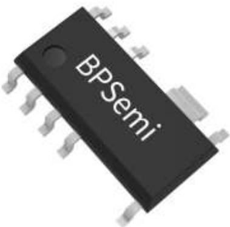

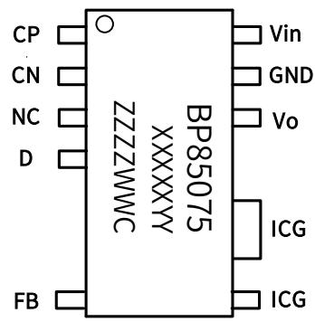

典型应用图  
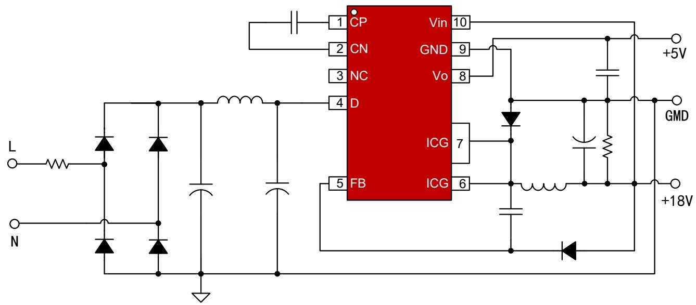

产品规格

<table><tr><td>Part No.</td><td>输入电压</td><td>稳态输出功率</td><td>瞬态输出功率</td></tr><tr><td>BP85075C</td><td>85~265VAC</td><td>5W(18V/250mA, 5V/100mA)</td><td>6.15W(18V/300mA, 5V/150mA)</td></tr></table>

注1：5V输出最大带载150mA，18V输出最大瞬态带载350mA（单独18V带载）  
➢ 注2：5V输出的电荷泵电路采用18V输出端供电，如果5V输出带载100mA以上时，建议在VIN上串电阻来降低芯片温度，Rin电阻的串联方式如下图：

## 目标应用

小家电辅助电源：电磁炉

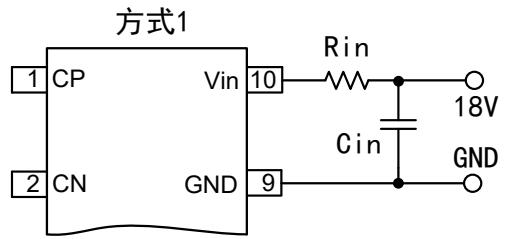

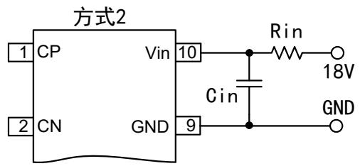

<table><tr><td>方式1</td><td>lout=100mA</td><td>lout=150mA</td></tr><tr><td>Rin电阻选型</td><td>22R/1206</td><td>47R/1206*2并</td></tr></table>

<table><tr><td>方式2</td><td>Rin电阻值(Ω)</td><td>Rin电阻功耗</td></tr><tr><td>Rin电阻选型</td><td> $\text{Rin} \leqslant \frac{12V}{Iout}$ </td><td> $P = \frac{1}{4} Rin * Iout^2$ </td></tr></table>

## 待机功耗

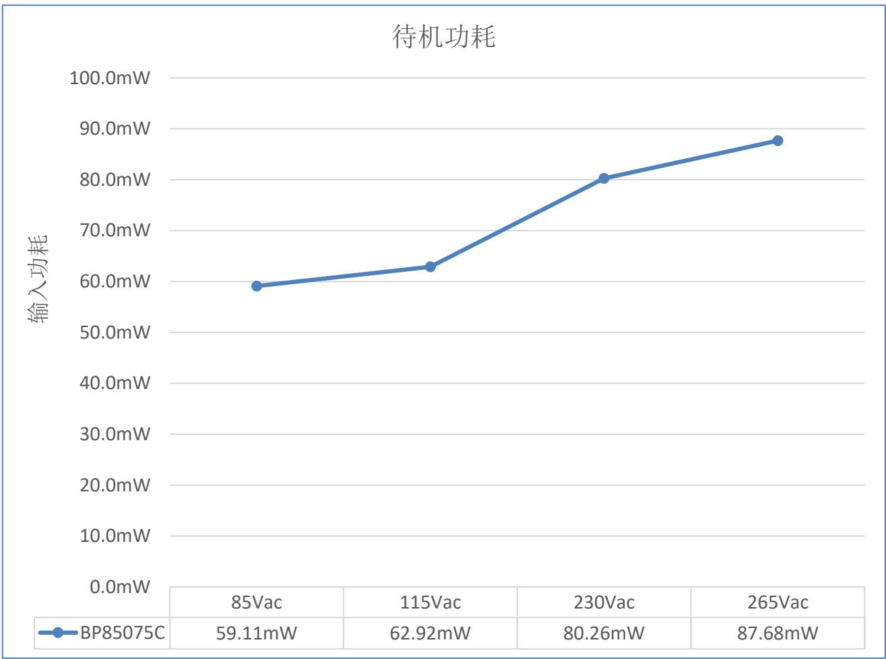

## 满载效率

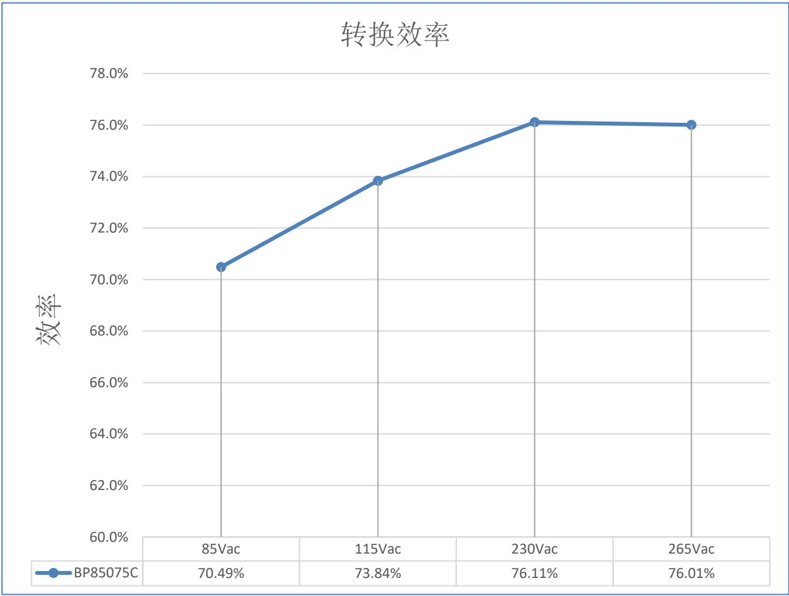

输出电压调整率

<table><tr><td colspan="2">IOUT(mA)\VIN(Vac)</td><td colspan="2">85Vac</td><td colspan="2">115Vac</td><td colspan="2">230Vac</td><td colspan="2">265Vac</td><td colspan="2">线性调整率</td></tr><tr><td>5V输出带载</td><td>18V输出带载</td><td>5V输出</td><td>18V输出</td><td>5V输出</td><td>18V输出</td><td>5V输出</td><td>18V输出</td><td>5V输出</td><td>18V输出</td><td>5V输出</td><td>18V输出</td></tr><tr><td>0mA</td><td>0mA</td><td>5.033</td><td>18.033</td><td>5.024</td><td>18.021</td><td>5.036</td><td>17.988</td><td>5.036</td><td>17.981</td><td>0.24%</td><td>0.29%</td></tr><tr><td>100mA</td><td>250mA</td><td>4.940</td><td>17.450</td><td>4.940</td><td>17.458</td><td>4.940</td><td>17.386</td><td>4.940</td><td>17.391</td><td>0.00%</td><td>0.41%</td></tr><tr><td>0mA</td><td>250mA</td><td>5.030</td><td>17.454</td><td>5.023</td><td>17.464</td><td>5.036</td><td>17.421</td><td>5.036</td><td>17.419</td><td>0.26%</td><td>0.26%</td></tr><tr><td>100mA</td><td>0mA</td><td>4.941</td><td>17.788</td><td>4.941</td><td>17.764</td><td>4.940</td><td>17.739</td><td>4.941</td><td>17.740</td><td>0.02%</td><td>0.28%</td></tr><tr><td colspan="2">负载调整率</td><td>1.87%</td><td>3.30%</td><td>1.69%</td><td>3.18%</td><td>1.92%</td><td>3.41%</td><td>1.92%</td><td>3.35%</td><td colspan="2"></td></tr></table>

◼ 调整率计算方法：调整率=100%\*(最大值-最小值)/平均值

## EMI

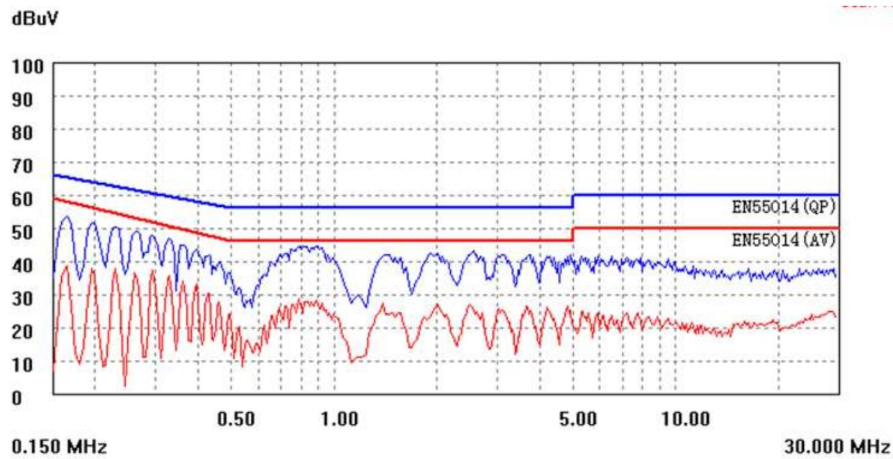

230VAC Line

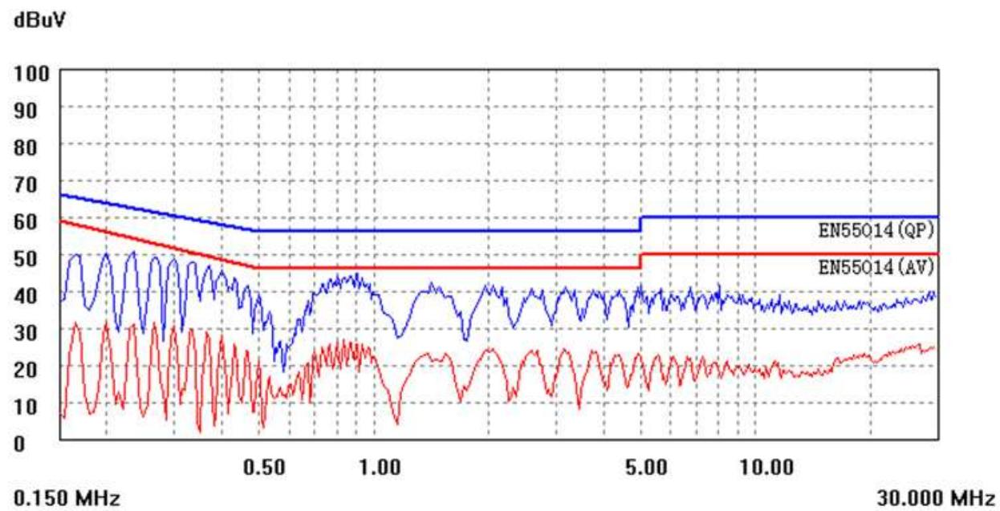

230VAC Neutral

## 温升

<table><tr><td colspan="6">温升测试-常温密闭环境下测试(VIN串22R电阻)</td></tr><tr><td colspan="2">输出带载</td><td>85Vac/60Hz</td><td>115Vac/60Hz</td><td>230Vac/50Hz</td><td>265Vac/50Hz</td></tr><tr><td rowspan="3">5V/100mA, 18V/250mA</td><td>IC温度</td><td>95.64°C</td><td>78.03°C</td><td>76.15°C</td><td>77.69°C</td></tr><tr><td>环境温度</td><td>26.15°C</td><td>25.80°C</td><td>25.59°C</td><td>25.56°C</td></tr><tr><td>IC温升</td><td>69.49°C</td><td>52.23°C</td><td>50.56°C</td><td>52.13°C</td></tr><tr><td rowspan="3">5V/100mA, 18V/200mA</td><td>IC温度</td><td>76.25°C</td><td>72.26°C</td><td>69.75°C</td><td>69.96°C</td></tr><tr><td>环境温度</td><td>25.70°C</td><td>26.21°C</td><td>25.88°C</td><td>25.33°C</td></tr><tr><td>IC温升</td><td>50.55°C</td><td>46.05°C</td><td>43.87°C</td><td>44.63°C</td></tr></table>

BP85075C方案  
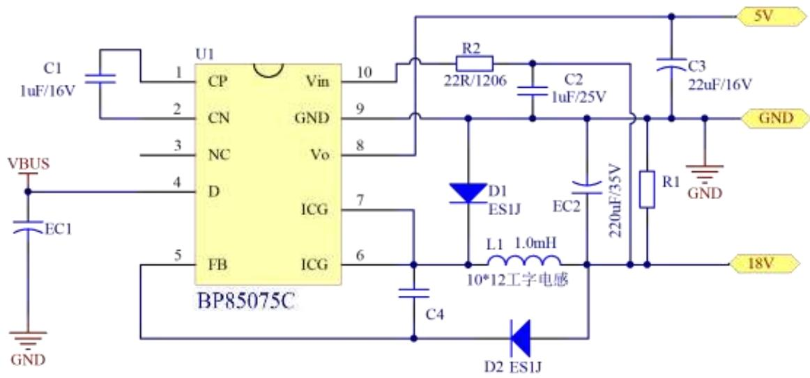

普通方案  
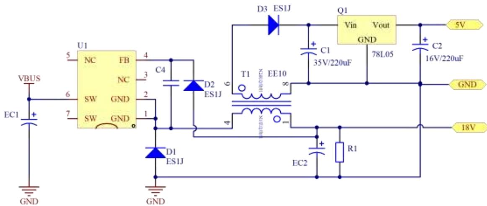

<table><tr><td>IC型号</td><td>BP85075C方案</td><td>普通方案</td></tr><tr><td rowspan="5">差异器件</td><td>C1:贴片电容_1uF/16V</td><td>C1:电解电容_220uF/35V</td></tr><tr><td>C2:贴片电容_1uF/25V</td><td>C2:电解电容_220uF/16V</td></tr><tr><td>C3:电解电容_22uF/16V</td><td>D3:贴片二极管_ES1J</td></tr><tr><td>R2:贴片电阻_22R/1206</td><td>Q1:LDO_78L05</td></tr><tr><td>L1:10*12工字电感或单绕组EE10变压器</td><td>T1:EE10变压器-1mH(N2:0.2mm*166TN1:0.13mm*83T)</td></tr><tr><td colspan="3">BP85075C方案:18V输出空载时,5V输出最大能带载150mA;普通方案:18V输出空载时,5V输出无法带重载。</td></tr></table>

上海市浦东新区申江路5005弄星创科技广场3号楼9层

+86-21-51870166

sales@bpsemi.com

www.bpsemi.com

  
微信公众号

  
微信视频号
