# BP85221SL BuckBoost参考设计

# (CD43-1mH. -5V/30mA)

时间：2023年9月

'BPS

晶丰明源

## 内容

BP85221SL简介  
电源规格  
电路原理图  
 PCB Layout和实物图  
 BOM  
性能测试数据  
重要声明

## 芯片简介BP85221SL

## 产品特点

集成800V输入整流二极管  
集成550V高压MOSFET  
无外围阻容贴片器件  
输出电感支持0510色环/CD43贴片电感  
全压85-265Vac输入，±5V30mA输出  
SSOP-6 小体积封装

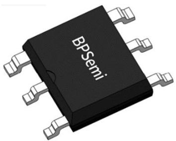

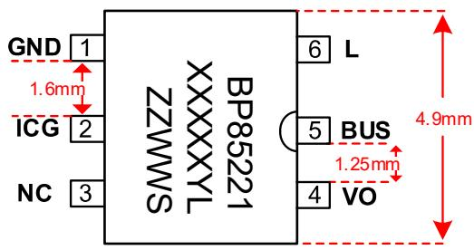

典型应用图（Buck-Boost -5V30mA输出）  
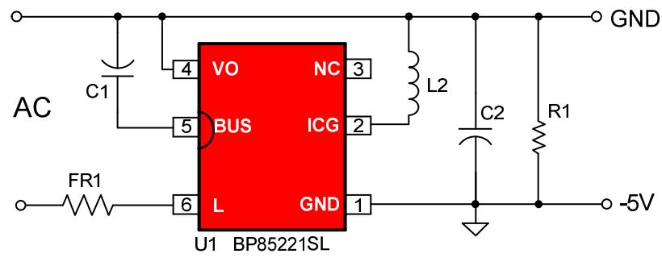

典型应用图（Buck 5V30mA输出）  
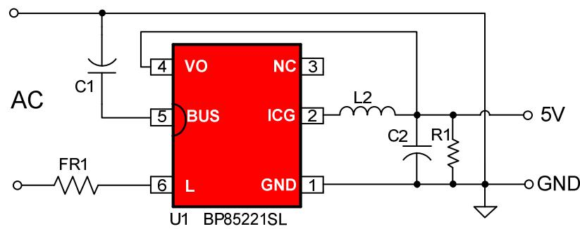

## 电源规格

<table><tr><td>项目描述</td><td>符号</td><td>最小</td><td>典型</td><td>最大</td><td>单位</td><td>备注</td></tr><tr><td colspan="7">输入</td></tr><tr><td>电压</td><td> $V_{IN}$ </td><td>85</td><td></td><td>265</td><td> $V_{AC}$ </td><td></td></tr><tr><td>频率</td><td> $f_{LINE}$ </td><td>47</td><td>50/60</td><td>63</td><td>Hz</td><td></td></tr><tr><td colspan="7">输出</td></tr><tr><td>输出电压</td><td> $V_{OUT}$ </td><td>4.75</td><td>5</td><td>5.25</td><td>V</td><td>±5%</td></tr><tr><td>输出电流</td><td> $I_{OUT}$ </td><td></td><td>30</td><td></td><td>mA</td><td></td></tr><tr><td>输出电压纹波</td><td> $V_{RIPPLE}$ </td><td></td><td></td><td>64.6</td><td>mV</td><td>稳态,20MHz带宽</td></tr><tr><td>连续输出功率</td><td> $P_{OUT}$ </td><td></td><td>0.15</td><td></td><td>W</td><td></td></tr><tr><td colspan="7">效率</td></tr><tr><td>待机功耗</td><td> $P_{STDBY}$ </td><td></td><td></td><td>68.86</td><td>mW</td><td>包含假负载,230VAC</td></tr><tr><td>满载效率</td><td>η</td><td></td><td>45.85</td><td></td><td>%</td><td>满载@230VAC</td></tr><tr><td colspan="7">环境</td></tr><tr><td>Surge</td><td></td><td></td><td>0.7</td><td></td><td>kV</td><td>差模</td></tr><tr><td>EFT</td><td></td><td></td><td>4</td><td></td><td>KV</td><td>5kHz/100kHz/38kHz</td></tr><tr><td>工作环境温度</td><td>TAMP</td><td></td><td>25</td><td></td><td>°C</td><td></td></tr></table>

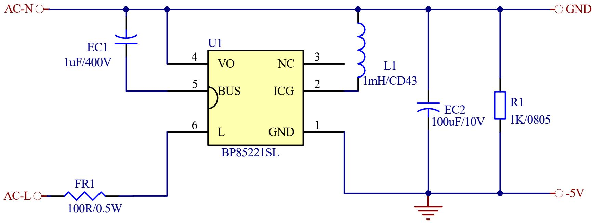

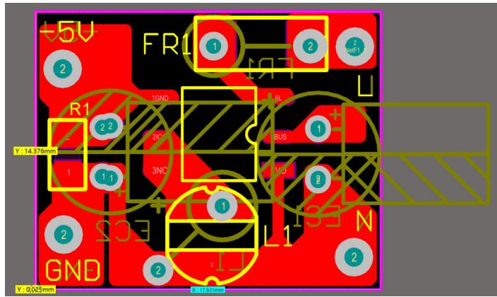

PCB layout

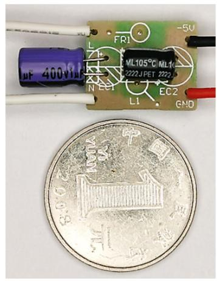

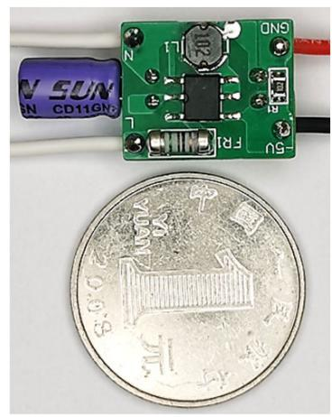

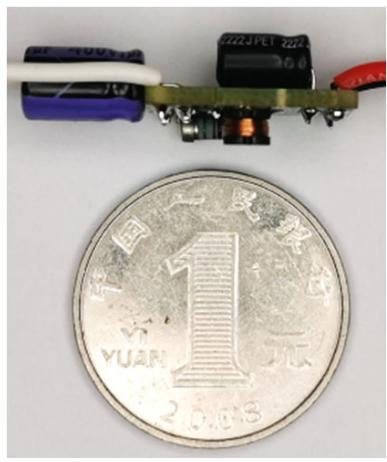

实物图

<table><tr><td>序号</td><td>原件标号</td><td>参数</td><td>描述</td><td>封装尺寸</td><td>数量</td></tr><tr><td>1</td><td>FR1</td><td>100R/0.5W</td><td>绕线电阻</td><td>DIP</td><td>1</td></tr><tr><td>2</td><td>EC1</td><td>1uF/400V</td><td>电解电容</td><td>DIP*6.3*11</td><td>1</td></tr><tr><td>3</td><td>EC2</td><td>100uF/10V</td><td>电解电容</td><td>DIP-5*7</td><td>1</td></tr><tr><td>4</td><td>L1</td><td>1mH</td><td>贴片电感</td><td>CD43</td><td>1</td></tr><tr><td>5</td><td>R1</td><td>1K,±5%</td><td>电解电容</td><td>SMD0805</td><td>1</td></tr><tr><td>6</td><td>U1</td><td>BP85221SL</td><td>芯片</td><td>SSOP6</td><td>1</td></tr><tr><td>总计</td><td></td><td></td><td></td><td></td><td>6</td></tr></table>

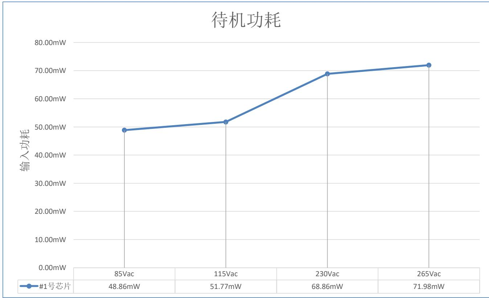

转换效率  
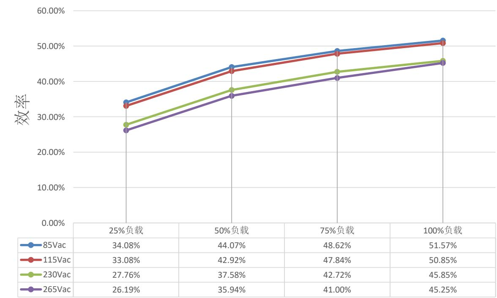

  
调整率- （负载和线性调整率）

<table><tr><td> $V_{IN}$  $I_{OUT}$ </td><td>85Vac</td><td>115Vac</td><td>230Vac</td><td>265Vac</td><td>平均值</td><td>线调整率</td></tr><tr><td>0%负载(0mA)</td><td>5.10V</td><td>5.08V</td><td>5.08V</td><td>5.07V</td><td>5.08</td><td>0.49%</td></tr><tr><td>25%负载(7.5mA)</td><td>5.09V</td><td>5.07V</td><td>5.07V</td><td>5.06V</td><td>5.07</td><td>0.51%</td></tr><tr><td>50%负载(15mA)</td><td>5.08V</td><td>5.07V</td><td>5.06V</td><td>5.06V</td><td>5.07</td><td>0.55%</td></tr><tr><td>75%负载(22.5mA)</td><td>5.08V</td><td>5.06V</td><td>5.05V</td><td>5.05V</td><td>5.06</td><td>0.61%</td></tr><tr><td>100%负载(30mA)</td><td>5.07V</td><td>5.05V</td><td>5.04V</td><td>5.04V</td><td>5.05</td><td>0.59%</td></tr><tr><td>负载调整率</td><td>0.53%</td><td>0.63%</td><td>0.69%</td><td>0.63%</td><td colspan="2">/</td></tr></table>

 调整率计算方法：调整率=100%\*(最大值-最小值)/平均值

## 输出电压纹波

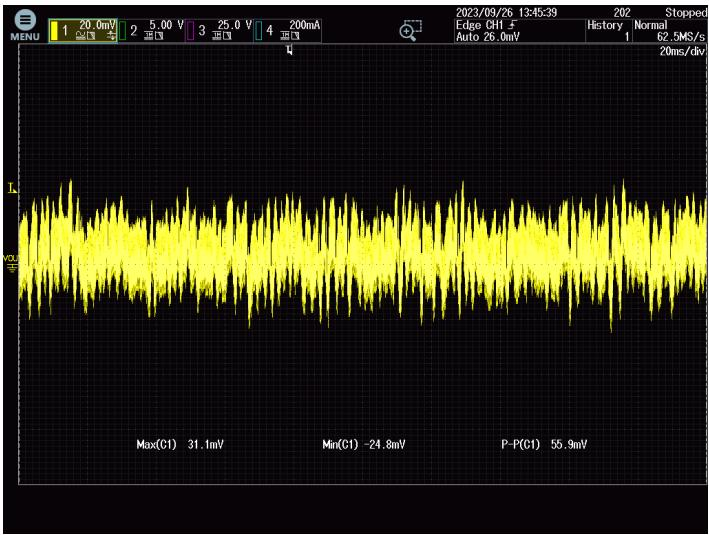

85 VAC

$\begin{array} { r l } { \mathbf { u } } & { { } \mathsf { C H 1 } \mathsf { V _ { O U T } } } \\ { \quad } & { { } \mathsf { V _ { P K - P K } } \mathbf { = } 5 5 . 9 \mathsf { m v } } \end{array}$ CH1 VOUT

## Test Condition:

 No Load (0mA)

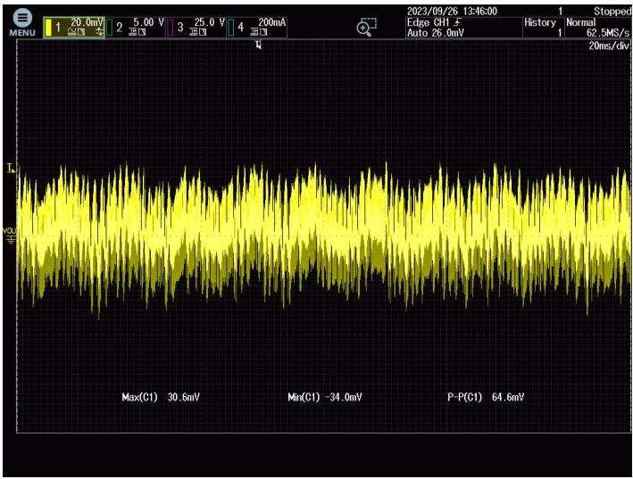

265 VAC

CH1 V $\mathsf { V } _ { \mathsf { O U T } }$ $V _ { P K - P K } = 6 4 . 6 m V$

## Test Condition:

 No Load (0mA)

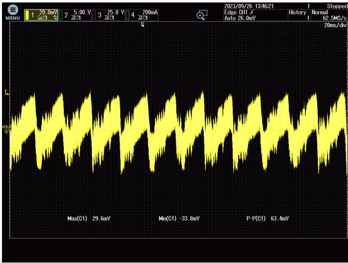

85 VAC

$\begin{array} { r l } { \mathbf { u } } & { { } \mathsf { C H 1 } \mathsf { V _ { O U T } } } \\ { \quad } & { { } \mathsf { V _ { P K - P K } } \mathbf { = } 6 3 . 4 \mathsf { m v } } \end{array}$ CH1 VOUT

## Test Condition:

 Full Load (30mA)

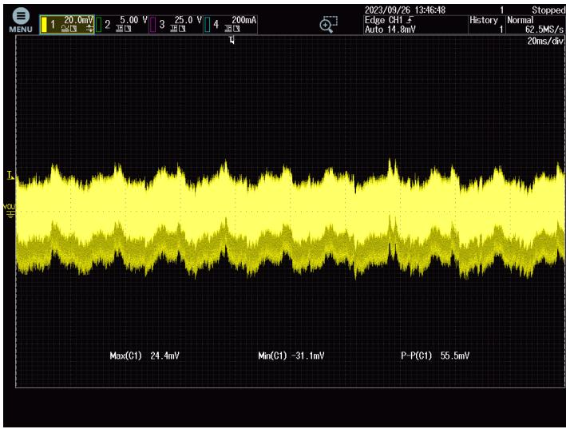

265 VAC

CH1 V $\mathsf { V } _ { \mathsf { O U T } }$ $V _ { P K - P K } = 5 5 . 5 m v$

## Test Condition:

 Full Load (30mA)

动态负载（50%-100%）  
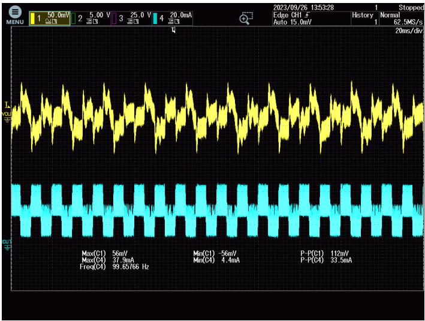

85 VAC

CH1 VOUT  
VPK-PK=112mV  
CH4 IOUT

## Test Condition:

 15mA-30mA-15mA  
 Slew Rate: 0.5 A/μS  
 Frequency: 100 Hz

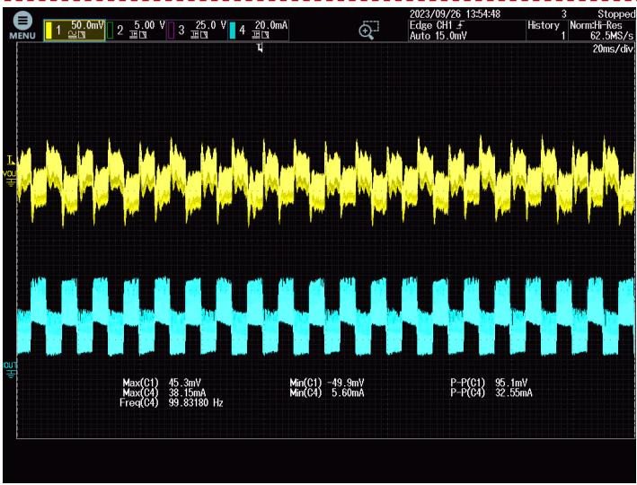

230 VAC

CH1 $\mathsf { V } _ { \mathsf { O U T } }$  
$V _ { P K - P K } = 9 5 . 1 m V$  
CH4 IOUT

## Test Condition:

 15mA-30mA-15mA  
 Slew Rate: 0.5 A/μS  
 Frequency: 100 Hz

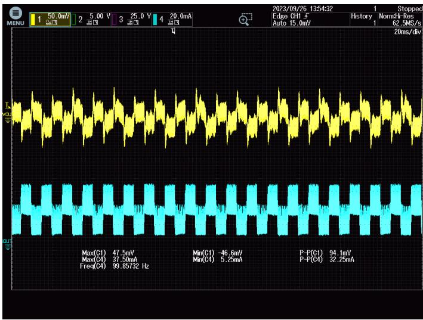

115 VAC

CH1 $\mathsf { V } _ { \mathsf { O U T } }$  
$V _ { \mathsf { P K - P K } } { = } 9 4 . 1 \mathsf { m V }$  
CH4 IOUT

## Test Condition:

 15mA-30mA-15mA  
 Slew Rate: 0.5 A/μS  
 Frequency: 100 Hz

265 VAC

CH1 $\mathsf { V } _ { \mathsf { O U T } }$  
$V _ { p | c - P K } = 9 6 . 4 m v$  
CH4 IOUT

## Test Condition:

 15mA-30mA-15mA  
 Slew Rate: 0.5 A/μS  
 Frequency: 100 Hz

动态负载（10%-90%）  
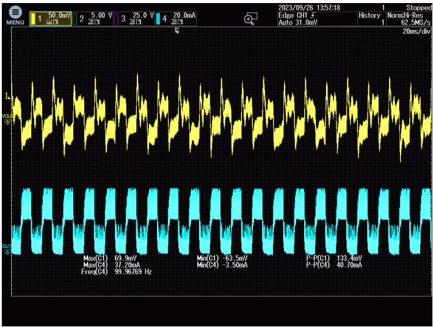

85 VAC

CH1 VOUT  
VPK-PK=133.4mV  
CH4 IOUT

## Test Condition:

 3mA-27mA-3mA  
 Slew Rate: 0.5 A/μS  
 Frequency: 100 Hz

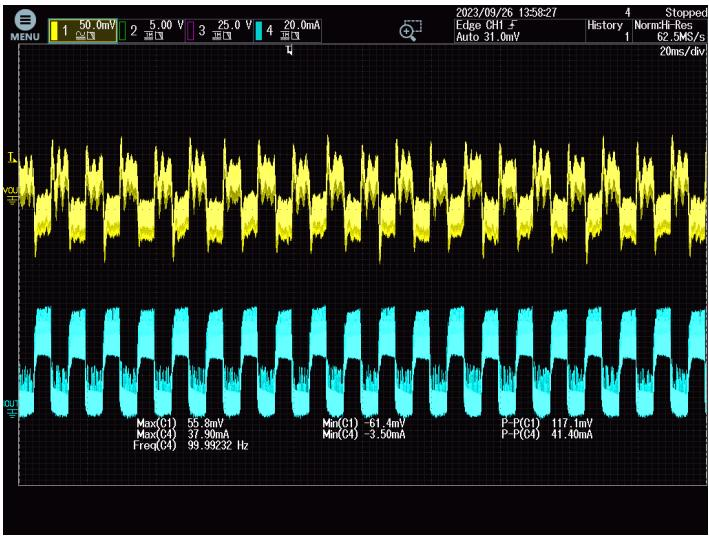

230 VAC

CH1 $\mathsf { V } _ { \mathsf { O U T } }$  
V =117.1mV  
CH4 IOUT

## Test Condition:

 3mA-27mA-3mA  
 Slew Rate: 0.5 A/μS  
 Frequency: 100 Hz

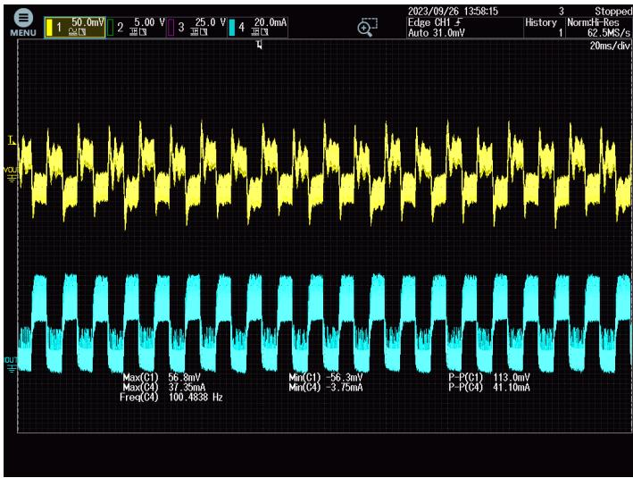

115 VAC

CH1 $\mathsf { V } _ { \mathsf { O U T } }$  
V =113.0mV  
CH4 IOUT

## Test Condition:

 3mA-27mA-3mA  
 Slew Rate: 0.5 A/μS  
 Frequency: 100 Hz

265 VAC

CH1 $\mathsf { V } _ { \mathsf { O U T } }$  
V =121.4mV  
CH4 IOUT

## Test Condition:

 3mA-27mA-3mA  
 Slew Rate: 0.5 A/μS  
 Frequency: 100 Hz

输出电压开机波形  
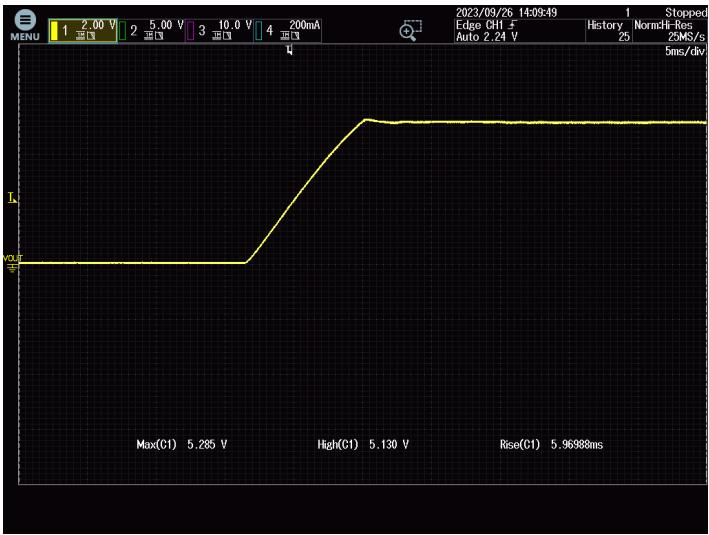

85 VAC

CH1 V T : 5.97mS

## Test Condition:

 No Load(0mA)

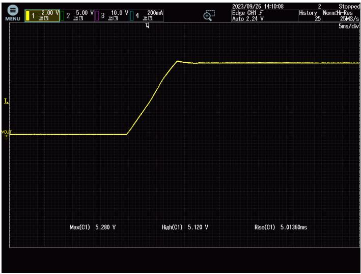

265 VAC

CH1 VOUT-3.3V T DELAY : 5.01mS

## Test Condition:

 No Load(0mA)

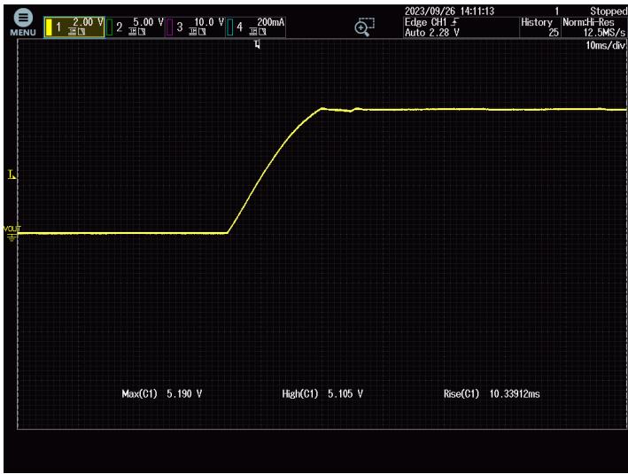

85 VAC

CH1 VOUT T : 10.34mS

## Test Condition:

 Full Load(30mA)

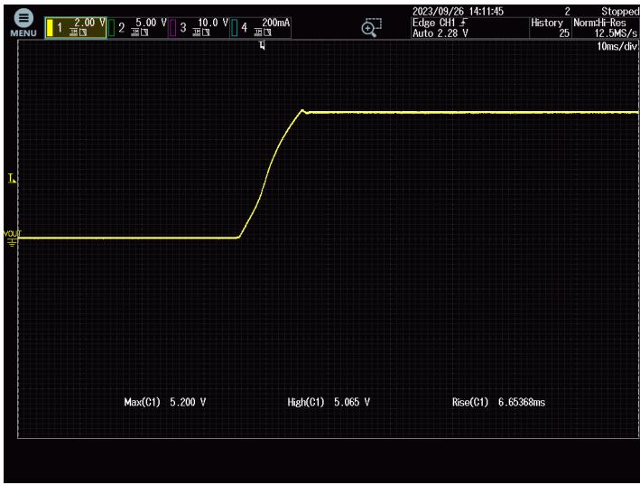

265 VAC

CH1 VOUT-3.3V T : 6.65mS

## Test Condition:

 Full Load(30mA)

输出电压关机波形  
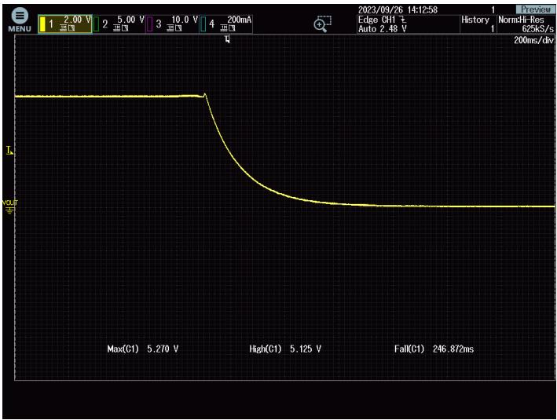

85 VAC

CH1 V T : 246.87mS

## Test Condition:

 No Load(0mA)

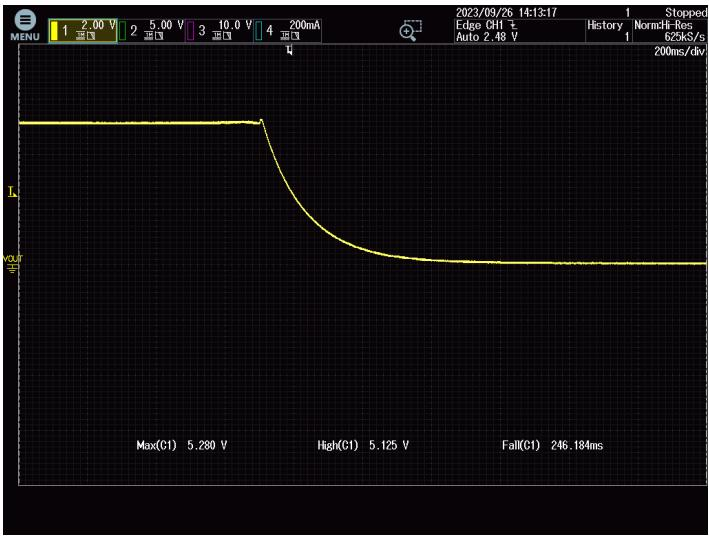

265 VAC

CH1 VOUT-3.3V TFALL: 246.18mS

## Test Condition:

 No Load(0mA)

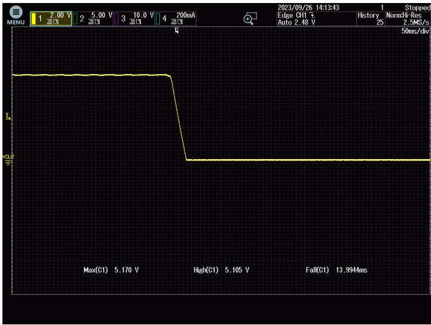

85 VAC

CH1 VOUT $\mathsf { V } _ { \mathsf { O U T } }$ ${ \sf T } _ { \sf F A L L } .$ 13.99mS

## Test Condition:

 Full Load(30mA)

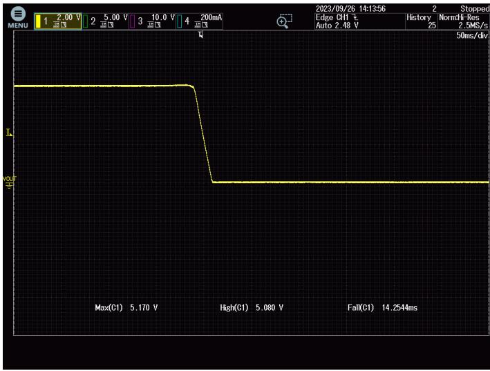

265 VAC

CH1 VOUT-3.3V ${ \mathsf { T } } _ { \mathtt { F A L L } } :$ 14.25mS

Test Condition:  Full Load(30mA)

## 漏源极电压开机波形

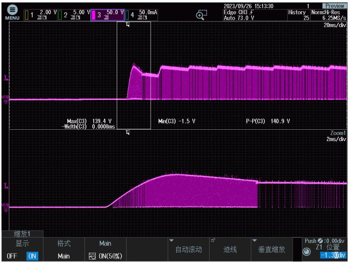

85 VAC

CH3 VDS VMAX: 139.4V

## Test Condition:

 No Load(0mA)

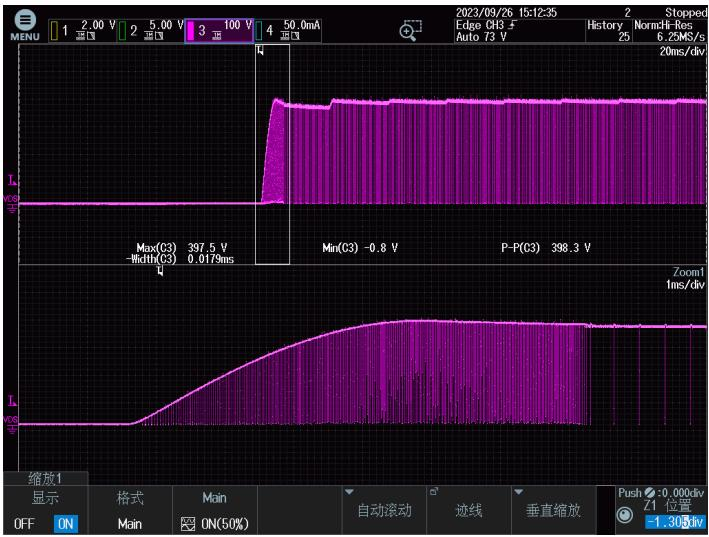

265 VAC

CH3 VDS V :397.5 V

## Test Condition:

 No Load(0mA)

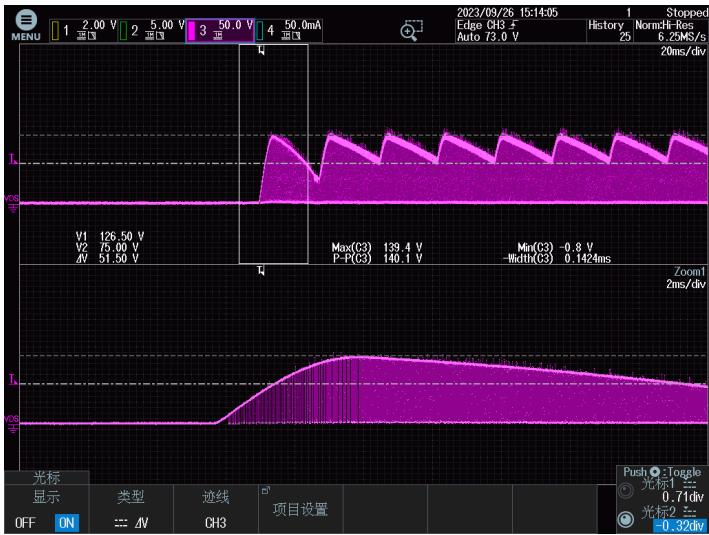

85 VAC

CH3 VDS VMAX: 139.4V

## Test Condition:

 Full Load(30mA)

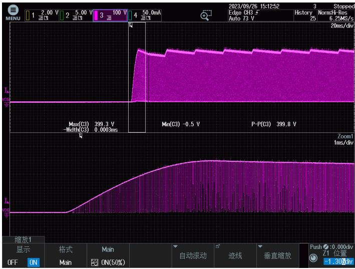

265 VAC

CH3 VDS VMAX: 399.3V

## Test Condition:

 Full Load(30mA)

漏源极电压稳态波形  
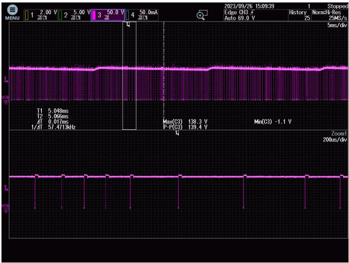

85 VAC  
CH3 VDS VMAX: 138.3V  
Test Condition:  No Load(0mA)

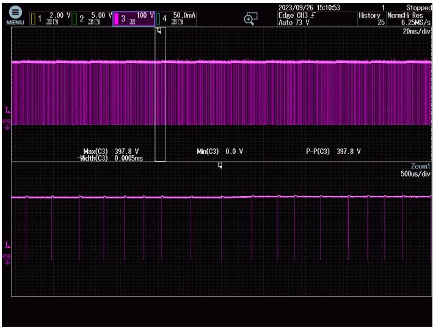

265 VAC  
CH3 VDS V : 397.8V  
Test Condition:  No Load(0mA)

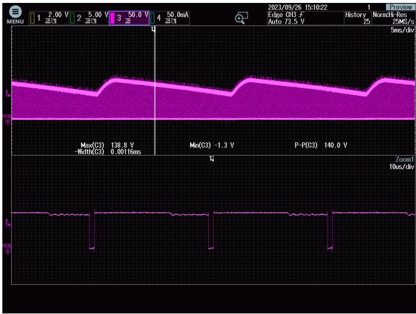

85 VAC

CH3 VDS $\mathsf { V } _ { \mathsf { D } \mathsf { S } }$ VMAX: 138.8V

Test Condition: Full Load(30mA)

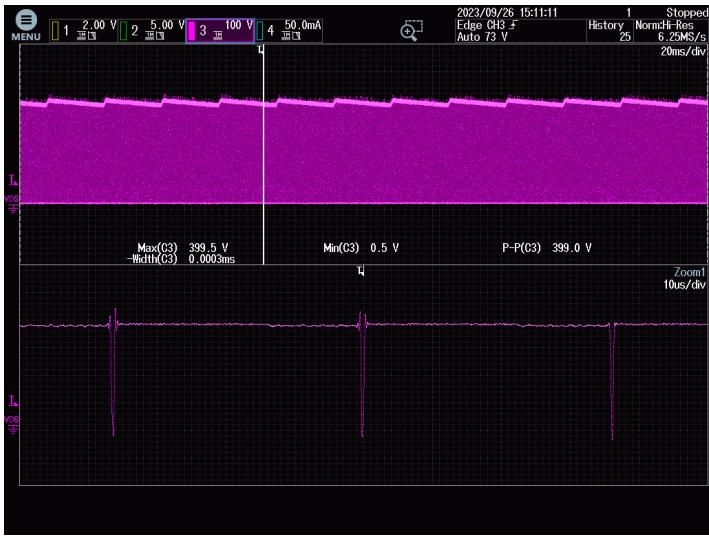

265 VAC  
CH3 V $\mathsf { V } _ { \mathsf { D } \mathsf { S } }$ VMAX: 399.0V  
Test Condition:  Full Load(30mA)

## 电感电流开机波形

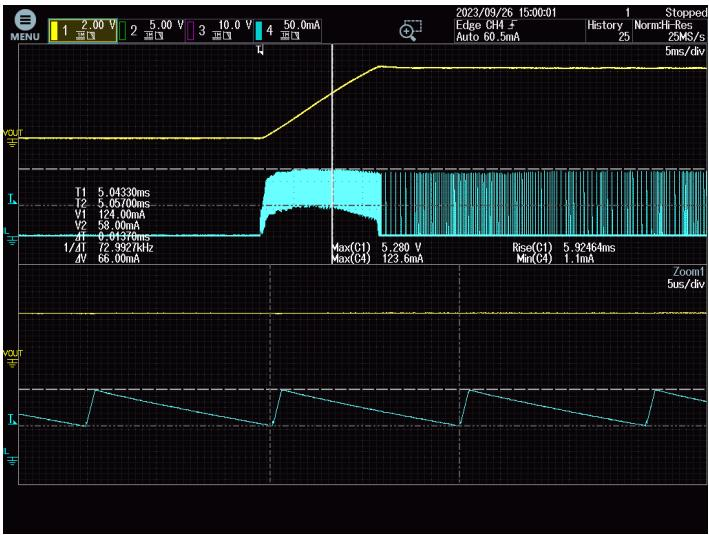

85 VAC

CH4 I Ilimit-max: 124mA

## Test Condition:

 No Load(0mA)

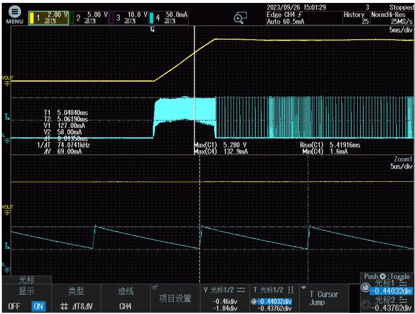

265 VAC

CH4 I Ilimit-max : 127mA

## Test Condition:

 No Load(0mA)

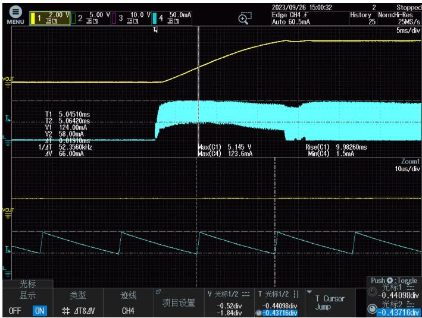

85 VAC

CH4 I Ilimit-max : 124mA

## Test Condition:

 Full Load(30mA)

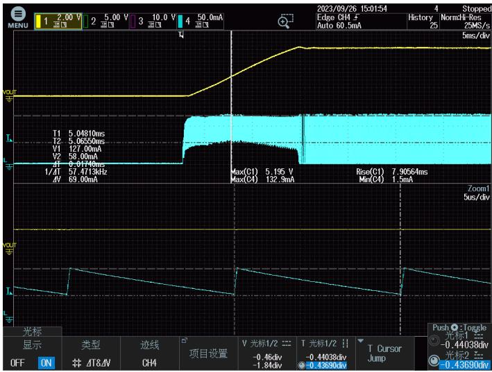

265 VAC

CH4 I Ilimit-max : 127mA

## Test Condition:

 Full Load(30mA)

电感电流稳态波形  
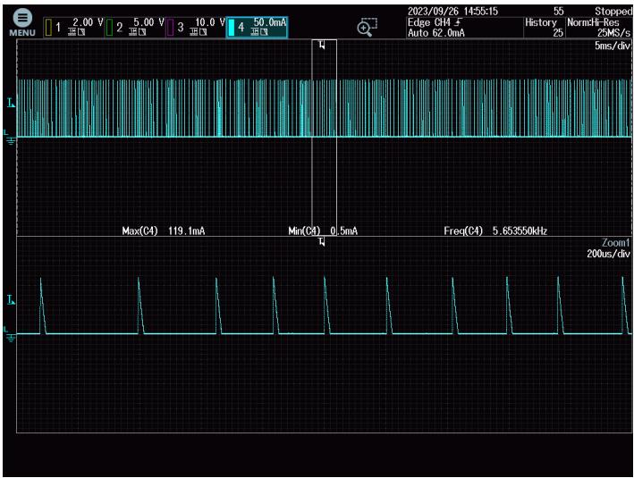

85 VAC

CH4 I I : 119.1mA F :5.65KHz

## Test Condition:

 No Load(0mA)

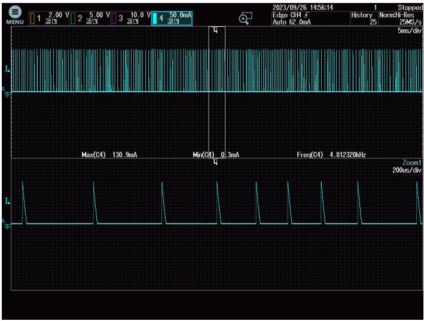

265 VAC

CH4 I Imax: 130.9mA F :4.81KHz

## Test Condition:

 No Load(0mA)

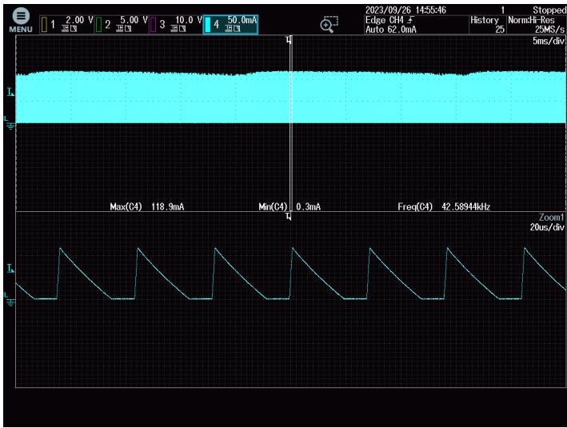

85 VAC

CH4 I I : 118.9mA F :42.59KHz rec

Test Condition: Full Load(30mA)

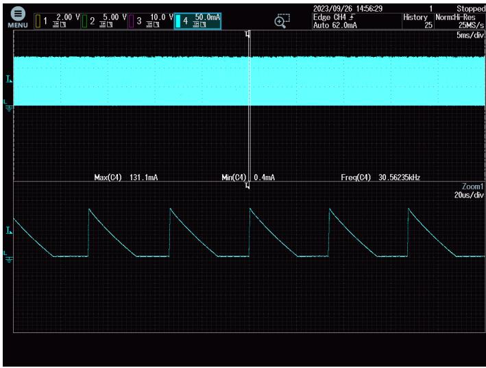

265 VAC

CH4 I I : 131.1mA F :30.56KHz

Test Condition:  Full Load(30mA)

<table><tr><td colspan="4">热成像仪,密闭环境. lo=30mA. L1=1mH</td></tr><tr><td> $V_{IN}(VAC)$ </td><td> $T_{IC} (°C)$ </td><td>Tr(°C)</td><td> $\Delta T(°C)$ </td></tr><tr><td>85</td><td>38.8</td><td>24.5</td><td>14.3</td></tr><tr><td>265</td><td>42.4</td><td>25.1</td><td>17.3</td></tr></table>

## Surge浪涌测试

<table><tr><td>差模</td><td>电压</td><td>相位角</td><td>发生器阻抗</td><td>测试次数</td><td>测试结果</td></tr><tr><td>L to N</td><td>+700V</td><td>0</td><td>2</td><td>10</td><td>Pass</td></tr><tr><td>L to N</td><td>-700V</td><td>0</td><td>2</td><td>10</td><td>Pass</td></tr><tr><td>L to N</td><td>+700V</td><td>90</td><td>2</td><td>10</td><td>Pass</td></tr><tr><td>L to N</td><td>-700V</td><td>90</td><td>2</td><td>10</td><td>Pass</td></tr><tr><td>L to N</td><td>+700V</td><td>180</td><td>2</td><td>10</td><td>Pass</td></tr><tr><td>L to N</td><td>-700V</td><td>180</td><td>2</td><td>10</td><td>Pass</td></tr><tr><td>L to N</td><td>+700V</td><td>270</td><td>2</td><td>10</td><td>Pass</td></tr><tr><td>L to N</td><td>-700V</td><td>270</td><td>2</td><td>10</td><td>Pass</td></tr></table>

## 测试说明

 按照GB/T17626.5和IEC61000-4-5的最新版本要求进行测试  
 室温环境，230VAC输入，满载条件  
 输入1.2/50us组合波浪涌电压  
 每个测试点重复10次  
 每次间隔时间1分钟  
 试验时样机输出正常（符合A类标准）视为Pass

EFT脉冲群测试

<table><tr><td>差模</td><td>电压</td><td>脉冲群持续时间</td><td>脉冲频率</td><td>测试时间</td><td>测试结果</td></tr><tr><td>L to N</td><td>+4kV</td><td>15ms</td><td>5kHz</td><td>120s</td><td>Pass</td></tr><tr><td>L to N</td><td>-4kV</td><td>15ms</td><td>5kHz</td><td>120s</td><td>Pass</td></tr><tr><td>L to N</td><td>+4kV</td><td>0.75ms</td><td>100kHz</td><td>120s</td><td>Pass</td></tr><tr><td>L to N</td><td>-4kV</td><td>0.75ms</td><td>100kHz</td><td>120s</td><td>Pass</td></tr><tr><td>L to N</td><td>+2kV</td><td>2ms</td><td>38kHz</td><td>120s</td><td>Pass</td></tr><tr><td>L to N</td><td>-2kV</td><td>2ms</td><td>38kHz</td><td>120s</td><td>Pass</td></tr><tr><td>L to N</td><td>+4kV</td><td>2ms</td><td>38kHz</td><td>120s</td><td>Pass</td></tr><tr><td>L to N</td><td>-4kV</td><td>2ms</td><td>38kHz</td><td>120s</td><td>Pass</td></tr></table>

## 测试说明

 按照GB/T17626.4和IEC61000-4-4的最新版本要求进行测试  
 室温环境，230VAC输入满载条件  
 分别测试5kHz/100kHz/38kHz脉冲频率  
 脉冲群周期为300ms  
 每个测试条件测试时间120s  
 试验时样机输出正常（符合A类标准）视为Pass

本文档中的数据和信息仅供参考，不构成任何形式的建议、验收标准或保证。实际测试数据和结果可能同文档中列出的数据和结果存在差异，请用户自行确认产品的适用性，此文档供参考评估。

## THANK YOU FOR WATCHING
