# BP85223AL BuckBoost参考设计

# (1mH. -5V/150mA)

时间：2023年3月

'BPS

晶丰明源

# 内容

BP85223AL简介  
电源规格  
 电路图  
 PCB Layout   
 BOM  
变压器参数  
性能测试数据  
重要声明

# BP85223AL简介

集成1600V整流二极管  
集成550V高压MOSFET  
集成高压启动和自供电电路  
集成VCC电容、续流二极管和反馈二极管  
多模式控制技术，低待机功耗  
固定5V输出  
内置软起动功能  
丰富的保护功能

应用领域：

 小家电辅助电源  
电机驱动辅助电源  
 IOT/智能家居/智能照明

Buck:   
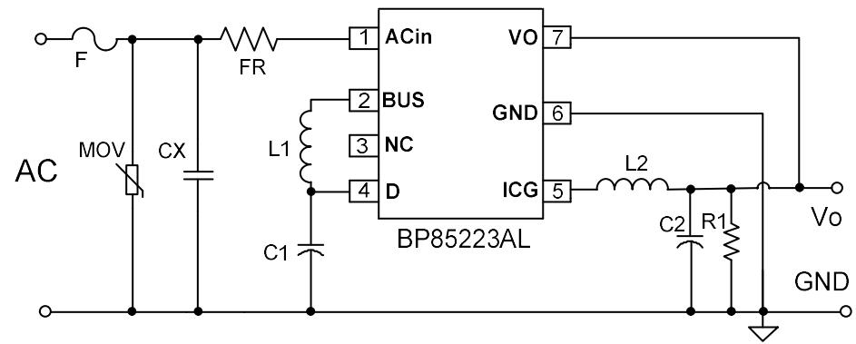

BuckBoost:   
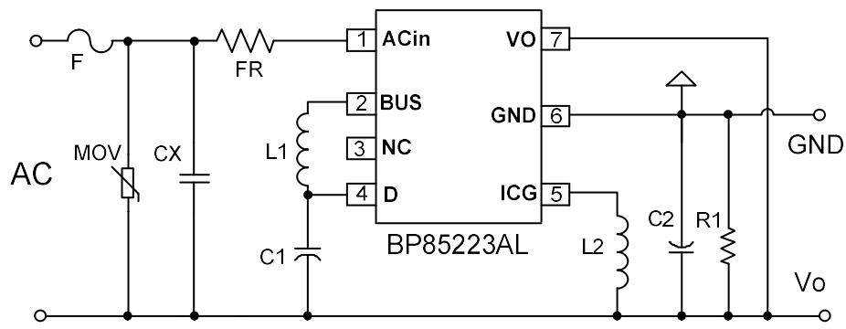

# 电源规格

<table><tr><td>项目描述</td><td>符号</td><td>最小</td><td>典型</td><td>最大</td><td>单位</td><td>备注</td></tr><tr><td colspan="7">输入</td></tr><tr><td>电压</td><td> $V_{IN}$ </td><td>85</td><td></td><td>265</td><td> $V_{AC}$ </td><td></td></tr><tr><td>频率</td><td> $f_{LINE}$ </td><td>47</td><td>50/60</td><td>63</td><td>Hz</td><td></td></tr><tr><td colspan="7">输出</td></tr><tr><td>输出电压</td><td> $V_{OUT}$ </td><td>4.75</td><td>5</td><td>5.25</td><td>V</td><td>±5%</td></tr><tr><td>输出电流</td><td> $I_{OUT}$ </td><td></td><td></td><td>150</td><td>mA</td><td></td></tr><tr><td>输出电压纹波</td><td> $V_{RIPPLE}$ </td><td></td><td></td><td>96.8</td><td>mV</td><td>稳态,20MHz带宽</td></tr><tr><td>连续输出功率</td><td> $P_{OUT}$ </td><td></td><td></td><td>0.75</td><td>W</td><td></td></tr><tr><td colspan="7">效率</td></tr><tr><td>待机功耗</td><td> $P_{STDBY}$ </td><td></td><td></td><td>45.37</td><td>mW</td><td>Vin=230VAC</td></tr><tr><td>满载效率</td><td>η</td><td></td><td>61.65</td><td></td><td>%</td><td>Vin=230VAC</td></tr><tr><td colspan="7">环境</td></tr><tr><td>传导EMI</td><td></td><td colspan="4">满足EN55022 Class B</td><td></td></tr><tr><td>Surge</td><td></td><td></td><td></td><td>1.5</td><td>kV</td><td>无压敏</td></tr><tr><td>EFT</td><td></td><td></td><td></td><td>4</td><td>KV</td><td></td></tr><tr><td>ESD</td><td></td><td></td><td></td><td>20</td><td>KV</td><td>空气放电</td></tr><tr><td>工作环境温度</td><td> $T_{AMP}$ </td><td></td><td>50</td><td></td><td>°C</td><td></td></tr></table>

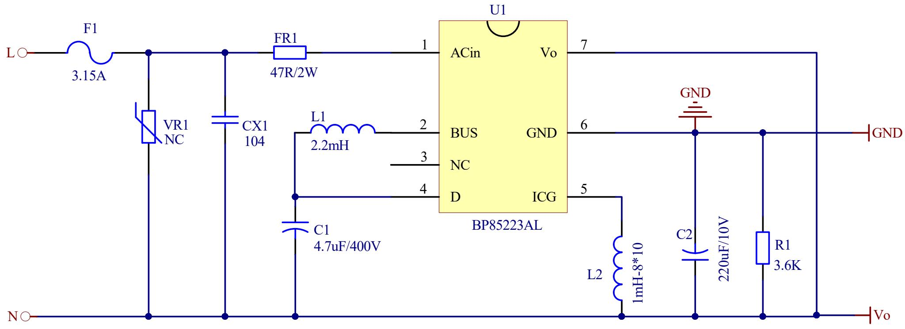

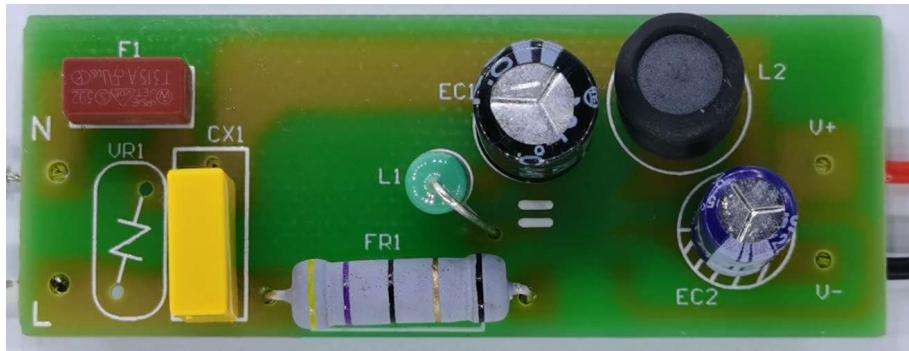

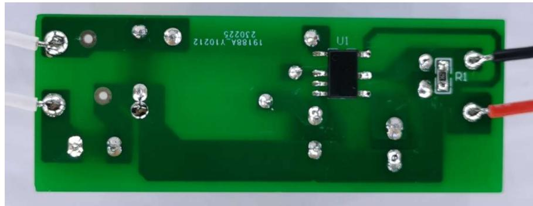

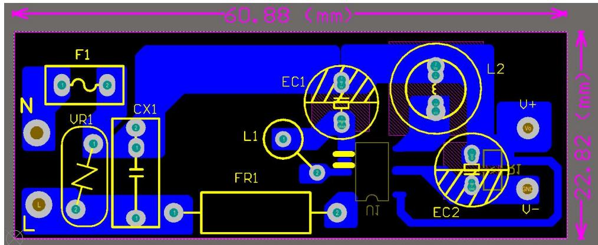

<table><tr><td>序号</td><td>原件标号</td><td>参数</td><td>描述</td><td>封装尺寸</td><td>数量</td></tr><tr><td>1</td><td>FR1</td><td>2W, 47R绕线电阻</td><td>绕线电阻</td><td>DIP</td><td>1</td></tr><tr><td>2</td><td>F1</td><td>3.15A/250V</td><td>保险丝</td><td>DIP</td><td>1</td></tr><tr><td>3</td><td>CX1</td><td>0.1uF/275V</td><td>安规电容</td><td></td><td>1</td></tr><tr><td>4</td><td>C1</td><td>4.7uF/400V</td><td>电解电容</td><td>8*12</td><td>1</td></tr><tr><td>5</td><td>C2</td><td>220uF/10V</td><td>电解电容</td><td>6.3*8</td><td>1</td></tr><tr><td>6</td><td>L1</td><td>2.2mH</td><td>色环电感</td><td>0510</td><td>1</td></tr><tr><td>7</td><td>L2</td><td>1mH</td><td>工字电感</td><td>8*10</td><td>1</td></tr><tr><td>8</td><td>R1</td><td>3.6K-5%</td><td>贴片电阻</td><td>0805</td><td>1</td></tr><tr><td>9</td><td>U1</td><td>BP85223AL</td><td>IC</td><td>ASOP7</td><td>1</td></tr><tr><td>总计</td><td></td><td></td><td></td><td></td><td>9</td></tr></table>

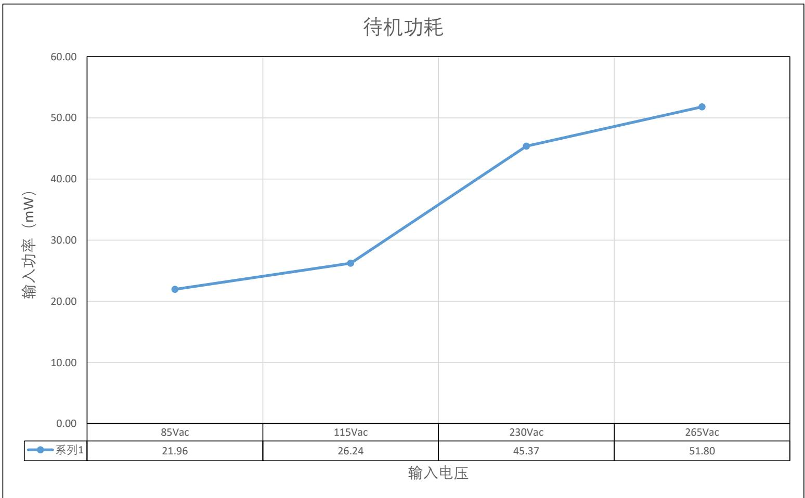

效率测试   
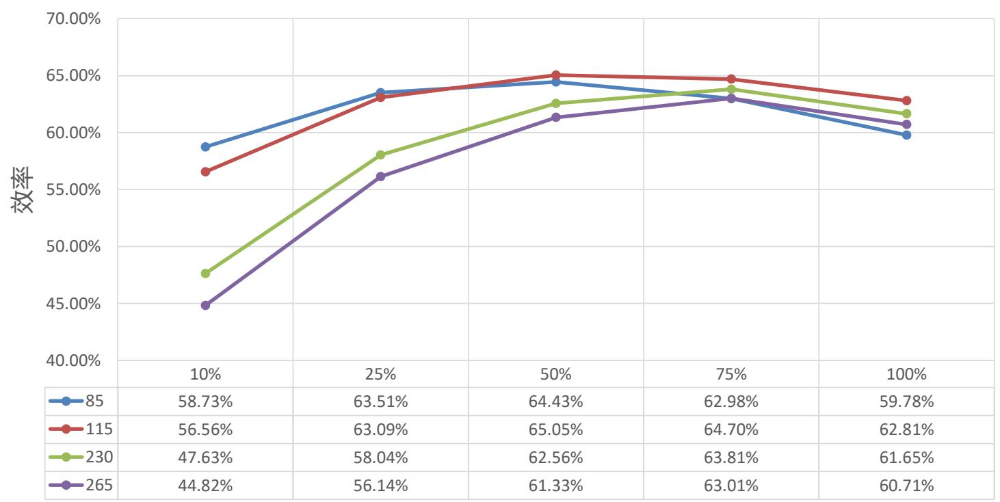

负载比例（满载150mA）

# 输出电压调整率

<table><tr><td> $V_{IN}(VAC)$  $I_{OUT}$ </td><td>85</td><td>115</td><td>230</td><td>265</td><td>平均值</td><td>线调整率(±)</td></tr><tr><td>0mA</td><td>5.15</td><td>5.14</td><td>5.13</td><td>5.12</td><td>5.14</td><td>0.58%</td></tr><tr><td>10%(15mA)</td><td>5.09</td><td>5.09</td><td>5.08</td><td>5.08</td><td>5.09</td><td>0.20%</td></tr><tr><td>25%(37.5mA)</td><td>5.03</td><td>5.03</td><td>5.03</td><td>5.03</td><td>5.03</td><td>0.00%</td></tr><tr><td>50%(75mA)</td><td>5.00</td><td>4.97</td><td>4.98</td><td>4.98</td><td>4.98</td><td>0.60%</td></tr><tr><td>75%(112.5mA)</td><td>4.96</td><td>4.94</td><td>4.94</td><td>4.94</td><td>4.95</td><td>0.40%</td></tr><tr><td>100%(150mA)</td><td>4.93</td><td>4.92</td><td>4.92</td><td>4.93</td><td>4.93</td><td>0.20%</td></tr><tr><td>平均值</td><td>5.03</td><td>5.02</td><td>5.01</td><td>5.01</td><td rowspan="2" colspan="2"></td></tr><tr><td>负载调整率</td><td>4.38%</td><td>4.39%</td><td>4.19%</td><td>3.79%</td></tr></table>

 调整率计算方法：调整率=100%\*(最大值-最小值)/平均值

# 输出启动波形

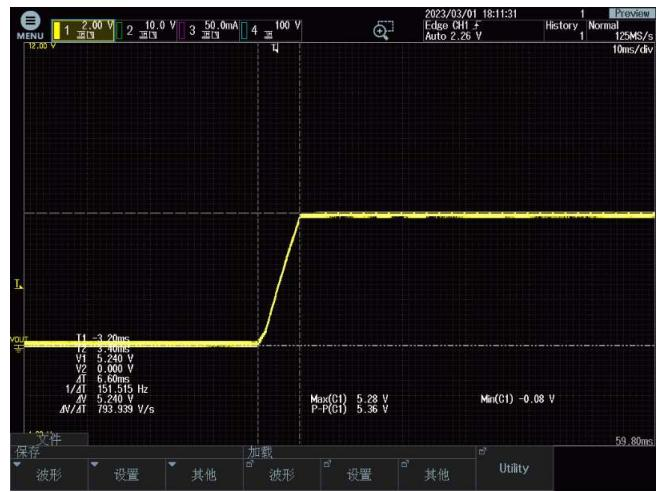

85 VAC

CH1 VOUT TRISE: 6.6 mS

Test Condition:

 No Load(0mA)

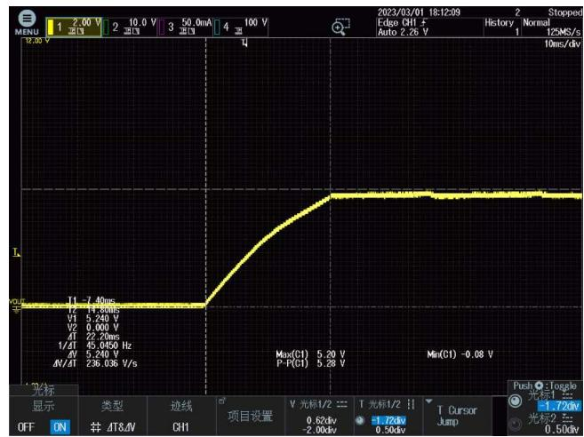

85 VAC

CH1 VOUT $\mathsf { V } _ { \mathsf { O U T } }$ TRISE: 22.2 mS

Test Condition:

 Full Load (150mA)

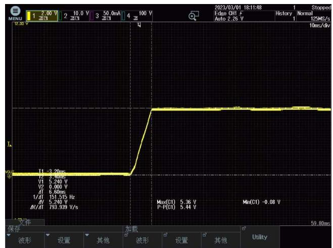

265 VAC

CH1 VOUT TRISE: 6.6 mS

Test Condition:

 No Load(0mA)

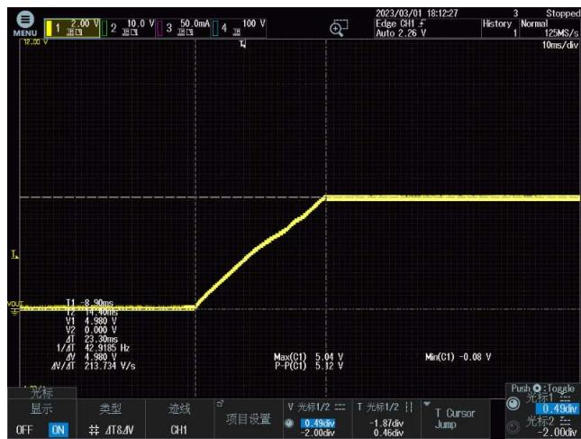

265 VAC

CH1 VOUT $\mathsf { V } _ { \mathsf { O U T } }$ ${ \sf T } _ { \sf R I S E } .$ 23.3 mS

Test Condition:

 Full Load (150mA)

# 开机延时

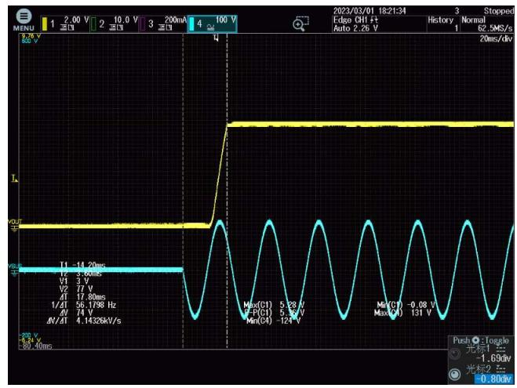  
85 VAC

CH1 $\mathsf { V } _ { \mathsf { O U T } }$   
CH4 V $\mathsf { V } _ { \mathsf { I N } }$ TDELAY: 17.8mS

Test Condition:

 No Load(0mA)

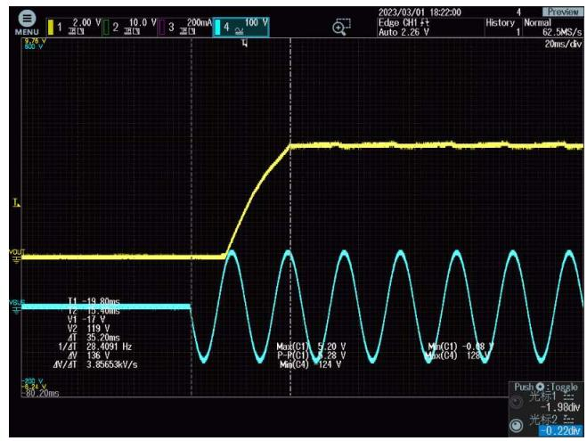

85 $\mathsf { v } _ { \mathsf { A C } }$

CH1 $\mathsf { V } _ { \mathsf { O U T } }$   
CH4 V $\mathsf { V } _ { \mathsf { I N } }$ $\cdot$ 35.2mS

Test Condition:

 Full Load (150mA)

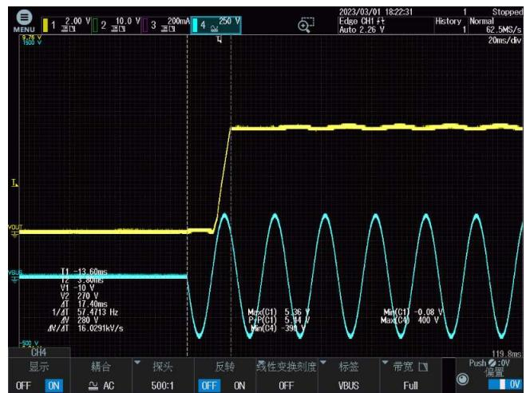

265 VAC

CH1 $\mathsf { V } _ { \mathsf { O U T } }$   
CH4 V $\mathsf { V } _ { \mathsf { I N } }$ TDELAY:17.4 mS

Test Condition:

 No Load(0mA)

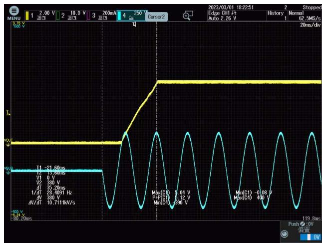

265 $\mathsf { v } _ { \mathsf { A C } }$

CH1 $\mathsf { V } _ { \mathsf { O U T } }$   
CH4 V $\mathsf { V } _ { \mathsf { I N } }$ $\mathsf { T } _ { \mathsf { D E L A Y } } .$ 35.2mS

Test Condition:

 Full Load (150mA)

# 输出电压纹波

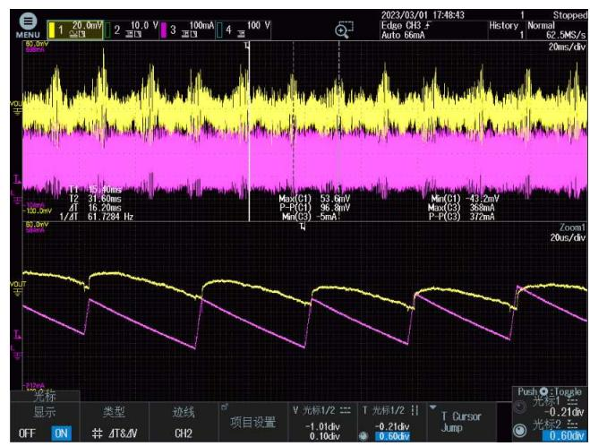

85 VAC

CH1 VOUT   
CH3 IL   
VPK-PK=96.8mV V

Test Condition:

 Full Load   
(150mA)

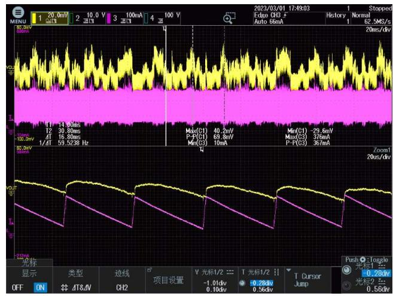

115 VAC

CH1 VOUT   
 CH3 IL  
VPK-PK=69.8mV

Test Condition:

 Full Load   
(150mA)

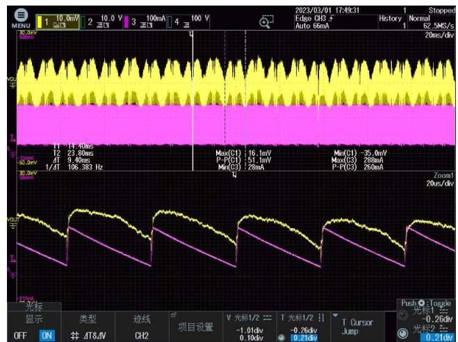

230 VAC

CH1 VOUT   
CH3 IL   
VPK-PK=51.1mV

Test Condition:

 Full Load   
(150mA)

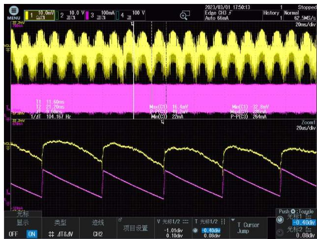

265 VAC

CH1 VOUT   
CH3 IL   
V =49.2mV

Test Condition:

 Full Load   
(150mA)

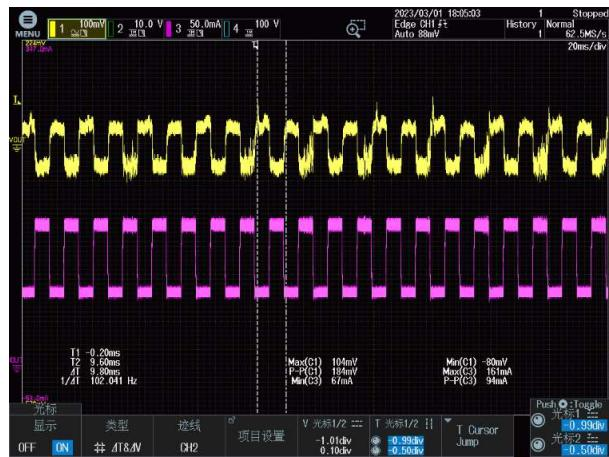

85 VAC

CH1 VOUT   
CH3 Iout

$$
V _ {P K - P K} = 1 8 4 m V
$$

# Test Condition:

 75mA-150mA   
 Slew Rate: 0.5 A/μS   
 Frequency: 100 Hz

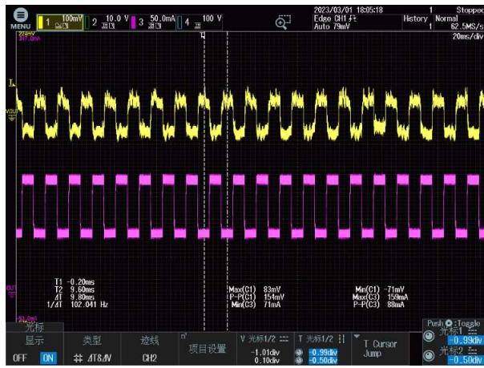

115 VAC

CH1 VOUT ${ \mathsf { C H 1 } } { \mathsf { V } } _ { \mathsf { O U T } }$   
CH3 Iout $\_$

# Test Condition:

 75mA-150mA   
 Slew Rate: 0.5 A/μS   
 Frequency: 100 Hz

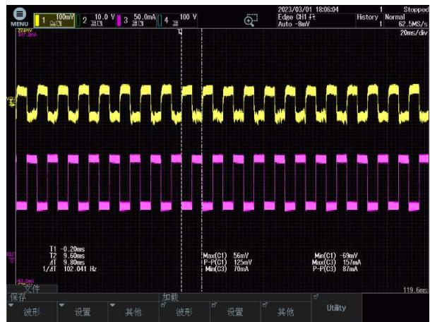

230 VAC

CH1 $\mathsf { V } _ { \mathsf { O U T } }$   
CH3 Iout

$$
V _ {P K - P K} = 1 2 5 m V
$$

# Test Condition:

 75mA-150mA   
 Slew Rate: 0.5 A/μS   
 Frequency: 100 Hz

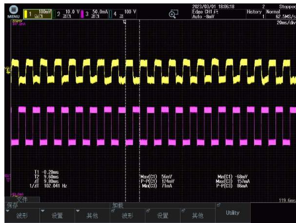

265 VAC

CH1 $\mathsf { V } _ { \mathsf { O U T } }$   
CH3 Iout $\_$

# Test Condition:

 75mA-150mA   
 Slew Rate: 0.5 A/μS   
 Frequency: 100 Hz

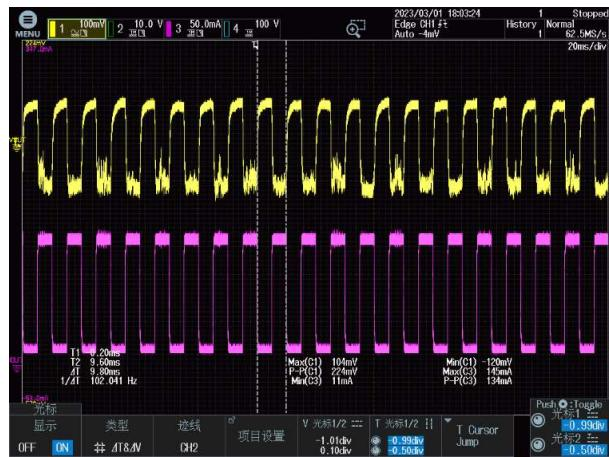

85 VAC

CH1 VOUT   
CH3 Iout

$$
V _ {P K - P K} = 2 2 4 m V
$$

# Test Condition:

 15mA-135mA   
 Slew Rate: 0.5 A/μS   
 Frequency: 100 Hz

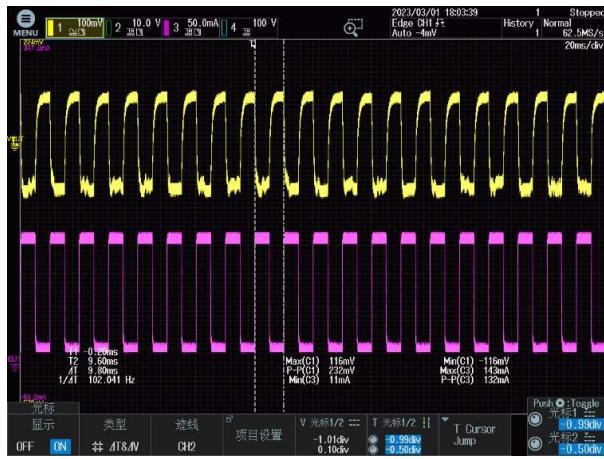

115 VAC

CH1 VOUT ${ \mathsf { C H 1 } } { \mathsf { V } } _ { \mathsf { O U T } }$   
CH3 Iout $\_$

# Test Condition:

 15mA-135mA   
 Slew Rate: 0.5 A/μS   
 Frequency: 100 Hz

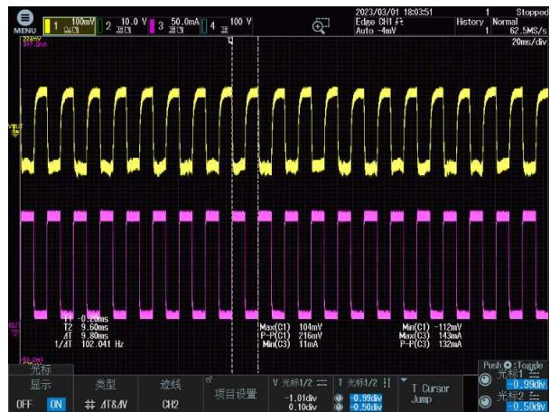

230 VAC

CH1 $\mathsf { V } _ { \mathsf { O U T } }$   
CH3 Iout

$$
V _ {P K - P K} = 2 1 6 m V
$$

# Test Condition:

 15mA-135mA   
 Slew Rate: 0.5 A/μS   
 Frequency: 100 Hz

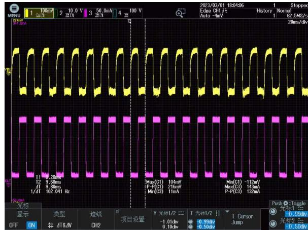

265 VAC

CH1 $\mathsf { V } _ { \mathsf { O U T } }$   
CH3 Iout $\mathsf { V } _ { \mathsf { P K - P K } } { = } 2 1 6 \mathsf { m V }$

# Test Condition:

 15mA-135mA   
 Slew Rate: 0.5 A/μS   
 Frequency: 100 Hz

# 启动时漏极电压/电流波形

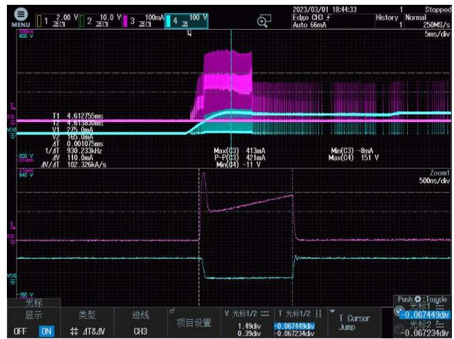

85 VAC

CH3 IDS   
CH4 VDS

正常

Test Condition:

 No Load

(0mA)   
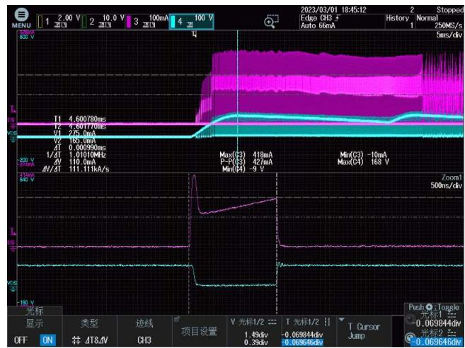

85 VAC

CH3 $\mathsf { I } _ { \mathsf { D } \mathsf { S } }$   
CH4 $\mathsf { V } _ { \mathsf { D } \mathsf { S } }$

正常

Test Condition:

 Full Load

(150mA)   
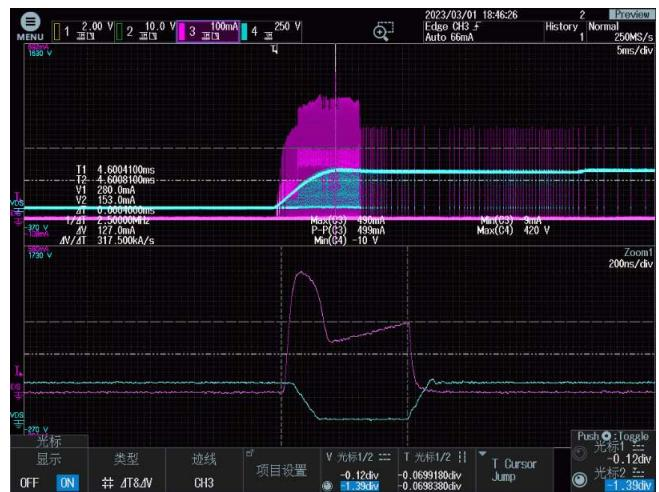

265 VAC

CH3 $\mathsf { I } _ { \mathsf { D } \mathsf { S } }$   
CH4 VDS

正常

Test Condition:

 No Load

(0mA)   
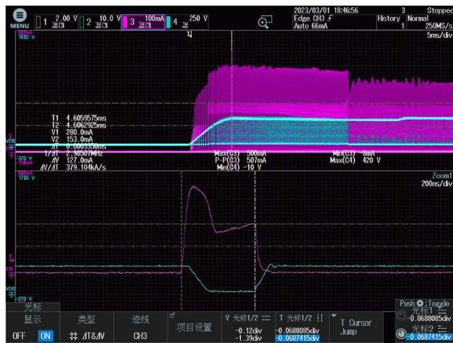  
265 VAC

CH3 $\mathsf { I } _ { \mathsf { D } \mathsf { S } }$   
CH4 $\mathsf { V } _ { \mathsf { D } \mathsf { S } }$

正常

Test Condition:

 Full Load

(150mA)

# 稳态时漏极电压/电流波形

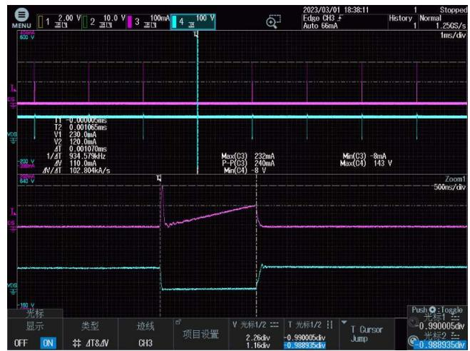

85 VAC

CH3 IDS   
CH4 VDS

正常

Test Condition:

 No Load

(0mA)   
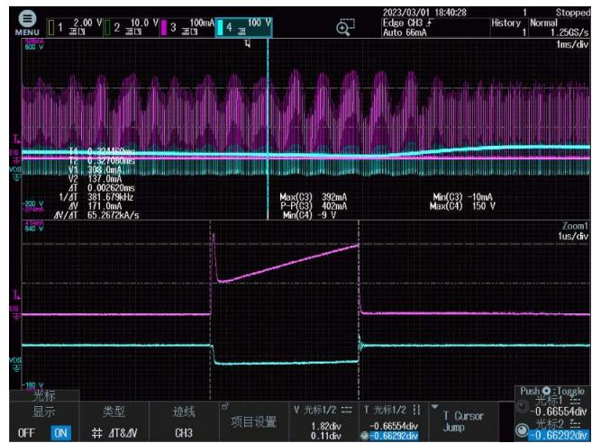

85 VAC

CH3 IDS   
CH4 VDS

正常

Test Condition:

 Full Load

(150mA)   
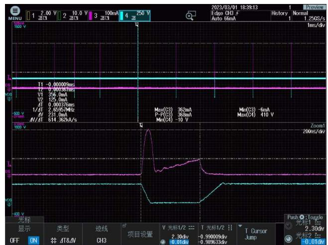

265 VAC

CH3 IDS   
CH4 VDS

正常

Test Condition:

 No Load

(0mA)   
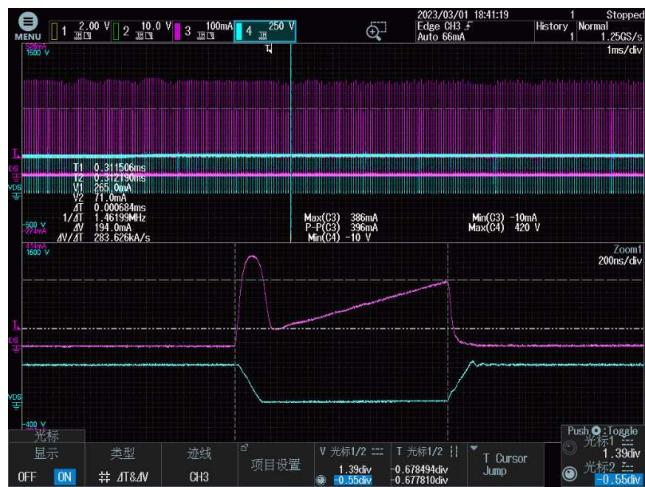

265 VAC

CH3 IDS   
CH4 VDS

正常

Test Condition:

 Full Load

(150mA)

# 稳态时电感电流波形

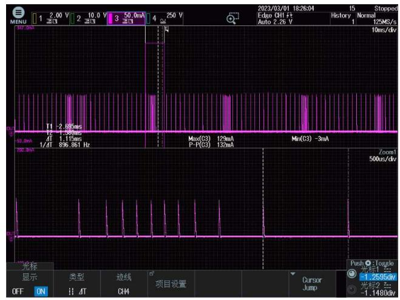

85 VAC

CH3 IL 正常

Test Condition:

 No Load(0mA)

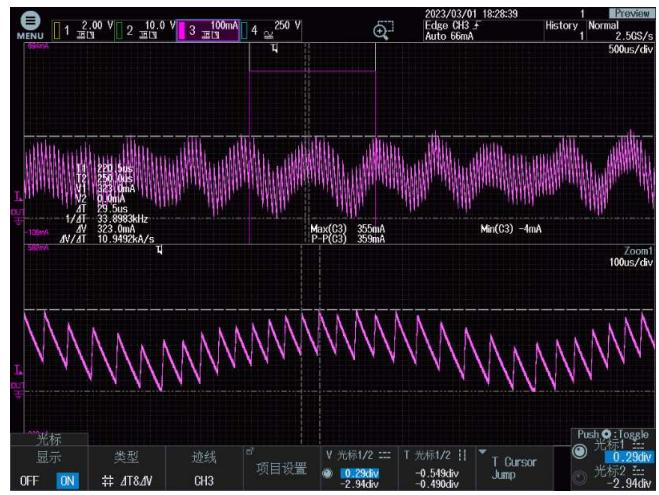

85 VAC

CH3 IL 正常

Test Condition:

 Full Load (150mA)

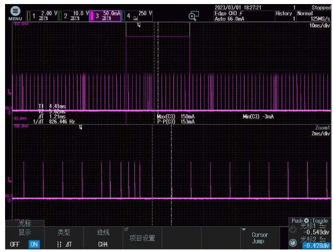

265 VAC

CH3 IL 正常

Test Condition:

 No Load(0mA)

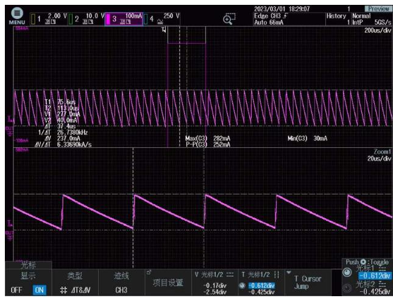

265 VAC

CH3 IL 正常

Test Condition:

 Full Load (150mA)

# 短路保护

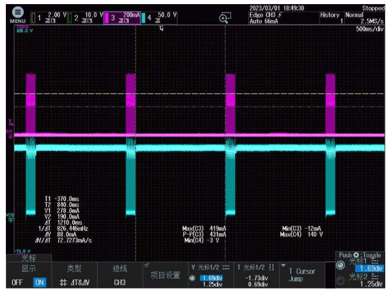

${ \tt S 5 V } _ { \sf A C }$

$C H 3 \mid _ { \mathsf { D S } }$   
CH4 $\mathsf { V } _ { \mathsf { D } \mathsf { S } }$   
 输出短接

保护间隔时间正常

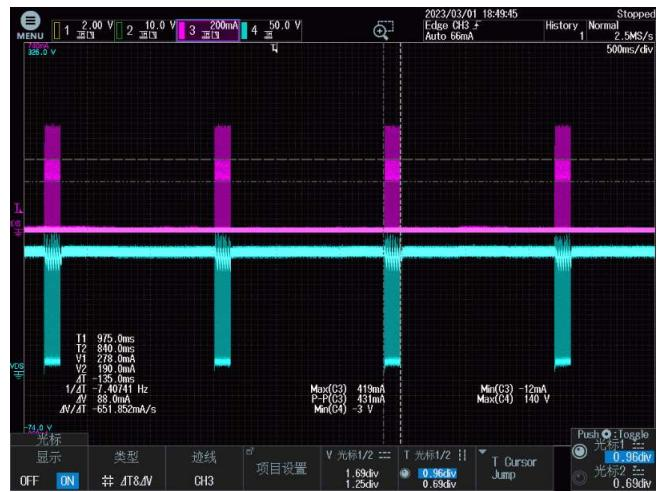

${ \otimes } 5 \mathsf { V } _ { \mathsf { A C } }$

$C H 3 \mid _ { \mathsf { D S } }$   
${ \mathsf { C H } } 4 \vee _ { \mathsf { D S } }$ CH4 V保护触发时间正常  
 输出短接

Test Condition:

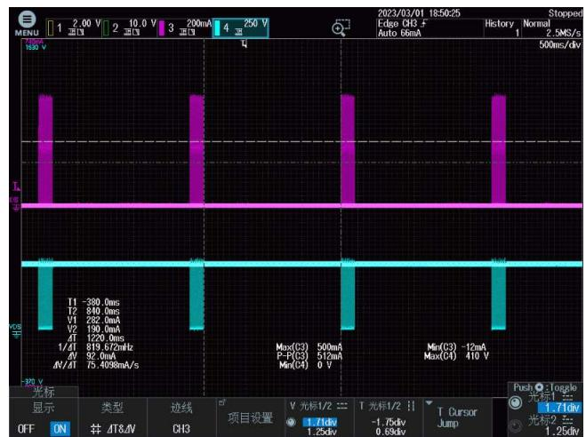

$2 6 5 \ : \mathsf { V } _ { \mathsf { A C } }$

$C H 3 \mid _ { \mathsf { D S } }$   
${ \mathsf { C H } } 4 \ { \mathsf { V } } _ { \mathsf { D S } }$   
 输出短接

保护间隔时间正常

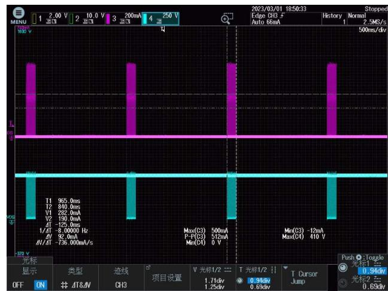  
$2 6 5 \mathsf { V } _ { \mathsf { A C } }$

$C H 3 \mid _ { \mathsf { D S } }$   
CH4 V ${ \mathsf { C H } } 4 \ { \mathsf { V } } _ { \mathsf { D S } }$ 保护触发时间正常  
 输出短接

Test Condition:

# 关机输出波形

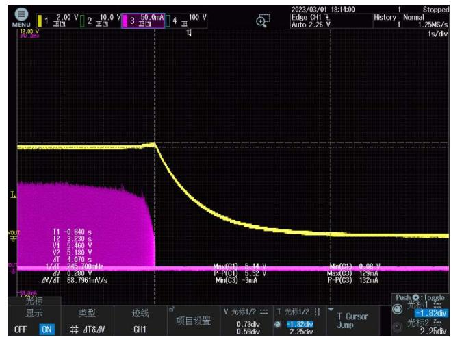

85 VAC

CH1 VOUT   
CH3 IL   
Fall time =4.07s

Test Condition:

 No Load   
(0mA)

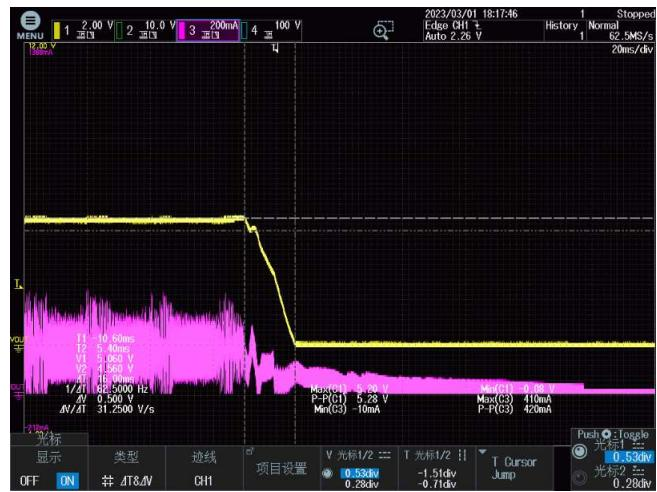

85 VAC

CH1 VOUT   
 CH3 IL  
Fall time =16ms

Test Condition:

 Full Load   
(150mA)

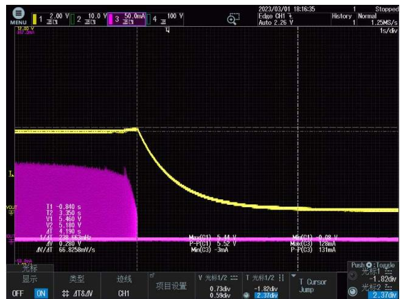

265 VAC

CH1 VOUT   
CH3 IL   
Fall time =4.19s

Test Condition:

 No Load   
(0mA)

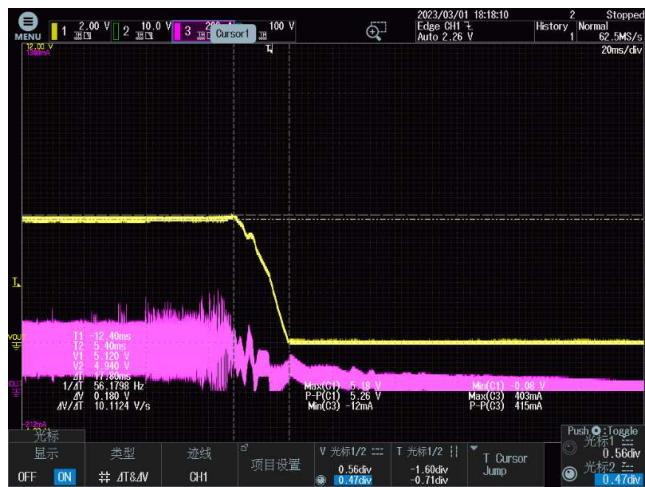

265 VAC

CH1 VOUT   
CH3 IL   
Fall time =17.8ms

Test Condition:

 Full Load   
(150mA)

# 满载温升

<table><tr><td colspan="4">热电偶测温,50°C密闭环境. lo=150mA. L2=1mH</td></tr><tr><td> $V_{IN}(VAC)$ </td><td> $T_{IC} (°C)$ </td><td>Tr(°C)</td><td> $\Delta T(°C)$ </td></tr><tr><td>85</td><td>83.9</td><td>50.7</td><td>33.2</td></tr><tr><td>115</td><td>80.5</td><td>50.7</td><td>29.8</td></tr><tr><td>230</td><td>89.7</td><td>54.3</td><td>35.4</td></tr><tr><td>265</td><td>89.9</td><td>51.8</td><td>38.1</td></tr></table>

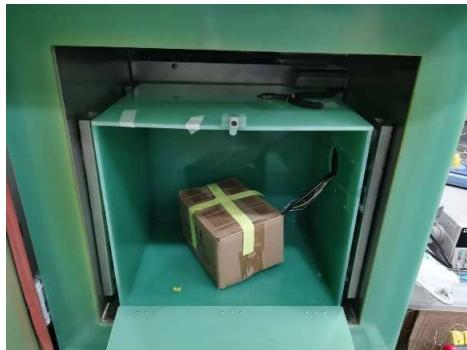

密闭环境

<table><tr><td colspan="4">热电偶测温,75°C半开放环境.  $\mathrm{{Io}} = {150}\mathrm{{mA}}.\mathrm{L}2 = 1\mathrm{{mH}}$ </td></tr><tr><td> ${\mathrm{V}}_{\mathrm{{IN}}}\left( \mathrm{{VAC}}\right)$ </td><td> ${\mathrm{T}}_{\mathrm{{IC}}}\left( {{}^{ \circ }\mathrm{C}}\right)$ </td><td>Tr(°C)</td><td> $\bigtriangleup \mathrm{T}\left( {{}^{ \circ }\mathrm{C}}\right)$ </td></tr><tr><td>85</td><td>103.9</td><td>75.1</td><td>28.8</td></tr><tr><td>115</td><td>100.7</td><td>74.6</td><td>26.1</td></tr><tr><td>230</td><td>103.6</td><td>72.7</td><td>30.9</td></tr><tr><td>265</td><td>108.7</td><td>74.7</td><td>34.0</td></tr></table>

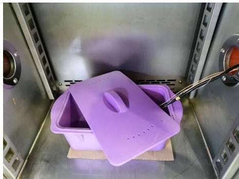

半开放环境

备注：密闭环境（无鼓风）、半开放环境（有鼓风）都是在高温箱中测试。

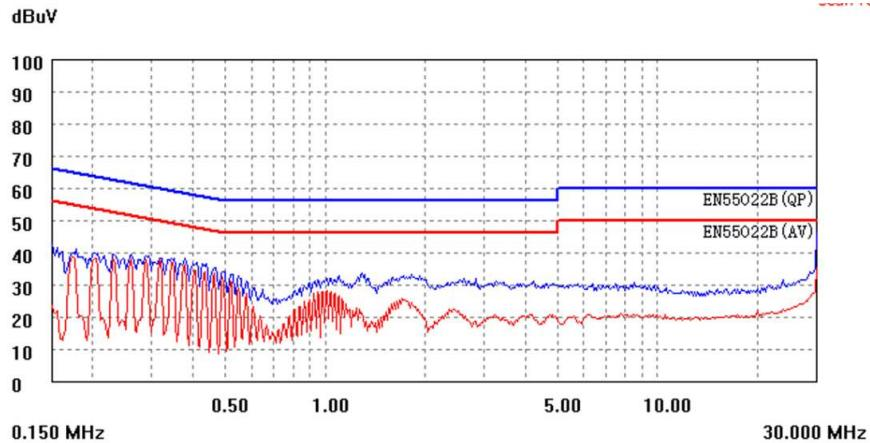

115VAC Line

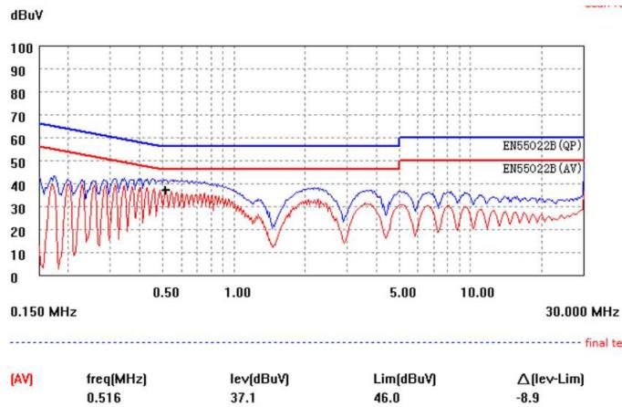

230VAC Line

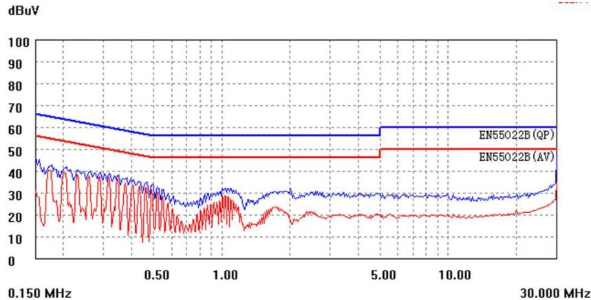

115VAC Neutral

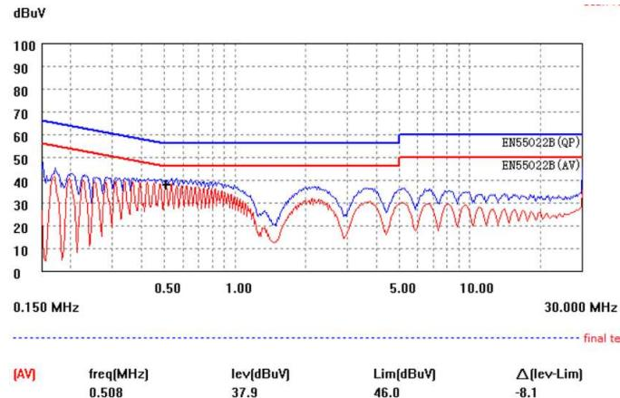

230VAC Neutral

Surge浪涌测试

<table><tr><td>差模</td><td>电压</td><td>相位角</td><td>测试次数</td><td>测试结果</td></tr><tr><td>L to N</td><td>+1.5kV</td><td>0</td><td>10</td><td>Pass</td></tr><tr><td>L to N</td><td>-1.5kV</td><td>0</td><td>10</td><td>Pass</td></tr><tr><td>L to N</td><td>+1.5kV</td><td>90</td><td>10</td><td>Pass</td></tr><tr><td>L to N</td><td>-1.5kV</td><td>90</td><td>10</td><td>Pass</td></tr><tr><td>L to N</td><td>+1.5kV</td><td>180</td><td>10</td><td>Pass</td></tr><tr><td>L to N</td><td>-1.5kV</td><td>180</td><td>10</td><td>Pass</td></tr><tr><td>L to N</td><td>+1.5kV</td><td>270</td><td>10</td><td>Pass</td></tr><tr><td>L to N</td><td>-1.5kV</td><td>270</td><td>10</td><td>Pass</td></tr></table>

备注：以上测试没有加压敏。

# 测试说明

 按照GB/T17626.5和IEC61000-4-5的最新版本要求进行测试  
 室温环境，230VAC输入，满载条件  
 输入1.2/50us组合波浪涌电压   
 每个测试点重复10次  
 每次间隔时间1分钟  
 试验时样机输出正常（符合A类标准）视为Pass

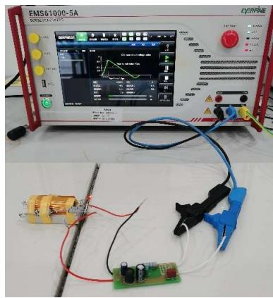

EFT脉冲群测试

<table><tr><td>差模</td><td>电压</td><td>脉冲群持续时间</td><td>脉冲频率</td><td>测试时间</td><td>测试结果</td></tr><tr><td>L to N</td><td>+4kV</td><td>15ms</td><td>5KHz</td><td>120s</td><td>Pass</td></tr><tr><td>L to N</td><td>-4kV</td><td>15ms</td><td>5KHz</td><td>120s</td><td>Pass</td></tr><tr><td>L to N</td><td>+4kV</td><td>0.75ms</td><td>100KHz</td><td>120s</td><td>Pass</td></tr><tr><td>L to N</td><td>-4kV</td><td>0.75ms</td><td>100KHz</td><td>120s</td><td>Pass</td></tr><tr><td>L to N</td><td>+2kV</td><td>1.95ms</td><td>38KHz</td><td>120s</td><td>Pass</td></tr><tr><td>L to N</td><td>-2kV</td><td>1.95ms</td><td>38KHz</td><td>120s</td><td>Pass</td></tr><tr><td>L to N</td><td>+4kV</td><td>1.95ms</td><td>38KHz</td><td>120s</td><td>Pass</td></tr><tr><td>L to N</td><td>-4kV</td><td>1.95ms</td><td>38KHz</td><td>120s</td><td>Pass</td></tr></table>

备注：以上测试没有加压敏。

# 测试说明

 按照GB/T17626.5和IEC61000-4-4的最新版本要求进行测试  
 室温环境，230VAC输入，满载条件  
 分别测试5KHz/100KHz/38KHz  
 脉冲群周期为300ms   
 每个测试条件测试时间120S  
 试验时样机输出正常（符合A类标准）视为Pass

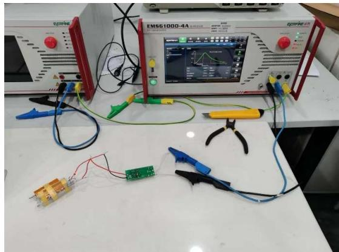

<table><tr><td>测试</td><td>电压(V)</td><td>放电类型</td><td>放电次数</td><td>测试结果</td></tr><tr><td>Vo</td><td>+20kV</td><td>空气放电</td><td>10</td><td>PASS</td></tr><tr><td>Vo</td><td>-20kV</td><td>空气放电</td><td>10</td><td>PASS</td></tr><tr><td>GND</td><td>+20kV</td><td>空气放电</td><td>10</td><td>PASS</td></tr><tr><td>GND</td><td>-20kV</td><td>空气放电</td><td>10</td><td>PASS</td></tr></table>

# 测试说明

 按照GB/T17626.2和IEC61000-4-2的最新版本要求进行测试  
 室温环境，230VAC输入满载条件  
 每个测试点重复10次  
 分别对输出正端和地进行空气放电  
 试验时样机输出正常（符合A类标准）视为Pass

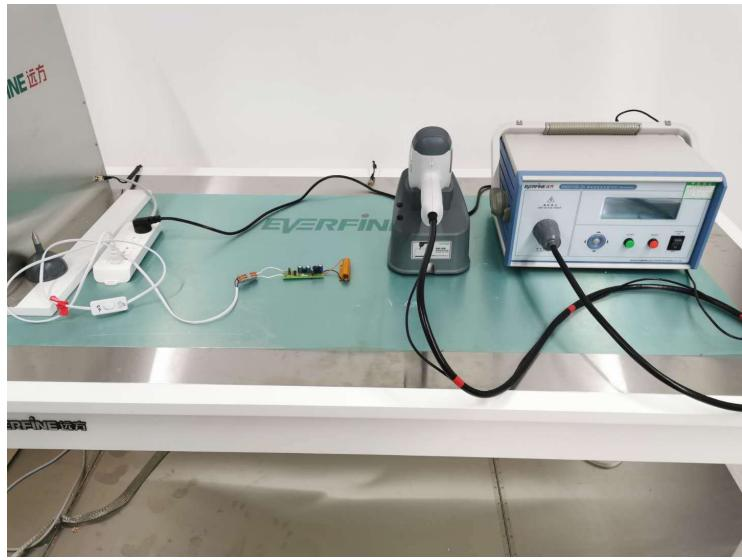

# 重要声明

 本文档中的数据和信息仅供参考，不构成任何形式的建议、验收标准或保证。实际测试数据和结果可能同文档中列出的数据和结果存在差异，请用户自行确认产品的适用性。  
 此文档测试的BP85223AL样品未经CP/FT工序，后续根据批量数据可能微调某些参数，可能略影响性能表现。此文档供参考评估，最终性能表现请以量产版本芯片为准。

上海市浦东新区申江路5005弄星创科技广场3号楼9层

+86-21-51870166

sales@bpsemi.com

www.bpsemi.com

  
微信公众号

  
微信视频号
