# 概述

BP85223AL 是一款高性能、高集成度、低待机功耗的开关电源驱动芯片，适用于全电压85\~265VAC输入的Buck、Buck-Boost 变换器拓扑应用。

BP85223AL 芯片内部集成 1600V 整流二极管、550V 高压MOSFET、高压启动和自供电电路、电流采样电路、电压反馈电路以及续流二极管，采用先进的控制技术，无需外部 VCC电容和环路补偿即可实现优异的恒压输出特性，极大地减少外围器件数量，降低系统成本和体积，提高可靠性。

BP85223AL 芯片采用多模式控制技术，降低系统待机功耗，提高效率和动态性能，减小系统工作在轻载时的噪声。

BP85223AL 提供了丰富的保护功能，包括反馈开路、输出过载保护、逐周期限流、过温保护等，使系统更加安全可靠。

BP85223AL 采用 ASOP-7 封装。

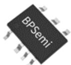  
ASOP-7 封装

# 特点

集成 1600V 整流二极管  
集成 VCC 电容、续流二极管和反馈二极管  
内部集成 550V 高压 MOSFET  
集成高压启动和自供电电路  
内置软启动功能  
低待机功耗 50mW@230Vac   
固定 5V 输出  
多模式控制技术  
优异的动态响应速度，输出电压纹波小  
优异的负载调整率和线性调整率   
保护功能

➢ 输出过载保护(OLP)  
➢ 反馈开路保护  
逐周期限流(Cycle-by-Cycle)   
➢ 过温保护(OTP)

# 应用领域

小家电辅助电源  
电机驱动辅助电源  
IOT/智能家居/智能照明

# 典型应用

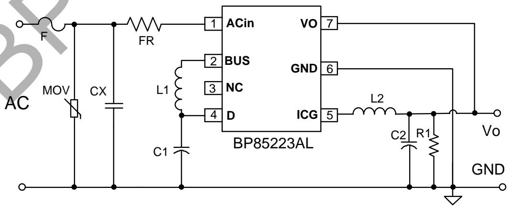

图 1. BP85223AL 典型 Buck 应用电路

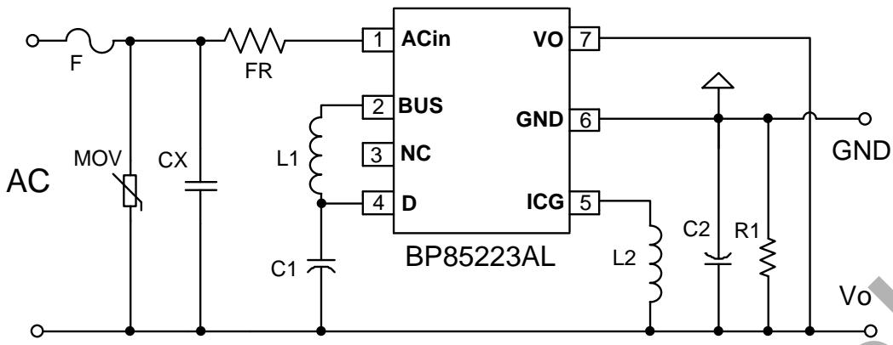

图 2. BP85223AL 典型 Buck-Boost 应用电路

定购信息

<table><tr><td>定购型号</td><td>封装</td><td>包装形式</td><td>打印</td></tr><tr><td>BP85223AL</td><td>ASOP-7</td><td>卷盘5,000只/盘</td><td>BP85223XXXXYLZZWWA</td></tr></table>

# 管脚封装

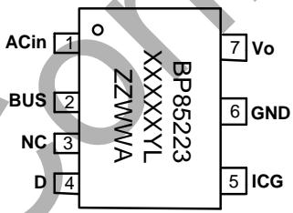

图 3. 管脚封装图

BP85223：产品型号

XXXXXYL: 批次号

ZZ: 标示

WW：周号

A：封装代码（A 代表 ASOP）

管脚描述

<table><tr><td>管脚号</td><td>管脚名称</td><td>描述</td></tr><tr><td>1</td><td>ACin</td><td>内置整流桥二极管阳极,接 AC 端</td></tr><tr><td>2</td><td>BUS</td><td>内置整流桥二极管阴极,接 BUS 电容正端</td></tr><tr><td>3</td><td>NC</td><td>无连接</td></tr><tr><td>4</td><td>D</td><td>内置 MOSFET 漏极,接 BUS 电容正端</td></tr><tr><td>5</td><td>ICG</td><td>芯片地,内置 MOSFET 源极,内置续流二极管阴极</td></tr><tr><td>6</td><td>GND</td><td>输出地,内置续流二极管阳极</td></tr><tr><td>7</td><td>Vo</td><td>输出电压采样端,内置反馈二极管阳极,接输出正极</td></tr></table>

输出规格表

<table><tr><td>型号</td><td>输入电压</td><td>稳态功率(注1)</td><td>峰值功率(注2)</td></tr><tr><td>BP85223AL</td><td>85~265Vac</td><td>0.75W(5V/150mA)</td><td>0.9W(5V/180mA)</td></tr></table>

注 1：稳态功率在半封闭式 75°C 环境下测试(Buck/Buck-boost 应用)，持续时间大于 2 小时。  
注 2：峰值功率在半封闭式 75°C 环境下测试(Buck/Buck-boost 应用)，持续时间大于 1分钟。

极限参数(注 3) （无特别说明情况下，TA =25℃）

<table><tr><td>符号</td><td>参数</td><td>参数范围</td><td>单位</td></tr><tr><td>VACin</td><td>ACin 到 BUS 电压</td><td>-2~1600</td><td>V</td></tr><tr><td>VDS</td><td>内部高压 MOSFET 漏极到源极电压</td><td>-0.3~550</td><td>V</td></tr><tr><td>VGND</td><td>GND 到 ICG 引脚电压</td><td>-600~0.3</td><td>V</td></tr><tr><td>Vo</td><td>Vo 引脚电压 (以 ICG 引脚为参考)</td><td>-600~30</td><td>V</td></tr><tr><td> $P_{DMAX}$ </td><td>最大功耗</td><td>0.45</td><td>W</td></tr><tr><td> $T_J$ </td><td>工作结温范围</td><td>-40 to 150</td><td>°C</td></tr><tr><td> $T_{STG}$ </td><td>储存温度范围</td><td>-55 to 150</td><td>°C</td></tr><tr><td>ESD</td><td>人体模型 ESD(注 4)</td><td>2</td><td>kV</td></tr></table>

注 3：极限参数是指超出该工作范围，芯片有可能损坏。除非特殊说明，电压值均参考芯片ICG。电气参数定义了器件在工作范围内并且在保证特定性能指标的测试条件下的直流和交流电参数规范。对于未给定上下限值的参数，该规范不予保证其精度，但其典型值合理反映了器件性能。  
注 4：按照 JEDEC 标准测试, 100pF 电容通过 1.5KΩ电阻放电。

电气参数(注 5) （无特别说明情况下， ${ \bar { \mathsf { T } } } _ { \mathsf { A } } = 2 5 ^ { \circ } { \mathsf { C } } )$ 

<table><tr><td>符号</td><td>描述</td><td>条件</td><td>最小值</td><td>典型值</td><td>最大值</td><td>单位</td></tr><tr><td colspan="7">电源电压</td></tr><tr><td> $V_{DRAIN_ON}$ </td><td> $V_{DRAIN}$ 开启电压</td><td>Rising</td><td>12</td><td>15</td><td>18</td><td>V</td></tr><tr><td> $I_{OP}$ </td><td> $V_{DRAIN}$ 工作电流</td><td> $V_{DRAIN}=50V$ </td><td></td><td>100</td><td></td><td>uA</td></tr><tr><td> $I_Q$ </td><td> $V_{DRAIN}$ 静态电流</td><td> $V_{DRAIN}=11V$ </td><td></td><td>80</td><td>150</td><td>mA</td></tr><tr><td colspan="7">输出电压反馈</td></tr><tr><td> $V_O$ </td><td>Vo引脚调制电压</td><td></td><td>5.88</td><td>6.00</td><td>6.12</td><td>V</td></tr><tr><td> $V_{O\_OLP}$ </td><td>Vo引脚过载保护电压</td><td></td><td></td><td>2.6</td><td></td><td>V</td></tr><tr><td> $t_{OLP}$ </td><td>输出过载屏蔽时间</td><td></td><td></td><td>2048</td><td></td><td>cycles</td></tr><tr><td> $t_{AR\_OFF}$ </td><td>自动重启间隔时间</td><td></td><td></td><td>1.2</td><td></td><td>s</td></tr><tr><td colspan="7">振荡器</td></tr><tr><td> $f_{S\_MAX}$ </td><td>最大开关频率</td><td></td><td>40</td><td>45</td><td>50</td><td>kHz</td></tr><tr><td> $f_{S\_MIN}$ </td><td>最小开关频率</td><td></td><td></td><td>0.7</td><td></td><td>kHz</td></tr><tr><td> $t_{ON\_MAX}$ </td><td>最大开通时间</td><td></td><td>1.8</td><td></td><td></td><td>us</td></tr><tr><td colspan="7">电流采样</td></tr><tr><td> $I_{LIMIT\_MAX}$ </td><td>最大电流限值</td><td></td><td>250</td><td>280</td><td>310</td><td>mA</td></tr><tr><td> $I_{LIMIT\_MIN}$ </td><td>最小电流限值</td><td></td><td></td><td>110</td><td></td><td>mA</td></tr><tr><td> $t_{LEB}$ </td><td>前沿消隐时间</td><td></td><td></td><td>220</td><td></td><td>ns</td></tr><tr><td colspan="7">功率管</td></tr><tr><td> $R_{DS\_ON}$ </td><td>功率管导通阻抗</td><td> $I_{DS}=100mA$ </td><td></td><td>30</td><td>35</td><td>Ω</td></tr><tr><td> $I_{DSS}$ </td><td>功率管关断漏电流</td><td> $V_{DS}=550V$ </td><td></td><td>10</td><td></td><td>uA</td></tr><tr><td> $BV_{DSS}$ </td><td>功率管击穿电压</td><td> $V_{GS}=0V, I_{DS}=500uA$ </td><td>550</td><td></td><td></td><td>V</td></tr><tr><td colspan="7">续流二极管</td></tr><tr><td> $V_{RRM1}$ </td><td>二极管反向击穿电压</td><td> $I_R=5uA$ </td><td>600</td><td></td><td></td><td>V</td></tr><tr><td> $V_{F1}$ </td><td>二极管正向导通压降</td><td> $I_F=200mA$ </td><td>0.90</td><td>1.15</td><td>1.40</td><td>V</td></tr><tr><td> $I_{FAV1}$ </td><td>最大平均正向导通电流</td><td></td><td>300</td><td></td><td></td><td>mA</td></tr><tr><td> $T_{RR1}$ </td><td>反向恢复时间</td><td> $I_F=500mA,$  $I_R=1.0A, I_{RR}=250mA$ </td><td></td><td></td><td>35</td><td>ns</td></tr><tr><td colspan="7">过热保护</td></tr><tr><td> $T_{OTP}$ </td><td>过温保护阈值</td><td></td><td></td><td>145</td><td></td><td>°C</td></tr><tr><td> $T_{HYST}$ </td><td>过温保护迟滞</td><td></td><td></td><td>40</td><td></td><td>°C</td></tr></table>

注 5：电气参数定义了器件在工作范围内并且在保证特定性能指标的测试条件下的直流和交流电参数规范。最小值和最大值由测试保证，典型值由设计、测试或统计分析保证。对于未给定上下限值的参数，该规范不予保证其精度，但其典型值合理反映了器件性能。

# 内部结构框图

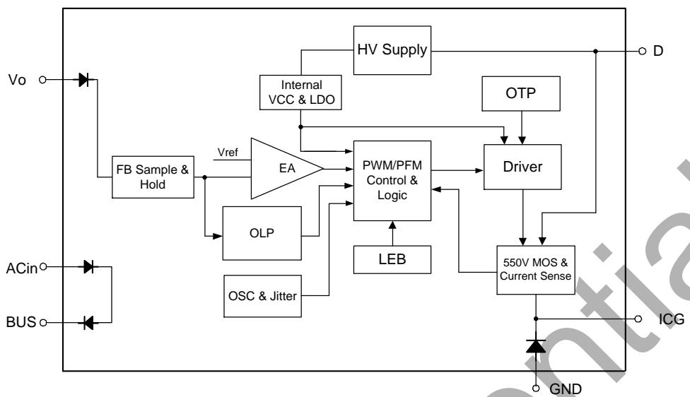

图 4. BP85223AL 内部框图

# 功能描述

BP85223AL 是一款高压输入具有 5V 恒压输出特性的驱动芯片，采用了先进的多模式控制和环路补偿技术，无需外部补偿电路。芯片无需外部 VCC 电容，内部集成 550V 功率开关、续流二极管、高压自供电电路、电流采样电路、电压反馈电路，以及丰富的保护功能，只需要极少的外围器件就可以达到优异的恒压输出特性。开关频率根据电感和负载自适应调整，使电源设计更加灵活。同时，具有较低的待机功耗、良好的输出电压调整率、较低的输出电压纹波和低音频噪声使得 BP85223AL 特别适合于非隔离辅助电源应用。（注 6：以下描述到的参数均为电气参数列表中的典型值，除非特别说明是最大或最小值）

# 高压启动供电

BP85223AL 集成了高压启动与自供电电路，无需外部VCC 电容。系统上电后，母线电压上升，内部高压启动电路通过DRAIN端对内置VCC电容充电。当内置VCC电容电压达到芯片启动阈值 11V 时，芯片内部控制电路开始工作。当内置 VCC 电容电压降低到欠压保护阈值 5V 时，芯片关断内部MOSFET。芯片正常工作时，在MOSFET关断期间自供电电路通过 DRAIN端对内置 VCC电容供电。

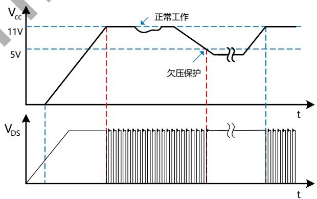  
图 5. 高压启动与 VCC欠压保护时序

# 软启动

BP85223AL具有软启动功能，在软启动过程中，MOSFET峰值电流(限流点)逐渐增加。由于启动时输出电压一般较低，MOSFET 关断期间输出电压对电感的去磁较少，电感电流进入深度连续模式(CCM)，使得续流二极管的反向恢复电流较大。续流二极管反向恢复电流会通过 MOSFET 并产生损耗，过大的电流尖峰还可能会导致 MOSFET 损坏。软启动电路通过控制启动过程中 MOSFET 峰值电流逐渐增加，可以有效降低二极管的反向恢复电流，从而降低

MOSFET 电流应力。由保护电路触发产生的重启动也会经历一次软启动过程。软启动过程如图 6 所示，起始限流值为50%最大限流值，32个开关周期(TS)后增加到75%最大限流值，再持续32个开关周期后结束软启动，限流值变为最大值。

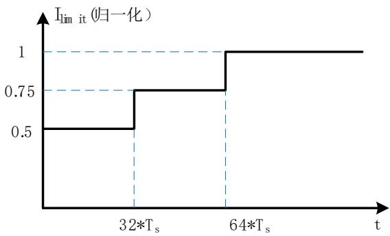

图 6. 软启动过程

# 输出电压采样

BP85223AL 通过 Vo 引脚采样输出电压，经过内置反馈二极管、内部电阻分压后与基准电压运算实现恒压控制。输出电压采样仅在续流阶段 3us 时进行，电感设计时建议保证续流时间大于 7us，以防止无法正确采样输出电压导致工作异常。

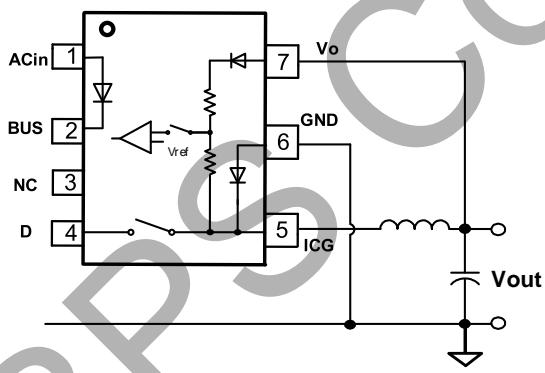

图 7. 输出电压采样示意图

# 多模式控制

BP85223AL 采用 PWM/PFM 多模式控制技术，能有效降低系统待机功耗，提高平均效率，并减小系统工作在轻载时的噪声。采用峰值电流控制模式，具有较快的动态响应速度。如图8所示，重载条件下，芯片工作在PFM模式，

MOSFET 限流点（电感峰值电流）保持最大值 ILIMIT\_MAX不变，开关频率随负载增加而升高，最高为fS\_MAX(45kHz)。随着负载减小，开关频率降低，达到 22kHz 后芯片进入PWM 工作模式。PWM 模式下开关频率保持 22kHz 不变，MOSFET 限流点随负载减小而降低，直到最低限流点ILIMIT\_MIN。轻载条件下再次进入 PFM 模式，MOSFET 限流点保持 ILIMIT\_MIN 不变，开关频率随负载减小继续降低，直到空载条件下，开关频率降低到最小值 fS\_MIN(0.7kHz)。轻载和空载条件下，较小的电感峰值电流在磁芯中产生的磁通密度也相应减小，能有效抑制音频噪声。

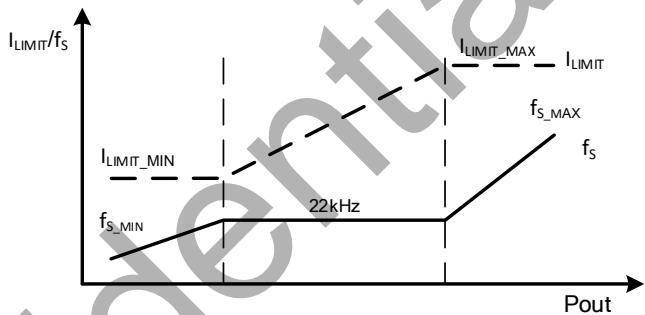

图 8. 控制模式

# 电流检测

BP85223AL 内部集成电流采样电路，对 MOSFET 电流逐周期限制，无需外置电流采样电阻。当一个开关周期开始时，控制电路开通 MOSFET，漏极电流上升，当电流上升达到内部限制值时，控制电路关断 MOSFET，直到下一个开关周期开始。内置前沿消隐(Leading Edge Blanking)时间，tLEB可以避免由于外部电路的容性或二极管的反向恢复导致MOSFET在开通瞬间出现的电流尖峰误触发MOSFET关断。

# 自动重启

当外部故障（输出过载）触发相应的保护，控制电路关断MOSFET，系统停止工作。BP85223AL内部的自动重启电路计时 $\tt t _ { A R \_ O F F }$ (1.2s)后重新启动系统，如果启动后故障没有消除，则重新触发相应的保护。每次重启都会经历软启动过程。

# 过载保护（OLP）

BP85223AL 内部控制电路通过 Vo 引脚检测输出过载故障。如果芯片检测到 Vo 电压低于 $V _ { \mathsf { O _ { \mathsf { - } } O L P } }$ (2.6V)且持续2048 个开关周期，则触发过载保护(OLP)并进入自动重启程序。输出短路也会触发过载保护（OLP）。

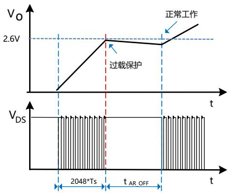

图 9. 过载保护工作模式

# 过温保护

BP85223AL内置了过温保护电路。当结温达到过温保护阈值 TOTP(145℃)时，芯片会停止工作，MOSFET 关断，直到结温下降到 TOTP-THYST 时，芯片重新启动。THYST(40℃)为过温保护迟滞，较大的温度迟滞有利于把系统整体温度控制在较低水平。

# 应用指南

# 开关频率选择

BP85223AL 采用多模式控制，开关频率和电感峰值电流随负载自适应变化，需要根据输出规格选择合适的开关频率以达到设计优化的目的。对于非隔离拓扑，通常输入输出电压相差较大，占空比很小，在一定的开关频率下MOSFET 导通时间短。过短的导通时间使得 MOSFET 没有完全导通而导致较大的损耗，因此需要选择较低的开关频率来增加 MOSFET 导通时间。但是，开关频率过低要求较大的电感，会导致系统体积变大，甚至满载时进入音频范围。对于 BP85223AL，推荐的开关频率为 22kHz。由于 BP85223AL 的输出功率较小，即使适当提高开关频率增加部分损耗，一般也不会造成芯片的严重发热。因此，对于效率要求不高的应用可以适当提高开关频率（比如选择 30\~35kHz）。

# 输出电感计算（Buck 拓扑）

BP85223AL 可工作于 CCM 和 DCM 工作模式，取决于额定输出电流和输出电感感量。当 Buck 变换器输出电流$\lvert \mathsf { o u r } > 0 . 5 ^ { \star } \rvert _ { \mathsf { L I M I T \_ M A X } }$ 时，电感需要工作于 CCM 才能满足负载电流要求；当 $\mathsf { l o u r } < 0 . 5 ^ { \star } | _ { \mathsf { L I M I T \_ M A X } }$ 时，DCM 和 CCM 都可以满足输出负载电流要求，工作模式取决于电感的感量大小。电感感量越大，带载能力越强，因为需要更多圈数，体积也会更大，成本相对高，动态响应较慢，CCM 下开关损耗大。小感量电感可以减小尺寸、降低价格以及改善系统动态响应，CCM 下开关损耗小，但同时会增大电感的峰值电流和输出纹波电压，峰值带载能力也较小。通常，在满足最大输出电流的前提下，尽量选取小电感量。实际选择电感时，通常根据输入输出规格，计算出能满足输出电流的最小电感值，然后从电感供应商的选型手册中选取大一档的标准值电感。因此， $\mathsf { l o u r } > 0 . 5 ^ { \star } | _ { \mathsf { L I M I T \_ M A X } }$ 时按照CCM 计算电感量， $\mathsf { l o u r } < 0 . 5 ^ { \star } | _ { \mathsf { L I M I } , \mathsf { M A X } }$ 时按照 DCM 计算电感量。

CCM 模式下，如图 10 所示，根据输入输出电压、系统开关频率、满载输出电流以及芯片最大限流值计算最小电感值：

$$
L _ {M I N} = \frac {(V _ {O U T} + V _ {D i o d e}) * (V _ {I N} - V _ {D S} - V _ {O U T})}{(V _ {I N} - V _ {D S} + V _ {D i o d e}) * f _ {S} * \Delta I _ {L}}
$$

其中， $V _ { \mathsf { I N } }$ 输入直流母线电压

$\mathsf { V o u r }$ 输出电压

$\mathsf { I o u r }$ 输出电流

$V _ { \sf D i o d e }$ 续流二极管压降

$\mathsf { V } _ { \mathsf { D } \mathsf { S } }$ 开关管 tON时间内平均压降

$\mathsf { f } _ { \mathsf { S } }$ 开关频率

$\tan$ 开关管开通时间

$\tan  F F$ 开关管关断时间

$\mathsf { I } _ { \mathsf { L I M I T } } \mathsf { \Gamma } _ { \mathsf { M A X } }$ 芯片最大限流值

$$
\Delta I _ {L} = 2 * (I _ {L I M I T \_ M A X} - I _ {O U T})
$$

$$
V _ {D S} = I _ {O U T} * R _ {d s (O N)}
$$

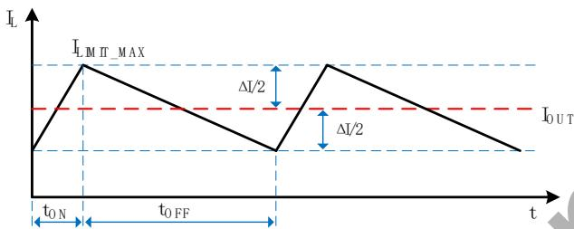

图 10. CCM模式下的电感电流

电感电流有效值为：

$$
I _ {R M S} = \sqrt {I _ {L I M I T \_ M A X} ^ {2} - I _ {L I M I T _ {M A X}} * \Delta I _ {L} + \frac {\Delta I _ {L} ^ {2}}{3}}
$$

DCM 模式下(如图 11 所示)，根据输入/输出电压、系统开关频率、满载输出电流以及芯片最大限流值计算最小电感值：

$$
L _ {M I N} = \frac {2 * I _ {O U T} * (V _ {O U T} + V _ {D i o d e}) * (V _ {I N} - V _ {D S} - V _ {O U T})}{(V _ {I N} - V _ {D S} + V _ {D i o d e}) * f _ {S} * I _ {L I M I T \_ M A X} ^ {2}}
$$

其中，

$$
V _ {D S} = \frac {1}{2} * I _ {L I M I T \_ M A X} * R _ {d s (O N)}
$$

电感电流有效值为：

$$
I _ {R M S} = I _ {L I M I T \_ M A X} * \sqrt {\frac {t _ {O N} + t _ {O F F}}{3} * f _ {S}}
$$

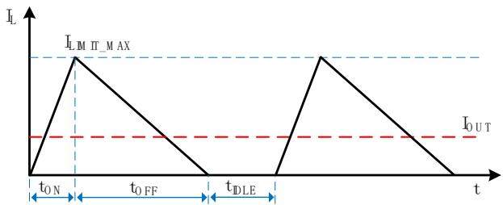

图 11. DCM模式下的电感电流

一般来说， $V _ { \mathsf { I N } }$ 是一个范围，通常选择最大输入直流母线电压代入计算公式，或者也可以分别计算最高和最低母线电压对应的电感量，最后取两者中较大者。上述两个电感表达式计算出来的都是输出额定电流所需的最小电感量，设计中需要考虑实际电感的精度，通常取计算值的 1.1 倍以保证批量生产时能满足最低电感量的要求。表达式中ILIMIT\_MAX 应该取芯片最大限流值的下限。

为了降低待机功耗，减小输出端需要的假负载，

BP85223AL 通过多模式控制降低了空载下的限流点和开关频率。为了使空载时电感电流可控，电感量需要足够大以至于在 MOSFET 最小导通时间内电流峰值不超过芯片最低限流值。即

$$
L \geq \frac {t _ {L E B} * (V _ {I N \_ M A X} - V _ {O U T})}{I _ {L I M I T \_ M I N}}
$$

其中， $\tan \tt t _ { L E B }$ 为前沿消隐时间， ILIMIT\_MIN 为芯片的最低限流值。如图 12 所示，电感量小于临界值会导致 $\tan B$ 时刻电感峰值电流大于芯片控制的限流点，平均输出电流过大，需要较大的假负载给电感电流提供通路，从而稳定输出电压。

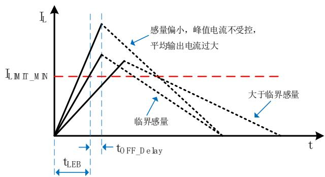

图 12. 空载下的电感电流

此外，所选择的电感需要保证芯片工作在最低限流点时的续流时间大于 7us，以保证芯片可以正常反馈采样，即

$$
L \geq \frac {V _ {O U T} * 7 u s}{I _ {L I M I T \_ M I N}}
$$

因此，通常最终的电感值需要同时满足以上三个条件。待机要求不高的应用只需要满足额定输出电流对感量的最低要求即可。

确定电感值后，还需要确认电感的有效值电流是否满足上述计算值，同时避免电感在芯片最大限流值 ILIMIT\_MAX时饱和，电感供应商的规格书中一般会给出相应的最大有效值电流和饱和电流。

输入电容的选择

输入滤波电容对工频电压纹波、传导 EMI、以及电源抵抗Surge 的能力都起到关键的作用。电容量的选择要保证直流母线电压不能过低(通常不要低于 70V)，因此电容量取决于输出功率和电源效率。 全电压 85\~265VAC 输入时，如果使用全波整流，一般取≥3uF/W；对于半波整流，电容量一般取≥6uF/W。 单高压 176\~265VAC 输入时，在满足 EMI 和 Surge 的前提下容量可以减半。

输出电容的选择

输出电容的作用是滤除电感电流中的交流成分，提供稳定的直流电压给负载，一般根据输出电压纹波要求来选取合适的电容。当输出电流恒定时，输出纹波主要由输出电容的 ESR 以及容量决定。

$$
\Delta V _ {O U T} = \Delta V _ {E S R} + \Delta V _ {C}
$$

CCM 模式下，由容性产生的纹波电压为：

$$
\Delta V _ {C} = \frac {\Delta I _ {L}}{8 * C _ {O U T} * f _ {S}}
$$

DCM 模式下，由容性产生的纹波电压为：

$$
\Delta V _ {C} = \frac {I _ {O U T} * (I _ {L I M I T \_ M A X} - I _ {O U T}) ^ {2}}{C _ {O U T} * f _ {S} * I _ {L I M I T \_ M A X} ^ {2}}
$$

实际应用中，为了得到较小的 ESR，电容量相对比较大，由容量产生的输出电压纹波很小，几乎可以忽略，因此电压纹波主要由电容的 ESR 产生：

$$
\Delta V _ {E S R} = \Delta I _ {L} * E S R \quad (\text { CCM })
$$

$$
\Delta V _ {E S R} = I _ {\text { LIMIT\_MAX }} * E S R \quad (\text { DCM })
$$

过大的 ESR 不仅产生较大的输出电压纹波，还可能导致电容产生损耗而发热，缩短电解电容的寿命。

假负载计算

当输出空载时，需要一个假负载为电感电流提供回路，从而稳定输出电压，电感的平均电流即为假负载的电流。

$$
I _ {A V G} = \frac {1}{2} * I _ {L} * (T _ {O N} + T _ {O F F}) * f _ {S \_ M I N}
$$

其中，I 为空载时电感峰值电流：

$$
I _ {L} = \frac {V _ {I N \_ M A X}}{L} * t _ {D e l a y} + I _ {L I M I T \_ M I N}
$$

ILIMIT\_MIN为芯片的最低限流值，fS\_MIN为芯片最低频率，TON、TOFF分别为空载时 MOSFET 开通和关断时间：

$$
T _ {O N} = \frac {L * I _ {L}}{V _ {I N \_ M A X}}
$$

$$
T _ {O F F} = \frac {L * I _ {L}}{V _ {O U T} + V _ {D i o d e}}
$$

$$
R _ {L} = \frac {V _ {O U T}}{I _ {A V G}}
$$

以上计算未考虑芯片自供电电流通过假负载，实际需要的假负载电流稍大，一般为 1\~3mA 左右。

Buck-Boost 应用设计

BP85223AL 也可以应用于 Buck-Boost 拓扑中，实现负电压输出，应用电路如图 2 所示，芯片的基本功能与Buck 拓扑类似。由于电感只在 MOSFET 关断期间对输出端提供能量，相同的输出功率需要较大感量的电感。

CCM 模式下，通过以下表达式计算最小电感值：

$$
L _ {M I N} = \frac {0 . 5 * V _ {O U T} ^ {\prime} * V _ {I N} ^ {\prime 2} * \frac {1}{f _ {S}}}{\left(V _ {I N} ^ {\prime} + V _ {O U T} ^ {\prime}\right) * \left[ V _ {I N} ^ {\prime} * I _ {L I M I T - M A X} - \left(V _ {I N} ^ {\prime} + V _ {O U T} ^ {\prime}\right) * I _ {O U T} \right]}
$$

其中

$$
V _ {I N} ^ {\prime} = V _ {I N} - V _ {D S}
$$

$$
V _ {O U T} ^ {\prime} = V _ {O U T} + V _ {D i o d e}
$$

$$
V _ {D S} = \frac {V _ {I N} + V _ {O U T}}{V _ {I N}} * I _ {O U T} * R _ {d s (O N)}
$$

$V _ { \mathsf { I N } }$ 输入直流母线电压

$\mathsf { V o u r }$ 输出电压

IOUT 输出电流

$V _ { \sf D i o d e }$ 续流二极管压降

$\mathsf { V } _ { \mathsf { D } \mathsf { S } }$ 开关管 tON时间内平均压降

$\mathsf { I } _ { \mathsf { L I M I T } } \mathsf { \Gamma } _ { \mathsf { M A X } }$ 芯片最大限流值

电感电流有效值为：

$$
I _ {R M S} = \sqrt {I _ {L I M I T \_ M A X} ^ {2} - I _ {L I M I T _ {M A X}} * \Delta I _ {L} + \frac {\Delta I _ {L} ^ {2}}{3}}
$$

其中

$$
\Delta I _ {L} = 2 * (I _ {L I M I T _ {M A X}} - \frac {I _ {O U T}}{V _ {I N}} ^ {\prime} * (V _ {I N} ^ {\prime} + V _ {O U T} ^ {\prime}))
$$

DCM 模式下，通过以下表达式计算最小电感值：

$$
L _ {M I N} = \frac {2 * (V _ {O U T} + V _ {D i o d e}) * I _ {O U T}}{I _ {L I M I T \_ M A X} ^ {2} * f _ {S}}
$$

电感电流有效值为：

$$
I _ {R M S} = I _ {L I M I T \_ M A X} * \sqrt {\frac {t _ {O N} + t _ {O F F}}{3} * f _ {S}}
$$

空载条件对最小感量的限制与 Buck 拓扑基本一致。

电压纹波同样主要由电容 ESR 产生：

$$
\Delta V _ {E S R} = I _ {L I M I T \_ M A X} * E S R \quad (\text {适应于DCM / CCM})
$$

# PCB Layout 指南

在设计 BP85223AL 应用 PCB时，需要遵循以下建议：

1) 交流电压输入端和 EMI 滤波电路建议远离电感等电压电流跳变点，以减少 EMI 噪声耦合（比如：CX 电容尽量远离储能电感）。  
2) ACin 与 BUS 引脚之间为内置整流二极管，承受交流高压，请注意走线间距，保留足够的爬电距离。  
3) Vo 引脚为输出电压反馈端，应避免铺铜且远离母线、电感等高压跳变点，以防止反馈信号受到干扰。建议走线短而粗。  
4) ICG 引脚能很好地起到散热作用，可以在 PCB 上铺铜来降低芯片的温度，但是 ICG 为电压动点（相对母线地电压），在满足散热的条件下，铺铜面积应尽量小以减少噪声辐射。同时建议 ICG 引脚远离交流输入端，以避免耦合产生的 EMI 问题。  
5) Buck 变换器中，D 引脚是芯片内部 MOSFET 的漏极，接输入电容正端，为电压静点。建议铺铜以提高芯片的散热能力。同时建议注意 D脚与其他引脚的走线距离。  
6) 为了达到较好的EMI表现，提高系统可靠性，建议尽可能减小功率环路的面积和走线长度。以 Buck-Boost 为例：建议将母线电容放置在 D 引脚附近，电感放置在ICG附近，母线电容、内置MOSFET、电感形成的励磁回路面积和走线长度尽量减小。电感、内置续流二极管、输出电容组成的续流回路面积和走线长度也建议尽量缩小。

# 封装信息

ASOP-7 封装外形尺寸   
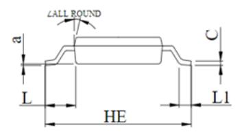

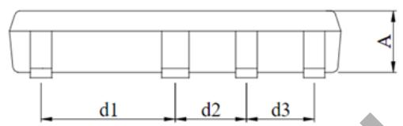

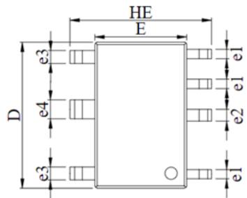

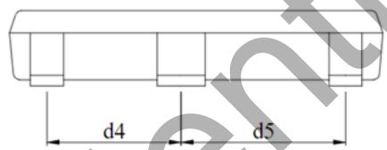

<table><tr><td>Unit</td><td></td><td>A</td><td>C</td><td>D</td><td>E</td><td>HE</td><td>d1</td><td>d2</td><td>d3</td><td>d4</td><td>d5</td><td>e1</td><td>e2</td><td>e3</td><td>e4</td><td>L</td><td>L1</td><td>a</td><td> $\angle$ </td></tr><tr><td rowspan="3">mm</td><td>max</td><td>1.25</td><td>0.22</td><td>6.40</td><td>4.10</td><td>6.10</td><td>2.56</td><td>1.38</td><td>1.32</td><td>2.28</td><td>2.78</td><td>0.50</td><td>0.56</td><td>0.60</td><td>0.85</td><td>1.15</td><td>0.80</td><td rowspan="3">0.2 (ref)</td><td rowspan="6">12°</td></tr><tr><td>typ</td><td>1.15</td><td>0.20</td><td>6.20</td><td>3.90</td><td>6.00</td><td>2.51</td><td>1.33</td><td>1.27</td><td>2.23</td><td>2.73</td><td>0.40</td><td>0.51</td><td>0.55</td><td>0.80</td><td>1.05</td><td>/</td></tr><tr><td>min</td><td>1.05</td><td>0.15</td><td>6.00</td><td>3.70</td><td>5.90</td><td>2.46</td><td>1.28</td><td>1.22</td><td>2.18</td><td>2.68</td><td>0.35</td><td>0.46</td><td>0.50</td><td>0.75</td><td>0.95</td><td>0.40</td></tr><tr><td rowspan="3">mil</td><td>max</td><td>49</td><td>9</td><td>252</td><td>161</td><td>240</td><td>101</td><td>54</td><td>52</td><td>90</td><td>109</td><td>18</td><td>22</td><td>24</td><td>33</td><td>45</td><td>31</td><td rowspan="3">8 (ref)</td></tr><tr><td>typ</td><td>45</td><td>8</td><td>244</td><td>154</td><td>236</td><td>99</td><td>52</td><td>50</td><td>88</td><td>107</td><td>16</td><td>20</td><td>22</td><td>31</td><td>41</td><td>/</td></tr><tr><td>min</td><td>41</td><td>6</td><td>236</td><td>146</td><td>232</td><td>97</td><td>50</td><td>48</td><td>86</td><td>106</td><td>14</td><td>18</td><td>20</td><td>30</td><td>37</td><td>16</td></tr></table>

版本信息

<table><tr><td>版本</td><td>日期</td><td>记录</td></tr><tr><td>Rev. 1.0</td><td>2023/07</td><td>Preliminary</td></tr></table>

# 免责声明

晶丰明源尽力确保本产品规格书内容的准确和可靠，但是保留在没有通知的情况下，修改规格书内容的权利。

本产品规格书未包含任何针对晶丰明源或第三方所有的知识产权的授权。针对本产品规格书所记载的信息，晶丰明源不做任何明示或暗示的保证，包括但不限于对规格书内容的准确性、商业上的适销性、特定目的的适用性或者不侵犯晶丰明源或任何第三人知识产权做任何明示或暗示保证，晶丰明源也不就因本规格书本身及其使用有关的偶然或必然损失承担任何责任。
