## BP85224A Buck参考设计

## (1mH. +5V/200mA)

时间：2024年6月

'BPS

晶丰明源

## 内容

BP85224A简介  
电源规格  
 电路图  
 PCB Layout  
 BOM  
性能测试数据  
重要声明

## BP85224A简介

集成1600V整流二极管  
集成650V高压MOSFET  
集成高压启动和自供电电路  
集成VCC电容、续流二极管和反馈二极管  
多模式控制技术，低待机功耗  
固定5V输出  
内置软起动功能  
 ASOP7封装

应用领域：

 小家电辅助电源  
电机驱动辅助电源  
 IOT/智能家居/智能照明

Buck:  
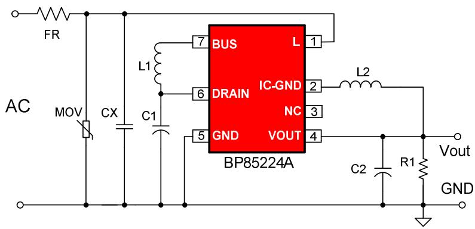

BuckBoost:  
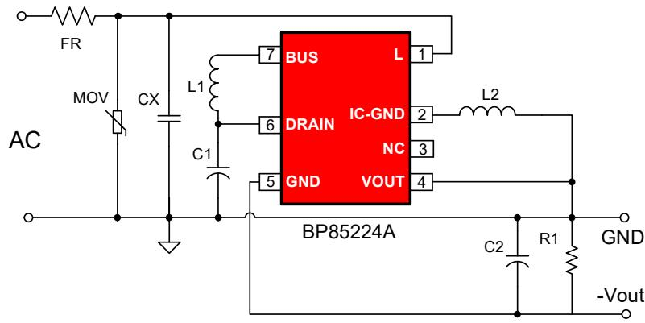

## 电源规格

<table><tr><td>项目描述</td><td>符号</td><td>最小</td><td>典型</td><td>最大</td><td>单位</td><td>备注</td></tr><tr><td colspan="7">输入</td></tr><tr><td>电压</td><td> $V_{IN}$ </td><td>85</td><td></td><td>265</td><td> $V_{AC}$ </td><td></td></tr><tr><td>频率</td><td> $f_{LINE}$ </td><td>47</td><td>50/60</td><td>63</td><td>Hz</td><td></td></tr><tr><td colspan="7">输出</td></tr><tr><td>输出电压</td><td> $V_{OUT}$ </td><td>4.75</td><td>5</td><td>5.25</td><td>V</td><td>±5%</td></tr><tr><td>输出电流</td><td> $I_{OUT}$ </td><td></td><td></td><td>200</td><td>mA</td><td></td></tr><tr><td>输出电压纹波</td><td> $V_{RIPPLE}$ </td><td></td><td></td><td></td><td>mV</td><td>稳态,20MHz带宽</td></tr><tr><td>连续输出功率</td><td> $P_{OUT}$ </td><td></td><td></td><td>1</td><td>W</td><td></td></tr><tr><td colspan="7">效率</td></tr><tr><td>待机功耗</td><td> $P_{STDBY}$ </td><td></td><td></td><td>50.11</td><td>mW</td><td>Vin=230VAC</td></tr><tr><td>满载效率</td><td>η</td><td></td><td>63.97</td><td></td><td>%</td><td>Vin=230VAC</td></tr><tr><td colspan="7">环境</td></tr><tr><td>传导EMI</td><td></td><td colspan="4">满足EN55022 Class B</td><td></td></tr><tr><td>Surge</td><td></td><td></td><td></td><td>2.0</td><td>kV</td><td>无压敏</td></tr><tr><td>EFT</td><td></td><td></td><td></td><td>4</td><td>KV</td><td></td></tr><tr><td>工作环境温度</td><td> $T_{AMP}$ </td><td></td><td>50</td><td></td><td>°C</td><td></td></tr></table>

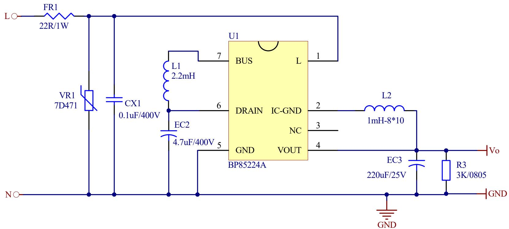

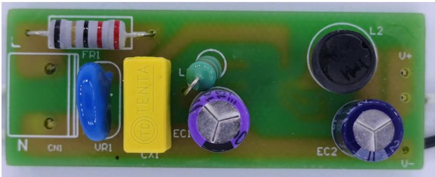

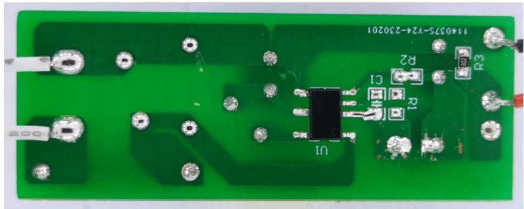

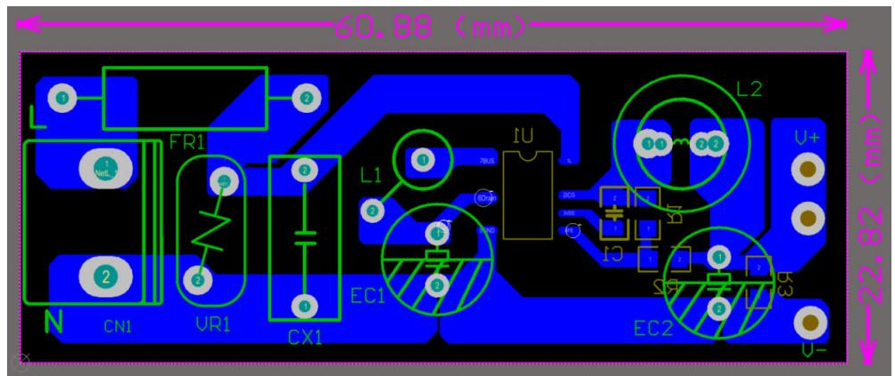

<table><tr><td>序号</td><td>原件标号</td><td>参数</td><td>描述</td><td>封装尺寸</td><td>数量</td></tr><tr><td>1</td><td>FR1</td><td>1W, 22R绕线电阻</td><td>绕线电阻</td><td>DIP</td><td>1</td></tr><tr><td>2</td><td>VR1</td><td>7D471</td><td>压敏</td><td>DIP</td><td>1</td></tr><tr><td>3</td><td>CX1</td><td>0.1uF/275V</td><td>安规电容</td><td>DIP</td><td>1</td></tr><tr><td>4</td><td>C1</td><td>4.7uF/400V</td><td>电解电容</td><td>8*12</td><td>1</td></tr><tr><td>5</td><td>C2</td><td>220uF/10V</td><td>电解电容</td><td>6.3*8</td><td>1</td></tr><tr><td>6</td><td>L1</td><td>2.2mH</td><td>色环电感</td><td>0510</td><td>1</td></tr><tr><td>7</td><td>L2</td><td>1mH</td><td>工字电感</td><td>8*10</td><td>1</td></tr><tr><td>8</td><td>R3</td><td>3.0K-5%</td><td>贴片电阻</td><td>SM0805</td><td>1</td></tr><tr><td>9</td><td>U1</td><td>BP85224A</td><td>IC</td><td>ASOP7</td><td>1</td></tr><tr><td>总计</td><td></td><td></td><td></td><td></td><td>9</td></tr></table>

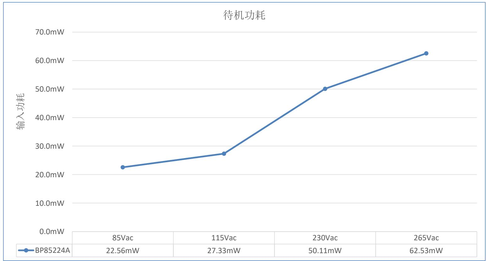

转换效率  
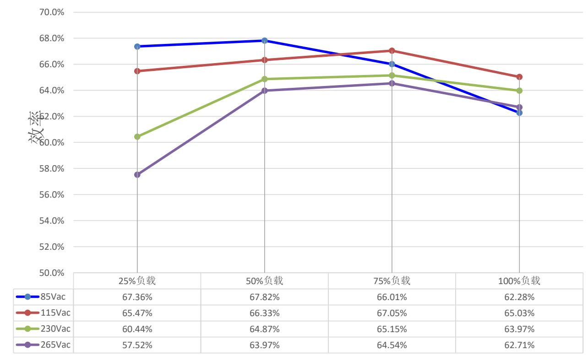

## 输出电压调整率

<table><tr><td>VIN(VAC)IOUT(mA)</td><td>85</td><td>115</td><td>230</td><td>265</td><td>线调整率</td></tr><tr><td>0%负载(0)</td><td>5.036</td><td>5.027</td><td>5.000</td><td>4.981</td><td>1.10%</td></tr><tr><td>25%负载(50)</td><td>4.985</td><td>4.976</td><td>4.956</td><td>4.947</td><td>0.77%</td></tr><tr><td>50%负载(100)</td><td>4.951</td><td>4.842</td><td>4.930</td><td>4.926</td><td>2.22%</td></tr><tr><td>75%负载(150)</td><td>4.929</td><td>4.917</td><td>4.908</td><td>4.905</td><td>0.49%</td></tr><tr><td>100%负载(200)</td><td>4.920</td><td>4.910</td><td>4.894</td><td>4.891</td><td>0.59%</td></tr><tr><td>负载调整率</td><td>2.34%</td><td>3.75%</td><td>2.15%</td><td>1.83%</td><td></td></tr></table>

 调整率计算方法：调整率=100%\*(最大值-最小值)/平均值

## 输出启动波形

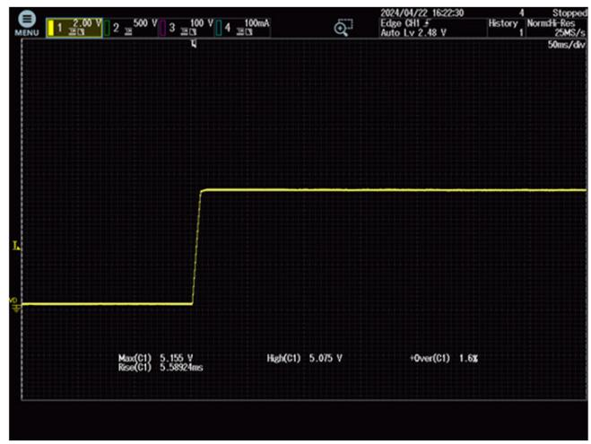

85 VAC

CH1 V TRISE: 5.58 mS

Test Condition:

 No Load(0mA)

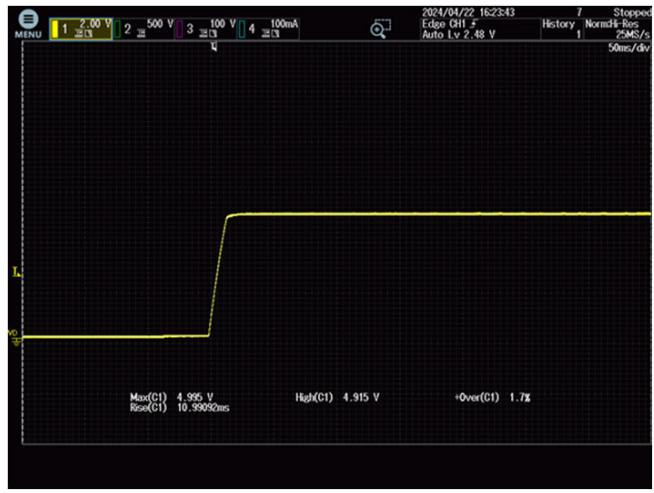

85 VAC

${ \mathsf { C H 1 } } { \mathsf { V } } _ { \mathsf { O U T } }$ CH1 VOUT T : 10.99 mS

Test Condition:

 Full Load(200mA)

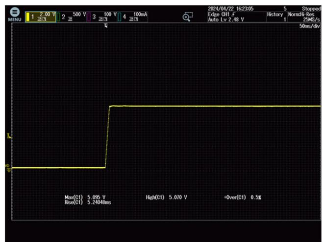

265 VAC

CH1 VOUT $\mathsf { V } _ { \mathsf { O U T } }$ T : 5.24 mS

Test Condition:

 No Load(0mA)

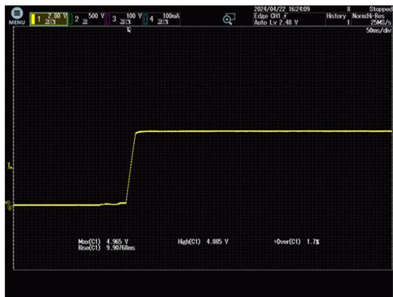

$2 6 5 \mathsf { V } _ { \mathsf { A C } }$

CH1 V $\mathsf { V } _ { \mathsf { O U T } }$ $\mathsf { T } _ { \mathsf { R I S E } } \colon 9 . 9 1$ mS

Test Condition:

 Full Load(200mA)

## 输出电压纹波

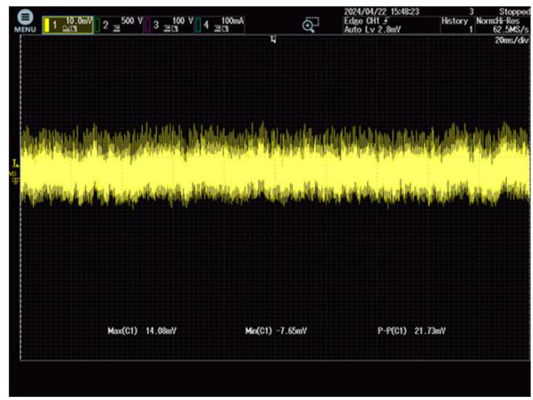

85 VAC

CH1 VOUT VPK-PK=21.73mV

Test Condition:

 NO Load (0mA)

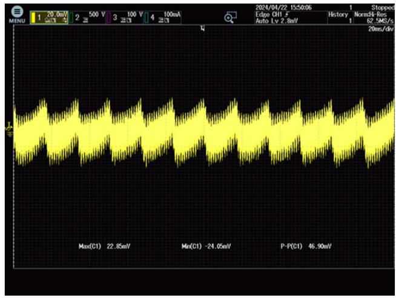

85 VAC

${ \mathsf { C H 1 } } { \mathsf { V } } _ { \mathsf { O U T } }$ CH1 VOUT $V _ { P K - P K } = 4 6 . 9 m V$

Test Condition:

 Full Load (150mA)

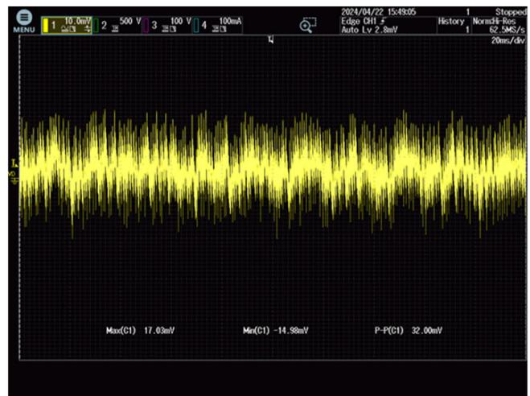

265 VAC

${ \mathsf { C H 1 } } { \mathsf { V } } _ { \mathsf { O U T } }$ CH1 VOUT $V _ { p | c - P K } = 3 2 . 0 0 m v$

Test Condition:

 NO Load (0mA)

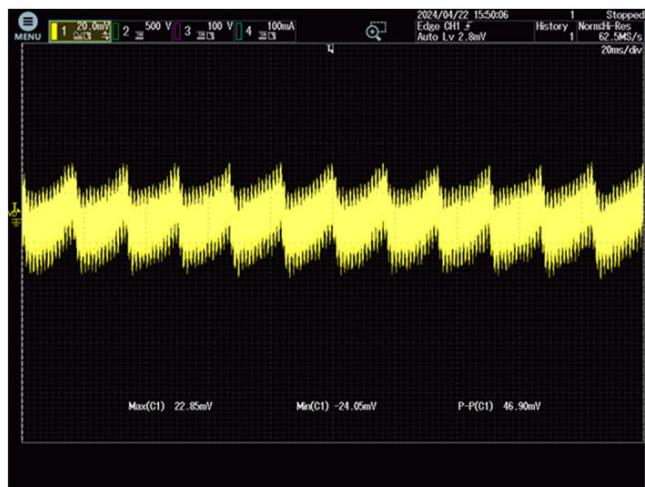

265 VAC

CH1 V $\mathsf { V } _ { \mathsf { O U T } }$ $V _ { P K - P K } = 5 0 . 7 5 m v$

Test Condition:

 Full Load (150mA)

## 动态负载（50%-100%/10%-90%）

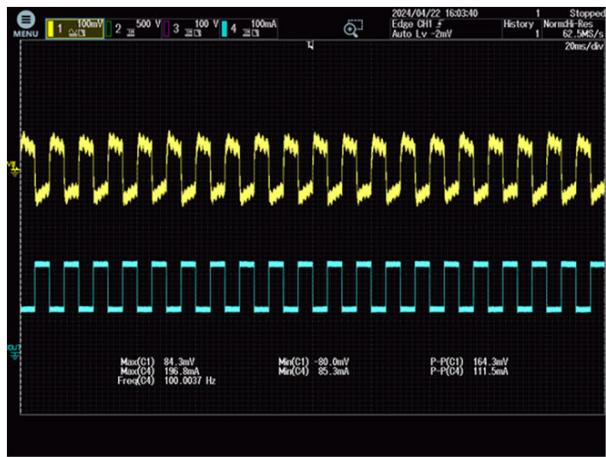

85 VAC

CH1 VOUT  
CH4 Iout  
 100mA-200mA  
 Slew Rate: 0.5 A/μS  
 Frequency: 100 Hz

$$
V _ {P K - P K} = 1 6 4. 3 m V
$$

## Test Condition:

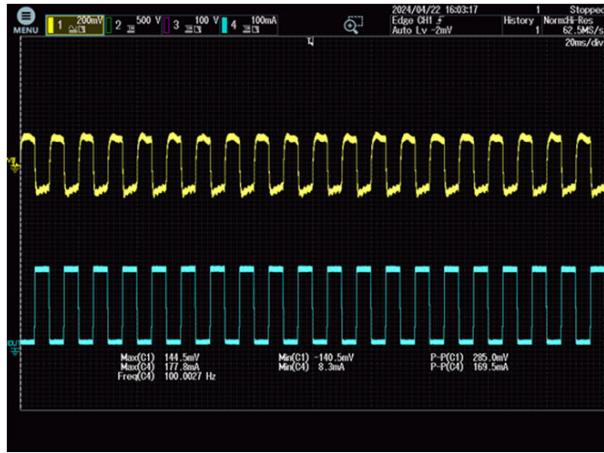

85 VAC

CH1 VOUT  
CH4 Iout  
 20mA-180mA  
 Slew Rate: 0.5 A/μS  
 Frequency: 100 Hz

$$
V _ {P K - P K} = 2 8 5. 0 \mathrm{mV}
$$

## Test Condition:

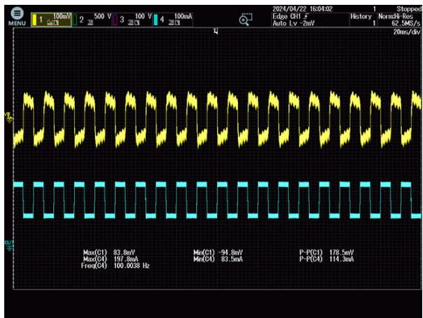

265 VAC

CH1 VOUT  
CH4 Iout  
 100mA-200mA  
 Slew Rate: 0.5 A/μS  
 Frequency: 100 Hz

$$
V _ {P K - P K} = 1 7 8. 5 \mathrm{mV}
$$

## Test Condition:

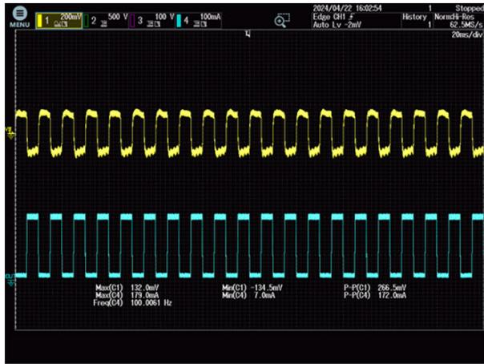

265 VAC

CH1 VOUT  
CH4 Iout V =266.5mV

## Test Condition:

 20mA-180mA  
 Slew Rate: 0.5 A/μS  
 Frequency: 100 Hz

## 启动时漏极电压/电流波形

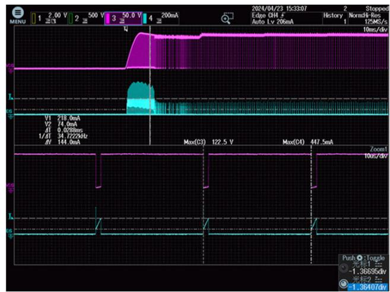

85 VAC

CH3 $\mathsf { V } _ { \mathsf { D } \mathsf { S } }$  
CH4 $\mathsf { I } _ { \mathsf { D } \mathsf { S } }$

$$
V _ {D S \_ M A X} = 1 2 2. 5 V
$$

$$
I _ {D S \_ M A X} = 4 4 7. 5 \mathrm{mA}
$$

Test Condition:

 No Load(0mA)

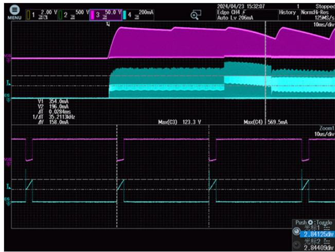

85 VAC

CH3 $\mathsf { V } _ { \mathsf { D } \mathsf { S } }$  
CH4 $\mathsf { I } _ { \mathsf { D } \mathsf { S } }$

$$
V _ {D S \_ M A X} = 1 2 3. 3 V
$$

$$
I _ {D S \_ M A X} = 5 6 9. 5 \mathrm{mA}
$$

Test Condition:

 Full Load(200mA)

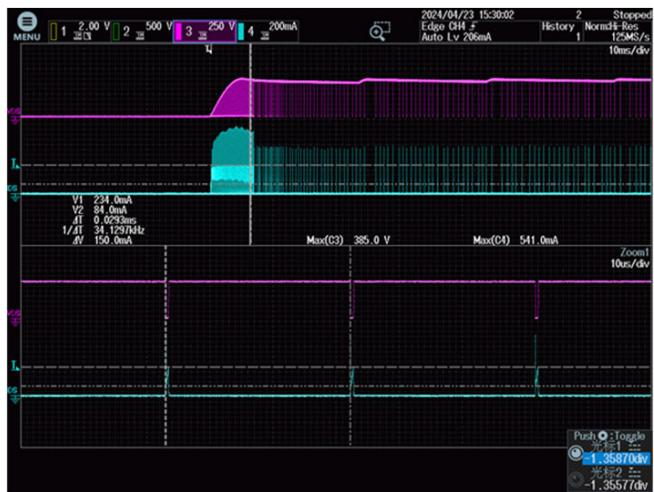

265 VAC

CH3 $\mathsf { V } _ { \mathsf { D } \mathsf { S } }$  
CH4 $\mathsf { I } _ { \mathsf { D } \mathsf { S } }$

$$
V _ {D S \_ M A X} = 3 8 5. 0 V
$$

$$
I _ {D S \_ M A X} = 5 4 1. 0 m A
$$

Test Condition:

 No Load(0mA)

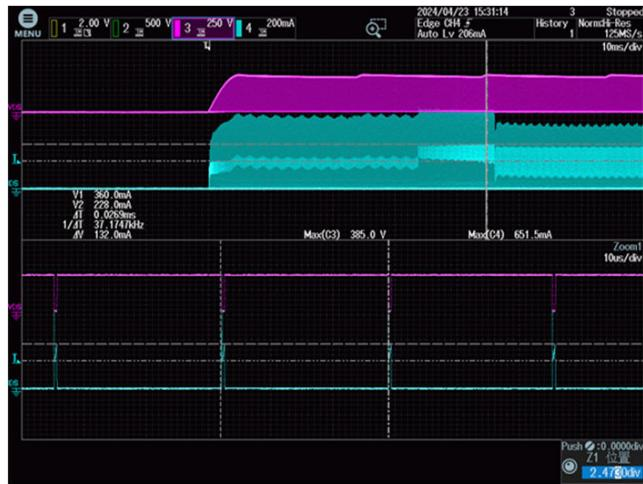

265 VAC

CH3 $\mathsf { V } _ { \mathsf { D } \mathsf { S } }$  
CH4 $\mathsf { I } _ { \mathsf { D } \mathsf { S } }$

$$
V _ {D S \_ M A X} = 3 8 5. 0 V
$$

$$
I _ {D S \_ M A X} = 6 5 1. 5 m A
$$

Test Condition:

 Full Load(200mA)

## 稳态时漏极电压/电流波形

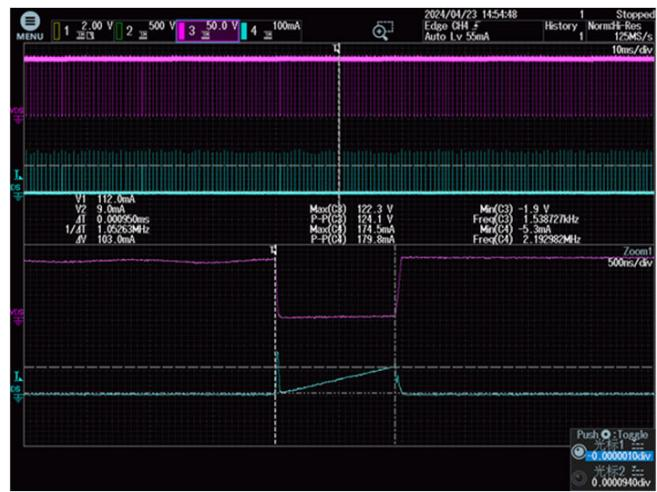

85 VAC

CH3 $\mathsf { V } _ { \mathsf { D } \mathsf { S } }$  
CH4 IDS

$$
V _ {D S \_ M A X} = 1 2 2. 3 V
$$

$$
I _ {D S \_ M A X} = 1 7 4. 5 m A
$$

$$
F = 1. 5 4 \mathrm{KHz}
$$

Test Condition:

 No Load

$$
(0 \mathrm{mA})
$$

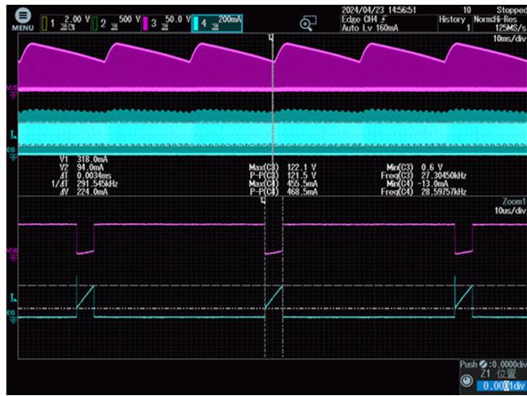

85 VAC

CH3 $\mathsf { V } _ { \mathsf { D } \mathsf { S } }$  
CH4 $\mathsf { I } _ { \mathsf { D } \mathsf { S } }$

$$
V _ {D S \_ M A X} = 1 2 2. 1 V
$$

$$
I _ {D S \_ M A X} = 4 5 5. 5 \mathrm{mA}
$$

$$
\mathrm{F} = 2 7. 3 0 \mathrm{KHz}
$$

Test Condition:

 Full Load

$$
(2 0 0 \mathrm{mA})
$$

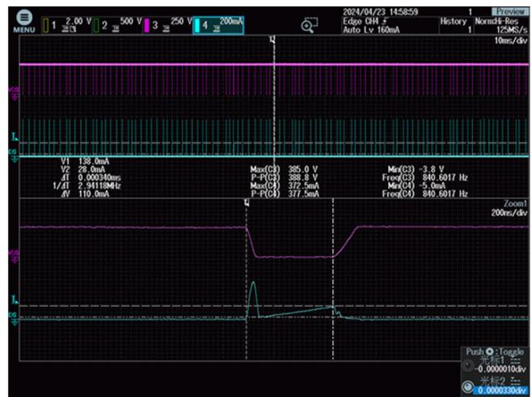

265 VAC

CH3 $\mathsf { V } _ { \mathsf { D } \mathsf { S } }$  
CH4 $\mathsf { I } _ { \mathsf { D } \mathsf { S } }$

$$
V _ {D S \_ M A X} = 3 8 5. 0 V
$$

$$
I _ {D S \_ M A X} = 3 7 2. 5 \mathrm{mA}
$$

$$
\mathrm{F} = 0. 8 4 \mathrm{KHz}
$$

Test Condition:

 No Load

$$
(0 \mathrm{mA})
$$

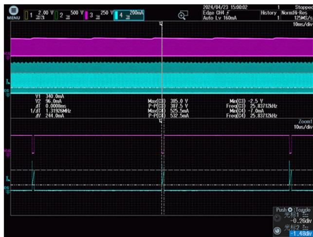

265 VAC

CH3 $\mathsf { V } _ { \mathsf { D } \mathsf { S } }$  
CH4 $\mathsf { I } _ { \mathsf { D } \mathsf { S } }$

$$
V _ {D S \_ M A X} = 3 8 5. 0 V
$$

$$
I _ {D S \_ M A X} = 5 2 5. 5 \mathrm{mA}
$$

$$
\mathrm{F} = 2 5. 7 4 \mathrm{KHz}
$$

Test Condition:

 Full Load

$$
(2 0 0 \mathrm{mA})
$$

## 稳态时电感电流波形

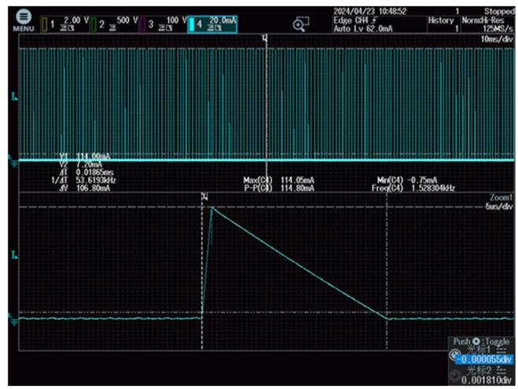

85 VAC

CH4 IL 正常

Test Condition:

 No Load(0mA)

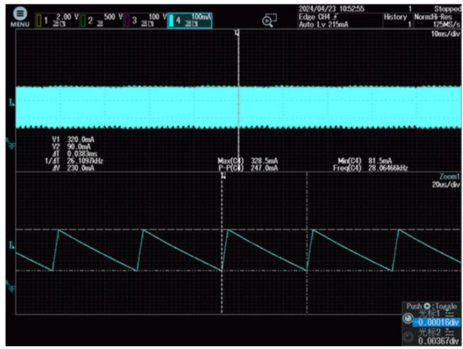

85 VAC

CH4 IL 正常

Test Condition:

 Full Load(200mA)

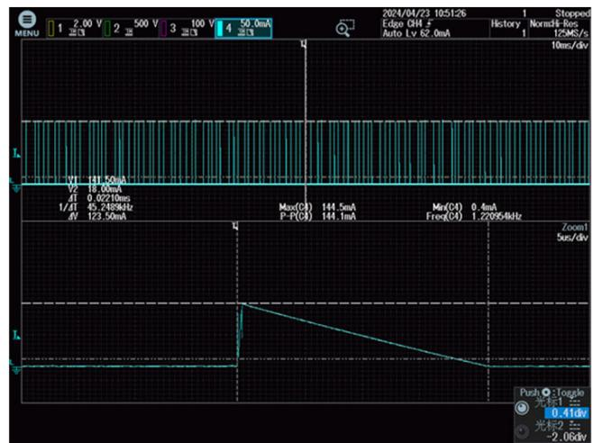

265 VAC

CH4 IL 正常

Test Condition:

 No Load(0mA)

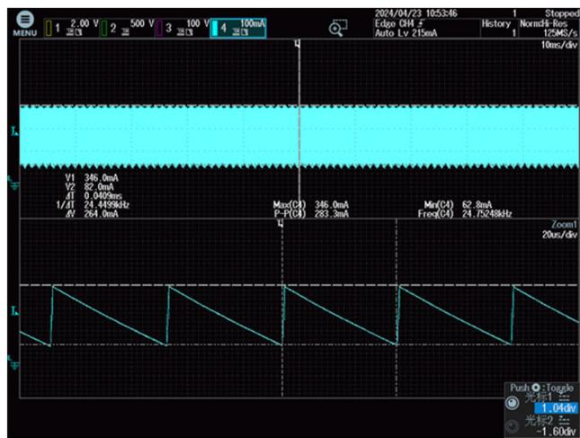

265 VAC

CH4 IL 正常

Test Condition:

 Full Load(200mA)

## 启动时电感电流波形-85Vac

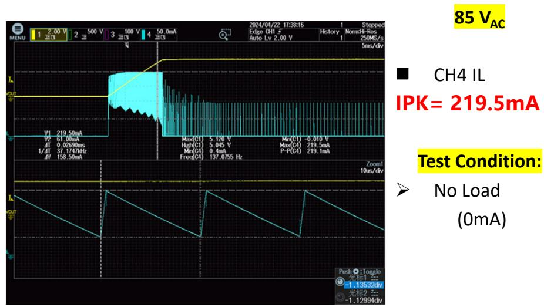

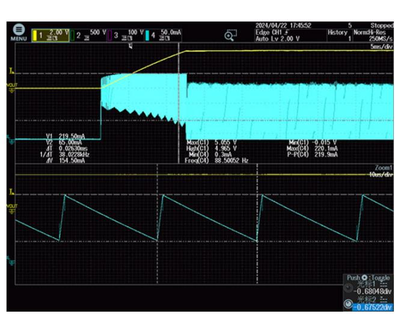

  
CH4 IL IPK= 219.5mA  
Test Condition:  
 Light Load (50mA)

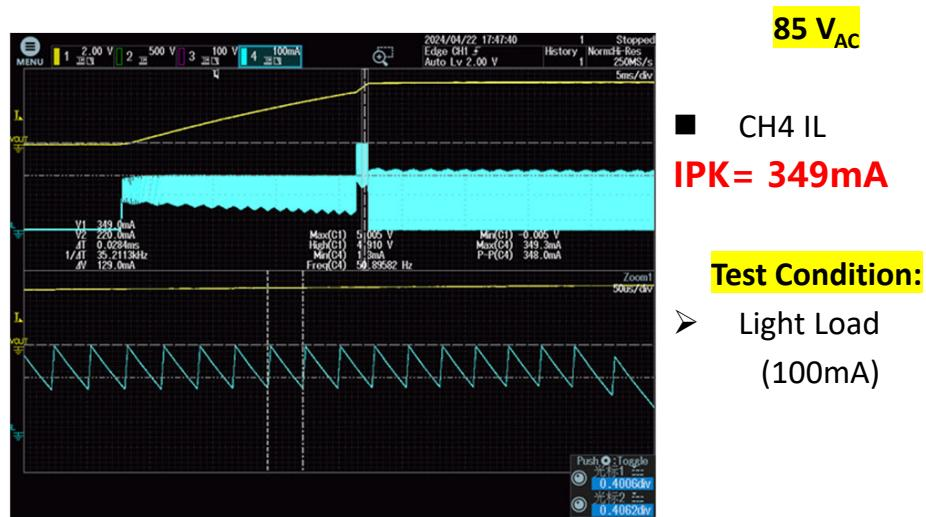

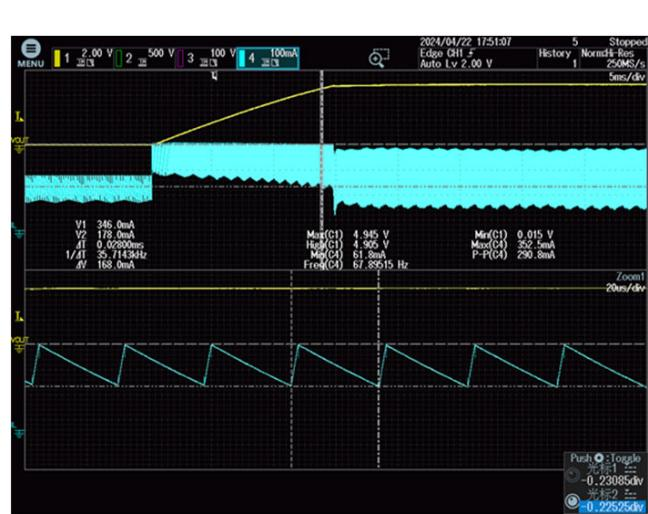

  
CH4 IL IPK= 346mA  
Test Condition:  
 Full Load(200mA)

## 启动时电感电流波形-265Vac

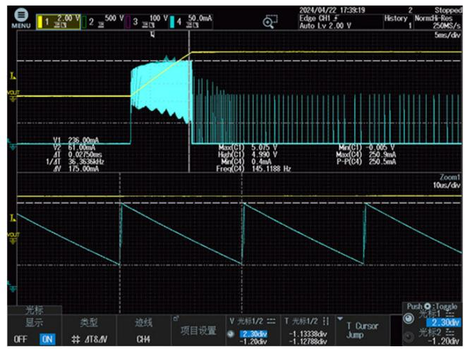

85 VAC

CH4 IL IPK= 236.0mA

Test Condition:

 No Load(0mA)

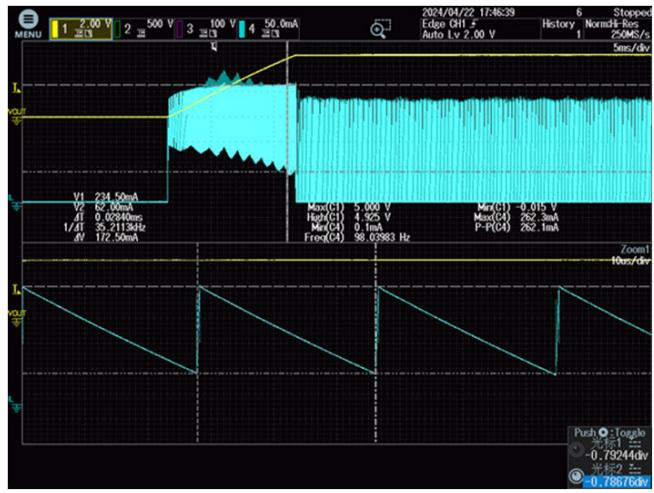

85 VAC

CH4 IL IPK= 234.5mA

Test Condition:

 Light Load (50mA)

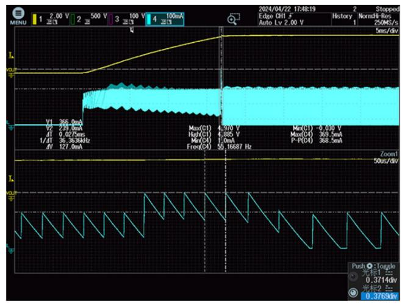

85 VAC

CH4 IL IPK= 366mA

Test Condition:

 Light Load (100mA)

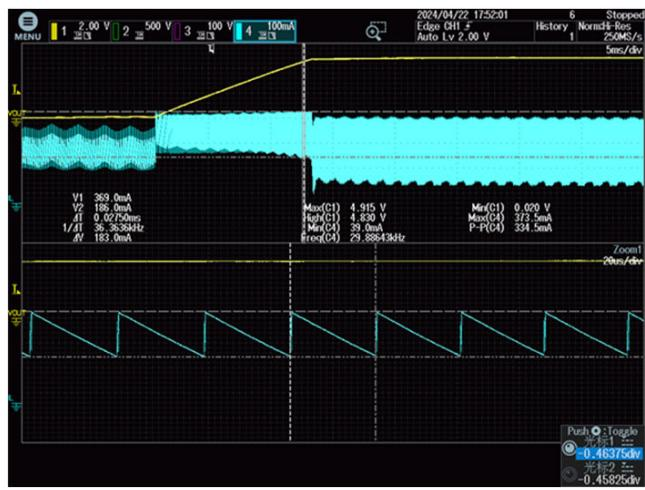

85 VAC

CH4 IL IPK= 369mA

Test Condition:

 Full Load(200mA)

## 短路保护

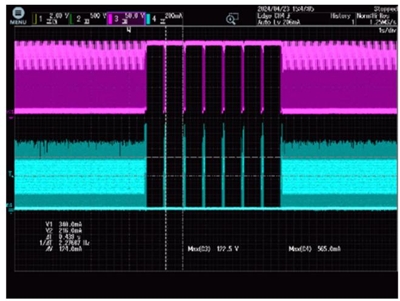

85 VAC

$C H 3 \mid _ { \mathsf { D S } }$  
CH4 $\mathsf { V } _ { \mathsf { D } \mathsf { S } }$  
 输出短接

保护间隔时间正常

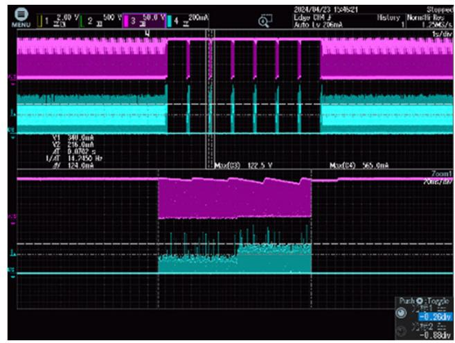

85 $\mathsf { v } _ { \mathsf { A C } }$

$C H 3 \mid _ { \mathsf { D S } }$  
CH4 $\mathsf { V } _ { \mathsf { D } \mathsf { S } }$  
 输出短接

保护触发时间正常

Test Condition:

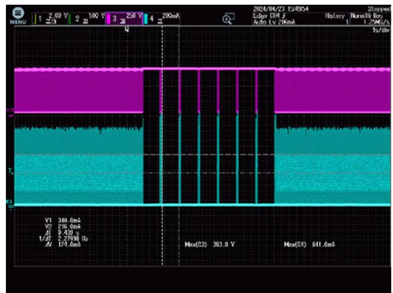

265 VAC

$C H 3 \mid _ { \mathsf { D S } }$  
${ \mathsf { C H } } 4 \ { \mathsf { V } } _ { \mathsf { D S } }$  
 输出短接

保护间隔时间正常

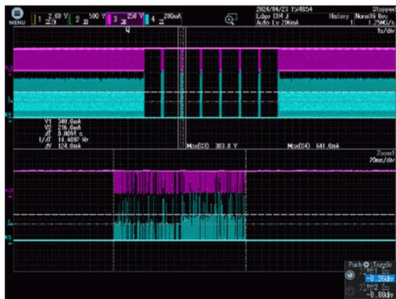

265 $\mathsf { v } _ { \mathsf { A C } }$

CH3 $\mathsf { I } _ { \mathsf { D } \mathsf { S } }$  
CH4 $\mathsf { V } _ { \mathsf { D } \mathsf { S } }$  
 输出短接

保护触发时间正常

Test Condition:

## 满载温升

<table><tr><td colspan="8">温升测试-常温下测试参数参考原理图</td></tr><tr><td>Vin(AC)</td><td>输出带载</td><td>IC温度</td><td>盒内温度</td><td>温升</td><td>输入功率</td><td>输出电压</td><td>效率</td></tr><tr><td>85Vac/60Hz</td><td rowspan="4">200mA</td><td>62.70°C</td><td>26.29°C</td><td>36.4°C</td><td>1.56W</td><td>4.856V</td><td>62.26%</td></tr><tr><td>115Vac/60Hz</td><td>60.00°C</td><td>26.33°C</td><td>33.7°C</td><td>1.51W</td><td>4.843V</td><td>64.15%</td></tr><tr><td>230Vac/50Hz</td><td>61.90°C</td><td>26.31°C</td><td>35.6°C</td><td>1.54W</td><td>4.831V</td><td>62.74%</td></tr><tr><td>265Vac/50Hz</td><td>63.40°C</td><td>26.44°C</td><td>37.0°C</td><td>1.56W</td><td>4.824V</td><td>61.85%</td></tr></table>

<table><tr><td colspan="8">温升测试-高温50°C密闭空间测试参数参考原理图</td></tr><tr><td>Vin(AC)</td><td>输出带载</td><td>IC温度</td><td>盒内温度</td><td>温升</td><td>输入功率</td><td>输出电压</td><td>效率</td></tr><tr><td>85Vac/60Hz</td><td rowspan="4">200mA</td><td>82.56°C</td><td>51.38°C</td><td>31.2°C</td><td>1.60W</td><td>4.930V</td><td>61.63%</td></tr><tr><td>115Vac/60Hz</td><td>79.29°C</td><td>50.33°C</td><td>29.0°C</td><td>1.54W</td><td>4.917V</td><td>63.86%</td></tr><tr><td>230Vac/50Hz</td><td>82.19°C</td><td>50.63°C</td><td>31.6°C</td><td>1.58W</td><td>4.896V</td><td>61.97%</td></tr><tr><td>265Vac/50Hz</td><td>84.74°C</td><td>50.88°C</td><td>33.9°C</td><td>1.61W</td><td>4.896V</td><td>60.82%</td></tr></table>

## 传导EMI

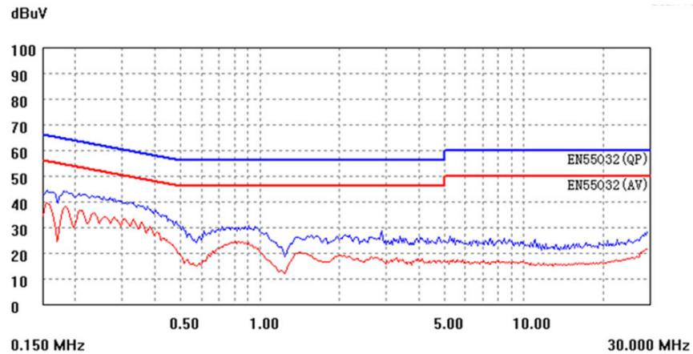

115VAC Line

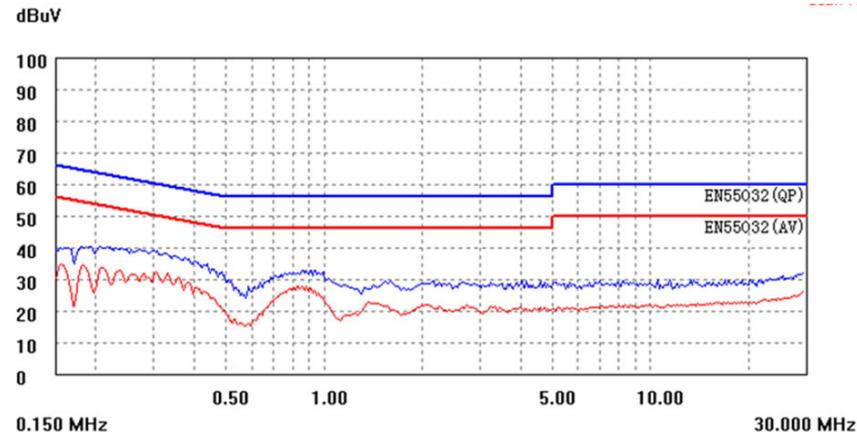

115VAC Neutral

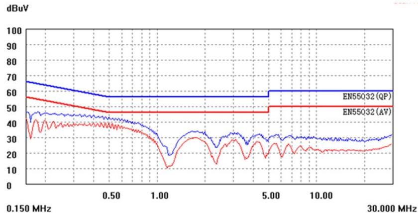

230VAC Line

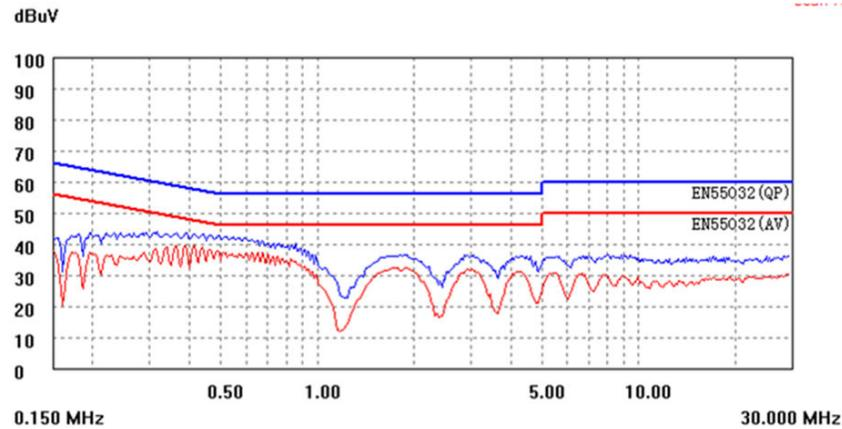

230VAC Neutral

## 功率骚扰

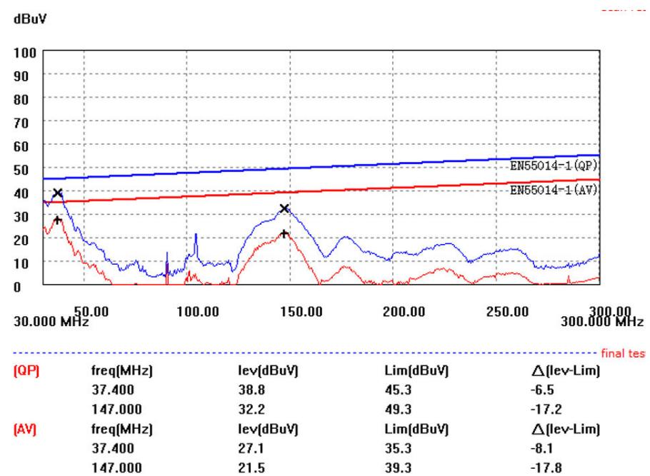

115VAC Line

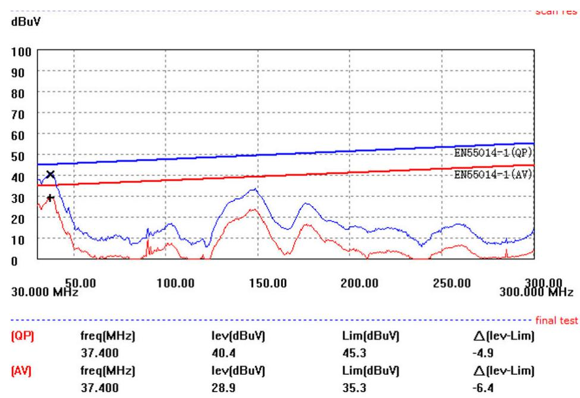

230VAC Neutral

## Surge浪涌测试

<table><tr><td>差模</td><td>电压</td><td>相位角</td><td>测试次数</td><td>测试结果</td></tr><tr><td>L to N</td><td>+2.0kV</td><td>0</td><td>10</td><td>Pass</td></tr><tr><td>L to N</td><td>-2.0kV</td><td>0</td><td>10</td><td>Pass</td></tr><tr><td>L to N</td><td>+2.0kV</td><td>90</td><td>10</td><td>Pass</td></tr><tr><td>L to N</td><td>-2.0kV</td><td>90</td><td>10</td><td>Pass</td></tr><tr><td>L to N</td><td>+2.0kV</td><td>180</td><td>10</td><td>Pass</td></tr><tr><td>L to N</td><td>-2.0kV</td><td>180</td><td>10</td><td>Pass</td></tr><tr><td>L to N</td><td>+2.0kV</td><td>270</td><td>10</td><td>Pass</td></tr><tr><td>L to N</td><td>-2.0kV</td><td>270</td><td>10</td><td>Pass</td></tr></table>

## 测试说明

 按照GB/T17626.5和IEC61000-4-5的最新版本要求进行测试  
 室温环境，230VAC输入，满载条件  
 输入1.2/50us组合波浪涌电压  
 每个测试点重复10次  
 每次间隔时间1分钟  
 试验时样机输出正常（符合A类标准）视为Pass

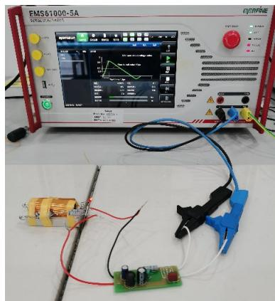

## EFT脉冲群测试

<table><tr><td>差模</td><td>电压</td><td>脉冲群持续时间</td><td>脉冲频率</td><td>测试时间</td><td>测试结果</td></tr><tr><td>L to N</td><td>+4kV</td><td>15ms</td><td>5KHz</td><td>120s</td><td>Pass</td></tr><tr><td>L to N</td><td>-4kV</td><td>15ms</td><td>5KHz</td><td>120s</td><td>Pass</td></tr><tr><td>L to N</td><td>+4kV</td><td>0.75ms</td><td>100KHz</td><td>120s</td><td>Pass</td></tr><tr><td>L to N</td><td>-4kV</td><td>0.75ms</td><td>100KHz</td><td>120s</td><td>Pass</td></tr><tr><td>L to N</td><td>+2kV</td><td>1.95ms</td><td>38KHz</td><td>120s</td><td>Pass</td></tr><tr><td>L to N</td><td>-2kV</td><td>1.95ms</td><td>38KHz</td><td>120s</td><td>Pass</td></tr><tr><td>L to N</td><td>+4kV</td><td>1.95ms</td><td>38KHz</td><td>120s</td><td>Pass</td></tr><tr><td>L to N</td><td>-4kV</td><td>1.95ms</td><td>38KHz</td><td>120s</td><td>Pass</td></tr></table>

## 测试说明

 按照GB/T17626.5和IEC61000-4-4的最新版本要求进行测试  
 室温环境，230VAC输入，满载条件  
 分别测试5KHz/100KHz/38KHz  
 脉冲群周期为300ms  
 每个测试条件测试时间120S  
 试验时样机输出正常（符合A类标准）视为Pass

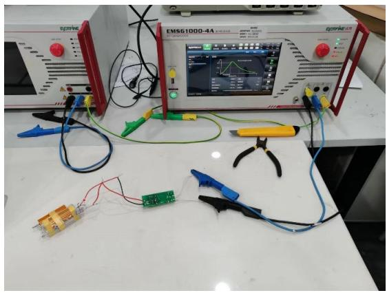

## 重要声明

 本文档中的数据和信息仅供参考，不构成任何形式的建议、验收标准或保证。实际测试数据和结果可能同文档中列出的数据和结果存在差异，请用户自行确认产品的适用性。  
 此文档测试的BP85224A样品未经CP/FT工序，后续根据批量数据可能微调某些参数，可能略影响性能表现。此文档供参考评估，最终性能表现请以量产版本芯片为准。

上海市浦东新区申江路5005弄星创科技广场3号楼9层

+86-21-51870166

sales@bpsemi.com

www.bpsemi.com

  
微信公众号

  
微信视频号
