## 小家电

## BP85224A ±5V/200mA 降压芯片推广资料

时间：2024年6月

## 产品特点

集成1600V整流二极管  
集成650V高压MOSFET  
集成高压启动和自供电电路  
集成VCC电容、续流二极管和反馈二极管  
多模式控制技术，低待机功耗  
固定5V输出  
内置软起动功能  
ASOP7封装

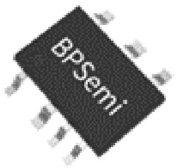

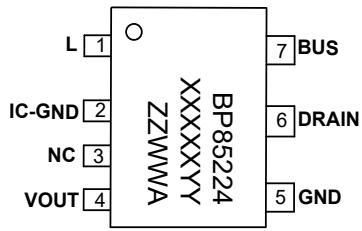

典型应用图（Buck）  
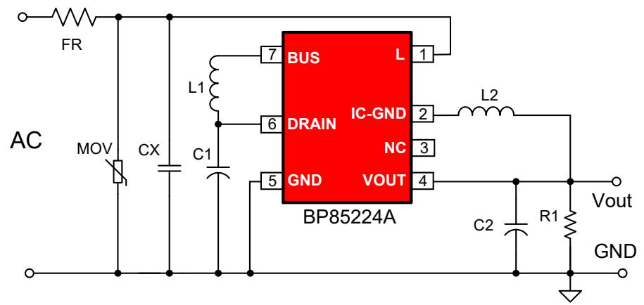

典型应用图（BuckBoost）  
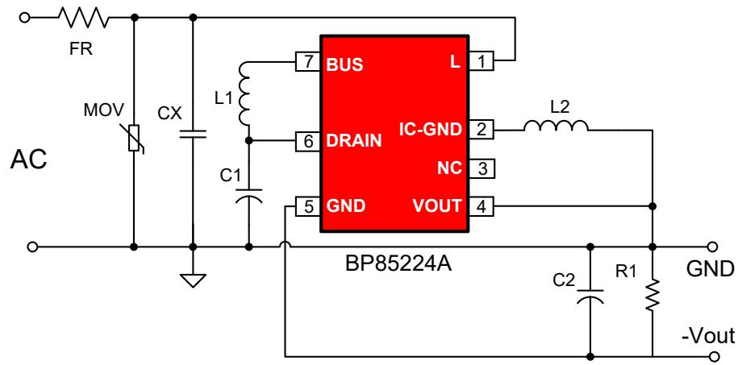

产品规格

<table><tr><td>Part No.</td><td>输入电压</td><td>稳态输出功率</td><td>瞬态输出功率</td></tr><tr><td>BP85224A</td><td>85~265VAC</td><td>1.0W(5V/200mA)</td><td>1.25W(5V/250mA)</td></tr></table>

## 目标应用

➢ 小家电辅助电源：饭煲、养生壶、破壁机、空气炸锅  
电机驱动辅助电源：风扇、高速风筒  
IOT/智能家居/智能照明

## 待机功耗

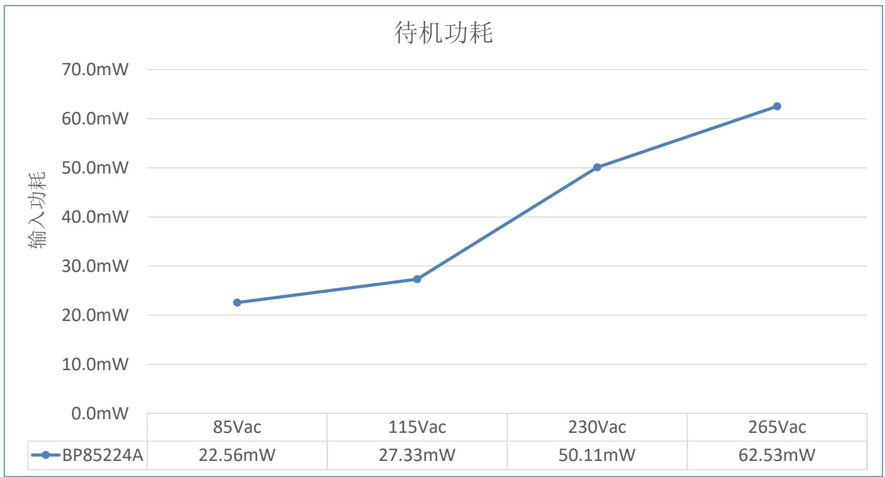

## 输出电压调整率

<table><tr><td>VIN(VAC)IOUT(mA)</td><td>85</td><td>115</td><td>230</td><td>265</td><td>线调整率</td></tr><tr><td>0%负载(0)</td><td>5.036</td><td>5.027</td><td>5.000</td><td>4.981</td><td>1.10%</td></tr><tr><td>25%负载(50)</td><td>4.985</td><td>4.976</td><td>4.956</td><td>4.947</td><td>0.77%</td></tr><tr><td>50%负载(100)</td><td>4.951</td><td>4.842</td><td>4.930</td><td>4.926</td><td>2.22%</td></tr><tr><td>75%负载(150)</td><td>4.929</td><td>4.917</td><td>4.908</td><td>4.905</td><td>0.49%</td></tr><tr><td>100%负载(200)</td><td>4.920</td><td>4.910</td><td>4.894</td><td>4.891</td><td>0.59%</td></tr><tr><td>负载调整率</td><td>2.34%</td><td>3.75%</td><td>2.15%</td><td>1.83%</td><td></td></tr></table>

◼ 调整率计算方法：调整率=100%\*(最大值-最小值)/平均值

## EMI

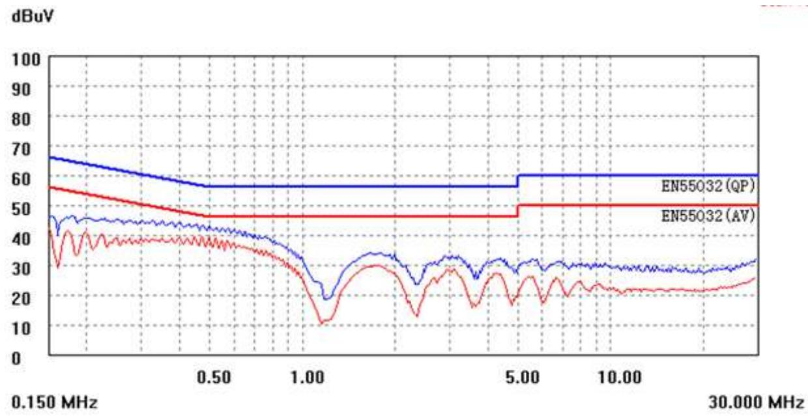

230VAC Line

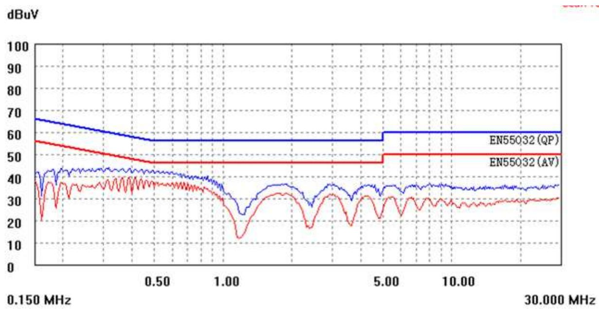

230VAC Neutral

原理图（BOM）对比  
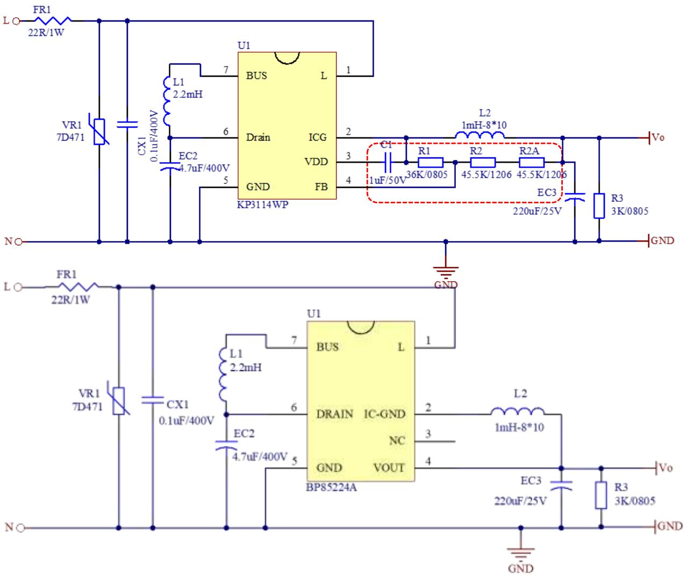

<table><tr><td>IC型号</td><td>KP3114WP</td><td colspan="2">BP85224A</td></tr><tr><td rowspan="4">安规器件</td><td colspan="3">绕线电阻:22R/1W</td></tr><tr><td colspan="3">压敏:7D471</td></tr><tr><td colspan="3">安规电容:0.1uF/400V</td></tr><tr><td colspan="3">L1色环电感:2.2mH/0510</td></tr><tr><td rowspan="3">其它插件器件</td><td colspan="3">输入电解:4.7uF/400V</td></tr><tr><td colspan="3">输出电解:220uF/25V</td></tr><tr><td colspan="3">输出电感:1mH/8*10</td></tr><tr><td rowspan="4">外围贴片器件</td><td colspan="3">假负载:3K/0805</td></tr><tr><td colspan="2">C1:1uF/50V</td><td rowspan="3">无</td></tr><tr><td colspan="2">R1:36K/0805</td></tr><tr><td colspan="2">R2/R2A:45.5K/1206</td></tr><tr><td colspan="4">BP85224A替换KP3114WP说明</td></tr><tr><td colspan="4">BP85224A芯片与KP3114WP芯片脚位兼容,在KP3114WP的系统板上把C1/R1悬空,R2和R2A短接。</td></tr></table>

## 温升对比

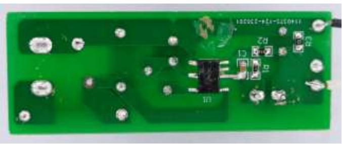

贴片面-KP3144WP

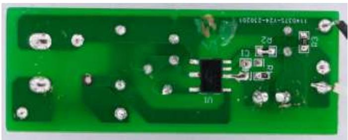

贴片面-BP85224A

温升测试-50C密闭空间测试

<table><tr><td>IC</td><td>Vin(AC)</td><td>输出带载</td><td>IC温度</td><td>盒内温度</td><td>温升</td><td>输入功率</td><td>输出电压</td><td>效率</td></tr><tr><td rowspan="4">KP3114WP</td><td>85Vac/60Hz</td><td rowspan="4">200mA</td><td>86.03°C</td><td>52.41°C</td><td>33.6°C</td><td>1.61W</td><td>5.074V</td><td>63.03%</td></tr><tr><td>115Vac/60Hz</td><td>82.60°C</td><td>50.77°C</td><td>31.8°C</td><td>1.57W</td><td>5.075V</td><td>64.65%</td></tr><tr><td>230Vac/50Hz</td><td>87.92°C</td><td>50.66°C</td><td>37.3°C</td><td>1.66W</td><td>5.057V</td><td>60.93%</td></tr><tr><td>265Vac/50Hz</td><td>90.40°C</td><td>50.66°C</td><td>39.7°C</td><td>1.70W</td><td>5.046V</td><td>59.36%</td></tr><tr><td rowspan="4">BP85224A</td><td>85Vac/60Hz</td><td rowspan="4">200mA</td><td>82.56°C</td><td>51.38°C</td><td>31.2°C</td><td>1.60W</td><td>4.930V</td><td>61.63%</td></tr><tr><td>115Vac/60Hz</td><td>79.29°C</td><td>50.33°C</td><td>29.0°C</td><td>1.54W</td><td>4.917V</td><td>63.86%</td></tr><tr><td>230Vac/50Hz</td><td>82.19°C</td><td>50.63°C</td><td>31.6°C</td><td>1.58W</td><td>4.896V</td><td>61.97%</td></tr><tr><td>265Vac/50Hz</td><td>84.74°C</td><td>50.88°C</td><td>33.9°C</td><td>1.61W</td><td>4.896V</td><td>60.82%</td></tr></table>

温升对比曲线  
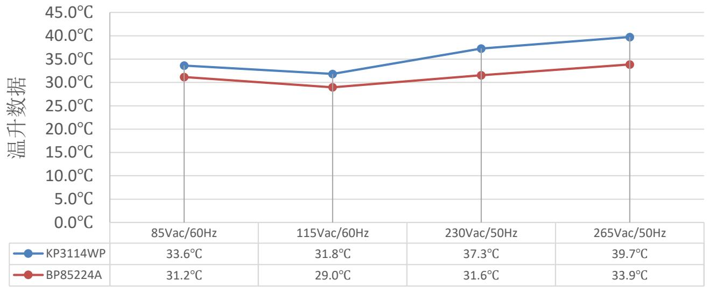

## 软起动对比（电感电流波形）

BP85224A芯片软启动采用2段Ilimit控制，IPK值跟随负载大小自动调节。

轻载方案中，在相同小电感下，KP3114WP容易出现启动饱和现象

KP3114WP芯片软启动采用调节频率控制，任何负载下都以最大IPK启动。

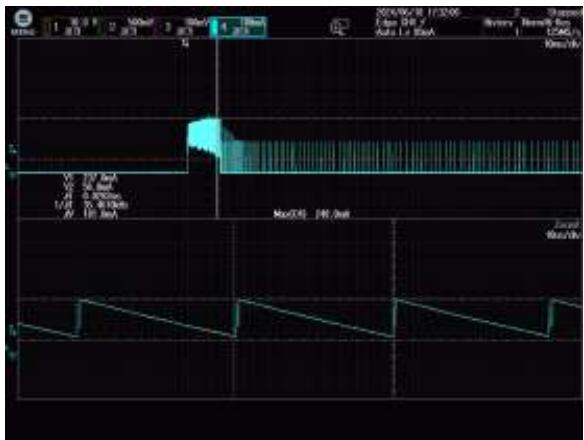

Iout=0mA，Ipk=248mA

BP85224A芯片  
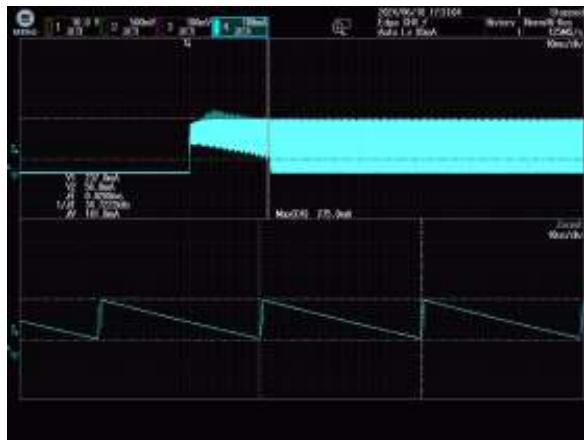

Iout=100mA，Ipk=275mA

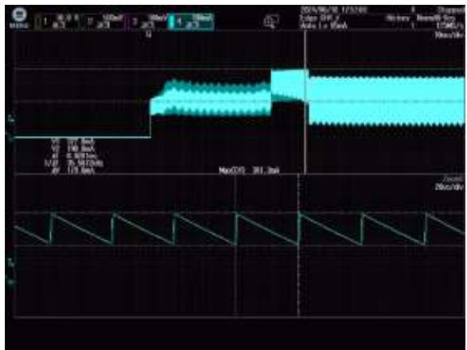

Iout=200mA，Ipk=381mA

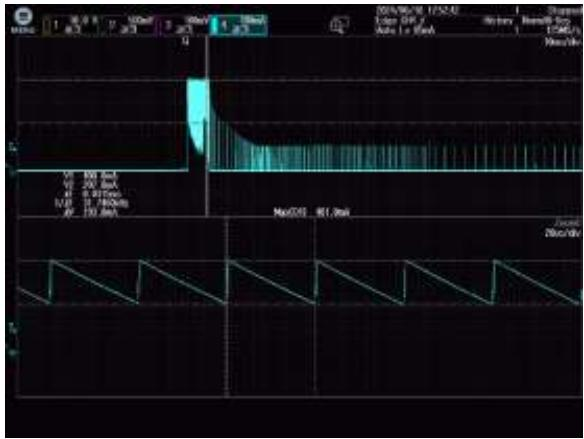

Iout=0mA，Ipk=407mA

KP3114WP芯片  
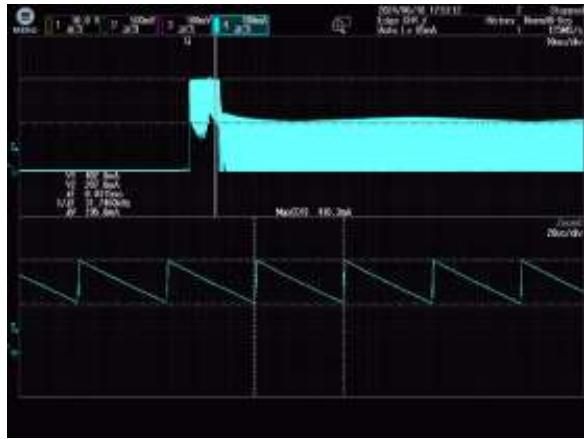

Iout=100mA，Ipk=410mA

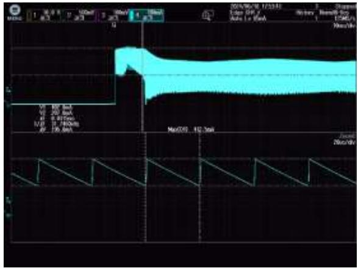

Iout=200mA，Ipk=413mA

上海市浦东新区申江路5005弄星创科技广场3号楼9层

+86-21-51870166

sales@bpsemi.com

www.bpsemi.com

  
微信公众号

  
微信视频号
