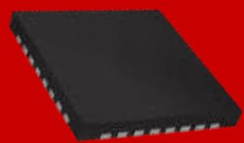
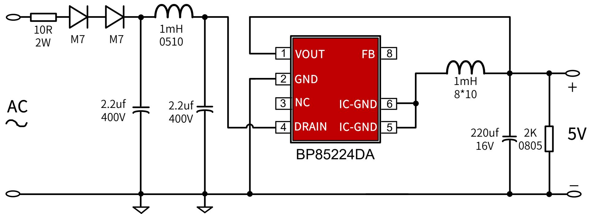
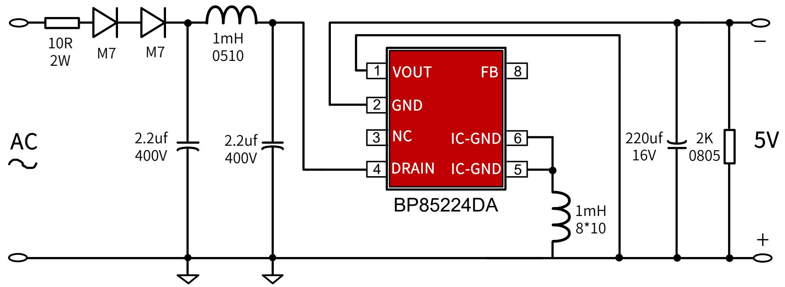
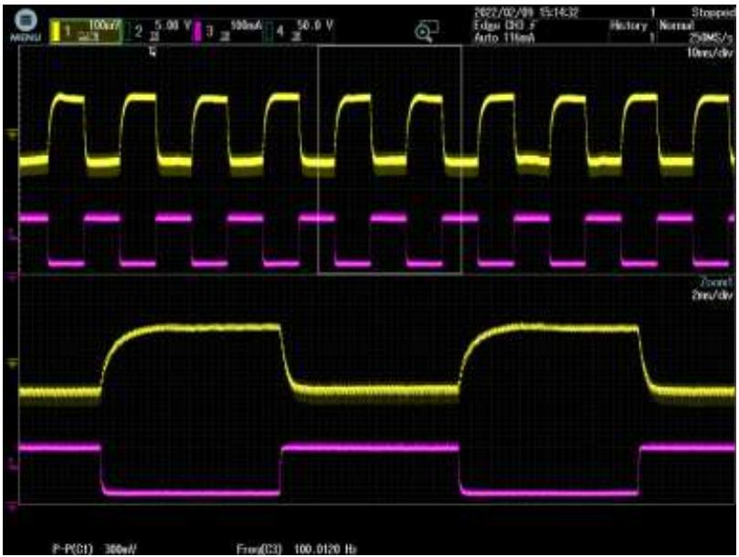
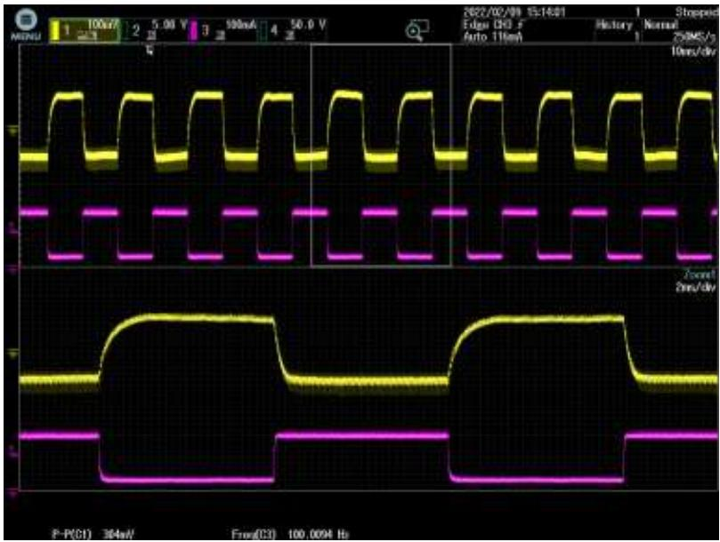
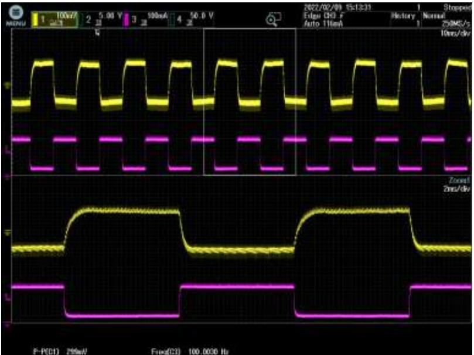
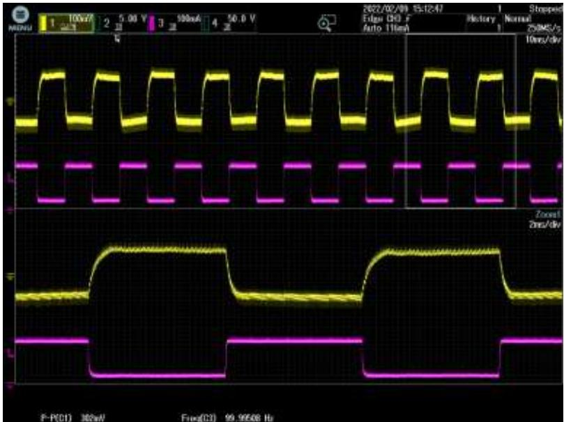

## 小家电-

## BP85224DA ±5V200mA 降压芯片推广资料

上海晶丰明源半导体股份有限公司Shanghai Bright Power Semiconductor Co., Ltd.

## 典型应用图

## 产品特点

高集成度，零外围(启动电路，供电、续流二极管，VCC电容)  
负载调整率好：高低压负载调整率在4.5%以内；  
动态响应快：10%-90%负载，300mV(230Vac, SR 0.2A/uS)  
低待机功耗：50mW@230Vac

内置650V高压MOS  
完善的保护功能  
芯片采用SOP-7封装

BUCK-BOOST 负压输出

<table><tr><td>Part No.</td><td>BV</td><td>Rds_on(Max)</td><td>Output Current Continuous</td><td>MOS Peak Current</td><td>Package</td></tr><tr><td>BP85224DA</td><td>650V</td><td>28Ω</td><td>200mA</td><td>360mA</td><td>SOP-7</td></tr></table>

## 目标应用

➢ 小家电：空气炸锅，烤箱，破壁机，风扇，饭煲等；

负载调整率

<table><tr><td> $V_{IN}(VAC)$ Load(%)</td><td>85</td><td>115</td><td>132</td><td>176</td><td>230</td><td>265</td><td>平均值</td><td>线调整率</td></tr><tr><td>0</td><td>5.10</td><td>5.10</td><td>5.09</td><td>5.08</td><td>5.07</td><td>5.07</td><td>5.09</td><td>0.59%</td></tr><tr><td>25%</td><td>5.04</td><td>5.05</td><td>5.04</td><td>5.05</td><td>5.04</td><td>5.04</td><td>5.04</td><td>0.20%</td></tr><tr><td>50%</td><td>4.97</td><td>4.97</td><td>4.97</td><td>4.97</td><td>4.98</td><td>4.98</td><td>4.97</td><td>0.20%</td></tr><tr><td>75%</td><td>4.93</td><td>4.93</td><td>4.93</td><td>4.92</td><td>4.92</td><td>4.92</td><td>4.93</td><td>0.20%</td></tr><tr><td>100%</td><td>4.90</td><td>4.90</td><td>4.91</td><td>4.90</td><td>4.90</td><td>4.90</td><td>4.90</td><td>0.20%</td></tr><tr><td>平均值</td><td>4.99</td><td>4.99</td><td>4.99</td><td>4.98</td><td>4.98</td><td>4.98</td><td rowspan="2" colspan="2"></td></tr><tr><td>负载调整率</td><td>4.01%</td><td>4.01%</td><td>3.61%</td><td>3.61%</td><td>3.41%</td><td>3.41%</td></tr></table>

温升

<table><tr><td rowspan="2">项目</td><td>85VAC</td><td>115VAC</td><td>230VAC</td><td>265VAC</td></tr><tr><td>温度(°C)</td><td>温度(°C)</td><td>温度(°C)</td><td>温度(°C)</td></tr><tr><td>环境温度</td><td>51.72</td><td>51.57</td><td>51.2</td><td>50.86</td></tr><tr><td>BP85224DA (U1)</td><td>91.28</td><td>92.07</td><td>103.84</td><td>108.72</td></tr><tr><td>温升</td><td>39.56</td><td>40.5</td><td>52.64</td><td>57.86</td></tr><tr><td colspan="5">测试条件:200mA负载,50°C环温</td></tr></table>

## 关键指标-动态负载(10%-90%)

85 VAC

$\mathsf { C H 1 V } _ { \mathsf { P K - P K } } \mathsf { \equiv } 3 6 0 \mathsf { m v }$  
$\mathsf { C H 3 } \mathsf { I _ { 0 \mathsf { U } \mathsf { T } } }$

## Test Condition:

➢ $0 . 0 2 \mathsf { A } \mathsf { - } 0 . 1 8 \mathsf { A } \mathsf { - } 0 . 0 2 \mathsf { A }$  
➢ Slew Rate: 0.2 A/μS  
➢ Frequency: 100 Hz

$\mathsf { C H 1 } \mathsf { V _ { 0 } } \mathsf { \Gamma _ { 3 } } 6 4 \mathsf { m v }$  
$\mathsf { C H 3 } \mathsf { I _ { 0 \mathsf { U } \mathsf { T } } }$

## Test Condition:

➢ $0 . 0 2 \mathsf { A } – 0 . 1 8 \mathsf { A } – 0 . 0 2 \mathsf { A }$  
➢ Slew Rate: $0 . 2 \mathsf { A } / \mu \mathsf { S }$  
➢ Frequency: 100 Hz

230 VAC

$\mathsf { C H 1 V } _ { \mathsf { P K - P K } } { \mathsf { = } } 2 \mathsf { g 9 9 m v }$  
$C \mathsf { H } 3 \mathsf { I } _ { 0 \mathsf { U } \mathsf { T } }$

## Test Condition:

➢ $0 . 0 2 \mathsf { A } \mathsf { - } 0 . 1 8 \mathsf { A } \mathsf { - } 0 . 0 2 \mathsf { A }$  
➢ Slew Rate: 0.2 A/μS  
➢ Frequency: 100 Hz

265 VAC

$\mathsf { C H 1 V } _ { \mathsf { P K - P K } } \mathsf { \equiv } 3 6 2 \mathsf { m v }$  
$\mathsf { C H 3 } \mathsf { I _ { 0 \mathsf { U } \mathsf { T } } }$

## Test Condition:

➢ $0 . 0 2 \mathsf { A } – 0 . 1 8 \mathsf { A } – 0 . 0 2 \mathsf { A }$  
➢ Slew Rate: $0 . 2 \mathsf { A } / \mu \mathsf { S }$  
➢ Frequency: 100 Hz

## 常见竞品比较

<table><tr><td></td><td>BP85224DA</td><td>K*3114SG</td><td>K*3114WPA</td><td>A*8505</td></tr><tr><td>输出电流</td><td>200mA</td><td>250mA</td><td>250mA</td><td>200mA</td></tr><tr><td>功率器件</td><td>650V MOS</td><td>700V MOS</td><td>700V MOS</td><td>650V MOS</td></tr><tr><td> $R_{dson}/I_{SAT}$ </td><td>28Ω(Max)</td><td>20Ω</td><td>20Ω</td><td>25Ω</td></tr><tr><td>待机功耗</td><td>50mW</td><td>100mW</td><td>100mW</td><td>50mW</td></tr><tr><td>外围</td><td>兼容A*8505,少一个VCC电容</td><td>外围多2R,1C,1D 外围成本多0.1</td><td>外围多2R,1C; 省了输入两个二极管</td><td>多1个VCC电容</td></tr><tr><td>负载调整率</td><td>良</td><td>优</td><td>优</td><td>良</td></tr><tr><td>动态</td><td>良</td><td>一般</td><td>一般</td><td>优</td></tr><tr><td>缺点</td><td></td><td>700V MOS,成本高; 外围成本高;</td><td>700V MOS,成本高; 输入端必须加X电容</td><td>成本、交付</td></tr></table>

## THANK YOU FOR WATCHING
