## 概述

BP85224DA是一款高性能、高集成度、低待机功耗的开关电源驱动芯片，适用于全电压85\~265VAC输入的Buck、Buck-Boost变换器拓扑应用。

BP85224DA 内部集成了 650V 高压 MOSFET、高压启动和自供电电路、电流采样电路、电压反馈电路以及续流二极管，采用先进的控制技术，无需外部 VCC电容和环路补偿即可实现优异的恒压输出特性，极⼤地减少了外围器件数量，节省了系统成本和体积，同时提高了可靠性。

BP85224DA 采用多模式控制技术，能有效降低系统待机功耗，提高效率和改善动态性能，并减小系统工作在轻载时的音频噪声。

BP85224DA提供了丰富的保护功能，包括输出短路保护、输出过载保护、输出过压保护、反馈开路保护、逐周期限流、过温保护等，使系统更加安全可靠。

BP85224DA 采用 SOP-7 封装。

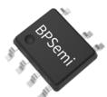  
SOP-7 封装

## 特点

集成VCC电容、续流二极管和反馈二极管  
集成 650V 高压 MOSFET  
集成高压启动和自供电电路  
低待机功耗 50mW@230Vac  
固定5V 输出  
优异的动态响应速度，输出电压纹波小  
良好的负载调整率和线性调整率  
降低音频噪声的降幅调制技术  
自适应开关频率，最高36kHz  
改善EMI性能的频率调制技术  
内置软启动功能  
保护功能

 输出短路保护(SCP)  
 输出过压保护(OVP)  
输出过载保护(OLP)  
 反馈开路保护  
 逐周期限流(Cycle-by-Cycle)  
 迟滞过温保护(OTP)

## 应用领域

小家电辅助电源  
电机驱动辅助电源  
IOT/智能家居/智能照明

典型应用  
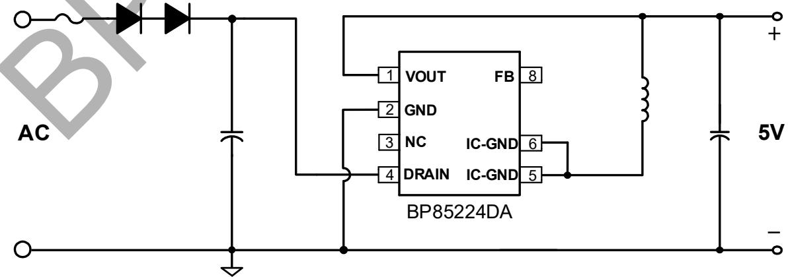

图 1. BP85224DA 典型 Buck 应用电路

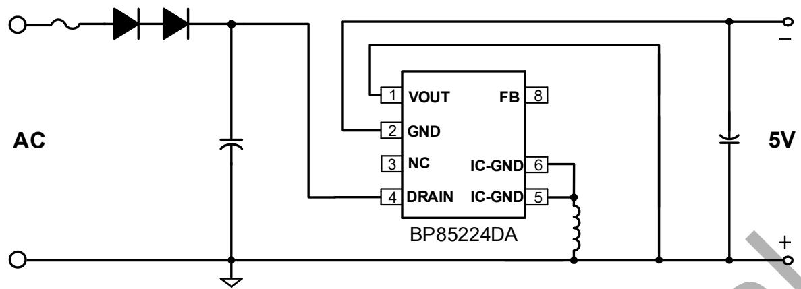

图 2. BP85224DA 典型 Buck-Boost 应用电路

定购信息

<table><tr><td>定购型号</td><td>封装</td><td>包装形式</td><td>打印</td></tr><tr><td>BP85224DA</td><td>SOP-7</td><td>卷盘4,000 只/盘</td><td>BP85224XXXXXYAZZZZWWD</td></tr></table>

## 管脚封装

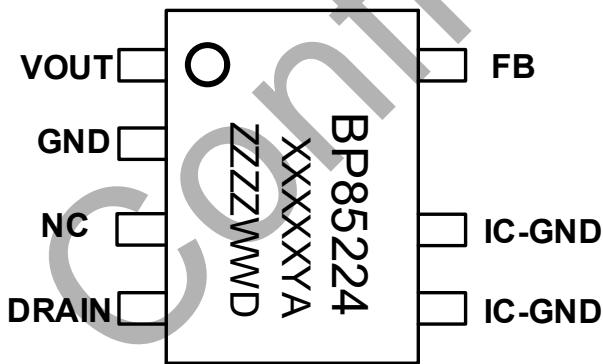

BP85224：产品型号  
XXXXXYA：批次号  
ZZZZ：标示  
WW：周号  
D：封装代码（D代表 SOP-7）

管脚描述

<table><tr><td>管脚号</td><td>管脚名称</td><td>描述</td></tr><tr><td>1</td><td>VOUT</td><td>输出电压端,芯片内部反馈二极管阳极</td></tr><tr><td>2</td><td>GND</td><td>输出电压参考地,内部续流二极管阳极</td></tr><tr><td>3</td><td>NC</td><td>无连接</td></tr><tr><td>4</td><td>DRAIN</td><td>芯片内部高压 MOSFET 漏极,此引脚也向芯片内部提供自供电电流</td></tr><tr><td>5、6</td><td>IC-GND</td><td>芯片地,内部 MOSFET 源极</td></tr><tr><td>8</td><td>FB</td><td>芯片电压采样端,内部反馈二极管阴极,外部无需连接</td></tr></table>

输出规格表

<table><tr><td>型号</td><td colspan="3">输出规格</td></tr><tr><td rowspan="2">BP85224DA</td><td>输出电压(V)</td><td>稳态功率(W)(注1)</td><td>峰值功率(W)(注2)</td></tr><tr><td>5</td><td>1 (5V/200mA)</td><td>1.25 (5V/250mA)</td></tr></table>

注 1：稳态功率在半封闭式 75°C 环境下测试(Buck/Buck-boost 应用)，持续时间⼤于 2 小时。  
注 2：峰值功率在半封闭式 75°C 环境下测试(Buck/Buck-boost 应用)，持续时间⼤于 1 分钟。

极限参数(注 3) （无特别说明情况下， ${ \sf T } _ { \sf A } = 2 5 ^ { \circ } { \sf C } )$

<table><tr><td>符号</td><td>参数</td><td>参数范围</td><td>单位</td></tr><tr><td> $V_{DRAIN}$ </td><td>内部高压 MOSFET 漏极到源极电压</td><td>-0.3~650</td><td>V</td></tr><tr><td> $I_{DS\_MAX}$ </td><td>内部高压 MOSFET 最大漏极电流(注 4)</td><td>910(1710)</td><td>mA</td></tr><tr><td> $V_{FB}$ </td><td>FB 引脚电压(以 IC-GND 引脚为参考)</td><td>-0.3~30</td><td>V</td></tr><tr><td> $V_{GND}$ </td><td>GND 到 IC-GND 引脚电压</td><td>-650~0.3</td><td>V</td></tr><tr><td> $V_{OUT}$ </td><td>VOUT 引脚电压(以 IC-GND 引脚为参考)</td><td>-650~30</td><td>V</td></tr><tr><td> $P_{DMAX}$ </td><td>功耗(注 5)</td><td>0.86</td><td>W</td></tr><tr><td> $\theta_{JA}$ </td><td>结到环境的热阻(注 6)</td><td>145</td><td>°C/W</td></tr><tr><td> $\theta_{JC}$ </td><td>结到芯片表面的热阻(注 7)</td><td>70</td><td>°C/W</td></tr><tr><td> $T_J$ </td><td>工作结温范围</td><td>-40 to 150</td><td>°C</td></tr><tr><td> $T_{STG}$ </td><td>储存温度范围</td><td>-55 to 150</td><td>°C</td></tr><tr><td>ESD</td><td>人体模型 ESD(注 8)</td><td>3.5</td><td>KV</td></tr></table>

注 3：极限参数是指超出该工作范围，芯片有可能损坏。除非特殊说明，电压值均参考 IC-GND。电气参数定义了器件在工作范围内并且在保证特定性能指标的测试条件下的直流和交流电参数规范。对于未给定上下限值的参数，该规范不予保证其精度，但其典型值合理反映了器件性能。  
注 4：当漏极电压低于 400V 时，可允许更高的最⼤漏极电流。  
注 5：温度升高最⼤功耗一定会减小，这也是由 $T _ { \Delta M A X } , \theta _ { J A } ,$ 和环境温度 TA所决定的。最⼤允许功耗为 $P _ { \tt D M A X } = \left( \mathbb { T } _ { \tt J M A X } - \mathbb { T } _ { \tt A } \right) / \theta _ { \tt J A }$ 或是极限范围给出的数字中比较低的那个值。  
注 6：1平方英寸双层 PCB 板，按照 JEDEC 标准测试。  
注 7：该值基于 JEDEC 定义的 1S0P 系统，并将根据应用环境⽽变化。有关更多信息，请参阅 EIA/JEDEC 标准。  
注 8：按照 JEDEC 标准测试，100pF 电容通过 1.5kΩ 电阻放电。

电气参数(注 9)（无特别说明情况下， ${ \sf T } _ { \sf A } = 2 5 ^ { \circ } { \sf C } )$

<table><tr><td>符号</td><td>参数描述</td><td>条件</td><td>最小值</td><td>典型值</td><td>最大值</td><td>单位</td></tr><tr><td colspan="7">自供电</td></tr><tr><td> $V_{DS\_SUP}$ </td><td>最小漏极启动电压</td><td></td><td></td><td>40</td><td></td><td>V</td></tr><tr><td> $I_{CC}$ </td><td>芯片工作电流</td><td> $V_{DRAIN}=40V$ </td><td></td><td>100</td><td></td><td>μA</td></tr><tr><td> $I_Q$ </td><td>芯片静态电流</td><td> $V_{DRAIN}=11V$ </td><td></td><td>80</td><td>110</td><td>μA</td></tr><tr><td colspan="7">输出电压反馈</td></tr><tr><td> $V_{FB}$ </td><td>FB引脚调制电压</td><td></td><td>5.42</td><td>5.55</td><td>5.68</td><td>V</td></tr><tr><td> $V_{FB\_OLP}$ </td><td>FB引脚过载保护电压</td><td></td><td></td><td>2.75</td><td></td><td>V</td></tr><tr><td> $t_{OLP}$ </td><td>输出过载屏蔽时间</td><td></td><td></td><td>1024</td><td></td><td>cycles</td></tr><tr><td> $V_{FB\_SC}$ </td><td>FB引脚短路保护电压</td><td></td><td></td><td>1</td><td></td><td>V</td></tr><tr><td> $t_{SC}$ </td><td>输出短路屏蔽时间</td><td></td><td></td><td>256</td><td></td><td>cycles</td></tr><tr><td> $V_{FB\_OVP}$ </td><td>FB引脚过压保护电压</td><td></td><td></td><td>6.5</td><td></td><td>V</td></tr><tr><td> $t_{AR\_OFF}$ </td><td>自动重启停止时间</td><td></td><td></td><td>0.5</td><td></td><td>s</td></tr><tr><td colspan="7">振荡器</td></tr><tr><td> $f_{S\_MAX}$ </td><td>最大开关频率</td><td></td><td>32.5</td><td>36</td><td>39.5</td><td>kHz</td></tr><tr><td> $f_{S\_MIN}$ </td><td>最小开关频率</td><td></td><td></td><td>0.6</td><td></td><td>kHz</td></tr><tr><td> $t_{ON\_MAX}$ </td><td>最大开通时间</td><td></td><td>8</td><td></td><td></td><td>μs</td></tr><tr><td colspan="7">电流采样</td></tr><tr><td> $I_{LIMIT\_MAX}$ </td><td>最大电流限值(注10)</td><td> $V_{DRAIN}=45V$ </td><td>324</td><td>360</td><td>396</td><td>mA</td></tr><tr><td> $I_{LIMIT\_MIN}$ </td><td>最小电流限值</td><td></td><td></td><td>150</td><td></td><td>mA</td></tr><tr><td> $t_{LEB}$ </td><td>前沿消隐时间</td><td></td><td></td><td>240</td><td></td><td>ns</td></tr><tr><td colspan="7">功率管</td></tr><tr><td> $R_{DS\_ON}$ </td><td>功率管导通阻抗</td><td> $I_{DS}=50mA$ </td><td></td><td></td><td>28</td><td>Ω</td></tr><tr><td> $I_{DSS1}$ </td><td>功率管关断漏电流</td><td> $V_{DS}=500V$ </td><td></td><td>10</td><td></td><td>μA</td></tr><tr><td> $I_{DSS2}$ </td><td>Drain引脚关断漏电流</td><td> $V_{DS}=650V, V_{FB}=9.5V$ </td><td></td><td>110</td><td></td><td>μA</td></tr><tr><td> $BV_{DSS}$ </td><td>功率管的击穿电压</td><td></td><td>650</td><td></td><td></td><td>V</td></tr><tr><td colspan="7">续流二极管</td></tr><tr><td> $V_{RRM1}$ </td><td>二极管反向击穿电压</td><td> $I_R=5μA$ </td><td>650</td><td></td><td></td><td>V</td></tr><tr><td> $V_{F1}$ </td><td>二极管正向导通压降</td><td> $I_F=500mA$ </td><td></td><td>1.2</td><td>1.8</td><td>V</td></tr><tr><td> $I_{FAV1}$ </td><td>最大平均正向导通电流</td><td></td><td>500</td><td></td><td></td><td>mA</td></tr><tr><td> $T_{RR1}$ </td><td>反向恢复时间</td><td> $I_F=300mA, I_R=0.6A, I_{RR}=150mA$ </td><td></td><td></td><td>35</td><td>ns</td></tr><tr><td colspan="7">反馈二极管</td></tr><tr><td> $V_{RRM2}$ </td><td>二极管反向击穿电压</td><td> $I_R=5μA$ </td><td>650</td><td></td><td></td><td>V</td></tr><tr><td> $V_{F2}$ </td><td>二极管正向导通压降</td><td> $I_F=2mA$ </td><td></td><td>0.58</td><td>0.65</td><td>V</td></tr><tr><td> $I_{FAV2}$ </td><td>最大平均正向导通电流</td><td></td><td>500</td><td></td><td></td><td>mA</td></tr><tr><td> $T_{RR2}$ </td><td>反向恢复时间</td><td> $I_F$ =300mA,  $I_R$ =0.6A, $I_{RR}$ =150mA</td><td></td><td></td><td>35</td><td>ns</td></tr><tr><td colspan="7">过热保护</td></tr><tr><td> $T_{OTP}$ </td><td>过温保护阈值</td><td></td><td></td><td>145</td><td></td><td>°C</td></tr><tr><td> $T_{HYST}$ </td><td>过温保护迟滞</td><td></td><td></td><td>40</td><td></td><td>°C</td></tr></table>

注 9：规格书的最小、最⼤规范范围由测试保证，典型值由设计、测试或统计分析保证。除非特殊说明，电压值均参考 IC-GND。  
注 10：电气参数 ILIMIT\_MAX是 FT用 DC 方式测试，无关断延时。实际系统由于关断延时，ILIMIT\_MAX会比设计值高一点，高压更明显。此偏差受到输入电压和电感量影响。

## 内部结构框图

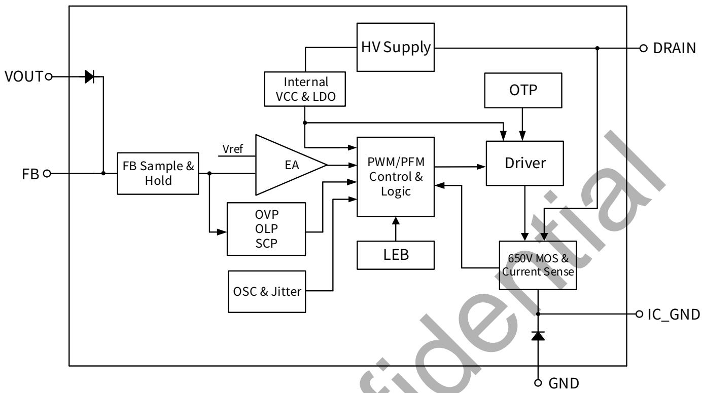

图 4. BP85224DA 内部框图

## 功能描述

BP85224DA 是一款高压输入具有 5V 恒压输出特性的驱动芯片，采用多模式控制和环路补偿技术，无需外部补偿电路。芯片无需外部 VCC 电容，内部集成 650V 功率开关、续流二极管、高压自供电电路、电流采样电路、电压反馈电路，以及丰富的保护功能，只需要极少的外围器件就可以达到优异的恒压输出特性。开关频率根据电感和负载自适应调整，使电源设计更加灵活。同时，具有较低的待机功耗、良好的输出电压调整率、较低的输出电压纹波和低音频噪声使得BP85224DA 特别适合于非隔离辅助电源应用。（注 11：以下描述到的参数均为电气参数列表中的典型值，除非特别说明是最⼤或最小值）

## 高压启动供电

BP85224DA集成了高压启动与自供电电路，无需外部VCC电容。系统上电后，⺟线电压上升，内部高压启动电路通过DRAIN 端对内部 VCC 电容充电。当内置 VCC 电容电压达到芯片启动阈值 11V 时，芯片内部控制电路开始工作。当 VCC电容电压降低到欠压保护阈值5V时，芯片关断内部 MOSFET。芯片正常工作时，在 MOSFET 关断期间，自供电电路通过DRAIN 端对内置 VCC电容供电。

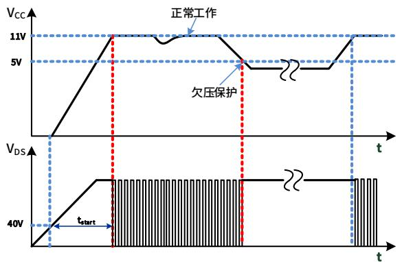

图5. 高压启动与VCC欠压保护时序

## 软启动

BP85224DA具有软启动功能，在软启动过程中，MOSFET 峰值电流(限流点)逐渐增加。由于启动时输出电压一般较低，MOSFET 关断期间输出电压对电感的去磁较少，电感电流进入深度连续模式(CCM)，使得续流二极管的反向恢复电流较⼤。续流二极管反向恢复电流会通过 MOSFET 并产生损耗，过⼤的电流尖峰还可能会导致MOSFET损坏。软启动电路通过控制启动过程中MOSFET 峰值电流逐渐增加，可以有效降低二极管的反向恢复电流，从⽽降低 MOSFET电流应⼒。 由保护电路触发产生的重启动也会经历一次软启动过程，以避免输出电压过冲。软启动过程如图 6 所示，起始限流值为 50%最⼤限流值，32 个开关周期(TS)后增加到 75%最⼤限流值，再持续32 个开关周期后结束软启动，限流值变为最⼤值。

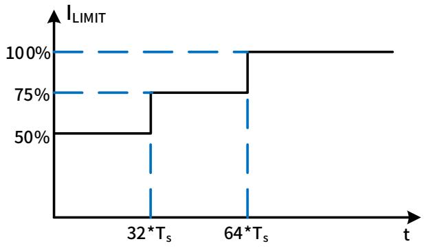

图6. 软启动过程

## 输出电压采样

BP85224DA通过VOUT 引脚采样输出电压，经过内置反馈二极管到达 FB 引脚，FB 电压经内部电阻分压后与内部基准电压进⾏运算实现恒压控制。输出电压采样仅在续流状态 3μs时进⾏，电感设计时建议保证续流时间⼤于 7μs，以防止无法正确采样输出电压导致工作异常。

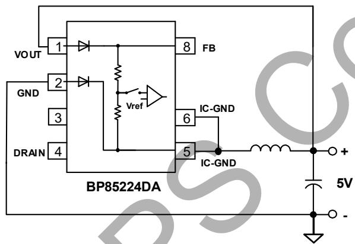

图7. 输出电压采样示意图

## 多模式控制

BP85224DA 采用 PWM/PFM 多模式控制技术，能有效降低系统待机功耗，提高平均效率，并减小系统工作在轻载时的噪声。电感峰值电流控制模式，具有较快的动态响应速度。如图8 所示，重载条件下，芯片工作在混合模式(PWM+PFM)，MOSFET限流点（电感峰值电流）随负载增加⽽升高，最高为 ILIMIT\_MAX（360mA），同时开关频率随负载增加⽽升高，最高为 fS\_MAX(36kHz)。随着负载减小，开关频率降低，达到22kHz后芯片进入 PWM 工作模式。PWM 模式下开关频率保持 22kHz 不变，MOSFET 限流点随负载减小⽽降低，直到最低限流点ILIMIT\_MIN。轻载条件下进入 PFM 模式，MOSFET 限流点保持ILIMIT\_MIN不变，开关频率随负载减小继续降低，直到空载条件下，开关频率降低到最小值 $\mathsf { f } _ { \mathsf { S } _ { \mathrm { - } } \mathsf { M I N } } ( 0 . 6 \mathsf { k H z } )$ 。轻载和空载条件下，较小的电感峰值电流在磁芯中产生的磁通密度也相应减小，因此能有效抑制音频噪声。

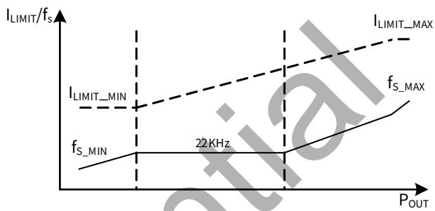

图8. 控制模式

## 电流检测

BP85224DA内部集成电流采样电路，无需外置电流采样电阻，对MOSFET 电流逐周期限制。当一个开关周期开始时，控制电路开通 MOSFET，漏极电流上升，当电流上升达到内部限制值时，控制电路关断MOSFET，直到下一个开关周期开始。内置前沿消隐(Leading Edge Blanking)时间， $\tan \angle C _ { \mathsf { L E B } }$ 可以避免由于外部电路的容性或二极管的反向恢复导致MOSFET在开通瞬间出现的电流尖峰误触发 MOSFET 关断。

## 自动重启

当外部故障（输出短路、过压、过载）触发相应的保护，控制电路关断 MOSFET，系统停止工作。BP85224DA内部的自动重启电路等待 $\tt t _ { A R \_ O F F }$ (0.5s)时间后重新启动系统，如果启动后故障没有消除，则重新触发相应的保护。每次重启都会经历软启动过程。

## 短路保护/过载保护(SCP/OLP)

BP85224DA 内部控制电路通过 FB 引脚检测输出短路或过载故障。如图9 所示，当FB 电压低于 $V _ { F B \_ S C } ( 1 \vee )$ 且保持256个开关周期，则触发短路保护(SCP)并进入自动重启程序。将FB引脚短路到 IC-GND 或 VOUT 引脚悬空也可以触发该保护。如果芯片检测到 FB 电压低于 $V _ { \mathsf { F B \_ O L P } } \left( 2 . 7 5 \mathsf { V } \right)$ 且持续 1024 个开关周期，则触发过载保护(OLP)并进入自动重启程序。

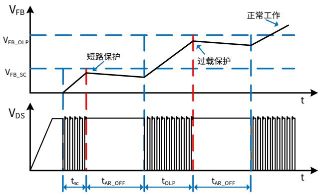

图9. 短路保护、过载保护工作模式

## 输出过压保护（OVP）

BP85224DA 内部控制电路通过 FB 引脚检测输出过压故障。当 FB 电压连续 4 个开关周期高于 VFB\_OVP(6.5V)时，触发输出过压保护，芯片进入自动重启程序。

## 过温保护（OTP）

BP85224DA内置了过温保护电路。当结温达到过温保护阈值TOTP(145℃)时，芯片会停止工作，MOSFET 关断，直到结温下降到 TOTP-THYST时，芯片重新启动。THYST(40℃)为温度迟滞，较⼤的温度迟滞有利于把系统整体温度控制在较低水平。

## 应用指南

## 输出电感计算（Buck 拓扑）

BP85224DA 系列可工作于 CCM 和 DCM 工作模式，取决于额定输出电流和输出电感感量。当 Buck 变换器输出电流$\lvert _ { 0 \cup \mathsf { T } } > 0 . 5 ^ { \star } \rvert _ { \mathsf { L } | \mathsf { M } | \mathsf { T } \_ { \mathsf { M A X } } } \sharp \neq$ ，电感需要工作于 CCM 才能满足负载电流要求；当 $\mathsf { l o u r } { < } 0 . 5 ^ { \star } \mathsf { l } _ { \mathsf { L I M I T \_ M A X } }$ 时，DCM 和CCM都可以满足输出负载电流要求，工作模式取决于电感的感量⼤小。电感感量越⼤，带载能⼒越强，因为需要更多圈数，体积也会更⼤，成本相对高，动态响应较慢，CCM 下开关损耗⼤。小感量电感可以减小尺寸、降低价格以及改善系统动态响应，CCM 下开关损耗小，但同时会增⼤电感的峰值电流和输出纹波电压，峰值带载能⼒也较小。通常，在满足最⼤输出电流的前提下，尽量选取小电感量。实际选择电感时，通常根据输入输出规格，计算出能满足输出电流的最小电感值，然后从电感供应商的选 型 手 册 中 选 取 ⼤ 一 档 的 标 准 值 电 感 。 因 此 ，IOUT >0.5\*ILIMIT\_MAX 时按照 CCM 计算电感量，IOUT <0.5\*ILIMIT\_MAX时按照DCM 计算电感量。

CCM 模式下，如图 10 所示，根据输入/输出电压、系统开关频率、满载输出电流以及芯片最⼤限流值计算最小电感值：

$$
L _ {M I N} = \frac {(V _ {O U T} + V _ {D i o d e}) * (V _ {I N} - V _ {D S} - V _ {O U T})}{(V _ {I N} - V _ {D S} + V _ {D i o d e}) * f _ {S} * \Delta I _ {L}}
$$

其中， $V _ { \mathsf { I N } }$ 输入直流⺟线电压

$\mathsf { V o u r }$ 输出电压

$\mathsf { I o u r }$ 输出电流

$V _ { \sf D i o d e }$ 续流二极管压降

$\mathsf { V } _ { \mathsf { D S } }$ 开关管tON时间内平均压降

$\mathsf { f } _ { \mathsf { S } }$ 开关频率

$\mathrm { \bf t } _ { \otimes \mathrm { N } }$ 开关管开通时间

$\tan \ F \ F$ 开关管关断时间

$\mathsf { I } _ { \mathsf { L I M I T \_ M A X } }$ 芯片最⼤限流值

$$
\Delta I _ {L} = 2 * (I _ {L I M I T \_ M A X} - I _ {O U T})
$$

$$
V _ {D S} = I _ {O U T} * R _ {d s (O N)}
$$

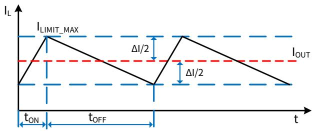

图10. CCM 模式下的电感电流

电感电流有效值为：

$$
I _ {R M S} = \sqrt {I _ {L I M I T \_ M A X} ^ {2} - I _ {L I M I T _ {M A X}} * \Delta I _ {L} + \frac {\Delta I _ {L} ^ {2}}{3}}
$$

DCM 模式下(如图 11所示)，根据输入/输出电压、系统开关频率、满载输出电流以及芯片最⼤限流值计算最小电感值：

$$
L _ {M I N} = \frac {2 * I _ {O U T} * (V _ {O U T} + V _ {D i o d e}) * (V _ {I N} - V _ {D S} - V _ {O U T})}{(V _ {I N} - V _ {D S} + V _ {D i o d e}) * f _ {S} * I _ {L I M I T \_ M A X} ^ {2}}
$$

其中，

$$
V _ {D S} = \frac {1}{2} * I _ {L I M I T \_ M A X} * R _ {d s (O N)}
$$

电感电流有效值为：

$$
I _ {R M S} = I _ {L I M I T \_ M A X} * \sqrt {\frac {t _ {O N} + t _ {O F F}}{3} * f _ {S}}
$$

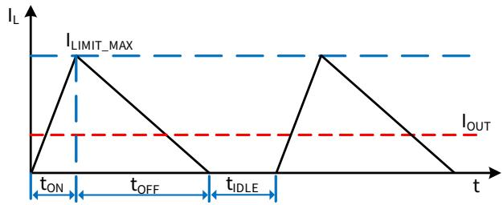

图 11. DCM 模式下的电感电流

一般来说， $V _ { \sf I N }$ 是一个范围，通常选择最⼤输入直流⺟线电压代入计算公式，或者也可以分别计算最高和最低⺟线电压对应的电感量，最后取两者中较⼤者。上述两个电感表达式计算出来的都是输出额定电流所需的最小电感量，设计中需要考虑实际电感的精度，通常取计算值的 1.1 倍以保证批量生产时能满足最低电感量的要求。表达式中 ILIMIT\_MAX 应该取芯片最⼤限流值的下限。

为了降低待机功耗，减小输出端需要的假负载，BP85224DA通过多模式控制降低了空载下的限流点和开关频率。为了使空载时电感电流可控，电感量需要足够⼤以⾄于在 MOSFET最小导通时间内电流峰值不超过芯片最低限流值。即

$$
L \geq \frac {t _ {L E B} * (V _ {I N \_ M A X} - V _ {O U T})}{I _ {L I M I T \_ M I N}}
$$

其中，tLEB 为前沿消隐时间， ILIMIT\_MIN 为芯片的最低限流值。

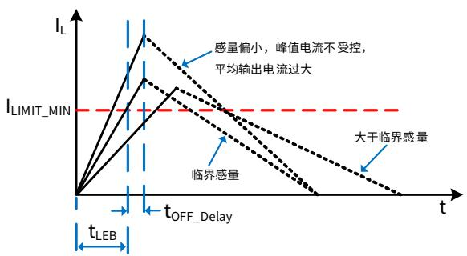

图12. 空载下的电感电流

如图12 所示，电感量小于临界值会导致tLEB时刻电感峰值电流⼤于芯片控制的限流点，平均输出电流过⼤，需要较⼤的假负载给电感电流提供通路，从⽽稳定输出电压。

此外，所选择的电感需要保证芯片在最低限流点时的续流时间⼤于7μs，以保证芯片可以正常的反馈采样，即：

$$
L \geq \frac {7 u s * V _ {O U T}}{I _ {L I M I T \_ M I N}}
$$

因此，通常最终的电感值需要同时满足以上三个条件。待机要求不高的应用只需要满足额定输出电流对最小电感的要求就可以了。确定电感值后，还需要确认电感的有效值电流是否满足上述计算值，同时还需要保证电感磁芯在芯片最⼤限流值ILIMIT\_MAX不饱和，供应商的选型手册中一般会给出电感的有效值电流和饱和电流值。

## 输入电容选择

输入滤波电容对工频电压纹波、传导 EMI、以及电源抵抗Surge 的能⼒都起到关键的作用。电容量的选择要保证直流⺟线电压不能过低(通常不要低于70V)，因此电容量取决于输出功率和电源效率。 全电压 85\~265VAC 输入时，如果使用全波整流，一般取≥3μF/W；对于半波整流，电容量一般取≥6μF/W。 单高压 176\~265VAC 输入时，在满足 EMI 和 Surge的前提下容量可以减半。

## 输出电容的选择

输出电容的作用是滤除电感电流中的交流成分，提供稳定的直流电压给负载，一般根据输出电压纹波要求来选取合适的电容。当输出电流恒定时，输出纹波主要由输出电容的 ESR以及容量决定。

$$
\Delta V _ {O U T} = \Delta V _ {E S R} + \Delta V _ {C}
$$

CCM 模式下，由容性产生的纹波电压为：

$$
\Delta V _ {C} = \frac {\Delta I _ {L}}{8 * C _ {O U T} * f _ {S}}
$$

DCM 模式下，由容性产生的纹波电压为：

$$
\Delta V _ {C} = \frac {I _ {O U T} * (I _ {L I M I T \_ M A X} - I _ {O U T}) ^ {2}}{C _ {O U T} * f _ {S} * I _ {L I M I T \_ M A X} ^ {2}}
$$

实际应用中，为了得到较小的 ESR，电容量相对比较⼤，因此由容量产生的输出电压纹波很小，⼏乎可以忽略，因此电压纹波主要由电容的ESR 产生：

$$
\Delta V _ {E S R} = \Delta I _ {L} * E S R \quad (\text { C   C   M })
$$

$$
\Delta V _ {E S R} = I _ {\text { LIMIT\_MAX }} * E S R \quad (\text { DCM })
$$

ESR 不仅产生输出电压纹波，还会导致电容产生损耗⽽发热，缩短电解电容的寿命，特别是工作于DCM 模式时。

## 假负载计算

为了维持较低的空载损耗，芯片的最低开关频率设置为0.6kHz。当输出空载时，需要一个假负载为电感电流提供回路，从⽽稳定输出电压，电感的平均电流即为假负载的电流。

$$
I _ {A V G} = \frac {1}{2} I _ {L} * \left(T _ {O N} + T _ {O F F}\right) * f _ {S \_ M I N}
$$

其中，IL为空载时电感峰值电流：

$$
I _ {L} = \frac {V _ {I N \_ M A X}}{L} * t _ {D e l a y} + I _ {L I M I T \_ M I N}
$$

ILIMIT\_MIN为芯片的最低限流值，fS\_MIN 为芯片最低频率，TON，T 分别为空载时MOSFET开通和关断时间：

$$
T _ {O N} = \frac {L * I _ {L}}{V _ {I N \_ M A X}}
$$

$$
T _ {O F F} = \frac {L * I _ {L}}{V _ {O U T} + V _ {D i o d e}}
$$

$$
R _ {L} = \frac {V _ {O U T}}{I _ {A V G}}
$$

以上计算未考虑芯片自供电电流通过假负载，实际需要的假负载电流稍⼤，一般为1\~3mA左右。

## Buck-Boost 应用设计

BP85224DA 系列芯片也可以应用于 Buck-boost 拓扑中，实现负电压输出，芯片的基本功能与 Buck拓扑类似。由于电感只在MOSFET关断期间对输出端提供能量，相同的输出功率需要较⼤感量的电感。

CCM 模式下，通过以下表达式计算最小电感值：

$$
L _ {M I N}
$$

$$
= \frac {0 . 5 * V _ {O U T} ^ {\prime} * V _ {I N} ^ {\prime 2} * \frac {1}{f _ {S}}}{(V _ {I N} ^ {\prime} + V _ {O U T} ^ {\prime}) * [ V _ {I N} ^ {\prime} * I _ {L I M I T \_ M A X} - (V _ {I N} ^ {\prime} + V _ {O U T} ^ {\prime}) * I _ {O U T} ]}
$$

其中 ${ V _ { I N } } ^ { \prime } = V _ { I N } - V _ { D S }$

$$
V _ {O U T} ^ {\prime} = V _ {O U T} + V _ {D i o d e}
$$

$$
V _ {D S} = \frac {V _ {I N} ^ {\prime} + V _ {O U T} ^ {\prime}}{V _ {I N} ^ {\prime}} * I _ {O U T} * R _ {d s (O N)}
$$

$V _ { \mathsf { I N } }$ 输入直流⺟线电压

$\mathsf { V o u r }$ 输出电压

$\mathsf { I o u r }$ 输出电流

$V _ { \sf D i o d e }$ 续流二极管压降

$\mathsf { V } _ { \mathsf { D S } }$ 开关管 $\mathsf { t } _ { \mathsf { O N } }$ 时间内平均压降

$\mathsf { I } _ { \mathsf { L I M I T \_ M A X } }$ 芯片最⼤限流值

电感电流有效值为：

$$
I _ {R M S} = \sqrt {I _ {L I M I T \_ M A X} ^ {2} - I _ {L I M I T _ {M A X}} * \Delta I _ {L} + \frac {\Delta I _ {L} ^ {2}}{3}}
$$

其中

$$
\Delta I _ {L} = 2 * (I _ {L I M I T _ {M A X}} - \frac {I _ {O U T}}{V _ {I N}} ^ {\prime} * (V _ {I N} ^ {\prime} + V _ {O U T} ^ {\prime}))
$$

DCM 模式下，通过以下表达式计算最小电感值：

$$
L _ {M I N} = \frac {2 * (V _ {O U T} + V _ {D i o d e}) * I _ {O U T}}{I _ {L I M I T \_ M A X} ^ {2} * f _ {S}}
$$

电感电流有效值为：

$$
I _ {R M S} = I _ {L I M I T \_ M A X} * \sqrt {\frac {t _ {O N} + t _ {O F F}}{3} * f _ {S}}
$$

空载条件对最小感量的限制跟BUCK 拓扑基本一致。

由于电感只在MOSFET 关断期间对输出端提供能量，因此输出滤波电容纹波电流比 BUCK 拓扑⼤，电压纹波主要由电容的ESR 产生：

$$
\Delta V _ {E S R} = I _ {\text { LIMIT\_MAX }} * E S R \quad (\text { 适应于DCM / CCM })
$$

## PCB Layout 指南

在设计 BP85224DA 应用 PCB 时，需要遵循以下建议：

1) VOUT 和 FB 脚应避免铺铜，且远离⺟线电压、⺟线地和输出电感，以防止反馈信号收到干扰。  
2) 芯片地引脚能很好地起到散热作用，可以在PCB上铺铜来降低芯片的温度，但是芯片地也为动点（相对⺟线地电压），在满足散热的条件下铺铜面积应尽量小。同时，芯片地要远离输入交流端，以减小容性耦合产生的 EMI问题。  
3) BUCK 变换器中，芯片 MOSFET 漏极接输入直流⺟线，为静点，可以铺铜⽪提高芯片的散热能⼒。但是需要保证漏极和FB 脚、芯片地的距离⼤于 2mm。  
4) 为了达到较好的辐射 EMI，需要尽可能减小功率环路的面积。输入⺟线电容，芯片 DRAIN 引脚，GND，续流二极管形成的环路，电流断续，容易产生辐射 EMI，因此⺟线电容应尽量靠近芯片漏极或者加瓷片电容缩小环路面积。续流二极管，输出电感，输出电容形成的环路，电流连续，但是存在较⼤纹波，也需要减小环路面积。  
5) ⼤部分输出电感为工字形电感，开放式磁路容易产生干扰，需要远离芯片 FB 脚，同时需要远离输入端以避免EMI 问题。

## 设计实例

如图 13 所示，为用 BP85224DA 设计的一个全电压输入，5V/0.2A 输出的低成本、高效率的电源实例，采用 Buck 拓扑。电源输入端包含 RZ1，MOV，CX，D1，D2，EC1，EC2，L1。其中 RZ1 为保险丝电阻，在电源故障状态下起保护作用。MOV 的作用是在雷击瞬间钳位输入端电压，保护后级电路。L1 和 EC1，EC2 组成π型滤波，改善电路 EMI 性能。整流桥二极管 D1，D2 将输入交流电压全波整流成直流电压。EC1，EC2 对整流后的电压进⾏平滑滤波。

主功率电路包含BP85224DA，由于芯片内部集成续流二极管和采样二极管，所以外围器件仅包含功率电感 L2，输出电容EC3 为电解电容以达到较小的输出电压纹波，输出纹波电压主要取决于电容的 ESR，R3 为假负载。PCB layout 如图 14所示，根据 layout 指南设计的单面板。

Note：

1. 当电路包含 X 电容时，电解电容 EC1 可以省去，由 X 电容 CX，EC2和 L1 组成π型滤波。  
2. 当去掉 MOV 时，需要适当增加保险丝电阻 RZ1 的阻值，以通过 2KV浪涌的测试。

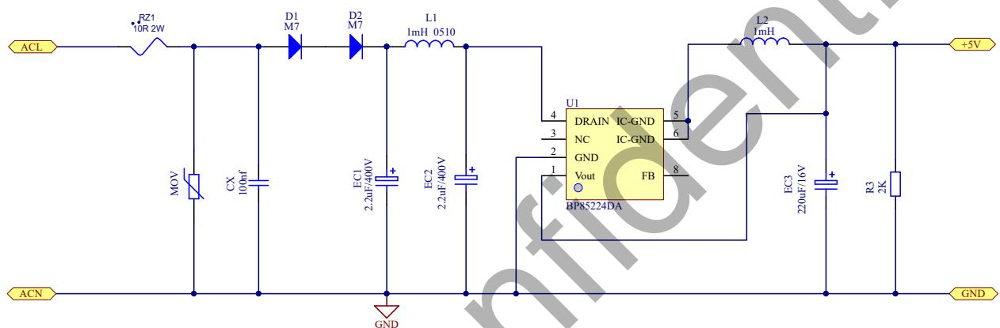

图 13. BP85224DA 设计实例电路图，85\~265VAC 输入，5V/0.2A 输出

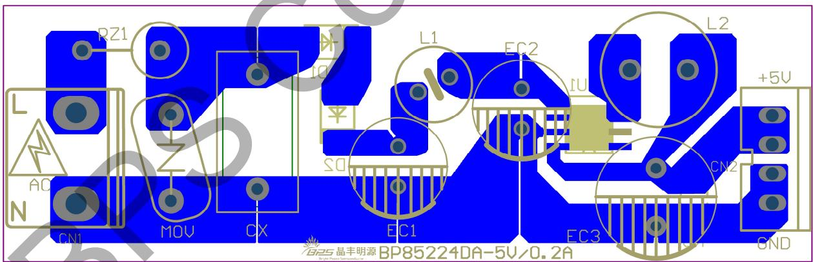

图 14. BP85224DA 设计实例 PCB Layout (单面板)

## 封装信息

SOP-7 封装外形尺寸  
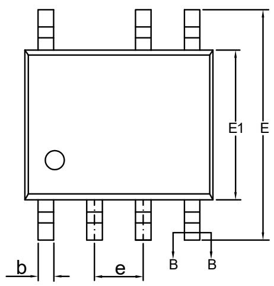

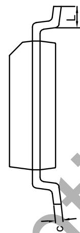

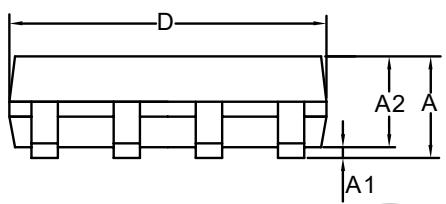

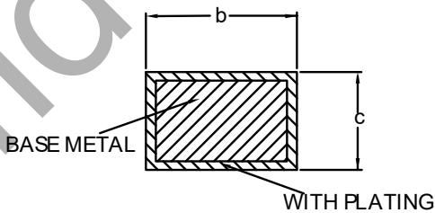

SECTION B-B

<table><tr><td rowspan="2">SYMBOL</td><td colspan="3">MILLIMETER</td></tr><tr><td>MIN</td><td>NOM</td><td>MAX</td></tr><tr><td>A</td><td>1.30</td><td>—</td><td>1.80</td></tr><tr><td>A1</td><td>0.05</td><td>—</td><td>0.25</td></tr><tr><td>A2</td><td>1.25</td><td>—</td><td>1.65</td></tr><tr><td>b</td><td>0.33</td><td>—</td><td>0.51</td></tr><tr><td>c</td><td>0.10</td><td>—</td><td>0.25</td></tr><tr><td>D</td><td>4.70</td><td>4.90</td><td>5.10</td></tr><tr><td>E</td><td>5.80</td><td>6.00</td><td>6.24</td></tr><tr><td>E1</td><td>3.70</td><td>3.90</td><td>4.10</td></tr><tr><td>e</td><td colspan="3">1.27BSC</td></tr><tr><td>L</td><td>0.40</td><td>—</td><td>1.00</td></tr></table>

版本信息

<table><tr><td>版本</td><td>日期</td><td>记录</td></tr><tr><td>Rev.1.0</td><td>2022/04</td><td>首次发行</td></tr><tr><td>Rev.1.1</td><td>2022/06</td><td>1. 更新输出规格表达形式2. 更新Buck-Boost应用设计中 $L_{MIN}$ 计算表达式3. 增加设计实例</td></tr><tr><td>Rev.1.2</td><td>2022/11</td><td>更新极限参数</td></tr><tr><td>Rev.1.3</td><td>2024/03</td><td>1. 更新 $I_{LIMIT\_MAX}$ 的测试条件和注释2. 更新公司Logo3. 更新封装表面印章的内容</td></tr></table>

## 免责声明

晶丰明源尽⼒确保本产品规格书内容的准确和可靠，但是保留在没有通知的情况下，修改规格书内容的权利。

本产品规格书未包含任何针对晶丰明源或第三方所有的知识产权的授权。针对本产品规格书所记载的信息，晶丰明源不做任何明示或暗示的保证，包括但不限于对规格书内容的准确性、商业上的适销性、特定⽬的的适用性或者不侵犯晶丰明源或任何第三人知识产权做任何明示或暗示保证，晶丰明源也不就因本规格书本⾝及其使用有关的偶然或必然损失承担任何责任。
