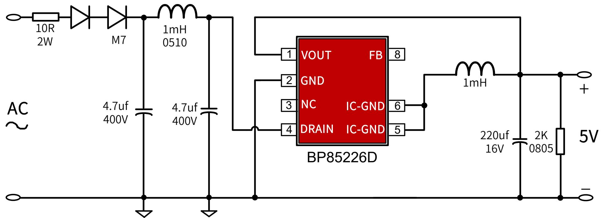
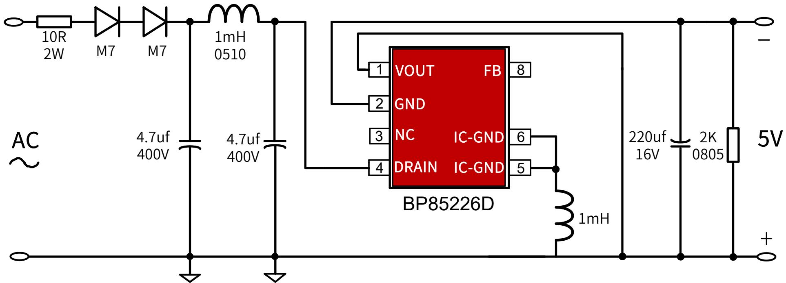
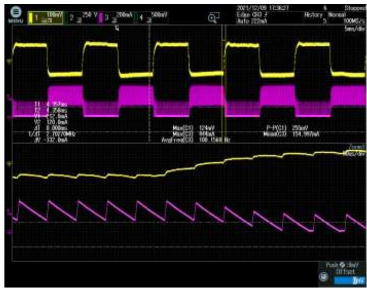
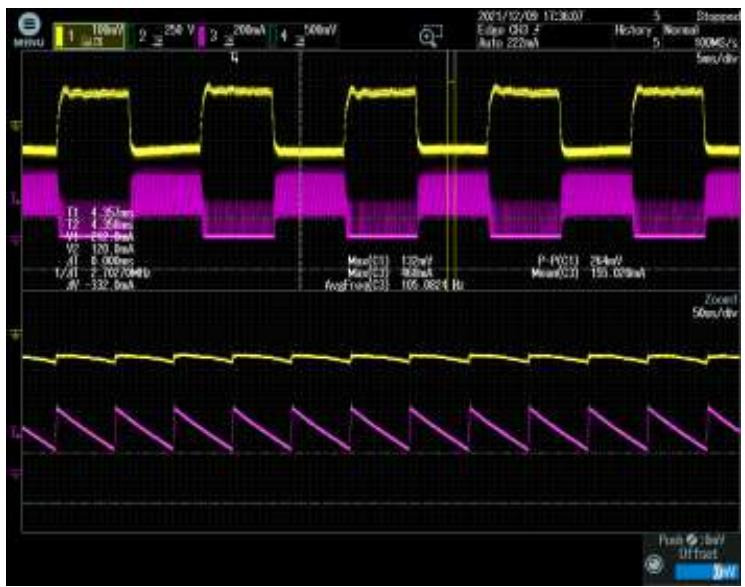
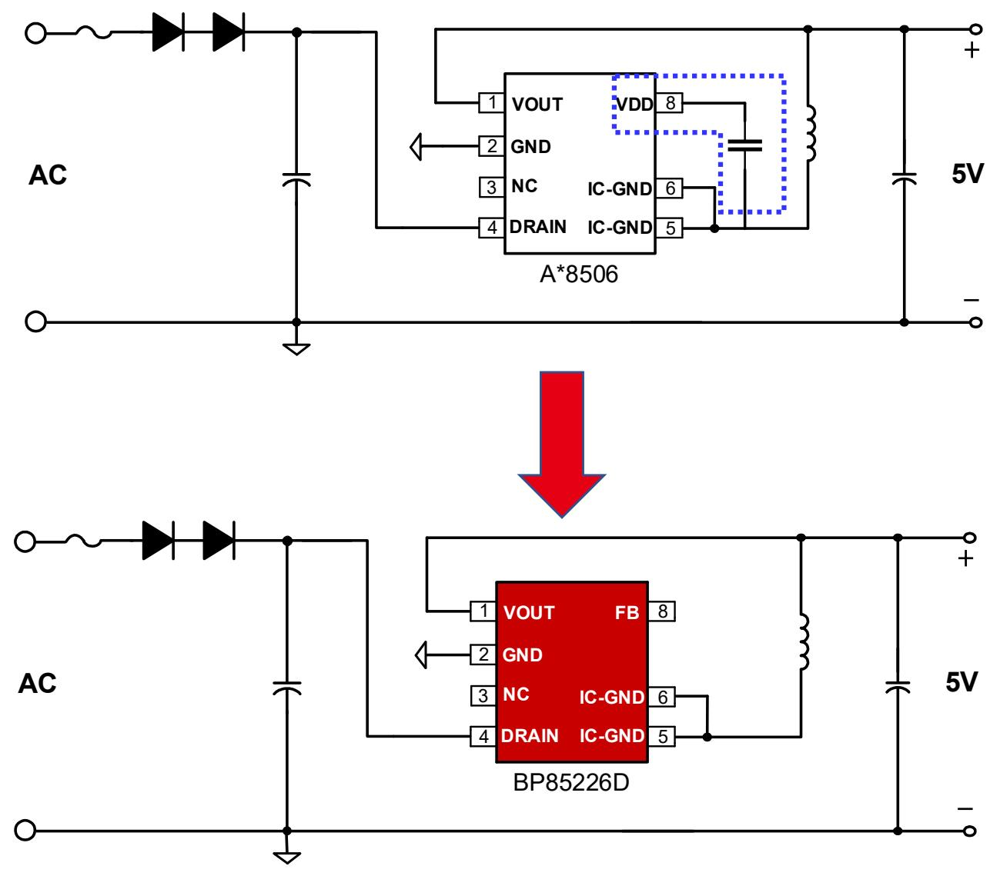
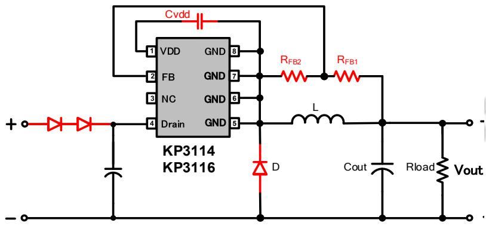
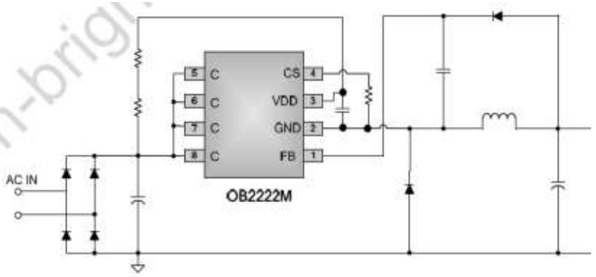
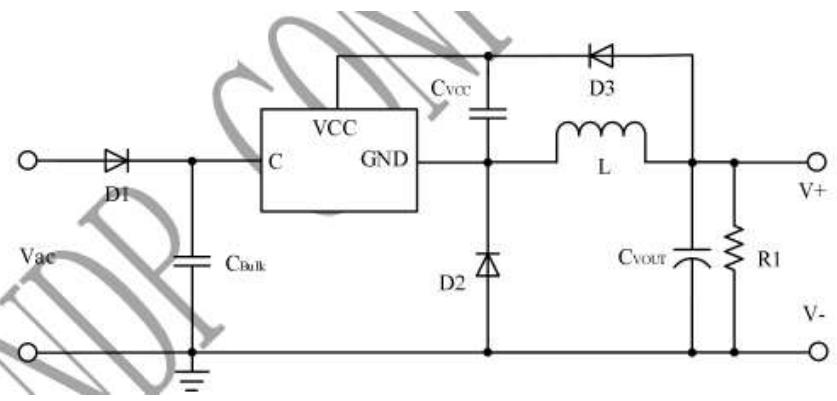

## 小家电-

## BP85226D ±5V300mA 降压芯片推广资料

上海晶丰明源半导体股份有限公司Shanghai Bright Power Semiconductor Co., Ltd.

## 典型应用图

## 产品特点

高集成度，零外围(启动电路，供电、续流二极管，VCC电容)  
负载调整率好：高低压负载调整率在4.5%以内；  
动态响应快：10%-90%负载，270mV(230Vac, SR 0.2A/uS)  
低待机功耗：50mW@230Vac

内置650V高压MOS  
完善的保护功能  
芯片采用SOP-7封装

BUCK-BOOST 负压输出

<table><tr><td>Part No.</td><td>BV</td><td>Rds_on</td><td>Output Current Continuous</td><td>MOS Peak Current</td><td>Package</td></tr><tr><td>BP85226D</td><td>650V</td><td>11Ω</td><td>300mA</td><td>600mA</td><td>SOP-7</td></tr></table>

## 目标应用

小家电：空气炸锅，烤箱，吹风筒等；  
➢ 电工：带WIFI智能开关，智能插座，智能门铃等；

负载调整率

<table><tr><td> $V_{IN}(VAC)$  $I_{OUT}(A)$ </td><td>85</td><td>115</td><td>132</td><td>176</td><td>230</td><td>265</td><td>线调整率</td></tr><tr><td>0</td><td>5.12</td><td>5.11</td><td>5.11</td><td>5.1</td><td>5.09</td><td>5.09</td><td>0.59%</td></tr><tr><td>25%</td><td>5.06</td><td>5.06</td><td>5.04</td><td>5.05</td><td>5.05</td><td>5.05</td><td>0.40%</td></tr><tr><td>50%</td><td>5</td><td>4.99</td><td>4.99</td><td>4.99</td><td>4.99</td><td>4.99</td><td>0.20%</td></tr><tr><td>75%</td><td>4.95</td><td>4.95</td><td>4.94</td><td>4.94</td><td>4.94</td><td>4.94</td><td>0.20%</td></tr><tr><td>100%</td><td>4.91</td><td>4.9</td><td>4.89</td><td>4.89</td><td>4.9</td><td>4.9</td><td>0.41%</td></tr><tr><td>负载调整率</td><td>4.19%</td><td>4.20%</td><td>4.41%</td><td>4.21%</td><td>3.80%</td><td>3.80%</td><td></td></tr></table>

温升

<table><tr><td> $V_{IN}(VAC)$ </td><td>85</td><td>115</td><td>230</td><td>265</td></tr><tr><td>IC</td><td>103.41</td><td>102.53</td><td>119.83</td><td>128</td></tr><tr><td>温升</td><td>53.41</td><td>52.53</td><td>69.83</td><td>77.6</td></tr><tr><td colspan="5">测试条件:300mA负载,环温50°C</td></tr></table>

## 动态

➢ 测试条件：10%\~90%动态负载，负载占空比为50%，频率100Hz，斜率200mA/us;

Vin=85Vac, ∆V=255mV

Vin=265Vac, ∆V=264mV

<table><tr><td>IC型号</td><td>BP85226D</td><td>A*8506</td></tr><tr><td>IC封装</td><td>SOP7(管脚兼容)</td><td>SOP7/DIP7</td></tr><tr><td>空载待机功耗</td><td>50mW</td><td>50mW</td></tr><tr><td>外围成本</td><td>零外围</td><td>多了VCC电容</td></tr><tr><td>工作模式</td><td>PFM/PWM</td><td>ON/OFF</td></tr><tr><td>最大输出电流</td><td>300mA</td><td>300mA</td></tr><tr><td>Rds_on (Ω)</td><td>11</td><td>10</td></tr><tr><td>MOS BV (V)</td><td>650</td><td>650</td></tr><tr><td>音频噪声</td><td>无</td><td>较大</td></tr><tr><td>负载调整率</td><td>4.5%</td><td>3.8%</td></tr><tr><td>动态(10-90%)</td><td>264mV</td><td>240mV</td></tr></table>

<table><tr><td></td><td>BP85226D</td><td>K*3114</td><td>O*2222M</td><td>L*2178B</td></tr><tr><td>输出电流</td><td>300mA</td><td>250mA</td><td>300mA</td><td>300mA</td></tr><tr><td>功率器件</td><td>650V MOS</td><td>700V MOS</td><td>700V BJT</td><td>800V BJT</td></tr><tr><td>Rdson/ $I_{SAT}$ </td><td>11Ω</td><td>20Ω</td><td>1A</td><td>1A</td></tr><tr><td>待机功耗</td><td>50mW</td><td>100mW</td><td>72mW</td><td>75mW</td></tr><tr><td>外围</td><td>0</td><td>2R、1C、1D</td><td>3R、2C, 2D</td><td>1C, 2D</td></tr><tr><td>负载调整率</td><td>良</td><td>优</td><td>一般</td><td>一般</td></tr><tr><td>动态</td><td>优</td><td>良</td><td>一般</td><td>一般</td></tr></table>

## THANK YOU FOR WATCHING
