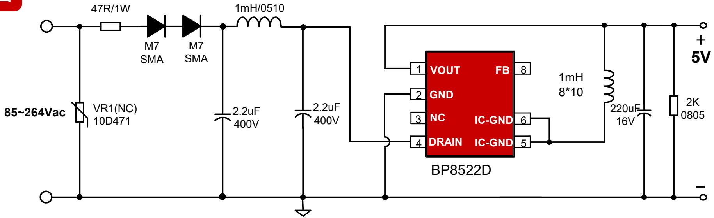
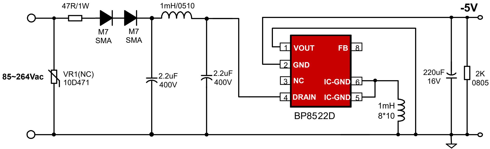

## 小家电-

## BP8522D ±5V150mA 降压芯片推广资料

上海晶丰明源半导体股份有限公司Shanghai Bright Power Semiconductor Co., Ltd.

## 典型应用图

## 产品特点

高集成度，零外围(启动电路，供电、续流二极管，VCC电容)  
负载调整率好：高低压负载调整率在5%以内；  
动态响应快：10%-90%负载，166mV(230Vac, SR 0.5A/uS)  
低待机功耗：50mW@230Vac

内置550V高压MOS  
完善的保护功能  
芯片采用SOP-7封装

BUCK-BOOST 负压输出

## 产品规格与目标应用

<table><tr><td>Part No.</td><td>BV</td><td>Rds_on</td><td>Output Current Continuous</td><td>MOS Peak Current</td><td>Package</td></tr><tr><td>BP8522D</td><td>550V</td><td>30Ω</td><td>150mA</td><td>280mA</td><td>SOP-7</td></tr></table>

## 目标应用

小家电：豆浆机，破壁机，饭煲等；

## 常见竞品比较

<table><tr><td></td><td>BP8522D</td><td>A*8505J</td><td>A*8505</td><td>K*311A</td></tr><tr><td>输出电流</td><td>150mA</td><td>150mA</td><td>200mA</td><td>100mA</td></tr><tr><td>功率器件</td><td>550V MOS</td><td>500V MOS</td><td>650V MOS</td><td>500V MOS</td></tr><tr><td>Rdson</td><td>30Ω</td><td>25Ω</td><td>25Ω</td><td>25Ω</td></tr><tr><td>待机功耗</td><td>50mW</td><td>50mW</td><td>50mW</td><td>30mW</td></tr><tr><td>外围</td><td>兼容A*8505,少一个VCC电容</td><td>多1个VCC电容</td><td>多1个VCC电容</td><td>多1个VCC电容</td></tr><tr><td>负载调整率</td><td>良</td><td>良</td><td>良</td><td>优</td></tr><tr><td>动态</td><td>良</td><td>优</td><td>优</td><td>一般</td></tr></table>

## 推广注意事项

◼ BP8522D与A\*P8505或A\*8505J引脚兼容。替代时请注意甄别MOS耐压与输出电流规格。

## THANK YOU FOR WATCHING
