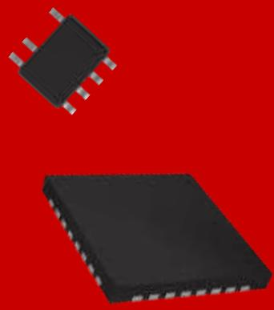
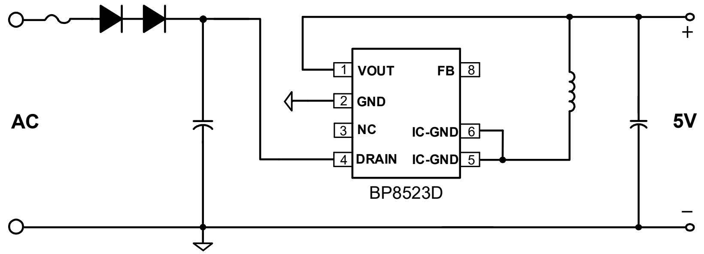
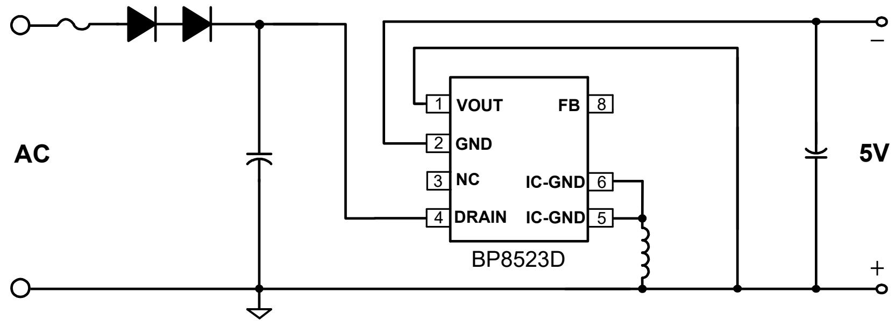
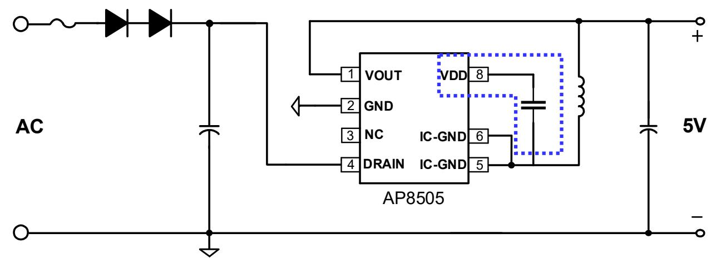
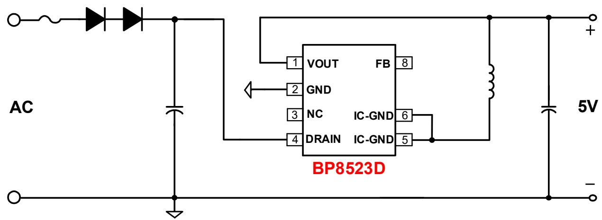

## 小家电-BP8523D ±5V100mA降压芯片推广资料

上海晶丰明源半导体股份有限公司

Shanghai Bright Power Semiconductor Co., Ltd.

## 典型应用图

## 产品特点

高集成度，零外围(启动电路，供电、续流二极管，VCC电容)  
负载调整率好：高低压负载调整率在3.5%以内；  
动态响应快：10%-90%负载，260mV(230Vac, SR 0.5A/uS)  
低待机功耗-50mW@230Vac  
内置650V高压MOS  
完善的保护功能  
芯片采用SOP-7封装

BUCK-BOOST 负压输出

## 产品规格与目标应用

<table><tr><td>Part No.</td><td>BV</td><td>Rds_on</td><td>Output Current Continuous</td><td>MOS Peak Current</td><td>Package</td></tr><tr><td>BP8523D</td><td>650V</td><td>30 Ω</td><td>100mA</td><td>200mA</td><td>SOP-7</td></tr></table>

## 目标应用

➢小家电：养生壶、电热水壶；落地风扇；  
个人护理电器：直发器、按摩器；  
其他供电能力要求不高(100mA左右)的小家电产品；

## BP8523D&AP8505性能对比

<table><tr><td>IC型号</td><td>BP8523D</td><td>AP8505</td></tr><tr><td>IC封装</td><td>SOP7(管脚兼容)</td><td>SOP7/DIP7</td></tr><tr><td>空载待机功耗</td><td>50mW</td><td>50mW</td></tr><tr><td>外围成本</td><td>零外围</td><td>多了VCC电容</td></tr><tr><td>最大输出电流</td><td>100mA</td><td>200mA</td></tr><tr><td>Rds_on (Ω)</td><td>30</td><td>25</td></tr><tr><td>MOS BV (V)</td><td>650</td><td>650</td></tr><tr><td>功率电感</td><td>6*8</td><td>6*8(饱和风险)</td></tr><tr><td>音频噪声</td><td>无</td><td>无</td></tr><tr><td>负载调整率</td><td>3.5%</td><td>3%</td></tr></table>

## 常见竞品比较

<table><tr><td></td><td>BP8523D</td><td>A*8505</td></tr><tr><td>输出电流</td><td>100mA</td><td>200mA</td></tr><tr><td>功率器件</td><td>650V MOS</td><td>650V MOS</td></tr><tr><td>Rdson</td><td>30Ω</td><td>25Ω</td></tr><tr><td>待机功耗</td><td>50mW</td><td>50mW</td></tr><tr><td>外围</td><td>兼容A*8505,少一个VCC电容</td><td>多1个VCC电容</td></tr><tr><td>负载调整率</td><td>良</td><td>良</td></tr><tr><td>动态</td><td>良</td><td>优</td></tr></table>

## 推广注意事项

➢BP8523D适和供电需求在100mA以内的小家电电源；  
BP8523D虽然与AP8505 引脚兼容，但BP8523D供电能力弱，推广时需要甄别输出规格；

## THANK YOU FOR WATCHING
