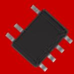
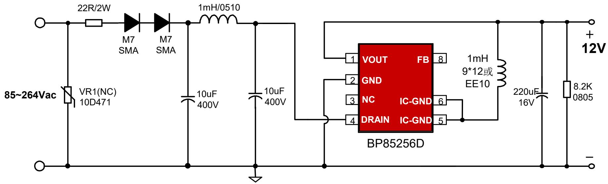
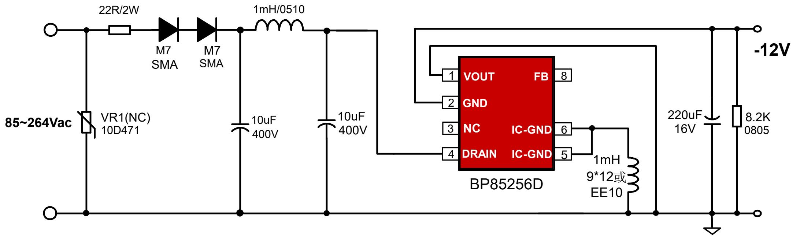
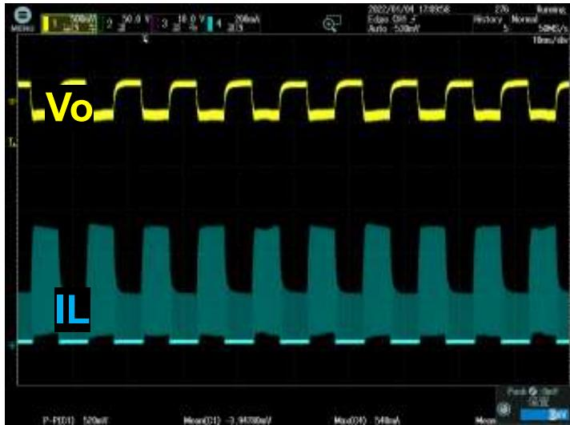
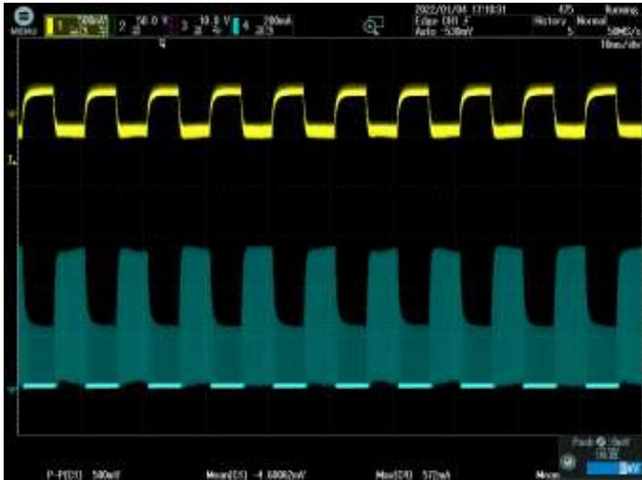
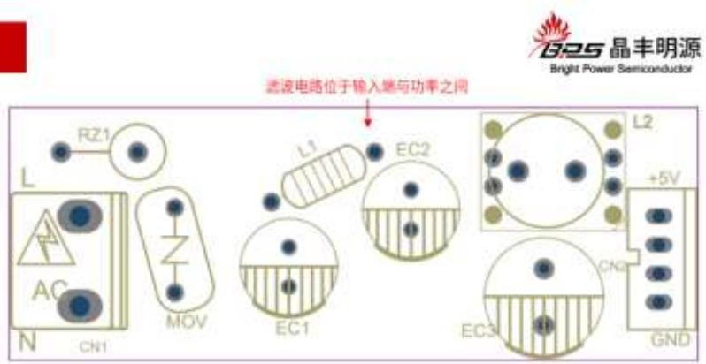
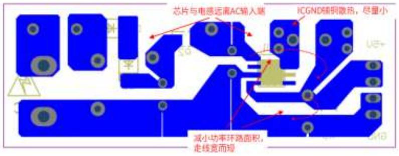

## 小家电-

## BP85256D ±12V300mA 降压芯片推广资料

上海晶丰明源半导体股份有限公司Shanghai Bright Power Semiconductor Co., Ltd.

## 典型应用图

## 产品特点

高集成度，零外围(启动电路，供电、续流二极管，VCC电容)  
负载调整率好：高低压负载调整率在5%以内；  
动态响应快：10%-90%负载，580mV(230Vac, SR 0.5A/uS)  
低待机功耗：50mW@230Vac  
内置650V高压MOS  
完善的保护功能  
芯片采用SOP-7封装

BUCK-BOOST 负压输出

## 产品规格与目标应用

<table><tr><td>Part No.</td><td>BV</td><td>Rds_on</td><td>Output Current Continuous</td><td>MOS Peak Current</td><td>Package</td></tr><tr><td>BP85256D</td><td>650V</td><td>11Ω</td><td>300mA</td><td>600mA</td><td>SOP-7</td></tr></table>

## 目标应用

小家电：电压力锅，饭煲等；

## 关键指标测试

负载调整率

<table><tr><td> $V_{IN}(VAC)$  $I_{OUT}(mA)$ </td><td>85</td><td>115</td><td>132</td><td>176</td><td>230</td><td>265</td><td>平均值</td><td>线调整率</td></tr><tr><td>0</td><td>12.13</td><td>12.11</td><td>12.1</td><td>12.09</td><td>12.07</td><td>12.06</td><td>12.09</td><td>0.58%</td></tr><tr><td>75</td><td>11.86</td><td>11.84</td><td>11.84</td><td>11.82</td><td>11.82</td><td>11.81</td><td>11.83</td><td>0.42%</td></tr><tr><td>150</td><td>11.76</td><td>11.74</td><td>11.74</td><td>11.72</td><td>11.71</td><td>11.71</td><td>11.73</td><td>0.43%</td></tr><tr><td>225</td><td>11.69</td><td>11.69</td><td>11.68</td><td>11.65</td><td>11.64</td><td>11.64</td><td>11.67</td><td>0.43%</td></tr><tr><td>250</td><td>11.69</td><td>11.68</td><td>11.64</td><td>11.64</td><td>11.63</td><td>11.62</td><td>11.65</td><td>0.60%</td></tr><tr><td>300</td><td>11.67</td><td>11.66</td><td>11.63</td><td>11.63</td><td>11.61</td><td>11.62</td><td>11.64</td><td>0.52%</td></tr><tr><td>负载调整率</td><td>3.90%</td><td>3.82%</td><td>3.99%</td><td>3.91%</td><td>3.92%</td><td>3.75%</td><td></td><td></td></tr></table>

温升

<table><tr><td rowspan="2">项目</td><td colspan="4">温度(°C)</td></tr><tr><td>85VAC</td><td>115VAC</td><td>230VAC</td><td>265VAC</td></tr><tr><td>环温(°C)</td><td>50</td><td>50</td><td>50</td><td>50</td></tr><tr><td>壳温(°C)</td><td>107</td><td>102</td><td>104</td><td>106</td></tr><tr><td>温升(°C)</td><td>57</td><td>52</td><td>54</td><td>56</td></tr></table>

## 动态

测试条件：10%\~90%动态负载

$\scriptstyle \mathsf { V i n } = 8 5 \lor \mathsf { a c } , \Delta \lor = 5 2 0 \mathsf { m V }$

$\mathsf { V i n } { = } 2 6 5 \mathsf { V a c } , \Delta \mathsf { V } { = } 5 8 0 \mathsf { m V }$

## 推广注意事项

◼ BP85256D的峰值电流为600mA, 建议选择饱和电流高于600mA的电感以避免电感饱和的风险。  
◼ BP85256D 无需VCC电容，但是在Layout中建议保留FB电容位置，以便在复杂应用工况中放置FB电容以提高系统可靠性。（详情参考BP852XXD 应用指南中的Layout建议）

## Layout建议

1.IC-GND能起到散热作用，可以铜散热。但是IC-GND是电压动点，在满足散热的条件下铺铜面积应尽量小。同时远离输入交流端，以避免容性耦合产生EMI问题。  
2.输出电感可能产生电磁干扰，建议远离芯片FB脚，同时远离输入端以避免EMI问题。为了芯片和电压动点远离交流输入端，建议将输入电解电容放置在芯片和交流输入端之间。  
3.DRAIN接输入直流母线，为电压静点，可以铺铜散热。建议DRAIN和FB、IC-GND的走线距离大于2mm。  
4.尽量减小功率环路面积以避免EMI干扰并提高系统可靠性。以BUCK为例，建议缩小输入电容、内置MOSFET、电感、输出电容组成的励磁回路，以及电感、输出电容、续流二极管组成的续流回路面积。反馈回路面积与走线长度也应减小以提高可靠性。  
5.建议功率回路的走线宽而短，以提高系统可靠性。例如母线到GND引脚的走线，GND到输出电容的走线等。  
6.反馈回路面积与走线长度也应减小以提高可靠性。  
7.如果由于客观因素（例如PCB板形状等）导致LayOut无法充分满足第5、6条建议时，可以在FB到IC-GND之间放置100nF（104）贴片电容来提高系统可靠性。

## THANK YOU FOR WATCHING
