## BP85256D非隔离参考设计

## (-12V/250mA)

上海晶丰明源半导体股份有限公司

Shanghai Bright Power Semiconductor Co., Ltd.

王岩

时间： 2021年8月

## 内容

电源规格  
电路及实物图  
BOM  
PCB Layout图  
性能测试数据

<table><tr><td>项目描述</td><td>符号</td><td>最小</td><td>典型</td><td>最大</td><td>单位</td><td>备注</td></tr><tr><td colspan="7">输入</td></tr><tr><td>电压</td><td> $V_{IN}$ </td><td>85</td><td>115/230</td><td>264</td><td> $V_{AC}$ </td><td></td></tr><tr><td>频率</td><td> $f_{LINE}$ </td><td>47</td><td>50/60</td><td>63</td><td>Hz</td><td></td></tr><tr><td colspan="7">输出</td></tr><tr><td>输出电压</td><td> $V_{OUT}$ </td><td></td><td>12</td><td></td><td>V</td><td>±5%</td></tr><tr><td>输出电流</td><td> $I_{OUT}$ </td><td>0</td><td></td><td>250</td><td>mA</td><td></td></tr><tr><td>输出电压纹波</td><td> $V_{RIPPLE}$ </td><td></td><td></td><td>100</td><td>mV</td><td>20MHz带宽</td></tr><tr><td>连续输出功率</td><td> $P_{OUT}$ </td><td></td><td>3</td><td></td><td>W</td><td></td></tr><tr><td colspan="7">效率</td></tr><tr><td>待机功耗</td><td> $P_{STDBY}$ </td><td></td><td></td><td>100</td><td>mW</td><td>230VAC,包含假负载</td></tr><tr><td>满载效率</td><td>η</td><td>65</td><td></td><td></td><td>%</td><td></td></tr><tr><td colspan="7">环境</td></tr><tr><td>传导EMI</td><td></td><td colspan="4">满足CISPR22/EN55022 Class B,至少6dB 裕量</td><td></td></tr><tr><td>Surge</td><td></td><td></td><td>2</td><td></td><td>kV</td><td>差模</td></tr><tr><td>EFT</td><td></td><td></td><td>4</td><td></td><td>kV</td><td>5kHz/100kHz/38kHz</td></tr><tr><td>ESD</td><td></td><td></td><td>15</td><td>20</td><td>kV</td><td>空气放电</td></tr><tr><td>工作环境温度</td><td> $T_{AMP}$ </td><td>0</td><td></td><td>50</td><td>°C</td><td></td></tr></table>

## 电路及实物图

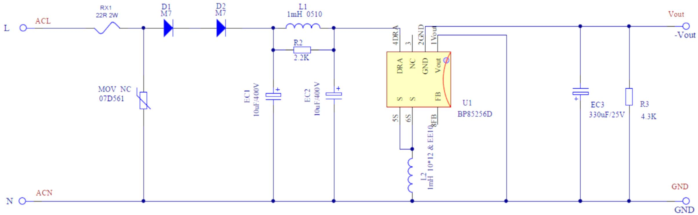

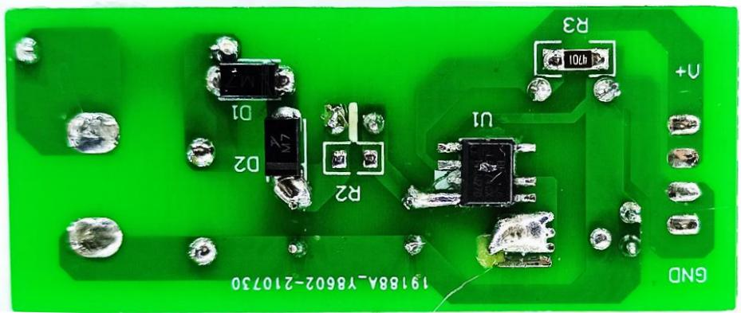

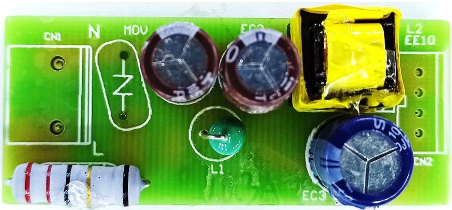

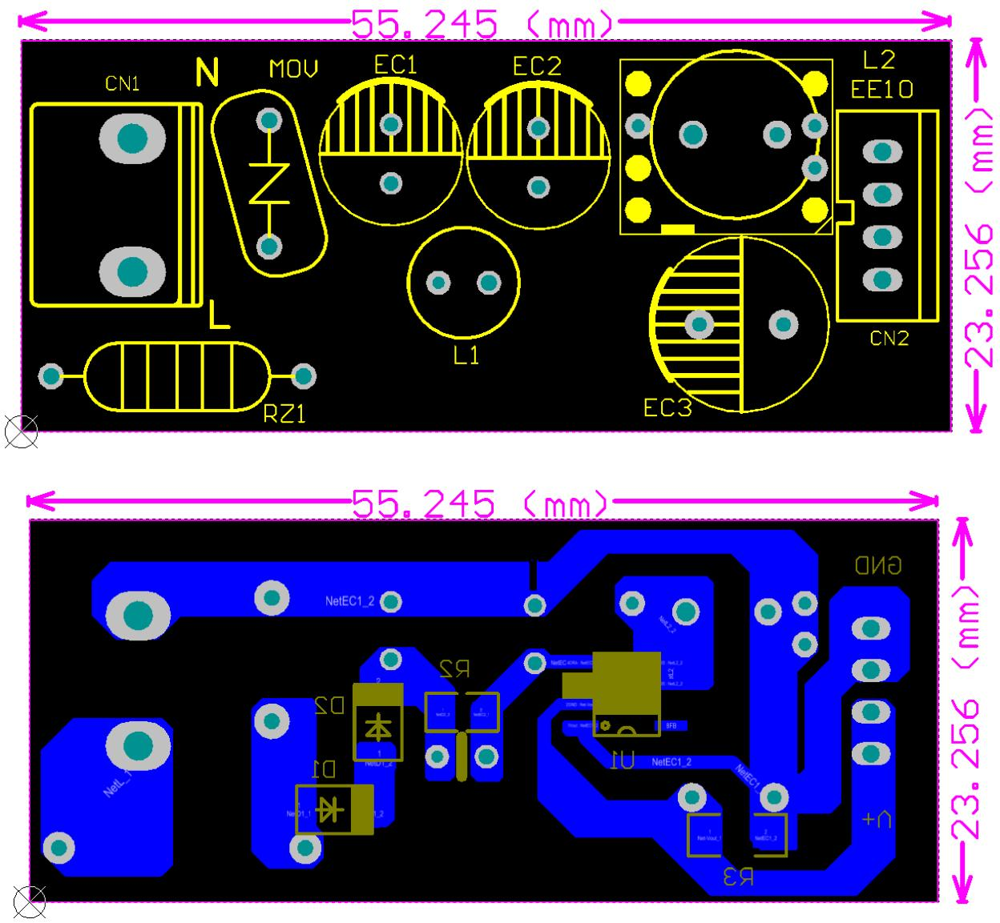

<table><tr><td>序号</td><td>元件标号</td><td>参数描述</td><td>封装尺寸</td><td>数量</td></tr><tr><td>1</td><td>PCB</td><td>CEM-1, 单面板</td><td>55.2mm*23.2mm</td><td>1</td></tr><tr><td>2</td><td>RZ1</td><td>2W, 22R保险丝电阻</td><td>DIP</td><td>1</td></tr><tr><td>3</td><td>D1,D2</td><td>M7, 1A/1000V</td><td>SMA</td><td>2</td></tr><tr><td>4</td><td>L1</td><td>1mH, 0510,色环电感</td><td>0510</td><td>1</td></tr><tr><td>5</td><td>L3</td><td>1mH, 0.21mm,215T</td><td>EE10</td><td>1</td></tr><tr><td>6</td><td>EC1,EC2</td><td>10uF/400V, 电解电容</td><td>∅8*12mm</td><td>2</td></tr><tr><td>7</td><td>EC3</td><td>330uF/25V, 电解电容</td><td>∅8*12mm</td><td>1</td></tr><tr><td>8</td><td>R2</td><td>3K, ±5%</td><td>SMD1206</td><td>1</td></tr><tr><td>9</td><td>R3</td><td>4.3K, ±5%</td><td>SMD1206</td><td>1</td></tr><tr><td>10</td><td>U1</td><td>BP85256D, SOP7</td><td>SOP7</td><td>1</td></tr><tr><td></td><td></td><td></td><td>Total</td><td>12</td></tr></table>

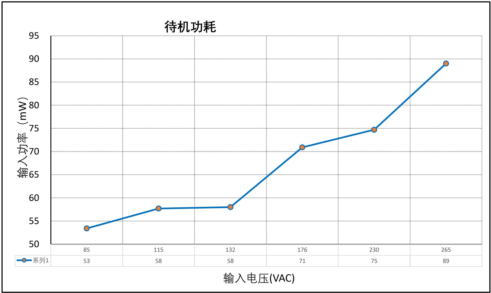

效率测试  
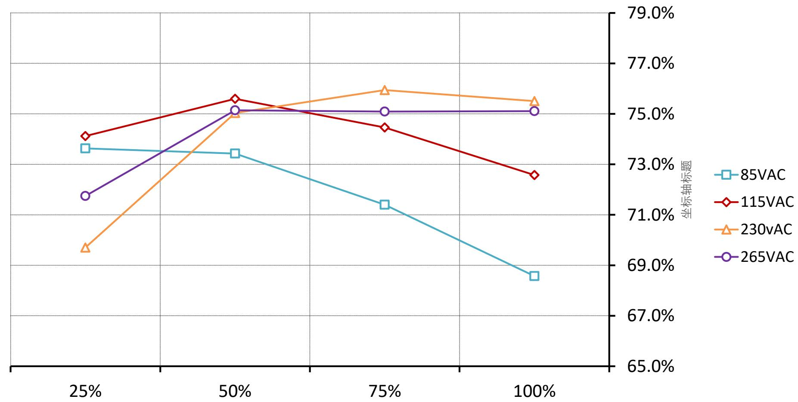

坐标轴标题

## 输出电压调整率

<table><tr><td> $V_{IN}(VAC)$ Load(%)</td><td>85</td><td>115</td><td>132</td><td>176</td><td>230</td><td>265</td><td>平均值</td><td>线调整率</td></tr><tr><td>0</td><td>12.144</td><td>12.134</td><td>12.134</td><td>12.125</td><td>12.110</td><td>12.104</td><td>12.125</td><td>0.33%</td></tr><tr><td>20%</td><td>11.965</td><td>11.939</td><td>11.929</td><td>11.913</td><td>11.913</td><td>11.906</td><td>11.928</td><td>0.49%</td></tr><tr><td>40%</td><td>11.870</td><td>11.845</td><td>11.839</td><td>11.824</td><td>11.822</td><td>11.813</td><td>11.836</td><td>0.48%</td></tr><tr><td>60%</td><td>11.794</td><td>11.776</td><td>11.768</td><td>11.753</td><td>11.745</td><td>11.740</td><td>11.763</td><td>0.46%</td></tr><tr><td>80%</td><td>11.726</td><td>11.720</td><td>11.712</td><td>11.696</td><td>11.687</td><td>11.680</td><td>11.704</td><td>0.39%</td></tr><tr><td>100%</td><td>11.675</td><td>11.665</td><td>11.654</td><td>11.635</td><td>11.622</td><td>11.616</td><td>11.645</td><td>0.51%</td></tr><tr><td>平均值</td><td>11.862</td><td>11.847</td><td>11.839</td><td>11.824</td><td>11.817</td><td>11.810</td><td rowspan="2" colspan="2">3.20%额定12V调整率最大值</td></tr><tr><td>负载调整率</td><td>3.95%</td><td>3.96%</td><td>4.05%</td><td>4.14%</td><td>4.13%</td><td>4.13%</td></tr></table>

计算方法：1、负载调整率=100%\*(最大值-最小值)/平均值；2、额定负载调整率：100%\*(最大&最小值-额定值)/额定值；  
测试条件：带4.3kΩ假负载（\~33mW）

## 输出电压纹波

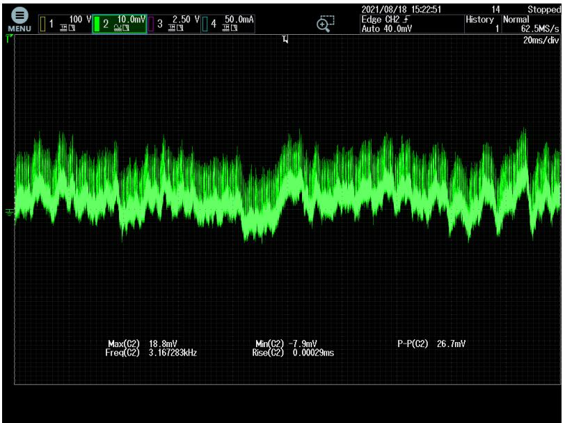

85 VAC

CH2 $\mathsf { V } _ { \mathsf { O U T } }$ Ripple VPK-PK=26.7mV

## Test Condition:

➢ No Load

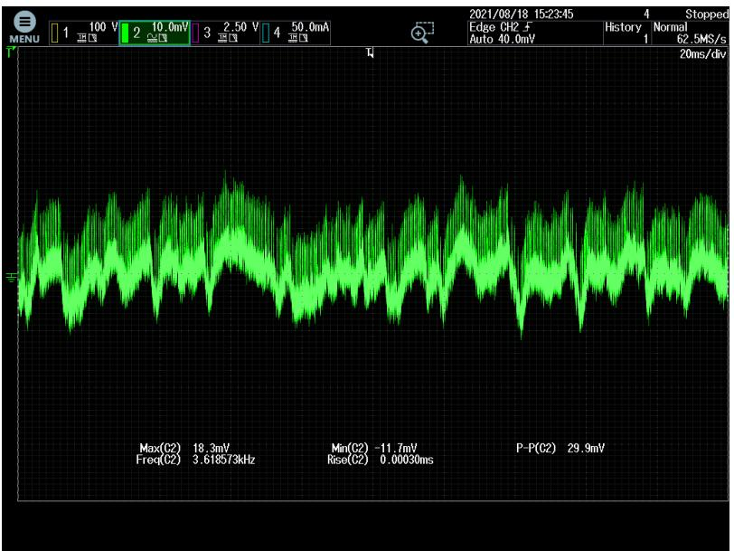

230 VAC

CH2 $\mathsf { V } _ { \mathsf { O U T } }$ Ripple VPK-PK=29.9mV

## Test Condition:

➢ No Load

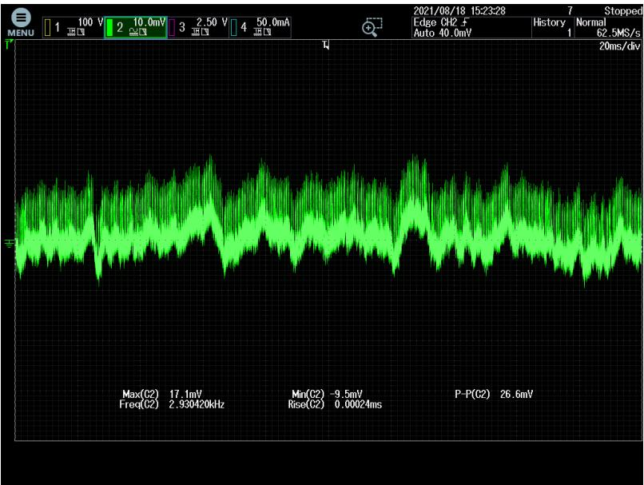

115 VAC

CH2 $\mathsf { V } _ { \mathsf { O U T } }$ Ripple $V _ { P K - P K } = 2 6 . 6 m V$

## Test Condition:

➢ No Load

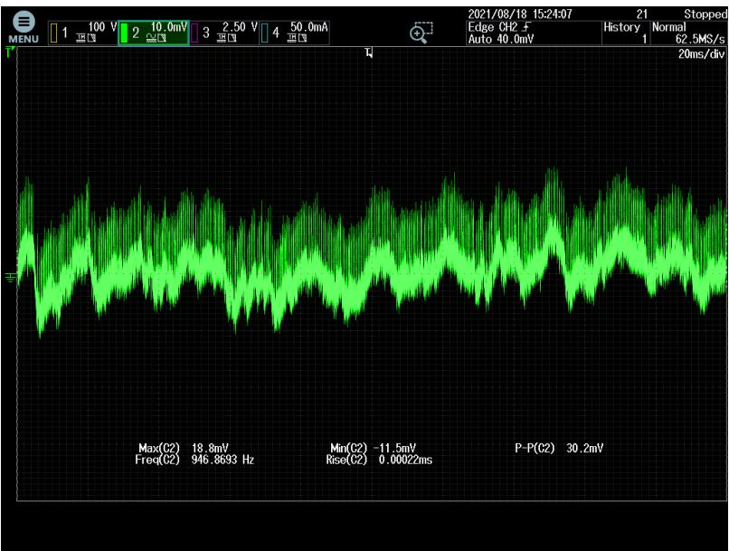

265 VAC

CH2 $\mathsf { V } _ { \mathsf { O U T } }$ Ripple VPK-PK=30.2mV

## Test Condition:

➢ No Load

## 输出电压纹波

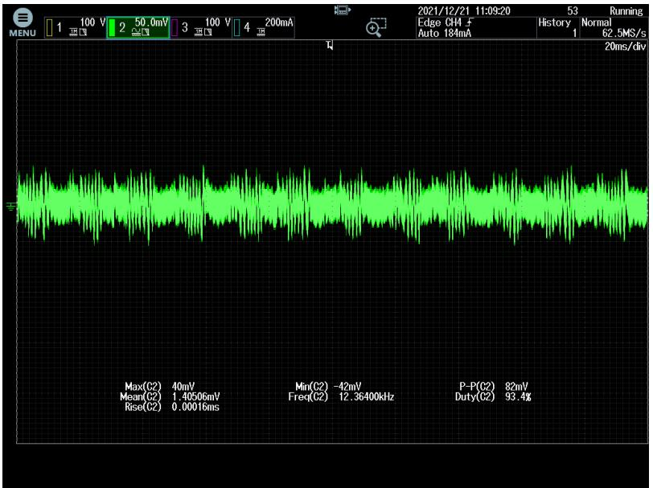

85 VAC

$\begin{array} { r l } { \mathbf { 1 } } & { { } \mathsf { C H 2 } \mathsf { V _ { o u T } R i p p l e } } \\ { \quad } & { { } \mathsf { V _ { P K - P K } = 8 2 m v } } \end{array}$

## Test Condition:

➢ Full Load

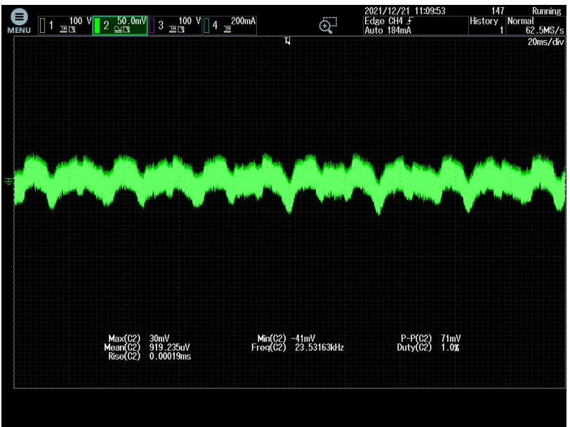

230 VAC

CH2 VOUT Ripple VPK-PK=71mV

## Test Condition:

➢ Full Load

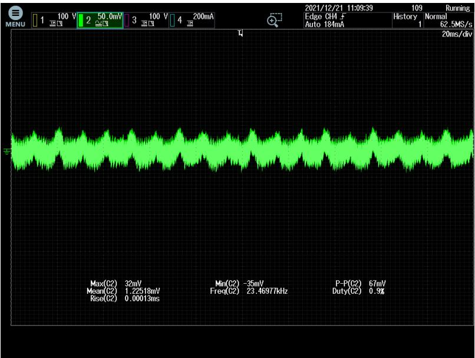

115 VAC

$\begin{array} { r l } & { \mathsf { C H 2 } \mathsf { V _ { 0 \cup \top } R i p p l e } } \\ & { \mathsf { V _ { P K - P K } } \mathsf { = } 6 7 \mathsf { m v } } \end{array}$

## Test Condition:

➢ Full Load

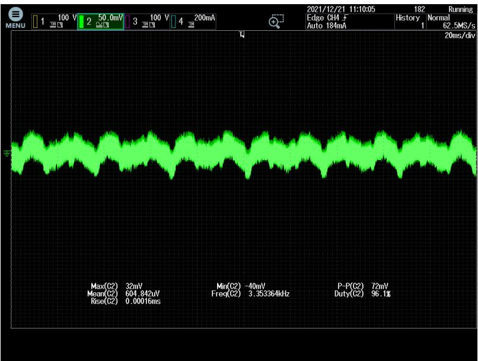

265 VAC

CH2 VOUT Ripple VPK-PK=72mV

## Test Condition:

➢ Full Load

## 动态负载(50%-100%)

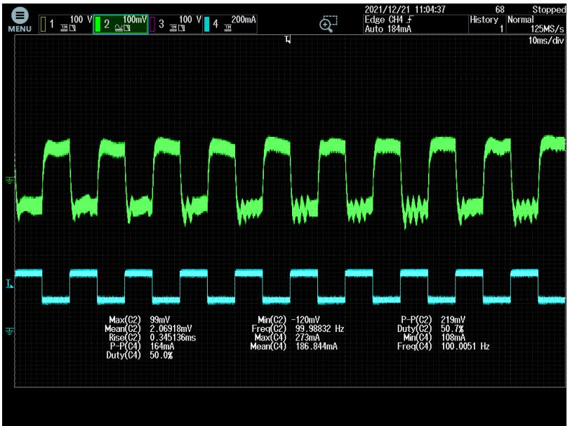

85 VAC

CH2 VOUT $\mathsf { V } _ { \mathsf { O U T } }$ $V _ { \mathsf { P K - P K } } { = } 2 1 9 \mathsf { m V }$  
CH4 IOUT ${ \mathsf I } _ { 0 \mathsf U \top }$

## Test Condition:

➢ 0.125 A-0.25 A-0.125 A  
➢ Slew Rate: 0.5 A/μS  
➢ Frequency: 100 Hz

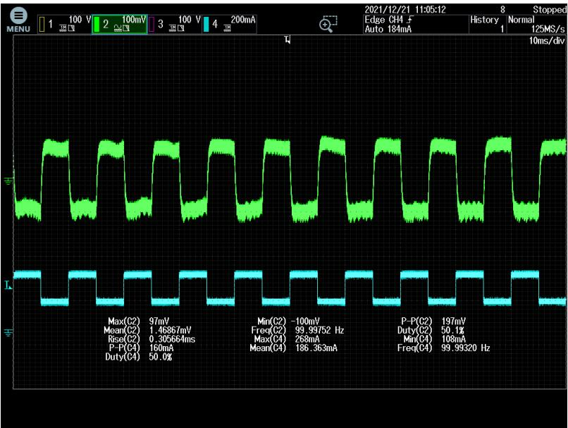

115 VAC

CH2 VOUT $\mathsf { V } _ { \mathsf { O U T } }$ $v _ { p \vert k - P K } { = } 1 9 7 ~ \mathsf { m V }$  
CH4 IOUT ${ \mathsf I } _ { 0 \mathsf { U T } }$

## Test Condition:

➢ 0.125 A-0.25 A-0.125 A  
➢ Slew Rate: 0.5 A/μS  
➢ Frequency: 100 Hz

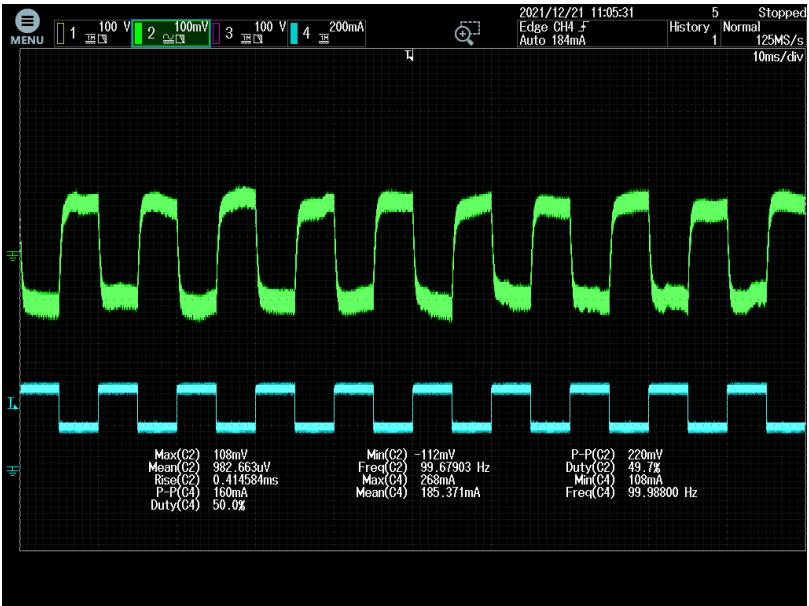

230 VAC

CH2 VOUT $\mathsf { V } _ { \mathsf { O U T } }$ $V _ { \mathsf { P K - P K } } { = } 2 2 0 \mathsf { m V }$  
CH4 IOUT $\mathsf { C H 4 } \mathsf { I } _ { \mathsf { O U T } }$

## Test Condition:

➢ 0.125 A-0.25 A-0.125 A  
➢ Slew Rate: 0.5 $\mathsf { A } / \mu \mathsf { S }$  
➢ Frequency: 100 Hz

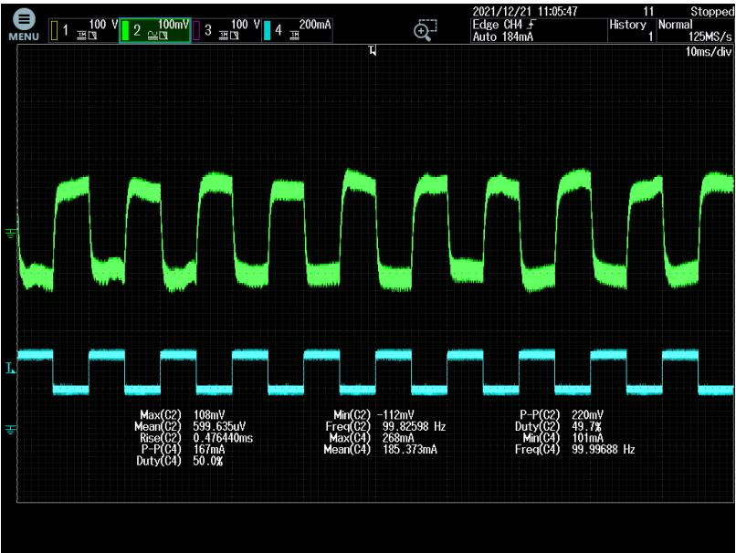

265 $\mathsf { v } _ { \mathsf { A C } }$

CH1 VOUT $\mathsf { V } _ { \mathsf { O U T } }$ $v _ { p _ { \vert k - P K } } = 2 2 0 ~ \mathsf { m V }$  
$\mathsf { C H 4 } \mathsf { I } _ { \mathsf { O U T } }$

## Test Condition:

➢ 0.125 A-0.25 A-0.125 A  
➢ Slew Rate: 0.5 A/μS  
➢ Frequency: 100 Hz

## 动态负载(10%-90%)

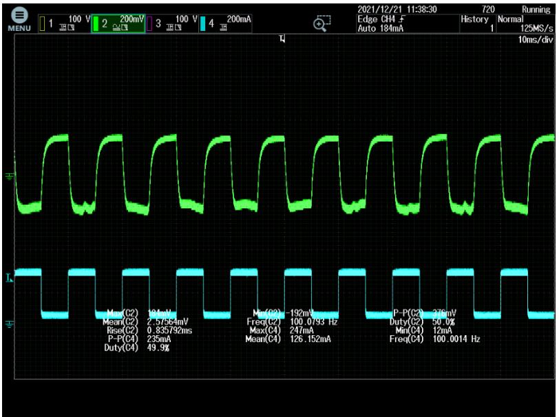

85 VAC

CH2 VOUT $\mathsf { V } _ { \mathsf { O U T } }$ $\mathsf { V } _ { \mathsf { P K - P K } } { = } 3 7 6 \mathsf { m V }$  
CH4 IOUT ${ \mathsf I } _ { 0 \mathsf U \top }$

## Test Condition:

➢ 0.025A-0.225 A-0.025 A  
➢ Slew Rate: 0.5 A/μS  
➢ Frequency: 100 Hz

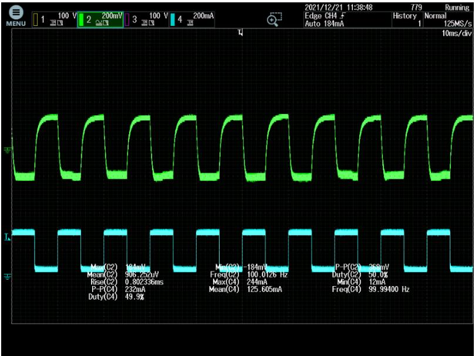

230 VAC

CH2 VOUT $\mathsf { V } _ { \mathsf { O U T } }$ $\mathsf { V } _ { \mathsf { P K - P K } } { = } 3 6 8 \mathsf { m V }$  
CH4 IOUT $\mathsf { C H 4 } \mathsf { I } _ { \mathsf { O U T } }$

## Test Condition:

➢ 0.025A-0.225 A-0.025 A  
➢ Slew Rate: 0.5 $\mathsf { A } / \mu \mathsf { S }$  
➢ Frequency: 100 Hz

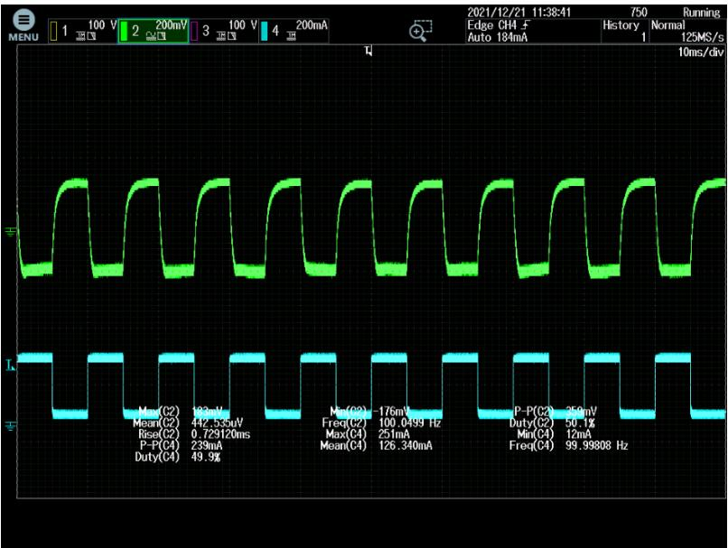

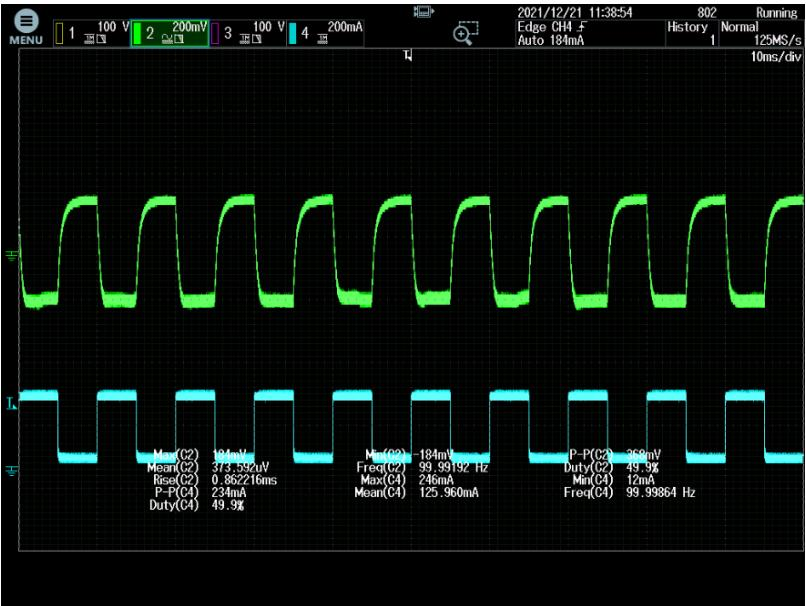

115 VAC

CH2 VOUT $\mathsf { V } _ { \mathsf { O U T } }$ $\mathsf { V } _ { \mathsf { P K - P K } } { = } 3 5 9 \mathsf { m V }$  
CH4 IOUT ${ \mathsf I } _ { 0 \mathsf { U T } }$

## Test Condition:

➢ 0.025A-0.225 A-0.025 A  
➢ Slew Rate: 0.5 A/μS  
➢ Frequency: 100 Hz

265 $\mathsf { v } _ { \mathsf { A C } }$

CH2 VOUT ${ \mathsf { C H } } 2 { \mathsf { V } } _ { \mathsf { O U T } }$ $\mathsf { V } _ { \mathsf { P K - P K } } { = } 3 6 8 \mathsf { m V }$ VPK-PK=368mV  
$\mathsf { C H 4 } \mathsf { I } _ { \mathsf { O U T } }$

## Test Condition:

➢ 0.025A-0.225 A-0.025 A  
➢ Slew Rate: 0.5 A/μS  
➢ Frequency: 100 Hz

## 输出电压开机波形

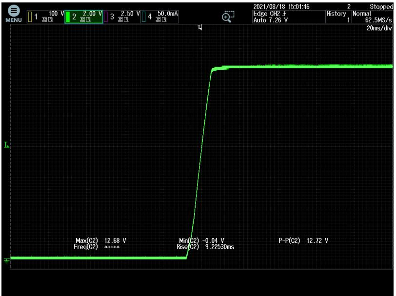

85 VAC

CH2 VOUT TRISE: 9.2 mS

## Test Condition:

➢ No Load

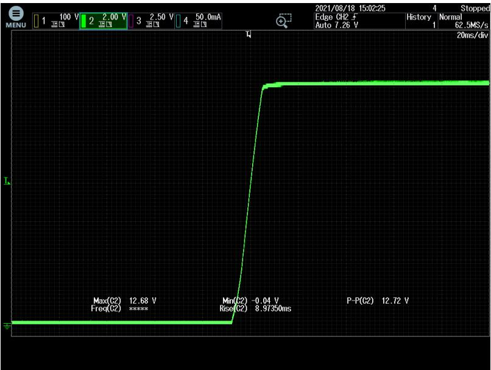

115 VAC

CH2 VOUT TRISE: 8.9 mS

## Test Condition:

➢ No Load

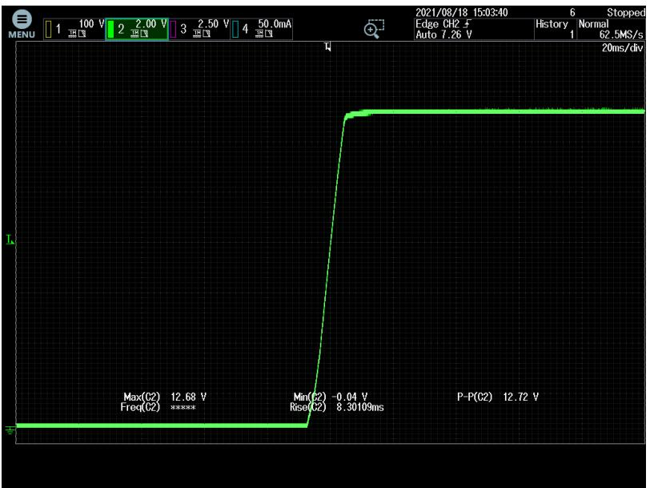

230 VAC

CH2 VOUT TRISE: 8.3 mS

## Test Condition:

➢ No Load

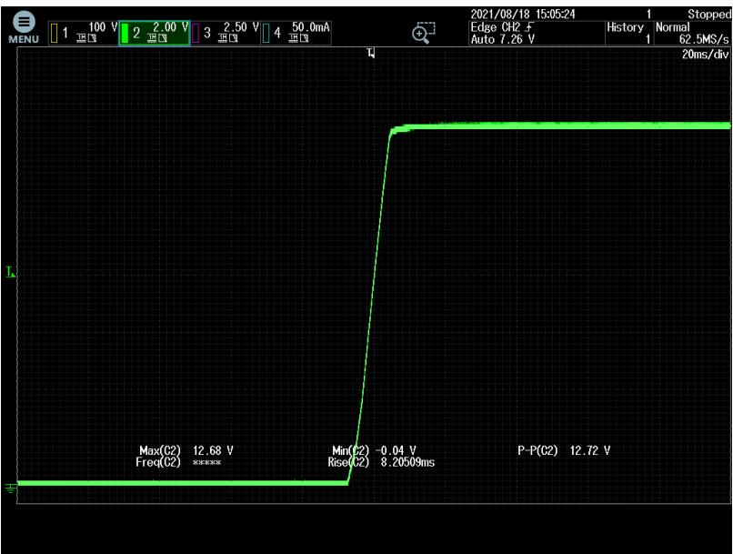

265 VAC

CH2 VOUT TRISE: 8.2 mS

## Test Condition:

➢ No Load

## 输出电压开机波形

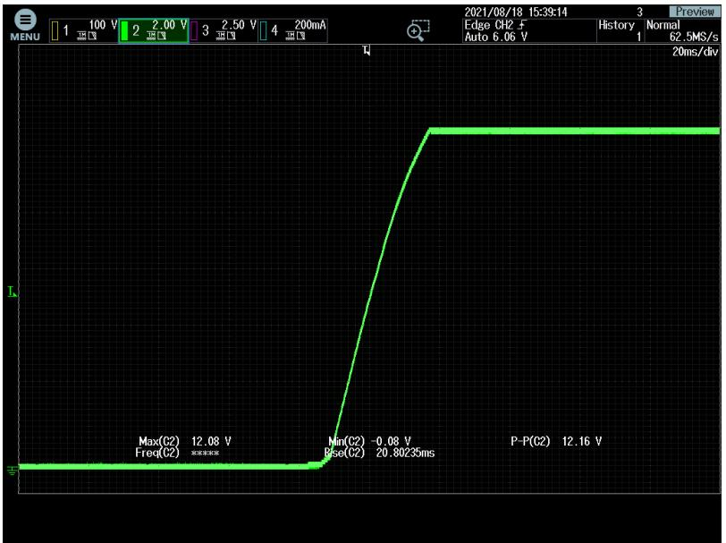

85 VAC

CH2 VOUT TRISE: 20.8 mS

## Test Condition:

➢ Full Load

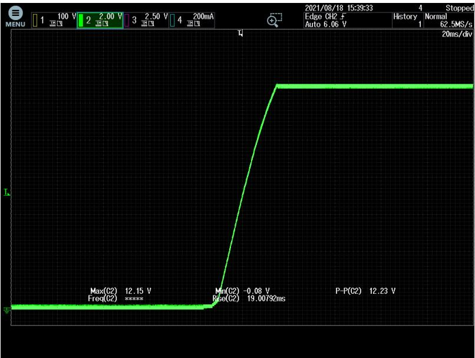

115 VAC

CH2 VOUT TRISE: 19 mS

## Test Condition:

➢ Full Load

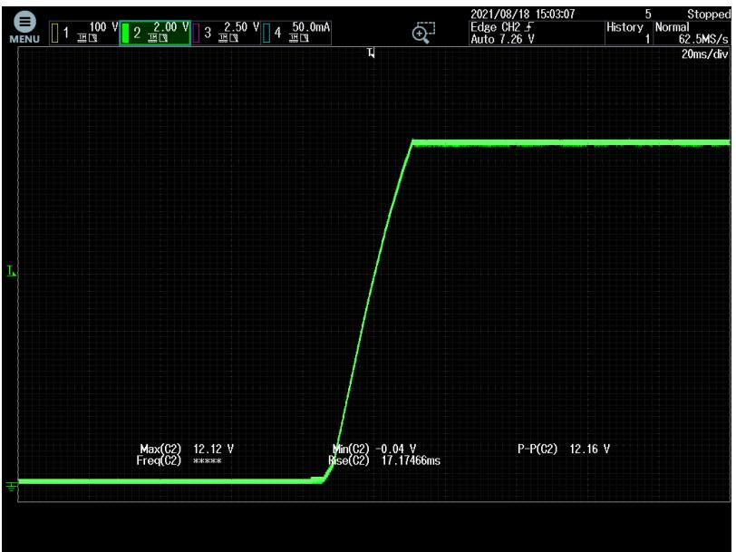

230 VAC

CH2 VOUT TRISE: 17.1 mS

## Test Condition:

➢ Full Load

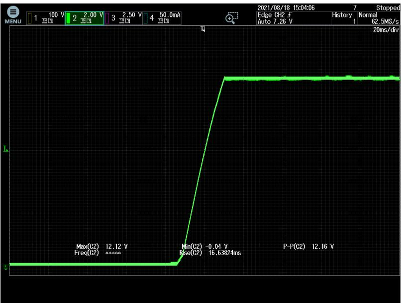

265 VAC

CH2 VOUT TRISE: 16.6 mS

## Test Condition:

➢ Full Load

## 漏源极电压和漏极电流开机波形

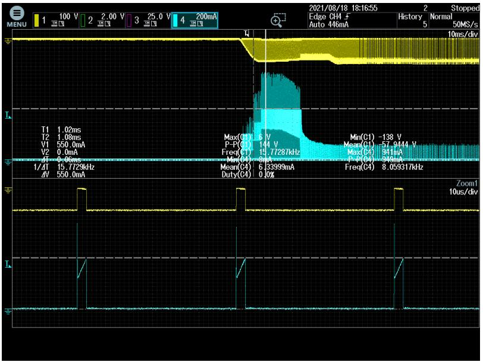

85 VAC

CH1 $\mathsf { V } _ { \mathsf { D } \mathsf { S } }$  
$C H 4 \mid _ { \mathrm { D S } }$  
◼ $\begin{array} { r l } & { \mathsf { V } _ { \mathsf { D S \_ M A X } } \colon \mathsf { 1 3 8 V } } \\ & { \mathsf { I _ { D S \_ M A X } } \colon 0 . 9 4 1 \mathsf { A } } \end{array}$ IDS\_MAX: 0.941 A

Test Condition:

➢ No Load

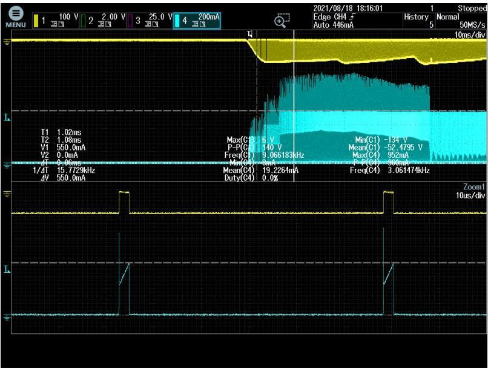

85 VAC

${ \mathsf { C H 1 V } } _ { \mathsf { D S } }$  
$C H 4 1 _ { \mathrm { D S } }$  
$\mathsf { V } _ { \mathsf { D S \_ M A X } } \colon 1 3 4 \mathrm { \Delta V }$ IDS\_MAX: 0.952 A

Test Condition:

➢ Full Load

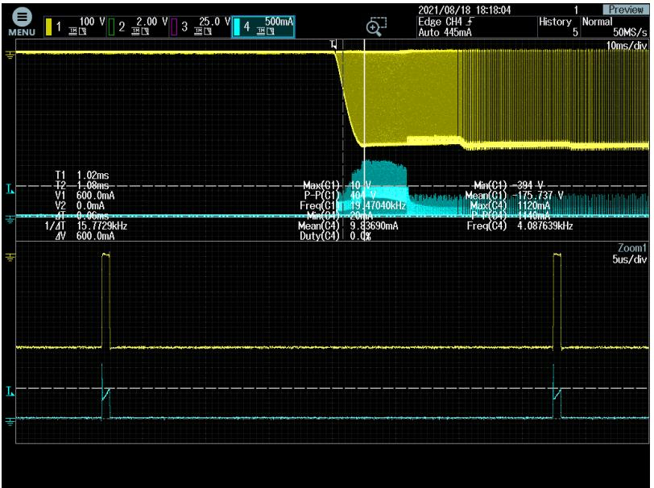

265 VAC

${ \mathsf { C H 1 } } \mathsf { V _ { D S } }$  
$C H 4 \mid _ { \mathrm { { D S } } }$  
VDS\_MAX: 394 V IDS\_MAX: 1.12 A

Test Condition:

➢ No Load

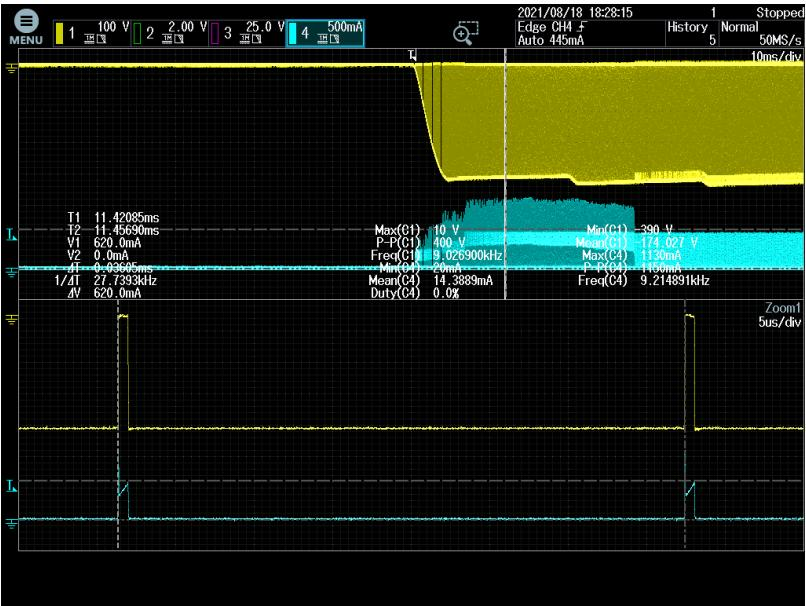

265 VAC

${ \mathsf { C H 1 } } \mathsf { V } _ { \mathsf { D S } }$  
$C H 4 1 _ { \mathrm { D S } }$  
$V _ { \mathsf { D S \_ M A X } } \colon 3 9 0 \lor$ $\mathsf { I } _ { \mathsf { D S \_ M A X } } \colon \mathsf { 1 } . \mathsf { 1 } 3 \mathsf { A }$

Test Condition:

➢ Full Load

## 漏源极电压和漏极电流开机波形

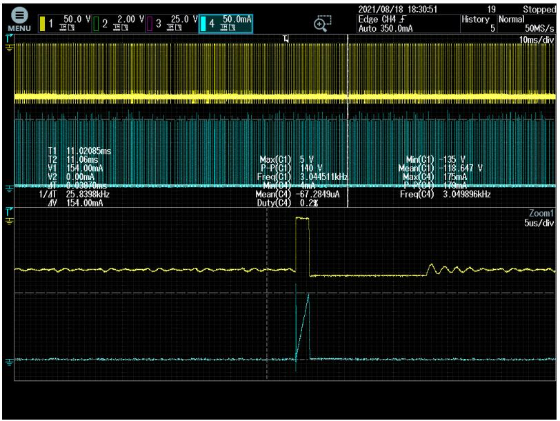

85 VAC

${ \mathsf { C H 1 } } \mathsf { V _ { D S } }$  
$C H 4 \mid _ { \mathrm { D S } }$  
◼ VDS\_MAX: 135 V IDS\_MAX: 0.175 A

Test Condition:

➢ No Load

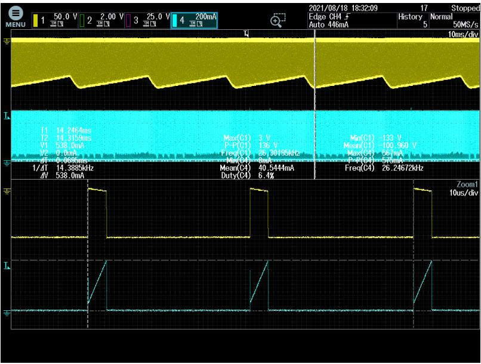

85 VAC

${ \mathsf { C H 1 V } } _ { \mathsf { D S } }$  
$C H 4 1 _ { \mathrm { D S } }$  
◼ $\mathsf { V } _ { \mathsf { D S \_ M A X } } \colon 1 3 3 \mathsf { V }$ IDS\_MAX: 0.567 A

Test Condition:

➢ Full Load

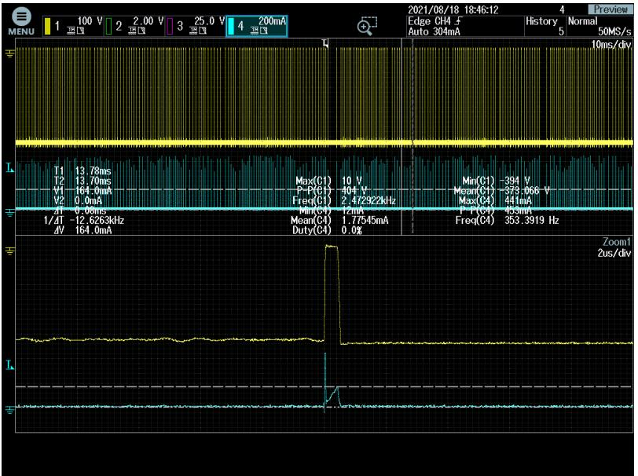

265 VAC

${ \mathsf { C H 1 } } \mathsf { V _ { D S } }$  
$C H 4 \mid _ { \mathrm { { D S } } }$  
IDS\_MAX: 0.441 A $\begin{array} { r l } & { \mathsf { V } _ { \mathsf { D S \_ M A X } } \colon 3 9 4 \mathsf { V } } \\ & { \mathsf { I } _ { \mathsf { D S \_ M A X } } \colon 0 . 4 4 1 \mathsf { A } } \end{array}$

Test Condition:

➢ No Load

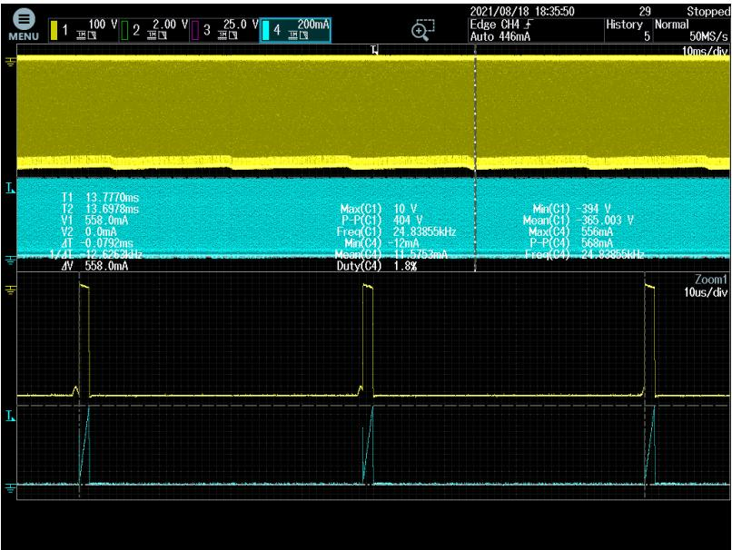

265 VAC

${ \mathsf { C H 1 } } \mathsf { V } _ { \mathsf { D S } }$  
$C H 4 1 _ { \mathrm { D S } }$  
◼ $V _ { \mathsf { D S \_ M A X } } \colon 3 9 4 \lor$ IDS\_MAX: 0.556 A $\mathsf { I } _ { \mathsf { D S \_ M A X } } \colon 0 . 5 5 6 ~ \mathsf { A }$

Test Condition:

➢ Full Load

## 电感电流开机波形

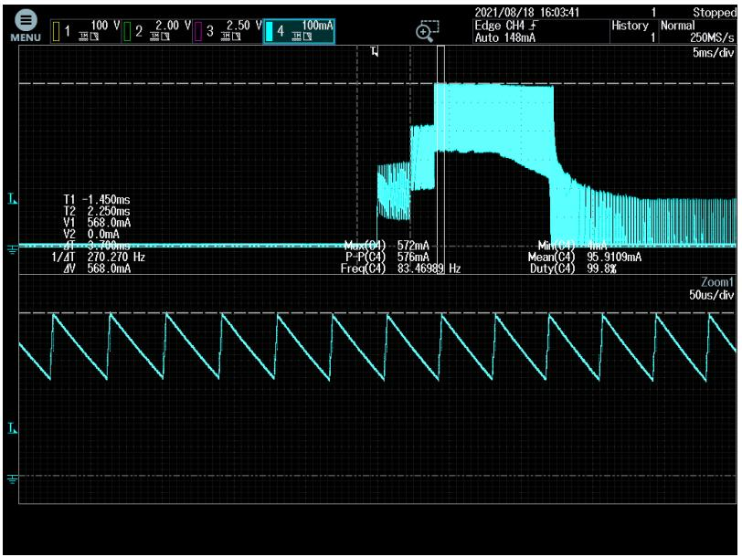

85 VAC

➢ CH4 IL IMAX : 0.572 A

Test Condition:

➢ No Load

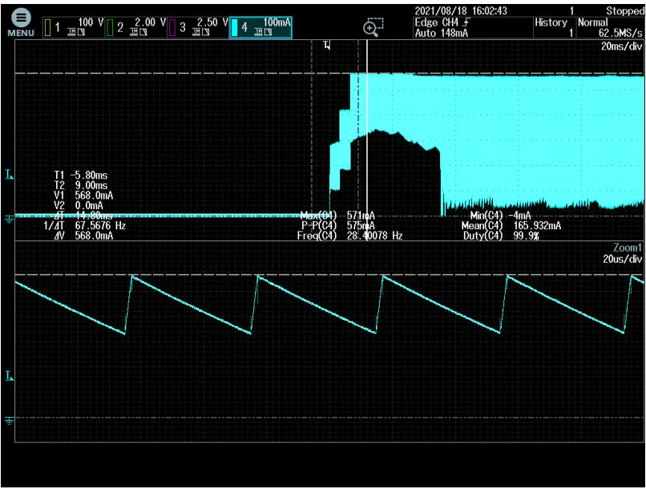

85 VAC

CH4 IL IMAX : 0.571 A

Test Condition:

➢ Full Load

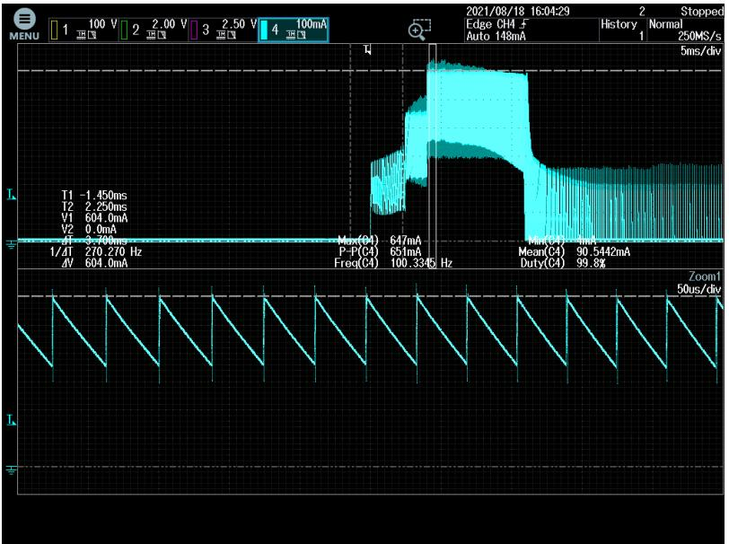

265 VAC

CH4 IL IMAX : 0.647 A

Test Condition:

➢ No Load

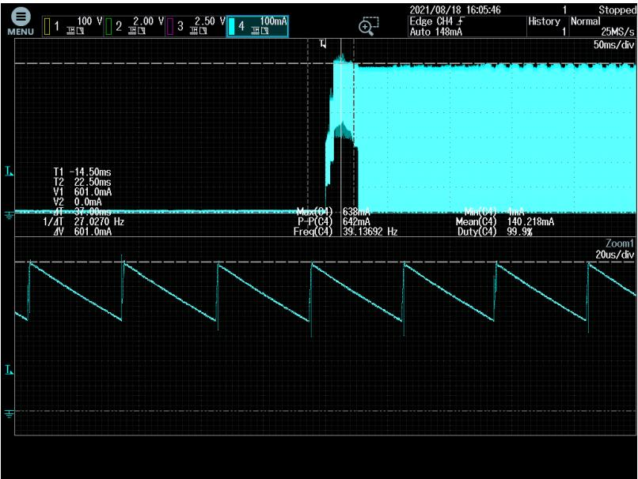

265 VAC

CH4 IL IMAX : 0.638 A

Test Condition:

➢ Full Load

## 电感电流波形

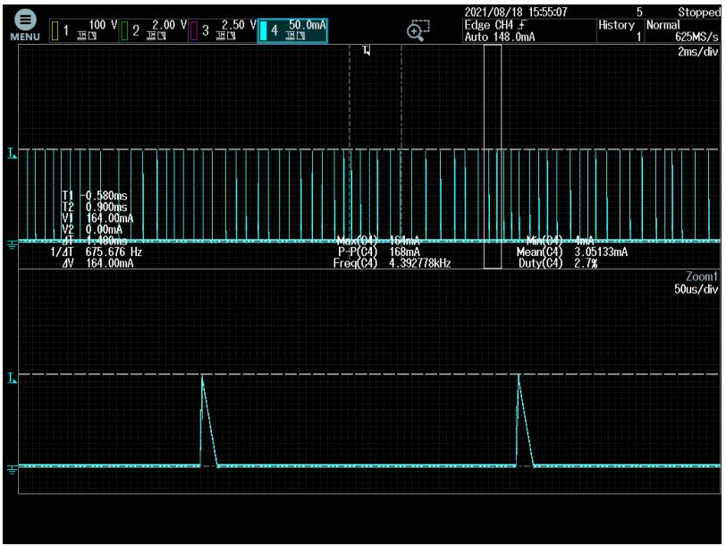

85 VAC  
CH4 IL IMAX : 0.164 A  
➢ No Load

Test Condition:

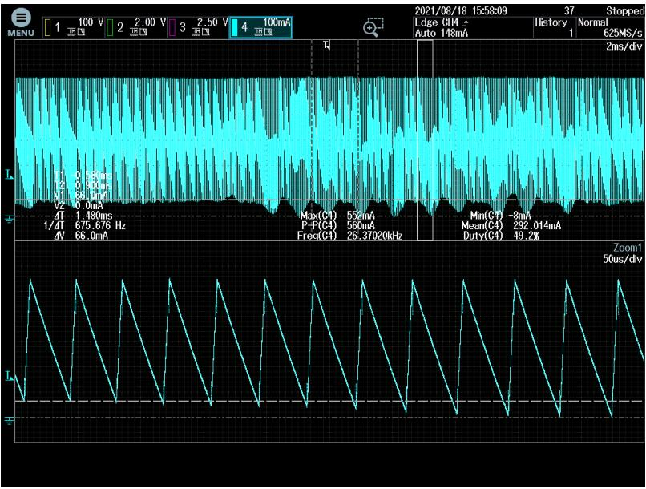

85 VAC  
CH4 IL IMAX : 0.552 A  
➢ Full Load

Test Condition:

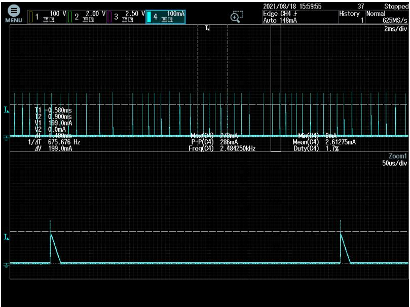

265 VAC  
CH4 IL IMAX : 0.278 A  
➢ No Load

Test Condition:

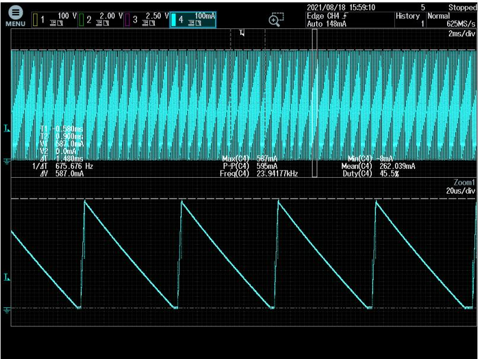

265 VAC  
CH4 IL IMAX : 0.587 A  
➢ Full Load

Test Condition:

## 短路保护 （MOSFET波形）

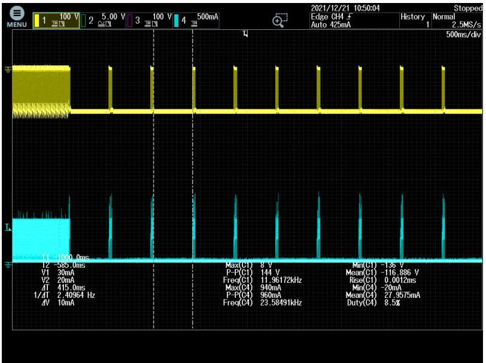

85 VAC

${ \mathsf { C H 1 } } \mathsf { V _ { D S } }$  
$C H 4 \mid _ { \mathrm { D S } }$  
◼ VDS\_MAX: 136 V IDS\_MAX: 0.94 A

## Test Condition:

➢ OUTPUT SHORT

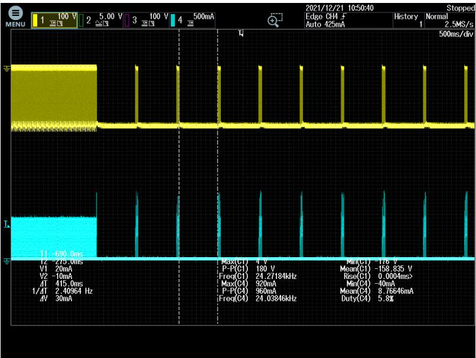

115 VAC

${ \mathsf { C H 1 V } } _ { \mathsf { D S } }$  
$C H 4 1 _ { \mathrm { D S } }$  
$\mathsf { V } _ { \mathsf { D S \_ M A X } } \colon 1 7 6 \mathsf { V }$ IDS\_MAX: 0.92 A

## Test Condition:

➢ OUTPUT SHORT

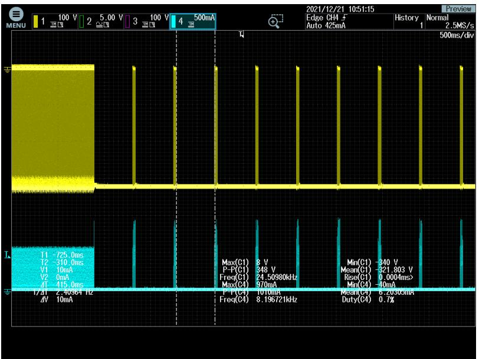

230 VAC

${ \mathsf { C H 1 } } \mathsf { V _ { D S } }$  
$C H 4 \mid _ { \mathrm { { D S } } }$  
$\begin{array} { r } { \mathsf { V } _ { \mathsf { D S \_ M A X } } \colon 3 4 0 \ \mathsf { V } } \\ { \mathsf { I } _ { \mathsf { D S \_ M A X } } \colon 1 . 0 1 \ \mathsf { A } } \end{array}$

## Test Condition:

➢ OUTPUT SHORT

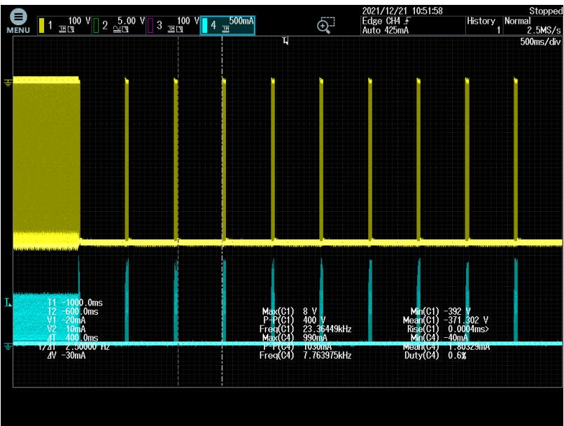

265 $\mathsf { v } _ { \mathsf { A C } }$

${ \mathsf { C H 1 } } \mathsf { V } _ { \mathsf { D S } }$  
$C H 4 1 _ { \mathrm { D S } }$  
$\begin{array} { r } { \mathsf { V } _ { \mathsf { D S \_ M A X } } \colon 3 9 2 \ \mathsf { V } } \\ { \mathsf { I } _ { \mathsf { D S \_ M A X } } \colon 1 . 0 3 \ \mathsf { A } } \end{array}$

## Test Condition:

➢ OUTPUT SHORT

<table><tr><td rowspan="2">项目</td><td colspan="2">85VAC</td><td colspan="2">265VAC</td></tr><tr><td>温度(°C)</td><td>温升(°C)</td><td>温度(°C)</td><td>温升(°C)</td></tr><tr><td>环境温度</td><td colspan="2">26.1</td><td colspan="2">25.1</td></tr><tr><td>BP85256D (U1)</td><td>94.8</td><td>68.7</td><td>77</td><td>51.9</td></tr><tr><td>EE10电感(L2)</td><td>70.8</td><td>44.7</td><td>67.6</td><td>42.5</td></tr><tr><td>输入电解电容(EC2)</td><td>54</td><td>27.9</td><td>46.7</td><td>21.6</td></tr><tr><td>色环电感(L1)</td><td>48.1</td><td>22</td><td>39</td><td>13.9</td></tr><tr><td>输出电解电容(EC3)</td><td>47.6</td><td>21.5</td><td>43.5</td><td>18.4</td></tr><tr><td>保险丝电阻(RZ1)</td><td>57.3</td><td>31.2</td><td>34.8</td><td>9.7</td></tr></table>

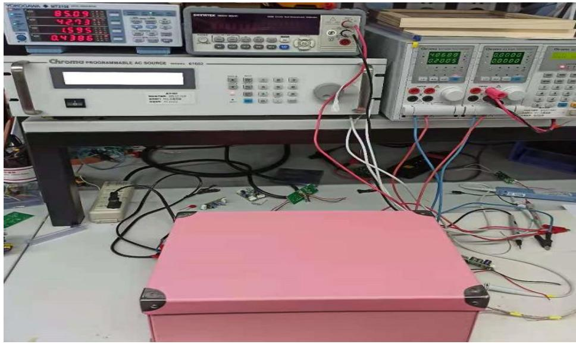

## 测试说明

➢ 在温箱中进行测试  
➢ 电路板放在一个封闭的盒子内  
➢ 热电偶连接到各个测量点  
➢ 等测量点温度达到稳定后记录数据

<table><tr><td rowspan="2">输出电流\输出电压\输入电压</td><td>85VAC</td><td>265VAC</td></tr><tr><td>12V</td><td>12V</td></tr><tr><td>0.3A</td><td>11.581</td><td>11.548</td></tr><tr><td>0.35A</td><td>OLP</td><td>11.512</td></tr><tr><td>0.38A</td><td>OLP</td><td>OLP</td></tr></table>

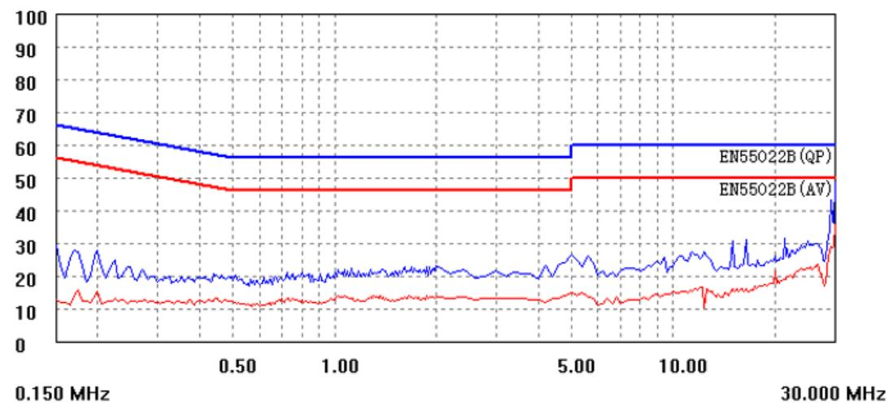

115VAC Line

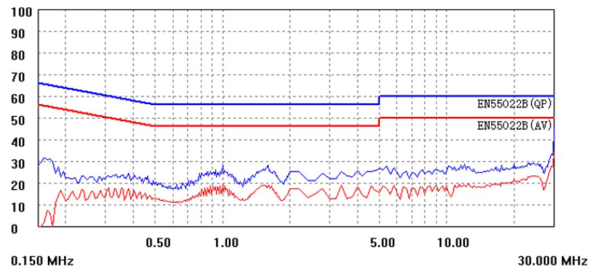

230VAC Line

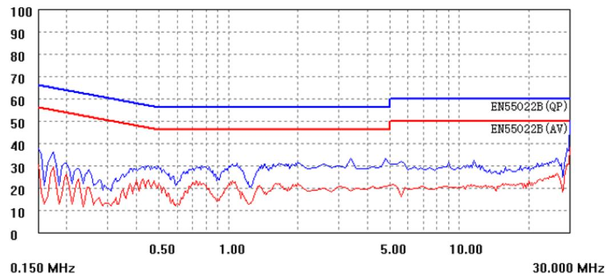

115VAC Neutral

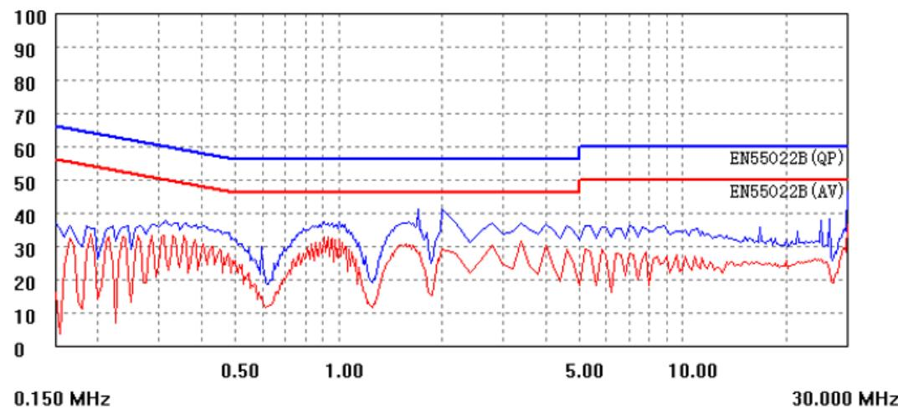

230VAC Neutral

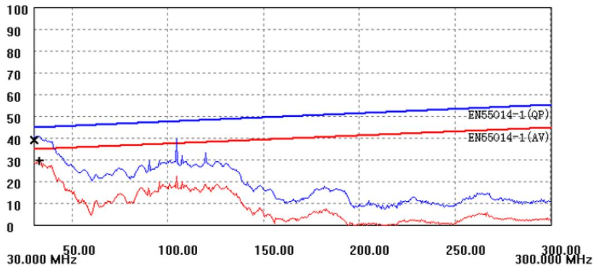

115VAC Line

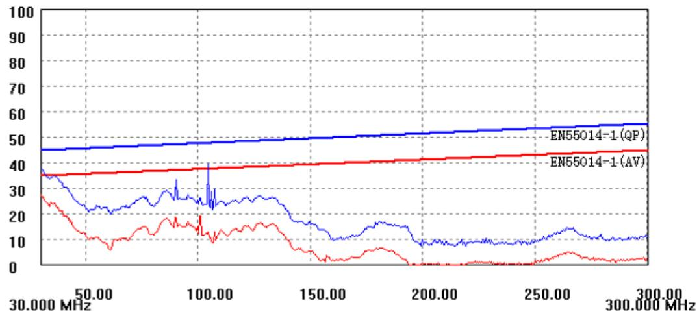

230VAC Line

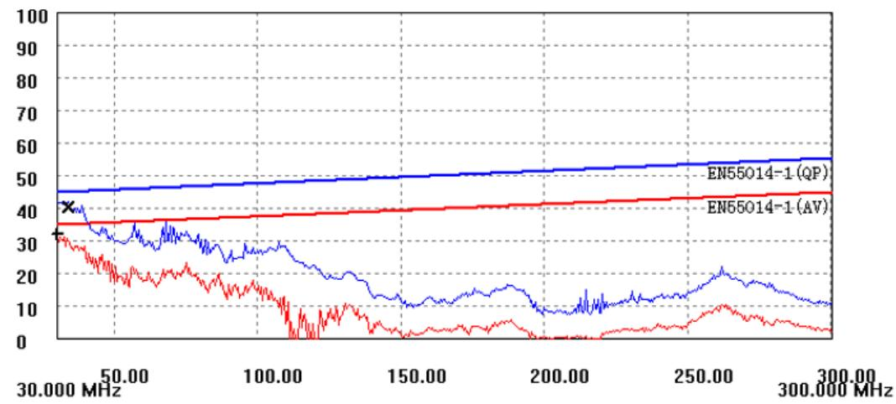

115VAC Neutral

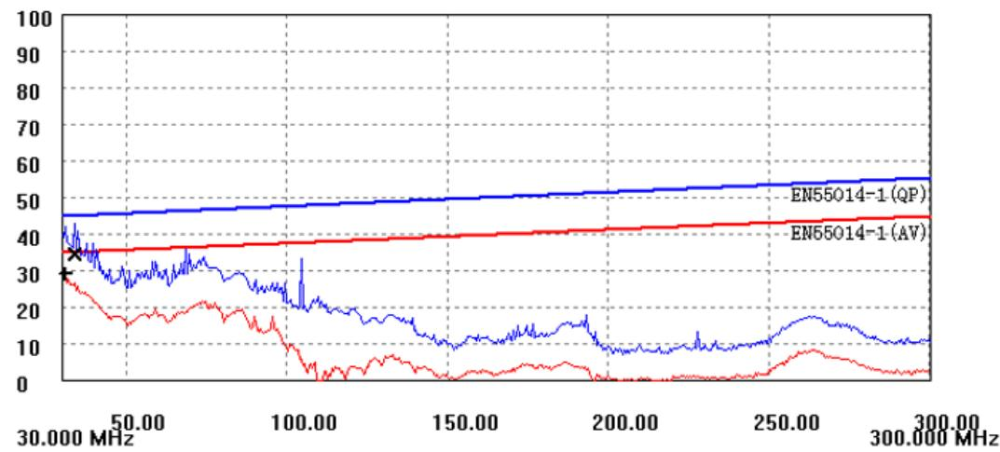

230VAC Neutral

<table><tr><td>差模</td><td>电压</td><td>相位角</td><td>发生器阻抗</td><td>测试次数</td><td>测试结果</td></tr><tr><td>L to N</td><td>+2kV</td><td>0</td><td>2</td><td>10</td><td>Pass</td></tr><tr><td>L to N</td><td>-2kV</td><td>0</td><td>2</td><td>10</td><td>Pass</td></tr><tr><td>L to N</td><td>+2kV</td><td>90</td><td>2</td><td>10</td><td>Pass</td></tr><tr><td>L to N</td><td>-2kV</td><td>90</td><td>2</td><td>10</td><td>Pass</td></tr><tr><td>L to N</td><td>+2kV</td><td>180</td><td>2</td><td>10</td><td>Pass</td></tr><tr><td>L to N</td><td>-2kV</td><td>180</td><td>2</td><td>10</td><td>Pass</td></tr><tr><td>L to N</td><td>+2kV</td><td>270</td><td>2</td><td>10</td><td>Pass</td></tr><tr><td>L to N</td><td>-2kV</td><td>270</td><td>2</td><td>10</td><td>Pass</td></tr></table>

## 测试说明

➢ 按照GB/T17626.5和IEC61000-4-5的最新版本要求进行测试  
➢ 室温环境，230VAC输入，满载条件  
➢ 输入1.2/50us组合波浪涌电压  
➢ 每个测试点重复10次  
➢ 每次间隔时间1分钟  
➢ 试验时样机输出正常（符合A类标准）视为Pass

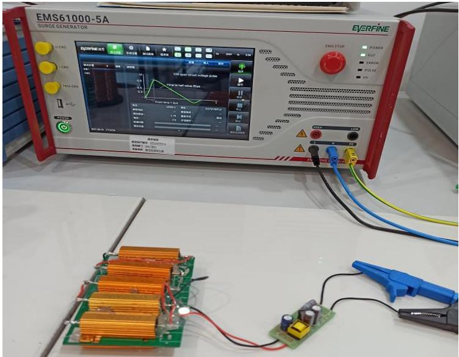

<table><tr><td>差模</td><td>电压</td><td>脉冲群持续时间</td><td>脉冲频率</td><td>测试时间</td><td>测试结果</td></tr><tr><td>L to N</td><td>+4kV</td><td>15ms</td><td>5kHz</td><td>120s</td><td>Pass</td></tr><tr><td>L to N</td><td>-4kV</td><td>15ms</td><td>5kHz</td><td>120s</td><td>Pass</td></tr><tr><td>L to N</td><td>+4kV</td><td>0.75ms</td><td>100kHz</td><td>120s</td><td>Pass</td></tr><tr><td>L to N</td><td>-4kV</td><td>0.75ms</td><td>100kHz</td><td>120s</td><td>Pass</td></tr><tr><td>L to N</td><td>+2kV</td><td>2ms</td><td>38kHz</td><td>120s</td><td>Pass</td></tr><tr><td>L to N</td><td>-2kV</td><td>2ms</td><td>38kHz</td><td>120s</td><td>Pass</td></tr><tr><td>L to N</td><td>+4kV</td><td>2ms</td><td>38kHz</td><td>120s</td><td>Pass</td></tr><tr><td>L to N</td><td>-4kV</td><td>2ms</td><td>38kHz</td><td>120s</td><td>Pass</td></tr></table>

## 测试说明

➢ 按照GB/T17626.4和IEC61000-4-4的最新版本要求进行测试  
➢ 室温环境，230VAC输入满载条件  
➢ 分别测试5kHz/100kHz/38kHz脉冲频率  
➢ 脉冲群周期为300ms  
➢ 每个测试条件测试时间120s  
➢ 试验时样机输出正常（符合A类标准）视为Pass

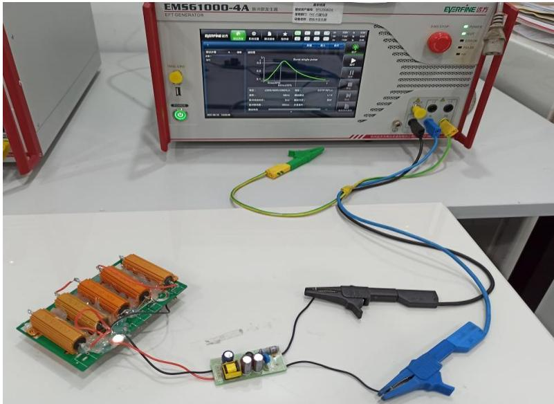

<table><tr><td>测试点</td><td>电压(V)</td><td>放电类型</td><td>放电次数</td><td>测试结果</td></tr><tr><td>Vo</td><td>+15kV</td><td>空气放电</td><td>10</td><td>Pass</td></tr><tr><td>Vo</td><td>-15kV</td><td>空气放电</td><td>10</td><td>Pass</td></tr><tr><td>GND</td><td>+15kV</td><td>空气放电</td><td>10</td><td>Pass</td></tr><tr><td>GND</td><td>-15kV</td><td>空气放电</td><td>10</td><td>Pass</td></tr><tr><td>Vo</td><td>+20kV</td><td>空气放电</td><td>10</td><td>Pass</td></tr><tr><td>Vo</td><td>-20kV</td><td>空气放电</td><td>10</td><td>Pass</td></tr><tr><td>GND</td><td>+20kV</td><td>空气放电</td><td>10</td><td>Pass</td></tr><tr><td>GND</td><td>-20kV</td><td>空气放电</td><td>10</td><td>Pass</td></tr></table>

## 测试说明

➢ 按照GB/T17626.2和IEC61000-4-2的最新版本要求进行测试  
➢ 室温环境，230VAC输入满载条件  
➢ 每个测试点重复10次  
➢ 分别对输出正端和地进行空气放电  
➢ 试验时样机输出正常（符合A类标准）视为Pass

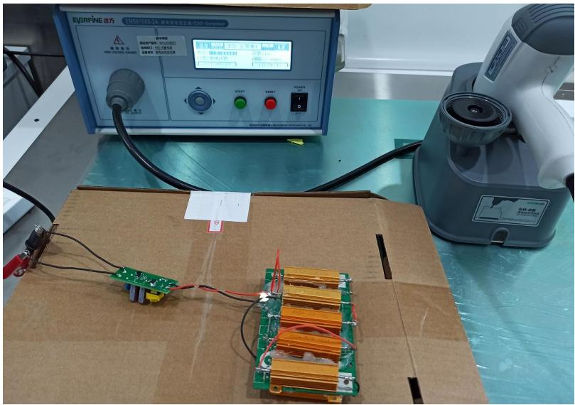

## THANK YOU FOR WATCHING
