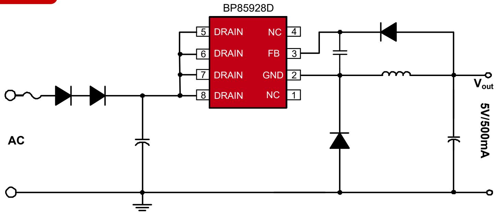
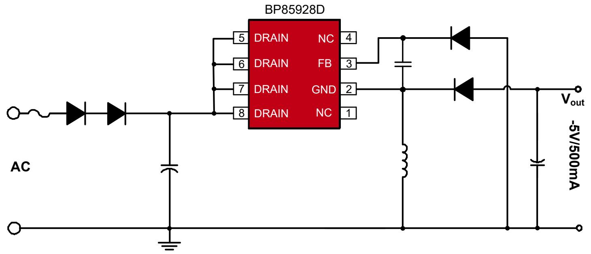
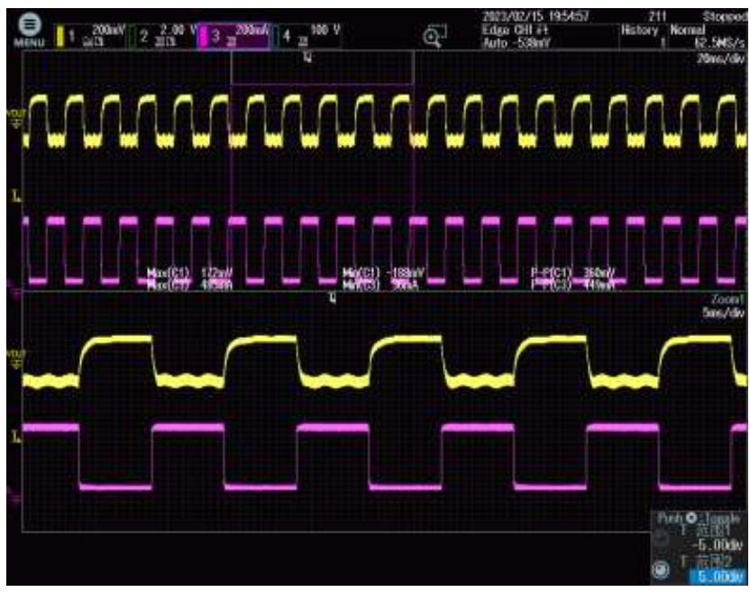
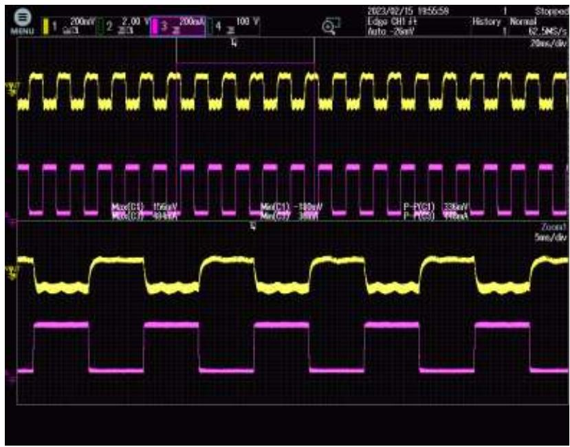
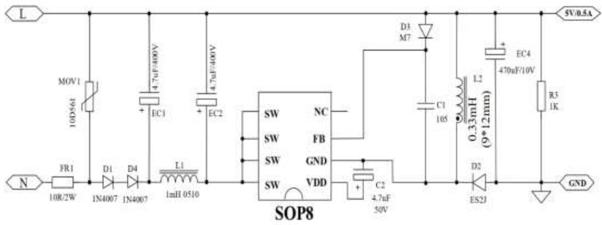
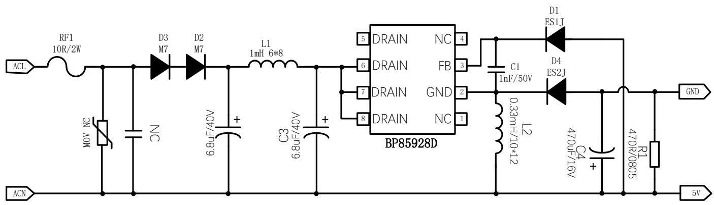

## 小家电

BP85928D ±5V500mA 降压芯片推广资料 V0.2

时间：2023年5月

## 典型应用图（Buck）

## 产品特点

此文档的测试数据均基于下一页的BuckBoost拓扑

内置650V高压MOS  
集成高压启动和自供电电路  
综合性能优，可靠性高

保护功能完善  
SOP8封装

## 典型应用图（Buck Boost）

## 产品规格与目标应用

产品规格

<table><tr><td>Part No.</td><td>输入电压</td><td>稳态功率</td><td>峰值功率</td></tr><tr><td rowspan="2">BP85928D</td><td>175~265VAC</td><td>2.5W(5V/500mA)</td><td>3.5W(5V/700mA)</td></tr><tr><td>85~265VAC</td><td>2.25W(5V/450mA)</td><td>3W(5V/600mA)</td></tr></table>

注：稳态功率在半封闭式75°C 环境下测试(Buck/Buck-boost 应用)，持续时间大于2小时。峰值功率在半封闭式75°C 环境下测试(Buck/Buck-boost 应用)，持续时间大于1分钟。

## 目标应用

小家电  
电机驱动辅助电源  
IOT/智能家居/智能照明

输出电压调整率

<table><tr><td> $V_{IN}(VAC)$  $I_{OUT}(mA)$ </td><td>85</td><td>115</td><td>230</td><td>265</td><td>线调整率</td></tr><tr><td>0 (0%)</td><td>5.16</td><td>5.16</td><td>5.13</td><td>5.11</td><td>0.97%</td></tr><tr><td>50 (10%)</td><td>5.12</td><td>5.12</td><td>5.12</td><td>5.1</td><td>0.39%</td></tr><tr><td>125 (25%)</td><td>5.05</td><td>5.05</td><td>5.05</td><td>5.06</td><td>0.20%</td></tr><tr><td>250 (50%)</td><td>4.98</td><td>4.98</td><td>4.99</td><td>4.99</td><td>0.20%</td></tr><tr><td>375 (75%)</td><td>4.93</td><td>4.94</td><td>4.95</td><td>4.96</td><td>0.61%</td></tr><tr><td>500 (100%)</td><td>4.91</td><td>4.91</td><td>4.93</td><td>4.93</td><td>0.41%</td></tr><tr><td>负载调整率</td><td>4.98%</td><td>4.97%</td><td>3.98%</td><td>3.58%</td><td></td></tr></table>

◼ 调整率计算方法：调整率=100%\*(最大值-最小值)/平均值

## 动态

## Vo IO

测试条件：  
➢ 85VAC  
➢ 跳载电流：50\~450mA  
➢ 跳载周期：5ms\~5ms  
跳载斜率：500mA/us

测试结果：VPK-PK=360mV

测试条件：  
➢ 265VAC  
跳载电流：50\~450mA  
跳载周期：5ms\~5ms  
跳载斜率：500mA/us  
测试结果：  
➢ VPK-PK=336mV

测试条件：10%\~90%动态负载

竞品XX8009方案：

BP85928D：  

<table><tr><td>IC型号</td><td>XX8009</td><td>BP85928D</td></tr><tr><td>IC封装</td><td>SOP8</td><td>SOP8</td></tr><tr><td>带载能力</td><td>500mA</td><td>500mA</td></tr><tr><td>待机功耗@230Vac</td><td>130mW</td><td>110mW</td></tr><tr><td>满载效率@230Vac</td><td>65.4%</td><td>67.0%</td></tr><tr><td>BOM数量</td><td>15个</td><td>14个</td></tr></table>

## 推广注意事项

◼ 输出假负载需要放到470R (待机功耗比竞品XX8009带1K假负载还低)。  
◼ 由于外置反馈二极管ES1J的品牌和型号不同，电气性能和寄生参数可能不一致, 为了避免EFT/surge等可靠性问题，建议在FB到GND引脚之间放置1nF/50V贴片电容。

注意上述电容容值不宜过大（建议≤10nF），过大的容值可能导致输出动态纹波增大等问题。

上海市浦东新区申江路5005弄星创科技广场3号楼9层

+86-21-51870166

sales@bpsemi.com

www.bpsemi.com

  
微信公众号

  
微信视频号
