# BP85928D BuckBoost参考设计 V0.2

# (0.33mH. -5V/500mA)

时间：2023年5月

'BPS

晶丰明源

## 内容

BP85928D简介  
电源规格  
电路图  
PCB Layout  
BOM  
性能测试数据  
推广注意事项  
重要声明

## BP85928D简介

集成650V高压MOSFET  
集成输出电压采样  
集成高压启动和自供电电路  
无需外部补偿电路  
优异的动态响应速度，输出电压纹波小  
固定5V输出  
改善EMI性能的频率调制技术  
丰富的保护功能

应用领域：

 小家电辅助电源  
 电机驱动辅助电源  
 IOT/智能家居/智能照明

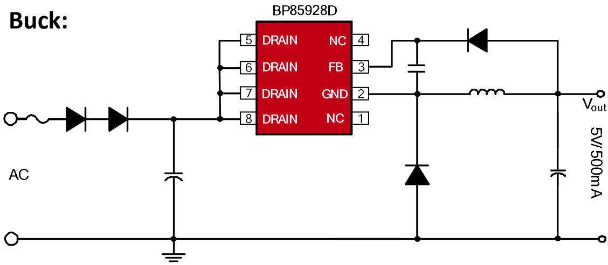

BuckBoost:  
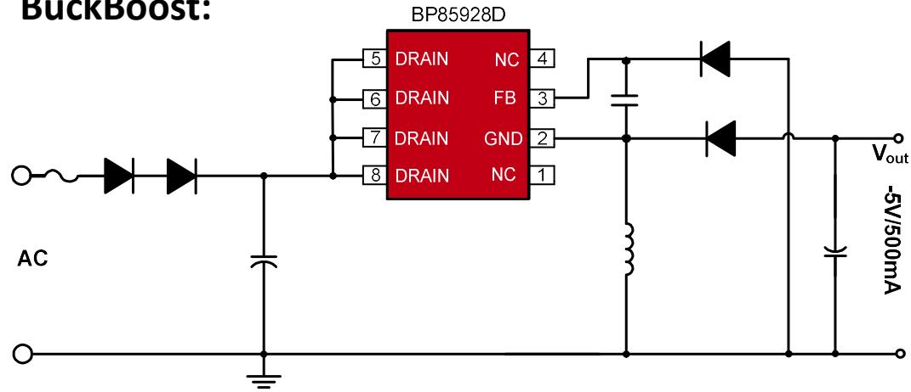

## 电源规格

<table><tr><td>项目描述</td><td>符号</td><td>最小</td><td>典型</td><td>最大</td><td>单位</td><td>备注</td></tr><tr><td colspan="7">输入</td></tr><tr><td>电压</td><td> $V_{IN}$ </td><td>85</td><td></td><td>265</td><td> $V_{AC}$ </td><td></td></tr><tr><td>频率</td><td> $f_{LINE}$ </td><td>47</td><td>50/60</td><td>63</td><td>Hz</td><td></td></tr><tr><td colspan="7">输出</td></tr><tr><td>输出电压</td><td> $V_{OUT}$ </td><td>4.75</td><td>5</td><td>5.25</td><td>V</td><td>±5%</td></tr><tr><td>输出电流</td><td> $I_{OUT}$ </td><td></td><td>500</td><td></td><td>mA</td><td></td></tr><tr><td>输出电压纹波</td><td> $V_{RIPPLE}$ </td><td></td><td></td><td>120</td><td>mV</td><td>稳态,20MHz带宽</td></tr><tr><td colspan="7">效率</td></tr><tr><td>待机功耗</td><td> $P_{STDBY}$ </td><td></td><td></td><td>110</td><td>mW</td><td>Vin=230VAC</td></tr><tr><td>满载效率</td><td>η</td><td>64.5</td><td></td><td></td><td>%</td><td></td></tr><tr><td colspan="7">环境</td></tr><tr><td>传导EMI</td><td></td><td colspan="4">满足EN55022 Class B</td><td></td></tr><tr><td>Surge</td><td></td><td></td><td></td><td>2</td><td>kV</td><td></td></tr><tr><td>工作环境温度</td><td> $T_{AMP}$ </td><td></td><td>50</td><td></td><td>°C</td><td></td></tr></table>

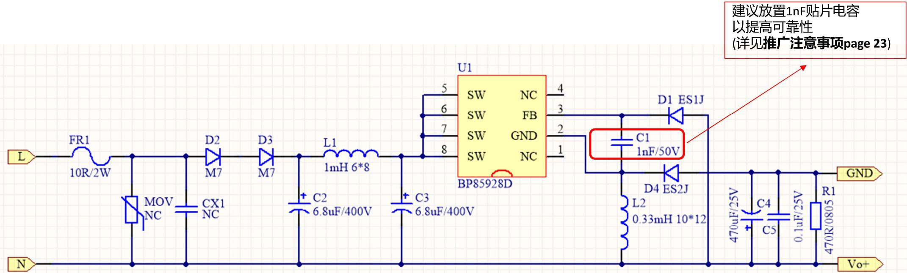

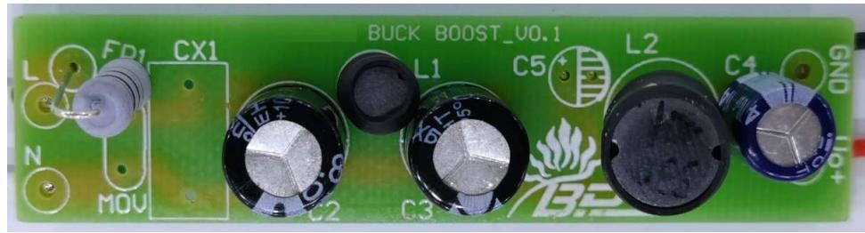

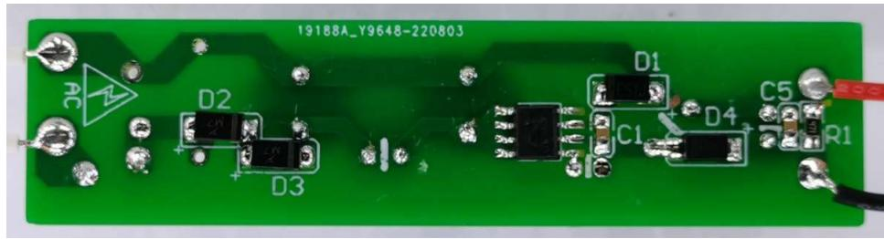

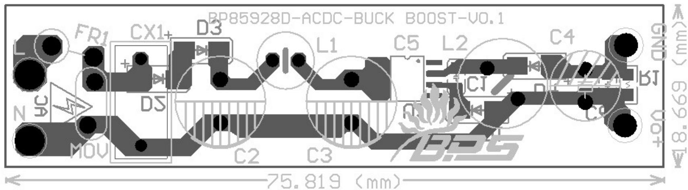

<table><tr><td>序号</td><td>原件标号</td><td>参数</td><td>描述</td><td>数量</td></tr><tr><td>1</td><td>FR1</td><td>2W, 10R绕线电阻</td><td>绕线电阻</td><td>1</td></tr><tr><td>2</td><td>D1</td><td>ES1J, 1A/600V</td><td>贴片二极管</td><td>1</td></tr><tr><td>3</td><td>D2、D3</td><td>M7, 1A/1000V</td><td>贴片二极管</td><td>2</td></tr><tr><td>4</td><td>D4</td><td>ES2J, 2A/600V</td><td>贴片二极管</td><td>1</td></tr><tr><td>5</td><td>C1</td><td>1nF/50V/0805</td><td>贴片电阻</td><td>1</td></tr><tr><td>6</td><td>C2, C3</td><td>6.8uF/400V</td><td>电解电容</td><td>2</td></tr><tr><td>7</td><td>C4</td><td>470uF/25V</td><td>电解电容</td><td>1</td></tr><tr><td>8</td><td>C5</td><td>0.1uF/50V/0805</td><td>贴片电容</td><td>1</td></tr><tr><td>9</td><td>L1</td><td>1mH-6*8</td><td>工字电感</td><td>1</td></tr><tr><td>10</td><td>L2</td><td>0.33mH-10*12</td><td>工字电感</td><td>1</td></tr><tr><td>11</td><td>U1</td><td>BP85928D</td><td>IC-SOP8</td><td>1</td></tr><tr><td>12</td><td>R1</td><td>470R/0805-5%</td><td>贴片电阻</td><td>1</td></tr><tr><td>总计</td><td></td><td></td><td></td><td>14</td></tr><tr><td colspan="5">待机功耗 (mW)</td></tr><tr><td>Vin(Vac)</td><td>85</td><td>115</td><td>230</td><td>265</td></tr><tr><td>#1</td><td>87.64</td><td>91.71</td><td>110.35</td><td>116.35</td></tr><tr><td>#2</td><td>87.49</td><td>91.84</td><td>111.05</td><td>117.29</td></tr><tr><td>#3</td><td>86.78</td><td>90.86</td><td>109.00</td><td>114.56</td></tr></table>

<table><tr><td> $V_{IN}(VAC)$ </td><td> $I_{OUT}(mA)$ </td><td> $P_{IN}(W)$ </td><td> $V_{OUT}(V)$ </td><td> $P_{OUT}(W)$ </td><td>Eff(%)</td></tr><tr><td>85</td><td>500</td><td>3.995</td><td>4.91</td><td>2.455</td><td>61.45%</td></tr><tr><td>115</td><td>500</td><td>3.753</td><td>4.91</td><td>2.455</td><td>65.41%</td></tr><tr><td>230</td><td>500</td><td>3.679</td><td>4.93</td><td>2.465</td><td>67.00%</td></tr><tr><td>265</td><td>500</td><td>3.700</td><td>4.93</td><td>2.465</td><td>66.62%</td></tr><tr><td> $V_{IN}(VAC)$  $I_{OUT}(mA)$ </td><td>85</td><td>115</td><td>230</td><td>265</td><td>线调整率</td></tr><tr><td>0 (0%)</td><td>5.16</td><td>5.16</td><td>5.13</td><td>5.11</td><td>0.97%</td></tr><tr><td>50 (10%)</td><td>5.12</td><td>5.12</td><td>5.12</td><td>5.1</td><td>0.39%</td></tr><tr><td>125 (25%)</td><td>5.05</td><td>5.05</td><td>5.05</td><td>5.06</td><td>0.20%</td></tr><tr><td>250 (50%)</td><td>4.98</td><td>4.98</td><td>4.99</td><td>4.99</td><td>0.20%</td></tr><tr><td>375 (75%)</td><td>4.93</td><td>4.94</td><td>4.95</td><td>4.96</td><td>0.61%</td></tr><tr><td>500 (100%)</td><td>4.91</td><td>4.91</td><td>4.93</td><td>4.93</td><td>0.41%</td></tr><tr><td>负载调整率</td><td>4.98%</td><td>4.97%</td><td>3.98%</td><td>3.58%</td><td></td></tr></table>

 调整率计算方法：调整率=100%\*(最大值-最小值)/平均值

## 开机波形

Vo IL  
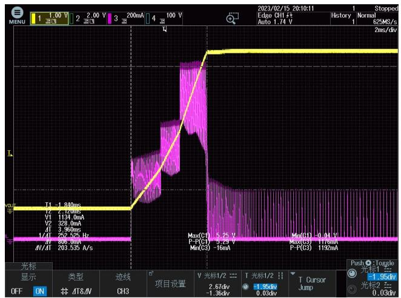

测试条件：  
 85VAC  
 空载  
测试结果：  
 Trise=4.0ms

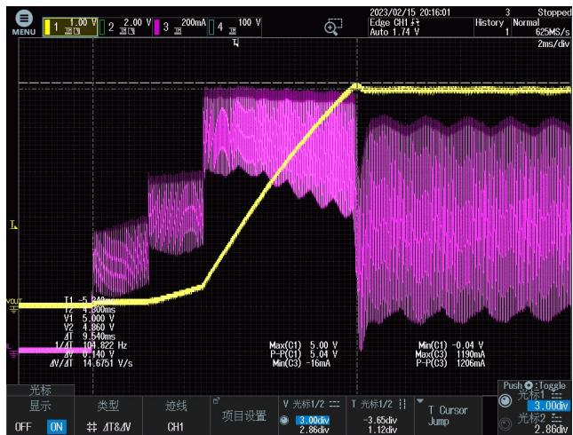

测试条件：  
 85VAC  
 500mA  
测试结果：  
 Trise= 6.5ms

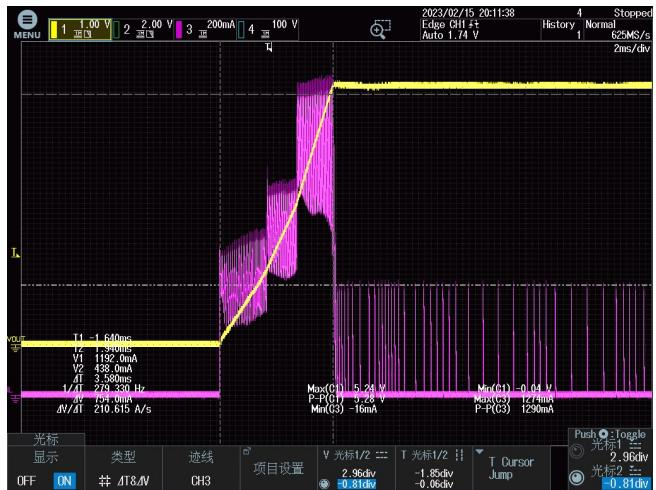

测试条件：  
 265VAC  
 空载  
测试结果：  
 Trise= 3.6ms

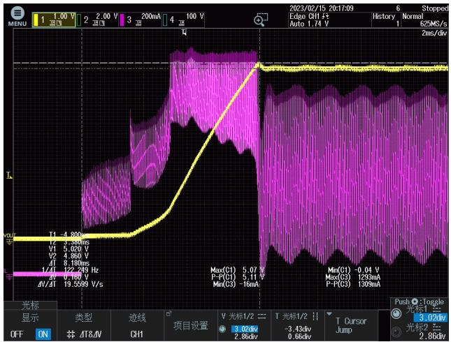

测试条件：  
 265VAC  
 500mA  
测试结果：  
 Trise= 8.2ms

## 稳态开关波形

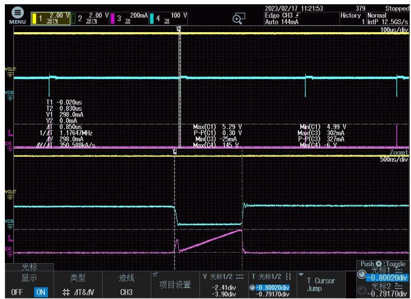

测试条件：  
 85VAC  
 空载  
测试结果：  
 表现正常

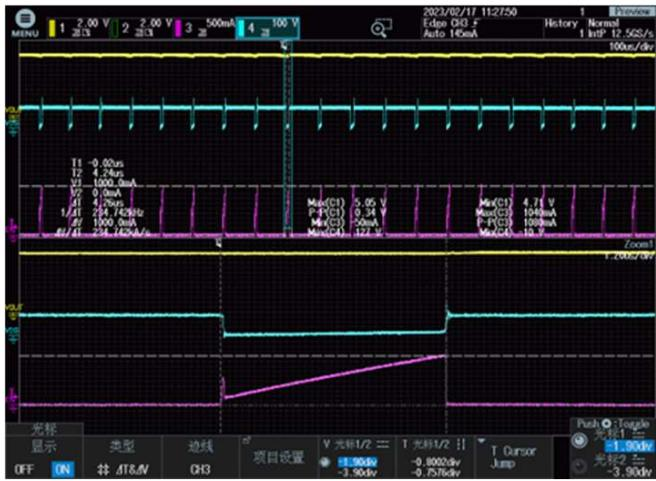

测试条件：  
85VAC  
 500mA  
测试结果：  
 表现正常

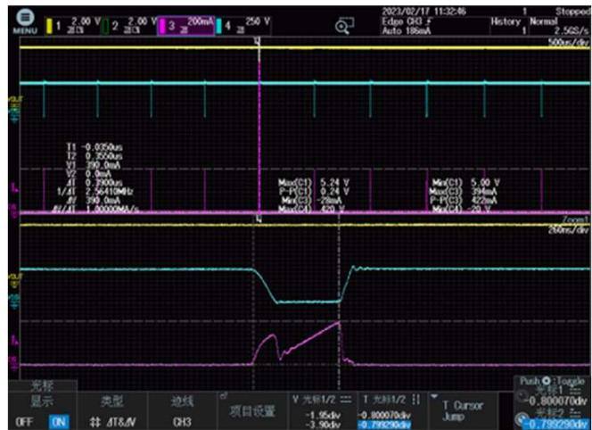

测试条件：  
 265VAC  
 空载  
测试结果：  
 表现正常

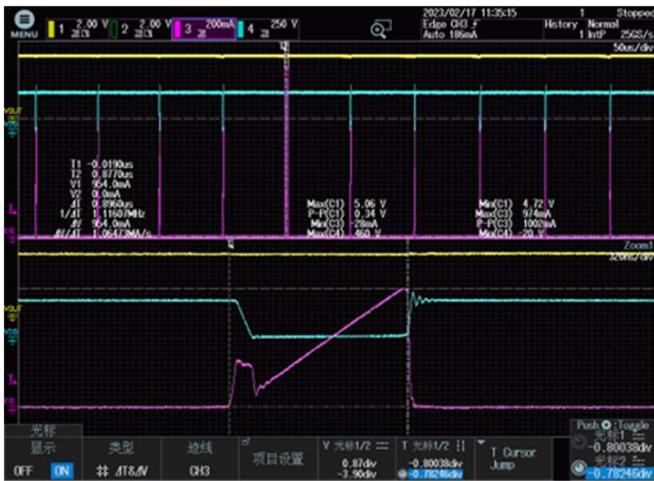

测试条件：  
 265VAC  
 500mA  
测试结果：  
 表现正常

## 稳态输出纹波

Vo IL  
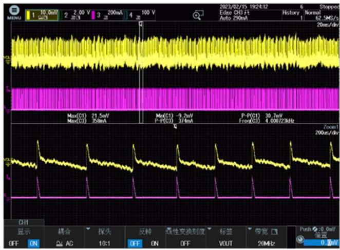

测试条件：

 $8 5 \mathsf { V A C }$  
 空载

测试结果：

 $V _ { P K - P K } = 3 0 . 7 m V$

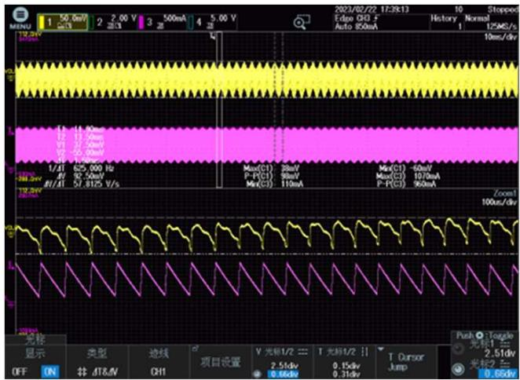

测试条件：  
 $8 5 \mathsf { V } \mathsf { A C }$  
 ${ 5 0 0 } { \mathsf { m } } { \mathsf { A } }$

测试结果：

 $V _ { P K - P K } = 9 8 m V$

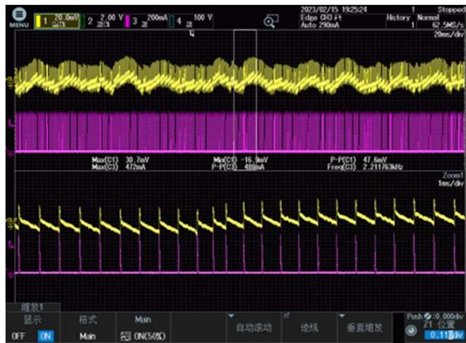

 测试条件：

 265VAC ，  
 空载

测试结果：

 $V _ { P K - P K } = 4 7 . 6 m V$

测试条件：  
 $2 6 5 \mathsf { V } \mathsf { A C }$ ，  
 500mA

测试结果：

 $V _ { P K - P K } = 1 1 6 m V$

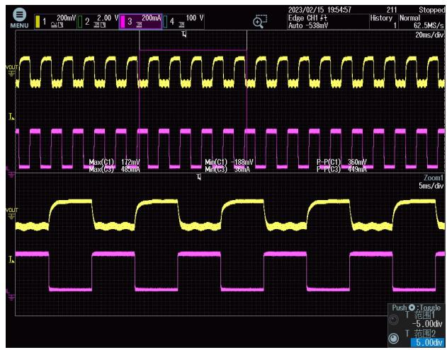

测试条件：  
 85VAC  
 跳载电流：50\~450mA  
 跳载周期：5ms\~5ms  
 跳载斜率：500mA/us  
测试结果：  
 $V _ { P \ K \cdot P \ K } = 3 6 0 m v$

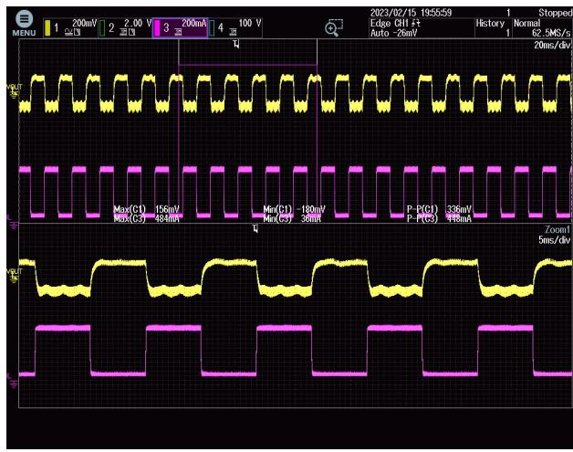

测试条件：  
 265VAC  
跳载电流：50\~450mA  
 跳载周期：5ms\~5ms  
 跳载斜率：500mA/us  
测试结果：  
 $v _ { P K - P K } = 3 3 6 m v$

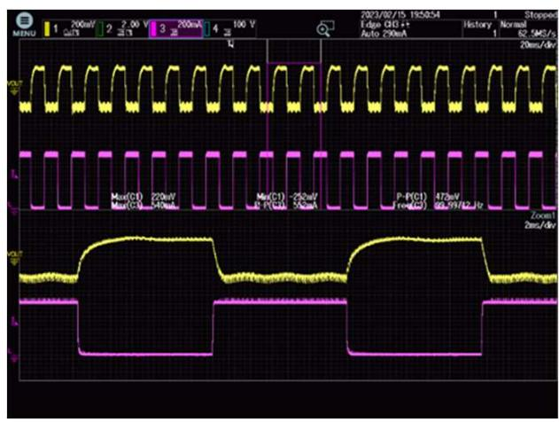

测试条件：  
 85VAC  
 跳载电流：50\~450mA  
 跳载周期：5ms\~5ms  
 跳载斜率：500mA/us  
测试结果：  
 $\mathsf { V } _ { \mathsf { P K - P K } } { = } 4 7 2 \mathsf { m V }$

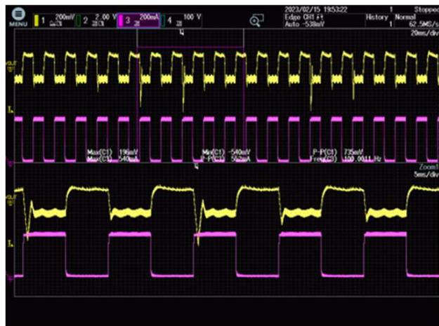

测试条件：  
 265VAC  
跳载电流：50\~450mA  
 跳载周期：5ms\~5ms  
 跳载斜率：500mA/us  
测试结果：  
 $\mathsf { V } _ { \mathsf { P K - P K } } { = } 7 3 5 \mathsf { m V }$

## 短路保护

测试条件：  
 85VAC ，输出短路  
测试结果：  
 保护功能正常

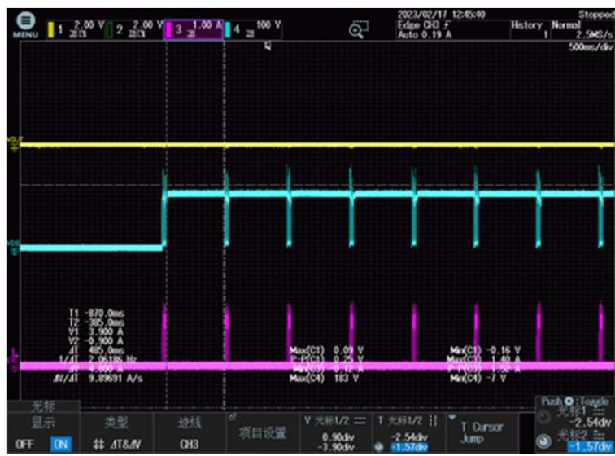

测试条件：  
 265VAC ，输出短路  
测试结果：  
 保护功能正常

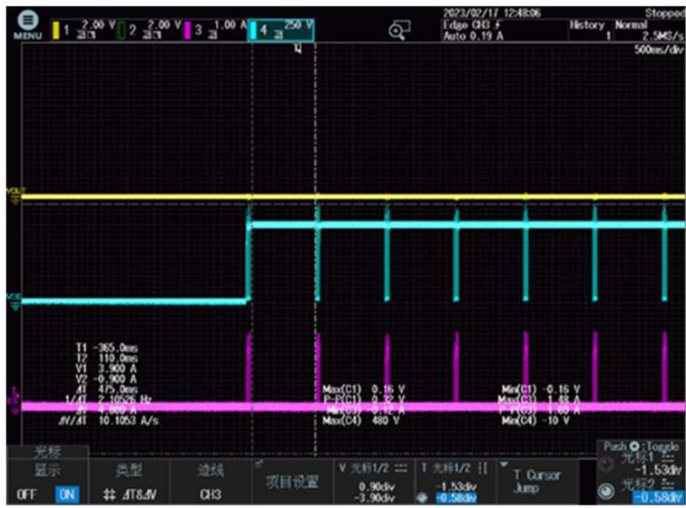

## 过载保护

测试条件：  
 85VAC ，输出带载1A  
测试结果：  
 保护功能正常

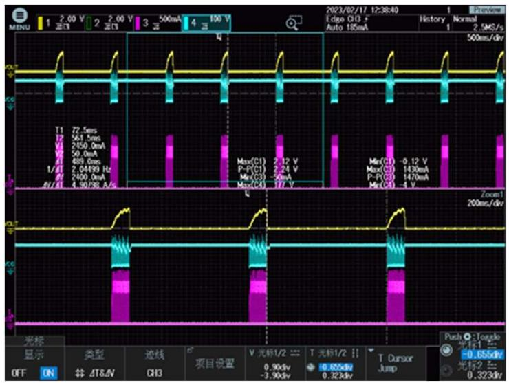

测试条件：  
 265VAC ，输出带载1A  
测试结果：  
 保护功能正常

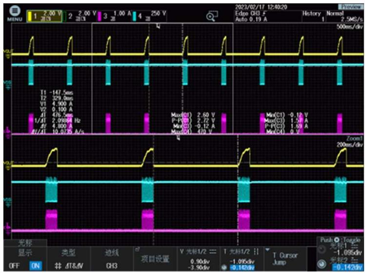

测试条件：  
 85VAC ，输出空载，去掉假负载  
测试结果：  
 保护功能正常

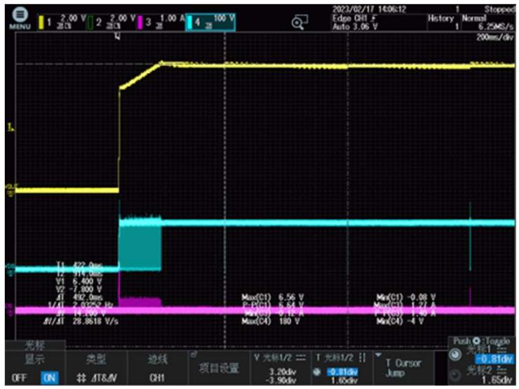

测试条件：  
 265VAC ，输出空载，去掉假负载  
测试结果：  
 保护功能正常

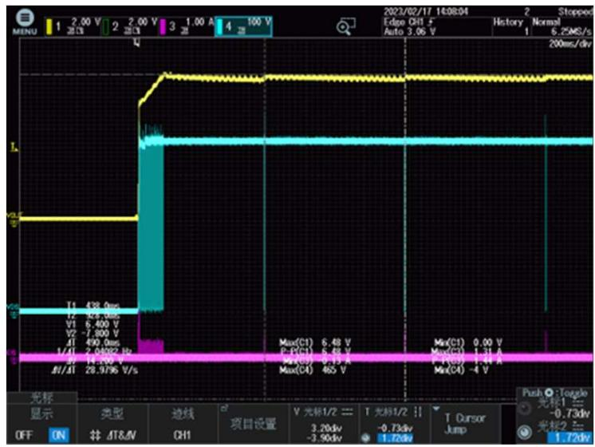

<table><tr><td colspan="4">热电偶测温,50°C密闭环境. lo=500mA. L2=0.33mH</td></tr><tr><td> $V_{IN}(VAC)$ </td><td>Tr (°C)</td><td>Tc(°C)</td><td> $\triangle T(°C)$ </td></tr><tr><td>85</td><td>52.8</td><td>135.7</td><td>82.9</td></tr><tr><td>115</td><td>51.1</td><td>103.7</td><td>52.6</td></tr><tr><td>230</td><td>50.6</td><td>101.0</td><td>50.4</td></tr><tr><td>265</td><td>51.0</td><td>105.3</td><td>54.3</td></tr></table>

<table><tr><td colspan="4">热电偶测温,50°C密闭环境. lo=450mA. L2=0.33mH</td></tr><tr><td> $V_{IN}(VAC)$ </td><td>Tr (°C)</td><td>Tc(°C)</td><td> $\triangle T(^{\circ}C)$ </td></tr><tr><td>85</td><td>51.2</td><td>107.1</td><td>55.9</td></tr></table>

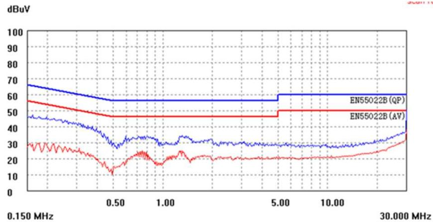

115VAC Line

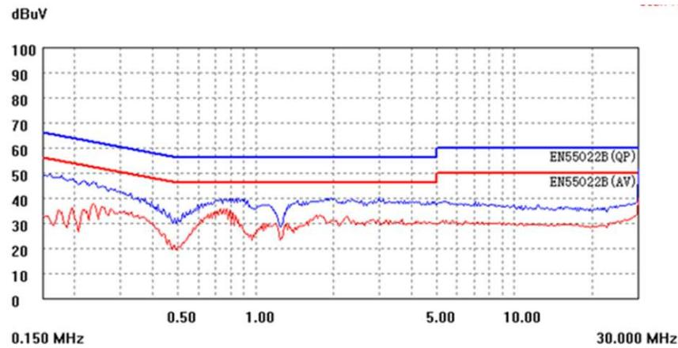

115VAC Neutral

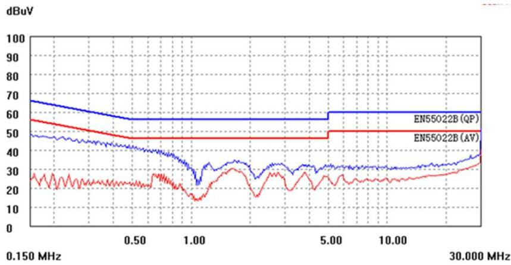

230VAC Line

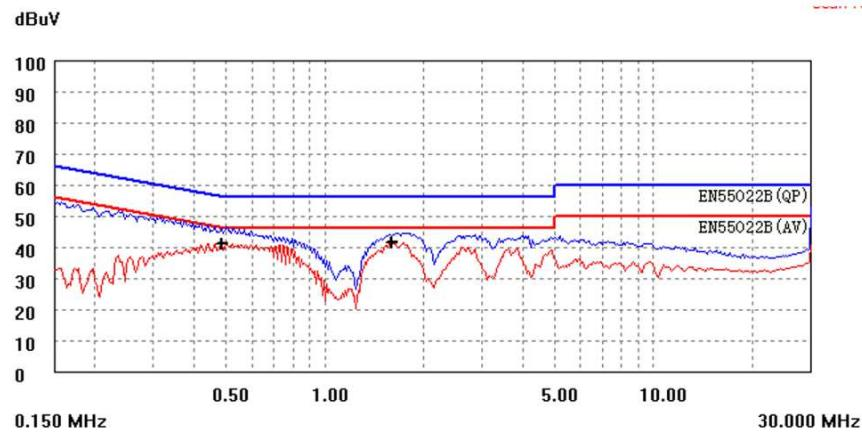

230VAC Neutral

Surge浪涌测试

<table><tr><td>差模</td><td>电压</td><td>相位角</td><td>测试次数</td><td>测试结果</td></tr><tr><td>L to N</td><td>+2kV</td><td>0</td><td>10</td><td>Pass</td></tr><tr><td>L to N</td><td>-2kV</td><td>0</td><td>10</td><td>Pass</td></tr><tr><td>L to N</td><td>+2kV</td><td>90</td><td>10</td><td>Pass</td></tr><tr><td>L to N</td><td>-2kV</td><td>90</td><td>10</td><td>Pass</td></tr><tr><td>L to N</td><td>+2kV</td><td>180</td><td>10</td><td>Pass</td></tr><tr><td>L to N</td><td>-2kV</td><td>180</td><td>10</td><td>Pass</td></tr><tr><td>L to N</td><td>+2kV</td><td>270</td><td>10</td><td>Pass</td></tr><tr><td>L to N</td><td>-2kV</td><td>270</td><td>10</td><td>Pass</td></tr></table>

## 测试说明

 按照GB/T17626.5和IEC61000-4-5的最新版本要求进行测试  
 室温环境，230VAC输入，满载条件  
 输入1.2/50us组合波浪涌电压  
 每个测试点重复10次  
 每次间隔时间1分钟  
 试验时样机输出正常（符合A类标准）视为Pass

EFT脉冲群测试

<table><tr><td>差模</td><td>电压</td><td>脉冲群持续时间</td><td>脉冲频率</td><td>测试时间</td><td>测试结果</td></tr><tr><td>L to N</td><td>+4kV</td><td>15ms</td><td>5KHz</td><td>120s</td><td>Pass</td></tr><tr><td>L to N</td><td>-4kV</td><td>15ms</td><td>5KHz</td><td>120s</td><td>Pass</td></tr><tr><td>L to N</td><td>+4kV</td><td>0.75ms</td><td>100KHz</td><td>120s</td><td>Pass</td></tr><tr><td>L to N</td><td>-4kV</td><td>0.75ms</td><td>100KHz</td><td>120s</td><td>Pass</td></tr><tr><td>L to N</td><td>+2kV</td><td>1.95ms</td><td>38KHz</td><td>120s</td><td>Pass</td></tr><tr><td>L to N</td><td>-2kV</td><td>1.95ms</td><td>38KHz</td><td>120s</td><td>Pass</td></tr><tr><td>L to N</td><td>+4kV</td><td>1.95ms</td><td>38KHz</td><td>120s</td><td>Pass</td></tr><tr><td>L to N</td><td>-4kV</td><td>1.95ms</td><td>38KHz</td><td>120s</td><td>Pass</td></tr></table>

## 测试说明

 按照GB/T17626.5和IEC61000-4-4的最新版本要求进行测试  
 室温环境，230VAC输入，满载条件  
 分别测试5KHz/100KHz/38KHz  
 脉冲群周期为300ms  
 每个测试条件测试时间120S  
 试验时样机输出正常（符合A类标准）视为Pass

## 推广注意事项

由于外置反馈二极管ES1J的品牌和型号不同，电气性能和寄生参数可能不一致。  
为了避免EFT/surge等可靠性问题，建议在FB到GND引脚之间放置贴片电容（建议1nF/50V）。  
注意上述电容容值不宜过大（建议≤10nF），过大的容值可能导致输出动态纹波增大等问题。

## 重要声明

 本文档中的数据和信息仅供参考，不构成任何形式的建议、验收标准或保证。实际测试数据和结果可能同文档中列出的数据和结果存在差异，请用户自行确认产品的适用性。  
此文档测试的BP85928D样品未经CP/FT工序，后续根据批量数据可能微调某些参数，可能略影响性能表现。此文档供参考评估，最终性能表现请以量产版本芯片为准。

## 更新记录

V0.1：首次发布  
V0.2：原理图/BOM添加FB电容，添加page23“推广注意事项”

上海市浦东新区申江路5005弄星创科技广场3号楼9层

+86-21-51870166

sales@bpsemi.com

www.bpsemi.com

  
微信公众号

  
微信视频号
