## 概述

BP85956D是一款高性能、高集成度、低待机功耗的开关电源驱动芯片，适用于全电压85\~265VAC输入的 Buck、Buck-Boost变换器拓扑应用。

BP85956D内部集成了650V高压MOSFET、高压启动和自供电电路、电流采样电路、输出电压采样电阻，采用先进的控制技术，无需外部VCC电容和环路补偿即可实现优异的恒压输出特性，减少外围器件数量，节省系统成本和体积，同时提高可靠性。

BP85956D采用多模式控制技术，能有效降低系统待机功耗，提高效率和改善动态性能，并减小系统工作在轻载时的音频噪声。

BP85956D提供了丰富的保护功能，包括输出短路保护、输出过载保护、输出过压保护、反馈开路保护、逐周期限流、过温保护等，使系统更加安全可靠。

BP85956D采用SOP-8封装。

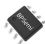  
SOP-8封装

## 特点

集成VCC电容  
集成650V高压MOSFET  
集成高压启动和自供电电路  
低待机功耗50mW@230Vac  
固定12V输出  
优异的动态响应速度，输出电压纹波小  
良好的负载调整率和线性调整率  
降低音频噪声的降幅调制技术  
自适应开关频率，最高45kHz  
改善 EMI性能的频率调制技术  
内置软启动功能  
保护功能

输出短路保护(SCP)  
》输出过压保护(OVP)  
》输出过载保护(OLP)  
反馈开路保护  
》逐周期限流(Cycle-by-Cycle)  
》迟滞过温保护(OTP)

## 应用领域

小家电辅助电源  
电机驱动辅助电源  
IOT/智能家居/智能照明

## 典型应用

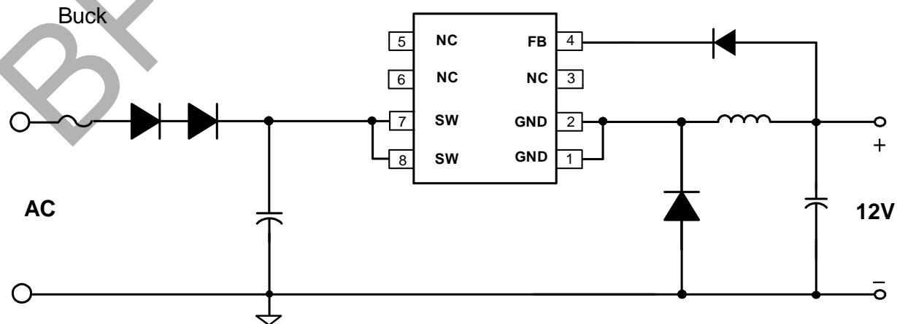

图1.BP85956D典型Buck应用电路

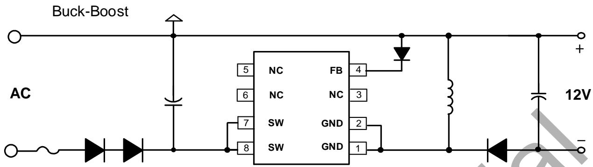

图2.BP85956D典型Buck-boost应用电路

定购信息

<table><tr><td>定购型号</td><td>封装</td><td>包装形式</td><td>打印</td></tr><tr><td>BP85956D</td><td>SOP-8</td><td>卷盘4000 只/盘</td><td>BP85956XXXXYYZZWWD</td></tr></table>

管脚封装

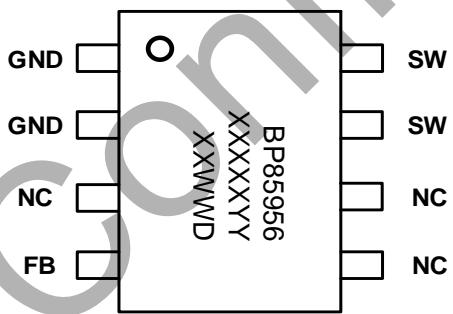

BP85956:产品型号  
XXXXXYY:批次号  
ZZ:标示  
WW:周号  
D：封装代码 (代表 SOP)

图3.SOP-8管脚封装图  
管脚描述

<table><tr><td>管脚号</td><td>管脚名称</td><td>描述</td></tr><tr><td>1,2</td><td>GND</td><td>芯片地,内置 MOSFET 源极</td></tr><tr><td>3,5,6</td><td>NC</td><td>无连接</td></tr><tr><td>4</td><td>FB</td><td>输出电压反馈端</td></tr><tr><td>7,8</td><td>SW</td><td>内置 MOSFET 漏极,此引脚也向芯片内部提供自供电电流</td></tr></table>

输出规格表(注1)

<table><tr><td>产品型号</td><td>输出电压(V)</td><td>持续输出电流(mA)</td><td>峰值输出电流(mA)</td></tr><tr><td>BP85956D</td><td>12</td><td>300</td><td>350</td></tr></table>

注1:  
持续输出电流在半封闭75C环境下测试 (Buck/Buck-Boost)，持续工作时间大于2小时。  
峰值输出电流在半封闭75C环境下测试 (Buck/Buck-Boost)，持续工作时间大于1分钟。

极限参数(注2） (无特别说明情况下，TA=25C)

<table><tr><td>符号</td><td>参数</td><td>参数范围</td><td>单位</td></tr><tr><td> $V_{SW}$ </td><td>内部高压 MOSFET 漏极到源极电压</td><td>-0.3~650</td><td>V</td></tr><tr><td> $V_{FB}$ </td><td>FB 引脚电压(以 GND 引脚为参考)</td><td>-0.3~30</td><td>V</td></tr><tr><td> $P_{DMAX}$ </td><td>功耗(注 3)</td><td>0.97</td><td>W</td></tr><tr><td> $\theta_{JA}$ </td><td>结到环境的热阻(注 4)</td><td>129</td><td>°C/W</td></tr><tr><td> $\theta_{JC}$ </td><td>结到芯片表面的热阻(注 4)</td><td>70</td><td>°C/W</td></tr><tr><td> $T_J$ </td><td>工作结温范围</td><td>-40 to 150</td><td>°C</td></tr><tr><td> $T_{STG}$ </td><td>储存温度范围</td><td>-55 to 150</td><td>°C</td></tr><tr><td>ESD</td><td>人体模型 ESD(注 5)</td><td>3.5</td><td>kV</td></tr></table>

注2：极限参数是指超出该工作范围，芯片有可能损坏。除非特殊说明，电压值均参考GND。电气参数定义了器件在工作范围内并且在保证特定性能指标的测试条件下的直流和交流电参数规范。对于未给定上下限值的参数，该规范不予保证其精度，但其典型值合理反映了器件性能。  
注3：温度升高最大功耗一定会减小，这也是由TJMAx,0JA,和环境温度TA所决定的。最大允许功耗为 $P _ { D M A X } = ( T _ { J M A X } - T _ { A } ) / \theta _ { J A }$ 或是极限范围给出的数字中比较低的那个值。  
注4:1平方英寸双层 PCB 板，按照JEDEC标准测试。  
注5：按照 JEDEC标准测试,100pF 电容通过1.5KQ 电阻放电。

电气参数(注6)(无特别说明情况下，TA=25℃)

<table><tr><td>符号</td><td>参数描述</td><td>条件</td><td>最小值</td><td>典型值</td><td>最大值</td><td>单位</td></tr><tr><td colspan="7">自供电</td></tr><tr><td> $V_{DS\_SUP}$ </td><td>最小漏极启动电压</td><td></td><td></td><td>40</td><td></td><td>V</td></tr><tr><td> $I_{CC}$ </td><td>芯片工作电流</td><td> $V_{SW}=40V$ </td><td></td><td>100</td><td></td><td>uA</td></tr><tr><td> $I_Q$ </td><td>芯片静态电流</td><td> $V_{SW}=11V$ </td><td></td><td>80</td><td>110</td><td>uA</td></tr><tr><td colspan="7">输出电压反馈</td></tr><tr><td> $V_{FB}$ </td><td> $V_{FB}$ 引脚调制电压</td><td></td><td>12.15</td><td>12.45</td><td>12.75</td><td>V</td></tr><tr><td> $V_{FB\_OLP}$ </td><td> $V_{FB}$ 引脚过载保护电压</td><td></td><td></td><td>6.4</td><td></td><td>V</td></tr><tr><td> $t_{OLP}$ </td><td>输出过载屏蔽时间</td><td></td><td></td><td>1024</td><td></td><td>cycles</td></tr><tr><td> $V_{FB\_SC}$ </td><td> $V_{FB}$ 引脚短路保护电压</td><td></td><td></td><td>2.3</td><td></td><td>V</td></tr><tr><td> $t_{SC}$ </td><td>输出短路屏蔽时间</td><td></td><td></td><td>256</td><td></td><td>cycles</td></tr><tr><td> $V_{FB\_OVP}$ </td><td> $V_{FB}$ 引脚过压保护电压</td><td></td><td></td><td>15.5</td><td></td><td>V</td></tr><tr><td> $t_{AR\_OFF}$ </td><td>自动重启间隔时间</td><td></td><td></td><td>0.5</td><td></td><td>s</td></tr><tr><td colspan="7">振荡器</td></tr><tr><td> $f_{S\_MAX}$ </td><td>最大开关频率</td><td></td><td>40</td><td>45</td><td>50</td><td>kHz</td></tr><tr><td> $f_{S\_MIN}$ </td><td>最小开关频率</td><td></td><td></td><td>0.5</td><td></td><td>kHz</td></tr><tr><td> $t_{ON\_MAX}$ </td><td>最大开通时间</td><td></td><td>8</td><td></td><td></td><td>us</td></tr><tr><td colspan="7">电流采样</td></tr><tr><td> $I_{LIMIT\_MAX}$ </td><td>最大电流限值</td><td></td><td>540</td><td>600</td><td>660</td><td>mA</td></tr><tr><td> $I_{LIMIT\_MIN}$ </td><td>最小电流限值</td><td></td><td></td><td>180</td><td></td><td>mA</td></tr><tr><td> $t_{LEB}$ </td><td>前沿消隐时间</td><td></td><td></td><td>240</td><td></td><td>ns</td></tr><tr><td colspan="7">功率管</td></tr><tr><td> $R_{DS\_ON}$ </td><td>功率管导通阻抗</td><td> $I_{DS}=50mA$ </td><td></td><td>11</td><td>15</td><td>Ω</td></tr><tr><td> $I_{DSS1}$ </td><td>功率管关断漏电流</td><td> $V_{DS}=500V$ </td><td></td><td>10</td><td></td><td>uA</td></tr><tr><td> $I_{DSS2}$ </td><td>SW引脚关断漏电流</td><td> $V_{DS}=650V, V_{FB}=19.5V$ </td><td></td><td>110</td><td></td><td>uA</td></tr><tr><td> $BV_{DSS}$ </td><td>功率管的击穿电压</td><td></td><td>650</td><td></td><td></td><td>V</td></tr><tr><td colspan="7">过热保护</td></tr><tr><td> $T_{OTP}$ </td><td>过温保护阈值</td><td></td><td></td><td>145</td><td></td><td>°C</td></tr><tr><td> $T_{HYST}$ </td><td>过温保护迟滞</td><td></td><td></td><td>40</td><td></td><td>°C</td></tr></table>

注6：规格书的最小、最大规范范围由测试保证，典型值由设计、测试或统计分析保证。除非特殊说明，电压值均参考GND。

## 内部结构框图

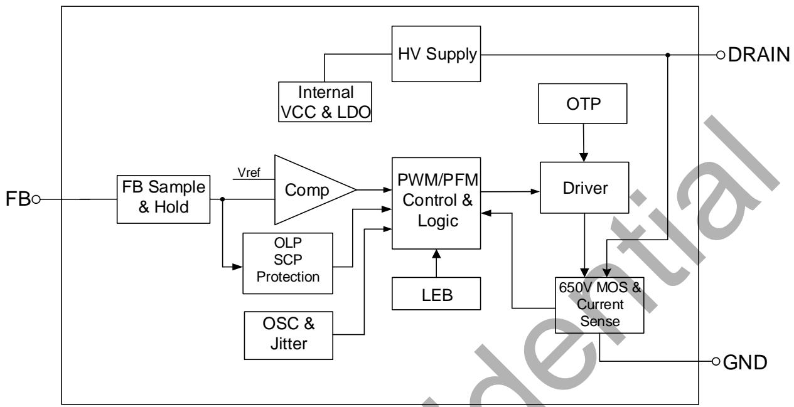

图4.BP85956D内部框图

## 功能描述

BP85956D是一款高压输入具有12V恒压输出特性的驱动芯片，采用多模式控制和环路补偿技术，无需外部补偿电路。芯片无需外部VCC 电容，内部集成 650V 功率开关、高压自供电电路、电流采样电路、输出电压采样电阻，以及丰富的保护功能，只需要极少的外围器件就可实现优异的恒压输出特性。开关频率根据电感和负载自适应调整，使电源设计更加灵活。同时，具有较低的待机功耗、良好的输出电压调整率、较低的输出电压纹波和低音频噪声使得BP85956D特别适合于非隔离辅助电源应用。(注7：以下描述到的参数均为电气参数列表中的典型值，除非特别说明是最大或最小值)

## 高压启动供电

BP85956D集成了高压启动与自供电电路，无需外部VCC电容。系统上电后，母线电压上升，内部高压启动电路通过 SW 端对内部VCC 电容充电。当内置VCC 电容电压达到芯片启动阀值11V时，芯片内部控制电路开始工作。当VCC 电容电压降低到欠压保护阈值 5V 时，芯片关断内部MOSFET。芯片正常工作时，在MOSFET关断期间自供电电路通过SW 端对内置VCC 电容供电。

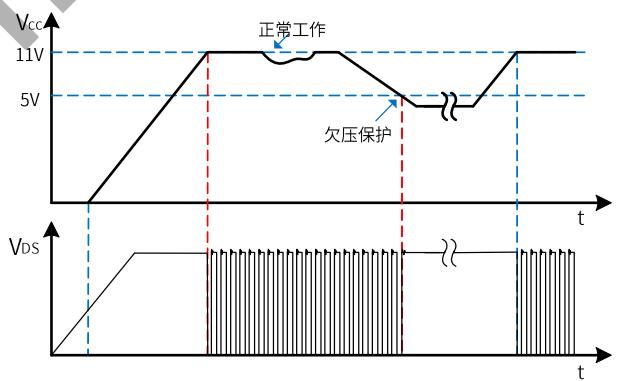

图5.高压启动与VCC欠压保护时序

## 软启动

BP85956D具有软启动功能，在软启动过程中，MOSFET峰值电流(限流点)逐渐增加。由于启动时输出电压一般较低，MOSFET关断期间输出电压对电感的去磁较少,电感电流进入深度连续模式(CCM)，使得续流二极管的反向恢复电流较大。续流二极管反向恢复电流会通过MOSFET并产生损耗，过大的电流尖峰还可能会导致MOSFET损坏。软启动电路通过控制启动过程中MOSFET峰值电流逐渐增加，可以有效降低二极管的反向恢复电流，降低MOSFET电流应力。由保护电路触发的重启也会经历一次软启动过程。软启动过程如图6所示，起始限流值为50%最大限流值，32个开关周期(Ts)后增加到75%最大限流值，再持续32个开关周期后结束软启动，限流值变为最大值。

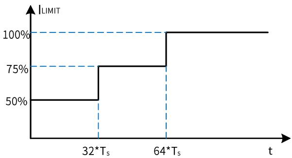

图6.软启动过程

## 输出电压采样

BP85956D通过FB引脚采样输出电压，经过反馈二极管到达FB引脚，FB电压经内部电阻分压后与内部基准电压进行运算实现恒压控制。输出电压采样仅在续流状态3us时进行,电感设计时建议保证续流时间大于7us,以防止无法正确采样输出电压导致工作异常。

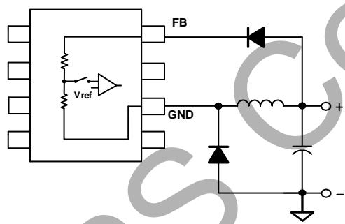

图7．输出电压采样示意图

## 多模式控制

BP85956D采用PWM/PFM多模式控制技术，能有效降低系统待机功耗，提高平均效率，并减小系统工作在轻载时的噪声。电感峰值电流控制模式，具有较快的动态响应速度。如图8所示，重载条件下，芯片工作在PFM模式，MOSFET 限流点（电感峰值电流）保持最大值ILIMIT\_MAx不变,开关频率随负载增加而升高,最高为fs\_MAX(45kHz)。随着负载减小，开关频率降低，达到22kHz后芯片进入PWM 工作模式。PWM 模式下开关频率保持22kHz不变，MOSFET限流点随负载减小而降低，直到最低限流点ILIMIT\_MIN。轻载条件下再次进入PFM模式，MOSFET限流点保持ILIMIT\_MIN不变，开关频率随负载减小继续降低，直到空载条件下，开关频率降低到最小值fs\_MIN(O.5kHz)。轻载和空载条件下，较小的电感峰值电流在磁芯中产生的磁通密度也相应减小，因此能有效抑制音频噪声。

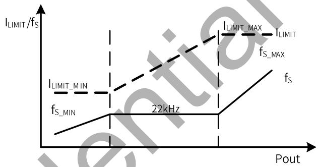

图8.控制模式

## 电流检测

BP85956D内部集成电流采样电路，无需外置电流采样电阻，对MOSFET电流逐周期限制。当一个开关周期开始时，控制电路开通MOSFET，漏极电流上升，当电流上升达到内部限制值时，控制电路关断MOSFET，直到下一个开关周期开始。内置前沿消隐(Leading EdgeBlanking)时间，tLeB可以避免由于外部电路的容性或二极管的反向恢复导致MOSFET在开通瞬间出现的电流尖峰误触发MOSFET关断。

## 自动重启

当外部故障(输出短路、过压、过载）触发相应的保护，控制电路关断MOSFET，系统停止工作。BP85956D 内部的自动重启电路等待tAR\_OFF (0.5s)时间后重新启动系统,如果启动后故障没有消除,则重新触发相应的保护。每次重启都会经历软启动过程。

## 短路保护/过载保护(SCP/OLP)

BP85956D内部控制电路通过FB引脚检测输出短路或过载故障。如图9所示，当FB电压低于VFB\_sc(2.3V)且保持 256 个开关周期，则触发短路保护(SCP)并进入自动重启程序。将FB引脚短路到GND或悬空也可以触发该保护。如果芯片检测到FB 电压低于VFB\_OLP(6.4V)且持续1024个开关周期，则触发过载保护(OLP)并进入自动重启程序。

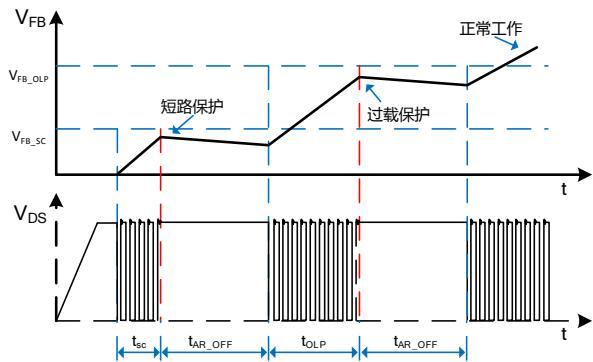

图9.短路保护、过载保护工作模式

## 输出过压保护 (OVP)

BP85956D 内部控制电路通过FB引脚检测输出过压故障。当FB电压连续3个开关周期高于VFB\_ovP(15.5V)时，触发输出过压保护，芯片进入自动重启程序。

## 过温保护 (OTP)

BP85956D内置了过温保护电路。当结温达到过温保护阈值 ToTp(145C)时，芯片会停止工作，MOSFET关断，直到结温下降到TOTP-THYST时,芯片重新启动。THYST(40C)为温度迟滞，较大的温度迟滞有利于把系统整体温度控制在较低水平。

## 应用指南

## 输出电感计算 (Buck 拓扑)

BP85956D 可工作于CCM 和 DCM工作模式，取决于额定输出电流和输出电感感量。当Buck 变换器输出电流louT>0.5\*ILIMIT\_MAX时，电感需要工作于CCM才能满足负载电流要求；当 $\mathsf { l o u r } { < } 0 . 5 ^ { \star } \mathsf { l } _ { \mathsf { L I M I T \_ M A X } }$ 时，DCM和CCM都可以满足输出负载电流要求，工作模式取决于电感的感量大小。电感感量越大，带载能力越强，因为需要更多圈数，体积也会更大，成本相对高，动态响应较慢，CCM下开关损耗大。小感量电感可以减小尺寸、降低价格以及改善系统动态响应，CCM下开关损耗小，但同时会增大电感的峰值电流和输出纹波电压，峰值带载能力也较小。通常，在满足最大输出电流的前提下，尽量选取小电感量。实际选择电感时，通常根据输入输出规格，计算出能满足输出电流的最小电感值，然后从电感供应商的选型手册中选取大一档的标准值电感。因此，$\mathsf { l o u r } > 0 . 5 ^ { \star } | _ { \mathsf { L I M I T \_ M A X } }$ 时按照CCM 计算电感量，louT<0.5\*ILIMIT\_MAX时按照DCM 计算电感量。

CCM 模式下，如图10所示，根据输入输出电压、系统开关频率、满载输出电流以及芯片最大限流值计算最小电感值：

$$
L _ {M I N} = \frac {(V _ {O U T} + V _ {D i o d e}) * (V _ {I N} - V _ {D S} - V _ {O U T})}{(V _ {I N} - V _ {D S} + V _ {D i o d e}) * f _ {S} * \Delta I _ {L}}
$$

其中，VIN 输入直流母线电压

VouT 输出电压

louT输出电流

Vpiode续流二极管压降

VDs开关管 ton时间内平均压降

fs开关频率

ton开关管开通时间

toFF开关管关断时间

ILIMIT\_MAX芯片最大限流值

$$
\Delta I _ {L} = 2 * (I _ {L I M I T \_ M A X} - I _ {O U T})
$$

$$
V _ {D S} = I _ {O U T} * R _ {d s (O N)}
$$

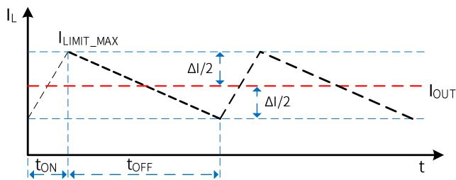

图10.CCM模式下的电感电流

电感电流有效值为：

$$
I _ {R M S} = \sqrt {I _ {L I M I T \_ M A X} ^ {2} - I _ {L I M I T _ {M A X}} * \Delta I _ {L} + \frac {\Delta I _ {L} ^ {2}}{3}}
$$

DCM 模式下(如图11所示)，根据输入/输出电压、系统开关频率、满载输出电流以及芯片最大限流值计算最小电感值：

$$
L _ {M I N} = \frac {2 * I _ {O U T} * (V _ {O U T} + V _ {D i o d e}) * (V _ {I N} - V _ {D S} - V _ {O U T})}{(V _ {I N} - V _ {D S} + V _ {D i o d e}) * f _ {S} * I _ {L I M I T \_ M A X} ^ {2}}
$$

其中，

$$
V _ {D S} = \frac {1}{2} * I _ {L I M I T \_ M A X} * R _ {d s (O N)}
$$

电感电流有效值为：

$$
I _ {R M S} = I _ {L I M I T \_ M A X} * \sqrt {\frac {t _ {O N} + t _ {O F F}}{3} * f _ {S}}
$$

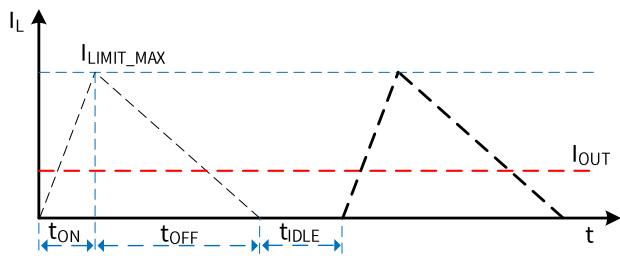

图11.DCM模式下的电感电流

一般来说，VIN是一个范围，通常选择最大输入直流母线电压代入计算公式，或者也可以分别计算最高和最低母线电压对应的电感量，最后取两者中较大者。上述两个电感表达式计算出来的都是输出额定电流所需的最小电感量，设计中需要考虑实际电感的精度，通常取计算值的1.1倍以保证批量生产时能满足最低电感量的要求。表达式中ILIMIT\_MAX 应该取芯片最大限流值的下限。

为了降低待机功耗，减小输出端需要的假负载，BP85956D通过多模式控制降低了空载下的限流点和开关频率。为了使空载时电感电流可控，电感量需要足够大以至于在MOSFET最小导通时间内电流峰值不超过芯片最低限流值。即

$$
L \geq \frac {t _ {L E B} * (V _ {I N \_ M A X} - V _ {O U T})}{I _ {L I M I T \_ M I N}}
$$

其中，tLEB 为前沿消隐时间，ILIMIT MIN为芯片的最低限流值。如图12所示，电感量小于临界值会导致tLeB时刻电感峰值电流大于芯片控制的限流点，平均输出电流过大，需要较大的假负载给电感电流提供通路，从而稳定输出电压。

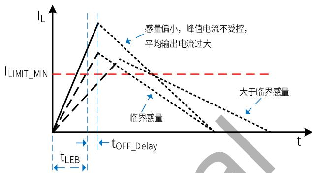

图12.空载下的电感电流

此外，所选择的电感需要保证芯片工作在最低限流点时的续流时间大于7us，以保证芯片可以正常反馈采样，即

$$
L \geq \frac {V _ {O U T} * 7 u s}{I _ {L I M I T \_ M I N}}
$$

因此，通常最终的电感值需要同时满足以上三个条件。待机要求不高的应用只需要满足额定输出电流的最小电感即可。确定电感值后需要确认电感的有效值电流是否满足上述计算值，同时还需要保证电感磁芯在芯片最大限流值ILIMIT\_MAX不饱和，供应商的选型手册中一般会给出电感的有效值电流和饱和电流。

## 续流二极管的选择

续流二极管建议使用trr≤35ns的超快恢复二极管，不能使用普通快恢复二极管或者慢管。续流二极管需要能承受雷击条件下的输入电压，因此一般选取 600V 或以上的耐压，额定电流一般选取输出电流的3\~4倍。建议选择ES1J。

## 反馈二极管的选择

在MOSFET关断时，反馈二极管导通向FB引脚反馈输出电压信息。在MOSFET导通时，反馈二极管截止防止电流从GND引脚流入芯片。反馈二极管建议使用600V或以上耐压的超快恢复二极管，例如ES1J等。

## 输入电容的选择

输入滤波电容对工频电压纹波、传导 EMI、以及电源抵抗Surge的能力都起到关键的作用。电容量的选择要保证直流母线电压不能过低(通常不要低于70V),因此电容量取决于输出功率和电源效率。全电压85\~265VAC输入时，如果使用全波整流，一般取≥3uF/W;对于半波整流，电容量一般取≥6uF/W。单高压176\~265VAC 输入时，在满足EMI和 Surge的前提下容量可以减半。

## 输出电容的选择

输出电容的作用是滤除电感电流中的交流成分，提供稳定的直流电压给负载，一般根据输出电压纹波要求来选取合适的电容。当输出电流恒定时，输出纹波主要由输出电容的 ESR 以及容量决定。

$$
\Delta V _ {O U T} = \Delta V _ {E S R} + \Delta V _ {C}
$$

CCM模式下，由容性产生的纹波电压为：

$$
\Delta V _ {C} = \frac {\Delta I _ {L}}{8 * C _ {O U T} * f _ {S}}
$$

DCM模式下，由容性产生的纹波电压为：

$$
\Delta V _ {C} = \frac {I _ {O U T} * (I _ {L I M I T \_ M A X} - I _ {O U T}) ^ {2}}{C _ {O U T} * f _ {S} * I _ {L I M I T \_ M A X} ^ {2}}
$$

实际应用中,为了得到较小的ESR,电容量相对比较大，由容量产生的输出电压纹波很小，几乎可以忽略，因此电压纹波主要由电容的ESR产生：

$$
\Delta V _ {E S R} = \Delta I _ {L} * E S R \quad (\text { CCM })
$$

$$
\Delta V _ {E S R} = I _ {\text { LIMIT\_MAX }} * E S R \quad (\mathrm{DCM})
$$

## 假负载计算

当输出空载时，需要一个假负载为电感电流提供回路,从而稳定输出电压，电感的平均电流即为假负载的电流。

$$
I _ {A V G} = \frac {1}{2} * I _ {L} * (T _ {O N} + T _ {O F F}) * f _ {S \_ M I N}
$$

其中，I为空载时电感峰值电流：

$$
I _ {L} = \frac {V _ {I N \_ M A X}}{L} * t _ {D e l a y} + I _ {L I M I T \_ M I N}
$$

ILIMIT\_MIN为芯片的最低限流值，fs\_MIN为芯片最低频率，ToN、ToFF分别为空载时MOSFET开通和关断时间：

$$
T _ {O N} = \frac {L * I _ {L}}{V _ {I N \_ M A X}}
$$

$$
T _ {O F F} = \frac {L * I _ {L}}{V _ {O U T} + V _ {D i o d e}}
$$

$$
R _ {L} = \frac {V _ {O U T}}{I _ {A V G}}
$$

以上计算未考虑芯片自供电电流通过假负载，实际需要的假负载电流稍大，一般为1\~3mA左右。

## Buck-Boost应用设计

BP85956D 也可以应用于 Buck-Boost 拓扑中，实现负电压输出，应用电路如图2所示，芯片的基本功能与Buck拓扑类似。由于电感只在MOSFET关断期间对输出端提供能量，相同的输出功率需要较大感量的电感。

CCM 模式下，通过以下表达式计算最小电感值：

$$
\begin{array}{l} L _ {M I N} \\ = \frac {0 . 5 * V _ {O U T} ^ {\prime} * V _ {I N} ^ {\prime 2} * \frac {1}{f _ {S}}}{\left(V _ {I N} ^ {\prime} + V _ {O U T} ^ {\prime}\right) * \left[ V _ {I N} ^ {\prime} * I _ {L I M I T \_ M A X} - \left(V _ {I N} ^ {\prime} + V _ {O U T} ^ {\prime}\right) * I _ {O U T} \right]} \\ \end{array}
$$

其中

$$
V _ {I N} ^ {\prime} = V _ {I N} - V _ {D S}
$$

$$
V _ {O U T} ^ {\prime} = V _ {O U T} + V _ {D i o d e}
$$

$$
V _ {D S} = \frac {V _ {I N} ^ {\prime} + V _ {O U T} ^ {\prime}}{V _ {I N} ^ {\prime}} * I _ {O U T} * R _ {d s (O N)}
$$

VIN 输入直流母线电压

VouT 输出电压

louT输出电流

VDiode续流二极管压降

VDs开关管toN时间内平均压降

ILIMIT\_MAX芯片最大限流值

电感电流有效值为：

$$
I _ {R M S} = \sqrt {I _ {L I M I T \_ M A X} ^ {2} - I _ {L I M I T _ {M A X}} * \Delta I _ {L} + \frac {\Delta I _ {L} ^ {2}}{3}}
$$

其中

$$
\Delta I _ {L} = 2 * (I _ {L I M I T _ {M A X}} - \frac {I _ {O U T}}{V _ {I N} ^ {\prime}} * (V _ {I N} ^ {\prime} + V _ {O U T} ^ {\prime}))
$$

DCM 模式下，通过以下表达式计算最小电感值：

$$
L _ {M I N} = \frac {2 * (V _ {O U T} + V _ {D i o d e}) * I _ {O U T}}{I _ {L I M I T \_ M A X} ^ {2} * f _ {S}}
$$

电感电流有效值为：

$$
I _ {R M S} = I _ {L I M I T \_ M A X} * \sqrt {\frac {t _ {O N} + t _ {O F F}}{3} * f _ {S}}
$$

空载条件对最小感量的限制与Buck拓扑基本一致。

由于电感只在MOSFET关断期间对输出端提供能量，因此输出滤波电容纹波电流比Buck 拓扑大，电压纹波主要由电容的ESR产生：

$$
\Delta V _ {E S R} = I _ {L I M I T \_ M A X} * E S R \quad (\text {适应于DCM / CCM})
$$

## PCB Layout指南

在设计 BP85956D应用PCB 时，请遵循以下建议：

1）FB 应避免铺铜，且远离母线电压、母线地和输出电感等高压或电压动点，以避免干扰。  
2）GND 起到散热作用，可以在PCB上铺铜散热，但是GND为电压动点 (相对母线地)，在满足散热的条件下铺铜面积应尽量小以减少噪声辐射。同时GND 需要远离交流输入端，以避免耦合产生 EMI问题。

3） SW内部MOSFET的漏极，接输入直流母线，为电压静点，可以铺铜散热。同时建议SW引脚与其他引脚的走线距离大于2mm。  
尽量减小功率环路面积以避免EMI干扰并提高系统可靠性。以BUCK为例，建议缩小输入电容、内置MOSFET、电感、输出电容组成的励磁回路，以及电感、输出电容、续流二极管组成的续流回路面积。反馈回路面积与走线长度也应减小以提高可靠性。  
5）输出电感可能产生电磁干扰，建议远离芯片 FB 引脚，同时远离交流输入端以避免EMI问题。  
6）建议功率回路的走线宽而短，以提高系统可靠性。例如母线地到续流二极管阳极的走线，续流二极管阳极到GND 的走线，输出电容地到续流二极管阳极的走线等。  
反馈回路面积与走线长度也应尽量减小以提高可靠性。

封装信息  
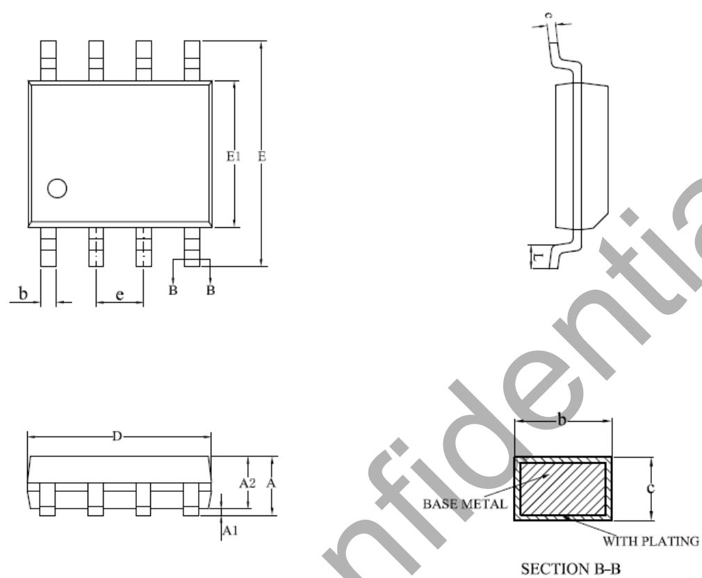

<table><tr><td rowspan="2">SYMBOL</td><td colspan="3">MILLIMETER</td></tr><tr><td>MIN</td><td>NOM</td><td>MAX</td></tr><tr><td>A</td><td>1.30</td><td>—</td><td>1.80</td></tr><tr><td>A1</td><td>0.10</td><td>—</td><td>0.25</td></tr><tr><td>A2</td><td>1.25</td><td>1.40</td><td>1.65</td></tr><tr><td>b</td><td>0.33</td><td>—</td><td>0.51</td></tr><tr><td>c</td><td>0.17</td><td>—</td><td>0.25</td></tr><tr><td>D</td><td>4.70</td><td>4.90</td><td>5.10</td></tr><tr><td>E</td><td>5.80</td><td>6.00</td><td>6.20</td></tr><tr><td>E1</td><td>3.70</td><td>3.90</td><td>4.10</td></tr><tr><td>e</td><td colspan="3">1.27BSC</td></tr><tr><td>L</td><td>0.40</td><td>—</td><td>1.00</td></tr></table>

SOP-8 封装外形尺寸

版本信息

<table><tr><td>版本</td><td>日期</td><td>记录</td></tr><tr><td>Rev. 1.0</td><td>11/2022</td><td>首次发布</td></tr></table>

## 免责声明

晶丰明源尽力确保本产品规格书内容的准确和可靠，但是保留在没有通知的情况下，修改规格书内容的权利。

本产品规格书未包含任何针对晶丰明源或第三方所有的知识产权的授权。针对本产品规格书所记载的信息，晶丰明源不做任何明示或暗示的保证，包括但不限于对规格书内容的准确性、商业上的适销性、特定目的的适用性或者不侵犯晶丰明源或任何第三人知识产权做任何明示或暗示保证，晶丰明源也不就因本规格书本身及其使用有关的偶然或必然损失承担任何责任。
