## BP85956P&PN8034M对比测试 (12V/0.3A@85\~264Vac)(Pin to Pin)

上海晶丰明源半导体股份有限公司

Shanghai Bright Power Semiconductor Co., Ltd.

陈耀兵

2022 11 14

## 电气特性对比

<table><tr><td></td><td>BP85956P</td><td>PN8034M</td></tr><tr><td>开关频率</td><td>45KHz</td><td>45KHz(实测)</td></tr><tr><td>Mosfet BV</td><td>650V</td><td>650V</td></tr><tr><td> $R_{DS\_ON}$ </td><td>11Ω</td><td>13.5Ω</td></tr><tr><td>限流点</td><td>600mA</td><td>590mA</td></tr><tr><td>软启动</td><td>有</td><td>有(限制Toffmin降低启动阶段开关频率)</td></tr><tr><td>输出过压保护</td><td>有</td><td>?</td></tr><tr><td>输出短路保护</td><td>有</td><td>有</td></tr><tr><td>输出过载保护</td><td>有</td><td>有</td></tr><tr><td>反馈开路保护</td><td>有</td><td>?</td></tr><tr><td>过温保护</td><td>有</td><td>有</td></tr><tr><td>封装</td><td>DIP7</td><td>DIP7</td></tr></table>

## BP85956P

PWM/PFM  
3级限流点软启动，降低MOS电流应力

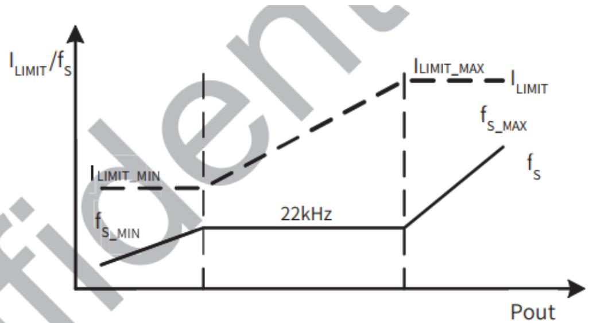

## PN8034M

PFM  
Toffmin 动阶段的开关频率，MOS电流 应力较大

## BP85956P典型应用电路

无需外部VDD电容

## PN8034M典型应用电路

需外部VDD电容

◼ 为了满足输入85VAC\~265VAC工作电压范围，本报告均基于将两个输入电解电容EC091和EC092更改为10uF/400V后进行测试  
◼ PN8034M在85VAC输入时无法在0.3A负载启机，只能在0.23A负载下启机  
◼ 为了Pin to Pin替换PN8034，所以换BP85956P后未去掉VDD电容EC093（4.7uF/50V)

电源规格： 85\~265Vac输入，12V/0.3A输出 (PN8034M无法在0.3A负载启机，只能在0.23A以下带载启动)

<table><tr><td colspan="2"></td><td>BP85956P</td><td>PN8034M</td><td></td></tr><tr><td colspan="2">待机功耗@230Vac</td><td>152mW</td><td>150mW</td><td>未断开板上后端负载</td></tr><tr><td rowspan="2">效率</td><td>115Vac</td><td>73.8%</td><td>71.83%</td><td>满载效率</td></tr><tr><td>230Vac</td><td>76.02%</td><td>73.33%</td><td>满载效率</td></tr><tr><td rowspan="2">输出电压纹波</td><td>85Vac</td><td>64mV</td><td>42.4mV</td><td>满载</td></tr><tr><td>265Vac</td><td>38mV</td><td>42.7mV</td><td>满载</td></tr><tr><td rowspan="2">动态负载性能</td><td>50%-100%</td><td> $170mV_{PK\_PK}$ </td><td> $112mV_{PK\_PK}$ </td><td>@265Vac</td></tr><tr><td>10%-90%</td><td> $320mV_{PK\_PK}$ </td><td> $228mV_{PK\_PK}$ </td><td>@265Vac</td></tr><tr><td rowspan="4">MOSFET应力</td><td> $V_{DS}$ </td><td>400V</td><td>400V</td><td>@265Vac,满载启机</td></tr><tr><td> $I_{DS}$ </td><td>1.1A</td><td>1.47A</td><td>@265Vac,满载启机</td></tr><tr><td> $V_{DS}$ </td><td>400V</td><td>400V</td><td>@265Vac,输出短路</td></tr><tr><td> $I_{DS}$ </td><td>1.06A</td><td>2.12A</td><td>@265Vac,输出短路</td></tr><tr><td colspan="2">温升测试(环温40°C)</td><td>52.3°C</td><td>60.4°C</td><td>@85Vac,满载</td></tr><tr><td colspan="2">传导EMI</td><td>&gt;6dB裕量</td><td>&gt;6dB裕量</td><td></td></tr><tr><td colspan="2">Surge</td><td>Pass</td><td>Pass</td><td>共模2kV</td></tr><tr><td colspan="2">EFT群脉冲</td><td>Pass</td><td>Pass</td><td>4kV,5kHz/38kHz/100kHz</td></tr><tr><td colspan="2">ESD</td><td>Pass</td><td>Pass</td><td>15kV、20KV空气放电</td></tr></table>

待机功耗  
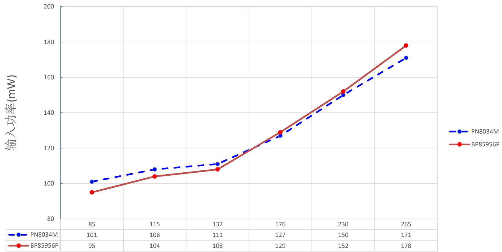

输入电压(VAC)

备注：测试时未断开板上负载

效率曲线  
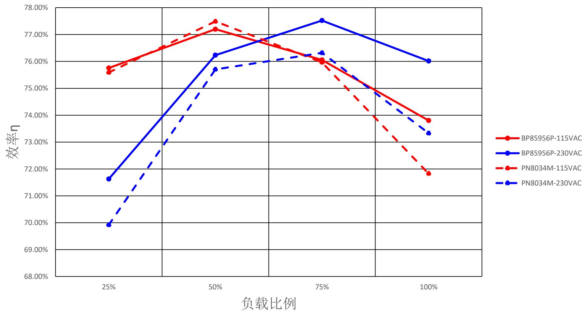

备注：测试时未断开板上负载

## 输出电压调整率

BP85956P

<table><tr><td> $V_{IN}(VAC)$ Load(%)</td><td>85</td><td>115</td><td>132</td><td>176</td><td>230</td><td>265</td><td>平均值</td><td>线调整率</td></tr><tr><td>0</td><td>12.41</td><td>12.40</td><td>12.40</td><td>12.40</td><td>12.39</td><td>12.39</td><td>12.40</td><td>0.16%</td></tr><tr><td>20%</td><td>12.16</td><td>12.15</td><td>12.15</td><td>12.14</td><td>12.14</td><td>12.14</td><td>12.15</td><td>0.21%</td></tr><tr><td>40%</td><td>12.09</td><td>12.08</td><td>12.07</td><td>12.06</td><td>12.06</td><td>12.06</td><td>12.07</td><td>0.20%</td></tr><tr><td>60%</td><td>12.05</td><td>12.03</td><td>12.03</td><td>12.02</td><td>12.01</td><td>12.01</td><td>12.02</td><td>0.34%</td></tr><tr><td>80%</td><td>12.00</td><td>12.00</td><td>11.99</td><td>11.99</td><td>11.98</td><td>11.98</td><td>11.99</td><td>0.20%</td></tr><tr><td>100%</td><td>12.01</td><td>11.99</td><td>11.99</td><td>11.97</td><td>11.96</td><td>11.95</td><td>11.98</td><td>0.45%</td></tr><tr><td>平均值</td><td>12.12</td><td>12.11</td><td>12.10</td><td>12.10</td><td>12.09</td><td>12.09</td><td rowspan="2" colspan="2"></td></tr><tr><td>负载调整率</td><td>3.40%</td><td>3.39%</td><td>3.43%</td><td>3.54%</td><td>3.58%</td><td>3.64%</td></tr></table>

计算方法：调整率=100%\*(最大值-最小值)/平均值  
测试条件：未断开板上负载

PN8034M

<table><tr><td> $V_{IN}(VAC)$ Load(%)</td><td>85</td><td>115</td><td>132</td><td>176</td><td>230</td><td>265</td><td>平均值</td><td>线调整率</td></tr><tr><td>0</td><td>12.506</td><td>12.498</td><td>12.493</td><td>12.484</td><td>12.476</td><td>12.47</td><td>12.49</td><td>0.29%</td></tr><tr><td>20%</td><td>12.287</td><td>12.285</td><td>12.283</td><td>12.282</td><td>12.278</td><td>12.273</td><td>12.28</td><td>0.11%</td></tr><tr><td>40%</td><td>12.23</td><td>12.232</td><td>12.233</td><td>12.232</td><td>12.233</td><td>12.233</td><td>12.23</td><td>0.02%</td></tr><tr><td>60%</td><td>12.218</td><td>12.216</td><td>12.215</td><td>12.212</td><td>12.209</td><td>12.205</td><td>12.21</td><td>0.11%</td></tr><tr><td>80%</td><td>12.194</td><td>12.2</td><td>12.201</td><td>12.203</td><td>12.203</td><td>12.207</td><td>12.20</td><td>0.11%</td></tr><tr><td>100%</td><td>12.206</td><td>12.205</td><td>12.203</td><td>12.2</td><td>12.197</td><td>12.191</td><td>12.20</td><td>0.12%</td></tr><tr><td>平均值</td><td>12.27</td><td>12.27</td><td>12.27</td><td>12.27</td><td>12.27</td><td>12.26</td><td rowspan="2" colspan="2"></td></tr><tr><td>负载调整率</td><td>2.54%</td><td>2.43%</td><td>2.38%</td><td>2.31%</td><td>2.27%</td><td>2.28%</td></tr></table>

计算方法：调整率=100%\*(最大值-最小值)/平均值  
测试条件：未断开板上负载

## OLP

BP85956P

<table><tr><td> $I_{OUT}(A)$  $V_{IN}(VAC)$ </td><td>85</td><td>264</td></tr><tr><td>0.319</td><td>12.012</td><td>11.957</td></tr><tr><td>0.348</td><td>11.956</td><td>11.953</td></tr><tr><td>0.377</td><td>9.62</td><td>11.946</td></tr><tr><td>0.406</td><td>6.65</td><td>11.607</td></tr><tr><td>0.435</td><td>OLP</td><td>8.82</td></tr><tr><td>0.464</td><td></td><td>OLP</td></tr><tr><td>0.493</td><td></td><td></td></tr></table>

PN8034M

<table><tr><td> $I_{OUT}(A)$  $V_{IN}(VAC)$ </td><td>85</td><td>264</td></tr><tr><td>0.319</td><td>12.225</td><td>12.218</td></tr><tr><td>0.348</td><td>10.958</td><td>12.216</td></tr><tr><td>0.377</td><td>OLP</td><td>12.217</td></tr><tr><td>0.406</td><td></td><td>12.223</td></tr><tr><td>0.435</td><td></td><td>11.83</td></tr><tr><td>0.464</td><td></td><td>9.89</td></tr><tr><td>0.493</td><td></td><td>OLP</td></tr></table>

## 输出电压纹波

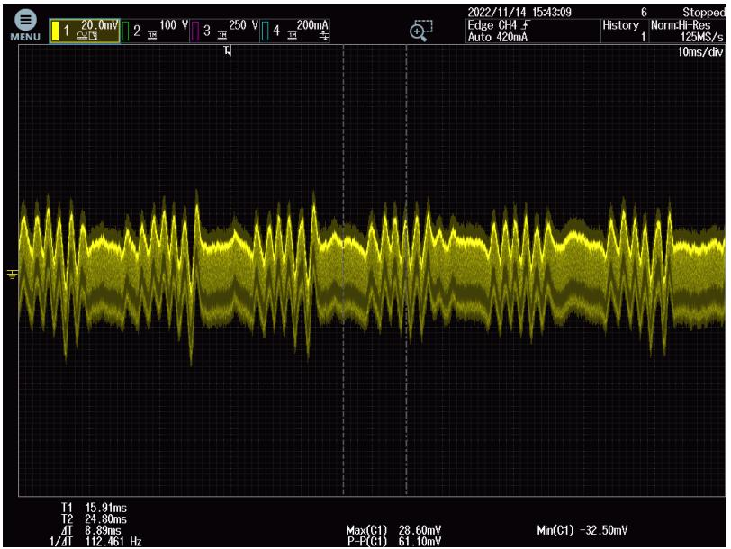

85 VAC  
  
Test Condition:  
➢ Full Load

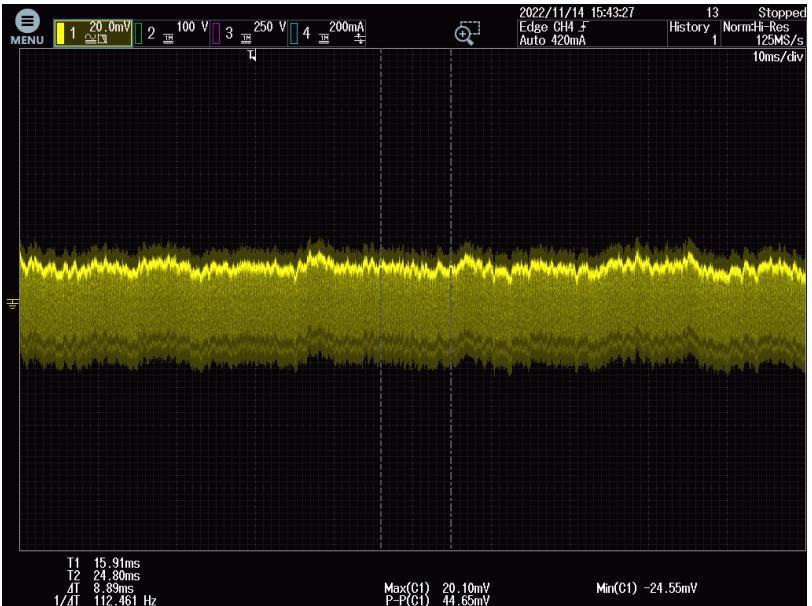

265 VAC  
  
Test Condition:  
➢ Full Load

85 VAC  

  
Test Condition:  
➢ Full Load

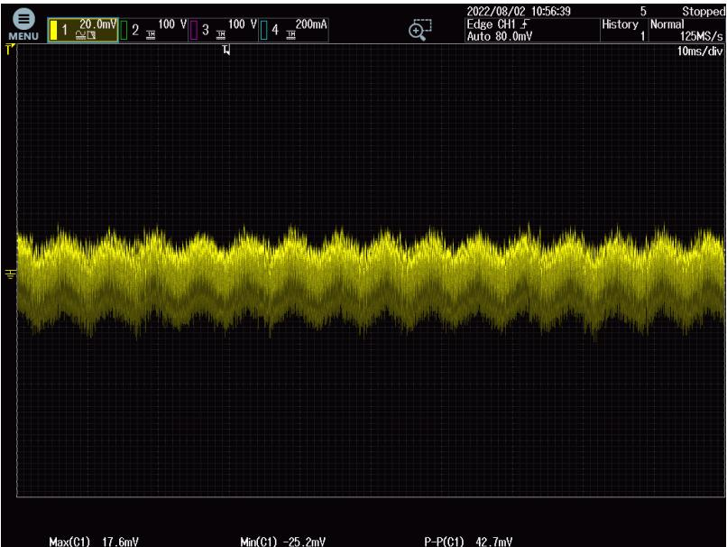

265 VAC  
  
Test Condition:  
➢ Full Load

## (50%-100%)

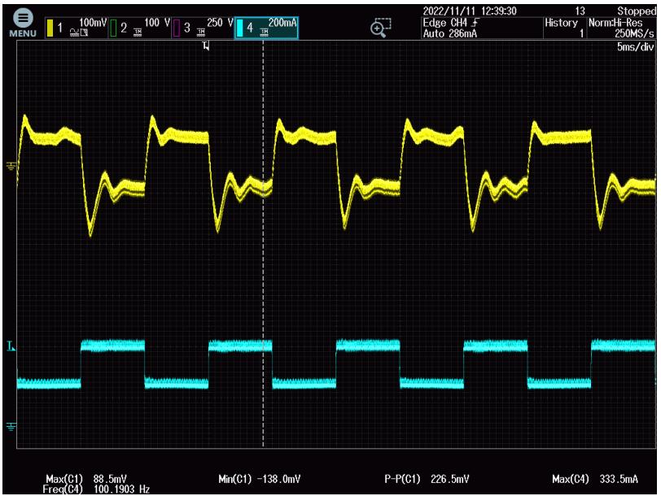

85 VAC

CH1 $\mathsf { V } _ { \mathsf { O U T } }$ $V _ { \mathsf { P K - P K } } = 2 2 6 . 5 ~ \mathsf { m V }$  
CH4 IOUT

## Test Condition:

➢ 0.15 A-0.3 A-0.15 A  
➢ Slew Rate: 0.5 A/μS  
➢ Frequency: 100 Hz

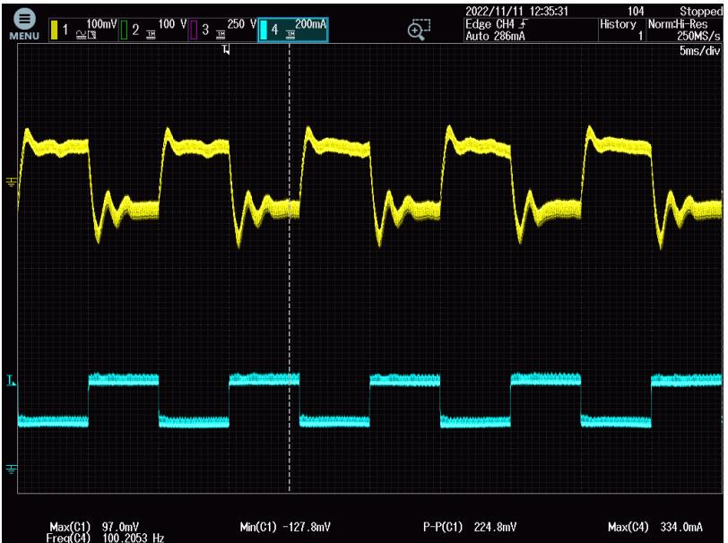

265 VAC

CH1 VOUT $V _ { \mathsf { P K - P K } } = 2 2 4 . 8 ~ \mathsf { m V }$  
CH4 IOUT

## Test Condition:

➢ 0.15 A-0.3 A-0.15 A  
➢ Slew Rate: 0.5 A/μS  
➢ Frequency: 100 Hz

85 VAC

CH1 $\mathsf { V } _ { \mathsf { O U T } }$ $V _ { \mathsf { P K - P K } } = \pm 1 1 6 \mathsf { m V }$  
$\mathsf { C H 4 } \mathsf { I } _ { \mathsf { O U T } }$

## Test Condition:

➢ 0.15 A-0.3 A-0.15 A  
➢ Slew Rate: 0.5 A/μS  
➢ Frequency: 100 Hz

265 VAC

CH1 VOUT VPK-PK= 112 mV  
CH4 IOUT

## Test Condition:

➢ 0.15 A-0.3 A-0.15 A  
➢ Slew Rate: 0.5 A/μS  
➢ Frequency: 100 Hz

## (10%-90%)

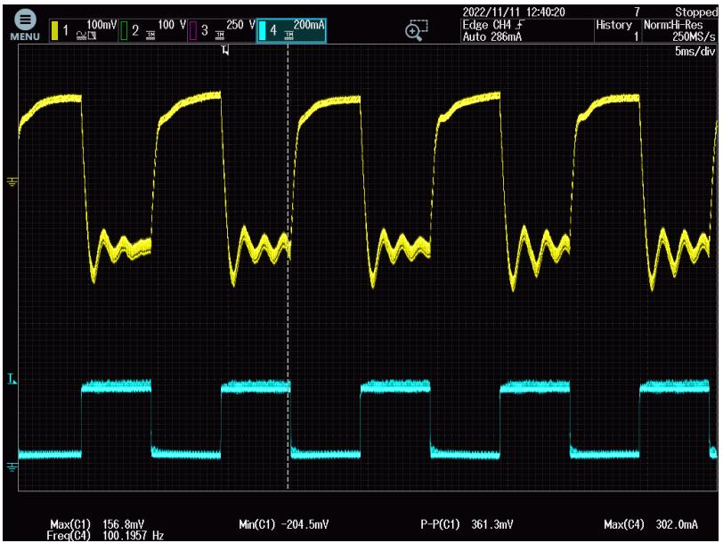

85 VAC

CH1 VOUT $\mathsf { V } _ { \mathsf { O U T } }$ $\mathsf { V } _ { \mathsf { P K - P K } } { = } 3 6 1 . 3 \mathsf { m V }$  
CH4 IOUT

## Test Condition:

➢ 0.03A-0.27 A-0.03 A  
➢ Slew Rate: 0.5 A/μS  
➢ Frequency: 100 Hz

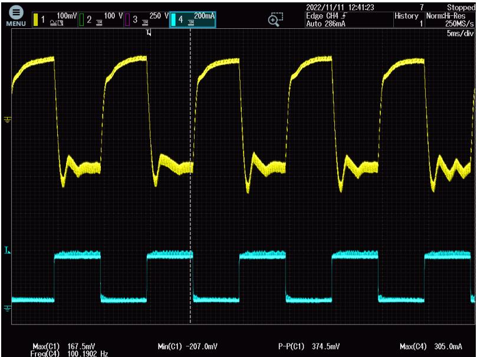

265 VAC

CH1 $\mathsf { V } _ { \mathsf { O U T } }$ $V _ { \mathsf { P K - P K } } { = } 3 7 4 . 5 \mathsf { m v }$  
CH4 IOUT

## Test Condition:

➢ 0.03A-0.27 A-0.03 A  
➢ Slew Rate: 0.5 A/μS  
➢ Frequency: 100 Hz

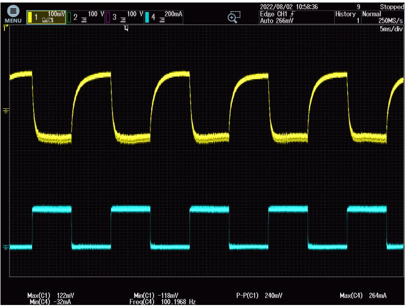

85 VAC

CH1 $\mathsf { V } _ { \mathsf { O U T } }$ $V _ { P K - P K } = 2 4 0 m v$  
$\mathsf { C H 4 } \mathsf { I } _ { \mathsf { O U T } }$

## Test Condition:

➢ 0.03A-0.27 A-0.03 A  
➢ Slew Rate: 0.5 A/μS  
➢ Frequency: 100 Hz

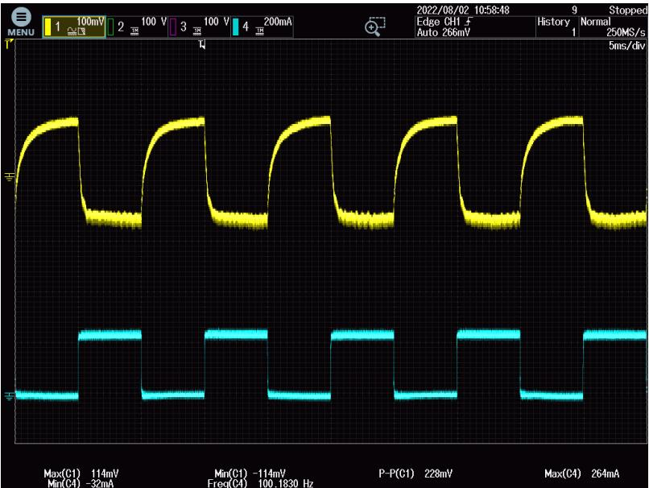

265 VAC

CH1 VOUT $V _ { \mathsf { P K - P K } } { = } 2 2 8 \mathsf { m V }$  
CH4 IOUT

## Test Condition:

➢ 0.03A-0.27 A-0.03 A  
➢ Slew Rate: 0.5 A/μS  
➢ Frequency: 100 Hz

## 输出电压开机波形

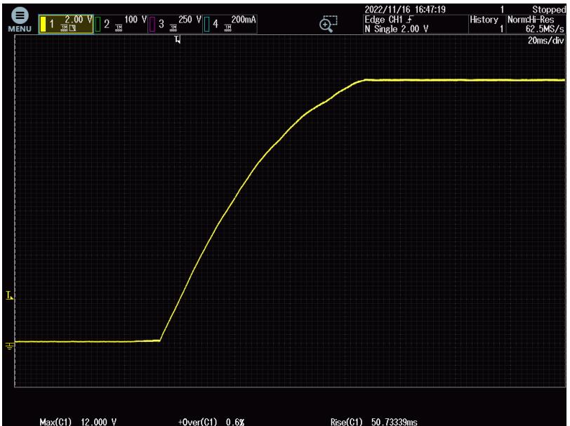

85 VAC  
  
Test Condition:  
➢ Full Load

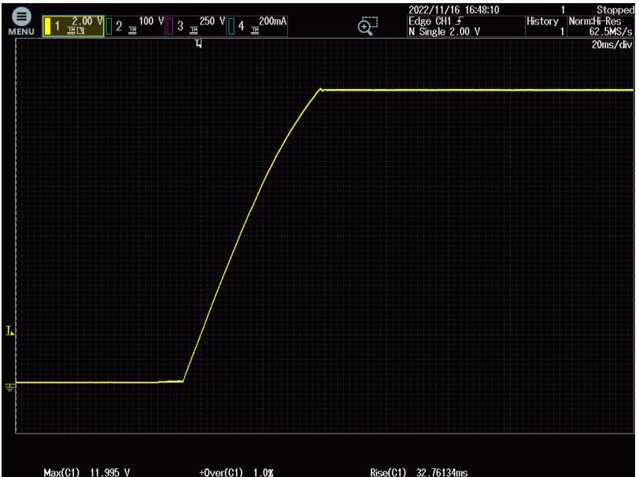

265 VAC  
  
Test Condition:  
➢ Full Load

85 VAC  

  
Test Condition:  
➢ Io=0.23A

不能满载启机  
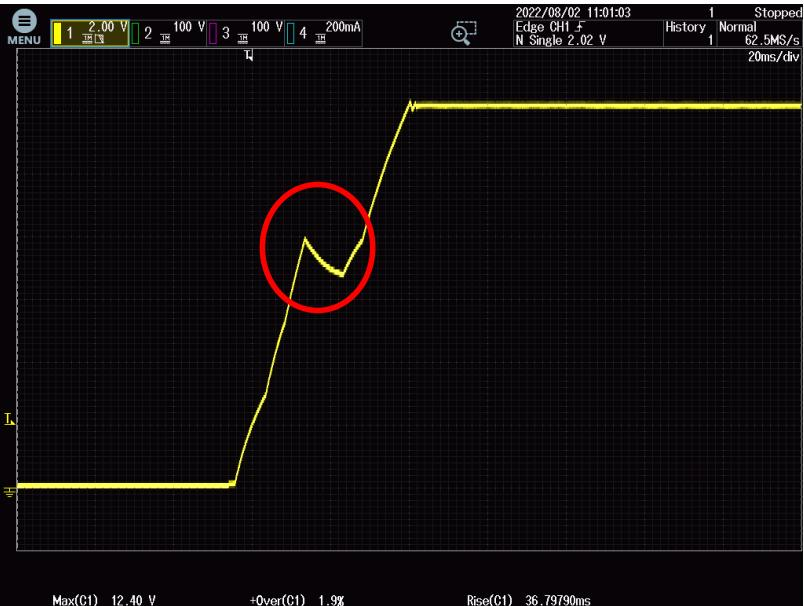

265 VAC  
  
Test Condition:  
➢ Full Load

## MOSFET

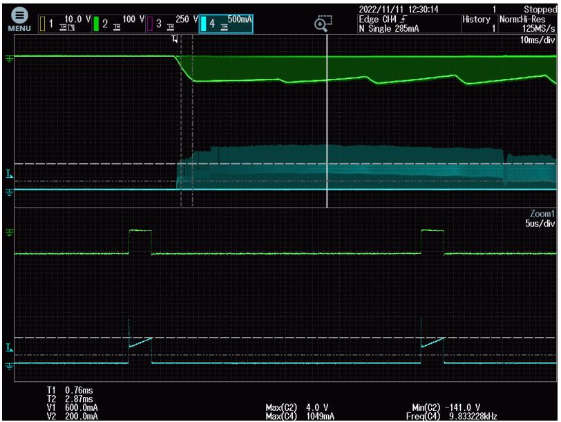

85 VAC

CH3 VDS  
CH4 IDS

$$
V _ {D S \_ M A X} = 1 4 1 \mathrm{V}
$$

$$
I _ {D S \_ M A X} = 1. 0 4 9 \mathrm{A}
$$

## Test Condition:

➢ Full Load

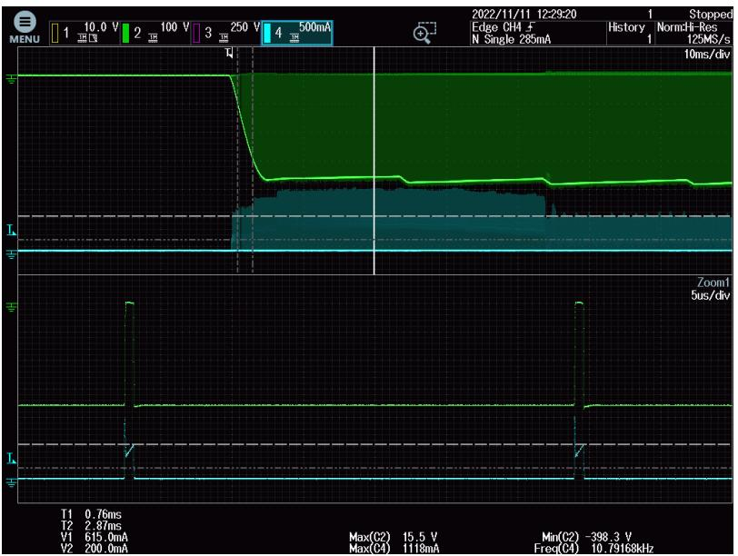

265 VAC

CH3 VDS  
CH4 IDS

$$
V _ {D S \_ M A X} = 3 9 8. 3 V
$$

$$
I _ {D S \_ M A X} = 1. 1 1 8 \mathrm{A}
$$

## Test Condition:

➢ Full Load

85 VAC  

CH3 VDS  
CH4 IDS

$$
V _ {D S \_ M A X} = 1 4 4 V
$$

$$
I _ {D S \_ M A X} = 1. 1 7 \mathrm{A}
$$

## Test Condition:

➢ Io=0.23A

## 不能满载启机

265 VAC

CH3 VDS  
CH4 IDS

$$
V _ {D S \_ M A X} = 4 0 0 V
$$

$$
I _ {D S \_ M A X} = 1. 4 7 \mathrm{A}
$$

## Test Condition:

➢ Full Load

## MOSFET

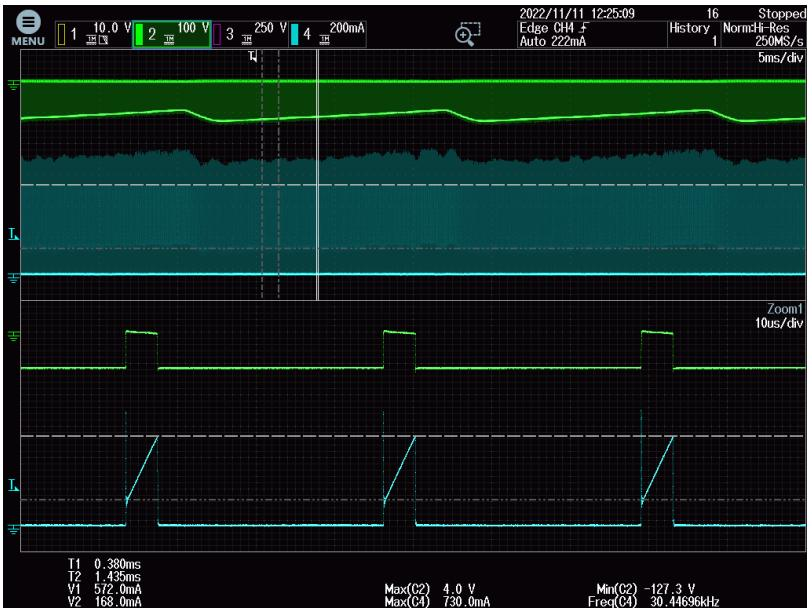

85 VAC

CH3 VDS  
CH4 IDS

$$
V _ {D S \_ M A X} = 1 2 7. 3 \mathrm{V}
$$

$$
I _ {D S \_ M A X} = 0. 7 3 \mathrm{A}
$$

## Test Condition:

➢ Full Load

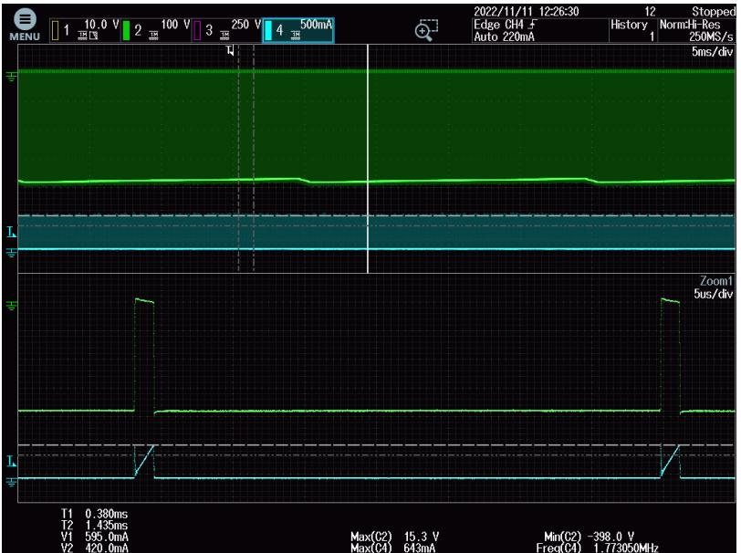

265 VAC

CH3 VDS  
CH4 IDS

$$
V _ {D S \_ M A X} = 3 9 8 \mathrm{V}
$$

$$
I _ {D S \_ M A X} = 0. 6 4 3 \mathrm{A}
$$

## Test Condition:

➢ Full Load

85 VAC  
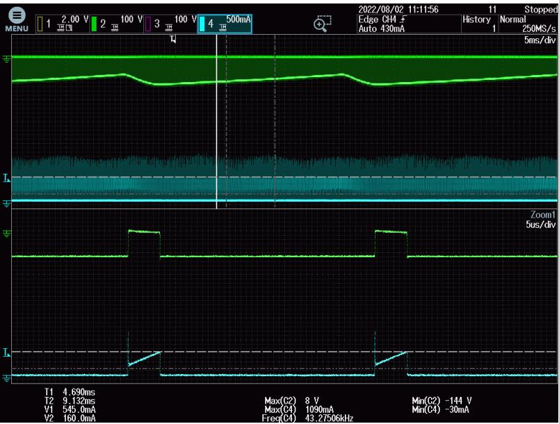

CH3 VDS  
CH4 IDS

$$
V _ {D S \_ M A X} = 1 4 4 \mathrm{V}
$$

$$
I _ {D S \_ M A X} = 1. 0 9 \mathrm{A}
$$

## Test Condition:

➢ Full Load

265 VAC

CH3 VDS  
CH4 IDS

$$
V _ {D S \_ M A X} = 4 0 0 \mathrm{V}
$$

$$
I _ {D S \_ M A X} = 1. 2 4 \mathrm{A}
$$

## Test Condition:

➢ Full Load

## 电感电流开机波形

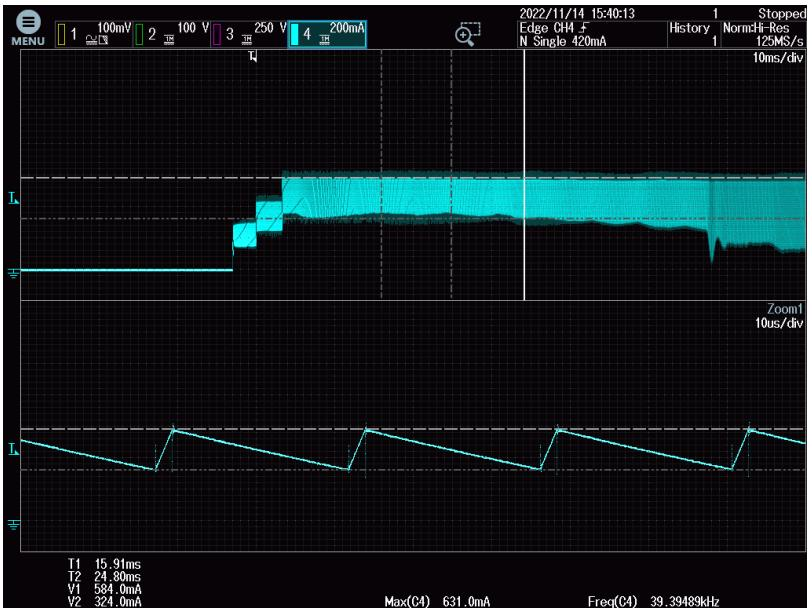

85 VAC  
  
Test Condition:  
➢ Full Load

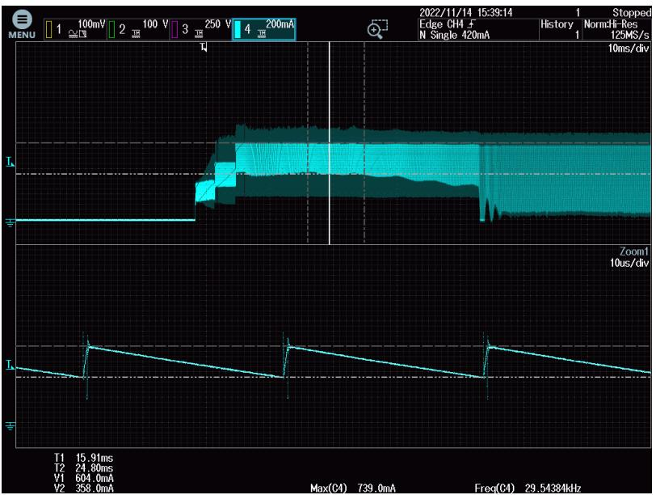

265 VAC  
  
Test Condition:  
➢ Full Load

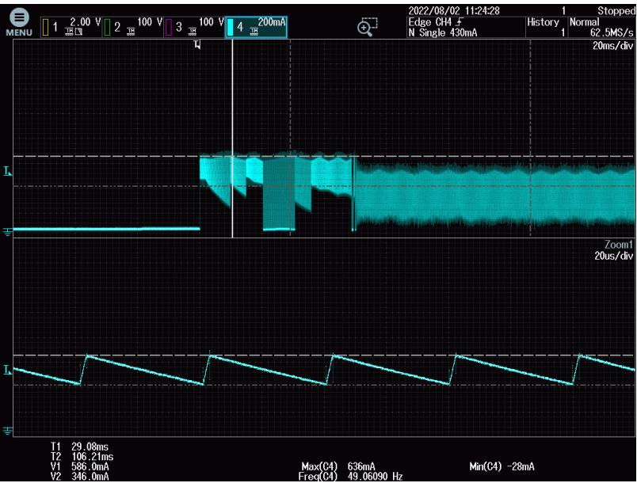

85 VAC  
  
Test Condition:  
➢ Io=0.23A

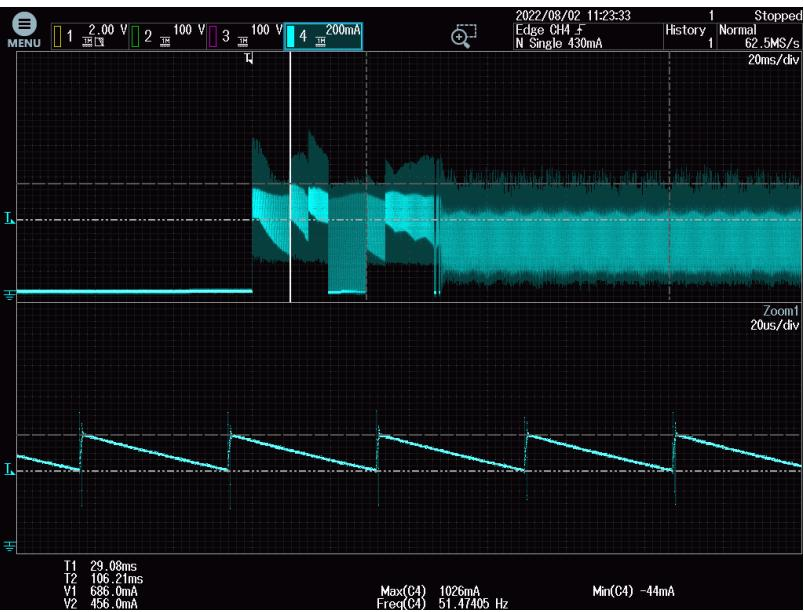

265 VAC  
  
Test Condition:  
➢ Full Load

## 电感电流稳态波形

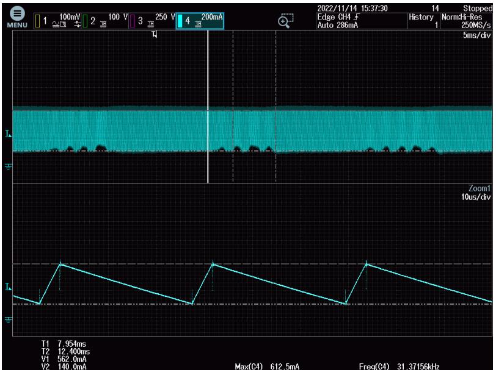

85 VAC  
  
Test Condition:  
➢ Full Load

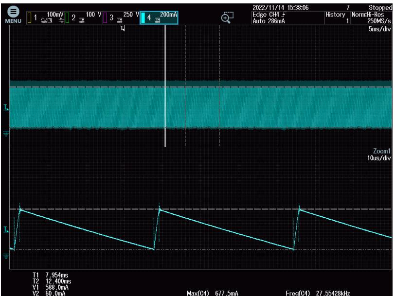

265 VAC  
  
Test Condition:  
➢ Full Load

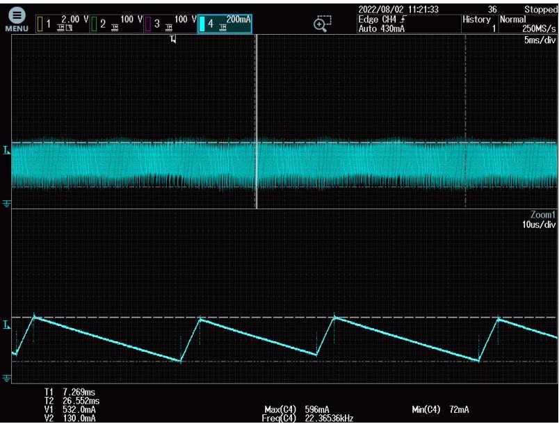

85 VAC  
  
Test Condition:  
➢ Full Load

265 VAC  
  
Test Condition:  
➢ Full Load

## MOSFET

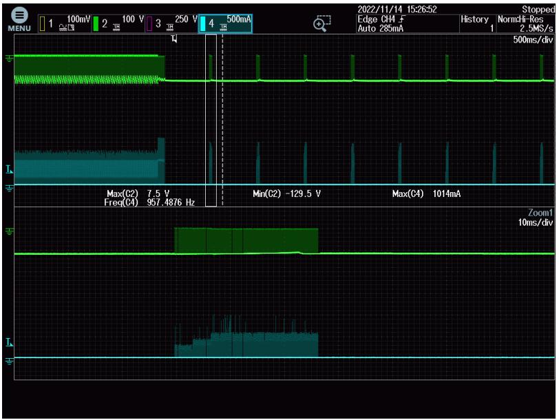

85 VAC

CH3 VDS  
CH4 IDS

$$
V _ {D S \_ M A X} = 1 2 9. 5 \mathrm{V}
$$

$$
I _ {D S \_ M A X} = 1. 0 1 4 \mathrm{A}
$$

## Test Condition:

➢ Full Load  
➢ 输出短路

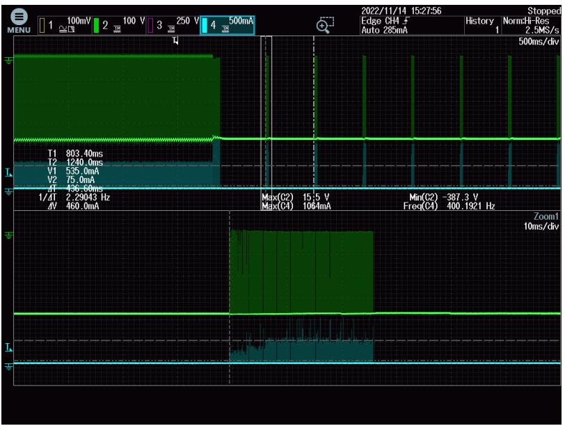

265 VAC

CH3 VDS  
CH4 IDS

$$
V _ {D S \_ M A X} = 3 8 7. 3 \mathrm{V}
$$

$$
I _ {D S \_ M A X} = 1. 0 6 4 \mathrm{A}
$$

## Test Condition:

➢ Full Load  
➢ 输出短路

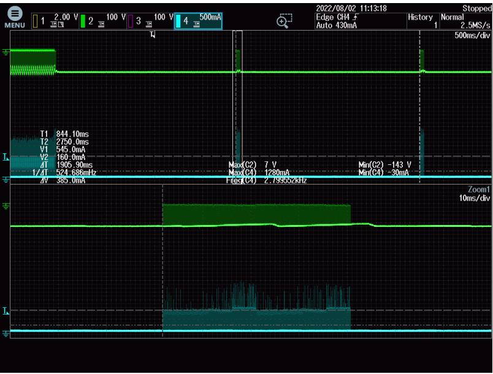

85 VAC  
265 VAC

CH3 VDS  
CH4 IDS

$$
V _ {D S \_ M A X} = 1 4 3 \mathrm{V}
$$

$$
I _ {D S \_ M A X} = 1. 2 8 \mathrm{A}
$$

## Test Condition:

➢ Full Load  
➢ 输出短路

CH3 VDS  
CH4 IDS

$$
V _ {D S \_ M A X} = 4 0 0 \mathrm{V}
$$

$$
I _ {D S \_ M A X} = 2. 1 2 \mathrm{A}
$$

## Test Condition:

➢ Full Load  
➢ 输出短路

## 输出短路保护 (电感电流波形)

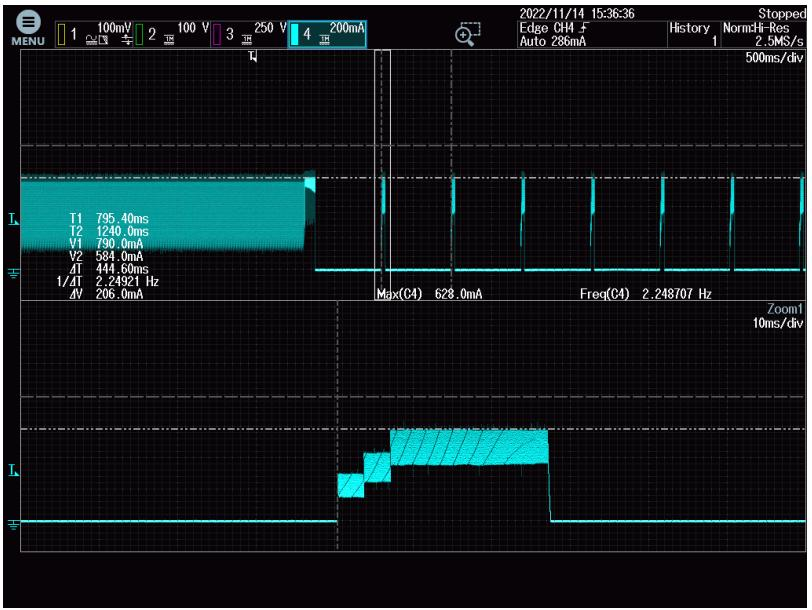

85 VAC  

## Test Condition:

➢ Full Load  
➢ 输出短路

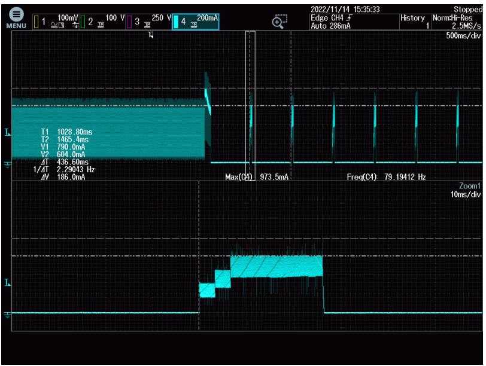

265 VAC  

## Test Condition:

➢ Full Load  
➢ 输出短路

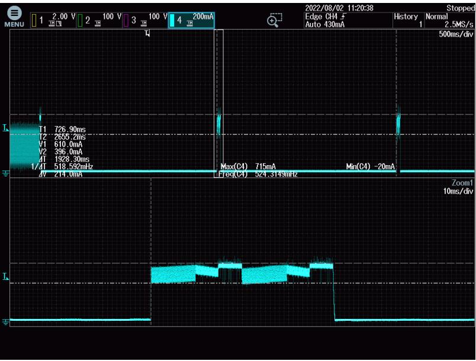

85 VAC  

## Test Condition:

➢ Full Load  
➢ 输出短路

265 VAC  

## Test Condition:

➢ Full Load  
➢ 输出短路

## 温升测试

BP85956P

<table><tr><td rowspan="2">项目</td><td>85VAC</td><td>115VAC</td><td>230VAC</td><td>265VAC</td></tr><tr><td>温度(°C)</td><td>温度(°C)</td><td>温度(°C)</td><td>温度(°C)</td></tr><tr><td>环境温度</td><td>40.2</td><td>38.9</td><td>38.9</td><td>40.4</td></tr><tr><td>BP85956P (U091)</td><td>90.8</td><td>80.3</td><td>91.7</td><td>92.2</td></tr><tr><td>续流二极管 (D094)</td><td>84</td><td>78.8</td><td>83.4</td><td>83.6</td></tr><tr><td>电感磁芯 (L092)</td><td>77</td><td>73.3</td><td>74.8</td><td>74.8</td></tr><tr><td>电感线包 (L092)</td><td>84.7</td><td>80.8</td><td>83.1</td><td>83.4</td></tr><tr><td>输入电解电容 (EC092)</td><td>56.4</td><td>52.3</td><td>53.2</td><td>53.6</td></tr><tr><td>输出电解电容 (EC095)</td><td>50.8</td><td>49.7</td><td>50.2</td><td>49.9</td></tr></table>

PN8034M

<table><tr><td rowspan="2">项目</td><td>85VAC</td><td>115VAC</td><td>230VAC</td><td>265VAC</td></tr><tr><td>温度(°C)</td><td>温度(°C)</td><td>温度(°C)</td><td>温度(°C)</td></tr><tr><td>环境温度</td><td>39</td><td>40</td><td>37.9</td><td>40.2</td></tr><tr><td>PN8034M (U091)</td><td>99.4</td><td>87.4</td><td>87.8</td><td>92.8</td></tr><tr><td>续流二极管 (D094)</td><td>77.6</td><td>74.5</td><td>74.1</td><td>76</td></tr><tr><td>电感磁芯 (L092)</td><td>80.8</td><td>77.6</td><td>78.3</td><td>79.2</td></tr><tr><td>电感线包 (L092)</td><td>78.5</td><td>75.7</td><td>75.7</td><td>77.3</td></tr><tr><td>输入电解电容 (EC092)</td><td>61.3</td><td>57</td><td>54.4</td><td>56.9</td></tr><tr><td>输出电解电容 (EC095)</td><td>50.9</td><td>50.4</td><td>49.2</td><td>50.4</td></tr></table>

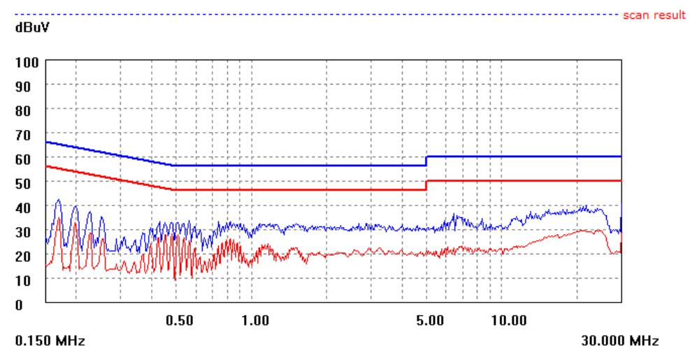

115VAC Line

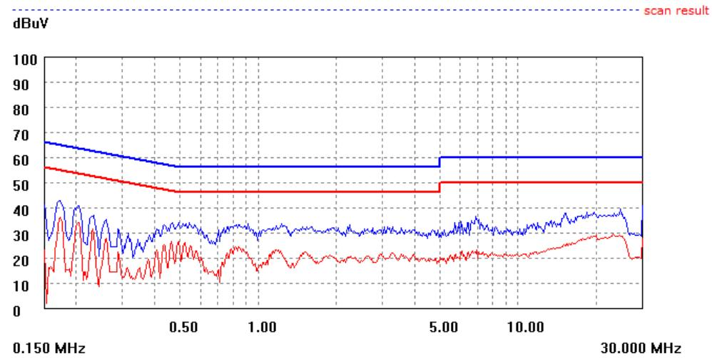

115VAC Neutral

115VAC Line

115VAC Neutral

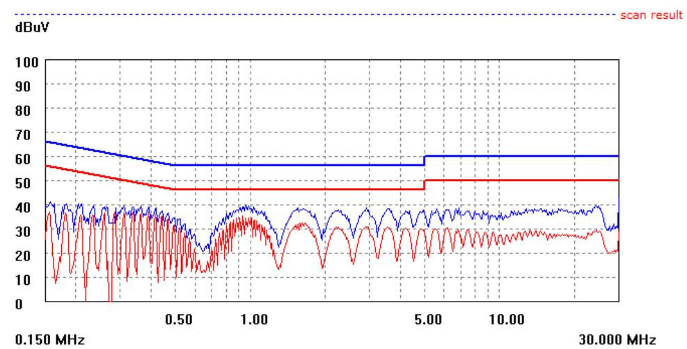

230VAC Line

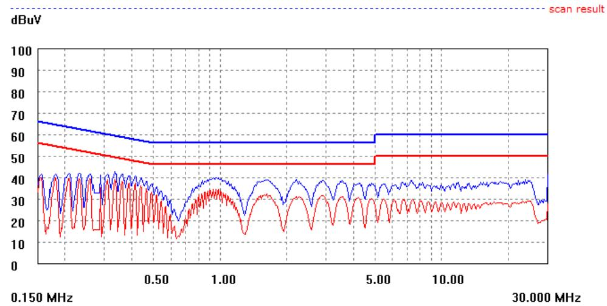

230VAC Neutral

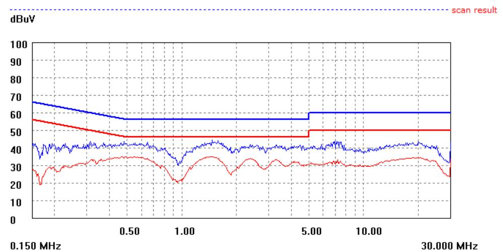

230VAC Line

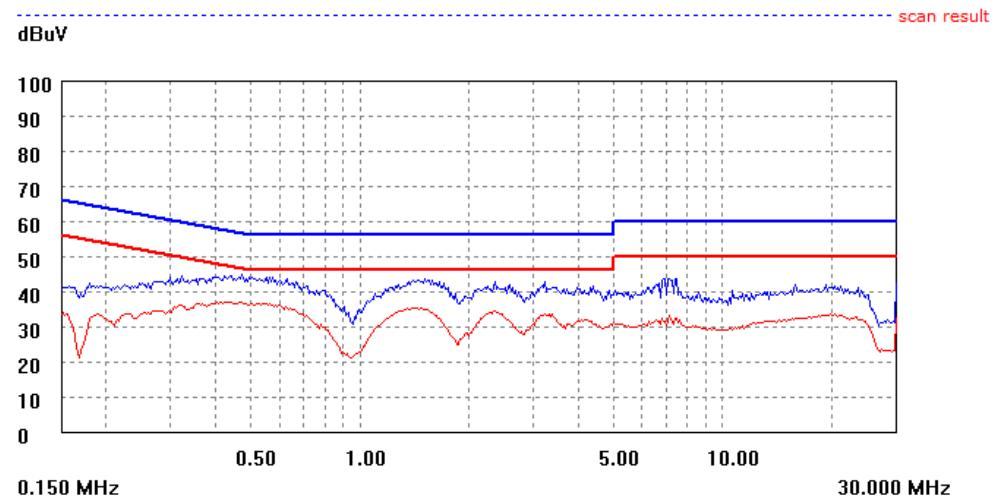

230VAC Neutral

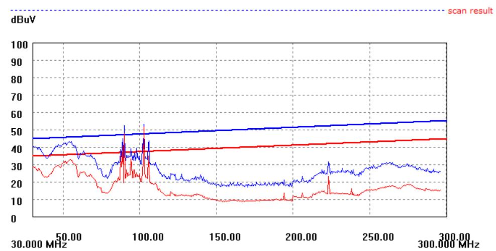

115VAC Neutral  
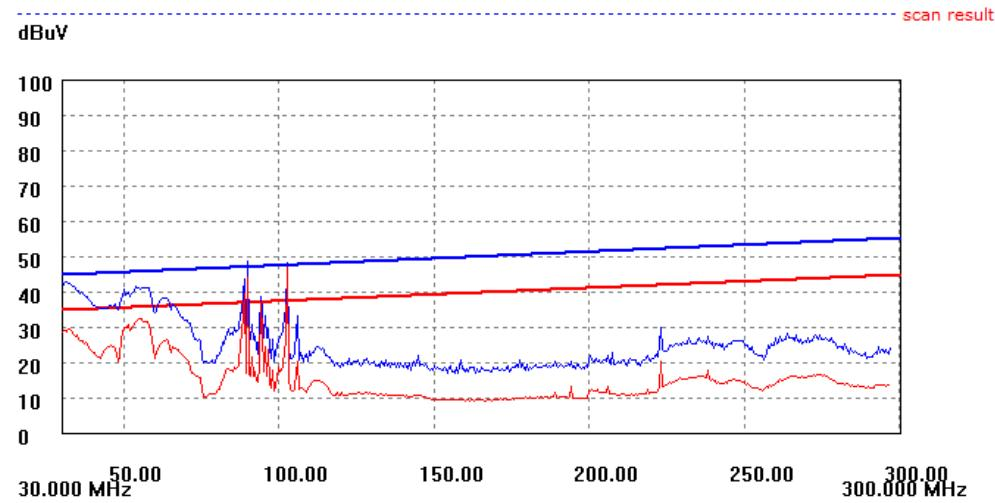

230VAC Neutral

115VAC Neutral  
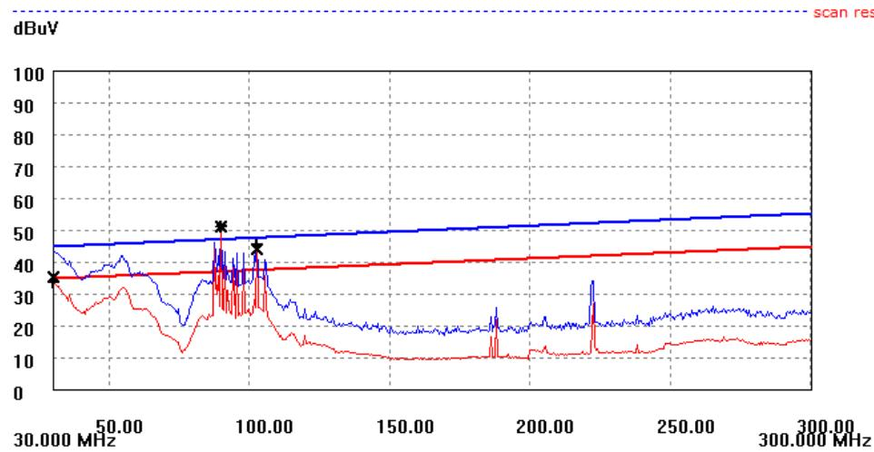

230VAC Neutral

BP85956P

<table><tr><td>差模</td><td>电压</td><td>相位角</td><td>发生器阻抗</td><td>测试次数</td><td>测试结果</td></tr><tr><td>L to N</td><td>+2kV</td><td>0/90/180/270</td><td>2</td><td>10</td><td>Pass</td></tr><tr><td>L to N</td><td>-2kV</td><td>0/90/180/270</td><td>2</td><td>10</td><td>Pass</td></tr></table>

PN8034M

<table><tr><td>差模</td><td>电压</td><td>相位角</td><td>发生器阻抗</td><td>测试次数</td><td>测试结果</td></tr><tr><td>L to N</td><td>+2kV</td><td>0/90/180/270</td><td>2</td><td>10</td><td>Pass</td></tr><tr><td>L to N</td><td>-2kV</td><td>0/90/180/270</td><td>2</td><td>10</td><td>Pass</td></tr></table>

## EFT

BP85956P

<table><tr><td>差模</td><td>电压</td><td>脉冲群持续时间</td><td>脉冲频率</td><td>测试时间</td><td>测试结果</td></tr><tr><td>L N to GND</td><td>+4kV</td><td>15ms</td><td>5kHz</td><td>120s</td><td>Pass</td></tr><tr><td>L N to GND</td><td>-4kV</td><td>15ms</td><td>5kHz</td><td>120s</td><td>Pass</td></tr><tr><td>L N to GND</td><td>+4kV</td><td>0.75ms</td><td>100kHz</td><td>120s</td><td>Pass</td></tr><tr><td>L N to GND</td><td>-4kV</td><td>0.75ms</td><td>100kHz</td><td>120s</td><td>Pass</td></tr><tr><td>L N to GND</td><td>+2kV</td><td>2ms</td><td>38kHz</td><td>120s</td><td>Pass</td></tr><tr><td>L N to GND</td><td>-2kV</td><td>2ms</td><td>38kHz</td><td>120s</td><td>Pass</td></tr><tr><td>L N to GND</td><td>+4kV</td><td>2ms</td><td>38kHz</td><td>120s</td><td>Pass</td></tr><tr><td>L N to GND</td><td>-4kV</td><td>2ms</td><td>38kHz</td><td>120s</td><td>Pass</td></tr></table>

PN8034M

<table><tr><td>差模</td><td>电压</td><td>脉冲群持续时间</td><td>脉冲频率</td><td>测试时间</td><td colspan="2">测试结果</td></tr><tr><td>L N to GND</td><td>+4kV</td><td>15ms</td><td>5kHz</td><td>120s</td><td>Pass</td><td></td></tr><tr><td>L N to GND</td><td>-4kV</td><td>15ms</td><td>5kHz</td><td>120s</td><td>Pass</td><td></td></tr><tr><td>L N to GND</td><td>+4kV</td><td>0.75ms</td><td>100kHz</td><td>120s</td><td>Pass</td><td></td></tr><tr><td>L N to GND</td><td>-4kV</td><td>0.75ms</td><td>100kHz</td><td>120s</td><td>Pass</td><td></td></tr><tr><td>L N to GND</td><td>+2kV</td><td>2ms</td><td>38kHz</td><td>120s</td><td>Pass</td><td></td></tr><tr><td>L N to GND</td><td>-2kV</td><td>2ms</td><td>38kHz</td><td>120s</td><td>Pass</td><td></td></tr><tr><td>L N to GND</td><td>+4kV</td><td>2ms</td><td>38kHz</td><td>120s</td><td>Pass</td><td></td></tr><tr><td>L N to GND</td><td>-4kV</td><td>2ms</td><td>38kHz</td><td>120s</td><td>Pass</td><td></td></tr></table>

BP85956P

<table><tr><td>测试点</td><td>电压(V)</td><td>放电类型</td><td>放电次数</td><td>测试结果</td></tr><tr><td>Vo</td><td>±15kV</td><td>空气放电</td><td>各10次</td><td>Pass</td></tr><tr><td>GND</td><td>±15kV</td><td>空气放电</td><td>各10次</td><td>Pass</td></tr><tr><td>Vo</td><td>±20kV</td><td>空气放电</td><td>各10次</td><td>Pass</td></tr><tr><td>GND</td><td>±20kV</td><td>空气放电</td><td>各10次</td><td>Pass</td></tr></table>

PN8034M

<table><tr><td>测试点</td><td>电压(V)</td><td>放电类型</td><td>放电次数</td><td>测试结果</td></tr><tr><td>Vo</td><td>±15kV</td><td>空气放电</td><td>各10次</td><td>Pass</td></tr><tr><td>GND</td><td>±15kV</td><td>空气放电</td><td>各10次</td><td>Pass</td></tr><tr><td>Vo</td><td>±20kV</td><td>空气放电</td><td>各10次</td><td>Pass</td></tr><tr><td>GND</td><td>±20kV</td><td>空气放电</td><td>各10次</td><td>Pass</td></tr></table>

## 空载功耗和效率

➢ BP85956P PN8034M  
BP85956P PN8034M

## 带载启动

BP85956P PN8034M  
BP85956P PN8034M

## 动态负载

BP85956P PN8034M

## 温升

BP85956P PN8034M

## 开关MOS应力和电感电流

➢ BP85956P MOS PN8034M

## 结论

BP85956P Pin to Pin PN8034M

## THANK YOU FOR WATCHING
