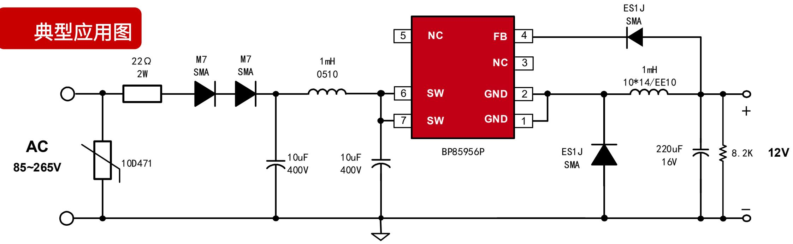
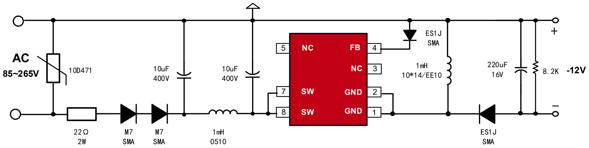
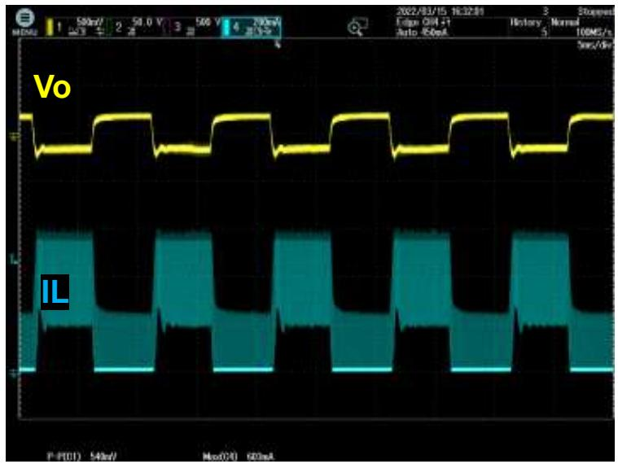
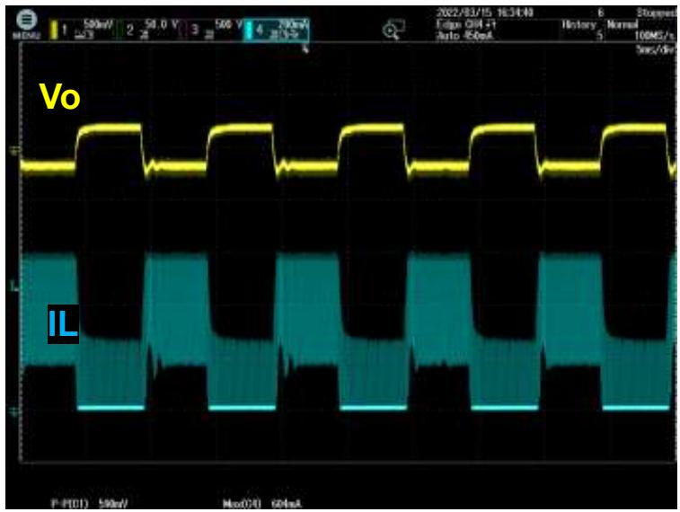
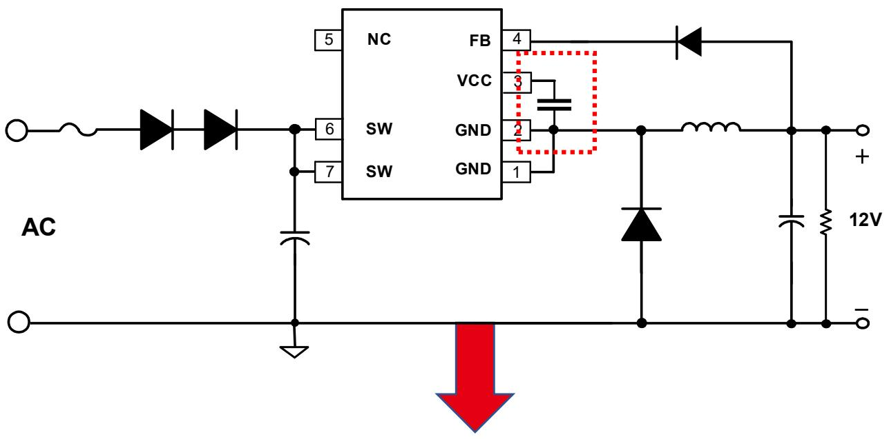
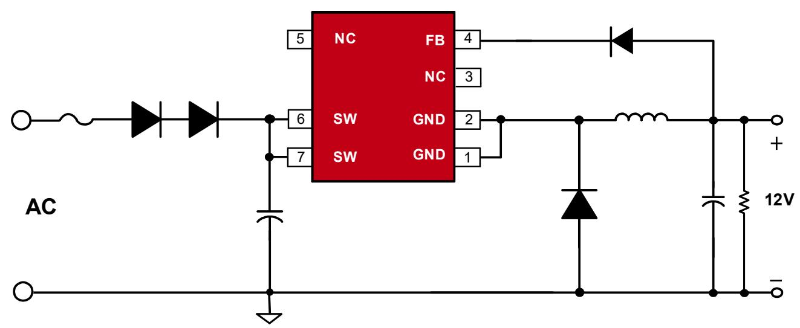
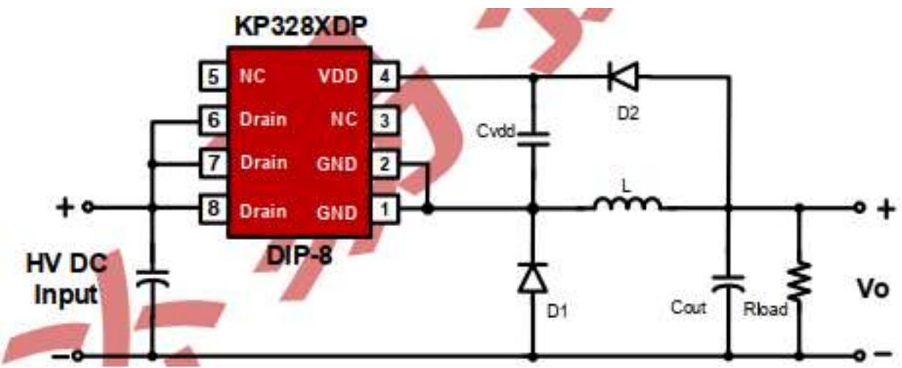
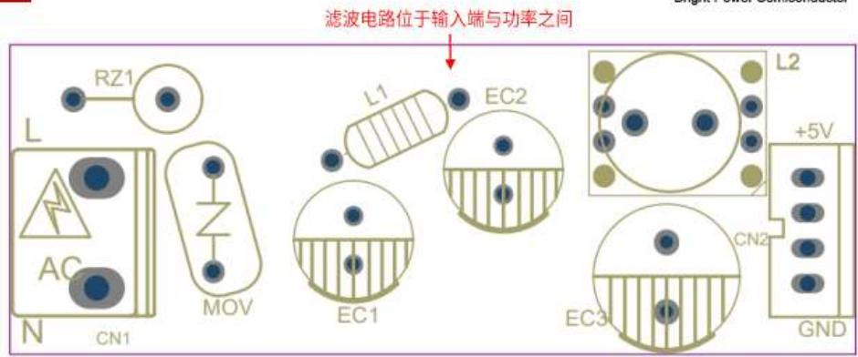
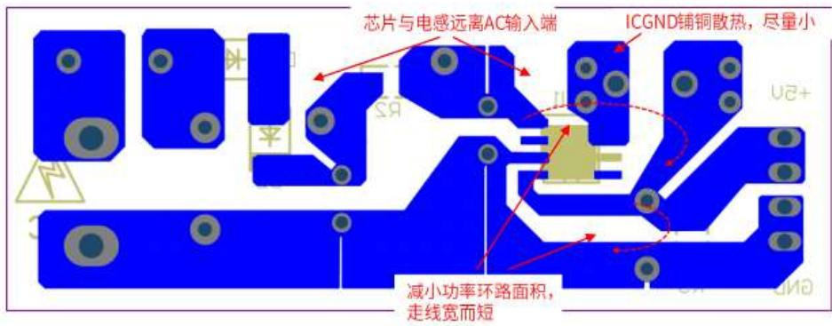

## 小家电：

## BP85956P ±12V350mA 降压芯片推广资料

上海晶丰明源半导体股份有限公司Shanghai Bright Power Semiconductor Co., Ltd.

## 产品特点

高集成度，零外围(启动电路，供电、续流二极管，VCC电容)  
负载调整率好：高低压负载调整率在5%以内；  
动态响应快：10%-90%负载，580mV(230Vac, SR 0.5A/uS)  
低待机功耗：50mW@230Vac

内置650V高压MOS  
完善的保护功能  
芯片采用DIP-7封装

BUCK-BOOST 负压输出

## 产品规格与目标应用

<table><tr><td>Part No.</td><td>BV</td><td>Rds_on</td><td>Output Current Continuous</td><td>MOS Peak Current</td><td>Package</td></tr><tr><td>BP85956P</td><td>650V</td><td>11Ω</td><td>350mA</td><td>600mA</td><td>DIP-7</td></tr></table>

## 目标应用

小家电：暖风机，空气炸锅等；

## 关键指标测试

负载调整率

<table><tr><td colspan="9">调整率</td></tr><tr><td> $V_{IN}(VAC)$  $I_{OUT}(mA)$ </td><td>85</td><td>115</td><td>132</td><td>176</td><td>230</td><td>265</td><td>平均值</td><td>线调整率</td></tr><tr><td>0</td><td>12.04</td><td>12.03</td><td>12.03</td><td>12.01</td><td>12.00</td><td>11.99</td><td>12.02</td><td>0.42%</td></tr><tr><td>50</td><td>11.79</td><td>11.78</td><td>11.77</td><td>11.77</td><td>11.75</td><td>11.75</td><td>11.77</td><td>0.34%</td></tr><tr><td>100</td><td>11.69</td><td>11.68</td><td>11.67</td><td>11.67</td><td>11.65</td><td>11.66</td><td>11.67</td><td>0.34%</td></tr><tr><td>200</td><td>11.56</td><td>11.56</td><td>11.55</td><td>11.56</td><td>11.53</td><td>11.54</td><td>11.55</td><td>0.26%</td></tr><tr><td>300</td><td>11.49</td><td>11.48</td><td>11.47</td><td>11.48</td><td>11.45</td><td>11.46</td><td>11.47</td><td>0.35%</td></tr><tr><td>350</td><td>11.50</td><td>11.47</td><td>11.46</td><td>11.46</td><td>11.44</td><td>11.44</td><td>11.46</td><td>0.52%</td></tr><tr><td>负载调整率</td><td>4.71%</td><td>4.80%</td><td>4.89%</td><td>4.72%</td><td>4.81%</td><td>4.73%</td><td></td><td></td></tr></table>

温升

<table><tr><td rowspan="2">项目</td><td colspan="4">Io=350mA</td></tr><tr><td>85VAC</td><td>115VAC</td><td>230VAC</td><td>265VAC</td></tr><tr><td>环温(°C)</td><td>50</td><td>49</td><td>50</td><td>49</td></tr><tr><td>壳温(°C)</td><td>96</td><td>91</td><td>100</td><td>102</td></tr><tr><td>温升(°C)</td><td>46</td><td>42</td><td>50</td><td>53</td></tr></table>

## 动态

测试条件：10%\~90%动态负载

$\scriptstyle \mathsf { V i n } = 8 5 \lor \mathsf { a c } , \Delta \lor = 5 4 0 \mathsf { m V }$

Vin=265Vac, ∆V=590mV

## BP85956P&P\*8034对比

<table><tr><td>IC型号</td><td>BP85956P</td><td>P*8034</td></tr><tr><td>IC封装</td><td>DIP7</td><td>DIP7</td></tr><tr><td>空载待机功耗</td><td>50mW</td><td>50mW</td></tr><tr><td>外围成本</td><td>零外围</td><td>多了VCC电容</td></tr><tr><td>工作模式</td><td>PFM/PWM</td><td>PFM</td></tr><tr><td>最大稳态输出电流</td><td>350mA</td><td>300mA</td></tr><tr><td>Rds_on (Ω)</td><td>11</td><td>13.5</td></tr><tr><td>MOS BV (V)</td><td>650</td><td>650</td></tr></table>

## 其他竞品

<table><tr><td></td><td>BP85956P</td><td>K*3281DP</td></tr><tr><td>输出电流</td><td>350mA</td><td>350mA</td></tr><tr><td>功率器件</td><td>650V MOS</td><td>650V MOS</td></tr><tr><td>Rdson/ISAT</td><td>11Ω</td><td>10Ω</td></tr><tr><td>外围</td><td>0</td><td>VCC电容</td></tr></table>

## 推广注意事项

BP85956P 无需VCC电容，但是在Layout中建议保留FB电容位置，以便在复杂应用工况中放置FB电容以提高系统可靠性。（详情参考BP852XXD 应用指南中的Layout建议）

## Layout建议

1.IC-GND能起到散热作用，可以铜散热。但是IC-GND是电压动点，在满足散热的条件下铺铜面积应尽量小。同时远离输入交流端，以避免容性耦合产生EMI问题。  
2.输出电感可能产生电磁干扰，建议远离芯片FB脚，同时远离输入端以避免EMI问题。为了芯片和电压动点远离交流输入端，建议将输入电解电容放置在芯片和交流输入端之间。  
3.DRAIN接输入直流母线，为电压静点，可以铺铜散热。建议DRAIN和FB、IC-GND的走线距离大于2mm。  
4.尽量减小功率环路面积以避免EMI干扰并提高系统可靠性。以BUCK为例，建议缩小输入电容、内置MOSFET、电感、输出电容组成的励磁回路，以及电感、输出电容、续流二极管组成的续流回路面积。反馈回路面积与走线长度也应减小以提高可靠性。  
5.建议功率回路的走线宽而短，以提高系统可靠性。例如母线到GND引脚的走线，GND到输出电容的走线等。  
6.反馈回路面积与走线长度也应减小以提高可靠性。  
7.如果由于客观因素（例如PCB板形状等）导致LayOut无法充分满足第5、6条建议时，可以在FB到IC-GND之间放置100nF（104）贴片电容来提高系统可靠性。

## THANK YOU FOR WATCHING
