## BP85956P&PN8034M对比测试 (-12V)

上海晶丰明源半导体股份有限公司

Shanghai Bright Power Semiconductor Co., Ltd.

黄垒

时间： 2022年3月

## 电气特性对比

<table><tr><td></td><td>BP86956P</td><td>PN8034M</td></tr><tr><td>开关频率</td><td>45KHz</td><td>?KHz</td></tr><tr><td>Mosfet BV</td><td>650V</td><td>650V</td></tr><tr><td> $R_{DS\_ON}$ </td><td>11Ω</td><td>13.5Ω</td></tr><tr><td>限流点</td><td>600mA</td><td>590mA</td></tr><tr><td>软启动</td><td>有</td><td>/</td></tr><tr><td>输出过压保护</td><td>有</td><td>有</td></tr><tr><td>输出短路保护</td><td>有</td><td>有</td></tr><tr><td>输出过载保护</td><td>有</td><td>有</td></tr><tr><td>过温保护</td><td>有</td><td>有</td></tr><tr><td>封装</td><td>DIP7</td><td>DIP7</td></tr></table>

## BP85956P&PN8034M对比测试

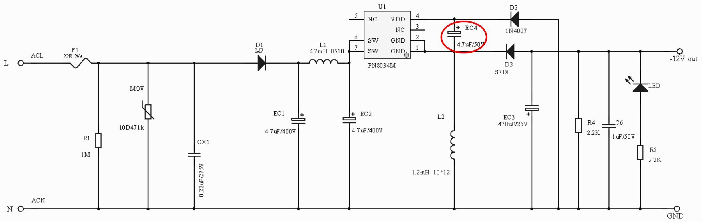

注意：BP85956P测试时，将EC4去掉，直接代换PN8034M测试；

## BP85956P&PN8034M对比测试

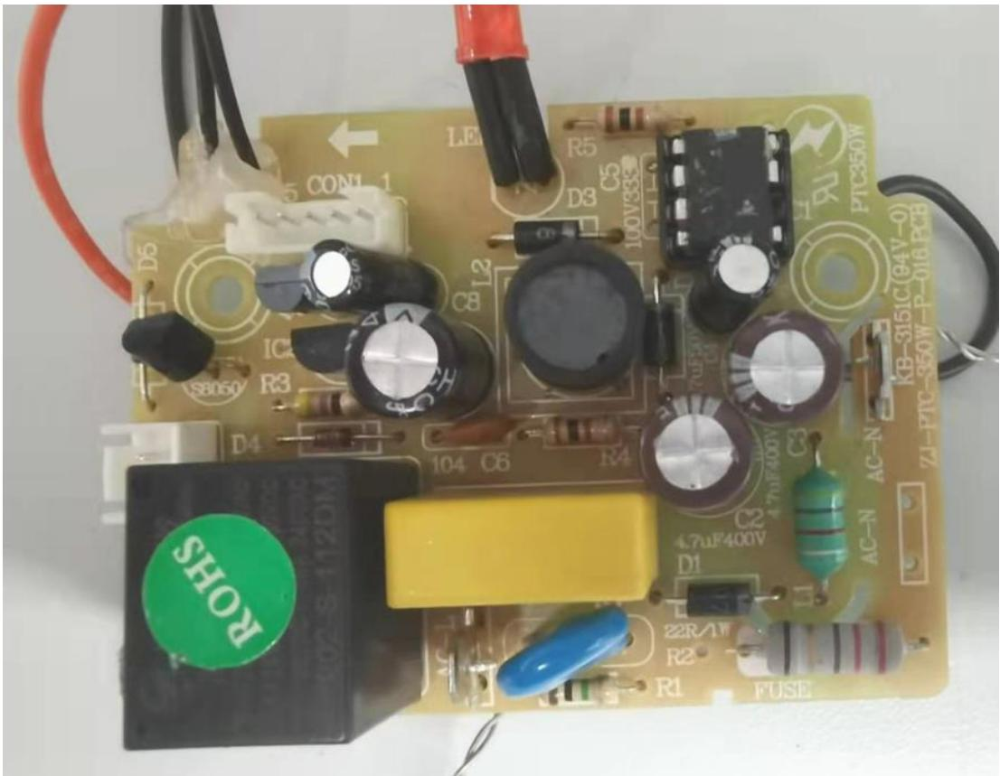

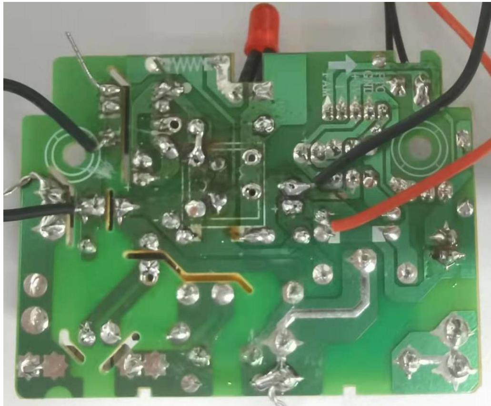

## BP85956P&PN8034M带载对比

<table><tr><td rowspan="2">输出电流\输出电压\输入电压</td><td>85VAC</td><td>265VAC</td></tr><tr><td></td><td></td></tr><tr><td>0.15A</td><td>12.1</td><td>12.09</td></tr><tr><td>0.2A</td><td>12.05</td><td>12.06</td></tr><tr><td>0.25A</td><td>12.02</td><td>12.03</td></tr><tr><td>0.26A</td><td>不能带载启动</td><td>12.04</td></tr><tr><td>0.28A</td><td>11.7</td><td>12.04</td></tr><tr><td>0.3A</td><td>10.3</td><td>12.03</td></tr><tr><td>0.32A</td><td>9.2</td><td>不能带载启动</td></tr><tr><td>0.35A</td><td>OLP</td><td>12.01</td></tr><tr><td>0.45A</td><td>OLP</td><td>OLP</td></tr></table>

PN8034M L=1.2mH

<table><tr><td rowspan="2">输出电流\输出电压\输入电压</td><td>85VAC</td><td>265VAC</td></tr><tr><td></td><td></td></tr><tr><td>0.1A</td><td>12</td><td>11.96</td></tr><tr><td>0.2A</td><td>11.83</td><td>11.83</td></tr><tr><td>0.25A</td><td>11.77</td><td>11.76</td></tr><tr><td>0.28A</td><td>11.76</td><td>11.74</td></tr><tr><td>0.3A</td><td>10.9</td><td>11.74</td></tr><tr><td>0.33A</td><td>不能带载启动</td><td>11.74</td></tr><tr><td>0.35A</td><td>OLP</td><td>11.73</td></tr><tr><td>0.37A</td><td></td><td>不能带载启动</td></tr><tr><td>0.4A</td><td></td><td>8.5</td></tr><tr><td>0.44A</td><td></td><td>OLP</td></tr></table>

BP85956P L=1.2mH

## MOSFET开机波形\_空载

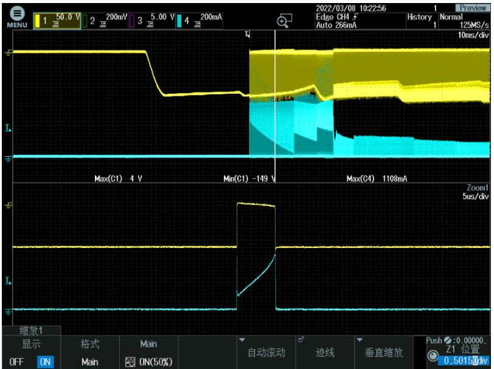

85 VAC

CH3 VDS  
CH4 IDS

$$
\begin{array}{l} V _ {D S \_ M A X} = 1 4 9 \mathrm{V} \\ I _ {D S \_ M A X} = 1. 1 \mathrm{A} \end{array}
$$

## Test Condition:

➢ No Load

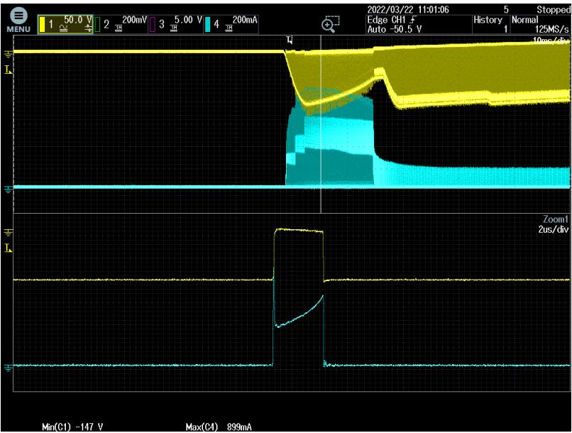

85 VAC

CH3 VDS  
CH4 IDS

$$
\begin{array}{l} \mathrm {V_ {DS\_MAX}} = 1 4 7 \mathrm{V} \\ \mathrm {I_ {DS\_MAX}} = 0. 8 9 9 \mathrm{A} \end{array}
$$

## Test Condition:

➢ No Load

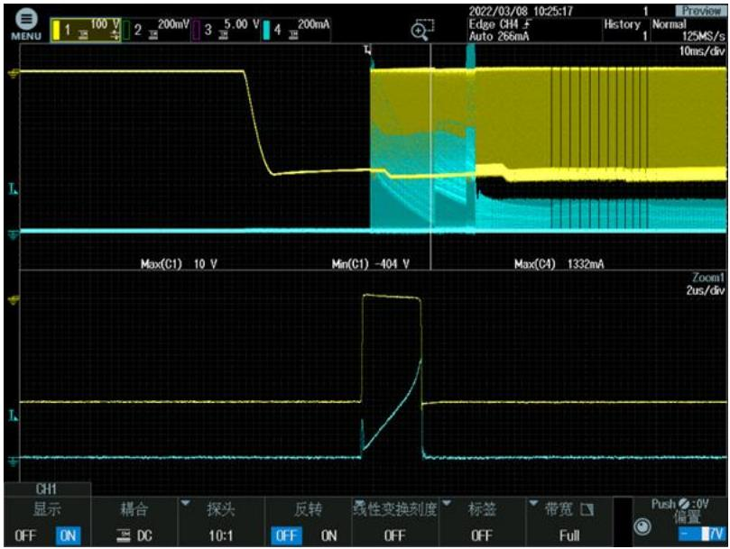

265 VAC

CH3 VDS  
CH4 IDS

$$
\begin{array}{l} \mathrm {V_ {DS\_MAX}} = 4 0 4 \mathrm{V} \\ \mathrm {I_ {DS\_MAX}} = 1. 3 3 2 \mathrm{A} \end{array}
$$

## Test Condition:

➢ No Load

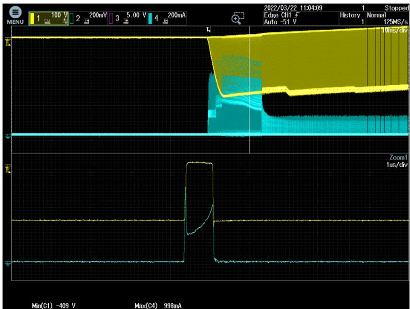

265 VAC

CH3 VDS  
CH4 IDS

$$
\begin{array}{l} \mathrm {V_ {DS\_MAX}} = 4 0 9 \mathrm{V} \\ \mathrm {I_ {DS\_MAX}} = 0. 9 9 8 \mathrm{A} \end{array}
$$

## Test Condition:

➢ No Load

## MOSFET开机波形\_负载

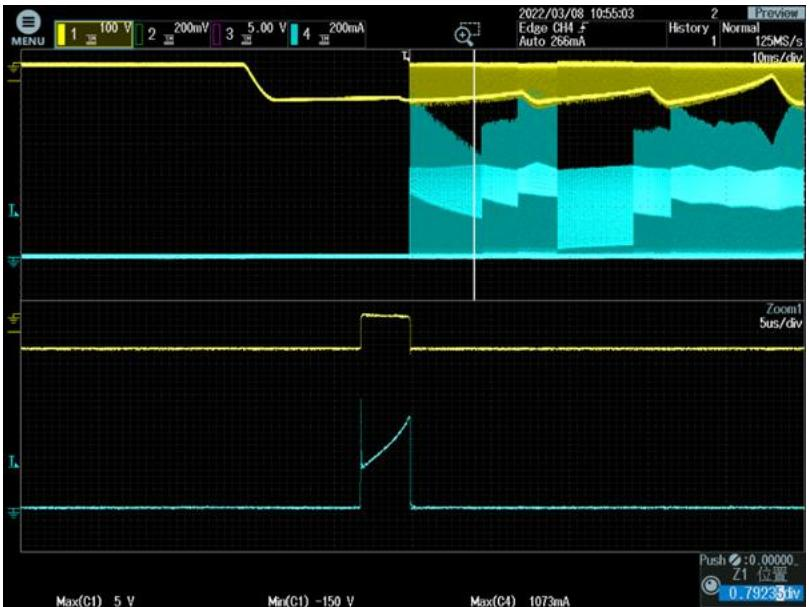

85 VAC

CH3 VDS  
CH4 IDS

$$
\begin{array}{l} \mathrm {V_ {DS\_MAX}} = 1 5 0 \mathrm{V} \\ \mathrm {I_ {DS\_MAX}} = 1. 0 7 \mathrm{A} \end{array}
$$

## Test Condition:

➢ 250mA Load

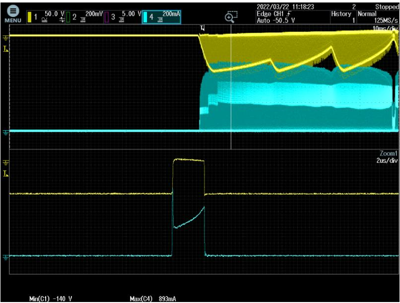

85 VAC

CH3 VDS  
CH4 IDS

$$
\begin{array}{l} \mathrm {V_ {DS\_MAX}} = 1 4 0 \mathrm{V} \\ \mathrm {I_ {DS\_MAX}} = 0. 8 9 3 \mathrm{A} \end{array}
$$

## Test Condition:

➢ 250mA Load

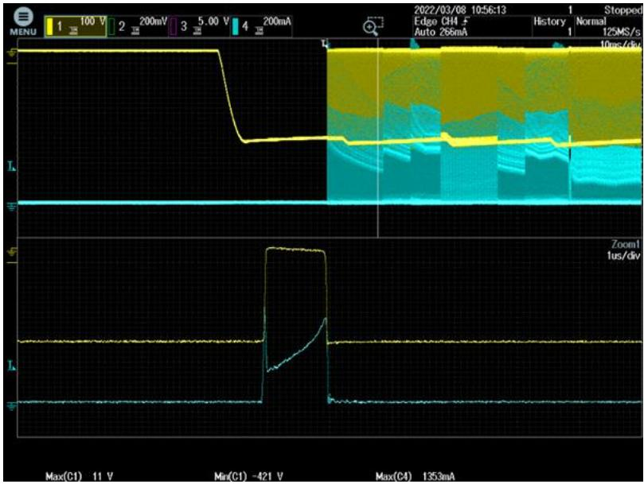

265 VAC

CH3 VDS  
CH4 IDS

$$
\begin{array}{l} \mathrm {V_ {DS\_MAX}} = 4 2 1 \mathrm{V} \\ \mathrm {I_ {DS\_MAX}} = 1. 3 5 3 \mathrm{A} \end{array}
$$

## Test Condition:

➢ 250mA Load

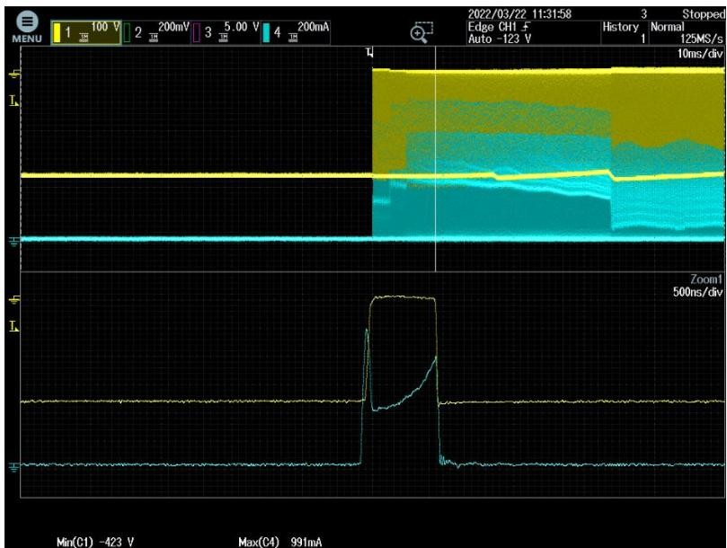

265 VAC

CH3 VDS  
CH4 IDS

$$
\begin{array}{l} \mathrm {V_ {DS\_MAX}} = 4 2 3 \mathrm{V} \\ \mathrm {I_ {DS\_MAX}} = 0. 9 9 1 \mathrm{A} \end{array}
$$

## Test Condition:

➢ 250mA Load

## MOSFET正常工作波形

85 VAC  
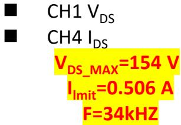

Test Condition:  
➢ 250mA Load

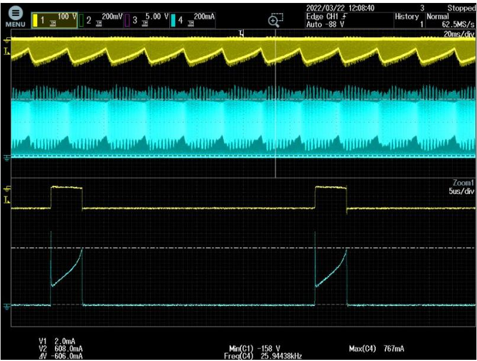

85 VAC  
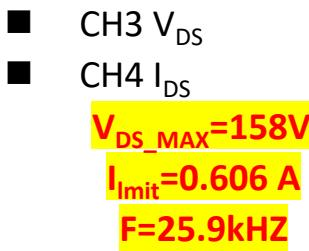

Test Condition:  
➢ 250mA Load

265 VAC  
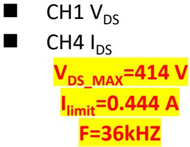

Test Condition:  
➢ 250mA Load

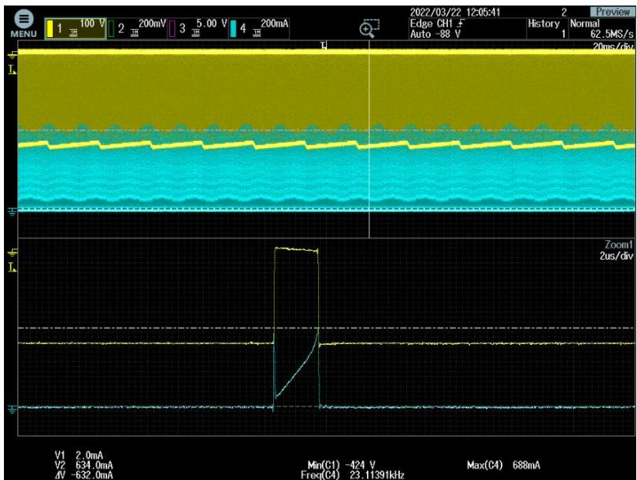

265 VAC  
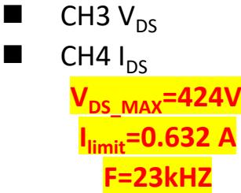

Test Condition:  
➢ 250mA Load

## BP85956P电感改为1mH测试

<table><tr><td rowspan="2">输出电流\输出电压\输入电压</td><td>85VAC</td><td>265VAC</td></tr><tr><td></td><td></td></tr><tr><td>0.15A</td><td>12.1</td><td>12.09</td></tr><tr><td>0.2A</td><td>12.05</td><td>12.06</td></tr><tr><td>0.25A</td><td>12.02</td><td>12.03</td></tr><tr><td>0.26A</td><td>不能带载启动</td><td>12.04</td></tr><tr><td>0.28A</td><td>11.7</td><td>12.04</td></tr><tr><td>0.3A</td><td>10.3</td><td>12.03</td></tr><tr><td>0.32A</td><td>9.2</td><td>不能带载启动</td></tr><tr><td>0.35A</td><td>OLP</td><td>12.01</td></tr><tr><td>0.45A</td><td>OLP</td><td>OLP</td></tr></table>

PN8034M L=1.2mH

<table><tr><td rowspan="2">输出电流\输出电压\输入电压</td><td>85VAC</td><td>265VAC</td></tr><tr><td></td><td></td></tr><tr><td>0.1A</td><td>12</td><td>11.98</td></tr><tr><td>0.2A</td><td>11.88</td><td>11.86</td></tr><tr><td>0.25A</td><td>11.84</td><td>11.82</td></tr><tr><td>0.28A</td><td>11.84</td><td>11.79</td></tr><tr><td>0.3A</td><td>10.9</td><td>11.8</td></tr><tr><td>0.34A</td><td>不能带载启动</td><td>11.81</td></tr><tr><td>0.38A</td><td></td><td>不能带载启动</td></tr><tr><td>0.4A</td><td></td><td>10.3</td></tr></table>

BP85956P L=1mH

## MOSFET正常工作波形

85 VAC

CH1 VDS  
CH4 IDS

  
Test Condition:

➢ 250mA Load

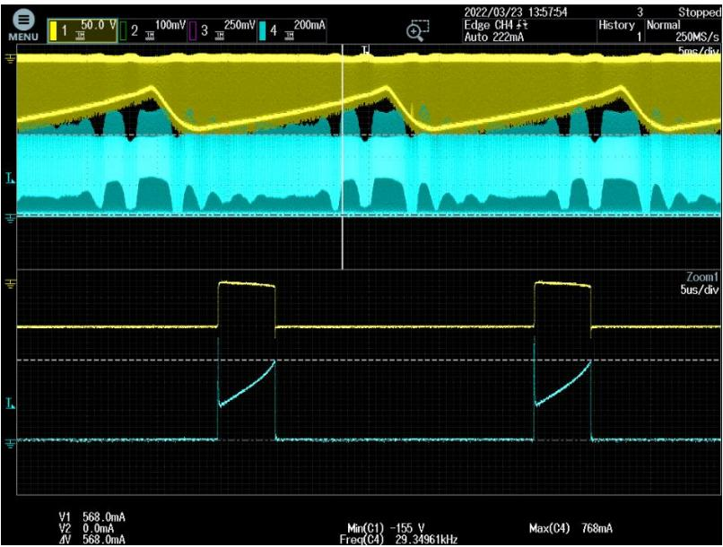

85 VAC

CH1 VDS  
CH4 IDS

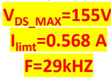  
Test Condition:

➢ 250mA Load

265 VAC

CH1 VDS  
CH4 IDS

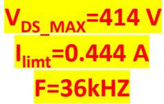  
Test Condition:

➢ 250mA Load

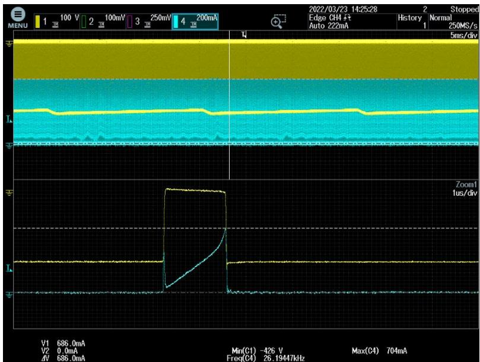

265 VAC

CH1 VDS  
CH4 IDS

  
Test Condition:

➢ 250mA Load

## BP85956P电感改为800uH测试

<table><tr><td rowspan="2">输出电流\输出电压\输入电压</td><td>85VAC</td><td>265VAC</td></tr><tr><td></td><td></td></tr><tr><td>0.15A</td><td>12.1</td><td>12.09</td></tr><tr><td>0.2A</td><td>12.05</td><td>12.06</td></tr><tr><td>0.25A</td><td>12.02</td><td>12.03</td></tr><tr><td>0.26A</td><td>不能带载启动</td><td>12.04</td></tr><tr><td>0.28A</td><td>11.7</td><td>12.04</td></tr><tr><td>0.3A</td><td>10.3</td><td>12.03</td></tr><tr><td>0.32A</td><td>9.2</td><td>不能带载启动</td></tr><tr><td>0.35A</td><td>OLP</td><td>12.01</td></tr><tr><td>0.45A</td><td>OLP</td><td>OLP</td></tr></table>

<table><tr><td rowspan="2">输出电流\输出电压\输入电压</td><td>85VAC</td><td>265VAC</td></tr><tr><td></td><td></td></tr><tr><td>0.1A</td><td>12.04</td><td>12.02</td></tr><tr><td>0.2A</td><td>11.91</td><td>11.86</td></tr><tr><td>0.25A</td><td>11.9</td><td>11.85</td></tr><tr><td>0.28A</td><td>11.3</td><td>11.84</td></tr><tr><td>0.3A</td><td>不能带载启动</td><td>11.84</td></tr><tr><td>0.33A</td><td>9</td><td>11.84</td></tr><tr><td>0.35A</td><td>OLP</td><td>11.83</td></tr><tr><td>0.37A</td><td></td><td>不能带载启动</td></tr><tr><td>0.4A</td><td></td><td>8.5</td></tr><tr><td>0.44A</td><td></td><td>OLP</td></tr></table>

PN8034M L=1.2mH

BP85956P L=800uH

## MOSFET正常工作波形

85 VAC

CH1 VDS  
CH4 IDS

  
Test Condition:

➢ 250mA Load

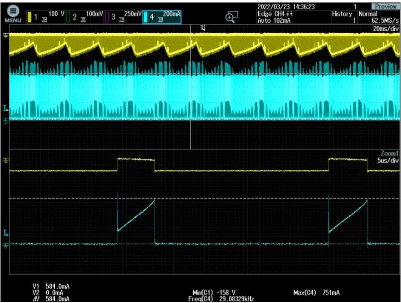

85 VAC

CH1 VDS  
CH4 IDS

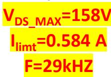  
Test Condition:

➢ 250mA Load

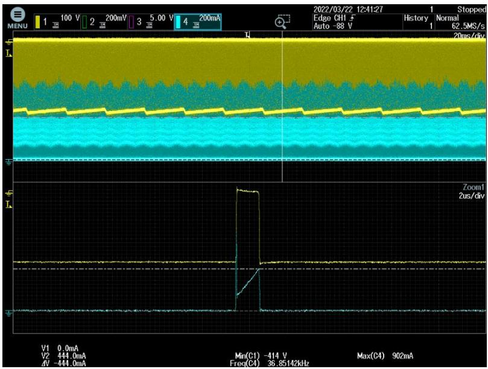

265 VAC

CH1 VDS  
CH4 IDS

  
Test Condition:

➢ 250mA Load

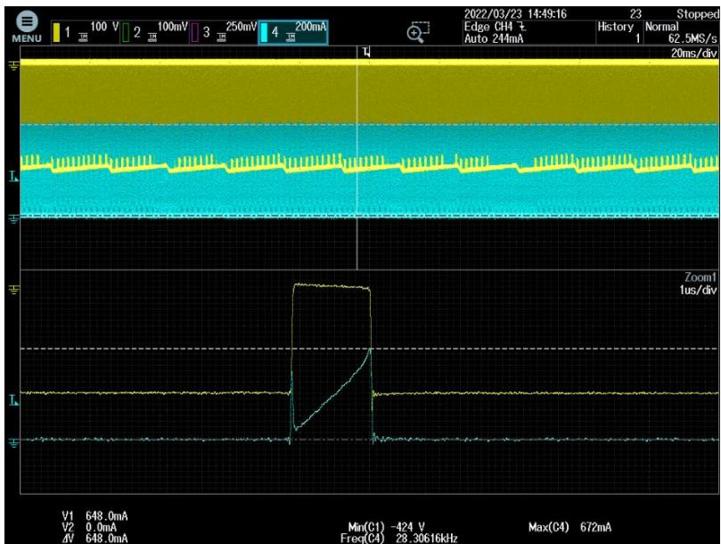

265 VAC

CH1 VDS  
CH4 IDS

  
Test Condition:

➢ 250mA Load

## BP85956P电感改为680uH测试

<table><tr><td rowspan="2">输出电流\输出电压\输入电压</td><td>85VAC</td><td>265VAC</td></tr><tr><td></td><td></td></tr><tr><td>0.15A</td><td>12.1</td><td>12.09</td></tr><tr><td>0.2A</td><td>12.05</td><td>12.06</td></tr><tr><td>0.25A</td><td>12.02</td><td>12.03</td></tr><tr><td>0.26A</td><td>不能带载启动</td><td>12.04</td></tr><tr><td>0.28A</td><td>11.7</td><td>12.04</td></tr><tr><td>0.3A</td><td>10.3</td><td>12.03</td></tr><tr><td>0.32A</td><td>9.2</td><td>不能带载启动</td></tr><tr><td>0.35A</td><td>OLP</td><td>12.01</td></tr><tr><td>0.45A</td><td>OLP</td><td>OLP</td></tr></table>

PN8034M L=1.2mH

<table><tr><td rowspan="2">输出电流\输出电压\输入电压</td><td>85VAC</td><td>265VAC</td></tr><tr><td></td><td></td></tr><tr><td>0.1A</td><td>11.98</td><td>11.97</td></tr><tr><td>0.2A</td><td>11.87</td><td>11.81</td></tr><tr><td>0.25A</td><td>11.87</td><td>11.81</td></tr><tr><td>0.28A</td><td>11.5</td><td>11.82</td></tr><tr><td>0.3A</td><td>10.6</td><td>11.82</td></tr><tr><td>0.33A</td><td>OLP</td><td>11.82</td></tr><tr><td>0.35A</td><td>OLP</td><td>11.78</td></tr><tr><td>0.37A</td><td></td><td>不能带载启动</td></tr><tr><td>0.44A</td><td></td><td>OLP</td></tr></table>

BP85956P L=680uH

## MOSFET正常工作波形

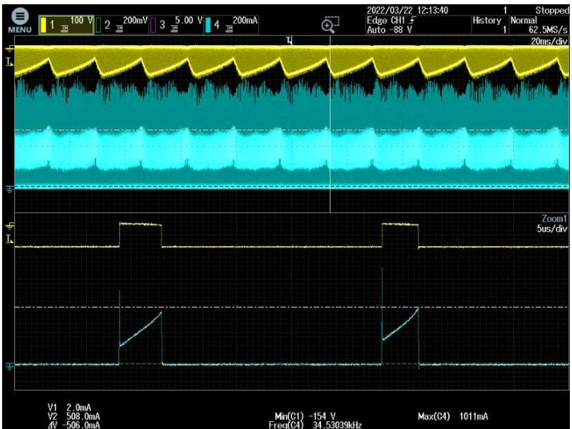

85 VAC

CH1 VDS  
CH4 IDS

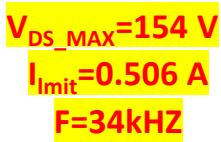  
Test Condition:

➢ 250mA Load

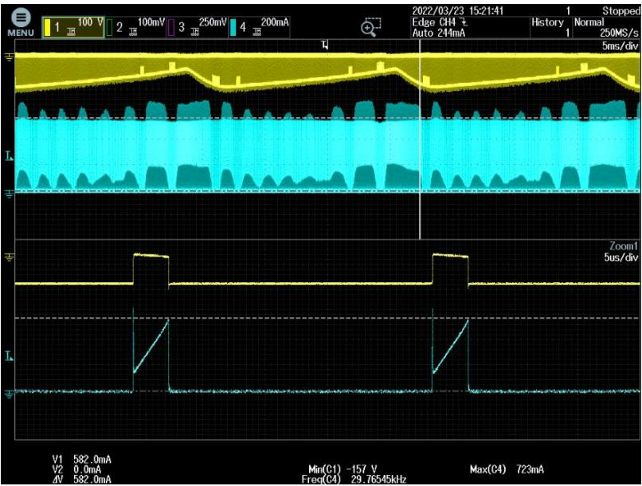

85 VAC

CH3 VDS  
CH4 IDS

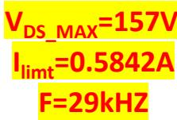  
Test Condition:

➢ 250mA Load

265 VAC

CH1 VDS  
CH4 IDS

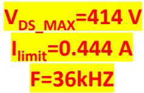  
Test Condition:

➢ 250mA Load

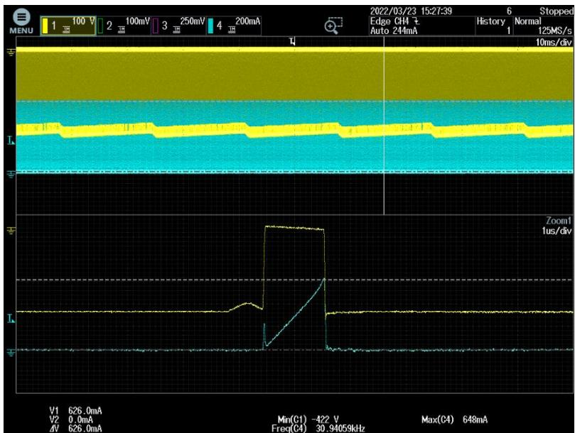

265 VAC

CH3 VDS  
CH4 IDS

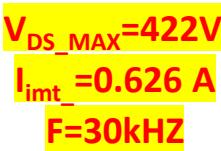  
Test Condition:

➢ 250mA Load

## BP85956P电感改为560uH测试

<table><tr><td rowspan="2">输出电流\输出电压\输入电压</td><td>85VAC</td><td>265VAC</td></tr><tr><td></td><td></td></tr><tr><td>0.15A</td><td>12.1</td><td>12.09</td></tr><tr><td>0.2A</td><td>12.05</td><td>12.06</td></tr><tr><td>0.25A</td><td>12.02</td><td>12.03</td></tr><tr><td>0.26A</td><td>不能带载启动</td><td>12.04</td></tr><tr><td>0.28A</td><td>11.7</td><td>12.04</td></tr><tr><td>0.3A</td><td>10.3</td><td>12.03</td></tr><tr><td>0.32A</td><td>9.2</td><td>不能带载启动</td></tr><tr><td>0.35A</td><td>OLP</td><td>12.01</td></tr><tr><td>0.45A</td><td>OLP</td><td>OLP</td></tr></table>

PN8034M L=1.2mH

<table><tr><td rowspan="2">输出电流\输出电压\输入电压</td><td>85VAC</td><td>265VAC</td></tr><tr><td></td><td></td></tr><tr><td>0.1A</td><td>11.96</td><td>11.97</td></tr><tr><td>0.2A</td><td>11.87</td><td>11.83</td></tr><tr><td>0.25A</td><td>11.87</td><td>11.83</td></tr><tr><td>0.28A</td><td>11.1</td><td>11.84</td></tr><tr><td>0.3A</td><td>10</td><td>11.83</td></tr><tr><td>0.33A</td><td>OLP</td><td>11.77</td></tr><tr><td>0.35A</td><td></td><td>10.3</td></tr><tr><td>0.36A</td><td></td><td>不能带载启动</td></tr><tr><td>0.44A</td><td></td><td>OLP</td></tr></table>

BP85956P L=560uH

## MOSFET正常工作波形

85 VAC

CH1 VDS  
CH4 IDS

  
Test Condition:  
➢ 250mA Load

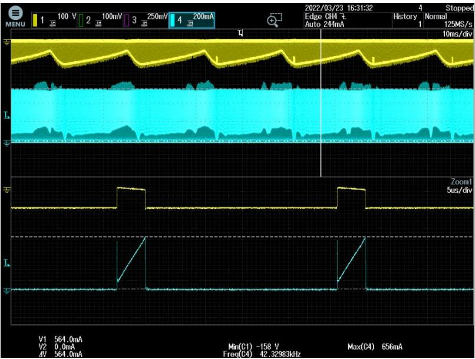

85 VAC

CH1 VDS  
CH4 IDS

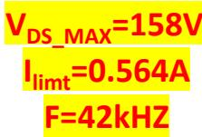  
Test Condition:  
➢ 250mA Load

265 VAC

CH1 VDS  
CH4 IDS

  
Test Condition:  
➢ 250mA Load

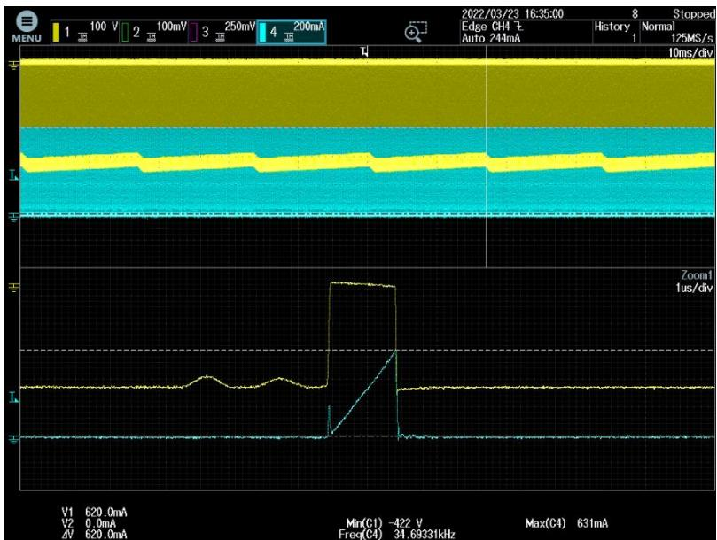

265 VAC

CH1 VDS  
CH4 IDS

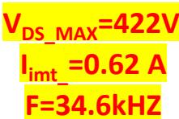  
Test Condition:  
➢ 250mA Load
