## 小家电

BP85957DL ±12V400mA 降压芯片推广资料

时间：2023年09月

A：Y

BPS

晶丰明源

## 典型应用图（Buck）

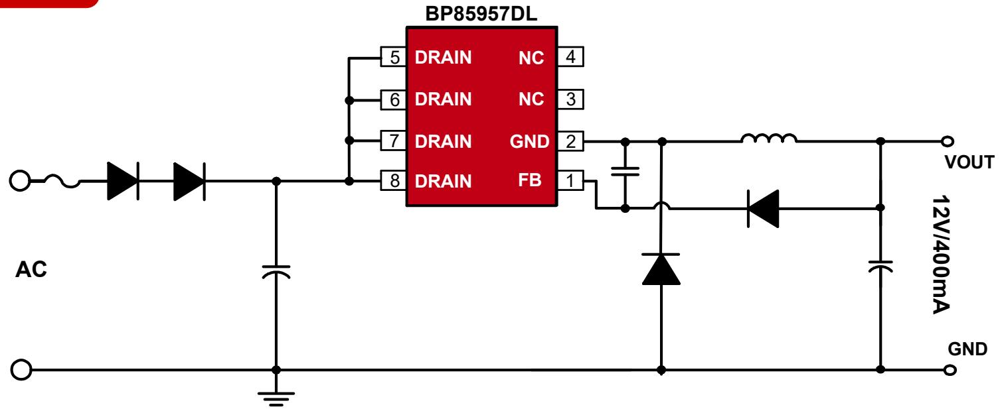

此文档的测试数据均基于Buck拓扑

## 产品特点

内置500V高压MOS  
集成高压启动和自供电电路  
综合性能优，可靠性高

保护功能完善  
SOP8封装

## 典型应用图（Buck Boost）

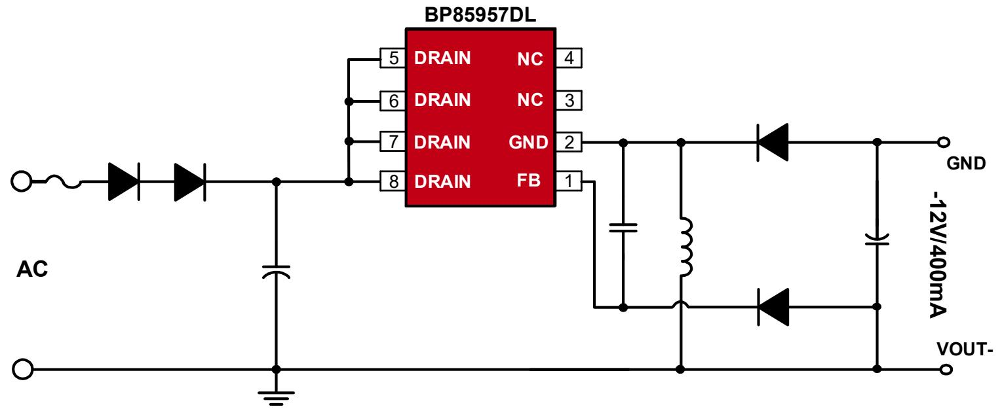

## 产品规格与目标应用

产品规格

<table><tr><td>Part No.</td><td>输入电压</td><td>稳态功率</td><td>峰值功率</td></tr><tr><td rowspan="2">BP85957DL</td><td>150~265VAC</td><td>4.8W(12V/400mA)</td><td>6.6W(12V/550mA)</td></tr><tr><td>85~265VAC</td><td>4.2W(12V/350mA)</td><td>6W(12V/500mA)</td></tr></table>

注：稳态功率在半封闭式75°C 环境下测试(Buck/Buck-boost 应用)，持续时间大于2小时。峰值功率在半封闭式75°C 环境下测试(Buck/Buck-boost 应用)，持续时间大于1分钟。

## 目标应用

小家电  
电机驱动辅助电源  
IOT/智能家居/智能照明

## 替换 \*\*15051SP

竞品\*\*15051SP原理图  
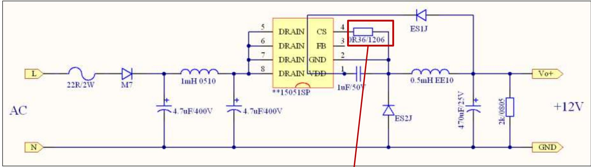

◼ BP85957DL原理图  
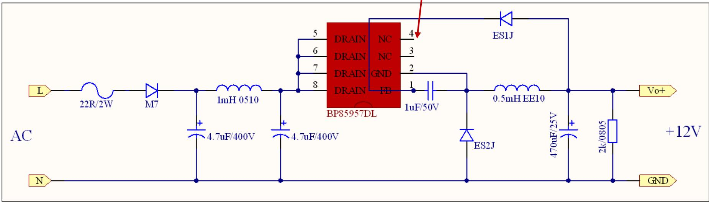

◼ 小结：12V应用，替换\*\*15051SP只需要去掉CS电阻，4号引脚不连接。

## 传导EMI（一个二极管+π滤波）

前级原理图/参数  
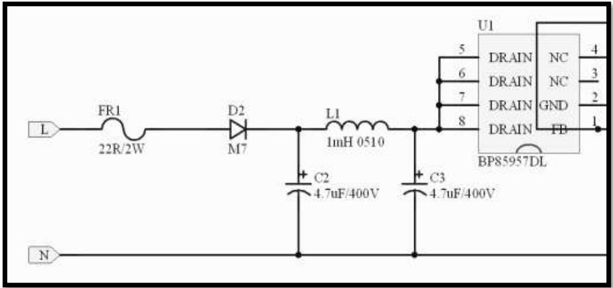

参数：22ohm/2W+M7+π滤波

◼ 小结：一个二极管+π滤波，传导FAIL（超限值）。

EMI测试波形  
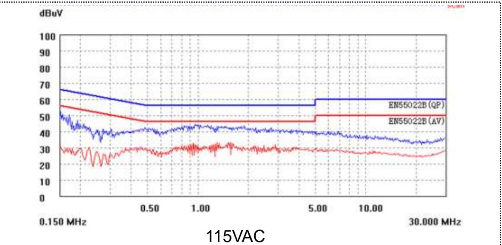

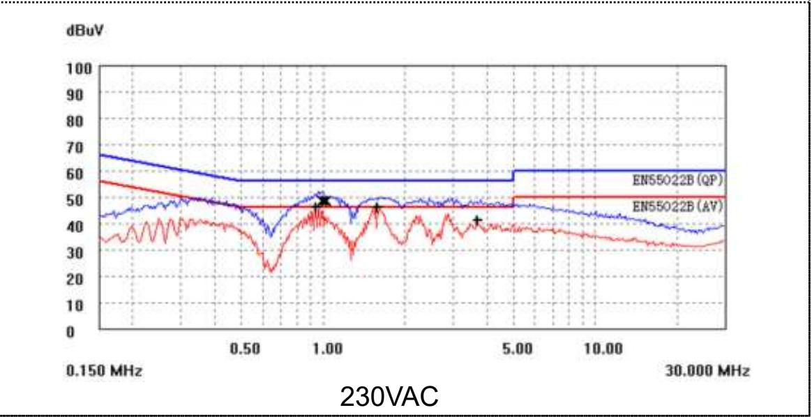

测试波形选择每个电压下较差的一相。

## 传导EMI（一个二极管+100nF X+π滤波）

前级原理图/参数  
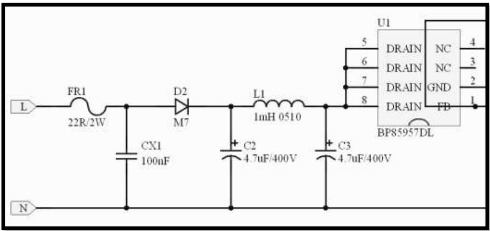

参数：22ohm/2W+100nF X+M7+π滤波

◼ 小结：一个二极管+100nF X+π滤波，传导PASS（余量6dB）。

EMI测试波形  
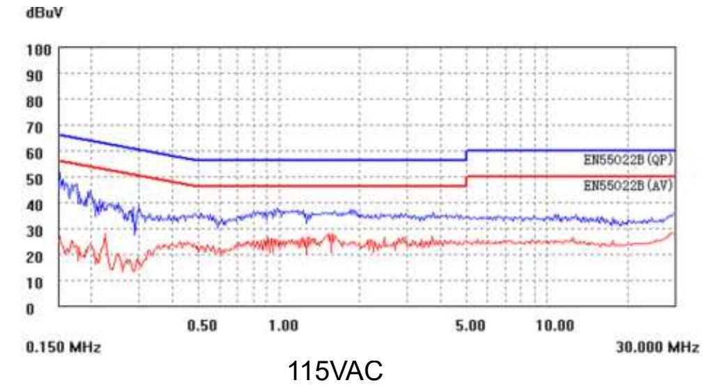

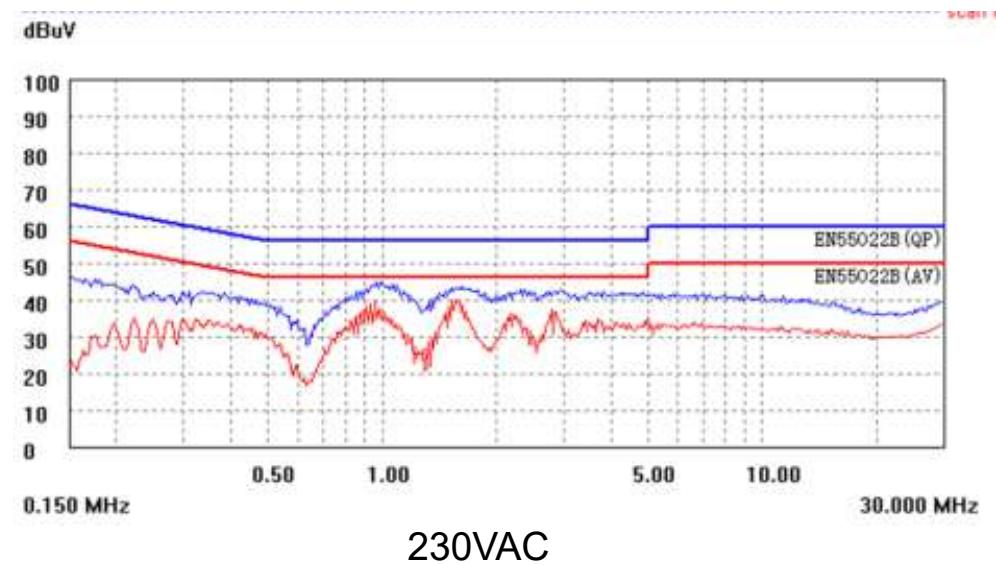

测试波形选择每个电压下较差的一相。

## 传导EMI （两个二极管+π滤波）

前级原理图/参数  
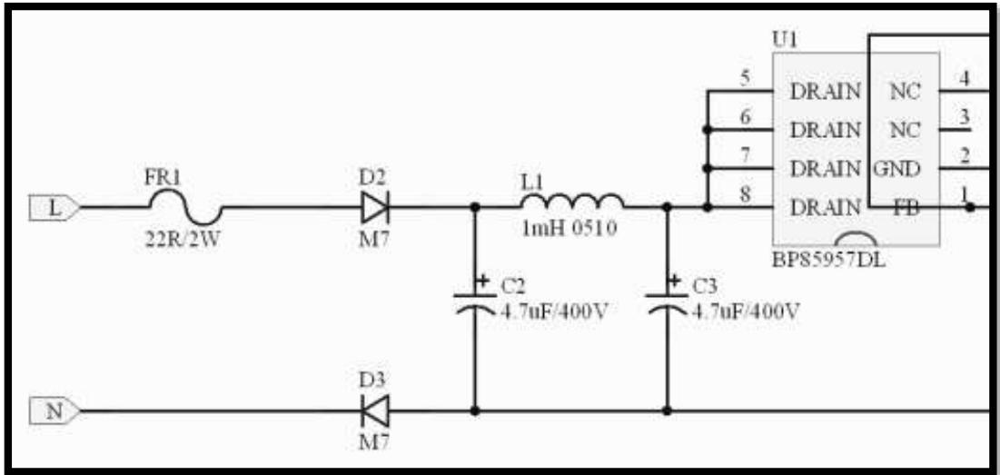

参数：22ohm/2W+2Pcs M7(L、N各1Pcs）+π滤波

小结：两个二极管（L、N上各一个）+π滤波，传导PASS（余量充足） 。

EMI测试波形  
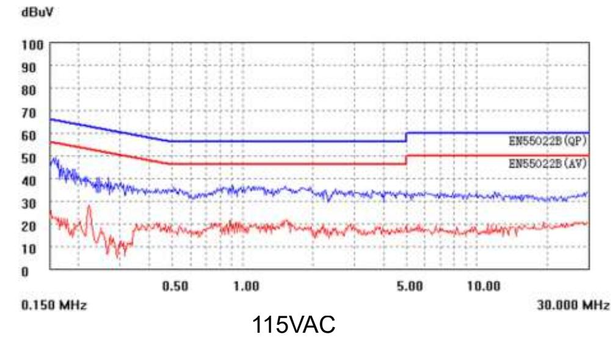

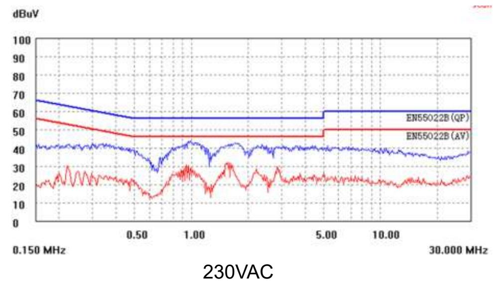

测试波形选择每个电压下较差的一相。

## Surge浪涌测试

<table><tr><td>差模</td><td>电压</td><td>相位角</td><td>测试次数</td><td>测试结果</td></tr><tr><td>L to N</td><td>+1.5kV</td><td>0</td><td>10</td><td>Pass</td></tr><tr><td>L to N</td><td>-1.5kV</td><td>0</td><td>10</td><td>Pass</td></tr><tr><td>L to N</td><td>+1.5kV</td><td>90</td><td>10</td><td>Pass</td></tr><tr><td>L to N</td><td>-1.5kV</td><td>90</td><td>10</td><td>Pass</td></tr><tr><td>L to N</td><td>+1.5kV</td><td>180</td><td>10</td><td>Pass</td></tr><tr><td>L to N</td><td>-1.5kV</td><td>180</td><td>10</td><td>Pass</td></tr><tr><td>L to N</td><td>+1.5kV</td><td>270</td><td>10</td><td>Pass</td></tr><tr><td>L to N</td><td>-1.5kV</td><td>270</td><td>10</td><td>Pass</td></tr></table>

## 前级参数

➢ 22ohm/2W+1 Pcs M7+4.7uF/400V+1mH 0510+4.7uF/400V（华东客户典型参数）

## 测试说明

➢ 按照GB/T17626.5和IEC61000-4-5的最新版本要求进行测试  
➢ 室温环境，230VAC输入，满载条件  
➢ 输入1.2/50us组合波浪涌电压  
➢ 每个测试点重复10次  
➢ 每次间隔时间1分钟  
➢ 试验时样机输出正常（符合A类标准）视为Pass

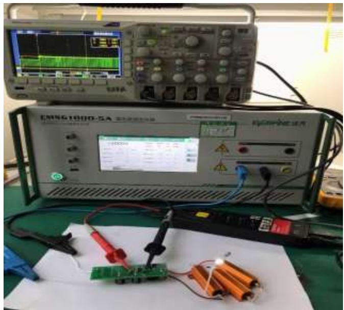

## 推广注意事项

◼ 输出电解电容建议470uF及以上（输出电容过小起机时Vo会出现振荡）。  
◼ 全压应用（90\~265Vac）输入电容至少使用两个6.8uF（输入电容过小，低压输入时温升较高，输出电压纹波较大）。  
高压应用（150\~265Vac）输入电容支持使用两个4.7uF。

上海市浦东新区申江路5005弄星创科技广场3号楼9层

+86-21-51870166

sales@bpsemi.com

www.bpsemi.com

  
微信公众号

  
微信视频号
