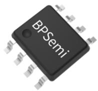
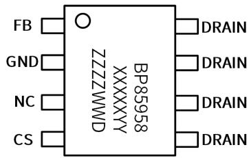
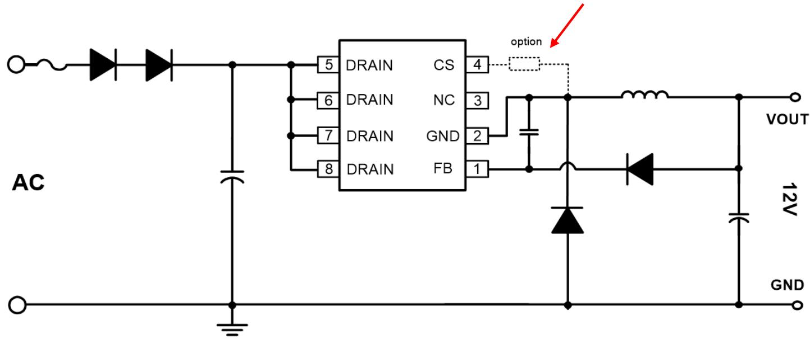
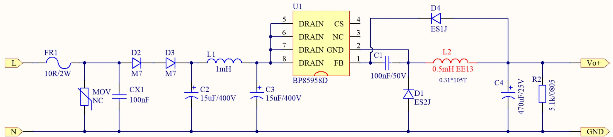
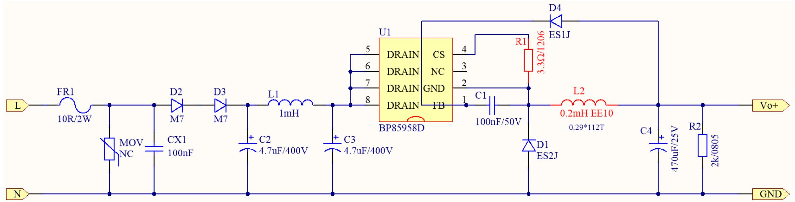
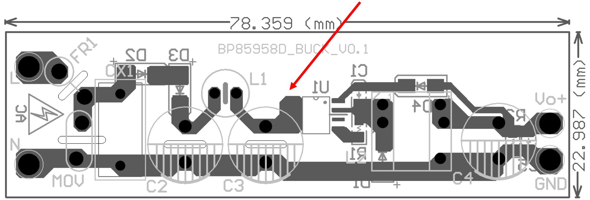
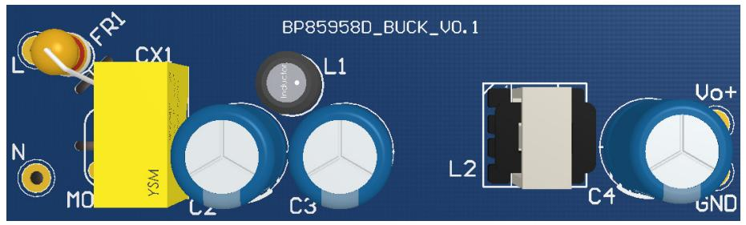
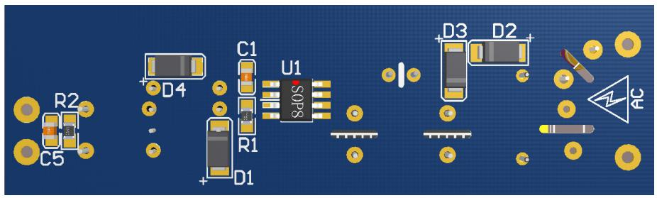

BP85958D推⼴资料

时间：2024年7月29日

'BPS

晶丰明源

## 芯片简介

## 产品特点

内部集成650V高压MOSFET  
集成高压启动和⾃供电电路  
集成输出电压采样  
低待机功耗  
固定12V输出  
内置软启动功能  
可外接CS电阻提高峰值输出能⼒

## 典型应用

小家电辅助电源  
电机驱动辅助电源

## 封装脚位

典型应用图  
外加CS电阻，可提高输出峰值电流  

<table><tr><td>Part No.</td><td>稳态功率1</td><td>稳态功率2</td><td>峰值功率</td></tr><tr><td rowspan="2">BP85958D</td><td>85~265VAC</td><td>176~265VAC</td><td>230VAC</td></tr><tr><td>450mA</td><td>650mA</td><td>1.1A</td></tr></table>

注：  
稳态功率1：在半封闭式50°C 环境下测试，持续时间大于2小时，芯片温升小于60℃；  
稳态功率2：在半封闭式35°C 环境下测试，持续时间大于2小时，芯片未发生过温保护；  
峰值功率：与外围参数相关，方案2中，500uH电感，输出峰值电流可以达到1.1A；

 输入电压：85-264Vac  
带载能⼒：持续450mA， 峰值800mA

注意：Pin4 NC，且Pin3-Pin4 NC时不能接地  

 输入电压：176-264Vac  
 带载能⼒：持续650mA， 峰值850mA

 输入电压：176-264Vac  
带载能⼒：持续650mA， 峰值1.1A

Pin5-Pin8适当地铺铜，增强散热  

## 典型应用方案芯片温升测试

<table><tr><td rowspan="2">方案</td><td rowspan="2">关键参数</td><td>85Vac</td><td>115Vac</td><td>230Vac</td><td>265Vac</td></tr><tr><td> $I_{out}$ =470mA</td><td> $I_{out}$ =520mA</td><td> $I_{out}$ =540mA</td><td> $I_{out}$ =540mA</td></tr><tr><td>典型应用方案1</td><td>L=0.5mH,  $R_{CS}$ =NC</td><td>59K</td><td>57.5K</td><td>56.7K</td><td>59.2K</td></tr></table>

注：IC温升测试条件（ $( 5 0 ^ { \circ } \mathsf { C } \ddagger \bar { \phi }$ 温密闭） $\mathsf C _ { \mathrm { i n } } = 1 5 \mathsf { u F } ^ { \star } 2 , \mathsf { L } = 0 . 5 \mathsf { m H } . \mathsf { E E } 1 3$ ， $\mathsf { C } _ { \mathsf { o u t } } { = } 4 7 0 \mathsf { u F } / 2 5 \mathsf { V }$ ，CS引脚 ${ \mathsf { N C } } _ { \mathsf { c } }$

<table><tr><td rowspan="2">方案</td><td rowspan="2">关键参数</td><td>176Vac</td><td>230Vac</td><td>265Vac</td></tr><tr><td> $I_{out}$ =650mA</td><td> $I_{out}$ =680mA</td><td> $I_{out}$ =700mA</td></tr><tr><td>典型应用方案2</td><td>L=0.2mH,  $R_{CS}$ =3.3Ω</td><td>98.4K</td><td>87.6K</td><td>90.2K</td></tr><tr><td>典型应用方案3</td><td>L=0.5mH,  $R_{CS}$ =2Ω</td><td>86.6K</td><td>92.4K</td><td>99.6K</td></tr></table>

注：IC温升测试条件 $( 3 2 ^ { \circ } \mathsf { C }$ 常温密闭)， $\mathsf { C } _ { \mathrm { i n } } \mathrm { = } 4 . 7 \mathsf { u F } ^ { \star } 2 , \mathsf { C } _ { \mathrm { o u t } } \mathrm { = } 4 7 0 \mathsf { u F } / 2 5 \mathsf { V } _ { \mathrm { c } }$ 。

典型应用1：EE13 0.5mH，CS引脚NC

<table><tr><td> $I_{out}$ </td><td>85Vac</td><td>115Vac</td><td>230Vac</td></tr><tr><td>0mA</td><td>12.56V</td><td>12.57V</td><td>12.55V</td></tr><tr><td>200mA</td><td>12.31V</td><td>12.29V</td><td>12.31V</td></tr><tr><td>500mA</td><td>12.16V</td><td>12.17V</td><td>12.15V</td></tr><tr><td>700mA</td><td>12.14V</td><td>12.12V</td><td>12.10V</td></tr><tr><td>750mA</td><td>12.16V</td><td>12.13V</td><td>12.11V</td></tr><tr><td>800mA</td><td>12.12V</td><td>12.05V</td><td>12.08V</td></tr><tr><td>900mA</td><td>Vbus过低</td><td>12.05V</td><td>12.00V</td></tr><tr><td>1000mA</td><td>OLP</td><td>OLP</td><td>OLP</td></tr></table>

典型应用2：EE10 0.2mH，RCS=3.3Ω

<table><tr><td> $I_{out}$ </td><td>176Vac</td><td>230Vac</td><td>265Vac</td></tr><tr><td>0mA</td><td>12.83V</td><td>12.72V</td><td>12.66V</td></tr><tr><td>200mA</td><td>12.37V</td><td>12.33V</td><td>12.32V</td></tr><tr><td>500mA</td><td>12.19V</td><td>12.22V</td><td>12.20V</td></tr><tr><td>700mA</td><td>12.09V</td><td>12.19V</td><td>12.09V</td></tr><tr><td>750mA</td><td>12.07V</td><td>12.08V</td><td>12.08V</td></tr><tr><td>800mA</td><td>11.75V</td><td>12.05V</td><td>12.06V</td></tr><tr><td>850mA</td><td>10.48V</td><td>11.42V</td><td>11.97V</td></tr><tr><td>950mA</td><td>OLP</td><td>OLP</td><td>OLP</td></tr></table>

典型应用3：EE13 0.5mH，RCS=2Ω

<table><tr><td> $I_{out}$ </td><td>176Vac</td><td>230Vac</td><td>265Vac</td></tr><tr><td>0mA</td><td>12.80V</td><td>12.80V</td><td>12.77V</td></tr><tr><td>200mA</td><td>12.47V</td><td>12.43V</td><td>12.43V</td></tr><tr><td>500mA</td><td>12.29V</td><td>12.29V</td><td>12.28V</td></tr><tr><td>700mA</td><td>12.24V</td><td>12.23V</td><td>12.24V</td></tr><tr><td>900mA</td><td>12.22V</td><td>12.23V</td><td>12.21V</td></tr><tr><td>1100mA</td><td>Vbus过低</td><td>12.21V</td><td>12.19V</td></tr><tr><td>1200mA</td><td></td><td>12.17V</td><td>12.21V</td></tr><tr><td>1300mA</td><td>OLP</td><td>OLP</td><td>OLP</td></tr></table>

 外并Rcs的情况下，0.5mH感量，峰值800mA约29S进OTP，相比200uH峰值带载能⼒更强。

<table><tr><td colspan="3">OTP测试(常温下使用热风枪缓慢加热)</td></tr><tr><td>IC</td><td>OTP点(°C)</td><td>恢复点(°C)</td></tr><tr><td>#1</td><td>146.9</td><td>101.4</td></tr><tr><td>#2</td><td>145.6</td><td>104.3</td></tr><tr><td>#3</td><td>152.0</td><td>101.2</td></tr><tr><td>#4</td><td>152.7</td><td>100.4</td></tr><tr><td>#5</td><td>150.7</td><td>102.2</td></tr><tr><td>#6</td><td>151.4</td><td>104.1</td></tr><tr><td>#7</td><td>150.8</td><td>99.1</td></tr><tr><td>#8</td><td>157.2</td><td>101.8</td></tr></table>

小结：OTP点在140℃以上

上海市浦东新区申江路5005弄星创科技广场3号楼9层

+86-21-51870166

sales@bpsemi.com

www.bpsemi.com

  
微信公众号

  
微信视频号
